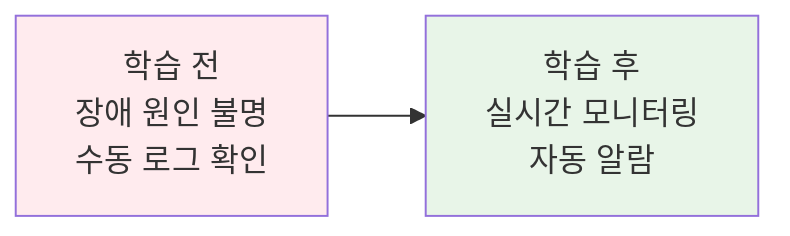
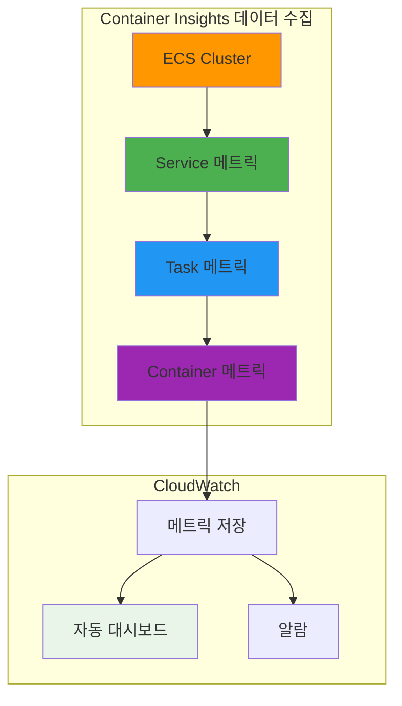
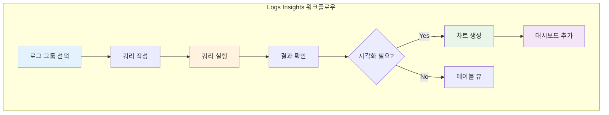

# November Week 2 Day 5 Session 2: ECS 모니터링 & 로깅

<div align="center">

**📊 Container Insights** • **🔍 Logs Insights** • **🚨 CloudWatch 알람**

*실시간 모니터링과 로그 분석으로 안정적인 서비스 운영*

</div>

---

## 🕘 세션 정보
**시간**: 10:00-10:50 (50분)
**목표**: ECS 모니터링 및 로깅 시스템 구축
**방식**: 이론 + 실무 쿼리 예시

## 🎯 학습 목표
### 📚 학습 목표
- **이해 목표**: Container Insights와 CloudWatch Logs의 역할 이해
- **적용 목표**: 실무 모니터링 대시보드 및 알람 구성 방법 습득
- **협업 목표**: 장애 대응을 위한 로그 분석 기법 공유

### 🤔 왜 필요한가? (5분)

**현실 문제 상황**:
- 💼 **실무 시나리오**: "컨테이너가 갑자기 재시작되는데 원인을 모르겠어요"
- 🏠 **일상 비유**: "자동차 계기판 없이 운전하는 것과 같음"
- ☁️ **AWS 아키텍처**: "Container Insights로 실시간 성능 모니터링"
- 📊 **시장 동향**: "관측성(Observability)이 DevOps의 핵심 역량"

**학습 전후 비교**:


---

## 📖 핵심 개념 (35분)

### 🔍 개념 1: Container Insights with Enhanced Observability (12분)

> **정의**: ECS 클러스터의 성능 데이터를 자동으로 수집하고 시각화하는 CloudWatch 기능

**상세 설명**:
- **핵심 원리**: 클러스터 → 서비스 → Task → 컨테이너 레벨까지 자동 수집
- **주요 특징**:
  - 2024년 12월 2일 Enhanced Observability 버전 출시
  - EC2 및 Fargate 모두 지원
  - Task 및 Container 레벨 메트릭 추가
  - 자동 대시보드 생성
- **사용 목적**: 성능 모니터링 및 문제 진단

**⚠️ 중요**: Enhanced Observability 버전 사용을 권장합니다. 기존 버전보다 상세한 가시성을 제공하여 MTTR(평균 복구 시간)을 단축합니다.

**시각적 이해**:


**수집되는 메트릭**:

**클러스터 레벨**:
- `ContainerInstanceCount`: 컨테이너 인스턴스 수
- `ServiceCount`: 서비스 수
- `TaskCount`: 실행 중인 Task 수

**서비스 레벨**:
- `CpuUtilized`: 사용 중인 CPU (vCPU 단위)
- `CpuReserved`: 예약된 CPU
- `MemoryUtilized`: 사용 중인 메모리 (MB)
- `MemoryReserved`: 예약된 메모리
- `DesiredTaskCount`: 원하는 Task 수
- `RunningTaskCount`: 실행 중인 Task 수
- `PendingTaskCount`: 대기 중인 Task 수

**Task 레벨 (Enhanced Observability)**:
- Task별 CPU/메모리 사용률
- 네트워크 트래픽 (RxBytes, TxBytes)
- 스토리지 사용량 (EBS, Ephemeral)

**Container 레벨 (Enhanced Observability)**:
- 컨테이너별 CPU/메모리 사용률
- 컨테이너 재시작 횟수
- 컨테이너 상태

**Terraform 구성**:
```hcl
# Container Insights 활성화
resource "aws_ecs_cluster" "main" {
  name = "production-cluster"

  setting {
    name  = "containerInsights"
    value = "enhanced"  # enhanced 또는 enabled
  }

  tags = {
    Environment = "production"
  }
}

# CloudWatch Log Group (자동 생성됨)
# /aws/ecs/containerinsights/{cluster-name}/performance
```

**AWS CLI로 활성화**:
```bash
# 기존 클러스터에 Container Insights 활성화
aws ecs update-cluster-settings \
  --cluster production-cluster \
  --settings name=containerInsights,value=enhanced \
  --region ap-northeast-2
```

**CloudWatch 대시보드 접근**:
```
AWS Console → CloudWatch → Container Insights
→ Performance monitoring → ECS Clusters
→ 클러스터 선택
```

**자동 생성되는 대시보드**:
1. **Cluster 뷰**: 전체 클러스터 리소스 사용률
2. **Service 뷰**: 서비스별 성능 메트릭
3. **Task 뷰**: Task별 상세 메트릭
4. **Container 뷰**: 컨테이너별 리소스 사용

**비용**:
- Container Insights 메트릭은 **Custom Metrics**로 과금
- 메트릭당 $0.30/월 (처음 10,000개 메트릭)
- 실행 중인 Task가 있을 때만 메트릭 전송

**장점**:
- ✅ 자동 수집 및 대시보드 생성
- ✅ Task/Container 레벨 상세 메트릭
- ✅ CloudWatch Logs 통합
- ✅ 문제 진단 시간 단축

**단점**:
- ⚠️ Custom Metrics 비용 발생
- ⚠️ 실행 중인 Task만 메트릭 전송
- ⚠️ 과거 데이터 소급 적용 불가

---

### 🔍 개념 2: CloudWatch Logs Insights (12분)

> **정의**: SQL과 유사한 쿼리 언어로 CloudWatch Logs를 실시간 분석하는 도구

**상세 설명**:
- **핵심 원리**: 로그 그룹에서 패턴 검색 및 통계 분석
- **주요 특징**:
  - 대화형 쿼리 인터페이스
  - 시각화 지원 (라인 차트, 막대 차트)
  - 자동 필드 검색
  - 저장된 쿼리 재사용
- **사용 목적**: 로그 분석 및 문제 진단

**CloudWatch Logs Insights 쿼리 언어**:

**기본 구조**:
```
fields @timestamp, @message
| filter @message like /ERROR/
| sort @timestamp desc
| limit 20
```

**주요 명령어**:
- `fields`: 표시할 필드 선택
- `filter`: 조건으로 필터링
- `stats`: 통계 계산
- `sort`: 정렬
- `limit`: 결과 개수 제한
- `parse`: 로그에서 필드 추출

**실무 쿼리 예시**:

**1. 에러 로그 검색**:
```
fields @timestamp, @message
| filter @message like /ERROR|Exception|Failed/
| sort @timestamp desc
| limit 100
```

**2. HTTP 5xx 에러 분석**:
```
fields @timestamp, status, request_uri
| filter status >= 500
| stats count() by status, request_uri
| sort count desc
```

**3. 컨테이너 재시작 원인 분석**:
```
fields @timestamp, @message
| filter @message like /OOMKilled|Error|exit code/
| parse @message /exit code (?<exitCode>\d+)/
| stats count() by exitCode
```

**4. 응답 시간 분석**:
```
fields @timestamp, duration
| filter duration > 1000
| stats avg(duration), max(duration), min(duration) by bin(5m)
```

**5. Task 시작 실패 분석**:
```
fields @timestamp, @message
| filter @message like /CannotPullContainerError|ResourceInitializationError/
| parse @message /taskArn: (?<taskArn>[^\s]+)/
| stats count() by taskArn
```

**6. 시간대별 요청 수**:
```
fields @timestamp
| stats count() by bin(1h)
```

**시각화 예시**:


**ECS 이벤트 캡처 (Event Capture)**:

AWS는 ECS 콘솔에서 이벤트 캡처 기능을 제공합니다:

**자동 설정**:
- EventBridge 규칙 자동 생성
- CloudWatch Logs 로그 그룹 생성
- 사전 정의된 쿼리 제공

**캡처되는 이벤트**:
- Service Action Events
- Task Lifecycle Events
- Service Deployment State Changes
- Container Instance State Changes

**Terraform 구성**:
```hcl
# EventBridge 규칙
resource "aws_cloudwatch_event_rule" "ecs_events" {
  name        = "ecs-task-state-change"
  description = "Capture ECS task state changes"

  event_pattern = jsonencode({
    source      = ["aws.ecs"]
    detail-type = ["ECS Task State Change"]
  })
}

# CloudWatch Logs 대상
resource "aws_cloudwatch_event_target" "logs" {
  rule      = aws_cloudwatch_event_rule.ecs_events.name
  target_id = "SendToCloudWatchLogs"
  arn       = aws_cloudwatch_log_group.ecs_events.arn
}

# 로그 그룹
resource "aws_cloudwatch_log_group" "ecs_events" {
  name              = "/aws/events/ecs-task-events"
  retention_in_days = 7
}
```

**저장된 쿼리 활용**:
```hcl
resource "aws_cloudwatch_query_definition" "error_analysis" {
  name = "ECS Error Analysis"

  log_group_names = [
    "/ecs/production-app"
  ]

  query_string = <<-QUERY
    fields @timestamp, @message
    | filter @message like /ERROR|Exception/
    | stats count() by bin(5m)
  QUERY
}
```

**비용**:
- 쿼리 스캔 데이터량 기준 과금
- $0.005 per GB scanned
- 저장된 쿼리는 무료

**장점**:
- ✅ SQL과 유사한 직관적 쿼리
- ✅ 실시간 분석
- ✅ 시각화 지원
- ✅ 저장된 쿼리 재사용

**단점**:
- ⚠️ 스캔 데이터량 기준 과금
- ⚠️ 복잡한 쿼리는 성능 저하
- ⚠️ 15분 쿼리 타임아웃

---

### 🔍 개념 3: CloudWatch 알람 및 대시보드 (11분)

> **정의**: 메트릭 임계값 기반 자동 알림 및 커스텀 대시보드 구성

**상세 설명**:
- **핵심 원리**: 메트릭 임계값 초과 시 SNS 알림 발송
- **주요 특징**:
  - 복합 알람 (Composite Alarms)
  - 이상 탐지 (Anomaly Detection)
  - 자동 조치 (Auto Scaling 연동)
  - 커스텀 대시보드
- **사용 목적**: 장애 사전 감지 및 자동 대응

**CloudWatch 알람 구성**:

**1. 기본 알람 (CPU 사용률)**:
```hcl
resource "aws_cloudwatch_metric_alarm" "cpu_high" {
  alarm_name          = "ecs-service-cpu-high"
  comparison_operator = "GreaterThanThreshold"
  evaluation_periods  = 2
  metric_name         = "CPUUtilization"
  namespace           = "AWS/ECS"
  period              = 300
  statistic           = "Average"
  threshold           = 80
  alarm_description   = "ECS Service CPU 사용률 80% 초과"
  treat_missing_data  = "notBreaching"

  dimensions = {
    ServiceName = aws_ecs_service.app.name
    ClusterName = aws_ecs_cluster.main.name
  }

  alarm_actions = [aws_sns_topic.alerts.arn]
  ok_actions    = [aws_sns_topic.alerts.arn]
}
```

**2. 복합 알람 (여러 조건)**:
```hcl
resource "aws_cloudwatch_composite_alarm" "service_unhealthy" {
  alarm_name          = "ecs-service-unhealthy"
  alarm_description   = "ECS 서비스 비정상 상태"
  actions_enabled     = true
  alarm_actions       = [aws_sns_topic.critical.arn]

  alarm_rule = "ALARM(${aws_cloudwatch_metric_alarm.cpu_high.alarm_name}) OR ALARM(${aws_cloudwatch_metric_alarm.memory_high.alarm_name})"
}
```

**3. 이상 탐지 알람**:
```hcl
resource "aws_cloudwatch_metric_alarm" "request_anomaly" {
  alarm_name          = "ecs-request-count-anomaly"
  comparison_operator = "LessThanLowerOrGreaterThanUpperThreshold"
  evaluation_periods  = 2
  threshold_metric_id = "e1"
  alarm_description   = "요청 수 이상 패턴 감지"

  metric_query {
    id          = "e1"
    expression  = "ANOMALY_DETECTION_BAND(m1, 2)"
    label       = "Request Count (Expected)"
    return_data = true
  }

  metric_query {
    id = "m1"
    metric {
      metric_name = "RequestCount"
      namespace   = "AWS/ApplicationELB"
      period      = 300
      stat        = "Sum"
      dimensions = {
        LoadBalancer = aws_lb.app.arn_suffix
      }
    }
  }

  alarm_actions = [aws_sns_topic.alerts.arn]
}
```

**4. Task 수 알람**:
```hcl
resource "aws_cloudwatch_metric_alarm" "running_tasks_low" {
  alarm_name          = "ecs-running-tasks-low"
  comparison_operator = "LessThanThreshold"
  evaluation_periods  = 1
  metric_name         = "RunningTaskCount"
  namespace           = "ECS/ContainerInsights"
  period              = 60
  statistic           = "Average"
  threshold           = 2
  alarm_description   = "실행 중인 Task 수가 2개 미만"

  dimensions = {
    ServiceName = aws_ecs_service.app.name
    ClusterName = aws_ecs_cluster.main.name
  }

  alarm_actions = [aws_sns_topic.critical.arn]
}
```

**SNS 토픽 구성**:
```hcl
resource "aws_sns_topic" "alerts" {
  name = "ecs-alerts"
}

resource "aws_sns_topic_subscription" "email" {
  topic_arn = aws_sns_topic.alerts.arn
  protocol  = "email"
  endpoint  = "devops@example.com"
}

resource "aws_sns_topic_subscription" "slack" {
  topic_arn = aws_sns_topic.alerts.arn
  protocol  = "lambda"
  endpoint  = aws_lambda_function.slack_notifier.arn
}
```

**커스텀 대시보드**:
```hcl
resource "aws_cloudwatch_dashboard" "ecs_monitoring" {
  dashboard_name = "ECS-Production-Dashboard"

  dashboard_body = jsonencode({
    widgets = [
      {
        type = "metric"
        properties = {
          metrics = [
            ["AWS/ECS", "CPUUtilization", { stat = "Average" }],
            [".", "MemoryUtilization", { stat = "Average" }]
          ]
          period = 300
          stat   = "Average"
          region = "ap-northeast-2"
          title  = "ECS Service Resource Utilization"
        }
      },
      {
        type = "metric"
        properties = {
          metrics = [
            ["ECS/ContainerInsights", "RunningTaskCount"],
            [".", "PendingTaskCount"],
            [".", "DesiredTaskCount"]
          ]
          period = 60
          stat   = "Average"
          region = "ap-northeast-2"
          title  = "ECS Task Counts"
        }
      },
      {
        type = "log"
        properties = {
          query   = "SOURCE '/ecs/production-app' | fields @timestamp, @message | filter @message like /ERROR/ | sort @timestamp desc | limit 20"
          region  = "ap-northeast-2"
          title   = "Recent Errors"
        }
      }
    ]
  })
}
```

**알람 모범 사례**:

**1. 알람 우선순위 설정**:
- **Critical**: 즉시 대응 필요 (Task 0개, 서비스 다운)
- **Warning**: 모니터링 필요 (CPU 80%, 메모리 부족)
- **Info**: 참고용 (배포 완료, 스케일링 발생)

**2. 알람 피로도 방지**:
- 적절한 임계값 설정
- evaluation_periods 활용 (일시적 스파이크 무시)
- treat_missing_data 설정

**3. 자동 조치 연계**:
```hcl
resource "aws_cloudwatch_metric_alarm" "cpu_high_autoscale" {
  alarm_name          = "ecs-cpu-high-autoscale"
  comparison_operator = "GreaterThanThreshold"
  evaluation_periods  = 2
  metric_name         = "CPUUtilization"
  namespace           = "AWS/ECS"
  period              = 300
  statistic           = "Average"
  threshold           = 70

  dimensions = {
    ServiceName = aws_ecs_service.app.name
    ClusterName = aws_ecs_cluster.main.name
  }

  # Auto Scaling 정책 트리거
  alarm_actions = [
    aws_appautoscaling_policy.scale_up.arn,
    aws_sns_topic.alerts.arn
  ]
}
```

**장점**:
- ✅ 사전 장애 감지
- ✅ 자동 알림 및 조치
- ✅ 이상 탐지 (ML 기반)
- ✅ 커스텀 대시보드

**단점**:
- ⚠️ 알람 피로도 위험
- ⚠️ 임계값 설정 어려움
- ⚠️ 복합 알람 복잡도

---

## 💭 함께 생각해보기 (10분)

### 🤝 페어 토론 (5분)

**토론 주제**:
1. **모니터링 전략**: "우리 서비스에 필요한 핵심 메트릭은 무엇일까요?"
   - CPU/메모리 사용률
   - 응답 시간
   - 에러율
   - Task 재시작 횟수

2. **알람 설정**: "어떤 상황에 알람을 받고 싶으신가요?"
   - 즉시 대응이 필요한 Critical 알람
   - 모니터링이 필요한 Warning 알람

3. **로그 분석**: "장애 발생 시 어떤 로그를 먼저 확인하시나요?"
   - 애플리케이션 로그
   - ECS 이벤트 로그
   - ALB 액세스 로그

**페어 활동 가이드**:
- 👥 **자유 페어링**: 경험이나 관심사가 비슷한 사람끼리
- 🔄 **역할 교대**: 각자 경험 공유
- 📝 **핵심 정리**: 실무 적용 가능한 아이디어 메모

### 🎯 전체 공유 (5분)

**인사이트 공유**:
- 효과적인 모니터링 메트릭
- 알람 피로도 방지 방법
- 로그 분석 노하우

**질문 수집**:
- Container Insights 비용 최적화
- Logs Insights 쿼리 작성 팁
- 알람 임계값 설정 기준

### 💡 이해도 체크 질문

- ✅ "Container Insights Enhanced Observability의 장점을 설명할 수 있나요?"
- ✅ "CloudWatch Logs Insights 쿼리를 작성할 수 있나요?"
- ✅ "실무에서 어떤 알람을 설정해야 할지 판단할 수 있나요?"

---

## 🔑 핵심 키워드

### Container Insights
- **Enhanced Observability**: Task/Container 레벨 메트릭 (2024년 12월 출시)
- **자동 대시보드**: 클러스터/서비스/Task/Container 뷰
- **Custom Metrics**: 메트릭당 $0.30/월 과금

### CloudWatch Logs Insights
- **쿼리 언어**: fields, filter, stats, sort, limit, parse
- **시각화**: 라인 차트, 막대 차트
- **비용**: $0.005 per GB scanned

### CloudWatch 알람
- **복합 알람**: 여러 조건 조합
- **이상 탐지**: ML 기반 패턴 감지
- **자동 조치**: Auto Scaling, Lambda 트리거

---

## 📝 세션 마무리

### ✅ 오늘 세션 성과
- [ ] Container Insights 활성화 방법 이해
- [ ] Logs Insights 쿼리 작성 능력 습득
- [ ] CloudWatch 알람 설정 방법 학습
- [ ] 실무 모니터링 전략 수립

### 🎯 다음 세션 준비
- **Session 3**: ECS 비용 최적화
  - Fargate Spot
  - 리소스 최적화
  - 비용 모니터링

### 🔗 참고 자료
- 📘 [Container Insights Enhanced Observability](https://docs.aws.amazon.com/AmazonECS/latest/developerguide/cloudwatch-container-insights.html)
- 📗 [Container Insights Metrics](https://docs.aws.amazon.com/AmazonCloudWatch/latest/monitoring/Container-Insights-metrics-ECS.html)
- 📙 [CloudWatch Logs Insights Query Syntax](https://docs.aws.amazon.com/AmazonCloudWatch/latest/logs/CWL_QuerySyntax.html)
- 📕 [ECS Event Capture](https://docs.aws.amazon.com/AmazonECS/latest/developerguide/task-lifecycle-events.html)
- 🆕 [CloudWatch Anomaly Detection](https://docs.aws.amazon.com/AmazonCloudWatch/latest/monitoring/CloudWatch_Anomaly_Detection.html)

---

<div align="center">

**📊 실시간 모니터링** • **🔍 로그 분석** • **🚨 자동 알람**

*관측성(Observability)으로 안정적인 서비스 운영*

</div>
