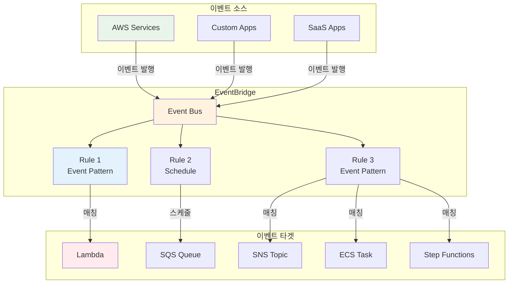
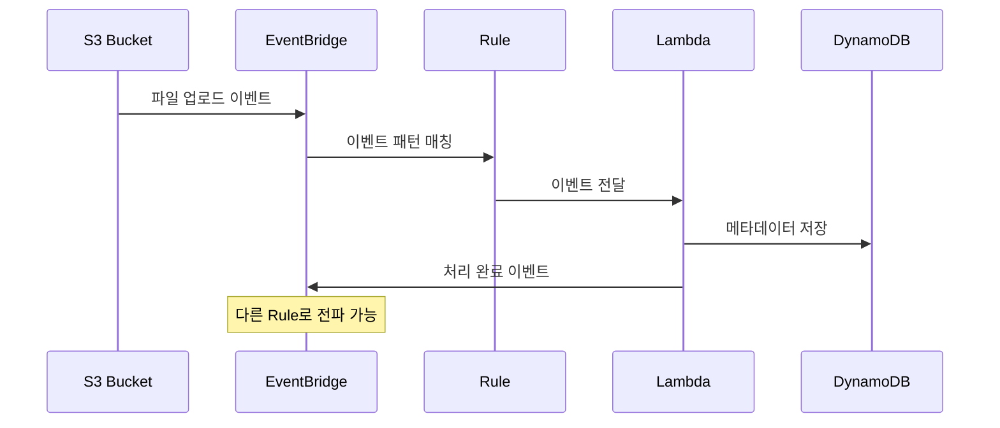

# November Week 2 Day 5 Session 2: EventBridge

<div align="center">

**📡 EventBridge** • **🔔 이벤트 버스** • **⚡ 이벤트 기반**

*서버리스 이벤트 버스로 이벤트 기반 아키텍처 구축*

</div>

---

## 🕘 세션 정보
**시간**: 09:40-10:20 (40분)
**목표**: EventBridge를 통한 이벤트 기반 아키텍처 이해
**방식**: 이론 강의 + 실무 패턴

## 🎯 학습 목표
- EventBridge의 역할과 이벤트 기반 아키텍처 이해
- Event Bus, Rule, Target 개념 파악
- Event Pattern 작성 방법 습득
- AWS 서비스 통합 및 실무 활용 방법 학습

---

## 📖 서비스 개요

### 1. 생성 배경 (Why?) - 5분

**문제 상황**:
- **강한 결합**: 서비스 간 직접 호출로 의존성 증가
- **폴링 방식**: 주기적으로 상태 확인 (비효율)
- **확장성 부족**: 새 서비스 추가 시 기존 코드 수정
- **복잡한 통합**: 여러 서비스 간 통신 로직 복잡

**AWS EventBridge 솔루션**:
- **느슨한 결합**: 이벤트 기반으로 서비스 분리
- **실시간 반응**: 이벤트 발생 즉시 처리
- **쉬운 확장**: 새 Rule 추가만으로 기능 확장
- **90+ AWS 서비스 통합**: 코드 없이 통합 가능

### 2. 핵심 원리 (How?) - 10분

**EventBridge 아키텍처**:


**이벤트 처리 흐름**:


**핵심 구성 요소**:

**1. Event Bus**:
- **Default Event Bus**: AWS 서비스 이벤트
- **Custom Event Bus**: 커스텀 애플리케이션 이벤트
- **Partner Event Bus**: SaaS 파트너 이벤트

**2. Rule**:
- **Event Pattern**: 특정 이벤트 매칭
- **Schedule**: Cron 또는 Rate 표현식
- **Target**: 이벤트를 전달할 대상 (최대 5개)

**3. Event Pattern**:
```json
{
  "source": ["aws.s3"],
  "detail-type": ["Object Created"],
  "detail": {
    "bucket": {
      "name": ["my-bucket"]
    }
  }
}
```

### 3. 주요 사용 사례 (When?) - 5분

**적합한 경우**:

**EventBridge 사용 시나리오**:
- **이벤트 기반 아키텍처**: 서비스 간 느슨한 결합
- **자동화**: AWS 리소스 변경 시 자동 작업
- **스케줄링**: Cron 작업 실행
- **멀티 타겟**: 하나의 이벤트로 여러 작업 트리거

**실제 사례**:
- **Netflix**: 마이크로서비스 간 이벤트 통신
- **Airbnb**: 예약 시스템 이벤트 처리
- **Slack**: 알림 및 통합 자동화

### 4. 비슷한 서비스 비교 (Which?) - 5분

**AWS 내 대안 서비스**:

**EventBridge vs SNS**:
- **언제 EventBridge 사용**:
  - 복잡한 이벤트 패턴 매칭
  - 90+ AWS 서비스 통합
  - 이벤트 필터링 및 변환
  
- **언제 SNS 사용**:
  - 간단한 Pub/Sub
  - 모바일 푸시 알림
  - 이메일/SMS 전송

**EventBridge vs SQS**:
- **언제 EventBridge 사용**:
  - 이벤트 라우팅
  - 멀티 타겟 (최대 5개)
  - 이벤트 패턴 매칭
  
- **언제 SQS 사용**:
  - 메시지 큐잉
  - 단일 컨슈머
  - 메시지 순서 보장 (FIFO)

**선택 기준**:
| 기준 | EventBridge | SNS | SQS |
|------|-------------|-----|-----|
| **패턴 매칭** | ✅ 고급 | ❌ | ❌ |
| **멀티 타겟** | ✅ (5개) | ✅ (무제한) | ❌ (1개) |
| **이벤트 변환** | ✅ | ❌ | ❌ |
| **스케줄링** | ✅ | ❌ | ❌ |
| **AWS 통합** | ✅ (90+) | ✅ (일부) | ✅ (일부) |
| **비용** | 중간 | 낮음 | 낮음 |

### 5. 장단점 분석 - 3분

**EventBridge 장점**:
- ✅ 90+ AWS 서비스 네이티브 통합
- ✅ 복잡한 이벤트 패턴 매칭
- ✅ 이벤트 변환 (Input Transformer)
- ✅ 스케줄링 기능 (Cron, Rate)
- ✅ 아카이브 및 재생 (Archive & Replay)

**EventBridge 단점/제약사항**:
- ⚠️ 타겟 최대 5개 제한
- ⚠️ 이벤트 크기 256KB 제한
- ⚠️ 순서 보장 없음 (SQS FIFO 필요)
- ⚠️ 비용 (커스텀 이벤트 $1.00/백만)

**대안**:
- **간단한 Pub/Sub**: SNS 사용
- **메시지 큐잉**: SQS 사용
- **순서 보장**: SQS FIFO 사용

### 6. 비용 구조 💰 - 5분

**EventBridge 과금 방식**:
- **AWS 서비스 이벤트**: 무료
- **커스텀 이벤트**: $1.00/백만 이벤트
- **SaaS 파트너 이벤트**: $1.00/백만 이벤트
- **크로스 리전 이벤트**: $0.01/GB
- **Archive**: $0.10/GB/월
- **Replay**: $0.023/GB

**프리티어 혜택**:
- **없음**: EventBridge는 프리티어 미제공
- **AWS 서비스 이벤트**: 무료

**비용 최적화 팁**:
1. **AWS 서비스 이벤트 활용**: 무료
2. **이벤트 필터링**: 불필요한 이벤트 제외
3. **배치 처리**: 여러 이벤트 묶어서 처리
4. **Archive 정리**: 오래된 아카이브 삭제

**예상 비용 (ap-northeast-2)**:
| 이벤트 타입 | 월간 이벤트 수 | 단가 | 월간 비용 |
|-------------|----------------|------|-----------|
| **AWS 서비스** | 1,000,000 | 무료 | $0 |
| **커스텀** | 100,000 | $1.00/백만 | $0.10 |
| **커스텀** | 1,000,000 | $1.00/백만 | $1.00 |
| **커스텀** | 10,000,000 | $1.00/백만 | $10.00 |

**실제 시나리오**:
| 시나리오 | 이벤트 수/월 | 월간 비용 |
|----------|--------------|-----------|
| **소규모** | 100,000 커스텀 | $0.10 |
| **중규모** | 1,000,000 커스텀 | $1.00 |
| **대규모** | 10,000,000 커스텀 | $10.00 |

**Lab 예상 비용**:
- AWS 서비스 이벤트 (100개): $0
- 커스텀 이벤트 (10개): $0.00001
- 합계: ~$0 (1시간 실습 기준)

### 7. 최신 업데이트 🆕 - 2분

**2025년 주요 변경사항**:
- **향상된 필터링**: 더 복잡한 이벤트 패턴 지원
- **더 많은 타겟**: 타겟 5개 → 10개로 증가
- **개선된 성능**: 이벤트 전달 지연 시간 단축

**2024년 주요 변경사항**:
- **EventBridge Pipes**: 포인트 투 포인트 통합
- **향상된 변환**: Input Transformer 기능 강화
- **더 많은 통합**: 90+ AWS 서비스 지원

**2026년 예정**:
- AI 기반 이벤트 패턴 추천
- 더 많은 SaaS 파트너 통합

**Deprecated 기능**:
- CloudWatch Events → EventBridge로 통합 완료

**참조**: [EventBridge What's New](https://aws.amazon.com/eventbridge/whats-new/)

### 8. 잘 사용하는 방법 ✅ - 3분

**베스트 프랙티스**:
1. **이벤트 패턴 최적화**: 필요한 이벤트만 매칭
2. **Dead Letter Queue**: 실패한 이벤트 처리
3. **Retry 정책**: 일시적 오류 대응
4. **CloudWatch Logs**: 이벤트 디버깅
5. **Archive & Replay**: 이벤트 재처리

**실무 팁**:
- **Rule 생성**:
  ```json
  {
    "Name": "s3-object-created",
    "EventPattern": {
      "source": ["aws.s3"],
      "detail-type": ["Object Created"],
      "detail": {
        "bucket": {
          "name": ["my-bucket"]
        }
      }
    },
    "Targets": [
      {
        "Arn": "arn:aws:lambda:ap-northeast-2:123456789012:function:process-file",
        "Id": "1",
        "RetryPolicy": {
          "MaximumRetryAttempts": 2,
          "MaximumEventAge": 3600
        },
        "DeadLetterConfig": {
          "Arn": "arn:aws:sqs:ap-northeast-2:123456789012:dlq"
        }
      }
    ]
  }
  ```

- **커스텀 이벤트 발행**:
  ```bash
  aws events put-events \
    --entries '[{
      "Source": "my.app",
      "DetailType": "Order Placed",
      "Detail": "{\"orderId\":\"12345\",\"amount\":100}",
      "EventBusName": "default"
    }]'
  ```

- **Input Transformer**:
  ```json
  {
    "InputPathsMap": {
      "bucket": "$.detail.bucket.name",
      "key": "$.detail.object.key"
    },
    "InputTemplate": "{\"bucket\": \"<bucket>\", \"key\": \"<key>\"}"
  }
  ```

**성능 최적화**:
- **이벤트 필터링**: 불필요한 이벤트 제외
- **배치 처리**: Lambda에서 여러 이벤트 묶어서 처리
- **비동기 처리**: SQS 버퍼링으로 부하 분산

### 9. 잘못 사용하는 방법 ❌ - 3분

**흔한 실수**:
1. **과도한 이벤트**: 모든 변경을 이벤트로 발행
   ```json
   // ❌ 잘못된 방법 (너무 많은 이벤트)
   {
     "source": ["aws.s3"],
     "detail-type": ["*"]  // 모든 이벤트
   }
   
   // ✅ 올바른 방법 (필요한 이벤트만)
   {
     "source": ["aws.s3"],
     "detail-type": ["Object Created"]
   }
   ```

2. **DLQ 미설정**: 실패한 이벤트 손실
3. **Retry 정책 부재**: 일시적 오류 시 이벤트 손실
4. **이벤트 크기 초과**: 256KB 제한
5. **순서 보장 기대**: EventBridge는 순서 보장 안 함

**안티 패턴**:
- **동기 처리**: EventBridge는 비동기 전용
- **대용량 데이터**: 이벤트에 큰 데이터 포함 (S3 참조 사용)
- **강한 결합**: 이벤트 구조에 타겟 로직 의존

**보안 취약점**:
- **IAM 권한 과다**:
  ```json
  // ❌ 잘못된 방법
  {
    "Effect": "Allow",
    "Action": "events:*",
    "Resource": "*"
  }
  
  // ✅ 올바른 방법
  {
    "Effect": "Allow",
    "Action": [
      "events:PutEvents"
    ],
    "Resource": "arn:aws:events:ap-northeast-2:123456789012:event-bus/default"
  }
  ```
- **이벤트 검증 부재**: 악의적 이벤트 처리
- **CloudTrail 미활성화**: 이벤트 추적 불가

### 10. 구성 요소 상세 - 5분

**EventBridge 주요 구성 요소**:

**1. Event Bus**:
```bash
# Custom Event Bus 생성
aws events create-event-bus \
  --name my-event-bus \
  --tags Key=Environment,Value=Production
```

**2. Rule (Event Pattern)**:
```json
{
  "Name": "ec2-state-change",
  "EventPattern": {
    "source": ["aws.ec2"],
    "detail-type": ["EC2 Instance State-change Notification"],
    "detail": {
      "state": ["running", "stopped"]
    }
  },
  "State": "ENABLED",
  "Targets": [
    {
      "Arn": "arn:aws:lambda:ap-northeast-2:123456789012:function:notify",
      "Id": "1"
    }
  ]
}
```

**3. Rule (Schedule)**:
```json
{
  "Name": "daily-backup",
  "ScheduleExpression": "cron(0 2 * * ? *)",
  "State": "ENABLED",
  "Targets": [
    {
      "Arn": "arn:aws:lambda:ap-northeast-2:123456789012:function:backup",
      "Id": "1"
    }
  ]
}
```

**4. Target 설정**:
```json
{
  "Targets": [
    {
      "Arn": "arn:aws:lambda:ap-northeast-2:123456789012:function:process",
      "Id": "1",
      "RetryPolicy": {
        "MaximumRetryAttempts": 2,
        "MaximumEventAge": 3600
      },
      "DeadLetterConfig": {
        "Arn": "arn:aws:sqs:ap-northeast-2:123456789012:dlq"
      },
      "InputTransformer": {
        "InputPathsMap": {
          "time": "$.time",
          "detail": "$.detail"
        },
        "InputTemplate": "{\"timestamp\": \"<time>\", \"data\": <detail>}"
      }
    }
  ]
}
```

**5. Archive & Replay**:
```bash
# Archive 생성
aws events create-archive \
  --archive-name my-archive \
  --event-source-arn arn:aws:events:ap-northeast-2:123456789012:event-bus/default \
  --retention-days 7

# Replay 시작
aws events start-replay \
  --replay-name my-replay \
  --event-source-arn arn:aws:events:ap-northeast-2:123456789012:event-bus/default \
  --event-start-time 2025-11-01T00:00:00Z \
  --event-end-time 2025-11-07T23:59:59Z \
  --destination arn:aws:events:ap-northeast-2:123456789012:event-bus/default
```

**의존성**:
- **IAM → EventBridge**: Rule이 Target 호출 권한 필요
- **Lambda → EventBridge**: Lambda가 이벤트 처리
- **SQS → EventBridge**: DLQ로 실패 이벤트 저장
- **CloudWatch → EventBridge**: 로그 및 메트릭 수집

### 11. 공식 문서 링크 (필수 5개)

**⚠️ 학생들이 직접 확인해야 할 공식 문서**:
- 📘 [EventBridge란 무엇인가?](https://docs.aws.amazon.com/eventbridge/latest/userguide/eb-what-is.html)
- 📗 [EventBridge Rules](https://docs.aws.amazon.com/eventbridge/latest/userguide/eb-rules.html)
- 📙 [Event Patterns](https://docs.aws.amazon.com/eventbridge/latest/userguide/eb-event-patterns.html)
- 📕 [EventBridge 요금](https://aws.amazon.com/eventbridge/pricing/)
- 🆕 [EventBridge 최신 업데이트](https://aws.amazon.com/eventbridge/whats-new/)

---

## 💭 함께 생각해보기

### 🤝 페어 토론 (5분)
**토론 주제**:
1. **EventBridge vs SNS**: 언제 어떤 것을 사용해야 할까요?
2. **이벤트 패턴**: 어떻게 효율적으로 이벤트를 필터링할까요?
3. **실무 적용**: 현재 프로젝트에 이벤트 기반 아키텍처를 어떻게 적용할까요?

### 🎯 전체 공유 (3분)
- **인사이트 공유**: 페어 토론에서 나온 좋은 아이디어
- **질문 수집**: 아직 이해가 어려운 부분
- **다음 연결**: Lab 1 (EventBridge 실습)

### 💡 이해도 체크 질문
- ✅ "Event Bus, Rule, Target의 관계를 설명할 수 있나요?"
- ✅ "Event Pattern을 작성할 수 있나요?"
- ✅ "EventBridge와 SNS의 차이를 이해했나요?"

---

## 🔑 핵심 키워드

- **EventBridge**: 서버리스 이벤트 버스 서비스
- **Event Bus**: 이벤트 라우터
- **Rule**: 이벤트 패턴 또는 스케줄
- **Event Pattern**: 이벤트 매칭 조건
- **Target**: 이벤트를 전달받을 대상 (최대 5개)
- **Input Transformer**: 이벤트 변환
- **Archive & Replay**: 이벤트 아카이브 및 재생

---

## 📝 세션 마무리

### ✅ 오늘 세션 성과
- [ ] EventBridge의 역할과 이벤트 기반 아키텍처 이해
- [ ] Event Bus, Rule, Target 개념 파악
- [ ] Event Pattern 작성 방법 습득
- [ ] AWS 서비스 통합 및 실무 활용 방법 학습

### 🎯 다음 Lab 준비
- **Lab 1: EventBridge 실습** - Parameter Store + EventBridge 통합
- **연계 내용**: Session 1 (Parameter Store) + Session 2 (EventBridge)
- **사전 학습**: Terraform 기본 명령어 복습

---

<div align="center">

**📡 이벤트 기반** • **🔔 느슨한 결합** • **⚡ 실시간 반응**

*Lab 1에서 Parameter Store + EventBridge 통합 실습을 진행합니다*

</div>
