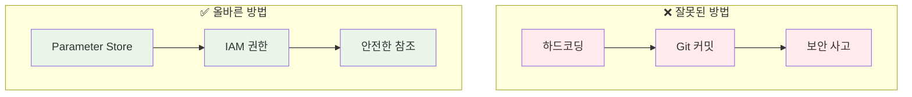
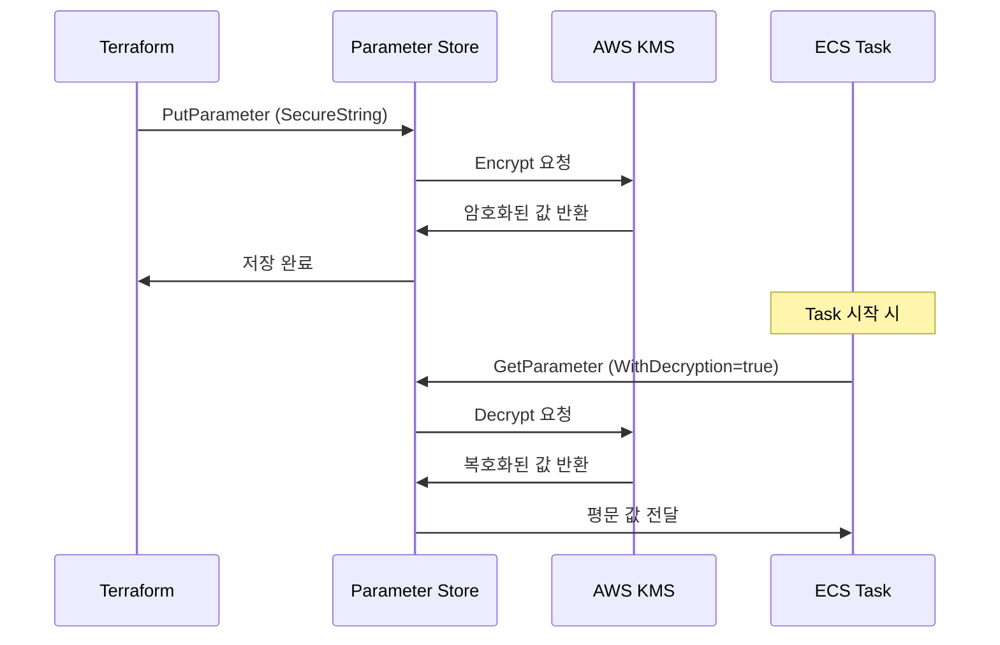
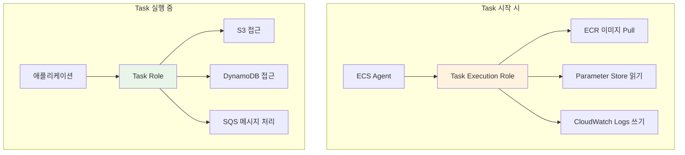

# Week 5 November Day 5 Session 3: Terraform에서 ECS 보안 변수 관리 (11:00-11:50)

<div align="center">

**🔐 민감 정보 보호** • **📦 Parameter Store** • **🔑 IAM 역할 분리** • **🛡️ 보안 베스트 프랙티스**

*Terraform으로 ECS Task에 안전하게 민감 정보 전달하기*

</div>

---

## 🕘 세션 정보
**시간**: 11:00-11:50 (50분)
**목표**: Terraform에서 ECS 보안 변수 관리 방법 이해
**방식**: 이론 + 개념 설명 (실습은 Lab 1에서)

## 🎯 세션 목표

### 📚 학습 목표
- **이해 목표**: Terraform에서 민감 정보를 안전하게 관리하는 방법 이해
- **적용 목표**: Parameter Store와 Secrets Manager의 차이점 파악
- **협업 목표**: 팀 환경에서 보안 변수 관리 전략 수립

### 🛠️ 실무 역량
- 민감 정보 하드코딩 방지
- IAM 역할 최소 권한 원칙 적용
- 환경별 보안 변수 분리 전략
- 보안 감사 및 모니터링

---

## 🤔 왜 필요한가? (5분)

### 💥 실제 보안 사고 사례

**사례 1: GitHub에 AWS 키 노출**
```hcl
# ❌ 절대 하지 말아야 할 것
resource "aws_db_instance" "main" {
  username = "admin"
  password = "MyP@ssw0rd123"  # Git에 커밋됨!
}
```
- **결과**: 몇 분 내에 봇이 탐지하여 악용
- **피해**: 수천 달러의 AWS 비용 청구
- **교훈**: 민감 정보는 절대 코드에 포함하지 않기

**사례 2: CloudWatch Logs에 비밀번호 노출**
```hcl
# ❌ 환경변수로 평문 전달
environment = [
  {
    name  = "DB_PASSWORD"
    value = "MyP@ssw0rd123"  # CloudWatch Logs에 평문 노출!
  }
]
```
- **결과**: 로그를 통해 비밀번호 유출
- **피해**: 데이터베이스 무단 접근
- **교훈**: 민감 정보는 `secrets` 블록 사용

**사례 3: 환경별 변수 혼용**
```bash
# ❌ 개발 환경 변수를 프로덕션에 사용
terraform apply -var="db_password=dev_password"  # 프로덕션에 적용됨!
```
- **결과**: 프로덕션 DB에 개발 비밀번호 설정
- **피해**: 보안 취약점 발생
- **교훈**: 환경별 변수 철저히 분리

### 🎯 올바른 접근 방법



---

## 📖 핵심 개념 (35분)

### 🔍 개념 1: 민감 정보 관리 전략 (12분)

#### 1-1. 민감 정보의 종류

**데이터베이스 자격증명**:
- 사용자명/비밀번호
- 연결 문자열
- 포트 번호

**API 키 및 토큰**:
- 외부 서비스 API 키
- OAuth 토큰
- JWT 시크릿

**암호화 키**:
- KMS 키 ID
- 인증서
- 개인 키

#### 1-2. Terraform에서 민감 정보 관리 방법

**방법 1: AWS Parameter Store (권장)**
```hcl
# Parameter Store에 저장
resource "aws_ssm_parameter" "db_password" {
  name  = "/myapp/prod/db/password"
  type  = "SecureString"
  value = var.db_password  # terraform.tfvars에서 주입
  
  tags = {
    Environment = "production"
    Terraform   = "true"
  }
}

# ECS Task Definition에서 참조
resource "aws_ecs_task_definition" "app" {
  # ... 생략 ...
  
  container_definitions = jsonencode([{
    name  = "app"
    image = "myapp:latest"
    
    # ✅ secrets 블록 사용
    secrets = [
      {
        name      = "DB_PASSWORD"
        valueFrom = aws_ssm_parameter.db_password.arn
      }
    ]
  }])
}
```

**방법 2: AWS Secrets Manager (자동 로테이션 필요 시)**
```hcl
# Secrets Manager에 저장
resource "aws_secretsmanager_secret" "db_credentials" {
  name = "myapp/prod/db/credentials"
  
  rotation_rules {
    automatically_after_days = 30  # 30일마다 자동 로테이션
  }
}

resource "aws_secretsmanager_secret_version" "db_credentials" {
  secret_id = aws_secretsmanager_secret.db_credentials.id
  secret_string = jsonencode({
    username = var.db_username
    password = var.db_password
  })
}

# ECS Task Definition에서 참조
secrets = [
  {
    name      = "DB_CREDENTIALS"
    valueFrom = aws_secretsmanager_secret.db_credentials.arn
  }
]
```

**방법 3: Terraform sensitive 변수**
```hcl
# variables.tf
variable "db_password" {
  type      = string
  sensitive = true  # Terraform 출력에서 마스킹
  description = "Database password"
}

# terraform.tfvars (Git에 커밋하지 않음!)
db_password = "MySecureP@ssw0rd"
```

#### 1-3. 비교표

| 방법 | 비용 | 자동 로테이션 | 버전 관리 | 사용 사례 |
|------|------|---------------|-----------|-----------|
| **Parameter Store** | 무료 (Standard) | ❌ | ✅ | 간단한 설정값, API 키 |
| **Secrets Manager** | $0.40/월 | ✅ | ✅ | DB 자격증명, 자동 로테이션 필요 |
| **Terraform sensitive** | 무료 | ❌ | ❌ | 임시 개발 환경 |

### 🔍 개념 2: Parameter Store 아키텍처 (12분)

#### 2-1. 계층적 파라미터 구조

**권장 구조**:
```
/[application]/
  /[environment]/
    /[component]/
      /[parameter]

예시:
/myapp/
  /dev/
    /db/
      /host
      /port
      /username
      /password
    /api/
      /key
      /secret
  /staging/
    /db/
      /host
      /port
      /username
      /password
  /prod/
    /db/
      /host
      /port
      /username
      /password
```

**Terraform 코드**:
```hcl
# 환경별 변수 정의
locals {
  environment = "prod"
  app_name    = "myapp"
}

# DB 파라미터 생성
resource "aws_ssm_parameter" "db_host" {
  name  = "/${local.app_name}/${local.environment}/db/host"
  type  = "String"
  value = aws_db_instance.main.endpoint
}

resource "aws_ssm_parameter" "db_password" {
  name  = "/${local.app_name}/${local.environment}/db/password"
  type  = "SecureString"
  value = random_password.db_password.result
  
  # KMS 키 지정 (선택사항)
  key_id = aws_kms_key.parameter_store.id
}

# 랜덤 비밀번호 생성
resource "random_password" "db_password" {
  length  = 32
  special = true
}
```

#### 2-2. SecureString 타입과 KMS 암호화

**SecureString 작동 원리**:


**KMS 키 설정**:
```hcl
# 1. KMS 키 생성
resource "aws_kms_key" "parameter_store" {
  description             = "KMS key for Parameter Store encryption"
  deletion_window_in_days = 10
  enable_key_rotation     = true
  
  tags = {
    Name = "parameter-store-key"
  }
}

resource "aws_kms_alias" "parameter_store" {
  name          = "alias/parameter-store"
  target_key_id = aws_kms_key.parameter_store.key_id
}

# 2. SecureString 파라미터 생성 (KMS 키 지정)
resource "aws_ssm_parameter" "db_password" {
  name   = "/myapp/prod/db/password"
  type   = "SecureString"
  value  = var.db_password
  key_id = aws_kms_key.parameter_store.id  # 커스텀 KMS 키 사용
}

# 3. KMS 키 정책 (Task Execution Role에 권한 부여)
resource "aws_kms_key_policy" "parameter_store" {
  key_id = aws_kms_key.parameter_store.id
  
  policy = jsonencode({
    Version = "2012-10-17"
    Statement = [
      {
        Sid    = "Enable IAM User Permissions"
        Effect = "Allow"
        Principal = {
          AWS = "arn:aws:iam::${data.aws_caller_identity.current.account_id}:root"
        }
        Action   = "kms:*"
        Resource = "*"
      },
      {
        Sid    = "Allow ECS Task Execution Role"
        Effect = "Allow"
        Principal = {
          AWS = aws_iam_role.ecs_task_execution_role.arn
        }
        Action = [
          "kms:Decrypt",
          "kms:DescribeKey"
        ]
        Resource = "*"
      }
    ]
  })
}
```

#### 2-3. 버전 관리

**파라미터 버전 관리**:
```hcl
# 파라미터 업데이트 시 자동으로 버전 생성
resource "aws_ssm_parameter" "api_key" {
  name      = "/myapp/prod/api/key"
  type      = "SecureString"
  value     = var.api_key
  overwrite = true  # 업데이트 허용
  
  lifecycle {
    ignore_changes = [value]  # Terraform 외부에서 변경 허용
  }
}

# 특정 버전 참조 (ECS Task Definition)
secrets = [
  {
    name      = "API_KEY"
    valueFrom = "${aws_ssm_parameter.api_key.arn}:1"  # 버전 1 지정
  }
]
```

**버전 조회**:
```bash
# 모든 버전 조회
aws ssm get-parameter-history \
  --name "/myapp/prod/api/key" \
  --query 'Parameters[*].[Version,LastModifiedDate,Value]' \
  --output table

# 특정 버전 조회
aws ssm get-parameter \
  --name "/myapp/prod/api/key:2" \
  --with-decryption
```

### 🔍 개념 3: ECS Task Definition 보안 패턴 (11분)

#### 3-1. environment vs secrets 차이

**environment 블록 (평문)**:
```hcl
# ❌ 민감하지 않은 정보만 사용
environment = [
  {
    name  = "APP_ENV"
    value = "production"
  },
  {
    name  = "LOG_LEVEL"
    value = "info"
  },
  {
    name  = "DB_HOST"
    value = aws_db_instance.main.endpoint
  }
]
```

**secrets 블록 (암호화)**:
```hcl
# ✅ 민감한 정보는 secrets 사용
secrets = [
  {
    name      = "DB_PASSWORD"
    valueFrom = aws_ssm_parameter.db_password.arn
  },
  {
    name      = "API_KEY"
    valueFrom = aws_ssm_parameter.api_key.arn
  },
  {
    name      = "JWT_SECRET"
    valueFrom = aws_secretsmanager_secret.jwt_secret.arn
  }
]
```

**비교표**:
| 항목 | environment | secrets |
|------|-------------|---------|
| **저장 방식** | Task Definition에 평문 | Parameter Store/Secrets Manager 참조 |
| **CloudWatch Logs** | 평문 노출 | 마스킹됨 |
| **IAM 권한** | 불필요 | Task Execution Role 필요 |
| **사용 사례** | 비민감 설정값 | 비밀번호, API 키, 토큰 |
| **비용** | 무료 | Parameter Store 무료, Secrets Manager 유료 |

#### 3-2. IAM 역할 분리 (Task Execution Role vs Task Role)

**Task Execution Role**:
- **목적**: ECS 에이전트가 AWS 서비스 호출
- **권한**: ECR 이미지 pull, CloudWatch Logs 쓰기, Parameter Store 읽기
- **사용 시점**: Task 시작 시

```hcl
# Task Execution Role 생성
resource "aws_iam_role" "ecs_task_execution_role" {
  name = "ecs-task-execution-role"
  
  assume_role_policy = jsonencode({
    Version = "2012-10-17"
    Statement = [{
      Action = "sts:AssumeRole"
      Effect = "Allow"
      Principal = {
        Service = "ecs-tasks.amazonaws.com"
      }
    }]
  })
}

# 기본 정책 연결
resource "aws_iam_role_policy_attachment" "ecs_task_execution_role_policy" {
  role       = aws_iam_role.ecs_task_execution_role.name
  policy_arn = "arn:aws:iam::aws:policy/service-role/AmazonECSTaskExecutionRolePolicy"
}

# Parameter Store 읽기 권한 추가
resource "aws_iam_role_policy" "ecs_task_execution_ssm" {
  name = "ecs-task-execution-ssm"
  role = aws_iam_role.ecs_task_execution_role.id
  
  policy = jsonencode({
    Version = "2012-10-17"
    Statement = [
      {
        Effect = "Allow"
        Action = [
          "ssm:GetParameters",
          "ssm:GetParameter"
        ]
        Resource = [
          "arn:aws:ssm:${data.aws_region.current.name}:${data.aws_caller_identity.current.account_id}:parameter/myapp/prod/*"
        ]
      },
      {
        Effect = "Allow"
        Action = [
          "kms:Decrypt"
        ]
        Resource = [
          aws_kms_key.parameter_store.arn
        ]
      }
    ]
  })
}
```

**Task Role**:
- **목적**: 컨테이너 내 애플리케이션이 AWS 서비스 호출
- **권한**: S3 읽기/쓰기, DynamoDB 접근, SQS 메시지 처리 등
- **사용 시점**: Task 실행 중

```hcl
# Task Role 생성
resource "aws_iam_role" "ecs_task_role" {
  name = "ecs-task-role"
  
  assume_role_policy = jsonencode({
    Version = "2012-10-17"
    Statement = [{
      Action = "sts:AssumeRole"
      Effect = "Allow"
      Principal = {
        Service = "ecs-tasks.amazonaws.com"
      }
    }]
  })
}

# 애플리케이션 권한 (예: S3 읽기)
resource "aws_iam_role_policy" "ecs_task_s3" {
  name = "ecs-task-s3"
  role = aws_iam_role.ecs_task_role.id
  
  policy = jsonencode({
    Version = "2012-10-17"
    Statement = [{
      Effect = "Allow"
      Action = [
        "s3:GetObject",
        "s3:PutObject"
      ]
      Resource = [
        "${aws_s3_bucket.app_data.arn}/*"
      ]
    }]
  })
}
```

**역할 분리 다이어그램**:


#### 3-3. 전체 Task Definition 예시

```hcl
resource "aws_ecs_task_definition" "app" {
  family                   = "myapp"
  network_mode             = "awsvpc"
  requires_compatibilities = ["FARGATE"]
  cpu                      = "256"
  memory                   = "512"
  
  # Task Execution Role (Parameter Store 읽기)
  execution_role_arn = aws_iam_role.ecs_task_execution_role.arn
  
  # Task Role (애플리케이션 권한)
  task_role_arn = aws_iam_role.ecs_task_role.arn
  
  container_definitions = jsonencode([{
    name  = "app"
    image = "${aws_ecr_repository.app.repository_url}:latest"
    
    # ✅ 비민감 정보: environment
    environment = [
      {
        name  = "APP_ENV"
        value = "production"
      },
      {
        name  = "DB_HOST"
        value = aws_db_instance.main.endpoint
      },
      {
        name  = "DB_PORT"
        value = "5432"
      }
    ]
    
    # ✅ 민감 정보: secrets
    secrets = [
      {
        name      = "DB_USERNAME"
        valueFrom = aws_ssm_parameter.db_username.arn
      },
      {
        name      = "DB_PASSWORD"
        valueFrom = aws_ssm_parameter.db_password.arn
      },
      {
        name      = "API_KEY"
        valueFrom = aws_ssm_parameter.api_key.arn
      },
      {
        name      = "JWT_SECRET"
        valueFrom = aws_secretsmanager_secret.jwt_secret.arn
      }
    ]
    
    logConfiguration = {
      logDriver = "awslogs"
      options = {
        "awslogs-group"         = aws_cloudwatch_log_group.app.name
        "awslogs-region"        = data.aws_region.current.name
        "awslogs-stream-prefix" = "ecs"
      }
    }
    
    portMappings = [{
      containerPort = 3000
      protocol      = "tcp"
    }]
  }])
}
```

---

## 💭 함께 생각해보기 (10분)

### 🤝 페어 토론 (5분)

**토론 주제 1**: Parameter Store vs Secrets Manager 선택 기준
- **상황**: 새로운 마이크로서비스 프로젝트 시작
- **질문**: 어떤 서비스를 선택하고 그 이유는?
- **고려사항**: 비용, 자동 로테이션, 관리 복잡도

**토론 주제 2**: 환경별 변수 분리 전략
- **상황**: dev, staging, prod 3개 환경 운영
- **질문**: Parameter Store 경로를 어떻게 구성할 것인가?
- **고려사항**: 일관성, 확장성, 보안

**토론 주제 3**: 비밀번호 로테이션 전략
- **상황**: 프로덕션 DB 비밀번호 변경 필요
- **질문**: 무중단으로 비밀번호를 변경하려면?
- **고려사항**: 다운타임, 롤백 계획, 모니터링

### 🎯 전체 공유 (5분)

**인사이트 공유**:
- 각 페어의 토론 결과 발표
- 다른 팀의 접근 방식 비교
- 실무 경험 공유

**질문 수집**:
- 아직 이해가 어려운 부분
- 실무 적용 시 예상되는 문제점
- Lab 1에서 확인하고 싶은 내용

### 💡 이해도 체크 질문

1. **기본 이해**:
   - Parameter Store와 Secrets Manager의 차이점은?
   - Task Execution Role과 Task Role의 역할 차이는?

2. **실무 적용**:
   - 환경변수와 secrets 블록을 언제 사용하는가?
   - KMS 키를 사용하는 이유는?

3. **문제 해결**:
   - Task가 Parameter Store 값을 읽지 못한다면?
   - 비밀번호 변경 후 Task가 실패한다면?

---

## 🔑 핵심 키워드

### 🆕 새로운 용어
- **Parameter Store**: AWS Systems Manager의 계층적 파라미터 저장소
- **SecureString**: KMS로 암호화된 Parameter Store 타입
- **Task Execution Role**: ECS 에이전트가 사용하는 IAM 역할
- **Task Role**: 컨테이너 애플리케이션이 사용하는 IAM 역할
- **secrets 블록**: Task Definition에서 민감 정보를 참조하는 방법

### 🔤 기술 용어
- **KMS (Key Management Service)**: AWS 암호화 키 관리 서비스
- **ARN (Amazon Resource Name)**: AWS 리소스 고유 식별자
- **IAM Policy**: AWS 리소스 접근 권한 정의
- **Encryption Context**: KMS 암호화 시 추가 보안 컨텍스트

### 🔤 실무 용어
- **Secrets Rotation**: 비밀번호 자동 변경
- **Least Privilege**: 최소 권한 원칙
- **Envelope Encryption**: 데이터 키를 마스터 키로 암호화하는 방식

---

## 📝 세션 마무리

### ✅ 오늘 세션 성과
- [ ] **민감 정보 관리 방법** 이해
- [ ] **Parameter Store vs Secrets Manager** 비교
- [ ] **IAM 역할 분리** 원칙 파악
- [ ] **Task Definition 보안 패턴** 학습

### 🎯 다음 세션 준비
- **Lab 1**: Terraform으로 실제 보안 구성 실습
- **준비사항**: 
  - AWS CLI 설정 확인
  - Terraform 설치 확인
  - 이번 세션 내용 복습

### 🔗 참고 자료
- [AWS Parameter Store 공식 문서](https://docs.aws.amazon.com/systems-manager/latest/userguide/systems-manager-parameter-store.html)
- [ECS Secrets 관리 베스트 프랙티스](https://docs.aws.amazon.com/AmazonECS/latest/developerguide/security-secrets-management.html)
- [Terraform AWS Provider - SSM Parameter](https://registry.terraform.io/providers/hashicorp/aws/latest/docs/resources/ssm_parameter)

---

<div align="center">

**🔐 보안 우선** • **📦 중앙 관리** • **🔑 최소 권한** • **🛡️ 암호화 필수**

*다음: Lab 1에서 실제 구현 실습*

</div>
