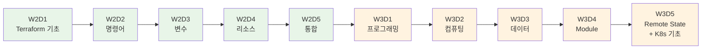

# November Week 3: Terraform 마스터 + EKS 준비

<div align="center">

**📝 IaC 완성** • **🔄 Module 재사용** • **🌍 환경 분리** • **☸️ Kubernetes 준비**

*Terraform 완전 습득 + EKS 사전 학습*

</div>

---

## 🎯 Week 3 목표

### 전체 학습 목표
- Terraform 프로그래밍 기술 완전 습득
- Week 1-2의 모든 AWS 리소스를 코드로 관리
- Module을 통한 재사용 가능한 인프라 구축
- dev/prod 환경 분리 및 관리
- Kubernetes 기초 개념 학습 (EKS 준비)

### 주간 성과물
- 전체 AWS 인프라 Terraform 코드
- 재사용 가능한 Module 라이브러리
- dev/prod 환경 완전 분리
- Remote State Backend 구성
- Kubernetes 기초 지식 (EKS 준비)

---

## 📊 학습 구조

### 일일 시간표
```
09:00-09:40  Session 1: Terraform 기술 1 (40분)
09:40-10:20  Session 2: Terraform 기술 2 (40분)
10:20-11:00  Session 3: Terraform 기술 3 (40분)
11:00-12:00  Lab: 실전 코드 작성 (60분)
```

### 학습 방식
- **전체 3시간**: Terraform 집중 학습
- **이론 + 실습**: 개념 학습 후 즉시 코드 작성
- **점진적 통합**: 매일 더 복잡한 인프라 구축

---

## 📅 주간 커리큘럼

### Day 1 (월): Terraform 프로그래밍 기초
**시간**: 09:00-12:00

**이론**:
- Session 1: **for_each & count** (40분)
  - 반복문으로 여러 리소스 생성
  - for_each vs count 차이
  - 실무 활용 패턴
  - Map, List 활용

- Session 2: **조건문 & Locals** (40분)
  - Conditional Resources
  - Locals를 이용한 계산
  - Dynamic Blocks
  - 환경별 리소스 제어

- Session 3: **리소스 의존성 관리** (40분)
  - depends_on 명시적 의존성
  - 암묵적 의존성 (참조)
  - 리소스 생성 순서 제어
  - 순환 참조 방지

**실습**:
- Lab 1: Multi-AZ VPC 구성 (60분)
  - for_each로 3개 AZ Subnet 생성
  - 조건문으로 환경별 NAT Gateway 제어
  - 의존성 관리

**학습 포인트**:
- Terraform 프로그래밍 사고방식
- 반복 코드 제거
- 유연한 인프라 코드

---

### Day 2 (화): 컴퓨팅 리소스 코드화
**시간**: 09:00-12:00

**이론**:
- Session 1: **EC2 리소스 관리** (40분)
  - AMI 선택 (Data Source)
  - User Data 스크립트
  - Key Pair 관리
  - Instance Profile (IAM Role)

- Session 2: **ALB & Auto Scaling** (40분)
  - Target Group, Listener
  - Launch Template
  - Auto Scaling Policy
  - Health Check 설정

- Session 3: **ECS Terraform 코드** (40분)
  - ECS Cluster, Task Definition
  - ECS Service
  - Fargate 설정
  - CloudWatch Logs 통합

**실습**:
- Lab 1: Terraform으로 ALB + ASG + ECS 배포 (60분)
  - 전체 컴퓨팅 스택 코드화
  - 고가용성 아키텍처
  - 모니터링 통합

**학습 포인트**:
- 컴퓨팅 리소스 완전 코드화
- 고가용성 아키텍처 코드
- 컨테이너 인프라 관리

---

### Day 3 (수): 데이터베이스 & 메시징 코드화
**시간**: 09:00-12:00

**이론**:
- Session 1: **RDS Terraform 코드** (40분)
  - DB Subnet Group
  - Parameter Group
  - 백업 및 유지보수 설정
  - Multi-AZ 구성

- Session 2: **ElastiCache & SQS/SNS** (40분)
  - ElastiCache Cluster
  - SQS Queue 설정
  - SNS Topic 및 Subscription
  - DLQ (Dead Letter Queue)

- Session 3: **API Gateway & Cognito** (40분)
  - API Gateway REST API
  - Cognito User Pool
  - Lambda 통합
  - 인증 설정

**실습**:
- Lab 1: Terraform으로 전체 백엔드 인프라 (60분)
  - RDS + ElastiCache
  - SQS + SNS
  - API Gateway + Cognito + Lambda

**학습 포인트**:
- 데이터 계층 코드화
- 메시징 시스템 관리
- API 인프라 자동화

---

### Day 4 (목): Module & 환경 관리
**시간**: 09:00-12:00

**이론**:
- Session 1: **Module 작성** (40분)
  - Module 구조 (input, output, main)
  - 재사용 가능한 인프라 코드
  - Module 버전 관리
  - Public Module 활용

- Session 2: **Workspace & 환경 분리** (40분)
  - Workspace 개념
  - 디렉토리 분리 전략
  - tfvars 파일 활용
  - dev/staging/prod 환경

- Session 3: **Data Source & Import** (40분)
  - 기존 리소스 참조
  - terraform import
  - 외부 데이터 통합
  - AMI 자동 선택

**실습**:
- Lab 1: VPC Module 작성 + dev/prod 환경 배포 (60분)
  - 재사용 가능한 VPC Module
  - 환경별 설정 분리
  - 기존 리소스 Import

**학습 포인트**:
- 코드 재사용성
- 환경 분리 전략
- 기존 인프라 관리

---

### Day 5 (금): Remote State & Kubernetes 기초
**시간**: 09:00-12:00

**이론**:
- Session 1: **Remote State & Backend** (40분)
  - S3 Backend 설정
  - State Locking (DynamoDB)
  - 팀 협업 전략
  - State 보안

- Session 2: **Kubernetes 기초 개념** (40분)
  - Kubernetes가 필요한 이유
  - Pod, Service, Deployment 개념
  - ECS vs Kubernetes 비교
  - EKS 아키텍처 소개

- Session 3: **Terraform 베스트 프랙티스** (40분)
  - 코드 구조화
  - 네이밍 컨벤션
  - 보안 (시크릿 관리)
  - 문서화 전략

**실습**:
- Lab 1: 전체 스택 Terraform 관리 + Kubernetes 맛보기 (60분)
  - VPC + EC2 + RDS + ECS + Lambda
  - SQS + SNS + API Gateway + Cognito
  - Remote State 설정
  - Kubernetes 기본 명령어 실습

**학습 포인트**:
- 팀 협업 체계
- 프로덕션급 코드 품질
- Kubernetes 기초 이해
- Week 4 EKS 준비

---

## 🎯 Week 2 → Week 3 학습 흐름



---

## 📊 Terraform 학습 진도

### Week 2: 기초 다지기
- Day 1: 개념 & 문법
- Day 2: 명령어 & State
- Day 3: Variable & Output
- Day 4: 리소스 관리
- Day 5: 통합 적용

### Week 3: 고급 기술 + K8s 준비
- Day 1: 프로그래밍 (for_each, count, condition)
- Day 2: 복잡한 리소스 (ALB, ASG, ECS)
- Day 3: 전체 백엔드 (RDS, SQS, API Gateway)
- Day 4: Module & 환경 분리
- Day 5: Remote State & Kubernetes 기초

---

## 💰 주간 예상 비용

### 일별 비용 (프리티어 활용)
| Day | 주요 리소스 | 예상 비용 |
|-----|------------|-----------|
| Day 1 | VPC + Subnet | $0.00 |
| Day 2 | EC2 + ALB + ECS | $0.30 |
| Day 3 | RDS + ElastiCache | $0.25 |
| Day 4 | 전체 스택 | $0.35 |
| Day 5 | 전체 스택 + K8s 실습 | $0.40 |
| **합계** | | **$1.30** |

### 비용 절감 팁
- 실습 완료 후 즉시 terraform destroy
- 최소 스펙 사용 (t3.micro, db.t3.micro)
- 프리티어 최대 활용
- 실습 시간 엄수 (60분)

---

## ✅ Week 3 완료 체크리스트

### Terraform 고급 기술
- [ ] for_each, count 반복문 활용
- [ ] 조건문으로 환경별 리소스 제어
- [ ] 리소스 의존성 관리
- [ ] Module 작성 및 재사용
- [ ] Workspace로 환경 분리
- [ ] Remote State Backend 구성

### AWS 리소스 코드화
- [ ] VPC 전체 스택 코드화
- [ ] EC2 + ALB + ASG 코드화
- [ ] ECS Fargate 코드화
- [ ] RDS + ElastiCache 코드화
- [ ] SQS + SNS + API Gateway 코드화

### Kubernetes 기초
- [ ] Kubernetes 개념 이해
- [ ] Pod, Service, Deployment 개념
- [ ] ECS vs Kubernetes 차이 이해
- [ ] kubectl 기본 명령어 실습

---

## 🔗 Week 4 준비

### Week 4 예고: EKS 실전 + CI/CD
- EKS 클러스터 구축 (Terraform)
- Kubernetes 워크로드 배포
- Helm 패키지 관리
- GitHub Actions CI/CD
- 모니터링 & 로깅

### 사전 준비사항
- Terraform 복습 (Module, Remote State)
- Kubernetes 기초 개념 복습
- kubectl 설치 확인
- Week 1-3 전체 복습

---

<div align="center">

**📝 Terraform 완성** • **🔄 Module 재사용** • **🌍 환경 분리** • **☸️ K8s 준비**

*Week 3: IaC 마스터 + EKS 사전 학습*

</div>
