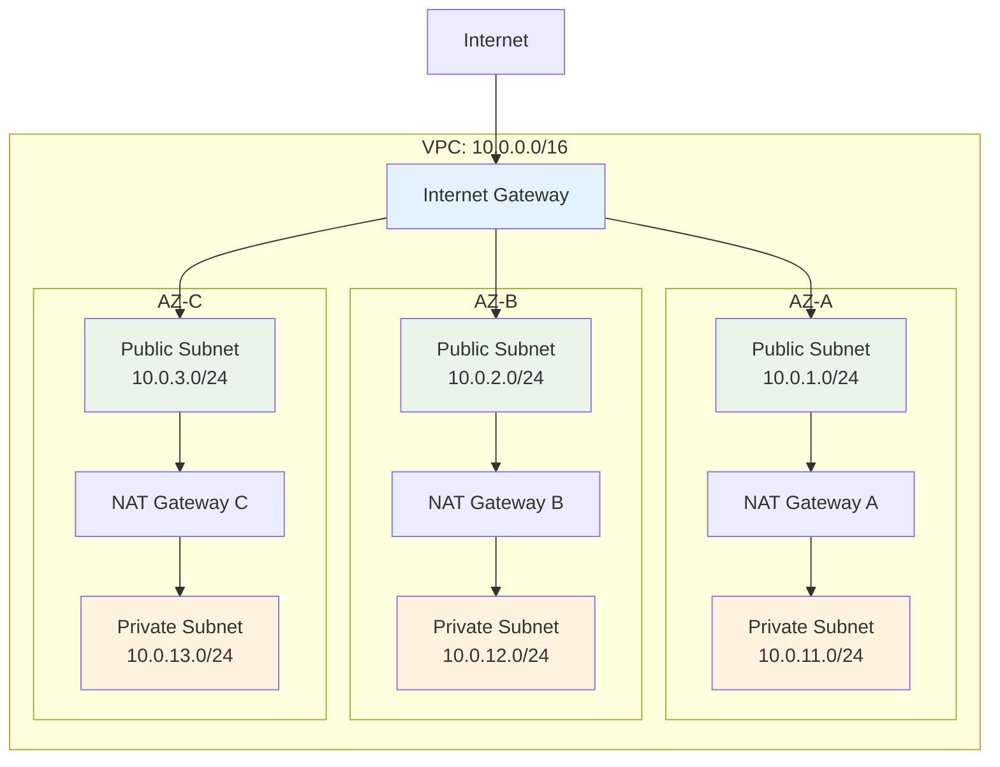

# November Week 3 Day 1: Terraform 프로그래밍 기초

<div align="center">

**🔄 for_each & count** • **🎯 조건문** • **🔗 의존성 관리**

*Terraform 프로그래밍 기술로 유연한 인프라 코드 작성*

</div>

---

## 🕘 일일 스케줄

### 📊 시간 배분
```
09:00-09:40  Session 1: for_each & count (40분)
09:40-09:50  휴식 (10분)
09:50-10:30  Session 2: 조건문 & Locals (40분)
10:30-10:40  휴식 (10분)
10:40-11:20  Session 3: 리소스 의존성 관리 (40분)
11:20-12:00  Lab: Multi-AZ VPC 구성 (40분)
```

### 🗓️ 상세 스케줄
| 시간 | 구분 | 내용 | 목적 |
|------|------|------|------|
| **09:00-09:40** | 📚 이론 1 | for_each & count (40분) | 반복문으로 리소스 생성 |
| **09:40-09:50** | ☕ 휴식 | 10분 휴식 | |
| **09:50-10:30** | 📚 이론 2 | 조건문 & Locals (40분) | 환경별 리소스 제어 |
| **10:30-10:40** | ☕ 휴식 | 10분 휴식 | |
| **10:40-11:20** | 📚 이론 3 | 리소스 의존성 관리 (40분) | 생성 순서 제어 |
| **11:20-12:00** | 🛠️ 실습 | Multi-AZ VPC 구성 (40분) | 프로그래밍 기술 적용 |

---

## 🎯 Day 1 목표

### 📚 학습 목표
- **for_each & count**: 반복문으로 여러 리소스 효율적 생성
- **조건문**: 환경별로 다른 리소스 구성
- **Locals**: 계산 및 변수 조합
- **의존성 관리**: 리소스 생성 순서 제어

### 🛠️ 실무 역량
- 반복 코드 제거
- 유연한 인프라 코드 작성
- 환경별 설정 분리
- 안전한 리소스 생성 순서

---

## 📚 세션 구성

### Session 1: for_each & count (09:00-09:40)
**주제**: 반복문으로 여러 리소스 생성

**핵심 내용**:
- for_each vs count 차이점
- Map, List 활용
- 실무 활용 패턴
- 리소스 참조 방법

**학습 포인트**:
- 반복 코드 제거
- 동적 리소스 생성
- 유지보수성 향상
- 확장 가능한 코드

**코드 예시**:
```hcl
# for_each로 여러 Subnet 생성
variable "availability_zones" {
  type = map(string)
  default = {
    "a" = "ap-northeast-2a"
    "b" = "ap-northeast-2b"
    "c" = "ap-northeast-2c"
  }
}

resource "aws_subnet" "public" {
  for_each = var.availability_zones
  
  vpc_id            = aws_vpc.main.id
  cidr_block        = "10.0.${index(keys(var.availability_zones), each.key) + 1}.0/24"
  availability_zone = each.value
  
  tags = {
    Name = "public-subnet-${each.key}"
  }
}
```

---

### Session 2: 조건문 & Locals (09:50-10:30)
**주제**: 환경별 리소스 제어 및 계산

**핵심 내용**:
- Conditional Resources
- Locals를 이용한 계산
- Dynamic Blocks
- 환경별 설정 분리

**학습 포인트**:
- 환경별 다른 구성
- 코드 중복 제거
- 복잡한 로직 단순화
- 가독성 향상

**코드 예시**:
```hcl
# 환경별 NAT Gateway 제어
variable "environment" {
  type = string
}

locals {
  create_nat_gateway = var.environment == "prod" ? true : false
  nat_gateway_count  = local.create_nat_gateway ? 3 : 1
}

resource "aws_nat_gateway" "main" {
  count = local.nat_gateway_count
  
  allocation_id = aws_eip.nat[count.index].id
  subnet_id     = aws_subnet.public[count.index].id
  
  tags = {
    Name = "nat-gateway-${count.index + 1}"
  }
}
```

---

### Session 3: 리소스 의존성 관리 (10:40-11:20)
**주제**: 리소스 생성 순서 제어

**핵심 내용**:
- depends_on 명시적 의존성
- 암묵적 의존성 (참조)
- 리소스 생성 순서
- 순환 참조 방지

**학습 포인트**:
- 안전한 리소스 생성
- 의존성 그래프 이해
- 에러 방지
- 삭제 순서 제어

**코드 예시**:
```hcl
# 명시적 의존성
resource "aws_iam_role_policy" "lambda_policy" {
  role   = aws_iam_role.lambda.id
  policy = data.aws_iam_policy_document.lambda.json
  
  # Lambda 함수가 생성된 후 정책 적용
  depends_on = [aws_lambda_function.main]
}

# 암묵적 의존성 (참조)
resource "aws_security_group_rule" "allow_alb" {
  security_group_id = aws_security_group.ecs.id
  
  # ALB Security Group 참조 (자동 의존성)
  source_security_group_id = aws_security_group.alb.id
}
```

---

## 🛠️ 실습 (Lab 1)

### Lab 1: Multi-AZ VPC 구성
**시간**: 11:20-12:00 (40분)
**목표**: Terraform 프로그래밍 기술로 유연한 VPC 구축

**실습 내용**:
1. **for_each로 3개 AZ Subnet 생성**
   - Public Subnet 3개
   - Private Subnet 3개
   - Map 변수 활용

2. **조건문으로 환경별 NAT Gateway 제어**
   - dev: NAT Gateway 1개
   - prod: NAT Gateway 3개 (각 AZ)
   - Locals 활용

3. **의존성 관리**
   - Internet Gateway → Public Subnet
   - NAT Gateway → Private Subnet
   - Route Table 연결 순서

4. **검증**
   - terraform plan 확인
   - 리소스 생성 순서 확인
   - 환경별 차이 확인

**디렉토리 구조**:
```
lab1/
├── main.tf           # VPC, Subnet, Gateway
├── variables.tf      # 변수 정의
├── locals.tf         # 계산 및 조건
├── outputs.tf        # 출력 값
├── dev.tfvars        # dev 환경 설정
└── prod.tfvars       # prod 환경 설정
```

---

## 🏗️ Day 1 아키텍처

### Multi-AZ VPC 구조


### 환경별 차이
**dev 환경**:
- NAT Gateway: 1개 (비용 절감)
- Subnet: 3개 AZ (고가용성 유지)

**prod 환경**:
- NAT Gateway: 3개 (각 AZ, 완전 고가용성)
- Subnet: 3개 AZ

---

## 💰 예상 비용

### Day 1 리소스 비용
| 리소스 | 사양 | 시간당 | 실습 시간 | 예상 비용 |
|--------|------|--------|-----------|-----------|
| VPC | 무료 | $0 | - | $0 |
| Subnet | 무료 | $0 | - | $0 |
| Internet Gateway | 무료 | $0 | - | $0 |
| NAT Gateway | 1-3개 | $0.045 | 1시간 | $0.045-$0.135 |
| **합계 (dev)** | | | | **$0.045** |
| **합계 (prod)** | | | | **$0.135** |

### 비용 절감 팁
- 실습은 dev 환경으로 진행 (NAT Gateway 1개)
- 실습 완료 후 즉시 terraform destroy
- NAT Gateway가 주요 비용 발생 요소

---

## ✅ Day 1 체크리스트

### 이론 학습
- [ ] for_each와 count의 차이점 이해
- [ ] Map, List 변수 활용 방법 파악
- [ ] 조건문으로 환경별 리소스 제어
- [ ] Locals를 이용한 계산 및 조합
- [ ] depends_on 명시적 의존성 이해
- [ ] 암묵적 의존성 (참조) 활용

### 실습 완료
- [ ] for_each로 Multi-AZ Subnet 생성
- [ ] 조건문으로 환경별 NAT Gateway 제어
- [ ] 의존성 관리로 안전한 리소스 생성
- [ ] dev/prod 환경 분리 구성
- [ ] terraform plan/apply 성공

### 실무 역량
- [ ] 반복 코드 제거 능력
- [ ] 유연한 인프라 코드 작성
- [ ] 환경별 설정 분리 전략
- [ ] 안전한 리소스 생성 순서 제어

---

## 🔗 관련 자료

### 📖 Terraform 공식 문서
- [for_each Meta-Argument](https://www.terraform.io/language/meta-arguments/for_each)
- [count Meta-Argument](https://www.terraform.io/language/meta-arguments/count)
- [Conditional Expressions](https://www.terraform.io/language/expressions/conditionals)
- [Local Values](https://www.terraform.io/language/values/locals)
- [Resource Dependencies](https://www.terraform.io/language/resources/behavior#resource-dependencies)

### 🎯 다음 Day
- [Day 2: 컴퓨팅 리소스 코드화](../day2/README.md)

---

## 💡 Day 1 회고

### 🤝 학습 성과
1. **프로그래밍 사고**: Terraform을 프로그래밍 언어처럼 활용
2. **코드 효율성**: 반복 코드 제거로 유지보수성 향상
3. **유연성**: 환경별 다른 구성을 코드로 제어
4. **안전성**: 의존성 관리로 안전한 인프라 구축

### 📊 다음 학습
- **Day 2**: EC2, ALB, ECR, ECS 코드화
- **복잡한 리소스**: 컴퓨팅 스택 전체 관리

---

<div align="center">

**🔄 반복문** • **🎯 조건문** • **🔗 의존성** • **📝 프로그래밍**

*Day 1: Terraform 프로그래밍 기초 완성*

</div>
