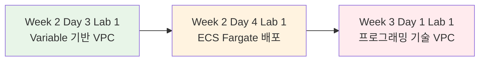
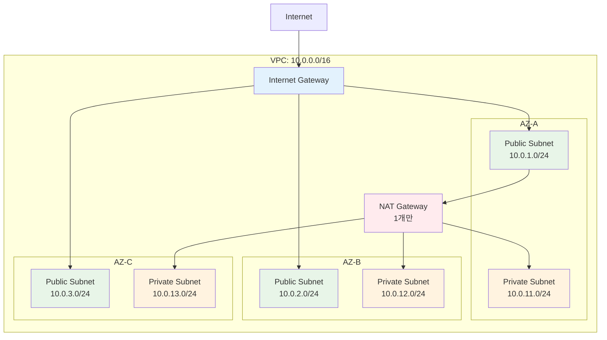
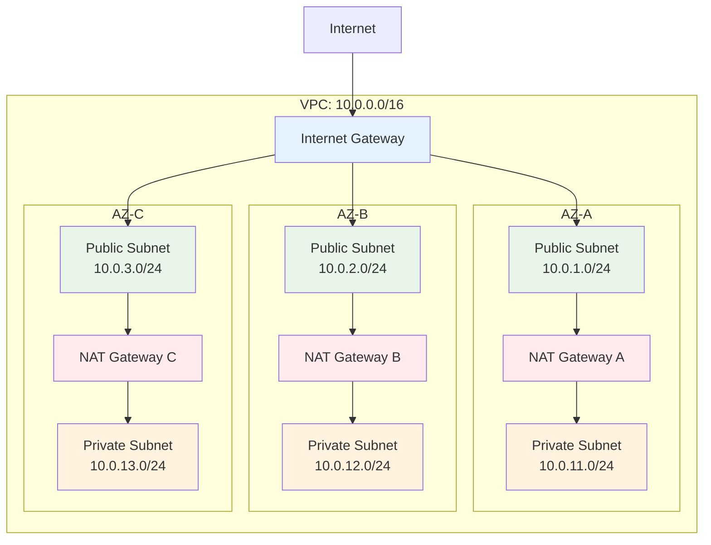

# November Week 3 Day 1 Lab 1: Multi-AZ VPC 구성

<div align="center">

**🔄 for_each** • **🎯 조건문** • **🔗 의존성** • **📝 Terraform 프로그래밍**

*Terraform 프로그래밍 기술로 유연하고 확장 가능한 VPC 인프라 구축*

</div>

---

## 🕘 Lab 정보
**시간**: 11:20-12:00 (40분)
**목표**: Terraform 프로그래밍 기술(for_each, 조건문, 의존성)을 활용한 Multi-AZ VPC 구축
**방식**: 직접 코드 작성 및 배포
**사전 준비**: Terraform 설치 완료

## 🎯 학습 목표

### 📚 이해 목표
- **for_each**: Map 변수로 여러 리소스 동적 생성
- **조건문**: 환경별로 다른 리소스 구성
- **Locals**: 계산 및 변수 조합
- **의존성**: 리소스 생성 순서 제어

### 🛠️ 구현 목표
- for_each로 3개 AZ Subnet 생성 (Public + Private)
- 조건문으로 환경별 NAT Gateway 제어 (dev: 1개, prod: 3개)
- 의존성 관리로 안전한 리소스 생성 순서
- 환경별 설정 파일 분리 (dev.tfvars, prod.tfvars)

---

## 🆚 이전 Lab과의 차이점

### 📊 Lab 진화 과정



### Week 2 Day 3 Lab 1 vs Week 3 Day 1 Lab 1

| 구분 | Week 2 Day 3 Lab 1 | Week 3 Day 1 Lab 1 |
|------|---------------------|---------------------|
| **주제** | Variable 기반 VPC | 프로그래밍 기술 VPC |
| **변수 사용** | 단순 변수 (string, number) | Map 변수 + for_each |
| **Subnet 생성** | 하드코딩 (1-2개) | for_each로 동적 생성 (3개) |
| **NAT Gateway** | 고정 (1개) | 조건문으로 환경별 제어 |
| **환경 분리** | 없음 | dev/prod tfvars 분리 |
| **의존성** | 암묵적만 | 명시적 + 암묵적 |
| **코드 라인** | ~100줄 | ~150줄 |
| **난이도** | 기초 | 중급 |

**Week 2 Day 3 Lab 1 코드 예시** (단순):
```hcl
# 하드코딩된 Subnet
resource "aws_subnet" "public" {
  vpc_id     = aws_vpc.main.id
  cidr_block = "10.0.1.0/24"
}

resource "aws_subnet" "private" {
  vpc_id     = aws_vpc.main.id
  cidr_block = "10.0.11.0/24"
}
```

**Week 3 Day 1 Lab 1 코드 예시** (프로그래밍):
```hcl
# for_each로 동적 생성
variable "availability_zones" {
  type = map(string)
  default = {
    "a" = "ap-northeast-2a"
    "b" = "ap-northeast-2b"
    "c" = "ap-northeast-2c"
  }
}

resource "aws_subnet" "public" {
  for_each = var.availability_zones
  
  vpc_id            = aws_vpc.main.id
  cidr_block        = "10.0.${index(keys(var.availability_zones), each.key) + 1}.0/24"
  availability_zone = each.value
  
  tags = {
    Name = "public-subnet-${each.key}"
  }
}
```

### Week 2 Day 4 Lab 1 vs Week 3 Day 1 Lab 1

| 구분 | Week 2 Day 4 Lab 1 | Week 3 Day 1 Lab 1 |
|------|---------------------|---------------------|
| **주제** | ECS Fargate 배포 | Multi-AZ VPC 구성 |
| **초점** | 실제 서비스 배포 | Terraform 프로그래밍 |
| **리소스** | ECS, ALB, Auto Scaling | VPC, Subnet, NAT Gateway |
| **기술** | AWS 서비스 통합 | for_each, 조건문, 의존성 |
| **목적** | 프로덕션 배포 | 코드 유연성 학습 |

**핵심 차이**:
- **Week 2 Day 4**: "무엇을 배포하는가" (ECS 서비스)
- **Week 3 Day 1**: "어떻게 코드를 작성하는가" (프로그래밍 기술)

---

## 🏗️ 구축할 아키텍처

### 📐 전체 구조

**dev 환경** (비용 절감):
```
Internet
    ↓
Internet Gateway
    ↓
Public Subnet (3개 AZ)
    ↓
NAT Gateway (1개만) ← 비용 절감
    ↓
Private Subnet (3개 AZ)
```

**prod 환경** (고가용성):
```
Internet
    ↓
Internet Gateway
    ↓
Public Subnet (3개 AZ)
    ↓
NAT Gateway (3개, 각 AZ) ← 완전 고가용성
    ↓
Private Subnet (3개 AZ)
```

### 시각화

**dev 환경**:


**prod 환경**:


### 🔗 참조 Session
**당일 Session** (오늘 배운 내용):
- [Session 1: for_each & count](./session_1.md) - 반복문으로 리소스 생성
- [Session 2: 조건문 & Locals](./session_2.md) - 환경별 리소스 제어
- [Session 3: 리소스 의존성 관리](./session_3.md) - 생성 순서 제어

**이전 Day Session** (기반 지식):
- [Week 2 Day 3 Session 3: Terraform 기초](../../week_02/day3/session_3.md) - Terraform 기본 문법
- [Week 2 Day 3 Lab 1: Variable 기반 VPC](../../week_02/day3/lab_1.md) - 기본 VPC 구성

---

## 🛠️ Step 1: 프로젝트 구조 생성 (5분)

### 📋 이 단계에서 할 일
- Lab 디렉토리 생성
- Terraform 파일 구조 준비
- 환경별 설정 파일 생성

### 📝 실습 절차

#### 1-1. 디렉토리 생성

```bash
# Lab 디렉토리 생성
mkdir -p ~/terraform-labs/week3-day1-lab1
cd ~/terraform-labs/week3-day1-lab1

# 파일 구조 확인
tree
```

**예상 구조**:
```
week3-day1-lab1/
├── main.tf           # VPC, Subnet, Gateway
├── variables.tf      # 변수 정의
├── locals.tf         # 계산 및 조건
├── outputs.tf        # 출력 값
├── dev.tfvars        # dev 환경 설정
└── prod.tfvars       # prod 환경 설정
```

#### 1-2. 기본 파일 생성

```bash
# 빈 파일 생성
touch main.tf variables.tf locals.tf outputs.tf dev.tfvars prod.tfvars
```

### ✅ Step 1 검증

```bash
# 파일 목록 확인
ls -la

# 예상 출력:
# main.tf
# variables.tf
# locals.tf
# outputs.tf
# dev.tfvars
# prod.tfvars
```

---

## 🛠️ Step 2: 변수 정의 (5분)

### 📋 이 단계에서 할 일
- Map 변수로 AZ 정의
- 환경 변수 정의
- VPC CIDR 변수 정의

### 🔗 참조 개념
- [Session 1: for_each & count](./session_1.md) - Map 변수 활용

### 📝 실습 절차

#### 2-1. variables.tf 작성

```bash
cat <<'EOF' > variables.tf
# 환경 변수 (dev 또는 prod)
variable "environment" {
  description = "Environment name (dev or prod)"
  type        = string
}

# 프로젝트 이름
variable "project_name" {
  description = "Project name for resource naming"
  type        = string
  default     = "week3-day1"
}

# VPC CIDR 블록
variable "vpc_cidr" {
  description = "CIDR block for VPC"
  type        = string
  default     = "10.0.0.0/16"
}

# Availability Zones (Map 변수)
variable "availability_zones" {
  description = "Map of availability zones"
  type        = map(string)
  default = {
    "a" = "ap-northeast-2a"
    "b" = "ap-northeast-2b"
    "c" = "ap-northeast-2c"
  }
}

# 태그
variable "tags" {
  description = "Common tags for all resources"
  type        = map(string)
  default = {
    "ManagedBy" = "Terraform"
    "Lab"       = "Week3-Day1-Lab1"
  }
}
EOF
```

**💡 코드 설명**:
- **environment**: dev/prod 환경 구분
- **availability_zones**: Map 변수로 3개 AZ 정의 (for_each에서 사용)
- **tags**: 모든 리소스에 공통 태그

#### 2-2. 환경별 설정 파일 작성

**dev.tfvars**:
```bash
cat <<'EOF' > dev.tfvars
environment  = "dev"
project_name = "week3-day1-dev"

tags = {
  "Environment" = "dev"
  "ManagedBy"   = "Terraform"
  "Lab"         = "Week3-Day1-Lab1"
}
EOF
```

**prod.tfvars**:
```bash
cat <<'EOF' > prod.tfvars
environment  = "prod"
project_name = "week3-day1-prod"

tags = {
  "Environment" = "prod"
  "ManagedBy"   = "Terraform"
  "Lab"         = "Week3-Day1-Lab1"
}
EOF
```

### ✅ Step 2 검증

```bash
# 변수 파일 확인
cat variables.tf
cat dev.tfvars
cat prod.tfvars
```

---

## 🛠️ Step 3: Locals 정의 (조건문) (5분)

### 📋 이 단계에서 할 일
- 환경별 NAT Gateway 개수 계산
- Subnet CIDR 계산
- 공통 태그 조합

### 🔗 참조 개념
- [Session 2: 조건문 & Locals](./session_2.md) - 조건문으로 환경별 제어

### 📝 실습 절차

#### 3-1. locals.tf 작성

```bash
cat <<'EOF' > locals.tf
# Locals: 계산 및 조건문
locals {
  # 환경별 NAT Gateway 개수 (조건문)
  # dev: 1개 (비용 절감)
  # prod: 3개 (고가용성)
  nat_gateway_count = var.environment == "prod" ? length(var.availability_zones) : 1
  
  # NAT Gateway를 배치할 AZ 목록
  nat_gateway_azs = var.environment == "prod" ? keys(var.availability_zones) : ["a"]
  
  # 공통 태그 조합
  common_tags = merge(
    var.tags,
    {
      "Environment" = var.environment
      "Project"     = var.project_name
    }
  )
  
  # Public Subnet CIDR 계산
  # 10.0.1.0/24, 10.0.2.0/24, 10.0.3.0/24
  public_subnet_cidrs = {
    for k, v in var.availability_zones :
    k => cidrsubnet(var.vpc_cidr, 8, index(keys(var.availability_zones), k) + 1)
  }
  
  # Private Subnet CIDR 계산
  # 10.0.11.0/24, 10.0.12.0/24, 10.0.13.0/24
  private_subnet_cidrs = {
    for k, v in var.availability_zones :
    k => cidrsubnet(var.vpc_cidr, 8, index(keys(var.availability_zones), k) + 11)
  }
}
EOF
```

**💡 코드 설명**:
- **nat_gateway_count**: 조건문으로 환경별 개수 결정
  - `prod`: 3개 (각 AZ)
  - `dev`: 1개 (비용 절감)
- **public_subnet_cidrs**: for 표현식으로 CIDR 자동 계산
- **common_tags**: merge 함수로 태그 조합

### ✅ Step 3 검증

```bash
# Locals 파일 확인
cat locals.tf
```

---

## 🛠️ Step 4: VPC 및 Subnet 생성 (for_each) (10분)

### 📋 이 단계에서 할 일
- VPC 생성
- for_each로 Public Subnet 3개 생성
- for_each로 Private Subnet 3개 생성

### 🔗 참조 개념
- [Session 1: for_each & count](./session_1.md) - for_each로 반복 생성

### 📝 실습 절차

#### 4-1. main.tf 작성 (VPC 및 Subnet)

```bash
cat <<'EOF' > main.tf
# Provider 설정
terraform {
  required_version = ">= 1.0"
  
  required_providers {
    aws = {
      source  = "hashicorp/aws"
      version = "~> 5.0"
    }
  }
}

provider "aws" {
  region = "ap-northeast-2"
}

# VPC
resource "aws_vpc" "main" {
  cidr_block           = var.vpc_cidr
  enable_dns_hostnames = true
  enable_dns_support   = true
  
  tags = merge(
    local.common_tags,
    {
      "Name" = "${var.project_name}-vpc"
    }
  )
}

# Internet Gateway
resource "aws_internet_gateway" "main" {
  vpc_id = aws_vpc.main.id
  
  tags = merge(
    local.common_tags,
    {
      "Name" = "${var.project_name}-igw"
    }
  )
}

# Public Subnets (for_each로 3개 생성)
resource "aws_subnet" "public" {
  for_each = var.availability_zones
  
  vpc_id                  = aws_vpc.main.id
  cidr_block              = local.public_subnet_cidrs[each.key]
  availability_zone       = each.value
  map_public_ip_on_launch = true
  
  tags = merge(
    local.common_tags,
    {
      "Name" = "${var.project_name}-public-subnet-${each.key}"
      "Type" = "public"
      "AZ"   = each.key
    }
  )
}

# Private Subnets (for_each로 3개 생성)
resource "aws_subnet" "private" {
  for_each = var.availability_zones
  
  vpc_id            = aws_vpc.main.id
  cidr_block        = local.private_subnet_cidrs[each.key]
  availability_zone = each.value
  
  tags = merge(
    local.common_tags,
    {
      "Name" = "${var.project_name}-private-subnet-${each.key}"
      "Type" = "private"
      "AZ"   = each.key
    }
  )
}
EOF
```

**💡 코드 설명**:
- **for_each = var.availability_zones**: Map 변수로 반복
- **each.key**: "a", "b", "c"
- **each.value**: "ap-northeast-2a", "ap-northeast-2b", "ap-northeast-2c"
- **local.public_subnet_cidrs[each.key]**: 계산된 CIDR 사용

### ✅ Step 4 검증

```bash
# Terraform 초기화
terraform init

# 계획 확인 (dev 환경)
terraform plan -var-file=dev.tfvars

# 예상 출력:
# Plan: 8 to add, 0 to change, 0 to destroy.
# - 1 VPC
# - 1 Internet Gateway
# - 3 Public Subnets
# - 3 Private Subnets
```

---

## 🛠️ Step 5: NAT Gateway 및 Route Table (조건문 + 의존성) (10분)

### 📋 이 단계에서 할 일
- Elastic IP 생성 (환경별 개수)
- NAT Gateway 생성 (조건문으로 제어)
- Route Table 생성 및 연결 (의존성 관리)

### 🔗 참조 개념
- [Session 2: 조건문 & Locals](./session_2.md) - 환경별 NAT Gateway 제어
- [Session 3: 리소스 의존성 관리](./session_3.md) - 생성 순서 제어

### 📝 실습 절차

#### 5-1. main.tf에 NAT Gateway 추가

```bash
cat <<'EOF' >> main.tf

# Elastic IP for NAT Gateway
resource "aws_eip" "nat" {
  for_each = toset(local.nat_gateway_azs)
  
  domain = "vpc"
  
  tags = merge(
    local.common_tags,
    {
      "Name" = "${var.project_name}-eip-nat-${each.key}"
    }
  )
  
  # Internet Gateway가 생성된 후 EIP 생성
  depends_on = [aws_internet_gateway.main]
}

# NAT Gateway (환경별 개수 제어)
resource "aws_nat_gateway" "main" {
  for_each = toset(local.nat_gateway_azs)
  
  allocation_id = aws_eip.nat[each.key].id
  subnet_id     = aws_subnet.public[each.key].id
  
  tags = merge(
    local.common_tags,
    {
      "Name" = "${var.project_name}-nat-${each.key}"
    }
  )
  
  # Public Subnet이 생성된 후 NAT Gateway 생성
  depends_on = [aws_subnet.public]
}

# Public Route Table
resource "aws_route_table" "public" {
  vpc_id = aws_vpc.main.id
  
  tags = merge(
    local.common_tags,
    {
      "Name" = "${var.project_name}-public-rt"
      "Type" = "public"
    }
  )
}

# Public Route (Internet Gateway)
resource "aws_route" "public_internet" {
  route_table_id         = aws_route_table.public.id
  destination_cidr_block = "0.0.0.0/0"
  gateway_id             = aws_internet_gateway.main.id
  
  # Internet Gateway가 생성된 후 Route 생성
  depends_on = [aws_internet_gateway.main]
}

# Public Route Table Association
resource "aws_route_table_association" "public" {
  for_each = var.availability_zones
  
  subnet_id      = aws_subnet.public[each.key].id
  route_table_id = aws_route_table.public.id
}

# Private Route Tables (각 AZ별)
resource "aws_route_table" "private" {
  for_each = var.availability_zones
  
  vpc_id = aws_vpc.main.id
  
  tags = merge(
    local.common_tags,
    {
      "Name" = "${var.project_name}-private-rt-${each.key}"
      "Type" = "private"
      "AZ"   = each.key
    }
  )
}

# Private Routes (NAT Gateway)
resource "aws_route" "private_nat" {
  for_each = var.availability_zones
  
  route_table_id         = aws_route_table.private[each.key].id
  destination_cidr_block = "0.0.0.0/0"
  
  # dev: 모든 AZ가 하나의 NAT Gateway 사용
  # prod: 각 AZ가 자신의 NAT Gateway 사용
  nat_gateway_id = var.environment == "prod" ? aws_nat_gateway.main[each.key].id : aws_nat_gateway.main["a"].id
  
  # NAT Gateway가 생성된 후 Route 생성
  depends_on = [aws_nat_gateway.main]
}

# Private Route Table Association
resource "aws_route_table_association" "private" {
  for_each = var.availability_zones
  
  subnet_id      = aws_subnet.private[each.key].id
  route_table_id = aws_route_table.private[each.key].id
}
EOF
```

**💡 코드 설명**:
- **조건문**: `var.environment == "prod" ? ... : ...`
  - prod: 각 AZ가 자신의 NAT Gateway 사용
  - dev: 모든 AZ가 하나의 NAT Gateway 공유
- **depends_on**: 명시적 의존성으로 생성 순서 제어
  - EIP → Internet Gateway 후 생성
  - NAT Gateway → Public Subnet 후 생성
  - Route → Gateway 후 생성

### ✅ Step 5 검증

```bash
# 계획 확인 (dev 환경)
terraform plan -var-file=dev.tfvars

# 예상 출력 (dev):
# Plan: 18 to add, 0 to change, 0 to destroy.
# - 1 EIP (NAT Gateway용)
# - 1 NAT Gateway

# 계획 확인 (prod 환경)
terraform plan -var-file=prod.tfvars

# 예상 출력 (prod):
# Plan: 20 to add, 0 to change, 0 to destroy.
# - 3 EIP (NAT Gateway용)
# - 3 NAT Gateway
```

---

## 🛠️ Step 6: Outputs 정의 (3분)

### 📋 이 단계에서 할 일
- VPC 정보 출력
- Subnet ID 출력
- NAT Gateway 정보 출력

### 📝 실습 절차

#### 6-1. outputs.tf 작성

```bash
cat <<'EOF' > outputs.tf
# VPC 정보
output "vpc_id" {
  description = "VPC ID"
  value       = aws_vpc.main.id
}

output "vpc_cidr" {
  description = "VPC CIDR block"
  value       = aws_vpc.main.cidr_block
}

# Public Subnet IDs
output "public_subnet_ids" {
  description = "Map of public subnet IDs"
  value = {
    for k, subnet in aws_subnet.public :
    k => subnet.id
  }
}

# Private Subnet IDs
output "private_subnet_ids" {
  description = "Map of private subnet IDs"
  value = {
    for k, subnet in aws_subnet.private :
    k => subnet.id
  }
}

# NAT Gateway 정보
output "nat_gateway_count" {
  description = "Number of NAT Gateways"
  value       = local.nat_gateway_count
}

output "nat_gateway_ids" {
  description = "Map of NAT Gateway IDs"
  value = {
    for k, nat in aws_nat_gateway.main :
    k => nat.id
  }
}

# 환경 정보
output "environment" {
  description = "Environment name"
  value       = var.environment
}

output "availability_zones" {
  description = "Availability zones used"
  value       = var.availability_zones
}
EOF
```

### ✅ Step 6 검증

```bash
# Outputs 파일 확인
cat outputs.tf
```

---

## 🛠️ Step 7: 배포 및 검증 (7분)

### 📋 이 단계에서 할 일
- dev 환경 배포
- 리소스 확인
- Outputs 확인

### 📝 실습 절차

#### 7-1. dev 환경 배포

```bash
# dev 환경 배포
terraform apply -var-file=dev.tfvars

# 확인 후 yes 입력
```

**예상 출력**:
```
Plan: 18 to add, 0 to change, 0 to destroy.

Do you want to perform these actions?
  Terraform will perform the actions described above.
  Only 'yes' will be accepted to approve.

  Enter a value: yes

...

Apply complete! Resources: 18 added, 0 changed, 0 destroyed.

Outputs:

availability_zones = {
  "a" = "ap-northeast-2a"
  "b" = "ap-northeast-2b"
  "c" = "ap-northeast-2c"
}
environment = "dev"
nat_gateway_count = 1
nat_gateway_ids = {
  "a" = "nat-0abc123def456789"
}
private_subnet_ids = {
  "a" = "subnet-0abc123"
  "b" = "subnet-0def456"
  "c" = "subnet-0ghi789"
}
public_subnet_ids = {
  "a" = "subnet-0jkl012"
  "b" = "subnet-0mno345"
  "c" = "subnet-0pqr678"
}
vpc_cidr = "10.0.0.0/16"
vpc_id = "vpc-0stu901"
```

#### 7-2. AWS Console에서 확인

**VPC 확인**:
```
AWS Console → VPC → Your VPCs
→ week3-day1-dev-vpc 확인
```

**Subnet 확인**:
```
AWS Console → VPC → Subnets
→ 6개 Subnet 확인 (Public 3개 + Private 3개)
```

**NAT Gateway 확인**:
```
AWS Console → VPC → NAT Gateways
→ 1개 NAT Gateway 확인 (dev 환경)
```

#### 7-3. 의존성 그래프 확인

```bash
# 의존성 그래프 생성
terraform graph | dot -Tpng > graph.png

# 또는 간단히 확인
terraform graph
```

### ✅ Step 7 검증

**체크리스트**:
- [ ] VPC 생성 완료
- [ ] Public Subnet 3개 생성 (각 AZ)
- [ ] Private Subnet 3개 생성 (각 AZ)
- [ ] Internet Gateway 생성
- [ ] NAT Gateway 1개 생성 (dev 환경)
- [ ] Route Table 설정 완료
- [ ] Outputs 정상 출력

---

## 🔄 Step 8: 환경 전환 테스트 (prod) (선택, 시간 있으면)

### 📋 이 단계에서 할 일
- dev 환경 삭제
- prod 환경 배포
- 차이점 확인

### 📝 실습 절차

#### 8-1. dev 환경 삭제

```bash
# dev 환경 삭제
terraform destroy -var-file=dev.tfvars

# 확인 후 yes 입력
```

#### 8-2. prod 환경 배포

```bash
# prod 환경 배포
terraform apply -var-file=prod.tfvars

# 확인 후 yes 입력
```

**예상 출력 차이**:
```
Plan: 20 to add, 0 to change, 0 to destroy.

...

Outputs:

environment = "prod"
nat_gateway_count = 3  ← dev는 1개, prod는 3개
nat_gateway_ids = {
  "a" = "nat-0abc123"
  "b" = "nat-0def456"  ← prod만 존재
  "c" = "nat-0ghi789"  ← prod만 존재
}
```

#### 8-3. 비용 비교

| 환경 | NAT Gateway | 시간당 비용 | 월간 비용 (예상) |
|------|-------------|-------------|------------------|
| **dev** | 1개 | $0.045 | $32.40 |
| **prod** | 3개 | $0.135 | $97.20 |
| **차이** | +2개 | +$0.090 | +$64.80 |

---

## ✅ 실습 체크포인트

### ✅ 프로그래밍 기술 적용
- [ ] **for_each**: Map 변수로 Subnet 동적 생성
- [ ] **조건문**: 환경별 NAT Gateway 개수 제어
- [ ] **Locals**: CIDR 계산 및 태그 조합
- [ ] **의존성**: depends_on으로 생성 순서 제어

### ✅ 리소스 생성
- [ ] VPC 생성 (10.0.0.0/16)
- [ ] Public Subnet 3개 (각 AZ)
- [ ] Private Subnet 3개 (각 AZ)
- [ ] Internet Gateway 1개
- [ ] NAT Gateway (dev: 1개, prod: 3개)
- [ ] Route Tables 및 연결

### ✅ 환경별 차이
- [ ] dev.tfvars로 dev 환경 배포
- [ ] prod.tfvars로 prod 환경 배포
- [ ] NAT Gateway 개수 차이 확인
- [ ] 비용 차이 이해

---

## 🧹 실습 정리

### 리소스 삭제

```bash
# 현재 환경 삭제 (dev 또는 prod)
terraform destroy -var-file=dev.tfvars

# 확인 후 yes 입력
```

**삭제 순서** (Terraform 자동 처리):
```
1. Route Table Associations
2. Routes
3. NAT Gateways
4. Elastic IPs
5. Route Tables
6. Subnets
7. Internet Gateway
8. VPC
```

**⚠️ 주의사항**:
- NAT Gateway 삭제는 시간이 걸림 (약 2-3분)
- 모든 리소스가 삭제될 때까지 대기

### 최종 확인

```bash
# 리소스 상태 확인
terraform show

# 예상 출력: (빈 상태)
```

---

## 💰 비용 분석

### 실습 비용 (40분 기준)

| 리소스 | dev 환경 | prod 환경 | 단가 |
|--------|----------|-----------|------|
| VPC | 무료 | 무료 | $0 |
| Subnet | 무료 | 무료 | $0 |
| Internet Gateway | 무료 | 무료 | $0 |
| NAT Gateway | 1개 | 3개 | $0.045/hour |
| Elastic IP | 1개 | 3개 | 무료 (NAT 연결 시) |
| **시간당 합계** | **$0.045** | **$0.135** | |
| **40분 비용** | **$0.030** | **$0.090** | |

### 월간 비용 예상 (24/7 운영)

| 환경 | NAT Gateway | 데이터 전송 (100GB) | 월간 합계 |
|------|-------------|---------------------|-----------|
| **dev** | $32.40 | $4.50 | **$36.90** |
| **prod** | $97.20 | $13.50 | **$110.70** |

### 비용 최적화 팁
1. **dev 환경**: NAT Gateway 1개로 비용 절감 (67% 절감)
2. **실습 후 삭제**: 즉시 terraform destroy
3. **필요시에만 배포**: 사용하지 않을 때는 삭제
4. **VPC Endpoint**: S3/DynamoDB는 VPC Endpoint로 무료 접근

---

## 🔍 트러블슈팅

### 문제 1: for_each 오류
**증상**:
```
Error: Invalid for_each argument
```

**원인**:
- Map 변수가 아닌 List 사용
- 변수 타입 불일치

**해결 방법**:
```hcl
# ❌ 잘못된 예
for_each = ["a", "b", "c"]

# ✅ 올바른 예
for_each = var.availability_zones  # Map 변수
```

### 문제 2: 순환 참조 오류
**증상**:
```
Error: Cycle: aws_route.private_nat, aws_nat_gateway.main
```

**원인**:
- 리소스 간 순환 참조

**해결 방법**:
```hcl
# depends_on으로 명시적 의존성 설정
resource "aws_route" "private_nat" {
  # ...
  depends_on = [aws_nat_gateway.main]
}
```

### 문제 3: NAT Gateway 삭제 실패
**증상**:
```
Error: Error deleting NAT Gateway: DependencyViolation
```

**원인**:
- Route가 아직 NAT Gateway 참조 중

**해결 방법**:
```bash
# 강제 삭제
terraform destroy -var-file=dev.tfvars -auto-approve

# 또는 AWS Console에서 수동 삭제
# 1. Routes 삭제
# 2. NAT Gateway 삭제
```

---

## 💡 실습 회고

### 🤝 페어 회고 (5분)
1. **프로그래밍 기술**: "for_each, 조건문, 의존성 중 가장 유용했던 것은?"
2. **환경 분리**: "dev/prod 환경 분리의 장점은 무엇인가요?"
3. **실무 적용**: "실제 프로젝트에서 어떻게 활용하시겠어요?"

### 📊 학습 성과
- **for_each 마스터**: Map 변수로 여러 리소스 동적 생성
- **조건문 활용**: 환경별로 다른 리소스 구성
- **의존성 관리**: 안전한 리소스 생성 순서 제어
- **환경 분리**: tfvars로 dev/prod 설정 분리

### 🎯 다음 Lab 준비
- **Day 2 Lab**: EC2, ALB, ECR, ECS 코드화
- **적용 내용**: 오늘 배운 프로그래밍 기술 활용
- **확장**: 더 복잡한 리소스 관리

---

## 🔗 관련 자료

### 📚 Session 복습
- [Session 1: for_each & count](./session_1.md)
- [Session 2: 조건문 & Locals](./session_2.md)
- [Session 3: 리소스 의존성 관리](./session_3.md)

### 📖 Terraform 공식 문서
- [for_each Meta-Argument](https://www.terraform.io/language/meta-arguments/for_each)
- [Conditional Expressions](https://www.terraform.io/language/expressions/conditionals)
- [Local Values](https://www.terraform.io/language/values/locals)
- [Resource Dependencies](https://www.terraform.io/language/resources/behavior#resource-dependencies)

### 🎯 다음 Day
- [Day 2: 컴퓨팅 리소스 코드화](../day2/README.md)

---

<div align="center">

**🔄 for_each** • **🎯 조건문** • **🔗 의존성** • **📝 환경 분리**

*Lab 1: Multi-AZ VPC 구성 완료*

</div>
