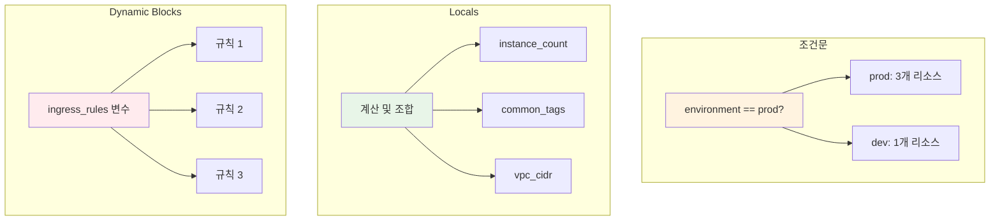

# November Week 3 Day 1 Session 2: Terraform 조건문 & Locals

<div align="center">

**🎯 조건문** • **📊 Locals** • **🔀 Dynamic Blocks**

*환경별 리소스 제어 및 계산 로직 구현*

</div>

---

## 🕘 세션 정보
**시간**: 09:50-10:30 (40분)
**목표**: 조건문과 Locals를 활용한 유연한 인프라 코드 작성
**방식**: 이론 + 코드 예시

## 🎯 학습 목표
- 조건문으로 환경별 리소스 제어
- Locals를 이용한 계산 및 변수 조합
- Dynamic Blocks로 반복 블록 생성
- 환경별 설정 분리 전략 수립

---

## 📖 기술 개요

### 1. 생성 배경 (Why?) - 5분

**문제 상황**:
- **환경별 다른 구성**: dev는 NAT Gateway 1개, prod는 3개 필요
  ```hcl
  # 나쁜 예: 환경별 코드 복사
  # dev/main.tf
  resource "aws_nat_gateway" "main" {
    count = 1
  }
  
  # prod/main.tf
  resource "aws_nat_gateway" "main" {
    count = 3
  }
  ```
- **복잡한 계산**: CIDR 블록 계산, 태그 조합 등
- **반복 블록**: Security Group 규칙 여러 개 정의

**Terraform 솔루션**:
- **조건문**: `condition ? true_val : false_val`
- **Locals**: 계산 및 변수 조합
- **Dynamic Blocks**: 반복 블록 생성

---

### 2. 핵심 원리 (How?) - 10분

**작동 원리**:

**조건문 (Conditional Expression)**:
```hcl
# 기본 문법
condition ? true_value : false_value

# 예시 1: 환경별 인스턴스 타입
variable "environment" {
  type = string
}

resource "aws_instance" "app" {
  instance_type = var.environment == "prod" ? "t3.medium" : "t3.micro"
}

# 예시 2: 환경별 리소스 생성 여부
resource "aws_nat_gateway" "main" {
  count = var.environment == "prod" ? 3 : 1
  
  allocation_id = aws_eip.nat[count.index].id
  subnet_id     = aws_subnet.public[count.index].id
}

# 예시 3: 조건부 리소스 생성
resource "aws_db_instance" "replica" {
  count = var.enable_read_replica ? 1 : 0
  
  replicate_source_db = aws_db_instance.main.id
}
```

**Locals (Local Values)**:
```hcl
# 계산 및 변수 조합
locals {
  # 환경별 설정
  instance_count = var.environment == "prod" ? 3 : 1
  instance_type  = var.environment == "prod" ? "t3.medium" : "t3.micro"
  
  # CIDR 계산
  vpc_cidr = "10.${var.vpc_number}.0.0/16"
  
  # 태그 조합
  common_tags = {
    Project     = var.project_name
    Environment = var.environment
    ManagedBy   = "Terraform"
  }
  
  # 복잡한 로직
  enable_multi_az = var.environment == "prod" && var.enable_ha
}

# Locals 사용
resource "aws_instance" "app" {
  count         = local.instance_count
  instance_type = local.instance_type
  
  tags = merge(
    local.common_tags,
    {
      Name = "app-${count.index + 1}"
    }
  )
}
```

**Dynamic Blocks**:
```hcl
# 반복 블록 생성
variable "ingress_rules" {
  type = list(object({
    port        = number
    protocol    = string
    cidr_blocks = list(string)
  }))
  default = [
    { port = 80, protocol = "tcp", cidr_blocks = ["0.0.0.0/0"] },
    { port = 443, protocol = "tcp", cidr_blocks = ["0.0.0.0/0"] },
    { port = 22, protocol = "tcp", cidr_blocks = ["10.0.0.0/16"] }
  ]
}

resource "aws_security_group" "web" {
  name = "web-sg"
  
  dynamic "ingress" {
    for_each = var.ingress_rules
    
    content {
      from_port   = ingress.value.port
      to_port     = ingress.value.port
      protocol    = ingress.value.protocol
      cidr_blocks = ingress.value.cidr_blocks
    }
  }
}
```

**다이어그램**:


---

### 3. 주요 사용 사례 (When?) - 5분

**적합한 경우**:

**조건문**:
- 환경별 다른 구성 (dev/prod)
- 선택적 리소스 생성
- 설정 값 분기

**Locals**:
- 복잡한 계산
- 변수 조합
- 반복 사용되는 값

**Dynamic Blocks**:
- Security Group 규칙
- IAM Policy Statement
- 반복되는 블록 구조

**실제 사례**:
```hcl
# 사례 1: 환경별 Multi-AZ 제어
locals {
  create_multi_az = var.environment == "prod"
  az_count        = local.create_multi_az ? 3 : 1
}

resource "aws_subnet" "private" {
  count = local.az_count
  
  cidr_block        = "10.0.${count.index + 11}.0/24"
  availability_zone = data.aws_availability_zones.available.names[count.index]
}

# 사례 2: 태그 표준화
locals {
  common_tags = {
    Project     = "MyApp"
    Environment = var.environment
    ManagedBy   = "Terraform"
    CostCenter  = var.cost_center
  }
}

resource "aws_instance" "app" {
  tags = merge(
    local.common_tags,
    {
      Name = "app-server"
      Role = "web"
    }
  )
}

# 사례 3: 복잡한 Security Group
variable "allowed_ports" {
  type = map(object({
    port        = number
    protocol    = string
    description = string
  }))
  default = {
    "http"  = { port = 80, protocol = "tcp", description = "HTTP" }
    "https" = { port = 443, protocol = "tcp", description = "HTTPS" }
    "ssh"   = { port = 22, protocol = "tcp", description = "SSH" }
  }
}

resource "aws_security_group" "web" {
  dynamic "ingress" {
    for_each = var.allowed_ports
    
    content {
      from_port   = ingress.value.port
      to_port     = ingress.value.port
      protocol    = ingress.value.protocol
      description = ingress.value.description
      cidr_blocks = ["0.0.0.0/0"]
    }
  }
}
```

---

### 4. 비슷한 기술 비교 (Which?) - 5분

**Terraform 내 대안**:

**조건문 vs count = 0**:
- **언제 조건문 사용**: 값 선택 (instance_type, cidr_block)
- **언제 count = 0 사용**: 리소스 생성 여부 (선택적 리소스)

**Locals vs Variables**:
- **언제 Locals 사용**: 계산, 조합, 내부 로직
- **언제 Variables 사용**: 외부 입력, 환경별 설정

**선택 기준 표**:
| 기준 | 조건문 | count = 0 | Locals | Variables |
|------|--------|-----------|--------|-----------|
| **용도** | 값 선택 | 리소스 생성 여부 | 계산/조합 | 외부 입력 |
| **외부 입력** | 불가 | 불가 | 불가 | 가능 |
| **재사용** | 낮음 | 낮음 | 높음 | 높음 |
| **가독성** | 중간 | 높음 | 높음 | 높음 |

---

### 5. 장단점 분석 - 3분

**조건문 장점**:
- ✅ 간단한 분기 처리
- ✅ 인라인 사용 가능
- ✅ 직관적

**조건문 단점**:
- ⚠️ 복잡한 로직 어려움
- ⚠️ 중첩 시 가독성 저하

**Locals 장점**:
- ✅ 복잡한 계산 가능
- ✅ 재사용성 높음
- ✅ 가독성 향상
- ✅ 디버깅 용이

**Locals 단점**:
- ⚠️ 외부 입력 불가
- ⚠️ 별도 블록 필요

---

### 6. 비용 구조 💰 - 5분

**과금 방식**:
- Terraform 자체는 무료
- 조건문/Locals로 생성된 리소스 비용만 발생

**프리티어 혜택**:
- Terraform: 무료
- AWS 리소스: 각 서비스별 프리티어

**비용 최적화 팁**:
1. **환경별 리소스 수 조절**:
   ```hcl
   locals {
     nat_gateway_count = var.environment == "prod" ? 3 : 1
   }
   # dev: $0.045/시간, prod: $0.135/시간
   ```

2. **조건부 리소스 생성**:
   ```hcl
   resource "aws_db_instance" "replica" {
     count = var.enable_read_replica ? 1 : 0
   }
   # 필요할 때만 생성으로 비용 절감
   ```

3. **인스턴스 타입 최적화**:
   ```hcl
   locals {
     instance_type = var.environment == "prod" ? "t3.medium" : "t3.micro"
   }
   # dev: $0.0104/시간, prod: $0.0416/시간
   ```

**예상 비용 절감**:
- dev 환경: 약 70% 절감 (최소 리소스)
- 조건부 리소스: 불필요한 비용 제거

---

### 7. 최신 업데이트 🆕 - 2분

**2024년 주요 변경사항**:
- Terraform 1.7: 조건문 성능 개선
- Terraform 1.8: Dynamic Blocks 에러 메시지 개선

**2025년 예정**:
- 더 강력한 조건문 기능 추가 예정

**참조**: [Terraform Changelog](https://github.com/hashicorp/terraform/blob/main/CHANGELOG.md)

---

### 8. 잘 사용하는 방법 ✅ - 3분

**베스트 프랙티스**:
1. **Locals로 복잡한 로직 분리**:
   ```hcl
   locals {
     # 복잡한 계산은 Locals에
     enable_nat_gateway = var.environment == "prod" && var.enable_ha
     nat_gateway_count  = local.enable_nat_gateway ? 3 : 1
   }
   ```

2. **조건문 중첩 최소화**:
   ```hcl
   # ❌ 나쁜 예
   var.env == "prod" ? (var.ha ? 3 : 2) : 1
   
   # ✅ 좋은 예
   locals {
     base_count = var.environment == "prod" ? 2 : 1
     final_count = var.enable_ha ? local.base_count + 1 : local.base_count
   }
   ```

3. **Dynamic Blocks 활용**:
   ```hcl
   # Security Group 규칙을 변수로 관리
   dynamic "ingress" {
     for_each = var.ingress_rules
     content {
       from_port   = ingress.value.port
       to_port     = ingress.value.port
       protocol    = ingress.value.protocol
       cidr_blocks = ingress.value.cidr_blocks
     }
   }
   ```

**실무 팁**:
- **환경 변수 검증**: validation 블록 사용
- **기본값 설정**: 안전한 기본값 제공
- **주석 추가**: 복잡한 로직은 주석으로 설명

---

### 9. 잘못 사용하는 방법 ❌ - 3분

**흔한 실수**:
1. **조건문 과다 사용**:
   ```hcl
   # ❌ 가독성 저하
   instance_type = var.env == "prod" ? (var.size == "large" ? "t3.large" : "t3.medium") : "t3.micro"
   
   # ✅ Locals 사용
   locals {
     instance_types = {
       "prod-large"  = "t3.large"
       "prod-medium" = "t3.medium"
       "dev"         = "t3.micro"
     }
     instance_key = var.environment == "prod" ? "prod-${var.size}" : "dev"
   }
   instance_type = local.instance_types[local.instance_key]
   ```

2. **Locals에 외부 입력 기대**:
   ```hcl
   # ❌ Locals는 외부 입력 불가
   locals {
     user_input = ???  # 불가능
   }
   
   # ✅ Variables 사용
   variable "user_input" {
     type = string
   }
   ```

3. **Dynamic Blocks 남용**:
   ```hcl
   # ❌ 단순한 경우 Dynamic 불필요
   dynamic "ingress" {
     for_each = [80]  # 1개만 있으면 불필요
   }
   
   # ✅ 직접 정의
   ingress {
     from_port = 80
     to_port   = 80
   }
   ```

**안티 패턴**:
- 모든 값을 조건문으로 처리
- Locals 없이 복잡한 계산 반복
- Dynamic Blocks를 모든 곳에 사용

---

### 10. 구성 요소 상세 - 5분

**주요 구성 요소**:

**1. 조건문 (Conditional Expression)**:
- **역할**: 조건에 따라 다른 값 선택
- **문법**: `condition ? true_val : false_val`
- **사용 위치**: 모든 인자 값

**2. Locals**:
- **역할**: 계산 및 변수 조합
- **문법**: `locals { key = value }`
- **참조**: `local.key`
- **특징**: 한 번 계산 후 재사용

**3. Dynamic Blocks**:
- **역할**: 반복 블록 생성
- **문법**: `dynamic "block_name" { for_each = ... content { } }`
- **사용 위치**: 중첩 블록 (ingress, egress 등)

**조합 예시**:
```hcl
# 조건문 + Locals + Dynamic Blocks 조합
variable "environment" {
  type = string
}

variable "security_rules" {
  type = map(object({
    port        = number
    protocol    = string
    cidr_blocks = list(string)
  }))
}

locals {
  # 환경별 규칙 필터링
  filtered_rules = {
    for k, v in var.security_rules :
    k => v
    if var.environment == "prod" || k != "debug"
  }
  
  # 공통 태그
  common_tags = {
    Environment = var.environment
    ManagedBy   = "Terraform"
  }
}

resource "aws_security_group" "main" {
  name = "${var.environment}-sg"
  
  # Dynamic Blocks로 규칙 생성
  dynamic "ingress" {
    for_each = local.filtered_rules
    
    content {
      from_port   = ingress.value.port
      to_port     = ingress.value.port
      protocol    = ingress.value.protocol
      cidr_blocks = ingress.value.cidr_blocks
      description = ingress.key
    }
  }
  
  tags = local.common_tags
}
```

---

### 11. 공식 문서 링크 (필수 5개)

**⚠️ 학생들이 직접 확인해야 할 공식 문서**:
- 📘 [Conditional Expressions](https://www.terraform.io/language/expressions/conditionals)
- 📗 [Local Values](https://www.terraform.io/language/values/locals)
- 📙 [Dynamic Blocks](https://www.terraform.io/language/expressions/dynamic-blocks)
- 📕 [Functions](https://www.terraform.io/language/functions)
- 🆕 [Terraform 1.8 Release](https://github.com/hashicorp/terraform/releases)

---

## 💭 함께 생각해보기

**🤝 페어 토론** (5분):
1. **환경 분리**: "dev와 prod 환경에서 어떤 리소스를 다르게 구성하시겠어요?"
2. **비용 최적화**: "조건문으로 어떻게 비용을 절감할 수 있을까요?"
3. **실무 적용**: "여러분의 프로젝트에서 반복되는 블록은 무엇인가요?"

---

## 🔑 핵심 키워드

- **조건문 (Conditional Expression)**: `condition ? true : false` 형태의 분기 처리
- **Locals (Local Values)**: 계산 및 변수 조합을 위한 로컬 변수
- **Dynamic Blocks**: 반복 블록을 동적으로 생성
- **merge()**: Map을 병합하는 함수
- **validation**: 변수 값 검증

---

## 📝 세션 마무리

### ✅ 오늘 세션 성과
- [ ] 조건문으로 환경별 리소스 제어
- [ ] Locals로 복잡한 계산 처리
- [ ] Dynamic Blocks로 반복 블록 생성
- [ ] 실무 활용 패턴 습득

### 🎯 다음 세션 준비
- **Session 3**: 리소스 의존성 관리
- **연계**: 조건문 + 의존성 조합

---

<div align="center">

**🎯 조건문** • **📊 Locals** • **🔀 Dynamic Blocks** • **✨ 유연성**

*Session 2: Terraform 조건문 & Locals 완전 정복*

</div>
