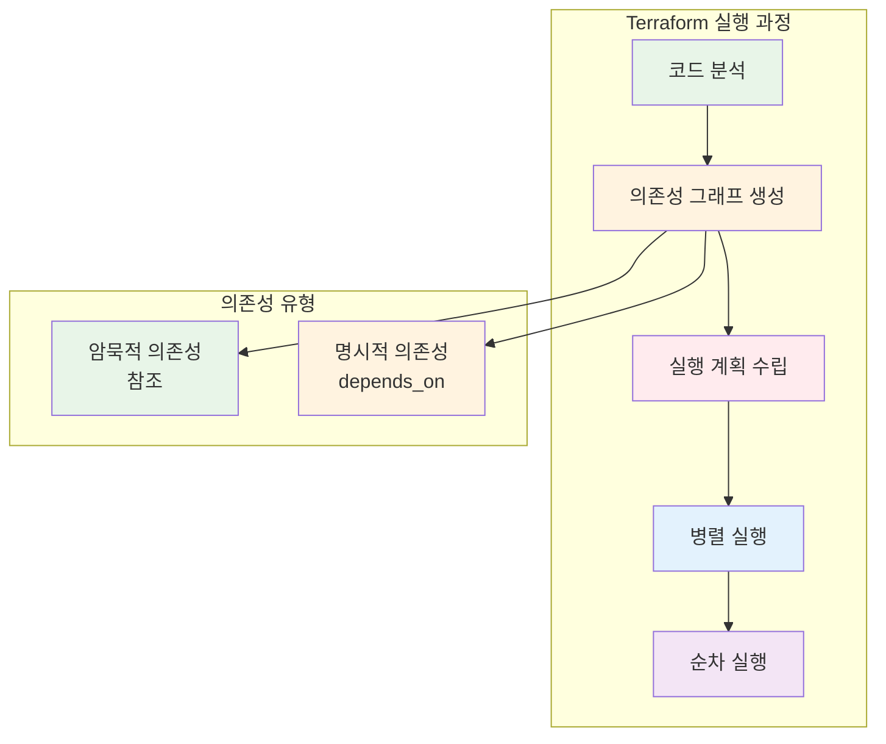
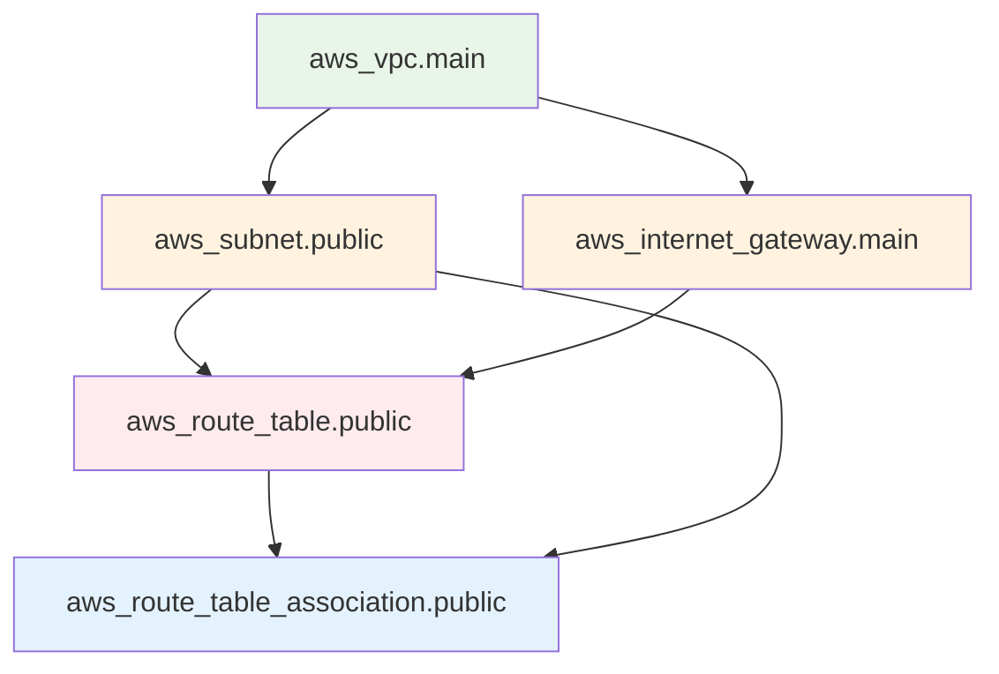

# November Week 3 Day 1 Session 3: 리소스 의존성 관리

<div align="center">

**🔗 depends_on** • **🔄 암묵적 의존성** • **📊 의존성 그래프**

*안전한 리소스 생성 순서 제어*

</div>

---

## 🕘 세션 정보
**시간**: 10:40-11:20 (40분)
**목표**: Terraform 리소스 의존성 관리 마스터
**방식**: 이론 설명 + 실습 예제

## 🎯 학습 목표
- **명시적 의존성**: depends_on으로 생성 순서 제어
- **암묵적 의존성**: 참조를 통한 자동 의존성
- **의존성 그래프**: Terraform 실행 계획 이해
- **순환 참조**: 의존성 오류 방지 및 해결

---

## 📖 서비스 개요

### 1. 생성 배경 (Why?) - 5분

**문제 상황**:
- **순서 문제**: 리소스 생성 순서가 중요한 경우 (예: IAM Role → Lambda Function)
- **타이밍 이슈**: 리소스가 완전히 준비되기 전에 다른 리소스가 참조
- **삭제 순서**: 의존 관계가 있는 리소스의 안전한 삭제
- **복잡한 관계**: 여러 리소스 간 복잡한 의존 관계 관리

**🏠 실생활 비유**:
집을 지을 때 순서가 중요합니다:
1. **기초 공사** (VPC) → 먼저 완료
2. **골조 공사** (Subnet) → 기초 위에 건설
3. **내부 공사** (EC2) → 골조 완성 후 진행
4. **마감 공사** (Security Group) → 마지막 단계

Terraform도 마찬가지로 리소스 생성 순서가 중요합니다.

**Terraform 솔루션**:
- **자동 의존성 감지**: 참조를 통한 자동 순서 결정
- **명시적 의존성**: depends_on으로 순서 강제
- **의존성 그래프**: 시각적으로 관계 확인
- **병렬 실행**: 독립적인 리소스는 동시 생성

### 2. 핵심 원리 (How?) - 10분

**작동 원리**:



**1. 암묵적 의존성 (Implicit Dependencies)**:

```hcl
# VPC 생성
resource "aws_vpc" "main" {
  cidr_block = "10.0.0.0/16"
}

# Subnet 생성 (VPC 참조 → 자동 의존성)
resource "aws_subnet" "public" {
  vpc_id     = aws_vpc.main.id  # ← 참조로 의존성 자동 생성
  cidr_block = "10.0.1.0/24"
}

# Internet Gateway (VPC 참조)
resource "aws_internet_gateway" "main" {
  vpc_id = aws_vpc.main.id  # ← 자동 의존성
}
```

**실행 순서**:
```
1. aws_vpc.main 생성
2. aws_subnet.public, aws_internet_gateway.main 병렬 생성
```

**2. 명시적 의존성 (Explicit Dependencies)**:

```hcl
# S3 버킷
resource "aws_s3_bucket" "logs" {
  bucket = "my-app-logs"
}

# Lambda 함수
resource "aws_lambda_function" "processor" {
  function_name = "log-processor"
  # ... 설정 ...
  
  # S3 버킷이 완전히 생성된 후 Lambda 생성
  depends_on = [aws_s3_bucket.logs]
}

# Lambda 권한
resource "aws_lambda_permission" "allow_s3" {
  statement_id  = "AllowS3Invoke"
  action        = "lambda:InvokeFunction"
  function_name = aws_lambda_function.processor.function_name
  principal     = "s3.amazonaws.com"
  source_arn    = aws_s3_bucket.logs.arn
  
  # Lambda 함수가 완전히 생성된 후 권한 부여
  depends_on = [aws_lambda_function.processor]
}
```

**3. 의존성 그래프 확인**:

```bash
# 의존성 그래프 생성
terraform graph | dot -Tpng > graph.png

# 또는 간단히 확인
terraform graph
```

**의존성 그래프 예시**:


### 3. 주요 사용 사례 (When?) - 5분

**적합한 경우**:

**1. IAM 리소스 생성**:
```hcl
# IAM Role
resource "aws_iam_role" "lambda" {
  name = "lambda-execution-role"
  # ... 설정 ...
}

# IAM Policy 연결
resource "aws_iam_role_policy_attachment" "lambda_policy" {
  role       = aws_iam_role.lambda.name
  policy_arn = "arn:aws:iam::aws:policy/service-role/AWSLambdaBasicExecutionRole"
}

# Lambda 함수 (Role이 완전히 준비된 후)
resource "aws_lambda_function" "main" {
  function_name = "my-function"
  role          = aws_iam_role.lambda.arn
  
  # IAM Policy가 연결된 후 Lambda 생성
  depends_on = [aws_iam_role_policy_attachment.lambda_policy]
}
```

**2. 네트워크 리소스**:
```hcl
# VPC Endpoint
resource "aws_vpc_endpoint" "s3" {
  vpc_id       = aws_vpc.main.id
  service_name = "com.amazonaws.ap-northeast-2.s3"
  
  # Route Table이 생성된 후 Endpoint 생성
  depends_on = [aws_route_table.private]
}
```

**3. 데이터베이스 초기화**:
```hcl
# RDS 인스턴스
resource "aws_db_instance" "main" {
  identifier = "mydb"
  # ... 설정 ...
}

# 초기 데이터 로드 (null_resource 사용)
resource "null_resource" "db_init" {
  provisioner "local-exec" {
    command = "psql -h ${aws_db_instance.main.endpoint} -f init.sql"
  }
  
  # RDS가 완전히 준비된 후 초기화
  depends_on = [aws_db_instance.main]
}
```

**실제 사례**:
- **Netflix**: 복잡한 마이크로서비스 인프라의 의존성 관리
- **Airbnb**: 멀티 리전 배포 시 리소스 순서 제어
- **Uber**: 데이터베이스 마이그레이션과 애플리케이션 배포 순서

### 4. 비슷한 기능 비교 (Which?) - 5분

**Terraform 의존성 관리 방법**:

**암묵적 의존성 (Implicit)** vs **명시적 의존성 (Explicit)**:
- **언제 암묵적 사용**: 참조로 충분한 경우 (대부분)
- **언제 명시적 사용**: 참조만으로 부족한 경우 (타이밍 이슈)

**선택 기준**:
| 기준 | 암묵적 의존성 | 명시적 의존성 |
|------|---------------|---------------|
| **사용 빈도** | 90% | 10% |
| **코드 간결성** | 높음 (자동) | 낮음 (명시 필요) |
| **명확성** | 참조로 명확 | depends_on으로 명확 |
| **적합한 경우** | 일반적인 참조 | 타이밍 이슈, 순서 강제 |
| **유지보수** | 쉬움 | 주의 필요 |

**다른 IaC 도구와 비교**:

**Terraform** vs **CloudFormation**:
- **Terraform**: 자동 의존성 감지 + depends_on
- **CloudFormation**: DependsOn 속성 (명시적만)

**Terraform** vs **Pulumi**:
- **Terraform**: 선언적 의존성
- **Pulumi**: 프로그래밍 언어의 순서 제어

### 5. 장단점 분석 - 3분

**장점**:
- ✅ **자동 감지**: 대부분의 의존성 자동 처리
- ✅ **병렬 실행**: 독립적인 리소스 동시 생성 (빠름)
- ✅ **안전한 삭제**: 역순으로 자동 삭제
- ✅ **시각화**: 의존성 그래프로 관계 확인
- ✅ **유연성**: 명시적 의존성으로 세밀한 제어

**단점/제약사항**:
- ⚠️ **순환 참조**: A → B → A 같은 순환 의존성 불가
- ⚠️ **복잡도**: 복잡한 의존성은 이해하기 어려움
- ⚠️ **타이밍 이슈**: 리소스가 "생성됨" 상태여도 실제 준비 안 된 경우
- ⚠️ **과도한 depends_on**: 불필요한 명시적 의존성은 성능 저하

**대안**:
- **모듈 분리**: 복잡한 의존성은 모듈로 분리
- **단계별 배포**: terraform apply -target으로 단계별 생성
- **프로비저너**: 리소스 준비 대기 로직 추가

### 6. 비용 구조 💰 - 5분

**과금 방식**:
- **Terraform 자체**: 무료 (오픈소스)
- **Terraform Cloud**: 팀 협업 시 유료 ($20/user/month)
- **AWS 리소스**: 생성된 리소스에 대한 AWS 요금

**프리티어 혜택**:
- Terraform: 완전 무료
- Terraform Cloud: 5명까지 무료

**비용 최적화 팁**:
1. **병렬 실행 활용**: 의존성 최소화로 빠른 배포
2. **불필요한 depends_on 제거**: 성능 향상
3. **모듈화**: 재사용으로 관리 비용 절감
4. **자동화**: CI/CD 통합으로 운영 비용 절감

**예상 비용 (Session 3 실습)**:
| 항목 | 비용 |
|------|------|
| Terraform 사용 | $0 (무료) |
| AWS 리소스 (VPC, Subnet) | $0 (무료) |
| NAT Gateway (1시간) | $0.045 |
| **합계** | **$0.045** |

### 7. 최신 업데이트 🆕 - 2분

**2024년 주요 변경사항**:
- **Terraform 1.7**: 의존성 그래프 성능 개선
- **Terraform 1.8**: 병렬 실행 최적화
- **향상된 에러 메시지**: 순환 참조 감지 개선

**2025년 예정**:
- **의존성 시각화 도구**: 내장 그래프 뷰어
- **자동 최적화**: 불필요한 의존성 자동 제거

**참조**: [Terraform 1.8 Release Notes](https://github.com/hashicorp/terraform/releases/tag/v1.8.0)

### 8. 잘 사용하는 방법 ✅ - 3분

**베스트 프랙티스**:
1. **암묵적 의존성 우선**: 가능하면 참조로 해결
2. **최소한의 depends_on**: 꼭 필요한 경우만 사용
3. **의존성 그래프 확인**: terraform graph로 검증
4. **모듈 경계 명확**: 모듈 간 의존성 최소화
5. **문서화**: 명시적 의존성 이유 주석 작성

**실무 팁**:
```hcl
# ✅ 좋은 예: 참조로 자동 의존성
resource "aws_security_group_rule" "allow_alb" {
  security_group_id        = aws_security_group.ecs.id
  source_security_group_id = aws_security_group.alb.id
}

# ✅ 좋은 예: 타이밍 이슈 해결
resource "aws_lambda_function" "main" {
  role = aws_iam_role.lambda.arn
  
  # IAM Policy 연결 완료 대기
  depends_on = [aws_iam_role_policy_attachment.lambda_policy]
}

# ✅ 좋은 예: 주석으로 이유 설명
resource "null_resource" "db_migration" {
  # RDS 인스턴스가 완전히 준비될 때까지 대기
  # 생성 직후에는 연결 불가능한 경우가 있음
  depends_on = [aws_db_instance.main]
}
```

**성능 최적화**:
- **병렬 실행 최대화**: 독립적인 리소스는 의존성 제거
- **모듈 분리**: 큰 프로젝트는 모듈로 분리하여 병렬 실행
- **타겟 배포**: terraform apply -target으로 필요한 부분만 배포

### 9. 잘못 사용하는 방법 ❌ - 3분

**흔한 실수**:
1. **과도한 depends_on**: 모든 리소스에 명시적 의존성
2. **순환 참조**: A → B → A 같은 순환 의존성
3. **불필요한 의존성**: 참조로 충분한데 depends_on 사용
4. **타이밍 무시**: 리소스 준비 시간 고려 안 함
5. **의존성 미확인**: terraform graph로 검증 안 함

**안티 패턴**:
```hcl
# ❌ 나쁜 예: 불필요한 depends_on
resource "aws_subnet" "public" {
  vpc_id = aws_vpc.main.id
  
  # 참조로 자동 의존성이 생기는데 불필요
  depends_on = [aws_vpc.main]
}

# ❌ 나쁜 예: 순환 참조
resource "aws_security_group" "app" {
  # ...
  depends_on = [aws_security_group.db]
}

resource "aws_security_group" "db" {
  # ...
  depends_on = [aws_security_group.app]  # 순환!
}

# ❌ 나쁜 예: 모든 리소스에 depends_on
resource "aws_instance" "web" {
  # ...
  depends_on = [
    aws_vpc.main,
    aws_subnet.public,
    aws_internet_gateway.main,
    aws_route_table.public,
    # ... 너무 많음!
  ]
}
```

**보안 취약점**:
- **의존성 무시**: 보안 그룹 없이 EC2 생성
- **순서 오류**: IAM Role 없이 Lambda 생성
- **타이밍 이슈**: 리소스 준비 전 접근 시도

### 10. 구성 요소 상세 - 5분

**주요 구성 요소**:

**1. 암묵적 의존성 (Implicit Dependencies)**:
- **역할**: 참조를 통한 자동 의존성 생성
- **형태**: `resource_type.name.attribute`
- **장점**: 코드 간결, 자동 관리
- **예시**:
  ```hcl
  vpc_id = aws_vpc.main.id  # 자동 의존성
  ```

**2. 명시적 의존성 (Explicit Dependencies)**:
- **역할**: depends_on으로 순서 강제
- **형태**: `depends_on = [resource_type.name]`
- **장점**: 타이밍 이슈 해결
- **예시**:
  ```hcl
  depends_on = [aws_iam_role_policy_attachment.lambda_policy]
  ```

**3. 의존성 그래프 (Dependency Graph)**:
- **역할**: 리소스 간 관계 시각화
- **생성**: `terraform graph`
- **활용**: 의존성 검증, 순환 참조 감지
- **도구**: Graphviz (dot)

**설정 옵션**:

**depends_on 사용법**:
```hcl
resource "aws_instance" "web" {
  # ... 설정 ...
  
  # 단일 의존성
  depends_on = [aws_security_group.web]
  
  # 또는 여러 의존성
  depends_on = [
    aws_security_group.web,
    aws_iam_role_policy_attachment.ec2_policy
  ]
}
```

**의존성 확인**:
```bash
# 의존성 그래프 생성
terraform graph

# PNG 이미지로 변환
terraform graph | dot -Tpng > graph.png

# 실행 계획 확인
terraform plan

# 특정 리소스만 적용
terraform apply -target=aws_vpc.main
```

**의존성**:
- **Terraform Core**: 의존성 그래프 엔진
- **AWS Provider**: AWS 리소스 의존성 정의
- **Graphviz**: 그래프 시각화 (선택)

### 11. 공식 문서 링크 (필수 5개)

**⚠️ 학생들이 직접 확인해야 할 공식 문서**:
- 📘 [Resource Dependencies](https://www.terraform.io/language/resources/behavior#resource-dependencies)
- 📗 [depends_on Meta-Argument](https://www.terraform.io/language/meta-arguments/depends_on)
- 📙 [Terraform Graph](https://www.terraform.io/cli/commands/graph)
- 📕 [Resource Behavior](https://www.terraform.io/language/resources/behavior)
- 🆕 [Terraform 1.8 Release Notes](https://github.com/hashicorp/terraform/releases/tag/v1.8.0)

---

## 💭 함께 생각해보기

### 🤝 페어 토론 (5분)

**토론 주제**:
1. **의존성 관리**: "여러분의 프로젝트에서 리소스 생성 순서가 중요한 경우는?"
2. **문제 해결**: "순환 참조 오류가 발생하면 어떻게 해결하시겠어요?"
3. **실무 적용**: "복잡한 인프라에서 의존성을 어떻게 관리하시겠어요?"

**페어 활동 가이드**:
- 👥 **자유 페어링**: 관심사나 경험이 비슷한 사람끼리
- 🔄 **역할 교대**: 5분씩 설명자/질문자 역할 바꾸기
- 📝 **핵심 정리**: 대화 내용 중 중요한 점 메모하기

### 🎯 전체 공유 (3분)
- **인사이트 공유**: 페어 토론에서 나온 좋은 아이디어
- **질문 수집**: 아직 이해가 어려운 부분
- **다음 연결**: Lab 실습과의 연결고리 확인

### 💡 이해도 체크 질문
- ✅ "암묵적 의존성과 명시적 의존성의 차이를 설명할 수 있나요?"
- ✅ "depends_on을 언제 사용해야 하는지 알고 있나요?"
- ✅ "순환 참조 오류를 어떻게 해결할 수 있나요?"

---

## 🔑 핵심 키워드

- **암묵적 의존성 (Implicit Dependencies)**: 참조를 통한 자동 의존성
- **명시적 의존성 (Explicit Dependencies)**: depends_on으로 순서 강제
- **의존성 그래프 (Dependency Graph)**: 리소스 간 관계 시각화
- **순환 참조 (Circular Dependency)**: A → B → A 같은 순환 의존성
- **병렬 실행 (Parallel Execution)**: 독립적인 리소스 동시 생성
- **terraform graph**: 의존성 그래프 생성 명령어

---

## 📝 세션 마무리

### ✅ 오늘 세션 성과
- [ ] 암묵적 의존성과 명시적 의존성 이해
- [ ] depends_on 사용법 습득
- [ ] 의존성 그래프 확인 방법 파악
- [ ] 순환 참조 방지 및 해결 방법 이해
- [ ] 실무 베스트 프랙티스 학습

### 🎯 다음 세션 준비
- **Lab 1**: Multi-AZ VPC 구성
- **적용 내용**: 오늘 배운 의존성 관리 기술 활용
- **준비 사항**: Terraform 환경 확인

---

<div align="center">

**🔗 의존성 관리** • **📊 그래프 시각화** • **🔄 안전한 배포** • **⚡ 병렬 실행**

*Session 3: 리소스 의존성 관리 완료*

</div>
