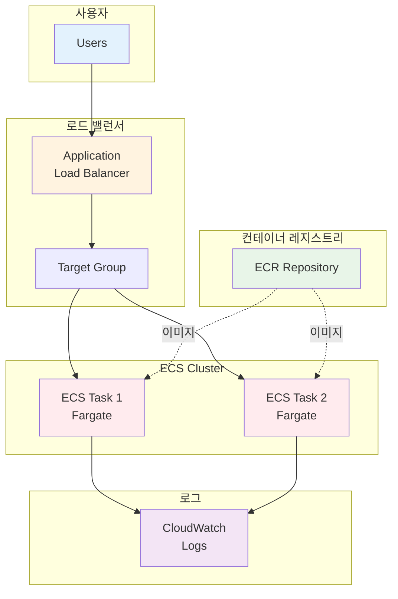

# November Week 3 Day 2: 컴퓨팅 리소스 코드화

<div align="center">

**💻 EC2** • **⚖️ ALB** • **🐳 ECR** • **📦 ECS**

*Terraform으로 컴퓨팅 인프라 완전 코드화*

</div>

---

## 🕘 일일 스케줄

### 📊 시간 배분
```
09:00-09:40  Session 1: EC2 & ALB (40분)
09:40-09:50  휴식 (10분)
09:50-10:30  Session 2: ECR (40분)
10:30-10:40  휴식 (10분)
10:40-11:20  Session 3: ECS Terraform (40분)
11:20-12:00  Lab: 전체 컴퓨팅 스택 (40분)
```

### 🗓️ 상세 스케줄
| 시간 | 구분 | 내용 | 목적 |
|------|------|------|------|
| **09:00-09:40** | 📚 이론 1 | EC2 & ALB (40분) | 가상 서버 및 로드 밸런서 |
| **09:40-09:50** | ☕ 휴식 | 10분 휴식 | |
| **09:50-10:30** | 📚 이론 2 | ECR (40분) | 컨테이너 이미지 저장소 |
| **10:30-10:40** | ☕ 휴식 | 10분 휴식 | |
| **10:40-11:20** | 📚 이론 3 | ECS Terraform (40분) | 컨테이너 오케스트레이션 |
| **11:20-12:00** | 🛠️ 실습 | 전체 컴퓨팅 스택 (40분) | 통합 배포 |

---

## 🎯 Day 2 목표

### 📚 학습 목표
- **EC2 & ALB**: 가상 서버 및 로드 밸런서 코드화
- **ECR**: 컨테이너 이미지 저장소 관리
- **ECS**: Fargate 컨테이너 오케스트레이션
- **통합**: 전체 컴퓨팅 스택 Terraform 관리

### 🛠️ 실무 역량
- 컴퓨팅 리소스 완전 자동화
- 컨테이너 인프라 코드화
- 고가용성 아키텍처 구현
- 이미지 라이프사이클 관리

---

## 📚 세션 구성

### Session 1: EC2 & ALB (09:00-09:40)
**주제**: EC2 인스턴스 및 Application Load Balancer 코드화

**핵심 내용**:
- AMI 선택 (Data Source)
- User Data 스크립트
- Key Pair 관리
- ALB, Target Group, Listener

**학습 포인트**:
- Data Source로 최신 AMI 자동 선택
- User Data로 초기화 자동화
- ALB로 고가용성 구현
- Health Check 설정

**코드 예시**:
```hcl
# 최신 Amazon Linux 2 AMI 자동 선택
data "aws_ami" "amazon_linux_2" {
  most_recent = true
  owners      = ["amazon"]
  
  filter {
    name   = "name"
    values = ["amzn2-ami-hvm-*-x86_64-gp2"]
  }
}

# EC2 인스턴스
resource "aws_instance" "web" {
  ami           = data.aws_ami.amazon_linux_2.id
  instance_type = var.instance_type
  subnet_id     = aws_subnet.public[0].id
  
  vpc_security_group_ids = [aws_security_group.web.id]
  
  user_data = <<-EOF
              #!/bin/bash
              yum update -y
              yum install -y docker
              systemctl start docker
              systemctl enable docker
              EOF
  
  tags = {
    Name = "web-server"
  }
}

# Application Load Balancer
resource "aws_lb" "main" {
  name               = "main-alb"
  internal           = false
  load_balancer_type = "application"
  security_groups    = [aws_security_group.alb.id]
  subnets            = aws_subnet.public[*].id
  
  tags = {
    Name = "main-alb"
  }
}

# Target Group
resource "aws_lb_target_group" "main" {
  name     = "main-tg"
  port     = 80
  protocol = "HTTP"
  vpc_id   = aws_vpc.main.id
  
  health_check {
    path                = "/"
    healthy_threshold   = 2
    unhealthy_threshold = 10
  }
}

# Listener
resource "aws_lb_listener" "main" {
  load_balancer_arn = aws_lb.main.arn
  port              = "80"
  protocol          = "HTTP"
  
  default_action {
    type             = "forward"
    target_group_arn = aws_lb_target_group.main.arn
  }
}
```

---

### Session 2: ECR (09:50-10:30)
**주제**: Elastic Container Registry로 컨테이너 이미지 관리

**핵심 내용**:
- ECR Repository 생성
- 이미지 라이프사이클 정책
- 이미지 스캔 설정
- IAM 권한 관리

**학습 포인트**:
- 컨테이너 이미지 중앙 관리
- 자동 이미지 정리
- 보안 스캔 자동화
- 비용 최적화

**코드 예시**:
```hcl
# ECR Repository
resource "aws_ecr_repository" "app" {
  name                 = "my-app"
  image_tag_mutability = "MUTABLE"
  
  image_scanning_configuration {
    scan_on_push = true
  }
  
  tags = {
    Name = "my-app-repo"
  }
}

# 라이프사이클 정책 (오래된 이미지 자동 삭제)
resource "aws_ecr_lifecycle_policy" "app" {
  repository = aws_ecr_repository.app.name
  
  policy = jsonencode({
    rules = [
      {
        rulePriority = 1
        description  = "Keep last 10 images"
        selection = {
          tagStatus     = "any"
          countType     = "imageCountMoreThan"
          countNumber   = 10
        }
        action = {
          type = "expire"
        }
      }
    ]
  })
}

# ECR 접근 권한 (ECS Task Role)
resource "aws_iam_role_policy" "ecr_pull" {
  role = aws_iam_role.ecs_task_execution.id
  
  policy = jsonencode({
    Version = "2012-10-17"
    Statement = [
      {
        Effect = "Allow"
        Action = [
          "ecr:GetAuthorizationToken",
          "ecr:BatchCheckLayerAvailability",
          "ecr:GetDownloadUrlForLayer",
          "ecr:BatchGetImage"
        ]
        Resource = "*"
      }
    ]
  })
}

# Output: ECR Repository URL
output "ecr_repository_url" {
  value = aws_ecr_repository.app.repository_url
}
```

**이미지 푸시 명령어**:
```bash
# ECR 로그인
aws ecr get-login-password --region ap-northeast-2 | \
  docker login --username AWS --password-stdin <account-id>.dkr.ecr.ap-northeast-2.amazonaws.com

# 이미지 빌드
docker build -t my-app .

# 이미지 태그
docker tag my-app:latest <ecr-url>:latest

# 이미지 푸시
docker push <ecr-url>:latest
```

---

### Session 3: ECS Terraform (10:40-11:20)
**주제**: ECS Fargate 컨테이너 오케스트레이션 코드화

**핵심 내용**:
- ECS Cluster
- Task Definition (ECR 이미지 사용)
- ECS Service
- CloudWatch Logs 통합

**학습 포인트**:
- Fargate 서버리스 컨테이너
- Task Definition 구조
- Service Auto Scaling
- 로그 중앙 관리

**코드 예시**:
```hcl
# ECS Cluster
resource "aws_ecs_cluster" "main" {
  name = "main-cluster"
  
  setting {
    name  = "containerInsights"
    value = "enabled"
  }
}

# Task Definition (ECR 이미지 사용)
resource "aws_ecs_task_definition" "app" {
  family                   = "app"
  network_mode             = "awsvpc"
  requires_compatibilities = ["FARGATE"]
  cpu                      = "256"
  memory                   = "512"
  execution_role_arn       = aws_iam_role.ecs_task_execution.arn
  
  container_definitions = jsonencode([
    {
      name  = "app"
      image = "${aws_ecr_repository.app.repository_url}:latest"
      
      portMappings = [
        {
          containerPort = 80
          protocol      = "tcp"
        }
      ]
      
      logConfiguration = {
        logDriver = "awslogs"
        options = {
          "awslogs-group"         = aws_cloudwatch_log_group.ecs.name
          "awslogs-region"        = "ap-northeast-2"
          "awslogs-stream-prefix" = "app"
        }
      }
    }
  ])
}

# ECS Service
resource "aws_ecs_service" "app" {
  name            = "app-service"
  cluster         = aws_ecs_cluster.main.id
  task_definition = aws_ecs_task_definition.app.arn
  desired_count   = 2
  launch_type     = "FARGATE"
  
  network_configuration {
    subnets          = aws_subnet.private[*].id
    security_groups  = [aws_security_group.ecs.id]
    assign_public_ip = false
  }
  
  load_balancer {
    target_group_arn = aws_lb_target_group.main.arn
    container_name   = "app"
    container_port   = 80
  }
  
  depends_on = [aws_lb_listener.main]
}

# CloudWatch Log Group
resource "aws_cloudwatch_log_group" "ecs" {
  name              = "/ecs/app"
  retention_in_days = 7
}
```

---

## 🛠️ 실습 (Lab 1)

### Lab 1: 전체 컴퓨팅 스택 배포
**시간**: 11:20-12:00 (40분)
**목표**: EC2 + ALB + ECR + ECS 통합 배포

**실습 내용**:
1. **ECR Repository 생성**
   - 이미지 저장소 생성
   - 라이프사이클 정책 설정
   - 샘플 이미지 푸시

2. **ALB 구성**
   - Application Load Balancer
   - Target Group
   - Listener 설정

3. **ECS Fargate 배포**
   - ECS Cluster 생성
   - Task Definition (ECR 이미지)
   - ECS Service 배포

4. **통합 테스트**
   - ALB DNS로 접근
   - 컨테이너 로그 확인
   - Health Check 검증

**디렉토리 구조**:
```
lab1/
├── main.tf           # VPC, ALB, ECS
├── ecr.tf            # ECR Repository
├── iam.tf            # IAM Roles
├── variables.tf      # 변수 정의
├── outputs.tf        # 출력 값
└── app/
    ├── Dockerfile    # 샘플 앱
    └── index.html    # 샘플 페이지
```

---

## 🏗️ Day 2 아키텍처

### 전체 구조


### 주요 구성 요소
- **ALB**: Layer 7 로드 밸런싱
- **ECR**: 컨테이너 이미지 저장소
- **ECS Fargate**: 서버리스 컨테이너
- **CloudWatch**: 로그 중앙 관리

---

## 💰 예상 비용

### Day 2 리소스 비용
| 리소스 | 사양 | 시간당 | 실습 시간 | 예상 비용 |
|--------|------|--------|-----------|-----------|
| ALB | 1개 | $0.0225 | 1시간 | $0.0225 |
| ECR | 500MB | $0.10/GB/월 | - | $0.05 |
| ECS Fargate | 0.25 vCPU, 0.5GB × 2 | $0.01 | 1시간 | $0.02 |
| CloudWatch Logs | 1GB | 무료 (프리티어) | - | $0 |
| **합계** | | | | **$0.0925** |

### 비용 절감 팁
- ALB는 실습 완료 후 즉시 삭제
- ECR 이미지는 라이프사이클 정책으로 자동 정리
- ECS는 최소 스펙 사용 (0.25 vCPU, 0.5GB)
- CloudWatch Logs는 7일 보관

---

## ✅ Day 2 체크리스트

### 이론 학습
- [ ] EC2 Data Source로 AMI 자동 선택
- [ ] User Data로 초기화 자동화
- [ ] ALB, Target Group, Listener 구조 이해
- [ ] ECR Repository 생성 및 관리
- [ ] 이미지 라이프사이클 정책 설정
- [ ] ECS Task Definition 구조 이해
- [ ] ECS Service 배포 방법 파악

### 실습 완료
- [ ] ECR Repository 생성 및 이미지 푸시
- [ ] ALB 및 Target Group 구성
- [ ] ECS Cluster 생성
- [ ] Task Definition 작성 (ECR 이미지)
- [ ] ECS Service 배포
- [ ] ALB DNS로 접근 확인
- [ ] CloudWatch Logs 확인

### 실무 역량
- [ ] 컴퓨팅 인프라 완전 코드화
- [ ] 컨테이너 이미지 관리
- [ ] 고가용성 아키텍처 구현
- [ ] 로그 중앙 관리 체계

---

## 🔗 관련 자료

### 📖 Terraform 공식 문서
- [AWS EC2 Instance](https://registry.terraform.io/providers/hashicorp/aws/latest/docs/resources/instance)
- [AWS ALB](https://registry.terraform.io/providers/hashicorp/aws/latest/docs/resources/lb)
- [AWS ECR Repository](https://registry.terraform.io/providers/hashicorp/aws/latest/docs/resources/ecr_repository)
- [AWS ECS Cluster](https://registry.terraform.io/providers/hashicorp/aws/latest/docs/resources/ecs_cluster)
- [AWS ECS Task Definition](https://registry.terraform.io/providers/hashicorp/aws/latest/docs/resources/ecs_task_definition)

### 🎯 다음 Day
- [Day 3: 데이터베이스 & 메시징 코드화](../day3/README.md)

---

## 💡 Day 2 회고

### 🤝 학습 성과
1. **컴퓨팅 스택**: EC2, ALB, ECR, ECS 전체 코드화
2. **컨테이너 관리**: ECR로 이미지 중앙 관리
3. **고가용성**: ALB + ECS로 안정적 서비스
4. **자동화**: Terraform으로 전체 자동 배포

### 📊 다음 학습
- **Day 3**: RDS, ElastiCache, SQS/SNS, API Gateway
- **데이터 계층**: 데이터베이스 및 메시징 코드화

---

<div align="center">

**💻 EC2** • **⚖️ ALB** • **🐳 ECR** • **📦 ECS** • **📝 Terraform**

*Day 2: 컴퓨팅 인프라 완전 코드화*

</div>
