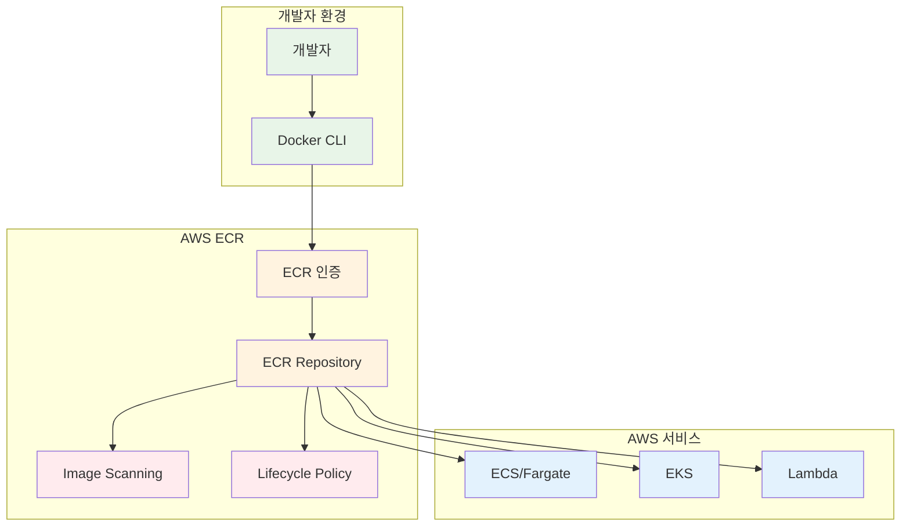

# November Week 3 Day 2 Session 2: ECR (Elastic Container Registry)

<div align="center">

**🐳 컨테이너 이미지** • **📦 레지스트리** • **🔒 보안 스캔**

*Docker 이미지를 안전하게 저장하고 관리하는 AWS 관리형 레지스트리*

</div>

---

## 🕘 세션 정보
**시간**: 09:50-10:30 (40분)
**목표**: ECR을 통한 컨테이너 이미지 관리 및 Terraform 코드화
**방식**: 이론 설명 + 실습 예제

## 🎯 학습 목표
- ECR의 생성 배경과 필요성 이해
- 컨테이너 이미지 저장소 관리 방법 습득
- Lifecycle Policy와 Image Scanning 활용
- Terraform으로 ECR 리소스 코드화

---

## 📖 서비스 개요

### 1. 생성 배경 (Why?) - 5분

**문제 상황**:
- **Docker Hub 제약**: Public 레지스트리의 Rate Limit (익명: 100 pulls/6시간, 인증: 200 pulls/6시간)
- **보안 우려**: Public 이미지의 취약점 및 악성 코드 위험
- **네트워크 비용**: 외부 레지스트리에서 이미지 Pull 시 데이터 전송 비용
- **이미지 관리**: 버전 관리, 정리, 접근 제어의 어려움

**실무 시나리오**:
```
상황: 스타트업이 Docker Hub를 사용하다가 문제 발생
- CI/CD 파이프라인에서 Rate Limit 초과로 빌드 실패
- 프로덕션 배포 중 이미지 Pull 실패
- 보안 팀에서 외부 이미지 사용 제한 요청
```

**AWS ECR 솔루션**:
- **무제한 Pull**: Rate Limit 없음
- **AWS 통합**: ECS, EKS, Lambda와 완벽 통합
- **보안 강화**: IAM 기반 접근 제어, 이미지 스캔
- **비용 효율**: 같은 리전 내 데이터 전송 무료

### 2. 핵심 원리 (How?) - 10분

**ECR 아키텍처**:


**작동 원리**:

**1. 인증 (Authentication)**:
```bash
# ECR 로그인 토큰 획득 (12시간 유효)
aws ecr get-login-password --region ap-northeast-2 | \
  docker login --username AWS --password-stdin \
  123456789012.dkr.ecr.ap-northeast-2.amazonaws.com
```

**2. 이미지 Push**:
```bash
# 이미지 태그
docker tag my-app:latest \
  123456789012.dkr.ecr.ap-northeast-2.amazonaws.com/my-app:latest

# 이미지 Push
docker push \
  123456789012.dkr.ecr.ap-northeast-2.amazonaws.com/my-app:latest
```

**3. 이미지 Pull**:
```bash
# ECS/EKS에서 자동으로 Pull
# IAM Role 기반 인증 (별도 로그인 불필요)
docker pull \
  123456789012.dkr.ecr.ap-northeast-2.amazonaws.com/my-app:latest
```

**주요 구성 요소**:

**Registry**:
- AWS 계정당 하나의 Private Registry
- URL: `{account-id}.dkr.ecr.{region}.amazonaws.com`
- IAM 기반 접근 제어

**Repository**:
- 이미지를 저장하는 논리적 단위
- 하나의 Repository에 여러 이미지 태그 저장
- 최대 100,000개 이미지 저장 가능 (2025년 8월 업데이트)

**Image**:
- Docker 이미지 또는 OCI 호환 이미지
- 태그로 버전 관리
- Manifest, Layer로 구성

### 3. 주요 사용 사례 (When?) - 5분

**적합한 경우**:

**1. 마이크로서비스 아키텍처**:
```
Netflix 사례:
- 수백 개의 마이크로서비스 이미지 관리
- 각 서비스별 Repository 분리
- Lifecycle Policy로 자동 정리
```

**2. CI/CD 파이프라인**:
```
Airbnb 사례:
- GitHub Actions에서 이미지 빌드
- ECR에 Push
- ECS/EKS에 자동 배포
```

**3. 멀티 리전 배포**:
```
Slack 사례:
- Cross-Region Replication 활용
- 각 리전에 이미지 복제
- 글로벌 서비스 지연 시간 최소화
```

**실제 사용 패턴**:
- **개발 환경**: 개발자가 로컬에서 빌드 → ECR Push
- **스테이징**: CI/CD에서 자동 빌드 → ECR Push → ECS 배포
- **프로덕션**: 승인된 이미지만 ECR에서 Pull → 배포

### 4. 비슷한 서비스 비교 (Which?) - 5분

**AWS 내 대안 서비스**:

**ECR vs Docker Hub**:
- **언제 Docker Hub 사용**: 
  - Public 오픈소스 프로젝트
  - 커뮤니티 공유 목적
  - 개인 학습 프로젝트
  
- **언제 ECR 사용**: 
  - 프로덕션 환경
  - AWS 서비스와 통합 필요
  - 보안 및 컴플라이언스 요구사항

**ECR vs S3 (이미지 저장)**:
- **언제 S3 사용**: 
  - 단순 파일 저장
  - 정적 자산 호스팅
  - 백업 목적
  
- **언제 ECR 사용**: 
  - 컨테이너 이미지 관리
  - Docker/OCI 표준 지원
  - 이미지 스캔 및 Lifecycle 관리

**선택 기준**:
| 기준 | ECR | Docker Hub | S3 |
|------|-----|------------|-----|
| **비용** | 스토리지 + 전송 | Free/Pro ($5/월) | 스토리지 + 전송 |
| **Rate Limit** | 없음 | 있음 (100-200/6h) | 없음 |
| **AWS 통합** | 완벽 | 제한적 | 제한적 |
| **보안 스캔** | 내장 | Pro 플랜 | 없음 |
| **Private** | 기본 | Pro 플랜 필요 | 기본 |
| **적합한 규모** | 모든 규모 | 소규모/개인 | 백업용 |

### 5. 장단점 분석 - 3분

**장점**:
- ✅ **무제한 Pull**: Rate Limit 없음
- ✅ **AWS 통합**: ECS, EKS, Lambda와 완벽 연동
- ✅ **보안 강화**: IAM 기반 접근 제어, 이미지 스캔
- ✅ **고가용성**: Multi-AZ 자동 복제
- ✅ **자동 정리**: Lifecycle Policy로 오래된 이미지 자동 삭제

**단점/제약사항**:
- ⚠️ **비용**: 스토리지 비용 발생 ($0.10/GB/월)
- ⚠️ **리전 제약**: 리전별 Registry (Cross-Region 복제 필요)
- ⚠️ **Public 제약**: Public Repository는 별도 서비스 (ECR Public)
- ⚠️ **학습 곡선**: AWS CLI 및 IAM 이해 필요

**대안 방법**:
- **비용 절감**: Lifecycle Policy로 오래된 이미지 자동 삭제
- **Public 공유**: ECR Public 사용 또는 Docker Hub 병행
- **멀티 리전**: Replication 설정으로 자동 복제

### 6. 비용 구조 💰 - 5분

**과금 방식**:
- **스토리지**: $0.10/GB/월 (ap-northeast-2)
- **데이터 전송**:
  - 같은 리전 내: 무료 (ECS, EKS, Lambda)
  - 인터넷으로 전송: $0.09/GB (첫 10TB)
  - Cross-Region 복제: $0.02/GB

**프리티어 혜택**:
- **12개월 무료**: 500MB 스토리지/월
- **항상 무료**: 같은 리전 내 데이터 전송

**비용 최적화 팁**:
1. **Lifecycle Policy 활용**:
   ```json
   {
     "rules": [{
       "rulePriority": 1,
       "description": "30일 이상 된 이미지 삭제",
       "selection": {
         "tagStatus": "any",
         "countType": "sinceImagePushed",
         "countUnit": "days",
         "countNumber": 30
       },
       "action": { "type": "expire" }
     }]
   }
   ```

2. **이미지 압축**: Multi-stage 빌드로 이미지 크기 최소화
3. **태그 정리**: 사용하지 않는 태그 정기 삭제
4. **Replication 최소화**: 필요한 리전만 복제
5. **Image Scanning**: 취약점 발견 시 즉시 삭제

**예상 비용 (ap-northeast-2)**:
| 시나리오 | 스토리지 | 전송 | 월 비용 |
|----------|----------|------|---------|
| **소규모** (10GB, 100GB 전송) | $1.00 | $0 (같은 리전) | **$1.00** |
| **중규모** (100GB, 1TB 전송) | $10.00 | $0 (같은 리전) | **$10.00** |
| **대규모** (1TB, 10TB 전송) | $100.00 | $0 (같은 리전) | **$100.00** |

**Lab 예상 비용**:
- 이미지 크기: 500MB
- 스토리지: $0.05/월
- 전송: $0 (같은 리전)
- **합계**: ~$0.05/월

### 7. 최신 업데이트 🆕 - 2분

**2024년 주요 변경사항**:
- **이미지 제한 증가**: Repository당 20,000 → 100,000 이미지 (2024년 8월)
- **Pull Through Cache**: 업스트림 레지스트리 캐싱 기능 강화
- **Enhanced Scanning**: Snyk 통합 보안 스캔
- **OCI Artifact 지원**: Helm Chart, WASM 등 OCI 호환 아티팩트

**2025년 예정**:
- **AI/ML 모델 저장**: 컨테이너 이미지 외 모델 파일 지원 검토
- **더 빠른 스캔**: 이미지 스캔 속도 개선
- **비용 최적화**: 스토리지 티어링 (자주 사용하지 않는 이미지 저렴한 스토리지로)

**Deprecated 기능**:
- 없음 (ECR은 안정적인 서비스)

**참조**: [AWS ECR What's New](https://aws.amazon.com/ecr/whats-new/)

### 8. 잘 사용하는 방법 ✅ - 3분

**베스트 프랙티스**:
1. **Immutable Tags**: 태그 덮어쓰기 방지
   ```hcl
   resource "aws_ecr_repository" "app" {
     name                 = "my-app"
     image_tag_mutability = "IMMUTABLE"  # 태그 변경 불가
   }
   ```

2. **Image Scanning**: Push 시 자동 스캔
   ```hcl
   image_scanning_configuration {
     scan_on_push = true
   }
   ```

3. **Lifecycle Policy**: 자동 정리
   ```hcl
   lifecycle_policy {
     policy = jsonencode({
       rules = [{
         rulePriority = 1
         description  = "Keep last 10 images"
         selection = {
           tagStatus   = "any"
           countType   = "imageCountMoreThan"
           countNumber = 10
         }
         action = { type = "expire" }
       }]
     })
   }
   ```

4. **Encryption**: 저장 데이터 암호화
   ```hcl
   encryption_configuration {
     encryption_type = "KMS"
     kms_key        = aws_kms_key.ecr.arn
   }
   ```

5. **Replication**: 멀티 리전 복제
   ```hcl
   replication_configuration {
     rule {
       destination {
         region      = "us-west-2"
         registry_id = data.aws_caller_identity.current.account_id
       }
     }
   }
   ```

**실무 팁**:
- **태그 전략**: `{version}-{git-sha}` 형식 사용 (예: `v1.2.3-abc123`)
- **CI/CD 통합**: GitHub Actions, GitLab CI에서 자동 빌드 및 Push
- **모니터링**: CloudWatch로 Push/Pull 메트릭 추적
- **IAM 최소 권한**: 필요한 Repository만 접근 허용

**성능 최적화**:
- **Layer 캐싱**: 자주 변경되지 않는 Layer를 먼저 배치
- **Multi-stage 빌드**: 최종 이미지 크기 최소화
- **Pull Through Cache**: 외부 이미지 캐싱으로 속도 향상

### 9. 잘못 사용하는 방법 ❌ - 3분

**흔한 실수**:
1. **Lifecycle Policy 미설정**: 오래된 이미지 누적으로 비용 증가
   ```
   ❌ 문제: 1년 동안 이미지 삭제 안 함 → 1TB 스토리지 → $100/월
   ✅ 해결: Lifecycle Policy로 30일 이상 이미지 자동 삭제
   ```

2. **Image Scanning 미활성화**: 취약점 있는 이미지 배포
   ```
   ❌ 문제: 보안 스캔 없이 배포 → 취약점 노출
   ✅ 해결: scan_on_push = true 설정
   ```

3. **Mutable Tags 사용**: 같은 태그로 다른 이미지 Push
   ```
   ❌ 문제: latest 태그 덮어쓰기 → 롤백 불가
   ✅ 해결: IMMUTABLE 설정 + 버전 태그 사용
   ```

4. **Public 노출**: Private Repository를 Public으로 잘못 설정
   ```
   ❌ 문제: 민감한 이미지 Public 노출
   ✅ 해결: Repository Policy 검증
   ```

5. **Cross-Region 과다 복제**: 불필요한 리전에 복제
   ```
   ❌ 문제: 모든 리전에 복제 → 비용 증가
   ✅ 해결: 필요한 리전만 선택적 복제
   ```

**안티 패턴**:
- **Root 계정 사용**: IAM User/Role 대신 Root 계정으로 Push
- **장기 토큰**: 12시간 토큰 만료 후 재인증 안 함
- **태그 없음**: 태그 없이 이미지 Push (관리 어려움)
- **대용량 이미지**: 최적화 없이 수 GB 이미지 Push

**보안 취약점**:
- **Public Repository**: 민감 정보 포함 이미지 Public 노출
- **IAM 과다 권한**: `ecr:*` 권한 부여 (최소 권한 원칙 위반)
- **암호화 미사용**: KMS 암호화 미설정

### 10. 구성 요소 상세 - 5분

**주요 구성 요소**:

**1. Repository**:
- **역할**: 이미지를 저장하는 논리적 컨테이너
- **설정 옵션**:
  - `image_tag_mutability`: MUTABLE (기본) / IMMUTABLE
  - `image_scanning_configuration`: scan_on_push
  - `encryption_configuration`: AES256 (기본) / KMS
- **제한**: Repository당 최대 100,000개 이미지

**2. Lifecycle Policy**:
- **역할**: 이미지 자동 정리 규칙
- **규칙 타입**:
  - `imageCountMoreThan`: 이미지 개수 초과 시 삭제
  - `sinceImagePushed`: Push 후 경과 일수 기준 삭제
- **우선순위**: rulePriority로 실행 순서 제어

**3. Image Scanning**:
- **역할**: 이미지 취약점 스캔
- **스캔 타입**:
  - **Basic Scanning**: CVE 데이터베이스 기반 (무료)
  - **Enhanced Scanning**: Snyk 통합 (유료)
- **결과**: CRITICAL, HIGH, MEDIUM, LOW 등급

**4. Repository Policy**:
- **역할**: Repository 접근 제어
- **정책 예시**:
  ```json
  {
    "Version": "2012-10-17",
    "Statement": [{
      "Sid": "AllowPull",
      "Effect": "Allow",
      "Principal": {
        "AWS": "arn:aws:iam::123456789012:role/ECSTaskRole"
      },
      "Action": [
        "ecr:GetDownloadUrlForLayer",
        "ecr:BatchGetImage"
      ]
    }]
  }
  ```

**5. Replication**:
- **역할**: 이미지 자동 복제
- **복제 타입**:
  - **Cross-Region**: 다른 리전으로 복제
  - **Cross-Account**: 다른 계정으로 복제
- **필터**: Repository 이름 패턴으로 선택적 복제

**설정 옵션**:
- **Encryption**: AES256 (기본) / KMS (고급)
- **Tag Mutability**: MUTABLE (기본) / IMMUTABLE (권장)
- **Scan on Push**: true (권장) / false
- **Lifecycle Rules**: 최대 50개 규칙

**의존성**:
- **IAM**: 접근 제어 및 인증
- **KMS**: 암호화 키 관리 (선택)
- **CloudWatch**: 로그 및 메트릭
- **ECS/EKS**: 이미지 Pull 및 배포

### 11. 공식 문서 링크 (필수 5개)

**⚠️ 학생들이 직접 확인해야 할 공식 문서**:
- 📘 [ECR란 무엇인가?](https://docs.aws.amazon.com/AmazonECR/latest/userguide/what-is-ecr.html)
- 📗 [ECR 사용자 가이드](https://docs.aws.amazon.com/AmazonECR/latest/userguide/)
- 📙 [ECR API 레퍼런스](https://docs.aws.amazon.com/AmazonECR/latest/APIReference/)
- 📕 [ECR 요금](https://aws.amazon.com/ecr/pricing/)
- 🆕 [ECR 최신 업데이트](https://aws.amazon.com/ecr/whats-new/)

---

## 💭 함께 생각해보기

### 🤝 페어 토론 (5분)

**토론 주제**:
1. **이미지 관리 전략**: "여러분의 프로젝트에서 Docker 이미지를 어떻게 관리하고 있나요? ECR을 사용하면 어떤 점이 개선될까요?"
2. **비용 최적화**: "Lifecycle Policy를 어떻게 설정하면 비용을 최소화하면서도 필요한 이미지를 유지할 수 있을까요?"
3. **보안 강화**: "Image Scanning을 통해 발견된 취약점을 어떻게 처리해야 할까요?"

**페어 활동 가이드**:
- 👥 **자유 페어링**: 관심사나 경험이 비슷한 사람끼리
- 🔄 **역할 교대**: 5분씩 설명자/질문자 역할 바꾸기
- 📝 **핵심 정리**: 대화 내용 중 중요한 점 메모하기

### 🎯 전체 공유 (3분)
- **인사이트 공유**: 페어 토론에서 나온 좋은 아이디어
- **질문 수집**: 아직 이해가 어려운 부분
- **다음 연결**: Session 3 (ECS Terraform)과의 연결고리

**💡 이해도 체크 질문**:
- ✅ "ECR과 Docker Hub의 차이점을 설명할 수 있나요?"
- ✅ "Lifecycle Policy를 왜 사용해야 하는지 이해했나요?"
- ✅ "Image Scanning의 중요성을 설명할 수 있나요?"

---

## 🔑 핵심 키워드

### 🆕 새로운 용어
- **ECR (Elastic Container Registry)**: AWS 관리형 컨테이너 이미지 레지스트리
- **Repository**: 이미지를 저장하는 논리적 단위
- **Image Tag Mutability**: 태그 변경 가능 여부 (MUTABLE/IMMUTABLE)
- **Lifecycle Policy**: 이미지 자동 정리 규칙
- **Image Scanning**: 이미지 취약점 스캔 기능
- **Pull Through Cache**: 업스트림 레지스트리 캐싱

### 🔤 중요 개념
- **Registry URL**: `{account-id}.dkr.ecr.{region}.amazonaws.com`
- **Image URI**: `{registry}/{repository}:{tag}`
- **Scan on Push**: 이미지 Push 시 자동 스캔
- **Cross-Region Replication**: 리전 간 이미지 복제
- **OCI Artifact**: Open Container Initiative 호환 아티팩트

### 🔤 실무 용어
- **Rate Limit**: API 호출 제한 (Docker Hub의 주요 제약)
- **CVE (Common Vulnerabilities and Exposures)**: 공통 취약점 및 노출
- **Multi-stage Build**: 여러 단계로 이미지 빌드하여 크기 최소화
- **Layer Caching**: Docker Layer 캐싱으로 빌드 속도 향상

---

## 📝 세션 마무리

### ✅ 오늘 세션 성과
- [ ] ECR의 생성 배경과 필요성 이해
- [ ] 컨테이너 이미지 저장소 관리 방법 습득
- [ ] Lifecycle Policy와 Image Scanning 활용법 학습
- [ ] Terraform으로 ECR 리소스 코드화 준비

### 🎯 다음 세션 준비
**Session 3: ECS Terraform (10:40-11:20)**
- ECS Fargate 아키텍처
- Task Definition 작성
- Service 및 Auto Scaling 설정
- ECR 이미지를 ECS에 배포

**연결고리**:
- Session 2에서 배운 ECR Repository에 이미지 Push
- Session 3에서 해당 이미지를 ECS에서 실행
- Lab에서 전체 컴퓨팅 스택 통합 배포

---

<div align="center">

**🐳 컨테이너 이미지 관리** • **📦 안전한 저장소** • **🔒 보안 스캔** • **💰 비용 최적화**

*ECR로 프로덕션급 이미지 관리 시작*

</div>
