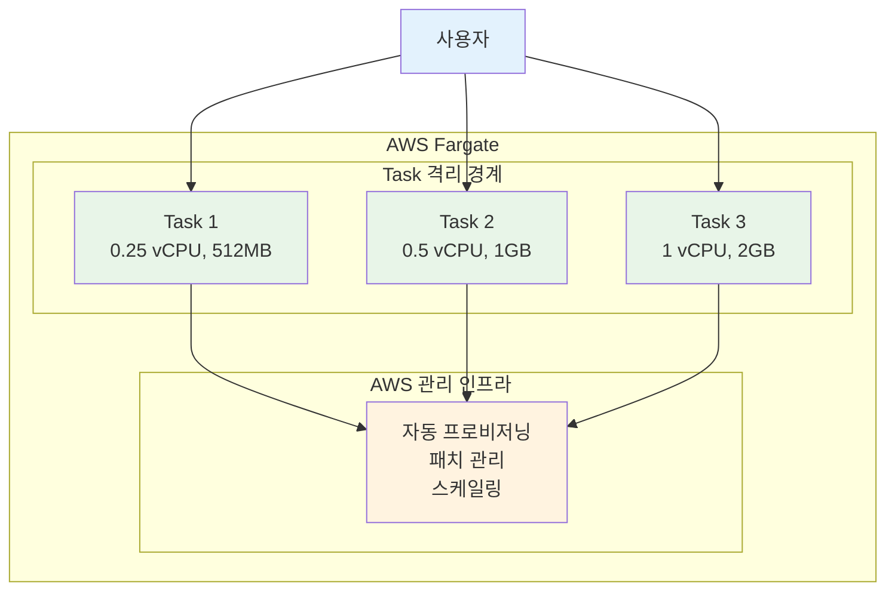

# Week 5 Day 2 Session 3: AWS Fargate (12:00-12:50)

<div align="center">

**서버리스 컨테이너** • **완전 관리형** • **자동 스케일링**

*서버 관리 없이 컨테이너 실행하는 서버리스 컴퓨팅 엔진*

</div>

---

## 🕘 세션 정보
**시간**: 12:00-12:50 (50분)  
**목표**: AWS Fargate의 서버리스 컨테이너 실행 원리 이해  
**방식**: 이론 강의 + 실습 연계

## 🎯 학습 목표
- AWS Fargate의 서버리스 컨테이너 개념 이해
- ECS EC2 vs Fargate 차이점 파악
- Task Definition과 Service 구성 방법 습득
- 실무 활용 시나리오 및 비용 구조 이해

---

## 📖 서비스 개요

### 1. 생성 배경 (Why?) - 5분

**문제 상황**:
- **EC2 관리 부담**: ECS EC2 모드에서는 인스턴스 프로비저닝, 패치, 스케일링 필요
- **리소스 낭비**: 컨테이너 실행을 위해 항상 EC2 인스턴스를 실행해야 함
- **복잡한 운영**: 클러스터 용량 계획, 인스턴스 타입 선택, Auto Scaling 설정 필요
- **느린 배포**: 새 인스턴스 시작 시간으로 인한 배포 지연

**AWS Fargate 솔루션**:
- **서버리스 컴퓨팅**: 서버 관리 없이 컨테이너만 정의하고 실행
- **자동 리소스 할당**: 필요한 CPU/메모리만 지정하면 AWS가 자동 프로비저닝
- **초 단위 과금**: 실제 사용한 리소스만큼만 비용 지불
- **빠른 시작**: 인스턴스 부팅 없이 컨테이너 즉시 실행

### 2. 핵심 원리 (How?) - 10분

**Fargate 아키텍처**:


**작동 원리**:

**1. Task Definition (작업 정의)**:
```json
{
  "family": "my-app",
  "requiresCompatibilities": ["FARGATE"],
  "cpu": "256",
  "memory": "512",
  "networkMode": "awsvpc",
  "containerDefinitions": [
    {
      "name": "web",
      "image": "nginx:alpine",
      "portMappings": [
        {
          "containerPort": 80,
          "protocol": "tcp"
        }
      ]
    }
  ]
}
```

**2. Service (서비스)**:
- **Desired Count**: 실행할 Task 개수
- **Load Balancer**: ALB/NLB 통합
- **Auto Scaling**: CPU/메모리 기반 자동 확장

**3. 격리 경계**:
- 각 Task는 독립된 VM에서 실행
- 커널, CPU, 메모리, ENI 공유 없음
- 보안 강화 (컨테이너 탈출 방지)

### 3. 주요 사용 사례 (When?) - 5분

**적합한 경우**:
- **마이크로서비스**: 독립적으로 배포/확장되는 서비스
- **배치 작업**: 주기적으로 실행되는 데이터 처리
- **웹 애플리케이션**: 트래픽 변동이 큰 서비스
- **CI/CD 파이프라인**: 빌드/테스트 작업

**실제 사례**:
- **Samsung**: 마이크로서비스 아키텍처로 전환, 운영 부담 70% 감소
- **Vanguard**: 배치 처리 작업을 Fargate로 이전, 비용 40% 절감
- **Expedia**: 수천 개의 마이크로서비스를 Fargate에서 실행

### 4. 비슷한 서비스 비교 (Which?) - 5분

**AWS 내 대안 서비스**:

**ECS EC2 vs Fargate**:
- **언제 ECS EC2 사용**: 
  - 특정 인스턴스 타입 필요 (GPU, 고성능 네트워크)
  - 장기 실행 워크로드 (Reserved Instance 활용)
  - 비용 최적화 우선 (Spot Instance 활용)
  
- **언제 Fargate 사용**:
  - 서버 관리 부담 최소화
  - 가변적인 워크로드
  - 빠른 시작 및 배포

**Lambda vs Fargate**:
- **언제 Lambda 사용**:
  - 이벤트 기반 단기 실행 (15분 이하)
  - 상태 비저장 (Stateless)
  - 간헐적 실행
  
- **언제 Fargate 사용**:
  - 장기 실행 프로세스
  - 특정 런타임 환경 필요
  - 컨테이너 이미지 재사용

**선택 기준**:
| 기준 | Fargate | ECS EC2 | Lambda |
|------|---------|---------|--------|
| 비용 | 중간 | 낮음 (RI/Spot) | 낮음 (단기) |
| 관리 복잡도 | 낮음 | 높음 | 매우 낮음 |
| 시작 시간 | 빠름 (초) | 느림 (분) | 매우 빠름 (ms) |
| 실행 시간 | 무제한 | 무제한 | 최대 15분 |
| 적합한 규모 | 중소규모 | 대규모 | 소규모 |

### 5. 장단점 분석 - 3분

**장점**:
- ✅ **서버 관리 불필요**: 인스턴스 프로비저닝, 패치, 스케일링 자동화
- ✅ **빠른 시작**: 인스턴스 부팅 없이 컨테이너 즉시 실행
- ✅ **보안 강화**: Task별 격리 경계로 보안 향상
- ✅ **유연한 스케일링**: Task 단위로 빠르게 확장/축소
- ✅ **초 단위 과금**: 실제 사용한 리소스만 비용 지불

**단점/제약사항**:
- ⚠️ **비용**: ECS EC2 대비 20-30% 더 비쌈
- ⚠️ **제한된 커스터마이징**: 인스턴스 타입, 커널 설정 불가
- ⚠️ **콜드 스타트**: 첫 Task 시작 시 약간의 지연 (수 초)
- ⚠️ **네트워크 모드**: awsvpc만 지원 (ENI 제한 고려)

**대안**:
- 비용 민감: ECS EC2 + Spot Instance
- 단기 실행: Lambda 고려
- 하이브리드: Fargate + ECS EC2 혼합

### 6. 비용 구조 💰 - 5분

**과금 방식**:
- **vCPU 시간**: vCPU 개수 × 실행 시간
- **메모리 시간**: GB × 실행 시간
- **스토리지**: 20GB 기본 제공, 추가 스토리지 별도 과금
- **최소 과금**: Linux 1분, Windows 5분

**프리티어 혜택**:
- ❌ Fargate는 프리티어 미제공
- ✅ Compute Savings Plans로 최대 50% 할인 가능

**비용 최적화 팁**:
1. **적절한 크기 선택**: AWS Compute Optimizer 활용
2. **Fargate Spot**: 중단 가능한 워크로드에 최대 70% 할인
3. **Savings Plans**: 일정한 사용량에 대해 1-3년 약정
4. **스토리지 최적화**: 20GB 기본 스토리지 활용
5. **Task 수명 관리**: 불필요한 Task 즉시 종료

**예상 비용 (ap-northeast-2)**:
| vCPU | 메모리 | 시간당 비용 | 월간 비용 (24/7) |
|------|--------|-------------|------------------|
| 0.25 | 0.5GB | $0.0052 | $3.80 |
| 0.25 | 1GB | $0.0063 | $4.60 |
| 0.5 | 1GB | $0.0104 | $7.59 |
| 1 | 2GB | $0.0208 | $15.18 |

**Lab 예상 비용**:
- Task: 0.25 vCPU, 512MB
- 실행 시간: 40분
- 비용: $0.0052 × (40/60) = **$0.0035** (약 5원)

### 7. 최신 업데이트 🆕 - 2분

**2024년 주요 변경사항**:
- **Graviton2 지원**: ARM 기반 프로세서로 최대 40% 비용 절감
- **EBS 볼륨 지원**: 상태 저장 워크로드 지원 (최대 200GB)
- **향상된 네트워킹**: 최대 25 Gbps 네트워크 대역폭
- **Windows Server 2022**: 최신 Windows 컨테이너 지원

**2025년 예정**:
- **더 큰 Task 크기**: 16 vCPU 이상 지원 검토
- **더 빠른 시작**: 콜드 스타트 시간 단축
- **비용 최적화**: 새로운 가격 모델 도입 예정

**참조**: [AWS Fargate What's New](https://aws.amazon.com/fargate/whats-new/)

### 8. 잘 사용하는 방법 ✅ - 3분

**베스트 프랙티스**:
1. **Task 크기 최적화**: Compute Optimizer로 적정 크기 파악
2. **Health Check 설정**: ALB Health Check로 장애 Task 자동 교체
3. **로깅 구성**: CloudWatch Logs로 중앙 집중식 로그 관리
4. **IAM Role 분리**: Task Role과 Execution Role 명확히 구분
5. **네트워크 설계**: Private Subnet + NAT Gateway 구성

**실무 팁**:
- **이미지 최적화**: 작은 이미지로 시작 시간 단축 (Alpine Linux)
- **환경 변수 관리**: Parameter Store/Secrets Manager 활용
- **Auto Scaling**: Target Tracking으로 자동 확장 설정
- **Spot 활용**: 중단 가능한 워크로드는 Fargate Spot 사용

**성능 최적화**:
- **ENI 워밍**: Service Connect로 네트워크 성능 향상
- **컨테이너 재사용**: 이미지 레이어 캐싱 활용
- **병렬 실행**: 여러 Task 동시 실행으로 처리량 증가

### 9. 잘못 사용하는 방법 ❌ - 3분

**흔한 실수**:
1. **과도한 리소스 할당**: 필요 이상의 CPU/메모리 설정으로 비용 낭비
2. **Public Subnet 배포**: 보안 위험 (Private Subnet 권장)
3. **Health Check 미설정**: 장애 Task가 계속 실행되어 비용 발생
4. **로그 미수집**: 문제 발생 시 디버깅 불가
5. **IAM 권한 과다**: 최소 권한 원칙 위반

**안티 패턴**:
- **장기 실행 단일 Task**: 고가용성 부족 (최소 2개 Task 권장)
- **하드코딩된 설정**: 환경 변수나 Parameter Store 미사용
- **모니터링 부재**: CloudWatch 메트릭 및 알람 미설정
- **네트워크 최적화 무시**: 불필요한 데이터 전송 비용 발생

**보안 취약점**:
- **Public IP 할당**: 불필요한 외부 노출 (ALB 통해서만 접근)
- **Root 권한 실행**: 컨테이너를 root로 실행 (비root 사용자 권장)
- **시크릿 노출**: 환경 변수에 비밀번호 하드코딩 (Secrets Manager 사용)

### 10. 구성 요소 상세 - 5분

**주요 구성 요소**:

**1. Task Definition (작업 정의)**:
- **역할**: 컨테이너 실행 청사진
- **필수 설정**:
  - `requiresCompatibilities`: ["FARGATE"]
  - `networkMode`: "awsvpc" (필수)
  - `cpu`: "256" (0.25 vCPU)
  - `memory`: "512" (MB)
- **선택 옵션**:
  - `executionRoleArn`: ECR 이미지 pull 권한
  - `taskRoleArn`: 애플리케이션 AWS 서비스 접근 권한
  - `logConfiguration`: CloudWatch Logs 설정

**2. Service (서비스)**:
- **역할**: Task 수명 주기 관리
- **필수 설정**:
  - `desiredCount`: 실행할 Task 개수
  - `launchType`: "FARGATE"
  - `networkConfiguration`: VPC, Subnet, Security Group
- **선택 옵션**:
  - `loadBalancers`: ALB/NLB 통합
  - `serviceName`: 서비스 이름
  - `deploymentConfiguration`: 배포 전략

**3. Task (작업)**:
- **역할**: 실제 실행 중인 컨테이너 인스턴스
- **특징**:
  - 독립된 ENI (Elastic Network Interface)
  - 격리된 실행 환경
  - 자동 Health Check

**4. Cluster (클러스터)**:
- **역할**: Task와 Service의 논리적 그룹
- **특징**:
  - Fargate는 인프라 관리 불필요
  - 여러 Service 포함 가능
  - Container Insights로 모니터링

**설정 옵션**:

**CPU/메모리 조합**:
| CPU | 메모리 범위 |
|-----|------------|
| 0.25 vCPU | 0.5GB, 1GB, 2GB |
| 0.5 vCPU | 1GB ~ 4GB (1GB 단위) |
| 1 vCPU | 2GB ~ 8GB (1GB 단위) |
| 2 vCPU | 4GB ~ 16GB (1GB 단위) |
| 4 vCPU | 8GB ~ 30GB (1GB 단위) |

**네트워크 모드**:
- **awsvpc**: 각 Task에 독립된 ENI (필수)
- **장점**: 보안 그룹 Task별 적용 가능
- **주의**: ENI 제한 고려 (Subnet당 최대 ENI 수)

**의존성**:
- **VPC**: Task 실행을 위한 네트워크 환경
- **Subnet**: Task 배치 위치 (Private 권장)
- **Security Group**: Task 방화벽 규칙
- **IAM Role**: AWS 서비스 접근 권한
- **ECR**: 컨테이너 이미지 저장소

### 11. 공식 문서 링크 (필수 5개)

**⚠️ 학생들이 직접 확인해야 할 공식 문서**:
- 📘 [AWS Fargate란 무엇인가?](https://docs.aws.amazon.com/AmazonECS/latest/developerguide/AWS_Fargate.html)
- 📗 [Fargate 사용자 가이드](https://docs.aws.amazon.com/AmazonECS/latest/developerguide/fargate-tasks-services.html)
- 📙 [ECS API 레퍼런스](https://docs.aws.amazon.com/AmazonECS/latest/APIReference/)
- 📕 [Fargate 요금](https://aws.amazon.com/fargate/pricing/)
- 🆕 [Fargate 최신 업데이트](https://aws.amazon.com/fargate/whats-new/)

---

## 💭 함께 생각해보기

### 🤝 페어 토론 (5분)
**토론 주제**:
1. "우리 프로젝트에서 Fargate를 사용해야 할까요, 아니면 ECS EC2를 사용해야 할까요?"
2. "Fargate의 비용이 더 비싼데도 사용하는 이유는 무엇일까요?"
3. "어떤 상황에서 Lambda 대신 Fargate를 선택해야 할까요?"

**페어 활동 가이드**:
- 👥 **자유 페어링**: 관심사나 이해도가 비슷한 사람끼리
- 🔄 **역할 교대**: 5분씩 설명자/질문자 역할 바꾸기
- 📝 **핵심 정리**: 대화 내용 중 중요한 점 메모하기

### 🎯 전체 공유 (3분)
- **인사이트 공유**: 페어 토론에서 나온 좋은 아이디어
- **질문 수집**: 아직 이해가 어려운 부분
- **다음 연결**: Lab 1과의 연결고리 확인

### 💡 이해도 체크 질문
- ✅ "Fargate와 ECS EC2의 차이점을 설명할 수 있나요?"
- ✅ "Task Definition의 필수 설정 항목을 알고 있나요?"
- ✅ "Fargate의 비용 구조를 이해했나요?"
- ✅ "실무에서 Fargate를 언제 사용할지 판단할 수 있나요?"

---

## 🔑 핵심 키워드

- **AWS Fargate**: 서버리스 컨테이너 컴퓨팅 엔진
- **Task Definition**: 컨테이너 실행 청사진 (CPU, 메모리, 이미지)
- **Service**: Task 수명 주기 관리 (Desired Count, Auto Scaling)
- **awsvpc 네트워크 모드**: 각 Task에 독립된 ENI 할당
- **격리 경계**: Task별 독립된 VM 실행 환경
- **Fargate Spot**: 중단 가능한 워크로드에 최대 70% 할인
- **Execution Role**: ECR 이미지 pull 및 CloudWatch Logs 권한
- **Task Role**: 애플리케이션의 AWS 서비스 접근 권한

---

## 📝 세션 마무리

### ✅ 오늘 세션 성과
- [ ] AWS Fargate의 서버리스 컨테이너 개념 이해
- [ ] ECS EC2 vs Fargate 차이점 파악
- [ ] Task Definition과 Service 구성 방법 습득
- [ ] 비용 구조 및 최적화 방법 이해
- [ ] 실무 활용 시나리오 파악

### 🎯 다음 Lab 준비
**Lab 1: VPC + ECR + ALB + ECS Fargate 통합 배포**
- Session 1 (VPC), Session 2 (ECR), Session 3 (Fargate) 통합
- Private Subnet에 Fargate Task 배포
- ALB를 통한 외부 접근
- NAT Gateway로 ECR 이미지 pull

**사전 준비**:
- Session 1, 2, 3 복습
- VPC, Subnet, Security Group 개념 확인
- ECR 이미지 push 방법 복습

---

<div align="center">

**🚀 서버리스 컨테이너** • **⚡ 빠른 시작** • **💰 초 단위 과금** • **🔒 보안 강화**

*Fargate로 서버 관리 부담 없이 컨테이너 실행*

</div>
