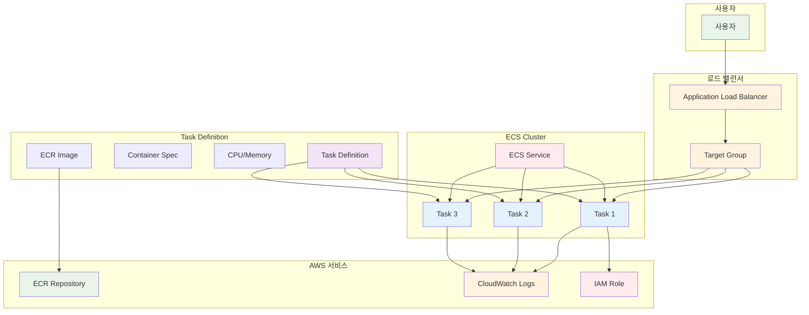

# November Week 3 Day 2 Session 3: ECS (Elastic Container Service)

<div align="center">

**🚀 Fargate** • **📋 Task Definition** • **⚖️ Service** • **📈 Auto Scaling**

*서버리스 컨테이너 오케스트레이션으로 애플리케이션 배포*

</div>

---

## 🕘 세션 정보
**시간**: 10:40-11:20 (40분)
**목표**: ECS Fargate를 통한 컨테이너 오케스트레이션 및 Terraform 코드화
**방식**: 이론 설명 + Terraform 코드 예제

## 🎯 학습 목표
- ECS Fargate의 생성 배경과 필요성 이해
- Task Definition과 Service 개념 습득
- Auto Scaling 및 Load Balancing 구성
- Terraform으로 ECS 전체 스택 코드화

---

## 📖 서비스 개요

### 1. 생성 배경 (Why?) - 5분

**문제 상황**:
- **EC2 관리 부담**: 서버 프로비저닝, 패치, 스케일링 수동 관리
- **리소스 낭비**: 컨테이너 실행을 위해 전체 EC2 인스턴스 유지
- **복잡한 오케스트레이션**: 컨테이너 배포, 스케줄링, 헬스 체크 수동 구성
- **Kubernetes 복잡도**: K8s 학습 곡선 및 운영 부담

**실무 시나리오**:
```
상황: 스타트업이 Docker Compose에서 프로덕션으로 전환
- Docker Compose: 단일 서버, 수동 배포, 장애 시 수동 복구
- 요구사항: 고가용성, 자동 스케일링, 무중단 배포
- 문제: Kubernetes는 너무 복잡, EC2는 관리 부담
```

**AWS ECS Fargate 솔루션**:
- **서버리스**: EC2 인스턴스 관리 불필요
- **완전 관리형**: AWS가 인프라 관리
- **간단한 API**: Kubernetes보다 쉬운 학습 곡선
- **AWS 통합**: ALB, ECR, CloudWatch 완벽 연동

### 2. 핵심 원리 (How?) - 10분

**ECS Fargate 아키텍처**:


**작동 원리**:

**1. Cluster**: 논리적 컨테이너 그룹
```hcl
resource "aws_ecs_cluster" "main" {
  name = "my-cluster"
  
  setting {
    name  = "containerInsights"
    value = "enabled"
  }
}
```

**2. Task Definition**: 컨테이너 실행 명세
```hcl
resource "aws_ecs_task_definition" "app" {
  family                   = "my-app"
  network_mode             = "awsvpc"
  requires_compatibilities = ["FARGATE"]
  cpu                      = "256"  # 0.25 vCPU
  memory                   = "512"  # 512 MB
  execution_role_arn       = aws_iam_role.ecs_execution.arn
  task_role_arn            = aws_iam_role.ecs_task.arn
  
  container_definitions = jsonencode([{
    name  = "app"
    image = "${aws_ecr_repository.app.repository_url}:latest"
    
    portMappings = [{
      containerPort = 80
      protocol      = "tcp"
    }]
    
    logConfiguration = {
      logDriver = "awslogs"
      options = {
        "awslogs-group"         = "/ecs/my-app"
        "awslogs-region"        = "ap-northeast-2"
        "awslogs-stream-prefix" = "ecs"
      }
    }
    
    environment = [
      { name = "ENV", value = "production" }
    ]
  }])
}
```

**3. Service**: Task 실행 및 관리
```hcl
resource "aws_ecs_service" "app" {
  name            = "my-app-service"
  cluster         = aws_ecs_cluster.main.id
  task_definition = aws_ecs_task_definition.app.arn
  desired_count   = 3
  launch_type     = "FARGATE"
  
  network_configuration {
    subnets          = aws_subnet.private[*].id
    security_groups  = [aws_security_group.ecs_tasks.id]
    assign_public_ip = false
  }
  
  load_balancer {
    target_group_arn = aws_lb_target_group.app.arn
    container_name   = "app"
    container_port   = 80
  }
  
  depends_on = [aws_lb_listener.app]
}
```

**주요 구성 요소**:

**Cluster**:
- Task와 Service를 그룹화하는 논리적 단위
- Container Insights로 모니터링
- Capacity Provider로 리소스 관리

**Task Definition**:
- 컨테이너 실행 명세 (Docker Compose와 유사)
- CPU, Memory, Image, Port, Environment 정의
- Execution Role (ECR Pull, CloudWatch Logs)
- Task Role (애플리케이션 권한)

**Service**:
- 지정된 수의 Task 유지
- ALB와 통합하여 트래픽 분산
- Auto Scaling으로 자동 확장
- Rolling Update로 무중단 배포

**Task**:
- Task Definition의 실행 인스턴스
- 독립적인 네트워크 인터페이스 (ENI)
- 전용 CPU, Memory 할당
- 자동 헬스 체크 및 재시작

### 3. 주요 사용 사례 (When?) - 5분

**적합한 경우**:

**1. 마이크로서비스 아키텍처**:
```
Uber 사례:
- 수백 개의 마이크로서비스
- 각 서비스별 독립 배포
- Auto Scaling으로 트래픽 대응
```

**2. 웹 애플리케이션**:
```
Duolingo 사례:
- 글로벌 언어 학습 플랫폼
- ECS Fargate로 API 서버 운영
- ALB로 트래픽 분산
```

**3. 배치 작업**:
```
Expedia 사례:
- 가격 계산 배치 작업
- ECS Scheduled Tasks
- 작업 완료 후 자동 종료
```

**실제 사용 패턴**:
- **웹 서비스**: ALB + ECS Service (항상 실행)
- **API 서버**: API Gateway + ECS Service
- **배치 작업**: EventBridge + ECS Task (일회성)
- **워커**: SQS + ECS Service (메시지 처리)

### 4. 비슷한 서비스 비교 (Which?) - 5분

**AWS 내 대안 서비스**:

**ECS Fargate vs ECS EC2**:
- **언제 ECS EC2 사용**: 
  - 특정 인스턴스 타입 필요
  - GPU 워크로드
  - 비용 최적화 (Reserved Instance)
  
- **언제 ECS Fargate 사용**: 
  - 서버 관리 부담 제거
  - 빠른 시작 및 배포
  - 가변적인 워크로드

**ECS Fargate vs EKS (Kubernetes)**:
- **언제 EKS 사용**: 
  - Kubernetes 경험 있음
  - 멀티 클라우드 전략
  - 복잡한 오케스트레이션
  
- **언제 ECS Fargate 사용**: 
  - AWS 전용 환경
  - 간단한 학습 곡선
  - AWS 서비스 통합 우선

**ECS Fargate vs Lambda**:
- **언제 Lambda 사용**: 
  - 이벤트 기반 (짧은 실행)
  - 15분 이하 실행
  - 서버리스 우선
  
- **언제 ECS Fargate 사용**: 
  - 장시간 실행 (항상 실행)
  - 기존 Docker 이미지 활용
  - 복잡한 애플리케이션

**선택 기준**:
| 기준 | ECS Fargate | ECS EC2 | EKS | Lambda |
|------|-------------|---------|-----|--------|
| **관리 부담** | 낮음 | 높음 | 매우 높음 | 없음 |
| **시작 시간** | 빠름 (30초) | 느림 (분) | 느림 (분) | 매우 빠름 (ms) |
| **비용** | 중간 | 낮음 (RI) | 중간 | 낮음 (짧은 실행) |
| **유연성** | 중간 | 높음 | 매우 높음 | 낮음 |
| **학습 곡선** | 낮음 | 중간 | 높음 | 낮음 |
| **적합한 규모** | 모든 규모 | 대규모 | 대규모 | 소규모/이벤트 |

### 5. 장단점 분석 - 3분

**장점**:
- ✅ **서버리스**: EC2 인스턴스 관리 불필요
- ✅ **빠른 시작**: 30초 내 Task 시작
- ✅ **자동 스케일링**: 트래픽에 따라 자동 확장
- ✅ **AWS 통합**: ALB, ECR, CloudWatch 완벽 연동
- ✅ **보안 격리**: Task별 독립적인 네트워크 인터페이스

**단점/제약사항**:
- ⚠️ **비용**: EC2보다 약 20-30% 비쌈
- ⚠️ **Cold Start**: 새 Task 시작 시 30초 소요
- ⚠️ **제한된 제어**: 호스트 접근 불가
- ⚠️ **리소스 제약**: 최대 4 vCPU, 30GB 메모리

**대안 방법**:
- **비용 절감**: Savings Plans, Compute Savings Plans
- **Cold Start 최소화**: Minimum Healthy Percent 조정
- **더 많은 리소스**: ECS EC2 Launch Type 사용

### 6. 비용 구조 💰 - 5분

**과금 방식**:
- **vCPU**: $0.04048/vCPU/시간 (ap-northeast-2)
- **Memory**: $0.004445/GB/시간
- **최소 과금**: 1분 (이후 초 단위)

**프리티어 혜택**:
- **없음**: ECS Fargate는 프리티어 미제공
- **대안**: ECS EC2 Launch Type (EC2 프리티어 활용)

**비용 최적화 팁**:
1. **Savings Plans**: 1-3년 약정으로 최대 50% 할인
2. **Spot Fargate**: 최대 70% 할인 (중단 가능한 워크로드)
3. **Right Sizing**: 필요한 만큼만 CPU/Memory 할당
4. **Auto Scaling**: 트래픽에 따라 Task 수 조정
5. **Scheduled Scaling**: 예측 가능한 트래픽 패턴 활용

**예상 비용 (ap-northeast-2)**:
| 구성 | vCPU | Memory | 시간당 | 월간 (24/7) |
|------|------|--------|--------|--------------|
| **소형** | 0.25 | 0.5GB | $0.01234 | $8.97 |
| **중형** | 0.5 | 1GB | $0.02468 | $17.94 |
| **대형** | 1 | 2GB | $0.04936 | $35.88 |

**실제 비용 계산**:
```
예시: 웹 서비스 (0.5 vCPU, 1GB Memory, 3 Tasks)
- Task당 비용: $0.02468/시간
- 3 Tasks: $0.07404/시간
- 월간 (730시간): $54.05
- Savings Plans (50% 할인): $27.03
```

**Lab 예상 비용**:
- 구성: 0.25 vCPU, 0.5GB Memory, 2 Tasks
- 실습 시간: 1시간
- 비용: $0.02468 (약 30원)

### 7. 최신 업데이트 🆕 - 2분

**2024년 주요 변경사항**:
- **Fargate Spot**: 최대 70% 할인 (중단 가능한 워크로드)
- **ECS Exec**: 실행 중인 컨테이너에 직접 접속
- **EFS 통합**: Fargate Task에서 EFS 볼륨 마운트
- **Windows 컨테이너**: Fargate에서 Windows 컨테이너 지원

**2025년 예정**:
- **더 큰 Task**: 최대 16 vCPU, 120GB 메모리 지원 검토
- **더 빠른 시작**: Cold Start 시간 단축
- **비용 최적화**: 새로운 Savings Plans 옵션

**Deprecated 기능**:
- **Platform Version 1.3.0 이하**: 2024년 말 지원 종료 예정
- **권장**: Platform Version 1.4.0 이상 사용

**참조**: [AWS ECS What's New](https://aws.amazon.com/ecs/whats-new/)

### 8. 잘 사용하는 방법 ✅ - 3분

**베스트 프랙티스**:
1. **Task Definition 버전 관리**:
   ```hcl
   resource "aws_ecs_task_definition" "app" {
     family = "my-app"
     # Terraform이 자동으로 버전 관리
   }
   ```

2. **Health Check 설정**:
   ```hcl
   health_check {
     healthy_threshold   = 2
     unhealthy_threshold = 3
     timeout             = 5
     interval            = 30
     path                = "/health"
   }
   ```

3. **Auto Scaling 구성**:
   ```hcl
   resource "aws_appautoscaling_target" "ecs" {
     max_capacity       = 10
     min_capacity       = 2
     resource_id        = "service/${aws_ecs_cluster.main.name}/${aws_ecs_service.app.name}"
     scalable_dimension = "ecs:service:DesiredCount"
     service_namespace  = "ecs"
   }
   
   resource "aws_appautoscaling_policy" "ecs" {
     name               = "cpu-scaling"
     policy_type        = "TargetTrackingScaling"
     resource_id        = aws_appautoscaling_target.ecs.resource_id
     scalable_dimension = aws_appautoscaling_target.ecs.scalable_dimension
     service_namespace  = aws_appautoscaling_target.ecs.service_namespace
     
     target_tracking_scaling_policy_configuration {
       target_value       = 70.0
       predefined_metric_specification {
         predefined_metric_type = "ECSServiceAverageCPUUtilization"
       }
     }
   }
   ```

4. **로깅 설정**:
   ```hcl
   logConfiguration = {
     logDriver = "awslogs"
     options = {
       "awslogs-group"         = "/ecs/my-app"
       "awslogs-region"        = "ap-northeast-2"
       "awslogs-stream-prefix" = "ecs"
     }
   }
   ```

5. **보안 강화**:
   ```hcl
   # Task Role (애플리케이션 권한)
   task_role_arn = aws_iam_role.ecs_task.arn
   
   # Execution Role (ECS 권한)
   execution_role_arn = aws_iam_role.ecs_execution.arn
   ```

**실무 팁**:
- **Blue-Green 배포**: CodeDeploy 통합
- **Canary 배포**: 점진적 트래픽 전환
- **Circuit Breaker**: 배포 실패 시 자동 롤백
- **Container Insights**: 상세 모니터링

**성능 최적화**:
- **Right Sizing**: CloudWatch 메트릭 기반 CPU/Memory 조정
- **Task Placement**: Spread 전략으로 AZ 분산
- **Network Mode**: awsvpc로 독립적인 ENI

### 9. 잘못 사용하는 방법 ❌ - 3분

**흔한 실수**:
1. **과도한 리소스 할당**: 필요 이상의 CPU/Memory 할당으로 비용 낭비
   ```
   ❌ 문제: 0.5 vCPU로 충분한데 2 vCPU 할당
   ✅ 해결: CloudWatch 메트릭 확인 후 Right Sizing
   ```

2. **Health Check 미설정**: 장애 Task 자동 교체 불가
   ```
   ❌ 문제: Health Check 없음 → 장애 Task 계속 실행
   ✅ 해결: ALB Health Check 설정
   ```

3. **Auto Scaling 미설정**: 트래픽 급증 시 대응 불가
   ```
   ❌ 문제: 고정된 Task 수 → 트래픽 급증 시 장애
   ✅ 해결: Target Tracking Scaling 설정
   ```

4. **로그 미설정**: 문제 발생 시 디버깅 불가
   ```
   ❌ 문제: CloudWatch Logs 미설정
   ✅ 해결: awslogs 드라이버 설정
   ```

5. **Public Subnet 배치**: 보안 취약점
   ```
   ❌ 문제: Task를 Public Subnet에 배치
   ✅ 해결: Private Subnet + NAT Gateway
   ```

**안티 패턴**:
- **Desired Count 0**: Service를 0으로 설정 (삭제하는 것이 나음)
- **Latest 태그**: 항상 latest 태그 사용 (버전 관리 불가)
- **Execution Role 과다 권한**: `*` 권한 부여
- **Single AZ**: 하나의 AZ에만 배치 (고가용성 부족)

**보안 취약점**:
- **Public IP 할당**: assign_public_ip = true (Private Subnet 권장)
- **Root 권한**: 컨테이너를 root로 실행
- **Secrets 하드코딩**: 환경변수에 비밀번호 직접 입력

### 10. 구성 요소 상세 - 5분

**주요 구성 요소**:

**1. Cluster**:
- **역할**: Task와 Service를 그룹화
- **설정 옵션**:
  - `containerInsights`: 모니터링 활성화
  - `capacityProviders`: Fargate, Fargate Spot
- **제한**: 계정당 최대 10,000개 Cluster

**2. Task Definition**:
- **역할**: 컨테이너 실행 명세
- **필수 설정**:
  - `family`: Task Definition 이름
  - `cpu`: 256, 512, 1024, 2048, 4096
  - `memory`: CPU에 따라 선택 가능한 값 제한
  - `networkMode`: awsvpc (Fargate 필수)
  - `requiresCompatibilities`: ["FARGATE"]
- **선택 설정**:
  - `executionRoleArn`: ECR Pull, CloudWatch Logs
  - `taskRoleArn`: 애플리케이션 권한
  - `volumes`: EFS 볼륨 마운트

**3. Service**:
- **역할**: 지정된 수의 Task 유지
- **배포 전략**:
  - **Rolling Update**: 기본 (무중단 배포)
  - **Blue/Green**: CodeDeploy 통합
  - **Canary**: 점진적 트래픽 전환
- **스케줄링 전략**:
  - **REPLICA**: 지정된 수의 Task 유지
  - **DAEMON**: 각 인스턴스에 하나씩 (EC2 전용)

**4. Task**:
- **역할**: Task Definition의 실행 인스턴스
- **네트워크**:
  - 독립적인 ENI (Elastic Network Interface)
  - Private IP 자동 할당
  - Security Group 적용
- **스토리지**:
  - 임시 스토리지: 20GB (기본)
  - EFS 볼륨: 영구 스토리지

**5. Auto Scaling**:
- **역할**: 트래픽에 따라 Task 수 자동 조정
- **정책 타입**:
  - **Target Tracking**: 목표 메트릭 유지 (권장)
  - **Step Scaling**: 단계별 확장
  - **Scheduled Scaling**: 예약된 시간에 확장
- **메트릭**:
  - `ECSServiceAverageCPUUtilization`
  - `ECSServiceAverageMemoryUtilization`
  - `ALBRequestCountPerTarget`

**설정 옵션**:
- **Launch Type**: FARGATE (서버리스) / EC2 (관리형)
- **Platform Version**: 1.4.0 (최신, 권장)
- **Network Mode**: awsvpc (Fargate 필수)
- **Deployment Configuration**:
  - `minimumHealthyPercent`: 최소 유지 비율 (기본 100%)
  - `maximumPercent`: 최대 허용 비율 (기본 200%)

**의존성**:
- **VPC**: Subnet, Security Group
- **ECR**: 컨테이너 이미지
- **IAM**: Execution Role, Task Role
- **ALB**: 로드 밸런싱 (선택)
- **CloudWatch**: 로그 및 메트릭

### 11. 공식 문서 링크 (필수 5개)

**⚠️ 학생들이 직접 확인해야 할 공식 문서**:
- 📘 [ECS란 무엇인가?](https://docs.aws.amazon.com/AmazonECS/latest/developerguide/Welcome.html)
- 📗 [ECS 사용자 가이드](https://docs.aws.amazon.com/AmazonECS/latest/developerguide/)
- 📙 [ECS API 레퍼런스](https://docs.aws.amazon.com/AmazonECS/latest/APIReference/)
- 📕 [ECS 요금](https://aws.amazon.com/ecs/pricing/)
- 🆕 [ECS 최신 업데이트](https://aws.amazon.com/ecs/whats-new/)

---

## 💭 함께 생각해보기

### 🤝 페어 토론 (5분)

**토론 주제**:
1. **ECS vs Kubernetes**: "여러분의 프로젝트에 ECS와 Kubernetes 중 어떤 것이 더 적합할까요? 그 이유는?"
2. **비용 최적화**: "ECS Fargate의 비용을 최소화하면서도 고가용성을 유지하려면 어떻게 해야 할까요?"
3. **배포 전략**: "무중단 배포를 위해 어떤 배포 전략을 선택하시겠어요? (Rolling, Blue/Green, Canary)"

**페어 활동 가이드**:
- 👥 **자유 페어링**: 관심사나 경험이 비슷한 사람끼리
- 🔄 **역할 교대**: 5분씩 설명자/질문자 역할 바꾸기
- 📝 **핵심 정리**: 대화 내용 중 중요한 점 메모하기

### 🎯 전체 공유 (3분)
- **인사이트 공유**: 페어 토론에서 나온 좋은 아이디어
- **질문 수집**: 아직 이해가 어려운 부분
- **다음 연결**: Lab (전체 컴퓨팅 스택)과의 연결고리

**💡 이해도 체크 질문**:
- ✅ "Task Definition과 Service의 차이를 설명할 수 있나요?"
- ✅ "ECS Fargate가 서버리스인 이유를 이해했나요?"
- ✅ "Auto Scaling을 왜 설정해야 하는지 설명할 수 있나요?"

---

## 🔑 핵심 키워드

### 🆕 새로운 용어
- **ECS (Elastic Container Service)**: AWS 관리형 컨테이너 오케스트레이션
- **Fargate**: 서버리스 컨테이너 실행 환경
- **Cluster**: Task와 Service를 그룹화하는 논리적 단위
- **Task Definition**: 컨테이너 실행 명세 (Docker Compose와 유사)
- **Service**: 지정된 수의 Task를 유지하는 관리 단위
- **Task**: Task Definition의 실행 인스턴스

### 🔤 중요 개념
- **awsvpc Network Mode**: Task별 독립적인 ENI
- **Execution Role**: ECR Pull, CloudWatch Logs 권한
- **Task Role**: 애플리케이션이 AWS 서비스 접근 권한
- **Target Tracking Scaling**: 목표 메트릭 기반 Auto Scaling
- **Rolling Update**: 무중단 배포 전략

### 🔤 실무 용어
- **Cold Start**: 새 Task 시작 시간 (약 30초)
- **Desired Count**: 유지하려는 Task 수
- **Minimum Healthy Percent**: 배포 중 최소 유지 비율
- **Circuit Breaker**: 배포 실패 시 자동 롤백
- **Container Insights**: ECS 상세 모니터링

---

## 📝 세션 마무리

### ✅ 오늘 세션 성과
- [ ] ECS Fargate의 생성 배경과 필요성 이해
- [ ] Task Definition과 Service 개념 습득
- [ ] Auto Scaling 및 Load Balancing 구성 방법 학습
- [ ] Terraform으로 ECS 전체 스택 코드화 준비

### 🎯 다음 Lab 준비
**Lab: 전체 컴퓨팅 스택 (11:20-12:00)**
- VPC + Subnet 구성
- ECR Repository 생성 및 이미지 Push
- ALB + Target Group 설정
- ECS Cluster + Task Definition + Service 배포
- Auto Scaling 설정
- 전체 스택 테스트

**연결고리**:
- Session 1 (EC2 & ALB): ALB 설정 활용
- Session 2 (ECR): 이미지 저장소 연동
- Session 3 (ECS): 전체 통합 배포

---

<div align="center">

**🚀 서버리스 컨테이너** • **📋 간단한 오케스트레이션** • **⚖️ 자동 스케일링** • **🔒 보안 격리**

*ECS Fargate로 프로덕션급 컨테이너 배포*

</div>
