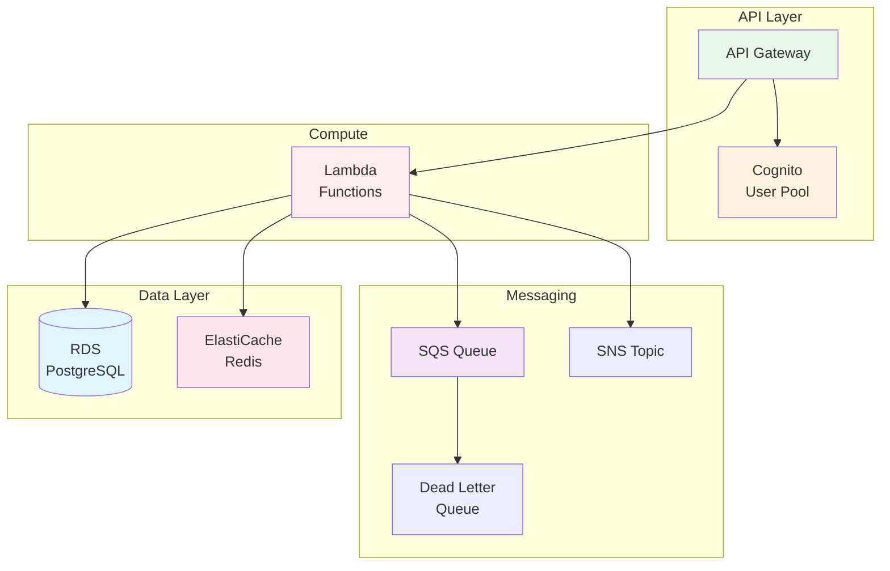

# November Week 3 Day 3: 데이터베이스 & 메시징 코드화

<div align="center">

**🗄️ RDS** • **⚡ ElastiCache** • **📨 SQS/SNS** • **🚪 API Gateway**

*Terraform으로 데이터 계층 및 메시징 인프라 완전 코드화*

</div>

---

## 🕘 일일 스케줄

### 📊 시간 배분
```
09:00-09:40  Session 1: RDS Terraform (40분)
09:40-09:50  휴식 (10분)
09:50-10:30  Session 2: ElastiCache & SQS/SNS (40분)
10:30-10:40  휴식 (10분)
10:40-11:20  Session 3: API Gateway & Cognito (40분)
11:20-12:00  Lab: 전체 백엔드 인프라 (40분)
```

### 🗓️ 상세 스케줄
| 시간 | 구분 | 내용 | 목적 |
|------|------|------|------|
| **09:00-09:40** | 📚 이론 1 | RDS Terraform (40분) | 관리형 데이터베이스 |
| **09:40-09:50** | ☕ 휴식 | 10분 휴식 | |
| **09:50-10:30** | 📚 이론 2 | ElastiCache & SQS/SNS (40분) | 캐싱 및 메시징 |
| **10:30-10:40** | ☕ 휴식 | 10분 휴식 | |
| **10:40-11:20** | 📚 이론 3 | API Gateway & Cognito (40분) | API 관리 및 인증 |
| **11:20-12:00** | 🛠️ 실습 | 전체 백엔드 인프라 (40분) | 통합 배포 |

---

## 🎯 Day 3 목표

### 📚 학습 목표
- **RDS**: 관리형 데이터베이스 코드화
- **ElastiCache**: Redis 캐시 클러스터 관리
- **SQS/SNS**: 메시징 시스템 구축
- **API Gateway**: API 관리 및 인증 통합

### 🛠️ 실무 역량
- 데이터 계층 완전 자동화
- 비동기 메시징 시스템
- API 인프라 코드화
- 전체 백엔드 통합 관리

---

## 📚 세션 구성

### Session 1: RDS Terraform (09:00-09:40)
**주제**: RDS 관리형 데이터베이스 코드화

**핵심 내용**:
- DB Subnet Group
- Parameter Group
- 백업 및 유지보수 설정
- Multi-AZ 구성

**학습 포인트**:
- 데이터베이스 고가용성
- 자동 백업 설정
- 보안 그룹 구성
- 비밀번호 관리

**코드 예시**:
```hcl
# DB Subnet Group
resource "aws_db_subnet_group" "main" {
  name       = "main-db-subnet"
  subnet_ids = aws_subnet.private[*].id
  
  tags = {
    Name = "main-db-subnet-group"
  }
}

# RDS Instance
resource "aws_db_instance" "main" {
  identifier     = "main-db"
  engine         = "postgres"
  engine_version = "15.3"
  instance_class = "db.t3.micro"
  
  allocated_storage     = 20
  max_allocated_storage = 100
  storage_encrypted     = true
  
  db_name  = "myapp"
  username = "admin"
  password = var.db_password  # Sensitive variable
  
  db_subnet_group_name   = aws_db_subnet_group.main.name
  vpc_security_group_ids = [aws_security_group.rds.id]
  
  multi_az               = var.environment == "prod" ? true : false
  backup_retention_period = 7
  backup_window          = "03:00-04:00"
  maintenance_window     = "mon:04:00-mon:05:00"
  
  skip_final_snapshot = true
  
  tags = {
    Name = "main-database"
  }
}

# Output
output "rds_endpoint" {
  value     = aws_db_instance.main.endpoint
  sensitive = true
}
```

---

### Session 2: ElastiCache & SQS/SNS (09:50-10:30)
**주제**: 캐싱 및 메시징 시스템 코드화

**핵심 내용**:
- ElastiCache Redis Cluster
- SQS Queue 설정
- SNS Topic 및 Subscription
- DLQ (Dead Letter Queue)

**학습 포인트**:
- 캐시 클러스터 구성
- 비동기 메시징 패턴
- 메시지 재시도 전략
- 알림 시스템 구축

**코드 예시**:
```hcl
# ElastiCache Subnet Group
resource "aws_elasticache_subnet_group" "main" {
  name       = "main-cache-subnet"
  subnet_ids = aws_subnet.private[*].id
}

# ElastiCache Redis
resource "aws_elasticache_cluster" "redis" {
  cluster_id           = "main-redis"
  engine               = "redis"
  node_type            = "cache.t3.micro"
  num_cache_nodes      = 1
  parameter_group_name = "default.redis7"
  port                 = 6379
  
  subnet_group_name    = aws_elasticache_subnet_group.main.name
  security_group_ids   = [aws_security_group.redis.id]
  
  tags = {
    Name = "main-redis"
  }
}

# SQS Queue
resource "aws_sqs_queue" "main" {
  name                       = "main-queue"
  delay_seconds              = 0
  max_message_size           = 262144
  message_retention_seconds  = 345600  # 4 days
  receive_wait_time_seconds  = 10
  visibility_timeout_seconds = 30
  
  redrive_policy = jsonencode({
    deadLetterTargetArn = aws_sqs_queue.dlq.arn
    maxReceiveCount     = 3
  })
  
  tags = {
    Name = "main-queue"
  }
}

# Dead Letter Queue
resource "aws_sqs_queue" "dlq" {
  name = "main-dlq"
  
  tags = {
    Name = "main-dead-letter-queue"
  }
}

# SNS Topic
resource "aws_sns_topic" "notifications" {
  name = "app-notifications"
  
  tags = {
    Name = "app-notifications"
  }
}

# SNS Subscription (Email)
resource "aws_sns_topic_subscription" "email" {
  topic_arn = aws_sns_topic.notifications.arn
  protocol  = "email"
  endpoint  = var.notification_email
}
```

---

### Session 3: API Gateway & Cognito (10:40-11:20)
**주제**: API 관리 및 사용자 인증 코드화

**핵심 내용**:
- API Gateway REST API
- Cognito User Pool
- Lambda 통합
- 인증 설정

**학습 포인트**:
- API 엔드포인트 관리
- 사용자 인증/인가
- Lambda 통합 패턴
- CORS 설정

**코드 예시**:
```hcl
# Cognito User Pool
resource "aws_cognito_user_pool" "main" {
  name = "main-user-pool"
  
  password_policy {
    minimum_length    = 8
    require_lowercase = true
    require_numbers   = true
    require_symbols   = true
    require_uppercase = true
  }
  
  auto_verified_attributes = ["email"]
  
  schema {
    name                = "email"
    attribute_data_type = "String"
    required            = true
    mutable             = false
  }
  
  tags = {
    Name = "main-user-pool"
  }
}

# Cognito User Pool Client
resource "aws_cognito_user_pool_client" "main" {
  name         = "main-app-client"
  user_pool_id = aws_cognito_user_pool.main.id
  
  generate_secret = false
  
  explicit_auth_flows = [
    "ALLOW_USER_PASSWORD_AUTH",
    "ALLOW_REFRESH_TOKEN_AUTH"
  ]
}

# API Gateway REST API
resource "aws_api_gateway_rest_api" "main" {
  name        = "main-api"
  description = "Main API Gateway"
  
  endpoint_configuration {
    types = ["REGIONAL"]
  }
}

# API Gateway Resource
resource "aws_api_gateway_resource" "users" {
  rest_api_id = aws_api_gateway_rest_api.main.id
  parent_id   = aws_api_gateway_rest_api.main.root_resource_id
  path_part   = "users"
}

# API Gateway Method
resource "aws_api_gateway_method" "users_get" {
  rest_api_id   = aws_api_gateway_rest_api.main.id
  resource_id   = aws_api_gateway_resource.users.id
  http_method   = "GET"
  authorization = "COGNITO_USER_POOLS"
  authorizer_id = aws_api_gateway_authorizer.cognito.id
}

# Cognito Authorizer
resource "aws_api_gateway_authorizer" "cognito" {
  name          = "cognito-authorizer"
  rest_api_id   = aws_api_gateway_rest_api.main.id
  type          = "COGNITO_USER_POOLS"
  provider_arns = [aws_cognito_user_pool.main.arn]
}

# Lambda Integration
resource "aws_api_gateway_integration" "users_get" {
  rest_api_id = aws_api_gateway_rest_api.main.id
  resource_id = aws_api_gateway_resource.users.id
  http_method = aws_api_gateway_method.users_get.http_method
  
  integration_http_method = "POST"
  type                    = "AWS_PROXY"
  uri                     = aws_lambda_function.users.invoke_arn
}

# API Gateway Deployment
resource "aws_api_gateway_deployment" "main" {
  rest_api_id = aws_api_gateway_rest_api.main.id
  
  depends_on = [
    aws_api_gateway_integration.users_get
  ]
}

# API Gateway Stage
resource "aws_api_gateway_stage" "prod" {
  deployment_id = aws_api_gateway_deployment.main.id
  rest_api_id   = aws_api_gateway_rest_api.main.id
  stage_name    = "prod"
}
```

---

## 🛠️ 실습 (Lab 1)

### Lab 1: 전체 백엔드 인프라 배포
**시간**: 11:20-12:00 (40분)
**목표**: RDS + ElastiCache + SQS/SNS + API Gateway 통합

**실습 내용**:
1. **RDS PostgreSQL 배포**
   - Multi-AZ 구성 (prod)
   - 자동 백업 설정
   - 보안 그룹 구성

2. **ElastiCache Redis 배포**
   - Redis 클러스터
   - 캐시 서브넷 그룹

3. **SQS + SNS 메시징**
   - SQS Queue + DLQ
   - SNS Topic + Subscription

4. **API Gateway + Cognito**
   - User Pool 생성
   - API Gateway 구성
   - Lambda 통합

**디렉토리 구조**:
```
lab1/
├── main.tf           # VPC, Subnet
├── rds.tf            # RDS Instance
├── elasticache.tf    # Redis Cluster
├── sqs.tf            # SQS Queues
├── sns.tf            # SNS Topics
├── cognito.tf        # User Pool
├── api_gateway.tf    # API Gateway
├── lambda.tf         # Lambda Functions
├── iam.tf            # IAM Roles
├── variables.tf      # 변수 정의
└── outputs.tf        # 출력 값
```

---

## 🏗️ Day 3 아키텍처

### 전체 구조


---

## 💰 예상 비용

### Day 3 리소스 비용
| 리소스 | 사양 | 시간당 | 실습 시간 | 예상 비용 |
|--------|------|--------|-----------|-----------|
| RDS | db.t3.micro | $0.017 | 1시간 | $0.017 |
| ElastiCache | cache.t3.micro | $0.017 | 1시간 | $0.017 |
| SQS | 1M 요청 | 무료 (프리티어) | - | $0 |
| SNS | 1M 요청 | 무료 (프리티어) | - | $0 |
| API Gateway | 1M 요청 | 무료 (프리티어) | - | $0 |
| Cognito | 50K MAU | 무료 | - | $0 |
| **합계** | | | | **$0.034** |

### 비용 절감 팁
- RDS와 ElastiCache는 최소 스펙 사용
- 실습 완료 후 즉시 terraform destroy
- SQS, SNS, API Gateway는 프리티어 충분
- Cognito는 50K MAU까지 무료

---

## ✅ Day 3 체크리스트

### 이론 학습
- [ ] RDS DB Subnet Group 및 Parameter Group 이해
- [ ] Multi-AZ 구성 및 백업 설정
- [ ] ElastiCache Redis 클러스터 구성
- [ ] SQS Queue 및 DLQ 설정
- [ ] SNS Topic 및 Subscription 관리
- [ ] Cognito User Pool 구성
- [ ] API Gateway REST API 생성
- [ ] Lambda 통합 패턴 이해

### 실습 완료
- [ ] RDS PostgreSQL 배포
- [ ] ElastiCache Redis 배포
- [ ] SQS + DLQ 생성
- [ ] SNS Topic 및 Subscription 설정
- [ ] Cognito User Pool 생성
- [ ] API Gateway 구성
- [ ] Lambda 통합 및 테스트

### 실무 역량
- [ ] 데이터 계층 완전 코드화
- [ ] 비동기 메시징 시스템 구축
- [ ] API 인프라 자동화
- [ ] 전체 백엔드 통합 관리

---

## 🔗 관련 자료

### 📖 Terraform 공식 문서
- [AWS RDS Instance](https://registry.terraform.io/providers/hashicorp/aws/latest/docs/resources/db_instance)
- [AWS ElastiCache Cluster](https://registry.terraform.io/providers/hashicorp/aws/latest/docs/resources/elasticache_cluster)
- [AWS SQS Queue](https://registry.terraform.io/providers/hashicorp/aws/latest/docs/resources/sqs_queue)
- [AWS SNS Topic](https://registry.terraform.io/providers/hashicorp/aws/latest/docs/resources/sns_topic)
- [AWS Cognito User Pool](https://registry.terraform.io/providers/hashicorp/aws/latest/docs/resources/cognito_user_pool)
- [AWS API Gateway](https://registry.terraform.io/providers/hashicorp/aws/latest/docs/resources/api_gateway_rest_api)

### 🎯 다음 Day
- [Day 4: Module & 환경 관리](../day4/README.md)

---

## 💡 Day 3 회고

### 🤝 학습 성과
1. **데이터 계층**: RDS, ElastiCache 완전 코드화
2. **메시징**: SQS, SNS 비동기 처리 시스템
3. **API 인프라**: API Gateway + Cognito 인증
4. **통합**: 전체 백엔드 인프라 자동화

### 📊 다음 학습
- **Day 4**: Module 작성 및 환경 분리
- **재사용성**: 코드 재사용 및 환경 관리

---

<div align="center">

**🗄️ RDS** • **⚡ ElastiCache** • **📨 SQS/SNS** • **🚪 API Gateway** • **📝 Terraform**

*Day 3: 데이터 계층 및 메시징 인프라 완전 코드화*

</div>
