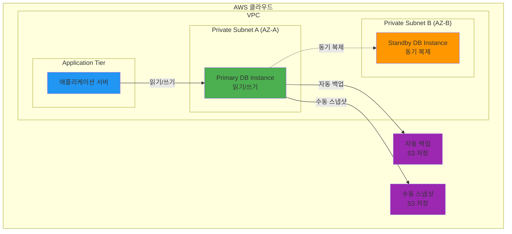

# November Week 3 Day 3 Session 1: RDS Terraform 코드

<div align="center">

**관리형 데이터베이스** • **Multi-AZ 고가용성** • **자동 백업** • **Terraform 코드화**

*Amazon RDS를 Terraform으로 완전 관리*

</div>

---

## 🕘 세션 정보
**시간**: 09:00-09:40 (40분)
**목표**: RDS를 Terraform으로 코드화하여 관리형 데이터베이스 구축
**방식**: 개념 학습 + 실전 코드 작성

## 🎯 학습 목표
- Amazon RDS의 핵심 개념과 장점 이해
- Terraform으로 RDS 인스턴스 생성 및 관리
- DB Subnet Group, Parameter Group 설정
- Multi-AZ 고가용성 구성
- 백업 및 유지보수 자동화

---

## 📖 서비스 개요

### 1. 생성 배경 (Why?) - 5분

**문제 상황**:
- **온프레미스 데이터베이스**: 하드웨어 구매, 설치, 패치, 백업 등 모든 관리 부담
- **EC2에 직접 설치**: OS 패치, DB 소프트웨어 업데이트, 백업 스크립트 작성 등 수동 작업
- **고가용성 구현**: 복잡한 Replication 설정, Failover 메커니즘 구축
- **확장성 문제**: 스토리지 증설, 인스턴스 업그레이드 시 다운타임 발생

**AWS RDS 솔루션**:
- **완전 관리형**: AWS가 하드웨어, OS, DB 소프트웨어 관리
- **자동 백업**: 일일 자동 백업 및 트랜잭션 로그 저장
- **Multi-AZ**: 자동 Failover로 고가용성 보장
- **간편한 확장**: 클릭 몇 번으로 스토리지 증설 및 인스턴스 업그레이드

### 2. 핵심 원리 (How?) - 10분

**RDS 아키텍처**:


**작동 원리**:
1. **Primary DB Instance**: 모든 읽기/쓰기 요청 처리
2. **Standby Instance (Multi-AZ)**: Primary와 동기 복제, 장애 시 자동 Failover
3. **자동 백업**: 매일 자동 백업 + 트랜잭션 로그 (Point-in-Time Recovery)
4. **Parameter Group**: DB 엔진 설정 관리
5. **Subnet Group**: DB 인스턴스가 배치될 Subnet 정의

### 3. 주요 사용 사례 (When?) - 5분

**적합한 경우**:
- **웹 애플리케이션**: 사용자 데이터, 세션 정보 저장
- **E-Commerce**: 주문, 재고, 고객 정보 관리
- **SaaS 애플리케이션**: 멀티 테넌트 데이터베이스
- **분석 워크로드**: Read Replica로 읽기 부하 분산

**실제 사례**:
- **Airbnb**: 수백만 건의 예약 데이터를 RDS PostgreSQL로 관리
- **Netflix**: 청구 및 구독 정보를 RDS MySQL로 처리
- **Slack**: 메시지 메타데이터를 RDS로 저장

### 4. 비슷한 서비스 비교 (Which?) - 5분

**AWS 내 대안 서비스**:
- **EC2 + 직접 설치** vs **RDS**
  - 언제 EC2 사용: 완전한 제어 필요, 특수한 DB 설정, 비용 절감 우선
  - 언제 RDS 사용: 관리 부담 최소화, 고가용성 필요, 자동 백업 필요

- **Aurora** vs **RDS**
  - 언제 Aurora 사용: 대규모 트래픽, 글로벌 데이터베이스, 최고 성능
  - 언제 RDS 사용: 표준 MySQL/PostgreSQL 호환성, 비용 효율

- **DynamoDB** vs **RDS**
  - 언제 DynamoDB 사용: NoSQL, 무제한 확장, 서버리스
  - 언제 RDS 사용: 관계형 데이터, 복잡한 쿼리, 트랜잭션

**선택 기준**:
| 기준 | RDS | Aurora | DynamoDB | EC2 직접 설치 |
|------|-----|--------|----------|---------------|
| 비용 | 중간 | 높음 | 낮음 (사용량 기반) | 낮음 |
| 성능 | 높음 | 매우 높음 | 높음 | 중간 |
| 관리 복잡도 | 낮음 | 낮음 | 매우 낮음 | 높음 |
| 확장성 | 수직 확장 | 자동 확장 | 무제한 | 수동 |
| 고가용성 | Multi-AZ | 자동 | 자동 | 수동 구성 |

### 5. 장단점 분석 - 3분

**장점**:
- ✅ **완전 관리형**: 패치, 백업, 모니터링 자동화
- ✅ **고가용성**: Multi-AZ로 99.95% SLA
- ✅ **자동 백업**: Point-in-Time Recovery 지원
- ✅ **간편한 확장**: 다운타임 최소화하며 스토리지/인스턴스 확장
- ✅ **보안**: VPC 격리, 암호화, IAM 통합

**단점/제약사항**:
- ⚠️ **제한된 제어**: OS 접근 불가, 일부 DB 설정 제한
- ⚠️ **비용**: EC2 직접 설치보다 비쌈
- ⚠️ **벤더 종속**: AWS 특화 기능 사용 시 이전 어려움
- ⚠️ **성능 제한**: 매우 높은 성능 필요 시 Aurora 권장

**대안**:
- 완전한 제어 필요: EC2에 직접 설치
- 최고 성능: Aurora 사용
- NoSQL: DynamoDB 고려

### 6. 비용 구조 💰 - 5분

**과금 방식**:
- **인스턴스 시간**: 초 단위 과금 (최소 10분)
- **스토리지**: GB당 월 단위 과금
- **백업 스토리지**: DB 크기 100%까지 무료, 초과분 과금
- **데이터 전송**: 인터넷 아웃바운드 과금

**프리티어 혜택** (12개월):
- db.t3.micro: 750시간/월 무료
- 20GB SSD 스토리지
- 20GB 백업 스토리지

**비용 최적화 팁**:
1. **Reserved Instance**: 1-3년 약정으로 최대 69% 할인
2. **적절한 인스턴스 타입**: 워크로드에 맞는 크기 선택
3. **스토리지 최적화**: gp3 사용 (gp2보다 20% 저렴)
4. **백업 보관 기간**: 필요한 만큼만 설정 (기본 7일)
5. **Multi-AZ 선택적 사용**: 개발 환경은 Single-AZ

**예상 비용 (ap-northeast-2)**:
| 인스턴스 | vCPU | 메모리 | 시간당 | 월간 (730시간) |
|----------|------|--------|--------|----------------|
| db.t3.micro | 2 | 1GB | $0.018 | $13.14 |
| db.t3.small | 2 | 2GB | $0.036 | $26.28 |
| db.t3.medium | 2 | 4GB | $0.072 | $52.56 |

**Lab 예상 비용**:
- db.t3.micro (1시간): $0.018
- 20GB gp3 스토리지: $0.003/시간
- 합계: ~$0.02/시간

### 7. 최신 업데이트 🆕 - 2분

**2024년 주요 변경사항**:
- **Blue/Green Deployments**: 무중단 업그레이드 지원
- **RDS Optimized Reads**: 읽기 성능 최대 2배 향상
- **Extended Support**: 주요 버전 지원 기간 연장
- **Graviton3**: ARM 기반 인스턴스로 40% 성능 향상

**2025년 예정**:
- **AI 통합**: 자동 쿼리 최적화 및 성능 튜닝
- **더 큰 인스턴스**: 고성능 워크로드 지원

**Deprecated 기능**:
- **db.t2 인스턴스**: 2025년 단계적 종료 예정 (t3로 마이그레이션)
- **MySQL 5.7**: 2024년 2월 Extended Support 종료

**참조**: [AWS RDS What's New](https://aws.amazon.com/rds/whats-new/)

### 8. 잘 사용하는 방법 ✅ - 3분

**베스트 프랙티스**:
1. **Multi-AZ 사용**: 프로덕션 환경은 반드시 Multi-AZ
2. **자동 백업 활성화**: 최소 7일 보관
3. **Parameter Group 커스터마이징**: 워크로드에 맞게 튜닝
4. **Enhanced Monitoring**: 상세 메트릭 수집
5. **IAM 인증**: 비밀번호 대신 IAM 역할 사용

**실무 팁**:
- **Read Replica**: 읽기 부하 분산 (최대 15개)
- **Performance Insights**: 쿼리 성능 분석
- **Slow Query Log**: 느린 쿼리 식별 및 최적화
- **Connection Pooling**: 애플리케이션에서 연결 풀 사용

**성능 최적화**:
- **적절한 인스턴스 타입**: CPU/메모리 사용률 모니터링
- **스토리지 타입**: IOPS 요구사항에 따라 gp3/io1 선택
- **인덱스 최적화**: 쿼리 패턴에 맞는 인덱스 생성

### 9. 잘못 사용하는 방법 ❌ - 3분

**흔한 실수**:
1. **Public 접근 허용**: 보안 위험 (Private Subnet 필수)
2. **백업 미설정**: 데이터 손실 위험
3. **Single-AZ 프로덕션**: 장애 시 다운타임 발생
4. **과도한 인스턴스 크기**: 비용 낭비
5. **암호화 미사용**: 규정 준수 문제

**안티 패턴**:
- **애플리케이션과 같은 Subnet**: DB는 Private Subnet에 격리
- **Root 계정 사용**: 최소 권한 원칙 위반
- **Parameter Group 기본값**: 워크로드에 맞게 튜닝 필요
- **백업 보관 기간 1일**: 최소 7일 권장

**보안 취약점**:
- **암호화 미사용**: 저장 데이터 및 전송 데이터 암호화 필수
- **Security Group 전체 오픈**: 특정 IP/Security Group만 허용
- **SSL/TLS 미사용**: 전송 중 데이터 암호화 필수

### 10. 구성 요소 상세 - 5분

**주요 구성 요소**:

**1. DB Instance**:
- 역할: 실제 데이터베이스 서버
- 설정 옵션:
  - Instance Class: db.t3.micro ~ db.r6g.16xlarge
  - Engine: MySQL, PostgreSQL, MariaDB, Oracle, SQL Server
  - Storage: gp3 (범용), io1 (고성능)
  - Multi-AZ: 고가용성 활성화

**2. DB Subnet Group**:
- 역할: DB 인스턴스가 배치될 Subnet 정의
- 설정: 최소 2개 AZ의 Subnet 포함 (Multi-AZ 필수)

**3. Parameter Group**:
- 역할: DB 엔진 설정 관리
- 설정 옵션:
  - max_connections: 최대 연결 수
  - innodb_buffer_pool_size: 메모리 캐시 크기
  - slow_query_log: 느린 쿼리 로깅

**4. Option Group**:
- 역할: DB 엔진 추가 기능 활성화
- 예시: Oracle Transparent Data Encryption, SQL Server Audit

**5. Security Group**:
- 역할: 네트워크 접근 제어
- 설정: 애플리케이션 Security Group만 허용

**의존성**:
- **VPC**: 네트워크 환경 필수
- **Subnet**: Private Subnet에 배치
- **Security Group**: 접근 제어
- **IAM Role**: Enhanced Monitoring, S3 통합

### 11. 공식 문서 링크 (필수 5개)

**⚠️ 학생들이 직접 확인해야 할 공식 문서**:
- 📘 [RDS란 무엇인가?](https://docs.aws.amazon.com/AmazonRDS/latest/UserGuide/Welcome.html)
- 📗 [RDS 사용자 가이드](https://docs.aws.amazon.com/AmazonRDS/latest/UserGuide/)
- 📙 [RDS API 레퍼런스](https://docs.aws.amazon.com/AmazonRDS/latest/APIReference/)
- 📕 [RDS 요금](https://aws.amazon.com/rds/pricing/)
- 🆕 [RDS 최신 업데이트](https://aws.amazon.com/rds/whats-new/)

---

## 🔧 Terraform 실전 코드

### 기본 RDS 인스턴스 생성
```hcl
# variables.tf
variable "environment" {
  description = "Environment name"
  type        = string
  default     = "dev"
}

variable "db_password" {
  description = "Database master password"
  type        = string
  sensitive   = true
}

# main.tf
resource "aws_db_subnet_group" "main" {
  name       = "${var.environment}-db-subnet-group"
  subnet_ids = [aws_subnet.private_a.id, aws_subnet.private_b.id]

  tags = {
    Name        = "${var.environment}-db-subnet-group"
    Environment = var.environment
  }
}

resource "aws_db_parameter_group" "main" {
  name   = "${var.environment}-postgres-params"
  family = "postgres15"

  parameter {
    name  = "log_connections"
    value = "1"
  }

  parameter {
    name  = "log_disconnections"
    value = "1"
  }

  tags = {
    Name        = "${var.environment}-postgres-params"
    Environment = var.environment
  }
}

resource "aws_db_instance" "main" {
  identifier     = "${var.environment}-postgres"
  engine         = "postgres"
  engine_version = "15.4"
  instance_class = "db.t3.micro"

  allocated_storage     = 20
  max_allocated_storage = 100  # Storage Autoscaling
  storage_type          = "gp3"
  storage_encrypted     = true

  db_name  = "myapp"
  username = "dbadmin"
  password = var.db_password

  db_subnet_group_name   = aws_db_subnet_group.main.name
  parameter_group_name   = aws_db_parameter_group.main.name
  vpc_security_group_ids = [aws_security_group.rds.id]

  # Multi-AZ 고가용성
  multi_az = var.environment == "prod" ? true : false

  # 백업 설정
  backup_retention_period = 7
  backup_window          = "03:00-04:00"
  maintenance_window     = "mon:04:00-mon:05:00"

  # 모니터링
  enabled_cloudwatch_logs_exports = ["postgresql", "upgrade"]
  monitoring_interval             = 60
  monitoring_role_arn            = aws_iam_role.rds_monitoring.arn

  # 삭제 보호
  deletion_protection = var.environment == "prod" ? true : false
  skip_final_snapshot = var.environment != "prod"
  final_snapshot_identifier = var.environment == "prod" ? "${var.environment}-postgres-final-snapshot" : null

  tags = {
    Name        = "${var.environment}-postgres"
    Environment = var.environment
  }
}

# outputs.tf
output "rds_endpoint" {
  description = "RDS instance endpoint"
  value       = aws_db_instance.main.endpoint
}

output "rds_arn" {
  description = "RDS instance ARN"
  value       = aws_db_instance.main.arn
}
```

### Multi-AZ + Read Replica 구성
```hcl
# Primary DB (Multi-AZ)
resource "aws_db_instance" "primary" {
  identifier     = "${var.environment}-postgres-primary"
  engine         = "postgres"
  engine_version = "15.4"
  instance_class = "db.t3.small"

  allocated_storage = 50
  storage_type      = "gp3"
  storage_encrypted = true

  db_name  = "myapp"
  username = "dbadmin"
  password = var.db_password

  db_subnet_group_name   = aws_db_subnet_group.main.name
  vpc_security_group_ids = [aws_security_group.rds.id]

  multi_az                = true  # Multi-AZ 활성화
  backup_retention_period = 7

  tags = {
    Name = "${var.environment}-postgres-primary"
  }
}

# Read Replica (읽기 부하 분산)
resource "aws_db_instance" "replica" {
  identifier     = "${var.environment}-postgres-replica"
  replicate_source_db = aws_db_instance.primary.identifier

  instance_class = "db.t3.small"

  # Replica는 Primary 설정 상속
  publicly_accessible = false
  skip_final_snapshot = true

  tags = {
    Name = "${var.environment}-postgres-replica"
  }
}
```

### Secrets Manager 통합 (비밀번호 관리)
```hcl
# Secrets Manager로 비밀번호 관리
resource "aws_db_instance" "secure" {
  identifier     = "${var.environment}-postgres-secure"
  engine         = "postgres"
  engine_version = "15.4"
  instance_class = "db.t3.micro"

  allocated_storage = 20
  storage_encrypted = true

  db_name  = "myapp"
  username = "dbadmin"

  # Secrets Manager로 비밀번호 관리
  manage_master_user_password   = true
  master_user_secret_kms_key_id = aws_kms_key.rds.key_id

  db_subnet_group_name   = aws_db_subnet_group.main.name
  vpc_security_group_ids = [aws_security_group.rds.id]

  tags = {
    Name = "${var.environment}-postgres-secure"
  }
}

# 비밀번호 ARN 출력
output "db_secret_arn" {
  description = "ARN of the database master password secret"
  value       = aws_db_instance.secure.master_user_secret[0].secret_arn
  sensitive   = true
}
```

---

## 💭 함께 생각해보기

### 🤝 페어 토론 (5분)
**토론 주제**:
1. **RDS vs EC2 직접 설치**: 어떤 상황에서 각각을 선택할까요?
2. **Multi-AZ 비용**: 개발 환경에서도 Multi-AZ가 필요할까요?
3. **백업 전략**: 자동 백업과 수동 스냅샷을 어떻게 조합할까요?

### 💡 이해도 체크 질문
- ✅ "RDS의 핵심 장점 3가지를 설명할 수 있나요?"
- ✅ "Multi-AZ와 Read Replica의 차이를 아시나요?"
- ✅ "Terraform으로 RDS를 어떻게 관리할 수 있을까요?"

---

## 🔑 핵심 키워드

- **Amazon RDS**: 관리형 관계형 데이터베이스 서비스
- **Multi-AZ**: 고가용성을 위한 다중 가용 영역 배포
- **DB Subnet Group**: DB 인스턴스가 배치될 Subnet 그룹
- **Parameter Group**: DB 엔진 설정 관리
- **자동 백업**: 일일 자동 백업 및 Point-in-Time Recovery
- **Read Replica**: 읽기 부하 분산을 위한 복제본
- **Enhanced Monitoring**: 상세 메트릭 수집

---

## 📝 세션 마무리

### ✅ 오늘 세션 성과
- [ ] RDS의 핵심 개념과 장점 이해
- [ ] Multi-AZ 고가용성 아키텍처 이해
- [ ] DB Subnet Group, Parameter Group 역할 파악
- [ ] 비용 구조 및 최적화 방법 학습
- [ ] Terraform 코드화 준비 완료

### 🎯 다음 세션 준비
**Session 2: ElastiCache & SQS/SNS**
- ElastiCache Redis/Memcached 개념
- SQS 메시지 큐 아키텍처
- SNS 알림 서비스
- Terraform 코드 작성

---

<div align="center">

**🗄️ 관리형 DB** • **🔄 Multi-AZ** • **💾 자동 백업** • **📝 Terraform 코드화**

*RDS로 데이터베이스 관리 부담 제로*

</div>
