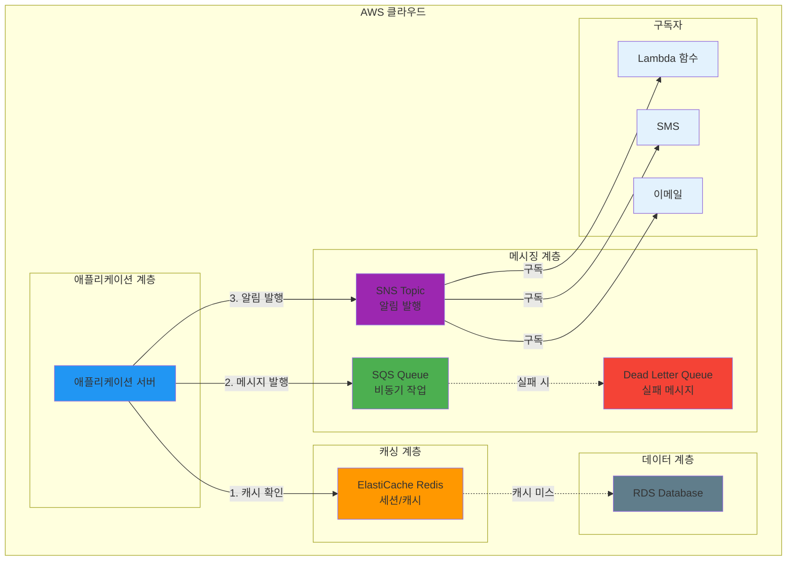

# November Week 3 Day 3 Session 2: ElastiCache & SQS/SNS

<div align="center">

**인메모리 캐싱** • **메시지 큐** • **알림 서비스** • **Terraform 코드화**

*ElastiCache, SQS, SNS를 Terraform으로 완전 관리*

</div>

---

## 🕘 세션 정보
**시간**: 09:40-10:20 (40분)
**목표**: ElastiCache, SQS, SNS를 Terraform으로 코드화하여 캐싱 및 메시징 시스템 구축
**방식**: 개념 학습 + 실전 코드 작성

## 🎯 학습 목표
- ElastiCache Redis/Memcached의 핵심 개념과 차이점 이해
- SQS 메시지 큐 아키텍처 및 활용 방법
- SNS 알림 서비스와 Pub/Sub 패턴
- Terraform으로 캐싱 및 메시징 인프라 구축
- DLQ (Dead Letter Queue) 설정

---

## 📖 서비스 개요

### 1. 생성 배경 (Why?) - 5분

**문제 상황**:
- **데이터베이스 부하**: 반복적인 쿼리로 DB 성능 저하
- **동기 처리 한계**: 시간이 오래 걸리는 작업으로 사용자 대기
- **시스템 간 결합도**: 직접 호출로 인한 강한 의존성
- **알림 복잡도**: 여러 대상에게 동일 메시지 전송 어려움

**AWS 솔루션**:
- **ElastiCache**: 인메모리 캐싱으로 DB 부하 감소 및 응답 속도 향상
- **SQS**: 비동기 메시지 큐로 시스템 간 느슨한 결합
- **SNS**: Pub/Sub 패턴으로 다수 구독자에게 메시지 전송

### 2. 핵심 원리 (How?) - 10분

**전체 아키텍처**:


**ElastiCache 작동 원리**:
1. **Cache-Aside 패턴**: 애플리케이션이 캐시 확인 → 미스 시 DB 조회 → 캐시 저장
2. **Write-Through 패턴**: DB 쓰기 시 캐시도 동시 업데이트
3. **TTL (Time To Live)**: 자동 만료로 메모리 관리

**SQS 작동 원리**:
1. **Producer**: 메시지를 Queue에 전송
2. **Consumer**: Queue에서 메시지 수신 및 처리
3. **Visibility Timeout**: 처리 중 메시지 숨김 (중복 처리 방지)
4. **DLQ**: 처리 실패 메시지 격리

**SNS 작동 원리**:
1. **Publisher**: Topic에 메시지 발행
2. **Subscriber**: Topic 구독 (Email, SMS, Lambda, SQS 등)
3. **Fan-Out**: 하나의 메시지를 여러 구독자에게 전송

### 3. 주요 사용 사례 (When?) - 5분

**ElastiCache 적합한 경우**:
- **세션 스토어**: 사용자 세션 정보 저장 (로그인 상태)
- **캐싱**: 자주 조회되는 데이터 캐싱 (상품 정보, 뉴스 피드)
- **실시간 분석**: 리더보드, 실시간 통계
- **Rate Limiting**: API 호출 제한

**SQS 적합한 경우**:
- **비동기 작업**: 이미지 처리, 동영상 인코딩
- **작업 큐**: 배치 작업, 이메일 발송
- **마이크로서비스 통신**: 서비스 간 느슨한 결합
- **부하 평준화**: 트래픽 급증 시 버퍼 역할

**SNS 적합한 경우**:
- **알림 발송**: 이메일, SMS, 푸시 알림
- **이벤트 브로드캐스트**: 여러 시스템에 동일 이벤트 전파
- **Fan-Out 패턴**: 하나의 메시지를 여러 SQS Queue로 전송

**실제 사례**:
- **Netflix**: ElastiCache로 영화 메타데이터 캐싱
- **Airbnb**: SQS로 예약 처리 비동기화
- **Uber**: SNS로 운전자 및 승객 알림

### 4. 비슷한 서비스 비교 (Which?) - 5분

**ElastiCache 내 선택**:
- **Redis** vs **Memcached**
  - 언제 Redis 사용: 데이터 영속성, 복잡한 자료구조, Pub/Sub
  - 언제 Memcached 사용: 단순 캐싱, 멀티스레드, 낮은 메모리

**메시징 서비스 비교**:
- **SQS** vs **SNS**
  - 언제 SQS 사용: 작업 큐, 비동기 처리, 1:1 통신
  - 언제 SNS 사용: 알림, 이벤트 브로드캐스트, 1:N 통신

- **SQS** vs **Kinesis**
  - 언제 SQS 사용: 메시지 큐, 작업 처리, 순서 보장 불필요
  - 언제 Kinesis 사용: 실시간 스트리밍, 대용량 데이터, 순서 보장

**선택 기준**:
| 기준 | Redis | Memcached | SQS | SNS | Kinesis |
|------|-------|-----------|-----|-----|---------|
| 데이터 구조 | 복잡 | 단순 | 메시지 | 메시지 | 스트림 |
| 영속성 | 지원 | 미지원 | 지원 | 미지원 | 지원 |
| 순서 보장 | 부분 | 없음 | FIFO | 없음 | 완전 |
| 처리량 | 높음 | 매우 높음 | 중간 | 높음 | 매우 높음 |
| 비용 | 중간 | 낮음 | 낮음 | 낮음 | 높음 |

### 5. 장단점 분석 - 3분

**ElastiCache 장점**:
- ✅ **빠른 응답**: 밀리초 단위 응답 시간
- ✅ **DB 부하 감소**: 반복 쿼리 캐싱
- ✅ **확장성**: 노드 추가로 수평 확장
- ✅ **고가용성**: Multi-AZ 지원

**ElastiCache 단점**:
- ⚠️ **메모리 제한**: 디스크보다 비싼 메모리 사용
- ⚠️ **데이터 손실**: 재시작 시 데이터 손실 (Memcached)
- ⚠️ **캐시 무효화**: 데이터 일관성 관리 복잡

**SQS 장점**:
- ✅ **완전 관리형**: 서버 관리 불필요
- ✅ **무제한 확장**: 메시지 수 제한 없음
- ✅ **내구성**: 메시지 손실 방지
- ✅ **비용 효율**: 사용량 기반 과금

**SQS 단점**:
- ⚠️ **순서 보장 제한**: Standard Queue는 순서 미보장
- ⚠️ **중복 가능**: At-Least-Once 전달
- ⚠️ **지연**: 실시간 처리 부적합

**SNS 장점**:
- ✅ **Fan-Out**: 여러 구독자에게 동시 전송
- ✅ **다양한 프로토콜**: Email, SMS, HTTP, Lambda, SQS
- ✅ **필터링**: 구독자별 메시지 필터링

**SNS 단점**:
- ⚠️ **메시지 보관 없음**: 전송 실패 시 재시도 제한
- ⚠️ **순서 미보장**: 메시지 순서 보장 안 됨

### 6. 비용 구조 💰 - 5분

**ElastiCache 과금 방식**:
- **노드 시간**: 시간당 과금
- **데이터 전송**: 인터넷 아웃바운드 과금

**프리티어 혜택** (12개월):
- cache.t3.micro: 750시간/월 무료

**ElastiCache 예상 비용 (ap-northeast-2)**:
| 노드 타입 | 메모리 | 시간당 | 월간 (730시간) |
|-----------|--------|--------|----------------|
| cache.t3.micro | 0.5GB | $0.017 | $12.41 |
| cache.t3.small | 1.37GB | $0.034 | $24.82 |

**SQS 과금 방식**:
- **요청 수**: 100만 요청당 $0.40
- **데이터 전송**: 인터넷 아웃바운드 과금

**프리티어 혜택** (영구):
- 100만 요청/월 무료

**SNS 과금 방식**:
- **발행 요청**: 100만 요청당 $0.50
- **알림 전송**: Email $2/10만 건, SMS 국가별 상이

**프리티어 혜택** (영구):
- 100만 발행 요청/월 무료
- 1,000 Email 알림 무료

**Lab 예상 비용**:
- ElastiCache (1시간): $0.017
- SQS (1,000 요청): $0.0004
- SNS (100 발행): $0.00005
- 합계: ~$0.02/시간

### 7. 최신 업데이트 🆕 - 2분

**2024년 주요 변경사항**:
- **ElastiCache Serverless**: 자동 확장 및 용량 관리
- **Redis 7.0 지원**: 향상된 성능 및 기능
- **SQS FIFO 처리량 증가**: 초당 3,000 메시지 → 30,000 메시지
- **SNS 메시지 필터링 강화**: 복잡한 필터 조건 지원

**2025년 예정**:
- **ElastiCache AI 통합**: 자동 캐시 최적화
- **SQS 순서 보장 개선**: Standard Queue 순서 보장 옵션

**Deprecated 기능**:
- **ElastiCache t2 노드**: 2025년 단계적 종료 (t3로 마이그레이션)

**참조**: 
- [ElastiCache What's New](https://aws.amazon.com/elasticache/whats-new/)
- [SQS What's New](https://aws.amazon.com/sqs/whats-new/)
- [SNS What's New](https://aws.amazon.com/sns/whats-new/)

### 8. 잘 사용하는 방법 ✅ - 3분

**ElastiCache 베스트 프랙티스**:
1. **적절한 TTL 설정**: 데이터 특성에 맞는 만료 시간
2. **캐시 워밍**: 애플리케이션 시작 시 주요 데이터 미리 로드
3. **모니터링**: CPU, 메모리, 캐시 히트율 추적
4. **클러스터 모드**: 대용량 데이터는 샤딩 활용

**SQS 베스트 프랙티스**:
1. **Visibility Timeout 조정**: 처리 시간에 맞게 설정
2. **DLQ 설정**: 실패 메시지 격리 및 분석
3. **배치 처리**: 최대 10개 메시지 동시 처리
4. **Long Polling**: 빈 응답 감소 (비용 절감)

**SNS 베스트 프랙티스**:
1. **메시지 필터링**: 구독자별 필요한 메시지만 수신
2. **재시도 정책**: 전송 실패 시 재시도 설정
3. **DLQ 연결**: 전송 실패 메시지 저장
4. **암호화**: 민감 정보 전송 시 암호화

### 9. 잘못 사용하는 방법 ❌ - 3분

**ElastiCache 흔한 실수**:
1. **캐시 무효화 미흡**: 오래된 데이터 제공
2. **과도한 캐싱**: 메모리 낭비 및 비용 증가
3. **단일 노드**: 장애 시 전체 캐시 손실
4. **보안 미흡**: Public 접근 허용

**SQS 흔한 실수**:
1. **Visibility Timeout 부족**: 중복 처리 발생
2. **DLQ 미설정**: 실패 메시지 손실
3. **메시지 크기 초과**: 256KB 제한 (S3 활용 필요)
4. **순서 보장 오해**: Standard Queue는 순서 미보장

**SNS 흔한 실수**:
1. **재시도 정책 미설정**: 전송 실패 시 메시지 손실
2. **필터링 미활용**: 불필요한 메시지 전송
3. **비용 모니터링 부족**: SMS 비용 급증
4. **구독 확인 누락**: 이메일 구독 미확인

**안티 패턴**:
- **ElastiCache를 DB 대체**: 영속성 필요 데이터는 DB 사용
- **SQS를 실시간 통신**: 지연 시간 있음 (WebSocket 고려)
- **SNS를 작업 큐**: 메시지 보관 없음 (SQS 사용)

### 10. 구성 요소 상세 - 5분

**ElastiCache 주요 구성 요소**:

**1. Cache Cluster**:
- 역할: Redis/Memcached 노드 그룹
- 설정 옵션:
  - Node Type: cache.t3.micro ~ cache.r6g.16xlarge
  - Number of Nodes: 1 ~ 90
  - Engine: Redis 7.0, Memcached 1.6

**2. Subnet Group**:
- 역할: 캐시 노드가 배치될 Subnet 정의
- 설정: 최소 2개 AZ의 Subnet 포함

**3. Parameter Group**:
- 역할: 엔진 설정 관리
- 설정 옵션:
  - maxmemory-policy: 메모리 부족 시 정책
  - timeout: 유휴 연결 타임아웃

**SQS 주요 구성 요소**:

**1. Queue**:
- 역할: 메시지 저장소
- 타입:
  - Standard: 무제한 처리량, 순서 미보장
  - FIFO: 순서 보장, 초당 3,000 메시지

**2. Dead Letter Queue**:
- 역할: 처리 실패 메시지 격리
- 설정: maxReceiveCount (재시도 횟수)

**SNS 주요 구성 요소**:

**1. Topic**:
- 역할: 메시지 발행 대상
- 타입:
  - Standard: 무제한 처리량
  - FIFO: 순서 보장

**2. Subscription**:
- 역할: 메시지 수신 대상
- 프로토콜: Email, SMS, HTTP, Lambda, SQS

**의존성**:
- **VPC**: ElastiCache는 VPC 내 배치
- **Security Group**: 접근 제어
- **IAM Role**: Lambda, EC2 접근 권한

### 11. 공식 문서 링크 (필수 5개)

**ElastiCache**:
- 📘 [ElastiCache란 무엇인가?](https://docs.aws.amazon.com/AmazonElastiCache/latest/dg/WhatIs.html)
- 📗 [ElastiCache 사용자 가이드](https://docs.aws.amazon.com/AmazonElastiCache/latest/dg/)
- 📕 [ElastiCache 요금](https://aws.amazon.com/elasticache/pricing/)

**SQS**:
- 📘 [SQS란 무엇인가?](https://docs.aws.amazon.com/AWSSimpleQueueService/latest/SQSDeveloperGuide/welcome.html)
- 📗 [SQS 사용자 가이드](https://docs.aws.amazon.com/AWSSimpleQueueService/latest/SQSDeveloperGuide/)
- 📕 [SQS 요금](https://aws.amazon.com/sqs/pricing/)

**SNS**:
- 📘 [SNS란 무엇인가?](https://docs.aws.amazon.com/sns/latest/dg/welcome.html)
- 📗 [SNS 사용자 가이드](https://docs.aws.amazon.com/sns/latest/dg/)
- 📕 [SNS 요금](https://aws.amazon.com/sns/pricing/)

---

## 🔧 Terraform 실전 코드

### ElastiCache Redis 클러스터
```hcl
# ElastiCache Subnet Group
resource "aws_elasticache_subnet_group" "main" {
  name       = "${var.environment}-redis-subnet"
  subnet_ids = [aws_subnet.private_a.id, aws_subnet.private_b.id]

  tags = {
    Name = "${var.environment}-redis-subnet"
  }
}

# ElastiCache Redis
resource "aws_elasticache_cluster" "redis" {
  cluster_id           = "${var.environment}-redis"
  engine               = "redis"
  engine_version       = "7.0"
  node_type            = "cache.t3.micro"
  num_cache_nodes      = 1
  parameter_group_name = "default.redis7"
  port                 = 6379

  subnet_group_name    = aws_elasticache_subnet_group.main.name
  security_group_ids   = [aws_security_group.redis.id]

  tags = {
    Name = "${var.environment}-redis"
  }
}

output "redis_endpoint" {
  value = aws_elasticache_cluster.redis.cache_nodes[0].address
}
```

### SQS Queue + DLQ
```hcl
# Dead Letter Queue
resource "aws_sqs_queue" "dlq" {
  name                      = "${var.environment}-dlq"
  message_retention_seconds = 1209600  # 14 days

  tags = {
    Name = "${var.environment}-dlq"
  }
}

# Main Queue
resource "aws_sqs_queue" "main" {
  name                       = "${var.environment}-queue"
  delay_seconds              = 0
  max_message_size           = 262144  # 256 KB
  message_retention_seconds  = 345600  # 4 days
  receive_wait_time_seconds  = 10      # Long polling
  visibility_timeout_seconds = 30

  # DLQ 설정
  redrive_policy = jsonencode({
    deadLetterTargetArn = aws_sqs_queue.dlq.arn
    maxReceiveCount     = 3
  })

  tags = {
    Name = "${var.environment}-queue"
  }
}

output "queue_url" {
  value = aws_sqs_queue.main.url
}
```

### SNS Topic + Subscriptions
```hcl
# SNS Topic
resource "aws_sns_topic" "alerts" {
  name = "${var.environment}-alerts"

  tags = {
    Name = "${var.environment}-alerts"
  }
}

# Email Subscription
resource "aws_sns_topic_subscription" "email" {
  topic_arn = aws_sns_topic.alerts.arn
  protocol  = "email"
  endpoint  = "admin@example.com"
}

# SQS Subscription (Fan-Out)
resource "aws_sns_topic_subscription" "sqs" {
  topic_arn = aws_sns_topic.alerts.arn
  protocol  = "sqs"
  endpoint  = aws_sqs_queue.main.arn
}

# Lambda Subscription
resource "aws_sns_topic_subscription" "lambda" {
  topic_arn = aws_sns_topic.alerts.arn
  protocol  = "lambda"
  endpoint  = aws_lambda_function.processor.arn
}

output "sns_topic_arn" {
  value = aws_sns_topic.alerts.arn
}
```

### 통합 예시: ElastiCache + SQS + SNS
```hcl
# 전체 메시징 및 캐싱 스택
module "messaging" {
  source = "./modules/messaging"

  environment = var.environment
  vpc_id      = aws_vpc.main.id
  subnet_ids  = [aws_subnet.private_a.id, aws_subnet.private_b.id]

  # Redis 설정
  redis_node_type = "cache.t3.micro"
  redis_version   = "7.0"

  # SQS 설정
  queue_name              = "app-queue"
  visibility_timeout      = 30
  max_receive_count       = 3

  # SNS 설정
  sns_topic_name = "app-alerts"
  email_endpoints = ["admin@example.com"]

  tags = {
    Environment = var.environment
    ManagedBy   = "Terraform"
  }
}
```

---

## 💭 함께 생각해보기

### 🤝 페어 토론 (5분)
**토론 주제**:
1. **캐싱 전략**: Cache-Aside vs Write-Through, 어떤 상황에서 각각 사용할까요?
2. **메시징 선택**: SQS vs SNS, 실제 프로젝트에서 어떻게 조합할까요?
3. **DLQ 활용**: 실패 메시지를 어떻게 처리하고 재시도할까요?

### 💡 이해도 체크 질문
- ✅ "Redis와 Memcached의 차이를 설명할 수 있나요?"
- ✅ "SQS와 SNS를 함께 사용하는 Fan-Out 패턴을 아시나요?"
- ✅ "Terraform으로 이 서비스들을 어떻게 관리할 수 있을까요?"

---

## 🔑 핵심 키워드

- **ElastiCache**: 관리형 인메모리 캐싱 서비스
- **Redis**: 복잡한 자료구조 지원, 영속성 가능
- **Memcached**: 단순 캐싱, 멀티스레드
- **SQS**: 관리형 메시지 큐 서비스
- **SNS**: Pub/Sub 알림 서비스
- **DLQ (Dead Letter Queue)**: 실패 메시지 격리
- **Fan-Out**: SNS → 여러 SQS Queue 전송

---

## 📝 세션 마무리

### ✅ 오늘 세션 성과
- [ ] ElastiCache Redis/Memcached 차이 이해
- [ ] SQS 메시지 큐 아키텍처 파악
- [ ] SNS Pub/Sub 패턴 이해
- [ ] DLQ 설정 및 활용 방법 학습
- [ ] Terraform 코드화 준비 완료

### 🎯 다음 세션 준비
**Session 3: API Gateway & Cognito**
- API Gateway REST API 개념
- Cognito User Pool 인증
- Lambda 통합
- Terraform 코드 작성

---

<div align="center">

**⚡ 인메모리 캐싱** • **📬 메시지 큐** • **📢 알림 서비스** • **📝 Terraform 코드화**

*ElastiCache, SQS, SNS로 성능과 확장성 향상*

</div>
