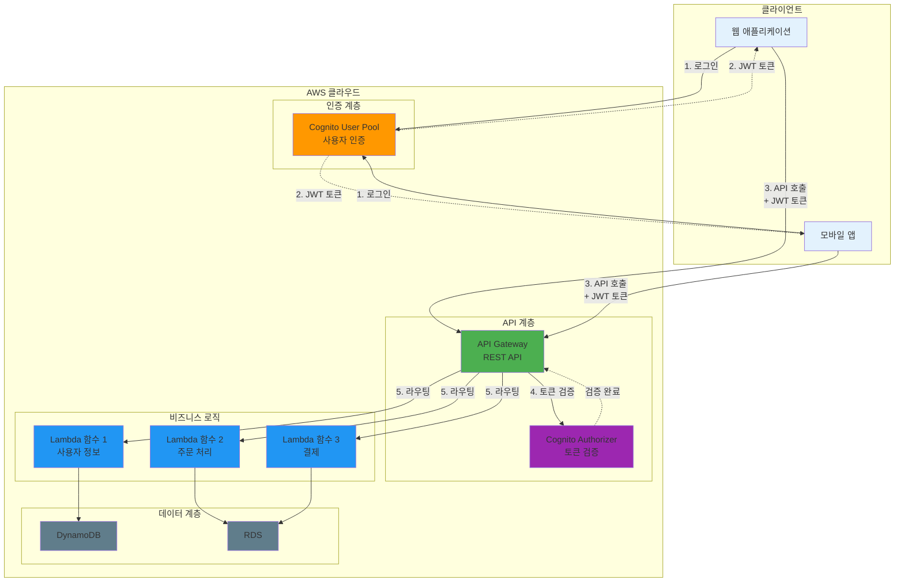

# November Week 3 Day 3 Session 3: API Gateway & Cognito

<div align="center">

**API 관리** • **사용자 인증** • **Lambda 통합** • **Terraform 코드화**

*API Gateway와 Cognito를 Terraform으로 완전 관리*

</div>

---

## 🕘 세션 정보
**시간**: 10:20-11:00 (40분)
**목표**: API Gateway와 Cognito를 Terraform으로 코드화하여 보안 API 구축
**방식**: 개념 학습 + 실전 코드 작성

## 🎯 학습 목표
- API Gateway의 핵심 개념과 REST API 구조 이해
- Cognito User Pool을 통한 사용자 인증 구현
- Lambda 함수와 API Gateway 통합
- Terraform으로 API 인프라 구축
- 인증 및 권한 부여 설정

---

## 📖 서비스 개요

### 1. 생성 배경 (Why?) - 5분

**문제 상황**:
- **API 관리 복잡도**: 버전 관리, 인증, Rate Limiting 등 직접 구현
- **인증 시스템 구축**: 사용자 관리, 비밀번호 정책, MFA 등 복잡한 구현
- **확장성 문제**: 트래픽 증가 시 서버 확장 어려움
- **보안 취약점**: 인증/인가 로직 직접 구현 시 보안 위험

**AWS 솔루션**:
- **API Gateway**: 완전 관리형 API 서비스 (인증, Rate Limiting, 모니터링)
- **Cognito**: 사용자 인증 및 권한 부여 서비스 (User Pool, Identity Pool)
- **Lambda 통합**: 서버리스 백엔드 구현

### 2. 핵심 원리 (How?) - 10분

**전체 아키텍처**:


**API Gateway 작동 원리**:
1. **클라이언트 요청**: HTTP 요청 수신
2. **인증/인가**: Cognito Authorizer로 JWT 토큰 검증
3. **Rate Limiting**: 요청 제한 적용
4. **라우팅**: 백엔드 (Lambda, HTTP 엔드포인트) 호출
5. **응답 변환**: 백엔드 응답을 클라이언트 형식으로 변환

**Cognito 작동 원리**:
1. **사용자 등록**: 이메일/전화번호 인증
2. **로그인**: 사용자 이름/비밀번호 검증
3. **토큰 발급**: JWT 토큰 (ID Token, Access Token, Refresh Token)
4. **토큰 검증**: API Gateway에서 토큰 유효성 확인

### 3. 주요 사용 사례 (When?) - 5분

**API Gateway 적합한 경우**:
- **RESTful API**: 표준 REST API 구축
- **서버리스 백엔드**: Lambda 함수 노출
- **마이크로서비스**: 여러 백엔드 서비스 통합
- **모바일 백엔드**: 모바일 앱 API

**Cognito 적합한 경우**:
- **사용자 인증**: 회원가입, 로그인, 비밀번호 재설정
- **소셜 로그인**: Google, Facebook, Amazon 연동
- **MFA**: 다중 인증 (SMS, TOTP)
- **사용자 관리**: 사용자 속성, 그룹 관리

**실제 사례**:
- **Airbnb**: API Gateway로 모바일 앱 API 관리
- **Lyft**: Cognito로 운전자 및 승객 인증
- **Duolingo**: API Gateway + Lambda로 서버리스 백엔드

### 4. 비슷한 서비스 비교 (Which?) - 5분

**API 관리 서비스 비교**:
- **API Gateway** vs **ALB**
  - 언제 API Gateway 사용: REST API, Lambda 통합, API 관리 기능
  - 언제 ALB 사용: HTTP/HTTPS 로드밸런싱, EC2/ECS 통합

- **API Gateway** vs **AppSync**
  - 언제 API Gateway 사용: REST API, 기존 백엔드 통합
  - 언제 AppSync 사용: GraphQL API, 실시간 데이터 동기화

**인증 서비스 비교**:
- **Cognito** vs **IAM**
  - 언제 Cognito 사용: 사용자 인증 (B2C, B2B)
  - 언제 IAM 사용: AWS 리소스 접근 제어 (내부 서비스)

- **Cognito** vs **Auth0/Okta**
  - 언제 Cognito 사용: AWS 네이티브, 비용 효율
  - 언제 Auth0/Okta 사용: 멀티 클라우드, 고급 기능

**선택 기준**:
| 기준 | API Gateway | ALB | AppSync | Cognito | IAM |
|------|-------------|-----|---------|---------|-----|
| API 타입 | REST | HTTP/HTTPS | GraphQL | - | - |
| 인증 | Cognito, IAM | - | Cognito, IAM | 사용자 | AWS 리소스 |
| Lambda 통합 | 완벽 | 가능 | 완벽 | - | - |
| 비용 | 중간 | 낮음 | 중간 | 낮음 | 무료 |
| 관리 복잡도 | 낮음 | 중간 | 낮음 | 낮음 | 중간 |

### 5. 장단점 분석 - 3분

**API Gateway 장점**:
- ✅ **완전 관리형**: 서버 관리 불필요
- ✅ **자동 확장**: 트래픽 증가 시 자동 확장
- ✅ **통합 기능**: 인증, Rate Limiting, 캐싱, 모니터링
- ✅ **Lambda 통합**: 서버리스 백엔드 구축

**API Gateway 단점**:
- ⚠️ **비용**: 요청당 과금 (대량 트래픽 시 비쌈)
- ⚠️ **지연 시간**: ALB보다 약간 높음
- ⚠️ **제한**: 29초 타임아웃, 10MB 페이로드

**Cognito 장점**:
- ✅ **완전 관리형**: 사용자 관리 자동화
- ✅ **보안**: 비밀번호 정책, MFA, 암호화
- ✅ **확장성**: 수백만 사용자 지원
- ✅ **소셜 로그인**: Google, Facebook 등 연동

**Cognito 단점**:
- ⚠️ **커스터마이징 제한**: UI 커스터마이징 제한적
- ⚠️ **복잡한 설정**: 초기 설정 복잡
- ⚠️ **비용**: 월 50,000 MAU 초과 시 과금

**대안**:
- 간단한 인증: IAM 사용
- 고급 기능: Auth0, Okta 고려
- 대량 트래픽: ALB + 자체 인증 시스템

### 6. 비용 구조 💰 - 5분

**API Gateway 과금 방식**:
- **REST API**: 100만 요청당 $3.50
- **HTTP API**: 100만 요청당 $1.00 (저렴)
- **WebSocket API**: 100만 메시지당 $1.00
- **데이터 전송**: 인터넷 아웃바운드 과금

**프리티어 혜택** (12개월):
- 100만 REST API 요청/월 무료

**Cognito 과금 방식**:
- **MAU (Monthly Active Users)**: 월 활성 사용자 수
- **처음 50,000 MAU**: 무료
- **50,001 ~ 100,000 MAU**: $0.0055/MAU
- **100,001+ MAU**: $0.0046/MAU

**프리티어 혜택** (영구):
- 50,000 MAU/월 무료

**비용 최적화 팁**:
1. **HTTP API 사용**: REST API보다 70% 저렴
2. **캐싱 활용**: 반복 요청 캐싱으로 비용 절감
3. **배치 처리**: 여러 요청을 하나로 통합
4. **Cognito 무료 티어**: 50,000 MAU까지 무료

**예상 비용 (ap-northeast-2)**:
| 항목 | 사용량 | 비용 |
|------|--------|------|
| API Gateway (REST) | 100만 요청 | $3.50 |
| API Gateway (HTTP) | 100만 요청 | $1.00 |
| Cognito | 10,000 MAU | $0.00 (무료) |

**Lab 예상 비용**:
- API Gateway (1,000 요청): $0.0035
- Cognito (10 사용자): $0.00
- Lambda (1,000 호출): $0.00 (프리티어)
- 합계: ~$0.004/시간

### 7. 최신 업데이트 🆕 - 2분

**2024년 주요 변경사항**:
- **HTTP API 기능 강화**: JWT Authorizer, CORS 개선
- **Cognito 고급 보안**: 위험 기반 인증, 적응형 인증
- **API Gateway WebSocket**: 양방향 통신 지원 강화
- **Cognito 사용자 마이그레이션**: 기존 시스템에서 마이그레이션 도구

**2025년 예정**:
- **API Gateway AI 통합**: 자동 API 최적화
- **Cognito Passwordless**: 비밀번호 없는 인증 강화

**Deprecated 기능**:
- **API Gateway v1 (REST API)**: v2 (HTTP API) 권장

**참조**: 
- [API Gateway What's New](https://aws.amazon.com/api-gateway/whats-new/)
- [Cognito What's New](https://aws.amazon.com/cognito/whats-new/)

### 8. 잘 사용하는 방법 ✅ - 3분

**API Gateway 베스트 프랙티스**:
1. **HTTP API 우선**: REST API보다 저렴하고 빠름
2. **캐싱 활용**: 자주 조회되는 데이터 캐싱
3. **Rate Limiting**: API 남용 방지
4. **CORS 설정**: 웹 애플리케이션 CORS 허용
5. **CloudWatch 로깅**: 요청/응답 로깅 활성화

**Cognito 베스트 프랙티스**:
1. **강력한 비밀번호 정책**: 최소 8자, 대소문자, 숫자, 특수문자
2. **MFA 활성화**: 중요 계정은 MFA 필수
3. **토큰 만료 시간**: Access Token 1시간, Refresh Token 30일
4. **사용자 속성**: 필요한 속성만 수집 (GDPR 준수)
5. **Lambda Trigger**: 사용자 등록/로그인 시 커스텀 로직

**Lambda 통합 팁**:
- **Proxy 통합**: 요청/응답 자동 매핑
- **IAM 역할**: Lambda에 최소 권한 부여
- **환경 변수**: 민감 정보는 Secrets Manager 사용

### 9. 잘못 사용하는 방법 ❌ - 3분

**API Gateway 흔한 실수**:
1. **REST API 과다 사용**: HTTP API로 충분한 경우 많음
2. **캐싱 미활용**: 반복 요청 비용 증가
3. **Rate Limiting 미설정**: API 남용 위험
4. **CORS 전체 허용**: 보안 위험 (`*` 사용 금지)
5. **로깅 미활성화**: 문제 발생 시 디버깅 어려움

**Cognito 흔한 실수**:
1. **약한 비밀번호 정책**: 보안 취약점
2. **MFA 미사용**: 계정 탈취 위험
3. **토큰 만료 시간 과다**: 보안 위험
4. **사용자 속성 과다 수집**: GDPR 위반
5. **Lambda Trigger 오류**: 사용자 등록/로그인 실패

**안티 패턴**:
- **API Gateway를 프록시로만 사용**: 기능 활용 부족
- **Cognito를 단순 DB로 사용**: 사용자 관리 기능 미활용
- **Lambda 함수 과다 분리**: 콜드 스타트 증가

**보안 취약점**:
- **JWT 토큰 노출**: HTTPS 필수, 로컬 스토리지 주의
- **API Key 하드코딩**: 환경 변수 또는 Secrets Manager 사용
- **CORS 전체 허용**: 특정 도메인만 허용

### 10. 구성 요소 상세 - 5분

**API Gateway 주요 구성 요소**:

**1. REST API / HTTP API**:
- 역할: API 엔드포인트 정의
- 타입:
  - REST API: 완전한 기능, 높은 비용
  - HTTP API: 간소화, 저렴, 빠름

**2. Resource & Method**:
- 역할: API 경로 및 HTTP 메서드 정의
- 예시: `/users` (GET, POST, PUT, DELETE)

**3. Integration**:
- 역할: 백엔드 연결
- 타입:
  - Lambda: Lambda 함수 호출
  - HTTP: HTTP 엔드포인트 프록시
  - Mock: 테스트용 Mock 응답

**4. Authorizer**:
- 역할: 인증 및 권한 부여
- 타입:
  - Cognito: Cognito User Pool 토큰 검증
  - Lambda: 커스텀 인증 로직
  - IAM: AWS IAM 인증

**5. Stage**:
- 역할: 배포 환경 관리
- 예시: dev, staging, prod

**Cognito 주요 구성 요소**:

**1. User Pool**:
- 역할: 사용자 디렉토리
- 기능: 회원가입, 로그인, 비밀번호 재설정

**2. User Pool Client**:
- 역할: 애플리케이션 연동
- 설정: 인증 흐름, 토큰 만료 시간

**3. Identity Pool**:
- 역할: AWS 리소스 접근 권한 부여
- 기능: 임시 AWS 자격 증명 발급

**4. Lambda Trigger**:
- 역할: 사용자 이벤트 시 커스텀 로직
- 예시: Pre-signup, Post-authentication

**의존성**:
- **Lambda 함수**: API 백엔드
- **IAM Role**: Lambda 실행 권한
- **CloudWatch Logs**: 로깅

### 11. 공식 문서 링크 (필수 5개)

**API Gateway**:
- 📘 [API Gateway란 무엇인가?](https://docs.aws.amazon.com/apigateway/latest/developerguide/welcome.html)
- 📗 [API Gateway 사용자 가이드](https://docs.aws.amazon.com/apigateway/latest/developerguide/)
- 📙 [API Gateway API 레퍼런스](https://docs.aws.amazon.com/apigateway/latest/api/)
- 📕 [API Gateway 요금](https://aws.amazon.com/api-gateway/pricing/)
- 🆕 [API Gateway 최신 업데이트](https://aws.amazon.com/api-gateway/whats-new/)

**Cognito**:
- 📘 [Cognito란 무엇인가?](https://docs.aws.amazon.com/cognito/latest/developerguide/what-is-amazon-cognito.html)
- 📗 [Cognito 사용자 가이드](https://docs.aws.amazon.com/cognito/latest/developerguide/)
- 📙 [Cognito API 레퍼런스](https://docs.aws.amazon.com/cognito-user-identity-pools/latest/APIReference/)
- 📕 [Cognito 요금](https://aws.amazon.com/cognito/pricing/)
- 🆕 [Cognito 최신 업데이트](https://aws.amazon.com/cognito/whats-new/)

---

## 🔧 Terraform 실전 코드

### Cognito User Pool
```hcl
# Cognito User Pool
resource "aws_cognito_user_pool" "main" {
  name = "${var.environment}-user-pool"

  # 비밀번호 정책
  password_policy {
    minimum_length    = 8
    require_lowercase = true
    require_uppercase = true
    require_numbers   = true
    require_symbols   = true
  }

  # 사용자 속성
  schema {
    name                = "email"
    attribute_data_type = "String"
    required            = true
    mutable             = false
  }

  # 이메일 인증
  auto_verified_attributes = ["email"]

  # MFA 설정
  mfa_configuration = "OPTIONAL"

  # 계정 복구
  account_recovery_setting {
    recovery_mechanism {
      name     = "verified_email"
      priority = 1
    }
  }

  tags = {
    Name = "${var.environment}-user-pool"
  }
}

# User Pool Client
resource "aws_cognito_user_pool_client" "web" {
  name         = "${var.environment}-web-client"
  user_pool_id = aws_cognito_user_pool.main.id

  # 인증 흐름
  explicit_auth_flows = [
    "ALLOW_USER_PASSWORD_AUTH",
    "ALLOW_REFRESH_TOKEN_AUTH"
  ]

  # 토큰 만료 시간
  access_token_validity  = 1  # 1시간
  id_token_validity      = 1  # 1시간
  refresh_token_validity = 30 # 30일

  token_validity_units {
    access_token  = "hours"
    id_token      = "hours"
    refresh_token = "days"
  }

  # OAuth 설정
  allowed_oauth_flows_user_pool_client = true
  allowed_oauth_flows                  = ["code", "implicit"]
  allowed_oauth_scopes                 = ["email", "openid", "profile"]
  callback_urls                        = ["https://example.com/callback"]
  logout_urls                          = ["https://example.com/logout"]
}

output "user_pool_id" {
  value = aws_cognito_user_pool.main.id
}

output "user_pool_client_id" {
  value = aws_cognito_user_pool_client.web.id
}
```

### API Gateway REST API + Cognito Authorizer
```hcl
# API Gateway REST API
resource "aws_api_gateway_rest_api" "main" {
  name        = "${var.environment}-api"
  description = "Main API Gateway"

  endpoint_configuration {
    types = ["REGIONAL"]
  }

  tags = {
    Name = "${var.environment}-api"
  }
}

# Cognito Authorizer
resource "aws_api_gateway_authorizer" "cognito" {
  name          = "cognito-authorizer"
  rest_api_id   = aws_api_gateway_rest_api.main.id
  type          = "COGNITO_USER_POOLS"
  provider_arns = [aws_cognito_user_pool.main.arn]
}

# API Resource: /users
resource "aws_api_gateway_resource" "users" {
  rest_api_id = aws_api_gateway_rest_api.main.id
  parent_id   = aws_api_gateway_rest_api.main.root_resource_id
  path_part   = "users"
}

# GET /users
resource "aws_api_gateway_method" "get_users" {
  rest_api_id   = aws_api_gateway_rest_api.main.id
  resource_id   = aws_api_gateway_resource.users.id
  http_method   = "GET"
  authorization = "COGNITO_USER_POOLS"
  authorizer_id = aws_api_gateway_authorizer.cognito.id
}

# Lambda Integration
resource "aws_api_gateway_integration" "get_users_lambda" {
  rest_api_id             = aws_api_gateway_rest_api.main.id
  resource_id             = aws_api_gateway_resource.users.id
  http_method             = aws_api_gateway_method.get_users.http_method
  integration_http_method = "POST"
  type                    = "AWS_PROXY"
  uri                     = aws_lambda_function.get_users.invoke_arn
}

# Lambda Permission
resource "aws_lambda_permission" "api_gateway" {
  statement_id  = "AllowAPIGatewayInvoke"
  action        = "lambda:InvokeFunction"
  function_name = aws_lambda_function.get_users.function_name
  principal     = "apigateway.amazonaws.com"
  source_arn    = "${aws_api_gateway_rest_api.main.execution_arn}/*/*"
}

# Deployment
resource "aws_api_gateway_deployment" "main" {
  rest_api_id = aws_api_gateway_rest_api.main.id

  depends_on = [
    aws_api_gateway_integration.get_users_lambda
  ]

  lifecycle {
    create_before_destroy = true
  }
}

# Stage
resource "aws_api_gateway_stage" "prod" {
  deployment_id = aws_api_gateway_deployment.main.id
  rest_api_id   = aws_api_gateway_rest_api.main.id
  stage_name    = "prod"

  # CloudWatch 로깅
  access_log_settings {
    destination_arn = aws_cloudwatch_log_group.api_gateway.arn
    format = jsonencode({
      requestId      = "$context.requestId"
      ip             = "$context.identity.sourceIp"
      requestTime    = "$context.requestTime"
      httpMethod     = "$context.httpMethod"
      resourcePath   = "$context.resourcePath"
      status         = "$context.status"
      protocol       = "$context.protocol"
      responseLength = "$context.responseLength"
    })
  }

  tags = {
    Name = "${var.environment}-prod"
  }
}

# CloudWatch Log Group
resource "aws_cloudwatch_log_group" "api_gateway" {
  name              = "/aws/apigateway/${var.environment}"
  retention_in_days = 7

  tags = {
    Name = "${var.environment}-api-logs"
  }
}

output "api_gateway_url" {
  value = "${aws_api_gateway_stage.prod.invoke_url}"
}
```

### Lambda 함수 (API 백엔드)
```hcl
# Lambda 함수
resource "aws_lambda_function" "get_users" {
  filename      = "lambda_function.zip"
  function_name = "${var.environment}-get-users"
  role          = aws_iam_role.lambda.arn
  handler       = "index.handler"
  runtime       = "nodejs18.x"

  environment {
    variables = {
      USER_POOL_ID = aws_cognito_user_pool.main.id
      TABLE_NAME   = aws_dynamodb_table.users.name
    }
  }

  tags = {
    Name = "${var.environment}-get-users"
  }
}

# Lambda IAM Role
resource "aws_iam_role" "lambda" {
  name = "${var.environment}-lambda-role"

  assume_role_policy = jsonencode({
    Version = "2012-10-17"
    Statement = [
      {
        Action = "sts:AssumeRole"
        Effect = "Allow"
        Principal = {
          Service = "lambda.amazonaws.com"
        }
      }
    ]
  })

  tags = {
    Name = "${var.environment}-lambda-role"
  }
}

# Lambda 기본 실행 정책
resource "aws_iam_role_policy_attachment" "lambda_basic" {
  role       = aws_iam_role.lambda.name
  policy_arn = "arn:aws:iam::aws:policy/service-role/AWSLambdaBasicExecutionRole"
}

# DynamoDB 접근 정책
resource "aws_iam_role_policy" "lambda_dynamodb" {
  name = "${var.environment}-lambda-dynamodb"
  role = aws_iam_role.lambda.id

  policy = jsonencode({
    Version = "2012-10-17"
    Statement = [
      {
        Effect = "Allow"
        Action = [
          "dynamodb:GetItem",
          "dynamodb:Query",
          "dynamodb:Scan"
        ]
        Resource = aws_dynamodb_table.users.arn
      }
    ]
  })
}

# DynamoDB 테이블
resource "aws_dynamodb_table" "users" {
  name           = "${var.environment}-users"
  billing_mode   = "PAY_PER_REQUEST"
  hash_key       = "userId"

  attribute {
    name = "userId"
    type = "S"
  }

  tags = {
    Name = "${var.environment}-users"
  }
}
```

### 통합 예시: API Gateway + Cognito + Lambda
```hcl
# 전체 API 스택
module "api_stack" {
  source = "./modules/api"

  environment = var.environment

  # Cognito 설정
  user_pool_name = "app-users"
  password_policy = {
    minimum_length    = 8
    require_lowercase = true
    require_uppercase = true
    require_numbers   = true
    require_symbols   = true
  }

  # API Gateway 설정
  api_name        = "app-api"
  api_description = "Application API"
  stage_name      = "prod"

  # Lambda 설정
  lambda_functions = {
    get_users = {
      handler = "index.handler"
      runtime = "nodejs18.x"
      memory  = 128
      timeout = 30
    }
    create_user = {
      handler = "index.handler"
      runtime = "nodejs18.x"
      memory  = 256
      timeout = 30
    }
  }

  # CORS 설정
  cors_configuration = {
    allow_origins = ["https://example.com"]
    allow_methods = ["GET", "POST", "PUT", "DELETE"]
    allow_headers = ["Content-Type", "Authorization"]
  }

  tags = {
    Environment = var.environment
    ManagedBy   = "Terraform"
  }
}

output "api_endpoint" {
  value = module.api_stack.api_gateway_url
}

output "user_pool_id" {
  value = module.api_stack.user_pool_id
}

output "user_pool_client_id" {
  value = module.api_stack.user_pool_client_id
}
```

### HTTP API (저렴한 대안)
```hcl
# HTTP API (REST API보다 70% 저렴)
resource "aws_apigatewayv2_api" "http" {
  name          = "${var.environment}-http-api"
  protocol_type = "HTTP"

  cors_configuration {
    allow_origins = ["https://example.com"]
    allow_methods = ["GET", "POST", "PUT", "DELETE"]
    allow_headers = ["Content-Type", "Authorization"]
  }

  tags = {
    Name = "${var.environment}-http-api"
  }
}

# JWT Authorizer (Cognito)
resource "aws_apigatewayv2_authorizer" "jwt" {
  api_id           = aws_apigatewayv2_api.http.id
  authorizer_type  = "JWT"
  identity_sources = ["$request.header.Authorization"]
  name             = "cognito-jwt"

  jwt_configuration {
    audience = [aws_cognito_user_pool_client.web.id]
    issuer   = "https://cognito-idp.${var.region}.amazonaws.com/${aws_cognito_user_pool.main.id}"
  }
}

# Lambda Integration
resource "aws_apigatewayv2_integration" "lambda" {
  api_id             = aws_apigatewayv2_api.http.id
  integration_type   = "AWS_PROXY"
  integration_uri    = aws_lambda_function.get_users.invoke_arn
  integration_method = "POST"
}

# Route
resource "aws_apigatewayv2_route" "get_users" {
  api_id             = aws_apigatewayv2_api.http.id
  route_key          = "GET /users"
  authorization_type = "JWT"
  authorizer_id      = aws_apigatewayv2_authorizer.jwt.id
  target             = "integrations/${aws_apigatewayv2_integration.lambda.id}"
}

# Stage
resource "aws_apigatewayv2_stage" "default" {
  api_id      = aws_apigatewayv2_api.http.id
  name        = "$default"
  auto_deploy = true

  access_log_settings {
    destination_arn = aws_cloudwatch_log_group.http_api.arn
    format = jsonencode({
      requestId      = "$context.requestId"
      ip             = "$context.identity.sourceIp"
      requestTime    = "$context.requestTime"
      httpMethod     = "$context.httpMethod"
      routeKey       = "$context.routeKey"
      status         = "$context.status"
      protocol       = "$context.protocol"
      responseLength = "$context.responseLength"
    })
  }

  tags = {
    Name = "${var.environment}-default"
  }
}

output "http_api_url" {
  value = aws_apigatewayv2_stage.default.invoke_url
}
```

---

## 💭 함께 생각해보기

### 🤝 페어 토론 (5분)
**토론 주제**:
1. **API 타입 선택**: REST API vs HTTP API, 어떤 상황에서 각각 사용할까요?
2. **인증 방식**: Cognito vs IAM vs Lambda Authorizer, 어떻게 선택할까요?
3. **보안 강화**: JWT 토큰 관리 및 보안 베스트 프랙티스는?

### 💡 이해도 체크 질문
- ✅ "API Gateway와 ALB의 차이를 설명할 수 있나요?"
- ✅ "Cognito User Pool과 Identity Pool의 차이를 아시나요?"
- ✅ "Terraform으로 API Gateway와 Cognito를 어떻게 관리할 수 있을까요?"

---

## 🔑 핵심 키워드

- **API Gateway**: 관리형 API 서비스
- **REST API**: 완전한 기능의 API (높은 비용)
- **HTTP API**: 간소화된 API (저렴, 빠름)
- **Cognito User Pool**: 사용자 인증 및 관리
- **Cognito Identity Pool**: AWS 리소스 접근 권한
- **JWT (JSON Web Token)**: 인증 토큰
- **Lambda Authorizer**: 커스텀 인증 로직

---

## 📝 세션 마무리

### ✅ 오늘 세션 성과
- [ ] API Gateway REST/HTTP API 차이 이해
- [ ] Cognito User Pool 인증 구조 파악
- [ ] Lambda 통합 방법 학습
- [ ] JWT 토큰 기반 인증 이해
- [ ] Terraform 코드화 준비 완료

### 🎯 다음 Lab 준비
**Lab 1: Terraform으로 전체 백엔드 인프라**
- RDS + ElastiCache 코드화
- SQS + SNS 메시징 시스템
- API Gateway + Cognito + Lambda 통합
- 전체 스택 배포 및 테스트

---

<div align="center">

**🌐 API 관리** • **🔐 사용자 인증** • **⚡ Lambda 통합** • **📝 Terraform 코드화**

*API Gateway와 Cognito로 보안 API 구축*

</div>
