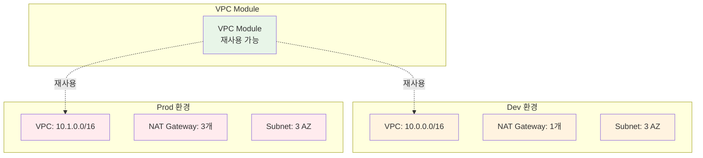

# November Week 3 Day 4: Module & 환경 관리

<div align="center">

**📦 Module** • **🌍 Workspace** • **🔄 환경 분리** • **📥 Import**

*재사용 가능한 인프라 코드 및 환경 관리 전략*

</div>

---

## 🕘 일일 스케줄

### 📊 시간 배분
```
09:00-09:40  Session 1: Module 작성 (40분)
09:40-09:50  휴식 (10분)
09:50-10:30  Session 2: Workspace & 환경 분리 (40분)
10:30-10:40  휴식 (10분)
10:40-11:20  Session 3: Data Source & Import (40분)
11:20-12:00  Lab: VPC Module + 환경 배포 (40분)
```

### 🗓️ 상세 스케줄
| 시간 | 구분 | 내용 | 목적 |
|------|------|------|------|
| **09:00-09:40** | 📚 이론 1 | Module 작성 (40분) | 재사용 가능한 코드 |
| **09:40-09:50** | ☕ 휴식 | 10분 휴식 | |
| **09:50-10:30** | 📚 이론 2 | Workspace & 환경 분리 (40분) | dev/prod 관리 |
| **10:30-10:40** | ☕ 휴식 | 10분 휴식 | |
| **10:40-11:20** | 📚 이론 3 | Data Source & Import (40분) | 기존 리소스 관리 |
| **11:20-12:00** | 🛠️ 실습 | VPC Module + 환경 배포 (40분) | 실전 적용 |

---

## 🎯 Day 4 목표

### 📚 학습 목표
- **Module**: 재사용 가능한 인프라 코드 작성
- **Workspace**: 환경별 State 분리
- **환경 분리**: dev/staging/prod 관리 전략
- **Import**: 기존 리소스 Terraform 관리

### 🛠️ 실무 역량
- 코드 재사용성 극대화
- 환경별 설정 분리
- 팀 협업 체계 구축
- 기존 인프라 코드화

---

## 📚 세션 구성

### Session 1: Module 작성 (09:00-09:40)
**주제**: 재사용 가능한 인프라 Module 작성

**핵심 내용**:
- Module 구조 (input, output, main)
- 재사용 가능한 인프라 코드
- Module 버전 관리
- Public Module 활용

**학습 포인트**:
- DRY (Don't Repeat Yourself) 원칙
- Module 설계 패턴
- 입력/출력 인터페이스
- 문서화 전략

**코드 예시**:
```hcl
# modules/vpc/variables.tf
variable "vpc_name" {
  description = "Name of the VPC"
  type        = string
}

variable "vpc_cidr" {
  description = "CIDR block for VPC"
  type        = string
  default     = "10.0.0.0/16"
}

variable "availability_zones" {
  description = "List of availability zones"
  type        = list(string)
}

variable "environment" {
  description = "Environment name (dev, staging, prod)"
  type        = string
}

# modules/vpc/main.tf
resource "aws_vpc" "main" {
  cidr_block           = var.vpc_cidr
  enable_dns_hostnames = true
  enable_dns_support   = true
  
  tags = {
    Name        = var.vpc_name
    Environment = var.environment
  }
}

resource "aws_subnet" "public" {
  count = length(var.availability_zones)
  
  vpc_id            = aws_vpc.main.id
  cidr_block        = cidrsubnet(var.vpc_cidr, 8, count.index)
  availability_zone = var.availability_zones[count.index]
  
  map_public_ip_on_launch = true
  
  tags = {
    Name        = "${var.vpc_name}-public-${count.index + 1}"
    Environment = var.environment
    Type        = "public"
  }
}

resource "aws_internet_gateway" "main" {
  vpc_id = aws_vpc.main.id
  
  tags = {
    Name        = "${var.vpc_name}-igw"
    Environment = var.environment
  }
}

# modules/vpc/outputs.tf
output "vpc_id" {
  description = "ID of the VPC"
  value       = aws_vpc.main.id
}

output "public_subnet_ids" {
  description = "IDs of public subnets"
  value       = aws_subnet.public[*].id
}

output "vpc_cidr" {
  description = "CIDR block of the VPC"
  value       = aws_vpc.main.cidr_block
}

# 루트 모듈에서 사용
module "vpc" {
  source = "./modules/vpc"
  
  vpc_name           = "my-vpc"
  vpc_cidr           = "10.0.0.0/16"
  availability_zones = ["ap-northeast-2a", "ap-northeast-2b", "ap-northeast-2c"]
  environment        = "dev"
}

# Module 출력 참조
output "vpc_id" {
  value = module.vpc.vpc_id
}
```

---

### Session 2: Workspace & 환경 분리 (09:50-10:30)
**주제**: Terraform Workspace로 환경 관리

**핵심 내용**:
- Workspace 개념
- 디렉토리 분리 전략
- tfvars 파일 활용
- dev/staging/prod 환경

**학습 포인트**:
- 환경별 State 분리
- 설정 파일 관리
- 환경 전환 방법
- 베스트 프랙티스

**코드 예시**:
```hcl
# Workspace 명령어
terraform workspace list
terraform workspace new dev
terraform workspace new prod
terraform workspace select dev

# main.tf - Workspace 활용
locals {
  environment = terraform.workspace
  
  # 환경별 설정
  instance_count = {
    dev  = 1
    prod = 3
  }
  
  instance_type = {
    dev  = "t3.micro"
    prod = "t3.medium"
  }
}

resource "aws_instance" "app" {
  count = local.instance_count[local.environment]
  
  ami           = data.aws_ami.amazon_linux_2.id
  instance_type = local.instance_type[local.environment]
  
  tags = {
    Name        = "app-${local.environment}-${count.index + 1}"
    Environment = local.environment
  }
}

# dev.tfvars
vpc_cidr           = "10.0.0.0/16"
instance_type      = "t3.micro"
enable_multi_az    = false
backup_retention   = 1

# prod.tfvars
vpc_cidr           = "10.1.0.0/16"
instance_type      = "t3.medium"
enable_multi_az    = true
backup_retention   = 7

# 환경별 배포
terraform apply -var-file="dev.tfvars"
terraform apply -var-file="prod.tfvars"
```

**디렉토리 분리 전략**:
```
environments/
├── dev/
│   ├── main.tf
│   ├── variables.tf
│   ├── terraform.tfvars
│   └── backend.tf
├── staging/
│   ├── main.tf
│   ├── variables.tf
│   ├── terraform.tfvars
│   └── backend.tf
└── prod/
    ├── main.tf
    ├── variables.tf
    ├── terraform.tfvars
    └── backend.tf

modules/
├── vpc/
├── ecs/
└── rds/
```

---

### Session 3: Data Source & Import (10:40-11:20)
**주제**: 기존 리소스 참조 및 Import

**핵심 내용**:
- 기존 리소스 참조
- terraform import
- 외부 데이터 통합
- AMI 자동 선택

**학습 포인트**:
- Data Source 활용
- 기존 인프라 관리
- 리소스 Import 전략
- 동적 데이터 참조

**코드 예시**:
```hcl
# Data Source - 최신 AMI 자동 선택
data "aws_ami" "amazon_linux_2" {
  most_recent = true
  owners      = ["amazon"]
  
  filter {
    name   = "name"
    values = ["amzn2-ami-hvm-*-x86_64-gp2"]
  }
  
  filter {
    name   = "virtualization-type"
    values = ["hvm"]
  }
}

# Data Source - 기존 VPC 참조
data "aws_vpc" "existing" {
  tags = {
    Name = "existing-vpc"
  }
}

# Data Source - 가용 영역 목록
data "aws_availability_zones" "available" {
  state = "available"
}

# Data Source 사용
resource "aws_instance" "app" {
  ami           = data.aws_ami.amazon_linux_2.id
  instance_type = "t3.micro"
  subnet_id     = data.aws_subnet.existing.id
}

# Terraform Import
# 1. 리소스 정의 작성
resource "aws_instance" "imported" {
  # 설정은 나중에 추가
}

# 2. Import 실행
terraform import aws_instance.imported i-1234567890abcdef0

# 3. terraform show로 현재 상태 확인
terraform show

# 4. 리소스 정의 완성
resource "aws_instance" "imported" {
  ami           = "ami-0c55b159cbfafe1f0"
  instance_type = "t3.micro"
  # ... 기타 설정
}
```

---

## 🛠️ 실습 (Lab 1)

### Lab 1: VPC Module 작성 + dev/prod 환경 배포
**시간**: 11:20-12:00 (40분)
**목표**: 재사용 가능한 VPC Module 및 환경 분리

**실습 내용**:
1. **VPC Module 작성**
   - Input: vpc_name, vpc_cidr, availability_zones
   - Output: vpc_id, subnet_ids
   - 재사용 가능한 구조

2. **환경별 배포**
   - dev 환경: NAT Gateway 1개
   - prod 환경: NAT Gateway 3개
   - tfvars 파일로 설정 분리

3. **기존 리소스 Import**
   - 수동 생성한 Security Group Import
   - terraform show로 확인
   - 코드 완성

4. **검증**
   - dev/prod 환경 전환
   - 리소스 차이 확인
   - Module 재사용 확인

**디렉토리 구조**:
```
lab1/
├── modules/
│   └── vpc/
│       ├── main.tf
│       ├── variables.tf
│       └── outputs.tf
├── environments/
│   ├── dev/
│   │   ├── main.tf
│   │   ├── variables.tf
│   │   └── dev.tfvars
│   └── prod/
│       ├── main.tf
│       ├── variables.tf
│       └── prod.tfvars
└── README.md
```

---

## 🏗️ Day 4 아키텍처

### Module 재사용 패턴


---

## 💰 예상 비용

### Day 4 리소스 비용
| 리소스 | 사양 | 시간당 | 실습 시간 | 예상 비용 |
|--------|------|--------|-----------|-----------|
| VPC (dev) | NAT Gateway 1개 | $0.045 | 1시간 | $0.045 |
| VPC (prod) | NAT Gateway 3개 | $0.135 | 1시간 | $0.135 |
| **합계 (dev만)** | | | | **$0.045** |
| **합계 (dev+prod)** | | | | **$0.180** |

### 비용 절감 팁
- 실습은 dev 환경만 배포
- prod는 terraform plan으로만 확인
- 실습 완료 후 즉시 destroy

---

## ✅ Day 4 체크리스트

### 이론 학습
- [ ] Module 구조 (input, output, main) 이해
- [ ] 재사용 가능한 코드 작성 방법
- [ ] Workspace 개념 및 활용
- [ ] 환경별 설정 분리 전략
- [ ] Data Source 활용 방법
- [ ] terraform import 사용법

### 실습 완료
- [ ] VPC Module 작성
- [ ] dev/prod 환경 분리
- [ ] tfvars 파일로 설정 관리
- [ ] 기존 리소스 Import
- [ ] Module 재사용 확인

### 실무 역량
- [ ] 코드 재사용성 극대화
- [ ] 환경 관리 전략 수립
- [ ] 팀 협업 체계 이해
- [ ] 기존 인프라 코드화

---

## 🔗 관련 자료

### 📖 Terraform 공식 문서
- [Modules](https://www.terraform.io/language/modules)
- [Workspaces](https://www.terraform.io/language/state/workspaces)
- [Data Sources](https://www.terraform.io/language/data-sources)
- [Import](https://www.terraform.io/cli/import)

### 🎯 다음 Day
- [Day 5: Remote State & Kubernetes 기초](../day5/README.md)

---

## 💡 Day 4 회고

### 🤝 학습 성과
1. **Module**: 재사용 가능한 인프라 코드
2. **환경 분리**: dev/prod 완전 분리
3. **Import**: 기존 인프라 관리
4. **협업**: 팀 협업 체계 이해

### 📊 다음 학습
- **Day 5**: Remote State, Kubernetes 기초
- **팀 협업**: S3 Backend, State Locking

---

<div align="center">

**📦 Module** • **🌍 Workspace** • **🔄 환경 분리** • **📥 Import** • **📝 Terraform**

*Day 4: 재사용 가능한 인프라 코드 및 환경 관리*

</div>
