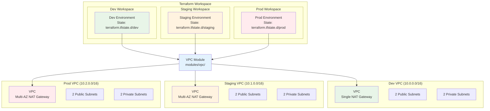

# November Week 3 Day 4 Lab 1: VPC Module 작성 및 Multi-Environment 배포

<div align="center">

**📦 Module** • **🌍 Workspace** • **📥 Data Source** • **🔄 Import**

*재사용 가능한 VPC Module로 dev/staging/prod 환경 구축*

</div>

---

## 🕘 Lab 정보
**시간**: 11:30-12:10 (40분)
**목표**: VPC Module 작성 및 Workspace로 다중 환경 배포
**방식**: Module 작성 → Workspace 활용 → Data Source 참조

## 🎯 학습 목표
- 재사용 가능한 VPC Module 작성
- Terraform Workspace로 환경 분리
- Data Source로 기존 리소스 참조
- Import로 수동 생성 리소스 관리 전환

---

## 🏗️ 구축할 아키텍처

### 📐 전체 구조



**핵심 포인트**:
- 하나의 Module 코드로 3개 환경 배포
- 각 환경은 독립적인 State 파일 관리
- 환경별 설정 차이 (NAT Gateway 개수, CIDR 블록)

### 🔗 참조 Session
**당일 Session**:
- [Session 1: Terraform Module](./session_1.md) - Module 구조, Input/Output
- [Session 2: Workspace & 환경 분리](./session_2.md) - Workspace 사용법
- [Session 3: Data Source & Import](./session_3.md) - 기존 리소스 참조

**이전 Day Session**:
- [Week 3 Day 2 Session 1: EC2 & ALB](../day2/session_1.md) - VPC 기초
- [Week 3 Day 1 Session 2: 프로그래밍 기술](../day1/session_2.md) - for_each, count

---

## 📁 프로젝트 구조

### 디렉토리 구성
```
nw3-day4-lab1/
├── main.tf                    # Root Module
├── variables.tf               # Root 변수
├── outputs.tf                 # Root 출력
├── terraform.tfvars           # 기본 변수 값
├── environments/              # 환경별 설정
│   ├── dev.tfvars
│   ├── staging.tfvars
│   └── prod.tfvars
└── modules/
    └── vpc/                   # VPC Module
        ├── main.tf            # VPC 리소스
        ├── variables.tf       # Module 입력
        ├── outputs.tf         # Module 출력
        └── README.md          # Module 문서
```

---

## 🛠️ Step 1: VPC Module 작성 (10분)

### 📋 이 단계에서 할 일
- VPC Module 디렉토리 생성
- Module 입력 변수 정의
- VPC 리소스 작성
- Module 출력 정의

### 🔗 참조 개념
- [Session 1: Terraform Module](./session_1.md) - Module 구조

### 📝 실습 절차

#### 1-1. 프로젝트 초기화
```bash
mkdir -p ~/terraform/nw3-day4-lab1/modules/vpc
cd ~/terraform/nw3-day4-lab1
```

#### 1-2. Module 변수 정의 (modules/vpc/variables.tf)
```hcl
# modules/vpc/variables.tf

variable "project_name" {
  description = "Project name for resource naming"
  type        = string
}

variable "environment" {
  description = "Environment name (dev, staging, prod)"
  type        = string
}

variable "vpc_cidr" {
  description = "VPC CIDR block"
  type        = string
}

variable "availability_zones" {
  description = "List of availability zones"
  type        = list(string)
}

variable "enable_nat_gateway" {
  description = "Enable NAT Gateway for private subnets"
  type        = bool
  default     = true
}

variable "single_nat_gateway" {
  description = "Use single NAT Gateway for all AZs (cost optimization)"
  type        = bool
  default     = true
}

variable "tags" {
  description = "Additional tags"
  type        = map(string)
  default     = {}
}
```

#### 1-3. VPC 리소스 작성 (modules/vpc/main.tf)
```hcl
# modules/vpc/main.tf

# VPC
resource "aws_vpc" "main" {
  cidr_block           = var.vpc_cidr
  enable_dns_hostnames = true
  enable_dns_support   = true
  
  tags = merge(
    {
      Name        = "${var.project_name}-${var.environment}-vpc"
      Environment = var.environment
    },
    var.tags
  )
}

# Internet Gateway
resource "aws_internet_gateway" "main" {
  vpc_id = aws_vpc.main.id
  
  tags = merge(
    {
      Name        = "${var.project_name}-${var.environment}-igw"
      Environment = var.environment
    },
    var.tags
  )
}

# Public Subnets
resource "aws_subnet" "public" {
  count                   = length(var.availability_zones)
  vpc_id                  = aws_vpc.main.id
  cidr_block              = cidrsubnet(var.vpc_cidr, 8, count.index + 1)
  availability_zone       = var.availability_zones[count.index]
  map_public_ip_on_launch = true
  
  tags = merge(
    {
      Name        = "${var.project_name}-${var.environment}-public-${var.availability_zones[count.index]}"
      Environment = var.environment
      Type        = "Public"
    },
    var.tags
  )
}

# Private Subnets
resource "aws_subnet" "private" {
  count             = length(var.availability_zones)
  vpc_id            = aws_vpc.main.id
  cidr_block        = cidrsubnet(var.vpc_cidr, 8, count.index + 11)
  availability_zone = var.availability_zones[count.index]
  
  tags = merge(
    {
      Name        = "${var.project_name}-${var.environment}-private-${var.availability_zones[count.index]}"
      Environment = var.environment
      Type        = "Private"
    },
    var.tags
  )
}

# Elastic IP for NAT Gateway
resource "aws_eip" "nat" {
  count  = var.enable_nat_gateway ? (var.single_nat_gateway ? 1 : length(var.availability_zones)) : 0
  domain = "vpc"
  
  tags = merge(
    {
      Name        = "${var.project_name}-${var.environment}-nat-eip-${count.index + 1}"
      Environment = var.environment
    },
    var.tags
  )
  
  depends_on = [aws_internet_gateway.main]
}

# NAT Gateway
resource "aws_nat_gateway" "main" {
  count         = var.enable_nat_gateway ? (var.single_nat_gateway ? 1 : length(var.availability_zones)) : 0
  allocation_id = aws_eip.nat[count.index].id
  subnet_id     = aws_subnet.public[count.index].id
  
  tags = merge(
    {
      Name        = "${var.project_name}-${var.environment}-nat-gw-${count.index + 1}"
      Environment = var.environment
    },
    var.tags
  )
  
  depends_on = [aws_internet_gateway.main]
}

# Public Route Table
resource "aws_route_table" "public" {
  vpc_id = aws_vpc.main.id
  
  route {
    cidr_block = "0.0.0.0/0"
    gateway_id = aws_internet_gateway.main.id
  }
  
  tags = merge(
    {
      Name        = "${var.project_name}-${var.environment}-public-rt"
      Environment = var.environment
    },
    var.tags
  )
}

# Private Route Tables
resource "aws_route_table" "private" {
  count  = var.enable_nat_gateway ? length(var.availability_zones) : 1
  vpc_id = aws_vpc.main.id
  
  dynamic "route" {
    for_each = var.enable_nat_gateway ? [1] : []
    content {
      cidr_block     = "0.0.0.0/0"
      nat_gateway_id = var.single_nat_gateway ? aws_nat_gateway.main[0].id : aws_nat_gateway.main[count.index].id
    }
  }
  
  tags = merge(
    {
      Name        = "${var.project_name}-${var.environment}-private-rt-${count.index + 1}"
      Environment = var.environment
    },
    var.tags
  )
}

# Public Subnet Route Table Association
resource "aws_route_table_association" "public" {
  count          = length(aws_subnet.public)
  subnet_id      = aws_subnet.public[count.index].id
  route_table_id = aws_route_table.public.id
}

# Private Subnet Route Table Association
resource "aws_route_table_association" "private" {
  count          = length(aws_subnet.private)
  subnet_id      = aws_subnet.private[count.index].id
  route_table_id = var.enable_nat_gateway ? (var.single_nat_gateway ? aws_route_table.private[0].id : aws_route_table.private[count.index].id) : aws_route_table.private[0].id
}
```

#### 1-4. Module 출력 정의 (modules/vpc/outputs.tf)
```hcl
# modules/vpc/outputs.tf

output "vpc_id" {
  description = "VPC ID"
  value       = aws_vpc.main.id
}

output "vpc_cidr" {
  description = "VPC CIDR block"
  value       = aws_vpc.main.cidr_block
}

output "public_subnet_ids" {
  description = "List of public subnet IDs"
  value       = aws_subnet.public[*].id
}

output "private_subnet_ids" {
  description = "List of private subnet IDs"
  value       = aws_subnet.private[*].id
}

output "public_subnet_cidrs" {
  description = "List of public subnet CIDR blocks"
  value       = aws_subnet.public[*].cidr_block
}

output "private_subnet_cidrs" {
  description = "List of private subnet CIDR blocks"
  value       = aws_subnet.private[*].cidr_block
}

output "nat_gateway_ids" {
  description = "List of NAT Gateway IDs"
  value       = aws_nat_gateway.main[*].id
}

output "internet_gateway_id" {
  description = "Internet Gateway ID"
  value       = aws_internet_gateway.main.id
}
```

#### 1-5. Module 문서 작성 (modules/vpc/README.md)
```markdown
# VPC Module

재사용 가능한 VPC Module

## 기능
- Multi-AZ VPC 생성
- Public/Private Subnet 자동 생성
- NAT Gateway (Single/Multi 선택 가능)
- Internet Gateway
- Route Tables 자동 구성

## 사용 예시
\`\`\`hcl
module "vpc" {
  source = "./modules/vpc"
  
  project_name       = "my-project"
  environment        = "dev"
  vpc_cidr           = "10.0.0.0/16"
  availability_zones = ["ap-northeast-2a", "ap-northeast-2b"]
  
  enable_nat_gateway  = true
  single_nat_gateway  = true  # 비용 절감
}
\`\`\`

## Inputs
| Name | Description | Type | Default | Required |
|------|-------------|------|---------|----------|
| project_name | Project name | string | - | yes |
| environment | Environment name | string | - | yes |
| vpc_cidr | VPC CIDR block | string | - | yes |
| availability_zones | List of AZs | list(string) | - | yes |
| enable_nat_gateway | Enable NAT Gateway | bool | true | no |
| single_nat_gateway | Use single NAT GW | bool | true | no |

## Outputs
| Name | Description |
|------|-------------|
| vpc_id | VPC ID |
| public_subnet_ids | Public subnet IDs |
| private_subnet_ids | Private subnet IDs |
```

### ✅ Step 1 검증
- [ ] modules/vpc/ 디렉토리 생성
- [ ] variables.tf 작성 완료
- [ ] main.tf 작성 완료
- [ ] outputs.tf 작성 완료
- [ ] README.md 작성 완료

---

## 🛠️ Step 2: Root Module 및 환경별 설정 (5분)

### 📋 이 단계에서 할 일
- Root Module 작성
- 환경별 tfvars 파일 생성
- Provider 설정

### 🔗 참조 개념
- [Session 2: Workspace & 환경 분리](./session_2.md) - tfvars 활용

### 📝 실습 절차

#### 2-1. Provider 설정 (main.tf)
```hcl
# main.tf
terraform {
  required_version = ">= 1.0"
  
  required_providers {
    aws = {
      source  = "hashicorp/aws"
      version = "~> 5.0"
    }
  }
}

provider "aws" {
  region = var.aws_region
  
  default_tags {
    tags = {
      Project     = var.project_name
      Environment = var.environment
      ManagedBy   = "Terraform"
      Workspace   = terraform.workspace
    }
  }
}

# VPC Module 사용
module "vpc" {
  source = "./modules/vpc"
  
  project_name       = var.project_name
  environment        = var.environment
  vpc_cidr           = var.vpc_cidr
  availability_zones = var.availability_zones
  
  enable_nat_gateway = var.enable_nat_gateway
  single_nat_gateway = var.single_nat_gateway
  
  tags = var.tags
}
```

#### 2-2. Root 변수 정의 (variables.tf)
```hcl
# variables.tf
variable "aws_region" {
  description = "AWS Region"
  type        = string
  default     = "ap-northeast-2"
}

variable "project_name" {
  description = "Project name"
  type        = string
  default     = "nw3-day4-lab1"
}

variable "environment" {
  description = "Environment name"
  type        = string
}

variable "vpc_cidr" {
  description = "VPC CIDR block"
  type        = string
}

variable "availability_zones" {
  description = "Availability Zones"
  type        = list(string)
  default     = ["ap-northeast-2a", "ap-northeast-2b"]
}

variable "enable_nat_gateway" {
  description = "Enable NAT Gateway"
  type        = bool
  default     = true
}

variable "single_nat_gateway" {
  description = "Use single NAT Gateway"
  type        = bool
  default     = true
}

variable "tags" {
  description = "Additional tags"
  type        = map(string)
  default     = {}
}
```

#### 2-3. Root 출력 정의 (outputs.tf)
```hcl
# outputs.tf
output "workspace" {
  description = "Current workspace"
  value       = terraform.workspace
}

output "environment" {
  description = "Environment name"
  value       = var.environment
}

output "vpc_id" {
  description = "VPC ID"
  value       = module.vpc.vpc_id
}

output "vpc_cidr" {
  description = "VPC CIDR"
  value       = module.vpc.vpc_cidr
}

output "public_subnet_ids" {
  description = "Public subnet IDs"
  value       = module.vpc.public_subnet_ids
}

output "private_subnet_ids" {
  description = "Private subnet IDs"
  value       = module.vpc.private_subnet_ids
}
```

#### 2-4. 환경별 설정 파일 생성
```bash
mkdir -p environments

# Dev 환경 (비용 최소화)
cat > environments/dev.tfvars <<'EOF'
environment        = "dev"
vpc_cidr           = "10.0.0.0/16"
enable_nat_gateway = true
single_nat_gateway = true  # 비용 절감

tags = {
  CostCenter = "Development"
  Owner      = "DevTeam"
}
EOF

# Staging 환경 (프로덕션 유사)
cat > environments/staging.tfvars <<'EOF'
environment        = "staging"
vpc_cidr           = "10.1.0.0/16"
enable_nat_gateway = true
single_nat_gateway = false  # Multi-AZ NAT

tags = {
  CostCenter = "Staging"
  Owner      = "QATeam"
}
EOF

# Production 환경 (고가용성)
cat > environments/prod.tfvars <<'EOF'
environment        = "prod"
vpc_cidr           = "10.2.0.0/16"
enable_nat_gateway = true
single_nat_gateway = false  # Multi-AZ NAT

tags = {
  CostCenter = "Production"
  Owner      = "OpsTeam"
  Compliance = "Required"
}
EOF
```

### ✅ Step 2 검증
- [ ] main.tf 작성 완료
- [ ] variables.tf 작성 완료
- [ ] outputs.tf 작성 완료
- [ ] environments/*.tfvars 생성 완료

---

## 🛠️ Step 3: Workspace로 다중 환경 배포 (15분)

### 📋 이 단계에서 할 일
- Terraform 초기화
- Workspace 생성 및 전환
- 환경별 VPC 배포

### 🔗 참조 개념
- [Session 2: Workspace & 환경 분리](./session_2.md) - Workspace 명령어

### 📝 실습 절차

#### 3-1. Terraform 초기화
```bash
terraform init
```

**예상 결과**:
```
Initializing modules...
- vpc in modules/vpc

Initializing the backend...
Initializing provider plugins...
- Finding hashicorp/aws versions matching "~> 5.0"...

Terraform has been successfully initialized!
```

#### 3-2. Dev 환경 배포
```bash
# Dev workspace 생성 및 전환
terraform workspace new dev
terraform workspace select dev

# Plan 확인
terraform plan -var-file=environments/dev.tfvars

# 배포
terraform apply -var-file=environments/dev.tfvars -auto-approve
```

**예상 결과**:
```
Apply complete! Resources: 15 added, 0 changed, 0 destroyed.

Outputs:
workspace = "dev"
environment = "dev"
vpc_id = "vpc-xxxxx"
vpc_cidr = "10.0.0.0/16"
public_subnet_ids = ["subnet-xxxxx", "subnet-yyyyy"]
private_subnet_ids = ["subnet-zzzzz", "subnet-wwwww"]
```

#### 3-3. Staging 환경 배포
```bash
# Staging workspace 생성 및 전환
terraform workspace new staging
terraform workspace select staging

# 배포
terraform apply -var-file=environments/staging.tfvars -auto-approve
```

**예상 결과**:
```
Apply complete! Resources: 17 added, 0 changed, 0 destroyed.

Outputs:
workspace = "staging"
environment = "staging"
vpc_id = "vpc-aaaaa"
vpc_cidr = "10.1.0.0/16"
```

#### 3-4. Production 환경 배포
```bash
# Prod workspace 생성 및 전환
terraform workspace new prod
terraform workspace select prod

# 배포
terraform apply -var-file=environments/prod.tfvars -auto-approve
```

**예상 결과**:
```
Apply complete! Resources: 17 added, 0 changed, 0 destroyed.

Outputs:
workspace = "prod"
environment = "prod"
vpc_id = "vpc-bbbbb"
vpc_cidr = "10.2.0.0/16"
```

#### 3-5. Workspace 확인
```bash
# 모든 workspace 목록
terraform workspace list

# 현재 workspace
terraform workspace show

# Workspace 전환
terraform workspace select dev
```

**예상 결과**:
```
  default
* dev
  staging
  prod
```

### ✅ Step 3 검증
```bash
# 각 환경의 VPC 확인
for env in dev staging prod; do
  echo "=== $env Environment ==="
  aws ec2 describe-vpcs \
    --filters "Name=tag:Environment,Values=$env" \
    --query 'Vpcs[0].[VpcId,CidrBlock,Tags[?Key==`Name`].Value|[0]]' \
    --output table
  echo ""
done
```

**체크리스트**:
- [ ] 3개 Workspace 생성 (dev, staging, prod)
- [ ] 각 환경별 VPC 배포 완료
- [ ] 각 환경의 CIDR 블록 다름 확인
- [ ] NAT Gateway 개수 확인 (dev: 1개, staging/prod: 2개)

---

## 🛠️ Step 4: Data Source로 VPC 정보 참조 (5분)

### 📋 이 단계에서 할 일
- Data Source로 배포된 VPC 정보 조회
- 다른 프로젝트에서 VPC 참조하는 패턴 학습

### 🔗 참조 개념
- [Session 3: Data Source & Import](./session_3.md) - Data Source 활용

### 📝 실습 절차

#### 4-1. Data Source 예시 파일 생성 (data-source-example.tf)
```hcl
# data-source-example.tf
# 다른 프로젝트에서 이 VPC를 참조하는 예시

# 현재 환경의 VPC 조회
data "aws_vpc" "selected" {
  filter {
    name   = "tag:Project"
    values = [var.project_name]
  }
  
  filter {
    name   = "tag:Environment"
    values = [var.environment]
  }
}

# VPC의 Public Subnet 조회
data "aws_subnets" "public" {
  filter {
    name   = "vpc-id"
    values = [data.aws_vpc.selected.id]
  }
  
  filter {
    name   = "tag:Type"
    values = ["Public"]
  }
}

# VPC의 Private Subnet 조회
data "aws_subnets" "private" {
  filter {
    name   = "vpc-id"
    values = [data.aws_vpc.selected.id]
  }
  
  filter {
    name   = "tag:Type"
    values = ["Private"]
  }
}

# 조회한 정보 출력
output "data_source_vpc_id" {
  description = "VPC ID from data source"
  value       = data.aws_vpc.selected.id
}

output "data_source_public_subnets" {
  description = "Public subnet IDs from data source"
  value       = data.aws_subnets.public.ids
}

output "data_source_private_subnets" {
  description = "Private subnet IDs from data source"
  value       = data.aws_subnets.private.ids
}
```

#### 4-2. Data Source 테스트
```bash
# Dev 환경에서 테스트
terraform workspace select dev

# Plan으로 Data Source 확인
terraform plan -var-file=environments/dev.tfvars

# Apply (변경 없음, Data Source만 조회)
terraform apply -var-file=environments/dev.tfvars -auto-approve
```

**예상 결과**:
```
Apply complete! Resources: 0 added, 0 changed, 0 destroyed.

Outputs:
data_source_vpc_id = "vpc-xxxxx"
data_source_public_subnets = ["subnet-xxxxx", "subnet-yyyyy"]
data_source_private_subnets = ["subnet-zzzzz", "subnet-wwwww"]
```

#### 4-3. 다른 프로젝트에서 사용하는 예시
```hcl
# 예시: EC2 인스턴스를 이 VPC에 배포
# (실제 배포하지 않고 코드만 확인)

# 기존 VPC 참조
data "aws_vpc" "main" {
  filter {
    name   = "tag:Project"
    values = ["nw3-day4-lab1"]
  }
  
  filter {
    name   = "tag:Environment"
    values = ["dev"]
  }
}

# 기존 Public Subnet 참조
data "aws_subnets" "public" {
  filter {
    name   = "vpc-id"
    values = [data.aws_vpc.main.id]
  }
  
  filter {
    name   = "tag:Type"
    values = ["Public"]
  }
}

# EC2 인스턴스 배포 (예시)
resource "aws_instance" "web" {
  ami           = "ami-xxxxx"
  instance_type = "t3.micro"
  
  # Data Source로 조회한 Subnet 사용
  subnet_id = data.aws_subnets.public.ids[0]
  
  # Data Source로 조회한 VPC의 Security Group 사용
  vpc_security_group_ids = [aws_security_group.web.id]
  
  tags = {
    Name = "web-server"
  }
}

# Security Group도 Data Source로 조회한 VPC에 생성
resource "aws_security_group" "web" {
  name        = "web-sg"
  description = "Security group for web server"
  vpc_id      = data.aws_vpc.main.id  # Data Source 사용
  
  ingress {
    from_port   = 80
    to_port     = 80
    protocol    = "tcp"
    cidr_blocks = ["0.0.0.0/0"]
  }
}
```

### ✅ Step 4 검증
```bash
# Data Source 출력 확인
terraform output data_source_vpc_id
terraform output data_source_public_subnets
terraform output data_source_private_subnets
```

**체크리스트**:
- [ ] Data Source로 VPC 조회 성공
- [ ] Public/Private Subnet 조회 성공
- [ ] 다른 프로젝트에서 참조하는 패턴 이해

---

## 🛠️ Step 5: 전체 시스템 검증 (5분)

### 📋 검증 항목
- 3개 환경 모두 정상 배포 확인
- Workspace별 State 분리 확인
- Module 재사용 확인

### 📝 검증 절차

#### 5-1. 전체 환경 확인
```bash
# 모든 환경의 VPC 목록
echo "=== All VPCs ==="
aws ec2 describe-vpcs \
  --filters "Name=tag:Project,Values=nw3-day4-lab1" \
  --query 'Vpcs[].[Tags[?Key==`Environment`].Value|[0],VpcId,CidrBlock]' \
  --output table

# 각 환경의 리소스 개수
for env in dev staging prod; do
  echo "=== $env Environment Resources ==="
  terraform workspace select $env
  terraform state list | wc -l
  echo ""
done
```

#### 5-2. Workspace State 파일 확인
```bash
# State 파일 위치 확인
ls -la terraform.tfstate.d/

# 각 Workspace의 State 파일
ls -la terraform.tfstate.d/dev/
ls -la terraform.tfstate.d/staging/
ls -la terraform.tfstate.d/prod/
```

**예상 결과**:
```
terraform.tfstate.d/
├── dev/
│   └── terraform.tfstate
├── staging/
│   └── terraform.tfstate
└── prod/
    └── terraform.tfstate
```

#### 5-3. Module 재사용 확인
```bash
# 각 환경에서 동일한 Module 사용 확인
for env in dev staging prod; do
  echo "=== $env Environment ==="
  terraform workspace select $env
  terraform state list | grep "module.vpc"
  echo ""
done
```

**예상 결과**:
```
=== dev Environment ===
module.vpc.aws_vpc.main
module.vpc.aws_internet_gateway.main
module.vpc.aws_subnet.public[0]
module.vpc.aws_subnet.public[1]
...

=== staging Environment ===
module.vpc.aws_vpc.main
module.vpc.aws_internet_gateway.main
...
```

### ✅ 전체 검증 체크리스트
- [ ] 3개 환경 모두 VPC 배포 완료
- [ ] 각 환경의 CIDR 블록 다름 (10.0.0.0/16, 10.1.0.0/16, 10.2.0.0/16)
- [ ] Dev: NAT Gateway 1개, Staging/Prod: NAT Gateway 2개
- [ ] Workspace별 State 파일 분리 확인
- [ ] 동일한 Module 코드로 3개 환경 배포 확인

---

## 🧹 리소스 정리 (필수!)

### ⚠️ 중요: 환경별로 순서대로 삭제

```bash
# Dev 환경 삭제
terraform workspace select dev
terraform destroy -var-file=environments/dev.tfvars -auto-approve

# Staging 환경 삭제
terraform workspace select staging
terraform destroy -var-file=environments/staging.tfvars -auto-approve

# Prod 환경 삭제
terraform workspace select prod
terraform destroy -var-file=environments/prod.tfvars -auto-approve

# Default workspace로 전환
terraform workspace select default

# Workspace 삭제
terraform workspace delete dev
terraform workspace delete staging
terraform workspace delete prod
```

### ✅ 정리 완료 확인
```bash
# VPC 모두 삭제 확인
aws ec2 describe-vpcs \
  --filters "Name=tag:Project,Values=nw3-day4-lab1" \
  --query 'Vpcs[].VpcId'

# 예상 결과: []
```

---

## 💰 비용 확인

### 예상 비용 (3개 환경 동시 실행 시)
| 환경 | NAT Gateway | 시간당 비용 | 40분 비용 |
|------|-------------|-------------|-----------|
| Dev | 1개 | $0.059 | $0.039 |
| Staging | 2개 | $0.118 | $0.079 |
| Prod | 2개 | $0.118 | $0.079 |
| **합계** | **5개** | **$0.295** | **$0.197** |

**💡 비용 절감 팁**:
- Dev 환경은 `single_nat_gateway = true`로 비용 절감
- 실습 완료 후 즉시 삭제
- 필요한 환경만 배포 (예: Dev만 배포)

---

## 🔍 트러블슈팅

### 문제 1: Workspace 전환 시 리소스가 보이지 않음
**증상**:
```bash
terraform workspace select dev
terraform state list
# 아무것도 출력되지 않음
```

**원인**:
- 잘못된 Workspace에서 작업 중

**해결 방법**:
```bash
# 현재 Workspace 확인
terraform workspace show

# 올바른 Workspace로 전환
terraform workspace select dev

# State 확인
terraform state list
```

### 문제 2: Module을 찾을 수 없음
**증상**:
```
Error: Module not found
```

**원인**:
- Module 경로가 잘못됨
- `terraform init` 실행 안 함

**해결 방법**:
```bash
# Module 경로 확인
ls -la modules/vpc/

# Terraform 재초기화
terraform init
```

### 문제 3: 환경별 설정이 적용되지 않음
**증상**:
- 모든 환경이 동일한 CIDR 사용

**원인**:
- tfvars 파일을 지정하지 않음

**해결 방법**:
```bash
# 반드시 -var-file 옵션 사용
terraform apply -var-file=environments/dev.tfvars
```

---

## 💡 Lab 회고

### 🤝 페어 회고 (5분)
1. **Module의 장점**: 코드 재사용으로 어떤 이점이 있었나요?
2. **Workspace 활용**: 환경 분리가 왜 중요한가요?
3. **Data Source**: 다른 프로젝트와 리소스를 공유하는 방법은?
4. **실무 적용**: 실제 프로젝트에서 어떻게 활용할 수 있을까요?

### 📊 학습 성과
- **Module 작성**: 재사용 가능한 VPC Module 완성
- **환경 분리**: Workspace로 dev/staging/prod 관리
- **Data Source**: 기존 리소스 참조 방법 습득
- **실무 패턴**: 프로덕션급 인프라 관리 전략 이해

### 🎯 다음 Lab 준비
- **Lab 2**: Remote State & Backend 설정
- **연계 내용**: 팀 협업을 위한 State 공유

---

## 🔗 관련 자료

### 📚 Session 복습
- [Session 1: Terraform Module](./session_1.md)
- [Session 2: Workspace & 환경 분리](./session_2.md)
- [Session 3: Data Source & Import](./session_3.md)

### 📖 Terraform 공식 문서
- [Modules](https://www.terraform.io/docs/language/modules/index.html)
- [Workspaces](https://www.terraform.io/docs/language/state/workspaces.html)
- [Data Sources](https://www.terraform.io/docs/language/data-sources/index.html)

### 🎯 다음 학습
- [Day 5: Remote State & GitOps](../day5/README.md)

---

<div align="center">

**✅ Lab 완료** • **🧹 리소스 정리 필수** • **💰 비용 확인**

*Module과 Workspace로 효율적인 인프라 관리*

</div>
