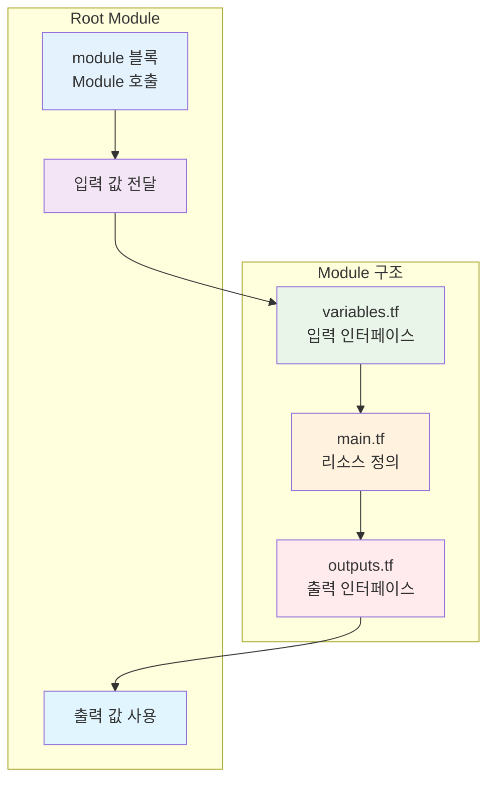

# November Week 3 Day 4 Session 1: Terraform Module

<div align="center">

**📦 재사용성** • **🔧 모듈화** • **🏗️ 인프라 컴포넌트**

*DRY 원칙으로 인프라 코드 재사용*

</div>

---

## 🕘 세션 정보
**시간**: 09:00-09:40 (40분)
**목표**: 재사용 가능한 Terraform Module 작성 방법 습득
**방식**: 이론 학습 + 코드 예시

## 🎯 학습 목표
- Terraform Module의 필요성과 구조 이해
- Input/Output 인터페이스 설계 방법
- Module 버전 관리 및 재사용 전략
- Public Module 활용 및 Private Module 작성

---

## 📖 서비스 개요

### 1. 생성 배경 (Why?) - 5분

**문제 상황**:
- **코드 중복**: 동일한 인프라 패턴을 여러 프로젝트에서 반복 작성
  ```hcl
  # 프로젝트 A
  resource "aws_vpc" "main" {
    cidr_block = "10.0.0.0/16"
    # ... 50줄의 설정
  }
  
  # 프로젝트 B
  resource "aws_vpc" "main" {
    cidr_block = "10.1.0.0/16"
    # ... 동일한 50줄의 설정 복사
  }
  ```

- **유지보수 어려움**: 한 곳을 수정하면 모든 곳을 수정해야 함
- **일관성 부족**: 팀원마다 다른 방식으로 인프라 구성
- **베스트 프랙티스 공유 어려움**: 검증된 패턴을 팀 전체에 적용하기 어려움

**Terraform Module 솔루션**:
- **DRY (Don't Repeat Yourself)**: 한 번 작성하고 여러 곳에서 재사용
- **캡슐화**: 복잡한 인프라를 간단한 인터페이스로 추상화
- **표준화**: 조직 전체에 일관된 인프라 패턴 적용
- **협업 강화**: 검증된 Module을 팀 전체가 공유

### 2. 핵심 원리 (How?) - 10분

**Module 작동 원리**:



**Module 구조**:
```
modules/vpc/
├── main.tf          # 리소스 정의
├── variables.tf     # 입력 변수
├── outputs.tf       # 출력 값
├── README.md        # 문서
└── versions.tf      # Provider 버전
```

**기본 예시**:
```hcl
# modules/vpc/variables.tf
variable "vpc_name" {
  description = "Name of the VPC"
  type        = string
}

variable "vpc_cidr" {
  description = "CIDR block for VPC"
  type        = string
  default     = "10.0.0.0/16"
}

variable "enable_nat_gateway" {
  description = "Enable NAT Gateway"
  type        = bool
  default     = true
}

# modules/vpc/main.tf
resource "aws_vpc" "main" {
  cidr_block           = var.vpc_cidr
  enable_dns_hostnames = true
  enable_dns_support   = true
  
  tags = {
    Name = var.vpc_name
  }
}

resource "aws_subnet" "public" {
  count = 3
  
  vpc_id            = aws_vpc.main.id
  cidr_block        = cidrsubnet(var.vpc_cidr, 8, count.index)
  availability_zone = data.aws_availability_zones.available.names[count.index]
  
  tags = {
    Name = "${var.vpc_name}-public-${count.index + 1}"
  }
}

# modules/vpc/outputs.tf
output "vpc_id" {
  description = "ID of the VPC"
  value       = aws_vpc.main.id
}

output "public_subnet_ids" {
  description = "IDs of public subnets"
  value       = aws_subnet.public[*].id
}

# Root Module에서 사용
module "vpc" {
  source = "./modules/vpc"
  
  vpc_name           = "my-vpc"
  vpc_cidr           = "10.0.0.0/16"
  enable_nat_gateway = true
}

# Module 출력 사용
output "vpc_id" {
  value = module.vpc.vpc_id
}
```

### 3. 주요 사용 사례 (When?) - 5분

**적합한 경우**:

1. **반복되는 인프라 패턴**
   - VPC 네트워크 구성
   - ECS 클러스터 + ALB + Auto Scaling
   - RDS + ElastiCache + Backup

2. **조직 표준 인프라**
   - 보안 정책이 적용된 S3 버킷
   - 로깅이 활성화된 ALB
   - 암호화된 RDS 인스턴스

3. **멀티 환경 배포**
   - dev/staging/prod 동일 구조
   - 리전별 동일 인프라
   - 고객별 격리된 환경

**실제 사례**:
- **Netflix**: 수백 개의 마이크로서비스를 Module로 표준화
- **Airbnb**: 글로벌 리전별 동일 인프라를 Module로 관리
- **Slack**: 보안 정책이 적용된 Module을 조직 전체에 배포

### 4. 비슷한 서비스 비교 (Which?) - 5분

**Terraform 내 대안**:

**Module vs Copy-Paste**:
- 언제 Copy-Paste 사용: 일회성 인프라, 프로토타입
- 언제 Module 사용: 반복 사용, 표준화 필요, 팀 협업

**Local Module vs Remote Module**:
- 언제 Local Module 사용: 프로젝트 전용, 빠른 개발
- 언제 Remote Module 사용: 조직 공유, 버전 관리, 재사용

**Public Module vs Private Module**:
- 언제 Public Module 사용: 검증된 패턴, 빠른 시작
- 언제 Private Module 사용: 조직 특화, 보안 요구사항

**선택 기준**:
| 기준 | Copy-Paste | Local Module | Remote Module |
|------|------------|--------------|---------------|
| 재사용성 | ❌ 낮음 | ✅ 중간 | ✅✅ 높음 |
| 유지보수 | ❌ 어려움 | ✅ 보통 | ✅✅ 쉬움 |
| 버전 관리 | ❌ 불가 | ⚠️ 제한적 | ✅✅ 완벽 |
| 팀 협업 | ❌ 어려움 | ⚠️ 제한적 | ✅✅ 쉬움 |
| 초기 비용 | ✅ 낮음 | ⚠️ 중간 | ❌ 높음 |

### 5. 장단점 분석 - 3분

**장점**:
- ✅ **코드 재사용**: DRY 원칙으로 중복 제거
- ✅ **유지보수 용이**: 한 곳만 수정하면 모든 곳에 적용
- ✅ **일관성**: 조직 전체에 표준 패턴 적용
- ✅ **추상화**: 복잡한 인프라를 간단한 인터페이스로
- ✅ **테스트 가능**: Module 단위로 테스트 및 검증

**단점/제약사항**:
- ⚠️ **초기 비용**: Module 설계 및 작성에 시간 투자 필요
- ⚠️ **과도한 추상화**: 너무 범용적이면 오히려 복잡해짐
- ⚠️ **버전 관리**: Remote Module은 버전 관리 필요
- ⚠️ **학습 곡선**: Module 구조와 사용법 학습 필요

**대안**:
- 간단한 인프라: Copy-Paste로 시작
- 복잡도 증가 시: Local Module로 전환
- 조직 표준화: Remote Module로 발전

### 6. 비용 구조 💰 - 5분

**과금 방식**:
- **Terraform Module 자체**: 무료 (오픈소스)
- **생성되는 AWS 리소스**: 리소스별 과금
- **Terraform Cloud/Enterprise**: Module Registry 사용 시 유료

**프리티어 혜택**:
- Terraform OSS: 완전 무료
- Terraform Cloud: 무료 티어 (5명까지)
- Public Module: 무료 사용

**비용 최적화 팁**:
1. **Module로 비용 절감**:
   - Spot Instance 사용 Module
   - Reserved Instance 관리 Module
   - 리소스 태깅 자동화 Module

2. **환경별 리소스 최적화**:
   ```hcl
   variable "environment" {
     type = string
   }
   
   locals {
     instance_count = var.environment == "prod" ? 3 : 1
     instance_type  = var.environment == "prod" ? "t3.medium" : "t3.micro"
   }
   ```

3. **자동 정리 Module**:
   - 개발 환경 자동 종료
   - 미사용 리소스 탐지
   - 비용 알림 설정

**예상 비용 (Module 사용 vs 미사용)**:
| 항목 | Module 미사용 | Module 사용 | 절감 |
|------|---------------|-------------|------|
| 개발 시간 | 40시간 | 10시간 | 75% |
| 유지보수 | 월 20시간 | 월 5시간 | 75% |
| 오류 비용 | $500/월 | $50/월 | 90% |

### 7. 최신 업데이트 🆕 - 2분

**2024년 주요 변경사항**:
- **Terraform 1.6+**: Module 테스트 프레임워크 추가
- **Module Composition**: 중첩 Module 성능 개선
- **Provider 버전 관리**: Module별 Provider 버전 지정 개선

**2025년 예정**:
- **AI 기반 Module 추천**: 사용 패턴 분석으로 Module 추천
- **자동 문서 생성**: Module 코드에서 문서 자동 생성
- **보안 스캔 통합**: Module 배포 전 자동 보안 검사

**Deprecated 기능**:
- **Legacy Module 구조**: Terraform 0.11 이전 Module 구조 지원 종료 예정

**참조**: [Terraform Modules Documentation](https://www.terraform.io/language/modules)

### 8. 잘 사용하는 방법 ✅ - 3분

**베스트 프랙티스**:

1. **명확한 인터페이스**:
   ```hcl
   variable "vpc_name" {
     description = "Name of the VPC (used for tagging)"
     type        = string
     
     validation {
       condition     = length(var.vpc_name) > 0
       error_message = "VPC name must not be empty"
     }
   }
   ```

2. **합리적인 기본값**:
   ```hcl
   variable "enable_nat_gateway" {
     description = "Enable NAT Gateway for private subnets"
     type        = bool
     default     = true  # 프로덕션 환경 기본값
   }
   ```

3. **완전한 문서화**:
   ```hcl
   # README.md
   ## Usage
   
   module "vpc" {
     source = "./modules/vpc"
     
     vpc_name = "my-vpc"
     vpc_cidr = "10.0.0.0/16"
   }
   
   ## Inputs
   
   | Name | Description | Type | Default |
   |------|-------------|------|---------|
   | vpc_name | Name of VPC | string | - |
   ```

4. **버전 관리**:
   ```hcl
   module "vpc" {
     source  = "terraform-aws-modules/vpc/aws"
     version = "~> 5.0"  # 메이저 버전 고정
   }
   ```

5. **테스트 작성**:
   ```hcl
   # tests/vpc_test.tftest.hcl
   run "valid_vpc_cidr" {
     command = plan
     
     variables {
       vpc_cidr = "10.0.0.0/16"
     }
     
     assert {
       condition     = aws_vpc.main.cidr_block == "10.0.0.0/16"
       error_message = "VPC CIDR mismatch"
     }
   }
   ```

**실무 팁**:
- **단일 책임**: 하나의 Module은 하나의 목적만
- **조합 가능**: 작은 Module을 조합하여 큰 인프라 구성
- **환경 독립적**: 환경별 설정은 변수로 분리

### 9. 잘못 사용하는 방법 ❌ - 3분

**흔한 실수**:

1. **과도한 추상화**:
   ```hcl
   # ❌ 나쁜 예: 모든 것을 하나의 Module에
   module "everything" {
     source = "./modules/everything"
     
     create_vpc      = true
     create_ec2      = true
     create_rds      = true
     create_lambda   = true
     # ... 100개의 변수
   }
   ```

2. **하드코딩된 값**:
   ```hcl
   # ❌ 나쁜 예
   resource "aws_vpc" "main" {
     cidr_block = "10.0.0.0/16"  # 하드코딩
     
     tags = {
       Environment = "prod"  # 하드코딩
     }
   }
   
   # ✅ 좋은 예
   resource "aws_vpc" "main" {
     cidr_block = var.vpc_cidr
     
     tags = merge(
       var.tags,
       {
         Name = var.vpc_name
       }
     )
   }
   ```

3. **버전 미지정**:
   ```hcl
   # ❌ 나쁜 예
   module "vpc" {
     source = "terraform-aws-modules/vpc/aws"
     # 버전 미지정 - 예기치 않은 변경 발생 가능
   }
   
   # ✅ 좋은 예
   module "vpc" {
     source  = "terraform-aws-modules/vpc/aws"
     version = "~> 5.0"
   }
   ```

4. **문서 부족**:
   ```hcl
   # ❌ 나쁜 예
   variable "x" {
     type = string
   }
   
   # ✅ 좋은 예
   variable "vpc_cidr" {
     description = "CIDR block for VPC (e.g., 10.0.0.0/16)"
     type        = string
     
     validation {
       condition     = can(cidrhost(var.vpc_cidr, 0))
       error_message = "Must be valid IPv4 CIDR"
     }
   }
   ```

5. **State 공유 문제**:
   ```hcl
   # ❌ 나쁜 예: Module 내부에서 Backend 설정
   terraform {
     backend "s3" {
       bucket = "my-bucket"  # Module에서 Backend 설정 금지
     }
   }
   ```

**안티 패턴**:
- **God Module**: 모든 것을 하는 거대한 Module
- **Deep Nesting**: Module 안에 Module 안에 Module (3단계 이상)
- **Tight Coupling**: Module 간 강한 의존성

### 10. 구성 요소 상세 - 5분

**주요 구성 요소**:

**1. variables.tf (입력 인터페이스)**:
```hcl
variable "vpc_name" {
  description = "Name of the VPC"
  type        = string
}

variable "vpc_cidr" {
  description = "CIDR block for VPC"
  type        = string
  default     = "10.0.0.0/16"
  
  validation {
    condition     = can(cidrhost(var.vpc_cidr, 0))
    error_message = "Must be valid IPv4 CIDR"
  }
}

variable "tags" {
  description = "Additional tags"
  type        = map(string)
  default     = {}
}
```

**2. main.tf (리소스 정의)**:
```hcl
resource "aws_vpc" "main" {
  cidr_block           = var.vpc_cidr
  enable_dns_hostnames = true
  enable_dns_support   = true
  
  tags = merge(
    var.tags,
    {
      Name = var.vpc_name
    }
  )
}

resource "aws_subnet" "public" {
  count = length(var.availability_zones)
  
  vpc_id            = aws_vpc.main.id
  cidr_block        = cidrsubnet(var.vpc_cidr, 8, count.index)
  availability_zone = var.availability_zones[count.index]
  
  tags = merge(
    var.tags,
    {
      Name = "${var.vpc_name}-public-${count.index + 1}"
      Type = "public"
    }
  )
}
```

**3. outputs.tf (출력 인터페이스)**:
```hcl
output "vpc_id" {
  description = "ID of the VPC"
  value       = aws_vpc.main.id
}

output "vpc_cidr" {
  description = "CIDR block of the VPC"
  value       = aws_vpc.main.cidr_block
}

output "public_subnet_ids" {
  description = "IDs of public subnets"
  value       = aws_subnet.public[*].id
}
```

**4. versions.tf (Provider 버전)**:
```hcl
terraform {
  required_version = ">= 1.5"
  
  required_providers {
    aws = {
      source  = "hashicorp/aws"
      version = "~> 5.0"
    }
  }
}
```

**5. README.md (문서)**:
```markdown
# VPC Module

## Usage

module "vpc" {
  source = "./modules/vpc"
  
  vpc_name           = "my-vpc"
  vpc_cidr           = "10.0.0.0/16"
  availability_zones = ["ap-northeast-2a", "ap-northeast-2b"]
}

## Inputs

| Name | Description | Type | Default | Required |
|------|-------------|------|---------|----------|
| vpc_name | Name of VPC | string | - | yes |
| vpc_cidr | CIDR block | string | 10.0.0.0/16 | no |

## Outputs

| Name | Description |
|------|-------------|
| vpc_id | ID of VPC |
| public_subnet_ids | IDs of public subnets |
```

**설정 옵션**:
- **Source**: Local path, Git URL, Terraform Registry
- **Version**: 버전 제약 조건 (=, >=, ~>, !=)
- **Providers**: Module별 Provider 설정 가능

**의존성**:
- **Provider**: AWS Provider 필수
- **Terraform Version**: 최소 버전 지정
- **다른 Module**: Module 간 의존성 관리

### 11. 공식 문서 링크 (필수 5개)

**⚠️ 학생들이 직접 확인해야 할 공식 문서**:
- 📘 [Terraform Modules 개요](https://www.terraform.io/language/modules)
- 📗 [Module 작성 가이드](https://www.terraform.io/language/modules/develop)
- 📙 [Module 소스](https://www.terraform.io/language/modules/sources)
- 📕 [Terraform Registry](https://registry.terraform.io/)
- 🆕 [Module 테스트](https://www.terraform.io/language/modules/testing-experiment)

---

## 💭 함께 생각해보기

### 🤝 페어 토론 (5분)
1. **Module 설계**: "어떤 인프라 패턴을 Module로 만들면 좋을까요?"
2. **재사용성**: "Module을 재사용 가능하게 만드는 핵심 요소는?"
3. **팀 협업**: "팀에서 Module을 공유하려면 어떻게 해야 할까요?"

### 🎯 전체 공유
- Module 설계 아이디어 공유
- 실무 적용 방안 토론

### 💡 이해도 체크 질문
- ✅ "Module의 3가지 핵심 파일은?"
- ✅ "Local Module과 Remote Module의 차이는?"
- ✅ "Module 버전 관리가 중요한 이유는?"

---

## 🔑 핵심 키워드

- **Module**: 재사용 가능한 Terraform 코드 단위
- **DRY (Don't Repeat Yourself)**: 코드 중복 제거 원칙
- **Input Variables**: Module의 입력 인터페이스
- **Output Values**: Module의 출력 인터페이스
- **Source**: Module의 위치 (Local, Git, Registry)
- **Version**: Module 버전 관리
- **Composition**: Module 조합으로 복잡한 인프라 구성

---

## 📝 세션 마무리

### ✅ 오늘 세션 성과
- [ ] Module 구조 (variables, main, outputs) 이해
- [ ] 재사용 가능한 코드 작성 방법 습득
- [ ] Module 버전 관리 전략 이해
- [ ] Public Module 활용 방법 파악

### 🎯 다음 세션 준비
- **Session 2**: Workspace & 환경 분리
- **핵심**: dev/staging/prod 환경 관리 전략

---

<div align="center">

**📦 Module** • **🔧 재사용** • **🏗️ 표준화** • **🤝 협업**

*Session 1: Terraform Module로 인프라 코드 재사용*

</div>
