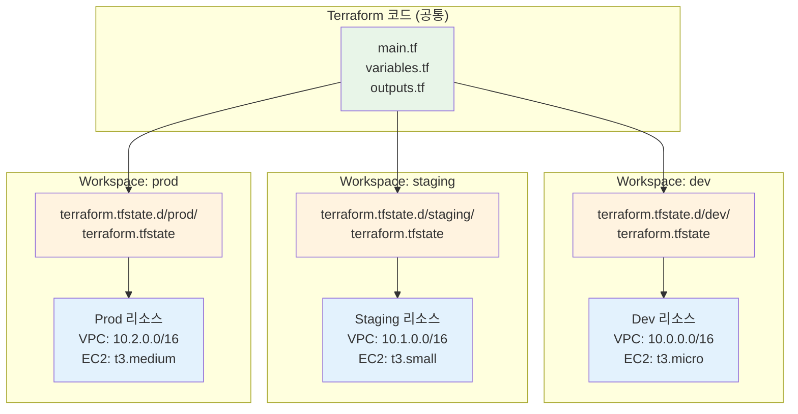
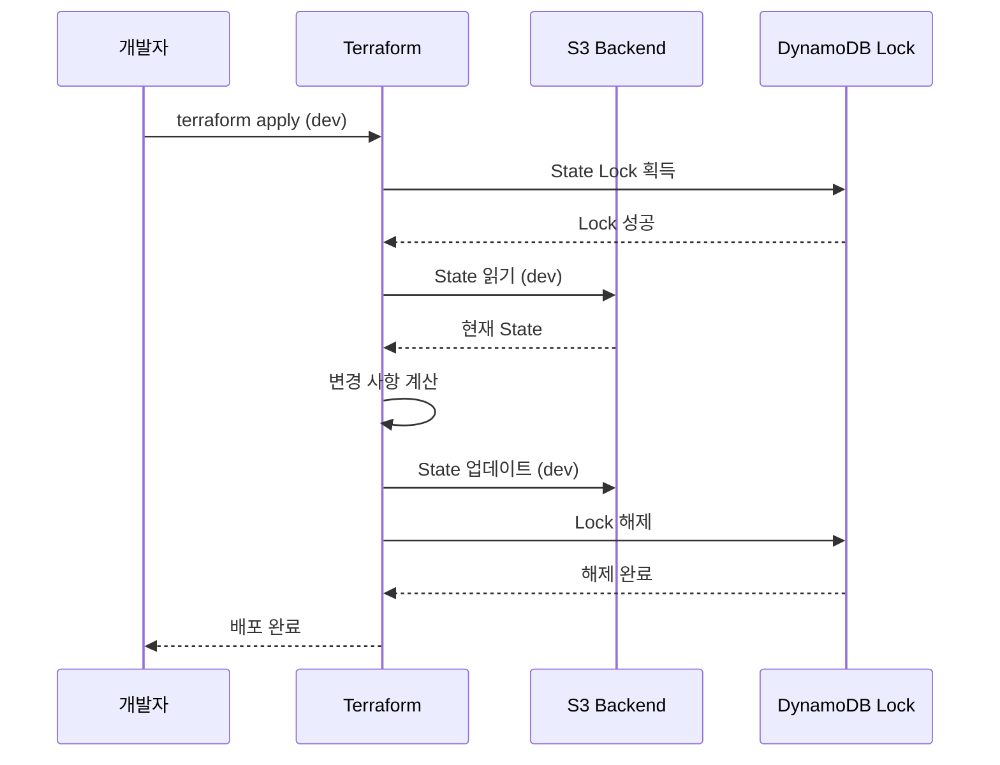

# November Week 3 Day 4 Session 2: Terraform Workspace & 환경 분리

<div align="center">

**🌍 Workspace** • **🔄 환경 분리** • **📁 State 관리** • **⚙️ 설정 분리**

*dev/staging/prod 환경을 효율적으로 관리하는 전략*

</div>

---

## 🕘 세션 정보
**시간**: 09:50-10:30 (40분)
**목표**: Terraform Workspace를 활용한 환경별 인프라 관리
**방식**: 개념 학습 + 실전 패턴

## 🎯 학습 목표
- **Workspace 개념**: 환경별 State 분리 메커니즘 이해
- **환경 분리 전략**: dev/staging/prod 관리 방법
- **설정 관리**: tfvars 파일을 통한 환경별 설정
- **실무 적용**: 프로덕션 환경 관리 베스트 프랙티스

---

## 📖 핵심 개념

### 🔍 개념 1: Terraform Workspace란? (12분)

> **정의**: 동일한 Terraform 코드로 여러 환경의 State를 분리 관리하는 메커니즘

**🏠 실생활 비유**:
- **집 설계도 하나로 여러 집 짓기**: 같은 설계도(코드)로 서울, 부산, 대구에 집(환경)을 짓되, 각 집의 상태(State)는 별도 관리
- **레시피 하나로 여러 요리**: 같은 레시피로 아침/점심/저녁 요리를 만들되, 각 요리의 재료량(설정)은 다르게

**💼 실무 상황**:
```
문제: "개발/스테이징/프로덕션 환경을 어떻게 관리하지?"
- 코드는 같은데 환경마다 설정이 다름
- 각 환경의 State를 분리해야 함
- 환경 전환이 빈번함

Workspace 솔루션:
- 하나의 코드베이스
- 환경별 State 자동 분리
- 간단한 명령어로 환경 전환
```

**🔧 기술적 설명**:

**Workspace 구조**:
```
.
├── main.tf                    # 공통 코드
├── variables.tf               # 변수 정의
├── terraform.tfstate          # default workspace state
└── terraform.tfstate.d/       # 다른 workspace states
    ├── dev/
    │   └── terraform.tfstate
    ├── staging/
    │   └── terraform.tfstate
    └── prod/
        └── terraform.tfstate
```

**Workspace 명령어**:
```bash
# Workspace 목록 확인
terraform workspace list

# 새 Workspace 생성
terraform workspace new dev
terraform workspace new staging
terraform workspace new prod

# Workspace 전환
terraform workspace select dev

# 현재 Workspace 확인
terraform workspace show

# Workspace 삭제
terraform workspace delete dev
```

**📊 시각적 이해**:


**코드 예시**:
```hcl
# main.tf - Workspace 활용
locals {
  environment = terraform.workspace
  
  # 환경별 설정 맵
  config = {
    dev = {
      instance_count = 1
      instance_type  = "t3.micro"
      enable_backup  = false
    }
    staging = {
      instance_count = 2
      instance_type  = "t3.small"
      enable_backup  = true
    }
    prod = {
      instance_count = 3
      instance_type  = "t3.medium"
      enable_backup  = true
    }
  }
  
  # 현재 환경 설정
  current_config = local.config[local.environment]
}

resource "aws_instance" "app" {
  count = local.current_config.instance_count
  
  ami           = data.aws_ami.amazon_linux_2.id
  instance_type = local.current_config.instance_type
  
  tags = {
    Name        = "app-${local.environment}-${count.index + 1}"
    Environment = local.environment
    Backup      = local.current_config.enable_backup
  }
}

# 환경별 배포
# terraform workspace select dev
# terraform apply

# terraform workspace select prod
# terraform apply
```

---

### 🔍 개념 2: 환경 분리 전략 (12분)

> **정의**: 개발/스테이징/프로덕션 환경을 안전하고 효율적으로 분리 관리하는 방법론

**환경 분리 방법 비교**:

**1. Workspace 방식** (권장: 간단한 프로젝트):
```
장점:
✅ 하나의 코드베이스
✅ State 자동 분리
✅ 환경 전환 간단
✅ 코드 중복 없음

단점:
⚠️ 환경별 세밀한 제어 어려움
⚠️ Backend 설정 공유
⚠️ 실수로 잘못된 환경 배포 가능
```

**2. 디렉토리 분리 방식** (권장: 복잡한 프로젝트):
```
장점:
✅ 환경별 완전 분리
✅ 독립적인 Backend 설정
✅ 환경별 세밀한 제어
✅ 실수 방지 (물리적 분리)

단점:
⚠️ 코드 중복 가능성
⚠️ 관리 복잡도 증가
⚠️ 동기화 필요
```

**3. tfvars 파일 방식** (권장: 설정만 다른 경우):
```
장점:
✅ 설정만 분리
✅ 코드 재사용
✅ 간단한 관리

단점:
⚠️ State 분리 없음
⚠️ 환경 혼동 가능
```

**📊 전략 비교표**:
| 기준 | Workspace | 디렉토리 분리 | tfvars만 |
|------|-----------|---------------|----------|
| **코드 중복** | 없음 | 있음 | 없음 |
| **State 분리** | 자동 | 완전 분리 | 없음 |
| **환경 전환** | 간단 | 디렉토리 이동 | 파일 지정 |
| **실수 방지** | 보통 | 높음 | 낮음 |
| **복잡도** | 낮음 | 높음 | 낮음 |
| **권장 규모** | 소규모 | 대규모 | 설정만 다름 |

**실무 패턴**:

**패턴 1: Workspace + tfvars (소규모)**:
```hcl
# main.tf
resource "aws_instance" "app" {
  count = var.instance_count
  
  ami           = var.ami_id
  instance_type = var.instance_type
  
  tags = {
    Name        = "${var.environment}-app-${count.index + 1}"
    Environment = var.environment
  }
}

# dev.tfvars
environment     = "dev"
instance_count  = 1
instance_type   = "t3.micro"
ami_id          = "ami-0c55b159cbfafe1f0"

# prod.tfvars
environment     = "prod"
instance_count  = 3
instance_type   = "t3.medium"
ami_id          = "ami-0c55b159cbfafe1f0"

# 배포
terraform workspace select dev
terraform apply -var-file="dev.tfvars"

terraform workspace select prod
terraform apply -var-file="prod.tfvars"
```

**패턴 2: 디렉토리 분리 (대규모)**:
```
project/
├── modules/              # 공통 모듈
│   ├── vpc/
│   ├── ecs/
│   └── rds/
├── environments/
│   ├── dev/
│   │   ├── main.tf
│   │   ├── variables.tf
│   │   ├── terraform.tfvars
│   │   └── backend.tf    # S3 backend: dev-state
│   ├── staging/
│   │   ├── main.tf
│   │   ├── variables.tf
│   │   ├── terraform.tfvars
│   │   └── backend.tf    # S3 backend: staging-state
│   └── prod/
│       ├── main.tf
│       ├── variables.tf
│       ├── terraform.tfvars
│       └── backend.tf    # S3 backend: prod-state
```

**환경별 설정 예시**:
```hcl
# environments/dev/terraform.tfvars
vpc_cidr           = "10.0.0.0/16"
instance_type      = "t3.micro"
instance_count     = 1
enable_multi_az    = false
backup_retention   = 1
enable_monitoring  = false

# environments/staging/terraform.tfvars
vpc_cidr           = "10.1.0.0/16"
instance_type      = "t3.small"
instance_count     = 2
enable_multi_az    = true
backup_retention   = 3
enable_monitoring  = true

# environments/prod/terraform.tfvars
vpc_cidr           = "10.2.0.0/16"
instance_type      = "t3.medium"
instance_count     = 3
enable_multi_az    = true
backup_retention   = 7
enable_monitoring  = true
```

---

### 🔍 개념 3: Backend 설정 및 State 관리 (11분)

> **정의**: 환경별 State 파일을 안전하게 저장하고 관리하는 Backend 구성

**Backend 설정 패턴**:

**1. Workspace 기반 Backend**:
```hcl
# backend.tf
terraform {
  backend "s3" {
    bucket         = "my-terraform-state"
    key            = "project/terraform.tfstate"
    region         = "ap-northeast-2"
    encrypt        = true
    dynamodb_table = "terraform-lock"
    
    # Workspace별 State 자동 분리
    workspace_key_prefix = "workspaces"
  }
}

# 실제 S3 경로:
# workspaces/dev/project/terraform.tfstate
# workspaces/staging/project/terraform.tfstate
# workspaces/prod/project/terraform.tfstate
```

**2. 환경별 Backend**:
```hcl
# environments/dev/backend.tf
terraform {
  backend "s3" {
    bucket         = "my-terraform-state"
    key            = "dev/terraform.tfstate"
    region         = "ap-northeast-2"
    encrypt        = true
    dynamodb_table = "terraform-lock-dev"
  }
}

# environments/prod/backend.tf
terraform {
  backend "s3" {
    bucket         = "my-terraform-state"
    key            = "prod/terraform.tfstate"
    region         = "ap-northeast-2"
    encrypt        = true
    dynamodb_table = "terraform-lock-prod"
  }
}
```

**State Locking**:
```hcl
# DynamoDB 테이블 생성 (State Lock용)
resource "aws_dynamodb_table" "terraform_lock" {
  name           = "terraform-lock-${var.environment}"
  billing_mode   = "PAY_PER_REQUEST"
  hash_key       = "LockID"
  
  attribute {
    name = "LockID"
    type = "S"
  }
  
  tags = {
    Name        = "Terraform State Lock"
    Environment = var.environment
  }
}
```

**📊 State 관리 흐름**:


**환경별 비용 구조**:
```hcl
# 환경별 리소스 비용 예시
locals {
  cost_config = {
    dev = {
      nat_gateway_count = 1  # $32.85/month
      instance_type     = "t3.micro"
      rds_instance      = "db.t3.micro"
    }
    staging = {
      nat_gateway_count = 2  # $65.70/month
      instance_type     = "t3.small"
      rds_instance      = "db.t3.small"
    }
    prod = {
      nat_gateway_count = 3  # $98.55/month
      instance_type     = "t3.medium"
      rds_instance      = "db.t3.medium"
    }
  }
}

# 비용 최적화: 환경별 스케줄링
resource "aws_autoscaling_schedule" "scale_down" {
  count = terraform.workspace == "dev" ? 1 : 0
  
  scheduled_action_name  = "scale-down-evening"
  min_size               = 0
  max_size               = 0
  desired_capacity       = 0
  recurrence             = "0 19 * * MON-FRI"  # 평일 저녁 7시
  autoscaling_group_name = aws_autoscaling_group.app.name
}
```

---

## 💭 함께 생각해보기 (5분)

### 🤝 페어 토론 (3분)
**토론 주제**:
1. **환경 분리 전략**: "우리 프로젝트에는 어떤 환경 분리 방법이 적합할까?"
   - 프로젝트 규모
   - 팀 구성
   - 보안 요구사항

2. **실수 방지**: "프로덕션 환경에 실수로 배포하는 것을 어떻게 막을까?"
   - 승인 프로세스
   - 자동화 도구
   - 네이밍 규칙

3. **비용 최적화**: "개발 환경 비용을 어떻게 줄일 수 있을까?"
   - 리소스 스케줄링
   - 인스턴스 타입 선택
   - 자동 종료

### 🎯 전체 공유 (2분)
- **인사이트 공유**: 각 팀의 환경 관리 전략
- **질문 수집**: 어려운 부분이나 궁금한 점
- **다음 연결**: Session 3 (Data Source & Import)와 연결

### 💡 이해도 체크 질문
- ✅ "Workspace와 디렉토리 분리의 차이를 설명할 수 있나요?"
- ✅ "환경별 State가 어떻게 분리되는지 이해했나요?"
- ✅ "실무에서 어떤 환경 분리 전략을 사용할지 결정할 수 있나요?"

---

## 🔑 핵심 키워드

### 🆕 새로운 용어
- **Workspace**: 동일 코드로 여러 환경의 State를 분리 관리하는 메커니즘
- **Environment**: 개발/스테이징/프로덕션 등 배포 환경
- **State 분리**: 환경별로 독립적인 State 파일 유지
- **tfvars**: 환경별 변수 값을 저장하는 파일

### 🔤 중요 개념
- **workspace_key_prefix**: S3 Backend에서 Workspace별 State 경로 접두사
- **DynamoDB Lock**: 동시 실행 방지를 위한 State 잠금
- **환경별 설정**: 각 환경에 맞는 리소스 크기 및 개수

### 🔤 실무 용어
- **Multi-AZ**: 여러 가용 영역에 리소스 분산 (고가용성)
- **Backup Retention**: 백업 보관 기간
- **Cost Optimization**: 비용 최적화 전략

---

## 📝 세션 마무리

### ✅ 오늘 세션 성과
- [ ] **Workspace 개념**: 환경별 State 분리 메커니즘 이해
- [ ] **환경 분리 전략**: Workspace vs 디렉토리 분리 비교
- [ ] **Backend 설정**: S3 + DynamoDB를 통한 State 관리
- [ ] **실무 패턴**: 환경별 설정 및 비용 최적화

### 🎯 다음 세션 준비
- **Session 3**: Data Source & Import
  - 기존 리소스 참조 방법
  - terraform import 사용법
  - 외부 데이터 통합

### 🔗 실습 연계
- **Lab 1**: VPC Module + dev/prod 환경 배포
  - Workspace 실전 활용
  - 환경별 설정 분리
  - State 관리 실습

---

## 🚀 실무 적용 팁

### ✅ 베스트 프랙티스
1. **명확한 Workspace 네이밍**:
   ```bash
   # 좋은 예
   terraform workspace new dev
   terraform workspace new staging
   terraform workspace new prod
   
   # 나쁜 예
   terraform workspace new test1
   terraform workspace new temp
   ```

2. **환경별 tfvars 파일**:
   ```
   ├── dev.tfvars
   ├── staging.tfvars
   └── prod.tfvars
   ```

3. **항상 현재 Workspace 확인**:
   ```bash
   # 배포 전 확인
   terraform workspace show
   
   # 프롬프트에 표시
   export PS1='[\u@\h \W ($(terraform workspace show))]\$ '
   ```

4. **프로덕션 보호**:
   ```hcl
   # main.tf
   locals {
     # 프로덕션 환경 확인
     is_production = terraform.workspace == "prod"
   }
   
   # 프로덕션에서는 삭제 방지
   resource "aws_instance" "app" {
     # ...
     
     lifecycle {
       prevent_destroy = local.is_production
     }
   }
   ```

### ❌ 안티 패턴
1. **Workspace 없이 환경 관리**:
   ```bash
   # 나쁜 예: 수동으로 State 파일 변경
   mv terraform.tfstate terraform.tfstate.dev
   mv terraform.tfstate.prod terraform.tfstate
   ```

2. **환경 확인 없이 배포**:
   ```bash
   # 나쁜 예: 현재 환경 모르고 배포
   terraform apply
   
   # 좋은 예: 환경 확인 후 배포
   terraform workspace show
   terraform apply -var-file="$(terraform workspace show).tfvars"
   ```

3. **하드코딩된 환경 설정**:
   ```hcl
   # 나쁜 예
   resource "aws_instance" "app" {
     instance_type = "t3.micro"  # 모든 환경 동일
   }
   
   # 좋은 예
   resource "aws_instance" "app" {
     instance_type = var.instance_type  # 환경별 다름
   }
   ```

---

<div align="center">

**🌍 Workspace** • **🔄 환경 분리** • **📁 State 관리** • **⚙️ 설정 분리**

*Session 2: Terraform Workspace로 효율적인 환경 관리*

</div>
