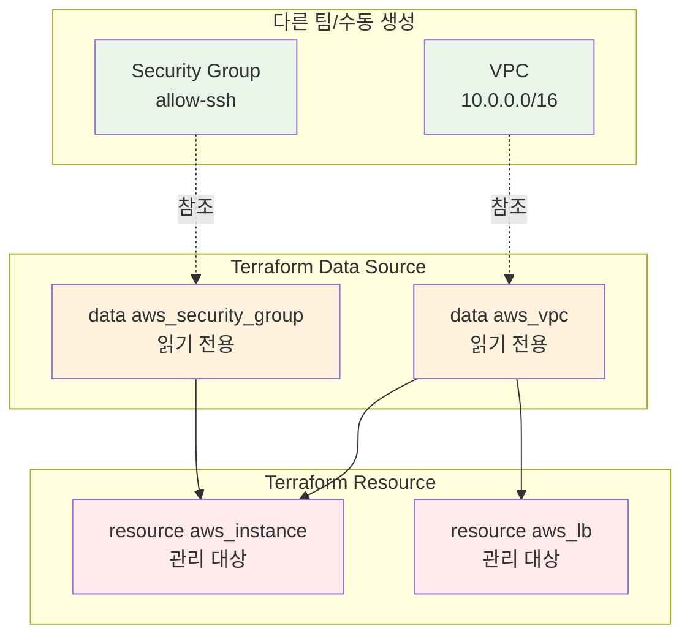
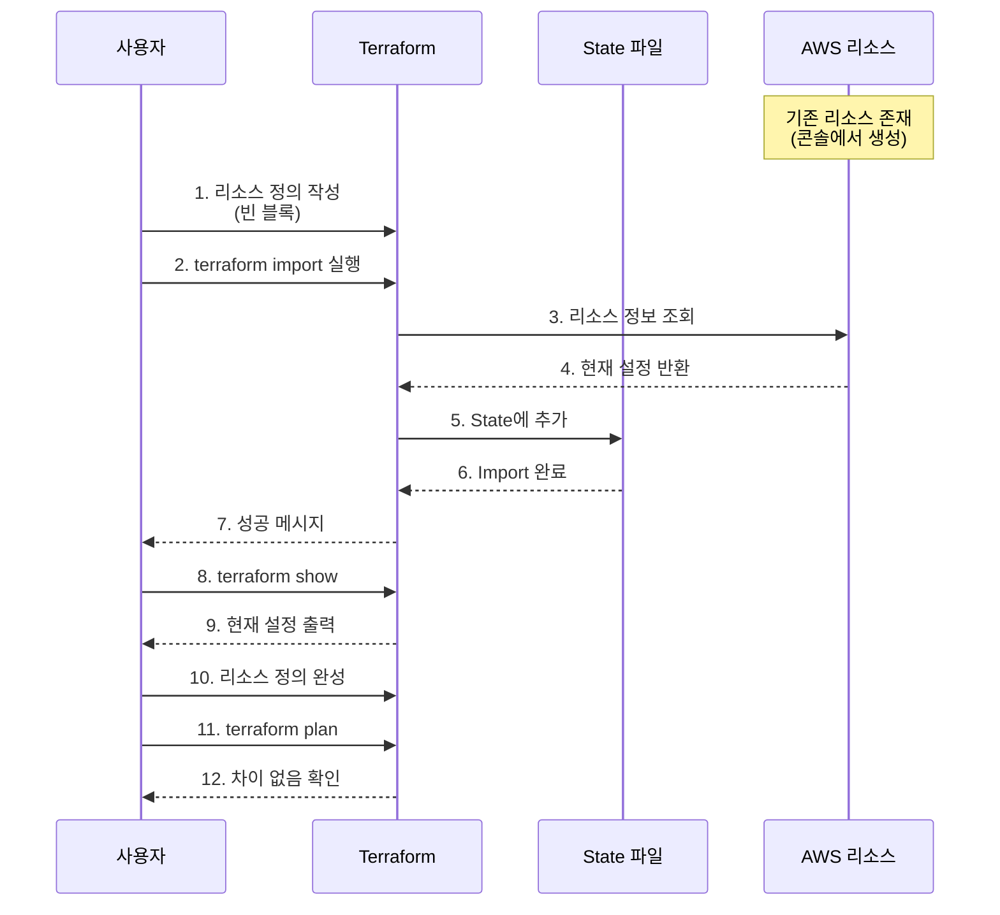

# November Week 3 Day 4 Session 3: Data Source & Import

<div align="center">

**📥 Data Source** • **🔄 Import** • **🔗 기존 리소스** • **📊 외부 데이터**

*기존 인프라를 Terraform으로 관리하는 방법*

</div>

---

## 🕘 세션 정보
**시간**: 10:40-11:20 (40분)
**목표**: 기존 리소스 참조 및 Terraform 관리 전환
**방식**: 개념 학습 + 실전 Import

## 🎯 학습 목표
- **Data Source**: 기존 리소스를 읽기 전용으로 참조
- **Import**: 수동 생성 리소스를 Terraform 관리로 전환
- **외부 데이터**: AWS 외부 데이터 통합
- **실무 적용**: 레거시 인프라 코드화 전략

---

## 📖 핵심 개념

### 🔍 개념 1: Data Source란? (12분)

> **정의**: Terraform 외부에서 생성된 리소스나 데이터를 읽기 전용으로 참조하는 메커니즘

**🏠 실생활 비유**:
- **도서관 책 참조**: 책(리소스)을 빌려서 읽기만 하고, 내용을 수정하거나 소유하지 않음
- **지도 앱**: 실제 건물(리소스)의 위치를 조회만 하고, 건물을 직접 짓거나 부수지 않음

**💼 실무 상황**:
```
문제: "다른 팀이 만든 VPC를 우리 리소스에서 사용하고 싶어요"
- VPC는 네트워크 팀이 관리
- 우리는 그 VPC 안에 EC2만 배포
- VPC를 직접 관리하면 안 됨

Data Source 솔루션:
- VPC 정보를 읽기만 함
- VPC ID를 가져와서 EC2 배포에 사용
- VPC는 네트워크 팀이 계속 관리
```

**🔧 기술적 설명**:

**Data Source vs Resource 비교**:
```hcl
# Resource: Terraform이 생성하고 관리
resource "aws_vpc" "main" {
  cidr_block = "10.0.0.0/16"
  # Terraform이 생성, 수정, 삭제 가능
}

# Data Source: 기존 리소스 참조만
data "aws_vpc" "existing" {
  filter {
    name   = "tag:Name"
    values = ["existing-vpc"]
  }
  # 읽기만 가능, 수정/삭제 불가
}

# Data Source 사용
resource "aws_subnet" "app" {
  vpc_id     = data.aws_vpc.existing.id  # 참조
  cidr_block = "10.0.1.0/24"
}
```

**📊 시각적 이해**:


**주요 Data Source 예시**:

**1. 최신 AMI 자동 선택**:
```hcl
# 항상 최신 Amazon Linux 2 AMI 사용
data "aws_ami" "amazon_linux_2" {
  most_recent = true
  owners      = ["amazon"]
  
  filter {
    name   = "name"
    values = ["amzn2-ami-hvm-*-x86_64-gp2"]
  }
  
  filter {
    name   = "virtualization-type"
    values = ["hvm"]
  }
}

resource "aws_instance" "app" {
  ami           = data.aws_ami.amazon_linux_2.id  # 자동으로 최신 AMI
  instance_type = "t3.micro"
}
```

**2. 기존 VPC 참조**:
```hcl
# 태그로 VPC 찾기
data "aws_vpc" "main" {
  tags = {
    Name = "main-vpc"
  }
}

# VPC ID로 찾기
data "aws_vpc" "by_id" {
  id = "vpc-12345678"
}

# 기본 VPC 찾기
data "aws_vpc" "default" {
  default = true
}

# 사용
resource "aws_subnet" "app" {
  vpc_id     = data.aws_vpc.main.id
  cidr_block = cidrsubnet(data.aws_vpc.main.cidr_block, 8, 1)
}
```

**3. 가용 영역 목록**:
```hcl
# 현재 리전의 가용 영역
data "aws_availability_zones" "available" {
  state = "available"
}

# 동적으로 Subnet 생성
resource "aws_subnet" "public" {
  count = length(data.aws_availability_zones.available.names)
  
  vpc_id            = aws_vpc.main.id
  cidr_block        = cidrsubnet(aws_vpc.main.cidr_block, 8, count.index)
  availability_zone = data.aws_availability_zones.available.names[count.index]
}
```

**4. 현재 리전/계정 정보**:
```hcl
# 현재 리전
data "aws_region" "current" {}

# 현재 계정 ID
data "aws_caller_identity" "current" {}

# 사용
resource "aws_s3_bucket" "logs" {
  bucket = "logs-${data.aws_caller_identity.current.account_id}-${data.aws_region.current.name}"
}
```

---

### 🔍 개념 2: Terraform Import (12분)

> **정의**: 수동으로 생성된 기존 리소스를 Terraform State에 가져와서 관리하는 프로세스

**🏠 실생활 비유**:
- **중고차 등록**: 다른 사람이 만든 차(리소스)를 내 이름으로 등록(State)해서 관리
- **양자 입양**: 다른 곳에서 태어난 아이(리소스)를 내 가족(Terraform)으로 받아들임

**💼 실무 상황**:
```
문제: "콘솔에서 만든 리소스를 Terraform으로 관리하고 싶어요"
- 초기에는 콘솔에서 수동 생성
- 이제 IaC로 전환하고 싶음
- 기존 리소스는 유지하면서 관리만 전환

Import 솔루션:
- 기존 리소스를 삭제하지 않음
- Terraform State에만 추가
- 이후부터 Terraform으로 관리
```

**🔧 Import 프로세스**:

**단계별 Import 절차**:


**실전 Import 예시**:

**1. EC2 인스턴스 Import**:
```hcl
# Step 1: 빈 리소스 정의 작성
resource "aws_instance" "imported" {
  # 일단 비워둠
}

# Step 2: Import 실행
# terraform import aws_instance.imported i-1234567890abcdef0

# Step 3: 현재 상태 확인
# terraform show

# Step 4: 출력 결과를 보고 리소스 정의 완성
resource "aws_instance" "imported" {
  ami           = "ami-0c55b159cbfafe1f0"
  instance_type = "t3.micro"
  
  tags = {
    Name = "imported-instance"
  }
  
  # 기타 설정들...
}

# Step 5: 검증
# terraform plan
# No changes. Infrastructure is up-to-date.
```

**2. Security Group Import**:
```hcl
# Step 1: 리소스 정의
resource "aws_security_group" "imported" {
  # 비워둠
}

# Step 2: Import
# terraform import aws_security_group.imported sg-0123456789abcdef0

# Step 3: terraform show로 확인 후 완성
resource "aws_security_group" "imported" {
  name        = "allow-ssh"
  description = "Allow SSH inbound traffic"
  vpc_id      = "vpc-12345678"
  
  ingress {
    from_port   = 22
    to_port     = 22
    protocol    = "tcp"
    cidr_blocks = ["0.0.0.0/0"]
  }
  
  egress {
    from_port   = 0
    to_port     = 0
    protocol    = "-1"
    cidr_blocks = ["0.0.0.0/0"]
  }
}
```

**3. 여러 리소스 일괄 Import**:
```bash
#!/bin/bash
# import-resources.sh

# VPC Import
terraform import aws_vpc.main vpc-12345678

# Subnet Import
terraform import aws_subnet.public[0] subnet-11111111
terraform import aws_subnet.public[1] subnet-22222222
terraform import aws_subnet.public[2] subnet-33333333

# Security Group Import
terraform import aws_security_group.web sg-0123456789abcdef0

# EC2 Import
terraform import aws_instance.app[0] i-1111111111111111
terraform import aws_instance.app[1] i-2222222222222222
```

**Import 주의사항**:
```hcl
# ⚠️ Import는 State만 추가, 리소스는 생성 안 함
# ⚠️ 리소스 정의를 정확히 작성해야 함
# ⚠️ terraform plan으로 차이 없음을 확인 필수

# 좋은 예: Import 후 검증
terraform import aws_instance.app i-12345
terraform show > current-state.txt  # 현재 상태 저장
# current-state.txt 보고 리소스 정의 작성
terraform plan  # 차이 없음 확인

# 나쁜 예: 검증 없이 apply
terraform import aws_instance.app i-12345
terraform apply  # 위험! 의도치 않은 변경 가능
```

---

### 🔍 개념 3: 외부 데이터 통합 (11분)

> **정의**: AWS 외부의 데이터나 동적 정보를 Terraform에서 활용하는 방법

**외부 데이터 소스**:

**1. HTTP Data Source**:
```hcl
# 외부 API에서 데이터 가져오기
data "http" "my_ip" {
  url = "https://api.ipify.org?format=json"
}

locals {
  my_ip = jsondecode(data.http.my_ip.response_body).ip
}

# 내 IP만 SSH 허용
resource "aws_security_group" "ssh" {
  name = "allow-my-ssh"
  
  ingress {
    from_port   = 22
    to_port     = 22
    protocol    = "tcp"
    cidr_blocks = ["${local.my_ip}/32"]
  }
}
```

**2. External Data Source**:
```hcl
# 외부 스크립트 실행 결과 사용
data "external" "git_info" {
  program = ["bash", "${path.module}/scripts/git-info.sh"]
}

resource "aws_instance" "app" {
  ami           = data.aws_ami.amazon_linux_2.id
  instance_type = "t3.micro"
  
  tags = {
    Name       = "app-server"
    GitCommit  = data.external.git_info.result.commit
    GitBranch  = data.external.git_info.result.branch
  }
}

# scripts/git-info.sh
#!/bin/bash
cat <<EOF
{
  "commit": "$(git rev-parse HEAD)",
  "branch": "$(git rev-parse --abbrev-ref HEAD)"
}
EOF
```

**3. Template File**:
```hcl
# User Data 템플릿
data "template_file" "user_data" {
  template = file("${path.module}/templates/user-data.sh")
  
  vars = {
    environment = var.environment
    app_version = var.app_version
    db_host     = aws_db_instance.main.endpoint
  }
}

resource "aws_instance" "app" {
  ami           = data.aws_ami.amazon_linux_2.id
  instance_type = "t3.micro"
  user_data     = data.template_file.user_data.rendered
}

# templates/user-data.sh
#!/bin/bash
echo "Environment: ${environment}"
echo "App Version: ${app_version}"
echo "DB Host: ${db_host}"

# 애플리케이션 설치 및 설정
```

**4. Local File**:
```hcl
# 로컬 파일 읽기
data "local_file" "ssh_key" {
  filename = "${path.module}/keys/id_rsa.pub"
}

resource "aws_key_pair" "deployer" {
  key_name   = "deployer-key"
  public_key = data.local_file.ssh_key.content
}
```

**실무 패턴: 동적 설정 관리**:
```hcl
# 환경별 설정 파일 읽기
data "local_file" "config" {
  filename = "${path.module}/configs/${terraform.workspace}.json"
}

locals {
  config = jsondecode(data.local_file.config.content)
}

resource "aws_instance" "app" {
  count = local.config.instance_count
  
  ami           = data.aws_ami.amazon_linux_2.id
  instance_type = local.config.instance_type
  
  tags = merge(
    local.config.common_tags,
    {
      Name = "app-${count.index + 1}"
    }
  )
}

# configs/dev.json
{
  "instance_count": 1,
  "instance_type": "t3.micro",
  "common_tags": {
    "Environment": "dev",
    "ManagedBy": "terraform"
  }
}

# configs/prod.json
{
  "instance_count": 3,
  "instance_type": "t3.medium",
  "common_tags": {
    "Environment": "prod",
    "ManagedBy": "terraform"
  }
}
```

---

## 💭 함께 생각해보기 (5분)

### 🤝 페어 토론 (3분)
**토론 주제**:
1. **Data Source vs Import**: "언제 Data Source를 쓰고, 언제 Import를 써야 할까?"
   - 다른 팀 리소스
   - 레거시 인프라
   - 외부 서비스

2. **Import 전략**: "수백 개의 기존 리소스를 어떻게 Import할까?"
   - 우선순위 결정
   - 자동화 방법
   - 검증 프로세스

3. **외부 데이터**: "어떤 외부 데이터를 Terraform에 통합하면 유용할까?"
   - API 데이터
   - 설정 파일
   - 스크립트 결과

### 🎯 전체 공유 (2분)
- **인사이트 공유**: 각 팀의 Import 경험이나 계획
- **질문 수집**: 어려운 부분이나 궁금한 점
- **다음 연결**: Lab 1에서 실제 Import 실습

### 💡 이해도 체크 질문
- ✅ "Data Source와 Resource의 차이를 설명할 수 있나요?"
- ✅ "Import 프로세스의 단계를 순서대로 말할 수 있나요?"
- ✅ "실무에서 어떤 상황에 Import를 사용할지 알고 있나요?"

---

## 🔑 핵심 키워드

### 🆕 새로운 용어
- **Data Source**: 기존 리소스를 읽기 전용으로 참조하는 메커니즘
- **Import**: 수동 생성 리소스를 Terraform State에 추가하는 프로세스
- **External Data**: Terraform 외부의 데이터를 통합하는 방법
- **terraform show**: State 파일의 현재 상태를 사람이 읽을 수 있는 형태로 출력

### 🔤 중요 개념
- **읽기 전용**: Data Source는 리소스를 수정하거나 삭제할 수 없음
- **State 추가**: Import는 리소스를 생성하지 않고 State에만 추가
- **검증 필수**: Import 후 terraform plan으로 차이 없음을 확인
- **동적 참조**: Data Source로 최신 AMI, 가용 영역 등 자동 선택

### 🔤 실무 용어
- **Legacy Infrastructure**: 기존에 수동으로 생성된 인프라
- **IaC Migration**: 수동 인프라를 코드로 전환하는 과정
- **Resource Discovery**: 기존 리소스를 찾아서 Import하는 작업

---

## 📝 세션 마무리

### ✅ 오늘 세션 성과
- [ ] **Data Source**: 기존 리소스 참조 방법 이해
- [ ] **Import**: 수동 리소스를 Terraform 관리로 전환
- [ ] **외부 데이터**: HTTP, External, Template 등 통합
- [ ] **실무 패턴**: 레거시 인프라 코드화 전략

### 🎯 다음 실습 준비
- **Lab 1**: VPC Module + 환경 배포 + Import
  - Data Source로 AMI 자동 선택
  - 기존 Security Group Import
  - terraform show로 검증

### 🔗 실습 연계
- **Import 실습**: 콘솔에서 생성한 리소스 Import
- **Data Source 활용**: 최신 AMI, 가용 영역 자동 선택
- **검증 프로세스**: terraform plan으로 차이 확인

---

## 🚀 실무 적용 팁

### ✅ 베스트 프랙티스

**1. Data Source 활용**:
```hcl
# 좋은 예: 최신 AMI 자동 선택
data "aws_ami" "latest" {
  most_recent = true
  owners      = ["amazon"]
  
  filter {
    name   = "name"
    values = ["amzn2-ami-hvm-*"]
  }
}

# 나쁜 예: AMI ID 하드코딩
resource "aws_instance" "app" {
  ami = "ami-0c55b159cbfafe1f0"  # 오래되면 사용 불가
}
```

**2. Import 워크플로우**:
```bash
# 1. 리소스 목록 작성
cat > resources-to-import.txt <<EOF
aws_vpc.main vpc-12345678
aws_subnet.public[0] subnet-11111111
aws_subnet.public[1] subnet-22222222
EOF

# 2. Import 스크립트
while read resource_type resource_id; do
  echo "Importing $resource_type..."
  terraform import $resource_type $resource_id
done < resources-to-import.txt

# 3. 검증
terraform plan
```

**3. Import 후 정리**:
```hcl
# Import 직후: terraform show 출력 복사
# resource "aws_instance" "imported" {
#   ami                          = "ami-0c55b159cbfafe1f0"
#   instance_type                = "t3.micro"
#   associate_public_ip_address  = true
#   availability_zone            = "ap-northeast-2a"
#   # ... 수많은 속성들 ...
# }

# 정리 후: 필수 속성만 유지
resource "aws_instance" "imported" {
  ami           = "ami-0c55b159cbfafe1f0"
  instance_type = "t3.micro"
  
  tags = {
    Name = "imported-instance"
  }
  
  lifecycle {
    ignore_changes = [
      ami,  # AMI 변경 무시
    ]
  }
}
```

**4. 외부 데이터 캐싱**:
```hcl
# HTTP 데이터는 매번 조회되므로 로컬 변수로 캐싱
data "http" "config" {
  url = "https://api.example.com/config"
}

locals {
  config = jsondecode(data.http.config.response_body)
  # 이후 local.config 사용
}
```

### ❌ 안티 패턴

**1. Import 없이 리소스 정의**:
```hcl
# 나쁜 예: 기존 리소스를 Import 없이 정의
resource "aws_instance" "existing" {
  ami           = "ami-0c55b159cbfafe1f0"
  instance_type = "t3.micro"
}
# terraform apply 시 새 리소스 생성 시도 → 충돌!

# 좋은 예: Import 후 정의
# terraform import aws_instance.existing i-12345
resource "aws_instance" "existing" {
  ami           = "ami-0c55b159cbfafe1f0"
  instance_type = "t3.micro"
}
```

**2. Data Source 남용**:
```hcl
# 나쁜 예: 매번 Data Source 조회
resource "aws_instance" "app" {
  count = 10
  
  # 10번 조회됨
  subnet_id = data.aws_subnet.public.id
}

# 좋은 예: 한 번만 조회
locals {
  subnet_id = data.aws_subnet.public.id
}

resource "aws_instance" "app" {
  count = 10
  
  subnet_id = local.subnet_id
}
```

**3. Import 검증 생략**:
```bash
# 나쁜 예: 검증 없이 바로 apply
terraform import aws_instance.app i-12345
terraform apply  # 위험!

# 좋은 예: 검증 후 apply
terraform import aws_instance.app i-12345
terraform show > imported-state.txt
# imported-state.txt 확인 후 리소스 정의 작성
terraform plan  # 차이 없음 확인
terraform apply
```

---

## 📊 Import 체크리스트

### Import 전
- [ ] Import할 리소스 목록 작성
- [ ] 리소스 ID 확인 (콘솔 또는 AWS CLI)
- [ ] 빈 리소스 정의 작성
- [ ] State 백업

### Import 중
- [ ] terraform import 실행
- [ ] 성공 메시지 확인
- [ ] terraform show로 현재 상태 확인
- [ ] 출력 결과 저장

### Import 후
- [ ] 리소스 정의 완성
- [ ] terraform plan 실행
- [ ] 차이 없음 확인 (No changes)
- [ ] 문서화 (어떤 리소스를 언제 Import했는지)

---

<div align="center">

**📥 Data Source** • **🔄 Import** • **🔗 기존 리소스** • **📊 외부 데이터**

*Session 3: 기존 인프라를 Terraform으로 관리하기*

</div>
