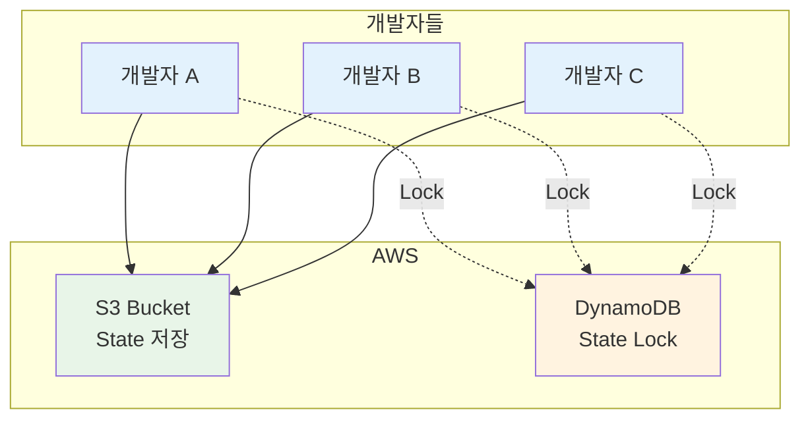
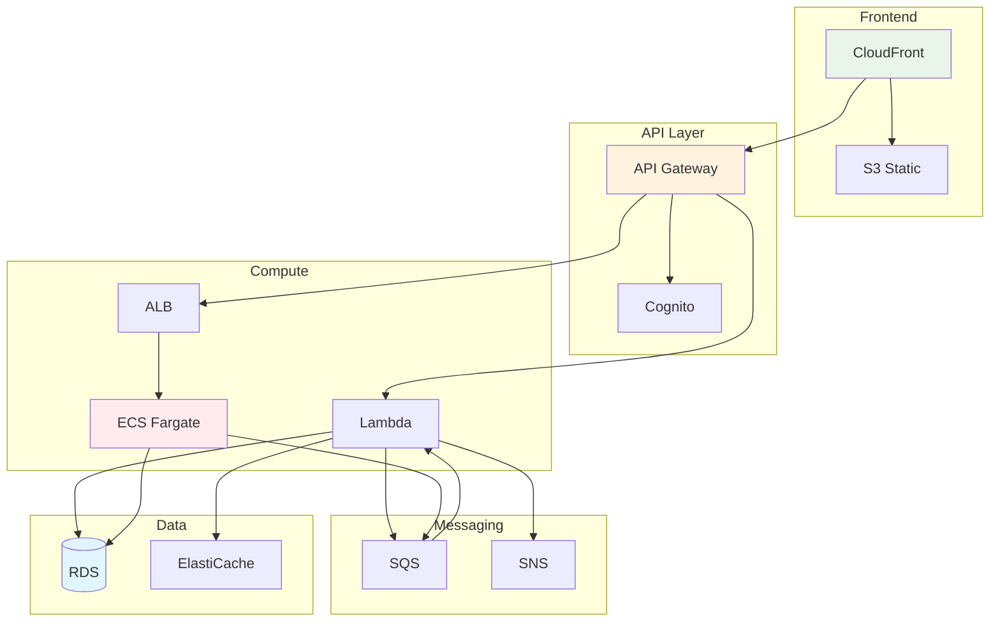

# November Week 3 Day 5: Remote State & Kubernetes 기초

<div align="center">

**☁️ Remote State** • **🔒 State Locking** • **☸️ Kubernetes** • **✅ 베스트 프랙티스**

*팀 협업 체계 구축 및 Kubernetes 기초 학습*

</div>

---

## 🕘 일일 스케줄

### 📊 시간 배분
```
09:00-09:40  Session 1: Remote State & Backend (40분)
09:40-09:50  휴식 (10분)
09:50-10:30  Session 2: Kubernetes 기초 개념 (40분)
10:30-10:40  휴식 (10분)
10:40-11:20  Session 3: Terraform 베스트 프랙티스 (40분)
11:20-12:00  Lab: 전체 스택 + K8s 맛보기 (40분)
```

### 🗓️ 상세 스케줄
| 시간 | 구분 | 내용 | 목적 |
|------|------|------|------|
| **09:00-09:40** | 📚 이론 1 | Remote State & Backend (40분) | 팀 협업 체계 |
| **09:40-09:50** | ☕ 휴식 | 10분 휴식 | |
| **09:50-10:30** | 📚 이론 2 | Kubernetes 기초 개념 (40분) | EKS 준비 |
| **10:30-10:40** | ☕ 휴식 | 10분 휴식 | |
| **10:40-11:20** | 📚 이론 3 | Terraform 베스트 프랙티스 (40분) | 프로덕션 품질 |
| **11:20-12:00** | 🛠️ 실습 | 전체 스택 + K8s 맛보기 (40분) | Week 3 통합 |

---

## 🎯 Day 5 목표

### 📚 학습 목표
- **Remote State**: S3 Backend로 팀 협업
- **State Locking**: DynamoDB로 동시 수정 방지
- **Kubernetes**: 기초 개념 및 EKS 준비
- **베스트 프랙티스**: 프로덕션급 코드 품질

### 🛠️ 실무 역량
- 팀 협업 체계 구축
- 안전한 State 관리
- Kubernetes 기초 이해
- 프로덕션 배포 준비

---

## 📚 세션 구성

### Session 1: Remote State & Backend (09:00-09:40)
**주제**: S3 Backend로 팀 협업 체계 구축

**핵심 내용**:
- S3 Backend 설정
- State Locking (DynamoDB)
- 팀 협업 전략
- State 보안

**학습 포인트**:
- 로컬 State의 한계
- Remote State 장점
- 동시 수정 방지
- State 암호화

**코드 예시**:
```hcl
# 1. S3 버킷 및 DynamoDB 테이블 생성 (별도 실행)
# backend-setup/main.tf
resource "aws_s3_bucket" "terraform_state" {
  bucket = "my-terraform-state-bucket"
  
  tags = {
    Name = "Terraform State Bucket"
  }
}

resource "aws_s3_bucket_versioning" "terraform_state" {
  bucket = aws_s3_bucket.terraform_state.id
  
  versioning_configuration {
    status = "Enabled"
  }
}

resource "aws_s3_bucket_server_side_encryption_configuration" "terraform_state" {
  bucket = aws_s3_bucket.terraform_state.id
  
  rule {
    apply_server_side_encryption_by_default {
      sse_algorithm = "AES256"
    }
  }
}

resource "aws_dynamodb_table" "terraform_locks" {
  name         = "terraform-state-locks"
  billing_mode = "PAY_PER_REQUEST"
  hash_key     = "LockID"
  
  attribute {
    name = "LockID"
    type = "S"
  }
  
  tags = {
    Name = "Terraform State Lock Table"
  }
}

# 2. Backend 설정 (프로젝트에서 사용)
# backend.tf
terraform {
  backend "s3" {
    bucket         = "my-terraform-state-bucket"
    key            = "prod/terraform.tfstate"
    region         = "ap-northeast-2"
    encrypt        = true
    dynamodb_table = "terraform-state-locks"
  }
}

# Backend 초기화
terraform init

# State 마이그레이션 (로컬 → Remote)
terraform init -migrate-state
```

**팀 협업 워크플로우**:
```bash
# 개발자 A
terraform plan    # State Lock 획득
terraform apply   # 변경 적용 및 Lock 해제

# 개발자 B (동시 실행 시)
terraform plan    # Lock 대기 (개발자 A가 완료할 때까지)
```

---

### Session 2: Kubernetes 기초 개념 (09:50-10:30)
**주제**: Kubernetes 기초 및 EKS 준비

**핵심 내용**:
- Kubernetes가 필요한 이유
- Pod, Service, Deployment 개념
- ECS vs Kubernetes 비교
- EKS 아키텍처 소개

**학습 포인트**:
- 컨테이너 오케스트레이션
- Kubernetes 핵심 개념
- ECS와의 차이점
- Week 4 EKS 준비

**핵심 개념**:
```yaml
# Pod - 최소 배포 단위
apiVersion: v1
kind: Pod
metadata:
  name: nginx-pod
spec:
  containers:
  - name: nginx
    image: nginx:latest
    ports:
    - containerPort: 80

# Deployment - Pod 관리
apiVersion: apps/v1
kind: Deployment
metadata:
  name: nginx-deployment
spec:
  replicas: 3
  selector:
    matchLabels:
      app: nginx
  template:
    metadata:
      labels:
        app: nginx
    spec:
      containers:
      - name: nginx
        image: nginx:latest
        ports:
        - containerPort: 80

# Service - 네트워크 노출
apiVersion: v1
kind: Service
metadata:
  name: nginx-service
spec:
  selector:
    app: nginx
  ports:
  - port: 80
    targetPort: 80
  type: LoadBalancer
```

**ECS vs Kubernetes 비교**:
| 구분 | ECS | Kubernetes |
|------|-----|------------|
| **관리** | AWS 완전 관리 | 표준 오픈소스 |
| **학습 곡선** | 낮음 | 높음 |
| **유연성** | AWS 생태계 | 멀티 클라우드 |
| **커뮤니티** | AWS 중심 | 글로벌 커뮤니티 |
| **비용** | 무료 (Fargate 비용만) | EKS $0.10/시간 |

---

### Session 3: Terraform 베스트 프랙티스 (10:40-11:20)
**주제**: 프로덕션급 Terraform 코드 작성

**핵심 내용**:
- 코드 구조화
- 네이밍 컨벤션
- 보안 (시크릿 관리)
- 문서화 전략

**학습 포인트**:
- 프로젝트 구조
- 변수 관리
- 민감 정보 보호
- 팀 협업 규칙

**베스트 프랙티스**:
```hcl
# 1. 코드 구조화
project/
├── modules/           # 재사용 가능한 모듈
│   ├── vpc/
│   ├── ecs/
│   └── rds/
├── environments/      # 환경별 설정
│   ├── dev/
│   ├── staging/
│   └── prod/
├── global/           # 공통 리소스 (S3, IAM)
└── README.md

# 2. 네이밍 컨벤션
resource "aws_instance" "web_server" {  # snake_case
  tags = {
    Name = "web-server-prod"  # kebab-case
  }
}

# 3. 변수 검증
variable "environment" {
  type        = string
  description = "Environment name"
  
  validation {
    condition     = contains(["dev", "staging", "prod"], var.environment)
    error_message = "Environment must be dev, staging, or prod."
  }
}

# 4. 민감 정보 관리
variable "db_password" {
  type      = string
  sensitive = true
}

# terraform.tfvars는 .gitignore에 추가
# .gitignore
*.tfvars
*.tfstate
*.tfstate.backup

# 5. Output 문서화
output "vpc_id" {
  description = "ID of the VPC"
  value       = module.vpc.vpc_id
}

# 6. 리소스 태깅
locals {
  common_tags = {
    Project     = "MyApp"
    Environment = var.environment
    ManagedBy   = "Terraform"
  }
}

resource "aws_instance" "web" {
  tags = merge(
    local.common_tags,
    {
      Name = "web-server"
    }
  )
}
```

---

## 🛠️ 실습 (Lab 1)

### Lab 1: 전체 스택 Terraform 관리 + Kubernetes 맛보기
**시간**: 11:20-12:00 (40분)
**목표**: Week 3 전체 통합 및 Kubernetes 기초 실습

**실습 내용**:
1. **Remote State 설정**
   - S3 Backend 구성
   - DynamoDB State Locking
   - State 마이그레이션

2. **전체 인프라 배포**
   - VPC + Subnet (Module)
   - EC2 + ALB + ECR + ECS
   - RDS + ElastiCache
   - SQS + SNS + API Gateway

3. **Kubernetes 기본 명령어**
   - kubectl 설치 확인
   - Minikube 또는 Kind 클러스터
   - Pod, Deployment, Service 생성
   - 기본 명령어 실습

4. **검증**
   - terraform plan/apply
   - 전체 리소스 확인
   - kubectl 명령어 실습

**디렉토리 구조**:
```
lab1/
├── backend-setup/     # S3 + DynamoDB
│   └── main.tf
├── modules/           # 재사용 모듈
│   ├── vpc/
│   ├── ecs/
│   └── rds/
├── main.tf            # 전체 스택
├── backend.tf         # Backend 설정
├── variables.tf
├── outputs.tf
└── kubernetes/        # K8s 실습
    ├── pod.yaml
    ├── deployment.yaml
    └── service.yaml
```

**Kubernetes 기본 명령어**:
```bash
# kubectl 설치 확인
kubectl version --client

# Minikube 시작 (로컬 클러스터)
minikube start

# Pod 생성
kubectl apply -f pod.yaml
kubectl get pods
kubectl describe pod nginx-pod

# Deployment 생성
kubectl apply -f deployment.yaml
kubectl get deployments
kubectl get pods

# Service 생성
kubectl apply -f service.yaml
kubectl get services

# 로그 확인
kubectl logs <pod-name>

# Pod 접속
kubectl exec -it <pod-name> -- /bin/bash

# 리소스 삭제
kubectl delete -f deployment.yaml
```

---

## 🏗️ Day 5 아키텍처

### Remote State 구조


### Week 3 전체 아키텍처


---

## 💰 예상 비용

### Day 5 리소스 비용
| 리소스 | 사양 | 비용 | 실습 시간 | 예상 비용 |
|--------|------|------|-----------|-----------|
| S3 Backend | 1GB | $0.023/GB/월 | - | $0.001 |
| DynamoDB | PAY_PER_REQUEST | 무료 (프리티어) | - | $0 |
| 전체 스택 | Week 3 전체 | - | 1시간 | $0.30 |
| **합계** | | | | **$0.301** |

### 비용 절감 팁
- S3 Backend는 영구 유지 (비용 거의 없음)
- DynamoDB는 프리티어 충분
- 전체 스택은 실습 완료 후 즉시 destroy
- Kubernetes는 로컬 클러스터 사용 (무료)

---

## ✅ Day 5 & Week 3 체크리스트

### Day 5 학습
- [ ] S3 Backend 설정
- [ ] DynamoDB State Locking
- [ ] State 마이그레이션
- [ ] Kubernetes 기초 개념 이해
- [ ] Pod, Deployment, Service 개념
- [ ] kubectl 기본 명령어
- [ ] Terraform 베스트 프랙티스

### Week 3 전체 성과
**Terraform 고급 기술**:
- [ ] for_each, count 반복문
- [ ] 조건문 및 Locals
- [ ] 리소스 의존성 관리
- [ ] Module 작성 및 재사용
- [ ] Workspace 환경 분리
- [ ] Data Source 및 Import
- [ ] Remote State Backend

**AWS 리소스 코드화**:
- [ ] VPC 전체 스택
- [ ] EC2 + ALB + ECR + ECS
- [ ] RDS + ElastiCache
- [ ] SQS + SNS + API Gateway + Cognito

**Kubernetes 기초**:
- [ ] Kubernetes 개념 이해
- [ ] kubectl 명령어 실습
- [ ] Week 4 EKS 준비 완료

---

## 🔗 관련 자료

### 📖 Terraform 공식 문서
- [Backend Configuration](https://www.terraform.io/language/settings/backends/s3)
- [State Locking](https://www.terraform.io/language/state/locking)
- [Best Practices](https://www.terraform.io/cloud-docs/recommended-practices)

### 📖 Kubernetes 공식 문서
- [Kubernetes Basics](https://kubernetes.io/docs/tutorials/kubernetes-basics/)
- [kubectl Cheat Sheet](https://kubernetes.io/docs/reference/kubectl/cheatsheet/)

### 🎯 다음 Week
- [Week 4: EKS 실전 + CI/CD](../../week_04/README.md)

---

## 💡 Day 5 & Week 3 회고

### 🤝 Day 5 학습 성과
1. **팀 협업**: Remote State로 안전한 협업 체계
2. **Kubernetes**: 기초 개념 및 명령어 실습
3. **베스트 프랙티스**: 프로덕션급 코드 품질
4. **전체 통합**: Week 3 전체 내용 통합

### 📊 Week 3 전체 성과
**Terraform 마스터**:
- ✅ 프로그래밍 기술 (for_each, count, condition)
- ✅ 복잡한 리소스 관리 (EC2, ALB, ECR, ECS, RDS)
- ✅ Module 및 환경 분리
- ✅ Remote State 팀 협업

**AWS 인프라 완전 코드화**:
- ✅ VPC, Subnet, Gateway
- ✅ EC2, ALB, ECR, ECS
- ✅ RDS, ElastiCache
- ✅ SQS, SNS, API Gateway, Cognito

**Kubernetes 준비**:
- ✅ 기초 개념 이해
- ✅ kubectl 명령어 실습
- ✅ Week 4 EKS 준비 완료

### 🎯 Week 4 준비
**다음 주 학습 내용**:
- EKS 클러스터 구축 (Terraform)
- Kubernetes 워크로드 배포
- Helm 패키지 관리
- GitHub Actions CI/CD
- 모니터링 & 로깅

**사전 준비사항**:
- Week 3 Terraform 복습
- Kubernetes 기초 개념 복습
- kubectl 설치 확인
- Docker 이미지 빌드 복습

---

## 🏆 Week 3 최종 성과

### 📊 학습 통계
- **이론 세션**: 15개 (각 40분)
- **실습 Lab**: 5개 (각 40분)
- **AWS 서비스**: 15개 코드화
- **Terraform 기술**: 10개 이상 습득

### 🎓 역량 향상
- **IaC 전문가**: Terraform 완전 습득
- **인프라 자동화**: 전체 스택 코드 관리
- **팀 협업**: Remote State 체계 구축
- **Kubernetes**: 기초 개념 및 실습

---

<div align="center">

**☁️ Remote State** • **🔒 State Locking** • **☸️ Kubernetes** • **✅ 베스트 프랙티스** • **🎓 Week 3 완성**

*Day 5: Terraform 마스터 + Kubernetes 기초 완성*

</div>
