# November Week 3 Day 5 Session 2: Kubernetes 기초 개념

<div align="center">

**☸️ Kubernetes** • **🏗️ 클러스터 아키텍처** • **📦 워크로드** • **🌐 네트워킹**

*EKS 준비를 위한 Kubernetes 핵심 개념 학습*

</div>

---

## 🕘 세션 정보
**시간**: 09:50-10:30 (40분)
**목표**: Kubernetes 기초 개념 이해 및 EKS 준비
**방식**: 이론 강의 + 실습 준비

## 🎯 학습 목표
- Kubernetes가 필요한 이유 이해
- 클러스터 아키텍처 구조 파악
- 워크로드 기본 개념 습득
- EKS 학습 준비 완료

---

## 📖 서비스 개요

### 1. 생성 배경 (Why?) - 5분

**문제 상황**:
- **컨테이너 관리의 복잡성**: Docker로 컨테이너를 실행하지만, 수백 개의 컨테이너를 수동으로 관리하기 어려움
- **확장성 문제**: 트래픽 증가 시 수동으로 컨테이너를 추가하고 로드밸런싱 설정 필요
- **고가용성 부족**: 컨테이너 장애 시 자동 복구 메커니즘 없음
- **배포 복잡도**: 무중단 배포, 롤백 등을 수동으로 처리해야 함

**🏠 실생활 비유**:
- **Docker**: 아파트 한 채를 관리하는 것 (개별 컨테이너)
- **Kubernetes**: 아파트 단지 전체를 관리하는 것 (수백 개의 컨테이너)
  - 자동으로 빈 방 배정 (스케줄링)
  - 고장난 시설 자동 수리 (자가 치유)
  - 수요에 따라 건물 증축 (오토스케일링)

**Kubernetes 솔루션**:
- **자동화된 오케스트레이션**: 컨테이너 배포, 확장, 관리 자동화
- **자가 치유**: 장애 컨테이너 자동 재시작
- **수평 확장**: 부하에 따라 자동으로 컨테이너 수 조절
- **선언적 관리**: 원하는 상태를 선언하면 Kubernetes가 자동으로 유지

---

### 2. 핵심 원리 (How?) - 10분

**Kubernetes 아키텍처**:

```mermaid
graph TB
    subgraph "Kubernetes 클러스터"
        subgraph "Control Plane"
            API[API Server<br/>모든 요청 처리]
            ETCD[etcd<br/>클러스터 상태 저장]
            SCHED[Scheduler<br/>Pod 배치 결정]
            CM[Controller Manager<br/>상태 유지]
        end
        
        subgraph "Worker Node 1"
            KUBELET1[Kubelet<br/>Pod 관리]
            PROXY1[Kube-proxy<br/>네트워크 관리]
            POD1[Pod 1]
            POD2[Pod 2]
        end
        
        subgraph "Worker Node 2"
            KUBELET2[Kubelet]
            PROXY2[Kube-proxy]
            POD3[Pod 3]
            POD4[Pod 4]
        end
    end
    
    API --> ETCD
    API --> SCHED
    API --> CM
    API --> KUBELET1
    API --> KUBELET2
    KUBELET1 --> POD1
    KUBELET1 --> POD2
    KUBELET2 --> POD3
    KUBELET2 --> POD4
    
    style API fill:#4285f4
    style ETCD fill:#34a853
    style SCHED fill:#fbbc04
    style CM fill:#ea4335
    style KUBELET1 fill:#ff6d00
    style KUBELET2 fill:#ff6d00
    style POD1 fill:#e8f5e8
    style POD2 fill:#e8f5e8
    style POD3 fill:#e8f5e8
    style POD4 fill:#e8f5e8
```



**작동 원리**:

1. **Control Plane (관리 영역)**:
   - **API Server**: 모든 요청의 중앙 허브
   - **etcd**: 클러스터 상태를 저장하는 데이터베이스
   - **Scheduler**: 새 Pod를 어느 노드에 배치할지 결정
   - **Controller Manager**: 원하는 상태를 유지하도록 지속적으로 확인

2. **Worker Node (작업 영역)**:
   - **Kubelet**: 각 노드에서 Pod를 실행하고 관리
   - **Kube-proxy**: 네트워크 트래픽 라우팅
   - **Container Runtime**: 실제 컨테이너 실행 (Docker, containerd 등)

3. **선언적 관리**:
```yaml
# 원하는 상태 선언
apiVersion: apps/v1
kind: Deployment
metadata:
  name: nginx
spec:
  replicas: 3  # 3개의 Pod를 원함
  template:
    spec:
      containers:
      - name: nginx
        image: nginx:1.21
```

Kubernetes는 이 선언을 보고 자동으로:
- 3개의 nginx Pod 생성
- 장애 시 자동 재시작
- 업데이트 시 순차적 교체

---

### 3. 주요 사용 사례 (When?) - 5분

**적합한 경우**:
- **마이크로서비스 아키텍처**: 수십~수백 개의 서비스 관리
- **고가용성 요구**: 24/7 무중단 서비스
- **자동 확장 필요**: 트래픽 변동이 큰 서비스
- **멀티 클라우드**: AWS, GCP, Azure 등 여러 클라우드 사용

**실제 사례**:
- **Netflix**: 수천 개의 마이크로서비스를 Kubernetes로 관리
- **Spotify**: 음악 스트리밍 서비스의 백엔드 인프라
- **Airbnb**: 예약 시스템 및 검색 서비스
- **Pokemon Go**: 급격한 트래픽 증가에 대응

**💼 실무 시나리오**:
```
상황: 쇼핑몰 서비스 (평소 100명 → 세일 시 10,000명)

Docker만 사용:
- 수동으로 서버 추가
- 로드밸런서 설정 변경
- 장애 시 수동 재시작
- 세일 종료 후 수동 축소

Kubernetes 사용:
- HPA로 자동 확장 (100 → 10,000명 대응)
- 자동 로드밸런싱
- 장애 Pod 자동 재시작
- 트래픽 감소 시 자동 축소
```

---

### 4. 비슷한 서비스 비교 (Which?) - 5분

**컨테이너 오케스트레이션 도구 비교**:

| 기준 | Kubernetes | Docker Swarm | Amazon ECS |
|------|------------|--------------|------------|
| **학습 곡선** | 높음 (복잡) | 낮음 (간단) | 중간 |
| **기능** | 매우 풍부 | 기본적 | AWS 통합 |
| **커뮤니티** | 매우 큰 | 작음 | AWS 중심 |
| **확장성** | 매우 높음 | 중간 | 높음 |
| **멀티 클라우드** | 가능 | 가능 | AWS 전용 |
| **비용** | 무료 (오픈소스) | 무료 | AWS 요금 |

**언제 Kubernetes를 선택하는가?**:
- ✅ 대규모 마이크로서비스 (100+ 서비스)
- ✅ 멀티 클라우드 전략
- ✅ 복잡한 배포 요구사항
- ✅ 커뮤니티 생태계 활용

**언제 대안을 선택하는가?**:
- **Docker Swarm**: 소규모 프로젝트, 빠른 시작
- **Amazon ECS**: AWS 전용, 간단한 관리
- **Nomad**: 컨테이너 + VM 혼합 환경

---

### 5. 장단점 분석 - 3분

**장점**:
- ✅ **자동화**: 배포, 확장, 복구 모두 자동
- ✅ **이식성**: 어떤 클라우드에서도 동일하게 동작
- ✅ **확장성**: 수천 개의 노드까지 확장 가능
- ✅ **생태계**: 풍부한 도구와 커뮤니티
- ✅ **선언적 관리**: 코드로 인프라 관리 (GitOps)

**단점/제약사항**:
- ⚠️ **복잡성**: 학습 곡선이 가파름
- ⚠️ **리소스 오버헤드**: Control Plane 리소스 필요
- ⚠️ **초기 설정**: 클러스터 구축이 복잡 (EKS로 해결)
- ⚠️ **디버깅 어려움**: 분산 시스템 특성상 문제 추적 복잡

**대안**:
- 소규모 프로젝트: Docker Compose로 충분
- AWS 전용: ECS가 더 간단할 수 있음
- 학습 부담: Managed Kubernetes (EKS, GKE, AKS) 사용

---

### 6. 비용 구조 💰 - 3분

**Kubernetes 자체 비용**:
- **오픈소스**: Kubernetes 자체는 무료
- **Self-managed**: 서버 비용만 지불
- **Managed Kubernetes (EKS)**: 
  - Control Plane: $0.10/hour ($73/month)
  - Worker Node: EC2 인스턴스 비용

**EKS 비용 예시 (ap-northeast-2)**:

| 항목 | 비용 | 설명 |
|------|------|------|
| **Control Plane** | $0.10/hour | 클러스터당 고정 비용 |
| **Worker Node (t3.medium)** | $0.0416/hour | 노드당 비용 |
| **EBS 볼륨 (gp3)** | $0.08/GB/month | 스토리지 |
| **데이터 전송** | $0.09/GB | 아웃바운드 |

**월간 예상 비용 (소규모 클러스터)**:
```
Control Plane: $73
Worker Node 3대 (t3.medium): $90
EBS 100GB: $8
데이터 전송 50GB: $4.5
---
합계: ~$175/month
```

**비용 최적화 팁**:
1. **Spot Instances**: Worker Node를 Spot으로 실행 (최대 90% 절감)
2. **Auto Scaling**: 필요할 때만 노드 추가
3. **리소스 제한**: Pod에 적절한 CPU/메모리 제한 설정
4. **Fargate**: 서버리스 옵션 (노드 관리 불필요)

---

### 7. 최신 업데이트 🆕 - 2분

**2024년 주요 변경사항**:
- **Kubernetes 1.30**: Gateway API GA (안정화)
- **EKS Auto Mode**: 노드 자동 관리 (2024년 11월 출시)
- **Pod Identity**: IAM 역할 간소화
- **IPv6 지원**: Dual-stack 네트워킹

**2025년 예정**:
- **Kubernetes 1.31**: 새로운 스케줄링 기능
- **EKS Hybrid Nodes**: 온프레미스 노드 지원 확대
- **AI/ML 워크로드**: GPU 스케줄링 개선

**참조**: 
- [Kubernetes Release Notes](https://kubernetes.io/releases/)
- [EKS What's New](https://aws.amazon.com/eks/whats-new/)

---

### 8. 잘 사용하는 방법 ✅ - 3분

**베스트 프랙티스**:

1. **리소스 제한 설정**:
```yaml
resources:
  requests:
    cpu: 100m
    memory: 128Mi
  limits:
    cpu: 500m
    memory: 512Mi
```

2. **Health Check 구성**:
```yaml
livenessProbe:
  httpGet:
    path: /health
    port: 8080
  initialDelaySeconds: 30
readinessProbe:
  httpGet:
    path: /ready
    port: 8080
```

3. **네임스페이스 분리**:
```bash
# 환경별 분리
kubectl create namespace dev
kubectl create namespace staging
kubectl create namespace prod
```

4. **라벨 활용**:
```yaml
metadata:
  labels:
    app: nginx
    env: prod
    version: v1.0
```

5. **ConfigMap/Secret 사용**:
```yaml
# 설정과 코드 분리
env:
- name: DB_HOST
  valueFrom:
    configMapKeyRef:
      name: app-config
      key: database.host
```

**실무 팁**:
- **Helm**: 패키지 관리자로 복잡한 애플리케이션 배포
- **GitOps**: ArgoCD로 Git 기반 배포 자동화
- **모니터링**: Prometheus + Grafana 필수
- **로깅**: EFK Stack (Elasticsearch, Fluentd, Kibana)

---

### 9. 잘못 사용하는 방법 ❌ - 3분

**흔한 실수**:

1. **리소스 제한 없음**:
```yaml
# ❌ 나쁜 예
spec:
  containers:
  - name: app
    image: myapp:latest
    # resources 설정 없음 → 노드 리소스 고갈 위험
```

2. **latest 태그 사용**:
```yaml
# ❌ 나쁜 예
image: nginx:latest  # 버전 추적 불가, 롤백 어려움

# ✅ 좋은 예
image: nginx:1.21.6  # 명확한 버전 지정
```

3. **단일 레플리카**:
```yaml
# ❌ 나쁜 예
replicas: 1  # 장애 시 서비스 중단

# ✅ 좋은 예
replicas: 3  # 고가용성 확보
```

4. **Health Check 없음**:
```yaml
# ❌ 나쁜 예
# livenessProbe, readinessProbe 없음
# → 장애 감지 불가, 트래픽 라우팅 문제
```

5. **Root 권한 실행**:
```yaml
# ❌ 나쁜 예
securityContext:
  runAsUser: 0  # root 권한 → 보안 위험

# ✅ 좋은 예
securityContext:
  runAsNonRoot: true
  runAsUser: 1000
```

**안티 패턴**:
- **모든 것을 default 네임스페이스에**: 리소스 관리 어려움
- **Secret을 ConfigMap에**: 민감 정보 노출
- **수동 kubectl 명령**: GitOps로 자동화 필요
- **모니터링 없음**: 문제 발견 지연

---

### 10. 구성 요소 상세 - 3분

**주요 Kubernetes 리소스**:

**1. Pod**:
- **역할**: 가장 작은 배포 단위 (1개 이상의 컨테이너)
- **특징**: 
  - 같은 Pod 내 컨테이너는 네트워크/스토리지 공유
  - 일시적 (Ephemeral) - 언제든 재생성 가능
- **사용**: 직접 생성보다는 Deployment로 관리

**2. Deployment**:
- **역할**: Pod의 선언적 업데이트 및 관리
- **기능**:
  - 원하는 레플리카 수 유지
  - 롤링 업데이트
  - 롤백
- **예시**:
```yaml
apiVersion: apps/v1
kind: Deployment
metadata:
  name: nginx
spec:
  replicas: 3
  selector:
    matchLabels:
      app: nginx
  template:
    metadata:
      labels:
        app: nginx
    spec:
      containers:
      - name: nginx
        image: nginx:1.21
```

**3. Service**:
- **역할**: Pod에 대한 안정적인 네트워크 엔드포인트
- **타입**:
  - **ClusterIP**: 클러스터 내부 통신 (기본값)
  - **NodePort**: 외부 접근 (포트 노출)
  - **LoadBalancer**: 클라우드 로드밸런서 (ELB)
- **예시**:
```yaml
apiVersion: v1
kind: Service
metadata:
  name: nginx
spec:
  type: LoadBalancer
  selector:
    app: nginx
  ports:
  - port: 80
    targetPort: 80
```

**4. ConfigMap & Secret**:
- **ConfigMap**: 설정 데이터 저장
- **Secret**: 민감 정보 저장 (base64 인코딩)
- **사용**:
```yaml
env:
- name: DB_HOST
  valueFrom:
    configMapKeyRef:
      name: app-config
      key: database.host
- name: DB_PASSWORD
  valueFrom:
    secretKeyRef:
      name: db-secret
      key: password
```

**5. Namespace**:
- **역할**: 리소스 논리적 분리
- **사용 사례**:
  - 환경별 분리 (dev, staging, prod)
  - 팀별 분리
  - 리소스 쿼터 적용

---

### 11. 공식 문서 링크 (필수 5개)

**⚠️ 학생들이 직접 확인해야 할 공식 문서**:
- 📘 [Kubernetes 개념](https://kubernetes.io/docs/concepts/)
- 📗 [Amazon EKS 사용자 가이드](https://docs.aws.amazon.com/eks/latest/userguide/)
- 📙 [Kubernetes API 레퍼런스](https://kubernetes.io/docs/reference/kubernetes-api/)
- 📕 [EKS 요금](https://aws.amazon.com/eks/pricing/)
- 🆕 [EKS 최신 업데이트](https://aws.amazon.com/eks/whats-new/)

---

## 💭 함께 생각해보기

### 🤝 페어 토론 (5분)

**토론 주제**:
1. **현재 프로젝트에 Kubernetes가 필요한가?**
   - 컨테이너 수가 얼마나 되는가?
   - 자동 확장이 필요한가?
   - 고가용성이 중요한가?

2. **Docker Compose vs Kubernetes**:
   - 현재 Docker Compose로 충분한가?
   - Kubernetes로 전환하면 어떤 이점이 있는가?
   - 학습 비용 대비 효과는?

3. **EKS vs Self-managed Kubernetes**:
   - Control Plane 관리 부담
   - 비용 vs 편의성
   - 팀의 Kubernetes 경험 수준

---

## 🔑 핵심 키워드

- **Kubernetes**: 컨테이너 오케스트레이션 플랫폼
- **Control Plane**: 클러스터 관리 영역 (API Server, etcd, Scheduler, Controller)
- **Worker Node**: 실제 워크로드 실행 영역
- **Pod**: 가장 작은 배포 단위 (1개 이상의 컨테이너)
- **Deployment**: Pod의 선언적 관리 (레플리카, 업데이트, 롤백)
- **Service**: Pod에 대한 안정적인 네트워크 엔드포인트
- **Namespace**: 리소스 논리적 분리
- **EKS**: AWS의 관리형 Kubernetes 서비스

---

## 📝 세션 마무리

### ✅ 오늘 세션 성과
- [ ] Kubernetes가 필요한 이유 이해
- [ ] 클러스터 아키텍처 구조 파악
- [ ] 주요 리소스 (Pod, Deployment, Service) 개념 습득
- [ ] EKS와 Self-managed 차이 이해

### 🎯 다음 세션 준비
**Session 3: Terraform 베스트 프랙티스**
- 프로덕션급 코드 작성 방법
- 보안 및 성능 최적화
- 팀 협업 전략

### 🔗 관련 자료
- [Kubernetes 공식 튜토리얼](https://kubernetes.io/docs/tutorials/)
- [EKS Workshop](https://www.eksworkshop.com/)
- [Kubernetes The Hard Way](https://github.com/kelseyhightower/kubernetes-the-hard-way)

---

<div align="center">

**☸️ Kubernetes 기초** • **🏗️ 아키텍처 이해** • **📦 워크로드 관리** • **☁️ EKS 준비**

*다음 주부터 본격적인 EKS 실습 시작!*

</div>
