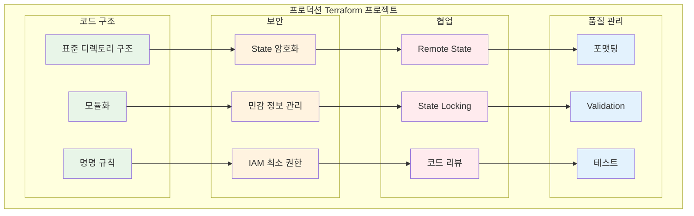

# November Week 3 Day 5 Session 3: Terraform 베스트 프랙티스

<div align="center">

**✅ 코드 품질** • **🔒 보안** • **🏗️ 구조화** • **👥 협업**

*프로덕션급 Terraform 코드 작성 방법*

</div>

---

## 🕘 세션 정보
**시간**: 10:40-11:20 (40분)
**목표**: 프로덕션 환경을 위한 Terraform 베스트 프랙티스 습득
**방식**: 이론 강의 + 실무 사례

## 🎯 학습 목표
- 프로덕션급 코드 작성 방법 이해
- 보안 및 성능 최적화 기법 습득
- 팀 협업을 위한 구조화 전략 파악
- 실무 적용 가능한 패턴 학습

---

## 📖 서비스 개요

### 1. 생성 배경 (Why?) - 5분

**문제 상황**:
- **코드 품질 저하**: 일관성 없는 코드로 유지보수 어려움
- **보안 취약점**: State 파일에 민감 정보 노출
- **협업 문제**: 팀원 간 코드 스타일 불일치
- **확장성 부족**: 프로젝트 규모 증가 시 관리 복잡도 급증

**🏠 실생활 비유**:
- **나쁜 코드**: 정리되지 않은 창고 (물건 찾기 어려움)
- **좋은 코드**: 체계적으로 정리된 창고 (필요한 것을 빠르게 찾음)
  - 라벨링 (명명 규칙)
  - 구역 분리 (모듈화)
  - 재고 관리 (버전 관리)
  - 보안 (민감 정보 보호)

**베스트 프랙티스 필요성**:
- **일관성**: 모든 팀원이 동일한 패턴 사용
- **안전성**: 보안 취약점 최소화
- **확장성**: 프로젝트 성장에 대응
- **협업**: 효율적인 팀 작업

---

### 2. 핵심 원리 (How?) - 10분

**Terraform 베스트 프랙티스 구조**:



**핵심 원칙**:

1. **표준 디렉토리 구조**:
```
terraform-project/
├── README.md              # 프로젝트 설명
├── main.tf               # 주요 리소스
├── variables.tf          # 입력 변수
├── outputs.tf            # 출력 값
├── providers.tf          # Provider 설정
├── versions.tf           # 버전 제약
├── terraform.tfvars      # 변수 값 (gitignore)
├── modules/              # 재사용 모듈
│   ├── vpc/
│   ├── ec2/
│   └── rds/
└── environments/         # 환경별 설정
    ├── dev/
    ├── staging/
    └── prod/
```

2. **모듈화 전략**:
```hcl
# 나쁜 예: 모든 것을 main.tf에
resource "aws_vpc" "main" { ... }
resource "aws_subnet" "public" { ... }
resource "aws_subnet" "private" { ... }
# ... 수백 줄의 코드

# 좋은 예: 모듈로 분리
module "vpc" {
  source = "./modules/vpc"
  
  vpc_cidr = var.vpc_cidr
  environment = var.environment
}

module "ec2" {
  source = "./modules/ec2"
  
  vpc_id = module.vpc.vpc_id
  subnet_ids = module.vpc.private_subnet_ids
}
```

3. **명명 규칙**:
```hcl
# Snake case 사용
resource "aws_instance" "web_server" {  # ✅
  # ...
}

resource "aws_instance" "WebServer" {   # ❌
  # ...
}

# 의미 있는 이름
resource "aws_s3_bucket" "app_logs" {   # ✅
  # ...
}

resource "aws_s3_bucket" "bucket1" {    # ❌
  # ...
}

# 단위 포함
variable "backup_retention_days" {      # ✅
  type = number
}

variable "backup_retention" {           # ❌
  type = number
}
```

---

### 3. 주요 사용 사례 (When?) - 5분

**베스트 프랙티스가 필수인 경우**:

1. **대규모 프로젝트**:
   - 100+ 리소스 관리
   - 여러 환경 (dev, staging, prod)
   - 복잡한 의존성

2. **팀 협업**:
   - 5명 이상의 팀
   - 동시 작업 필요
   - 코드 리뷰 프로세스

3. **프로덕션 환경**:
   - 고가용성 요구
   - 보안 규정 준수
   - 감사 추적 필요

4. **장기 유지보수**:
   - 1년 이상 운영
   - 지속적인 업데이트
   - 레거시 코드 관리

**실제 사례**:
- **Netflix**: 수천 개의 AWS 리소스를 Terraform으로 관리
- **Uber**: 멀티 리전 인프라 자동화
- **Airbnb**: 환경별 인프라 일관성 유지

**💼 실무 시나리오**:
```
상황: 스타트업 → 중견 기업 성장

초기 (5명):
- 단일 main.tf 파일
- 수동 배포
- 로컬 State

성장 후 (50명):
- 모듈화된 구조
- CI/CD 자동화
- Remote State + Locking
- 코드 리뷰 필수
```

---

### 4. 비슷한 서비스 비교 (Which?) - 5분

**IaC 도구 베스트 프랙티스 비교**:

| 기준 | Terraform | CloudFormation | Pulumi |
|------|-----------|----------------|--------|
| **구조화** | 모듈 시스템 | Nested Stack | 프로그래밍 언어 |
| **State 관리** | Remote Backend | AWS 관리 | Pulumi Cloud |
| **버전 관리** | versions.tf | Template 버전 | 패키지 관리자 |
| **테스트** | Terratest | TaskCat | 단위 테스트 |
| **보안** | Sentinel | Service Control Policies | Policy as Code |

**Terraform 베스트 프랙티스 선택 이유**:
- ✅ **멀티 클라우드**: AWS, Azure, GCP 모두 지원
- ✅ **커뮤니티**: 풍부한 모듈과 예제
- ✅ **도구 생태계**: Terragrunt, Atlantis 등
- ✅ **검증된 패턴**: 대기업 사용 사례 많음

---

### 5. 장단점 분석 - 3분

**장점**:
- ✅ **일관성**: 모든 프로젝트에서 동일한 패턴
- ✅ **안전성**: 보안 취약점 최소화
- ✅ **협업 효율**: 팀원 간 이해도 향상
- ✅ **유지보수**: 코드 수정 및 확장 용이
- ✅ **품질**: 자동화된 검증 및 테스트

**단점/제약사항**:
- ⚠️ **초기 비용**: 구조 설계 및 설정 시간 필요
- ⚠️ **학습 곡선**: 팀원 교육 필요
- ⚠️ **과도한 추상화**: 너무 복잡한 모듈은 오히려 비효율
- ⚠️ **도구 의존성**: 추가 도구 (pre-commit, tflint 등) 필요

**대안**:
- 소규모 프로젝트: 간단한 구조로 시작
- 빠른 프로토타입: 베스트 프랙티스 일부만 적용
- 레거시 마이그레이션: 점진적 개선

---

### 6. 비용 구조 💰 - 3분

**베스트 프랙티스 적용 비용**:

**초기 투자**:
- **시간**: 구조 설계 및 설정 (1-2주)
- **교육**: 팀원 온보딩 (1주)
- **도구**: CI/CD 파이프라인 구축 (1주)

**운영 비용**:
- **Terraform Cloud**: 
  - Free: 5명까지 무료
  - Team: $20/user/month
  - Business: 커스텀 가격
- **CI/CD**: GitHub Actions, GitLab CI (무료 티어 가능)
- **State Storage**: S3 ($0.023/GB/month) + DynamoDB (무료 티어)

**비용 절감 효과**:
```
베스트 프랙티스 미적용 시:
- 수동 작업 시간: 10시간/주
- 오류 복구 시간: 5시간/월
- 보안 사고 위험: 높음

베스트 프랙티스 적용 시:
- 자동화로 시간 절약: 8시간/주
- 오류 감소: 90%
- 보안 사고 위험: 낮음

ROI: 3개월 내 투자 회수
```

**예상 비용 (중소 팀)**:
```
초기 투자: $5,000 (인건비)
월간 운영: $100 (도구 비용)
절감 효과: $2,000/월 (시간 절약)
---
순이익: $1,900/월
```

---

### 7. 최신 업데이트 🆕 - 2분

**2024년 주요 변경사항**:
- **Terraform 1.7**: Test Framework 안정화
- **Terraform 1.8**: Provider Functions 지원
- **HCP Terraform**: Terraform Cloud 리브랜딩
- **Stacks**: 멀티 환경 관리 개선

**2025년 예정**:
- **Terraform 2.0**: 주요 아키텍처 개선
- **AI 기반 코드 생성**: Copilot 통합
- **향상된 State 관리**: 성능 최적화

**AWS 통합**:
- **AWS Provider 5.x**: 새로운 서비스 지원
- **EKS Auto Mode**: Terraform 지원
- **S3 Express One Zone**: 빠른 State 저장

**참조**: 
- [Terraform Release Notes](https://github.com/hashicorp/terraform/releases)
- [AWS Provider Changelog](https://github.com/hashicorp/terraform-provider-aws/blob/main/CHANGELOG.md)

---

### 8. 잘 사용하는 방법 ✅ - 3분

**베스트 프랙티스 체크리스트**:

**1. 코드 구조**:
```hcl
# ✅ 파일 분리
# main.tf - 주요 리소스
# variables.tf - 입력 변수
# outputs.tf - 출력 값
# providers.tf - Provider 설정
# versions.tf - 버전 제약

# ✅ 모듈 사용
module "vpc" {
  source  = "terraform-aws-modules/vpc/aws"
  version = "5.0.0"
  
  name = "${var.project}-${var.environment}-vpc"
  cidr = var.vpc_cidr
}
```

**2. 변수 관리**:
```hcl
# ✅ 타입 명시
variable "instance_count" {
  description = "Number of EC2 instances"
  type        = number
  default     = 2
  
  validation {
    condition     = var.instance_count > 0 && var.instance_count <= 10
    error_message = "Instance count must be between 1 and 10"
  }
}

# ✅ 민감 정보 보호
variable "db_password" {
  description = "Database password"
  type        = string
  sensitive   = true
}
```

**3. 리소스 명명**:
```hcl
# ✅ 일관된 명명 규칙
resource "aws_instance" "web_server" {
  tags = {
    Name        = "${var.project}-${var.environment}-web"
    Environment = var.environment
    ManagedBy   = "Terraform"
  }
}
```

**4. State 관리**:
```hcl
# ✅ Remote Backend
terraform {
  backend "s3" {
    bucket         = "my-terraform-state"
    key            = "prod/terraform.tfstate"
    region         = "ap-northeast-2"
    encrypt        = true
    dynamodb_table = "terraform-locks"
  }
}
```

**5. 코드 품질**:
```bash
# ✅ Pre-commit hooks
# .pre-commit-config.yaml
repos:
  - repo: https://github.com/antonbabenko/pre-commit-terraform
    hooks:
      - id: terraform_fmt
      - id: terraform_validate
      - id: terraform_docs
      - id: terraform_tflint
```

**실무 팁**:
- **Terragrunt**: DRY 원칙 적용
- **Atlantis**: PR 기반 자동 배포
- **Checkov**: 보안 스캔 자동화
- **Infracost**: 비용 예측

---

### 9. 잘못 사용하는 방법 ❌ - 3분

**흔한 실수**:

**1. 하드코딩**:
```hcl
# ❌ 나쁜 예
resource "aws_instance" "web" {
  ami           = "ami-0c55b159cbfafe1f0"  # 하드코딩
  instance_type = "t3.micro"
  
  tags = {
    Name = "production-web-server"  # 환경 하드코딩
  }
}

# ✅ 좋은 예
resource "aws_instance" "web" {
  ami           = data.aws_ami.amazon_linux.id
  instance_type = var.instance_type
  
  tags = {
    Name = "${var.project}-${var.environment}-web"
  }
}
```

**2. 민감 정보 노출**:
```hcl
# ❌ 나쁜 예
resource "aws_db_instance" "main" {
  password = "MyPassword123!"  # 코드에 직접 입력
}

# ✅ 좋은 예
resource "aws_db_instance" "main" {
  password = var.db_password  # 변수 사용
}

# ✅ 더 좋은 예
resource "aws_db_instance" "main" {
  password = random_password.db_password.result
}

resource "random_password" "db_password" {
  length  = 16
  special = true
}
```

**3. 버전 고정 없음**:
```hcl
# ❌ 나쁜 예
terraform {
  required_providers {
    aws = {
      source = "hashicorp/aws"
      # 버전 지정 없음 → 예상치 못한 변경
    }
  }
}

# ✅ 좋은 예
terraform {
  required_version = ">= 1.5.0"
  
  required_providers {
    aws = {
      source  = "hashicorp/aws"
      version = "~> 5.0"  # 5.x 버전 사용
    }
  }
}
```

**4. 거대한 단일 파일**:
```hcl
# ❌ 나쁜 예
# main.tf (2000줄)
resource "aws_vpc" "main" { ... }
resource "aws_subnet" "public_1" { ... }
resource "aws_subnet" "public_2" { ... }
# ... 수백 개의 리소스

# ✅ 좋은 예
# 모듈로 분리
module "vpc" { ... }
module "ec2" { ... }
module "rds" { ... }
```

**5. 테스트 없음**:
```bash
# ❌ 나쁜 예
terraform apply -auto-approve  # 검증 없이 바로 적용

# ✅ 좋은 예
terraform fmt -check
terraform validate
terraform plan -out=tfplan
# 리뷰 후
terraform apply tfplan
```

**안티 패턴**:
- **모든 것을 하나의 State에**: 장애 시 전체 영향
- **수동 State 수정**: State 파일 직접 편집 금지
- **문서화 없음**: README, 주석 필수
- **백업 없음**: State 백업 전략 필요

---

### 10. 구성 요소 상세 - 3분

**프로덕션 Terraform 프로젝트 구조**:

**1. 표준 파일 구조**:
```
terraform-project/
├── README.md              # 프로젝트 설명, 사용법
├── .gitignore            # Terraform 관련 파일 제외
├── .pre-commit-config.yaml  # 코드 품질 검사
│
├── main.tf               # 주요 리소스 정의
├── variables.tf          # 입력 변수 선언
├── outputs.tf            # 출력 값 정의
├── providers.tf          # Provider 설정
├── versions.tf           # Terraform 및 Provider 버전
├── data.tf               # Data Source 정의
│
├── terraform.tfvars      # 변수 값 (gitignore)
├── dev.tfvars           # 개발 환경 변수
├── prod.tfvars          # 프로덕션 환경 변수
│
├── modules/              # 재사용 모듈
│   ├── vpc/
│   │   ├── main.tf
│   │   ├── variables.tf
│   │   ├── outputs.tf
│   │   └── README.md
│   ├── ec2/
│   └── rds/
│
└── environments/         # 환경별 설정
    ├── dev/
    │   ├── main.tf
    │   └── terraform.tfvars
    ├── staging/
    └── prod/
```

**2. 모듈 설계 원칙**:
```hcl
# 모듈 입력 (variables.tf)
variable "vpc_cidr" {
  description = "CIDR block for VPC"
  type        = string
  
  validation {
    condition     = can(cidrhost(var.vpc_cidr, 0))
    error_message = "Must be valid IPv4 CIDR"
  }
}

# 모듈 출력 (outputs.tf)
output "vpc_id" {
  description = "ID of the VPC"
  value       = aws_vpc.main.id
}

# 모듈 사용 (main.tf)
module "vpc" {
  source = "./modules/vpc"
  
  vpc_cidr    = var.vpc_cidr
  environment = var.environment
}
```

**3. 환경별 관리**:
```hcl
# environments/prod/main.tf
module "infrastructure" {
  source = "../../"
  
  environment     = "prod"
  instance_type   = "t3.medium"
  instance_count  = 5
  enable_backup   = true
}

# environments/dev/main.tf
module "infrastructure" {
  source = "../../"
  
  environment     = "dev"
  instance_type   = "t3.micro"
  instance_count  = 1
  enable_backup   = false
}
```

**4. CI/CD 통합**:
```yaml
# .github/workflows/terraform.yml
name: Terraform

on:
  pull_request:
    branches: [main]

jobs:
  terraform:
    runs-on: ubuntu-latest
    steps:
      - uses: actions/checkout@v3
      
      - name: Setup Terraform
        uses: hashicorp/setup-terraform@v2
        
      - name: Terraform Format
        run: terraform fmt -check
        
      - name: Terraform Init
        run: terraform init
        
      - name: Terraform Validate
        run: terraform validate
        
      - name: Terraform Plan
        run: terraform plan
```

---

### 11. 공식 문서 링크 (필수 5개)

**⚠️ 학생들이 직접 확인해야 할 공식 문서**:
- 📘 [Terraform Best Practices](https://www.terraform.io/docs/cloud/guides/recommended-practices/index.html)
- 📗 [AWS Provider Best Practices](https://docs.aws.amazon.com/prescriptive-guidance/latest/terraform-aws-provider-best-practices/introduction.html)
- 📙 [Terraform Style Guide](https://www.terraform.io/docs/language/syntax/style.html)
- 📕 [Terraform Registry](https://registry.terraform.io/)
- 🆕 [Terraform Changelog](https://github.com/hashicorp/terraform/blob/main/CHANGELOG.md)

---

## 💭 함께 생각해보기

### 🤝 페어 토론 (5분)

**토론 주제**:
1. **현재 프로젝트의 개선점**:
   - 어떤 베스트 프랙티스가 부족한가?
   - 가장 먼저 개선할 부분은?
   - 팀 합의가 필요한 부분은?

2. **모듈화 전략**:
   - 어떤 리소스를 모듈로 분리할 것인가?
   - 재사용 가능한 패턴은?
   - 환경별 차이는 어떻게 관리할 것인가?

3. **보안 강화**:
   - 민감 정보는 어떻게 관리하는가?
   - State 파일 보안은 충분한가?
   - IAM 권한은 최소 권한 원칙을 따르는가?

---

## 🔑 핵심 키워드

- **베스트 프랙티스**: 검증된 코드 작성 방법
- **모듈화**: 재사용 가능한 코드 구조
- **명명 규칙**: 일관된 이름 지정 (snake_case)
- **Remote State**: S3 + DynamoDB로 팀 협업
- **버전 관리**: Terraform 및 Provider 버전 고정
- **보안**: 민감 정보 보호, State 암호화
- **CI/CD**: 자동화된 검증 및 배포
- **코드 품질**: 포맷팅, Validation, 테스트

---

## 📝 세션 마무리

### ✅ 오늘 세션 성과
- [ ] 프로덕션급 코드 구조 이해
- [ ] 보안 베스트 프랙티스 습득
- [ ] 팀 협업 전략 파악
- [ ] 코드 품질 관리 방법 학습

### 🎯 다음 실습 준비
**Lab: 전체 스택 + K8s 맛보기**
- Week 3 학습 내용 통합
- 프로덕션급 인프라 구축
- Kubernetes 기초 실습

### 🔗 관련 자료
- [Terraform Best Practices Guide](https://www.terraform-best-practices.com/)
- [AWS Well-Architected Framework](https://aws.amazon.com/architecture/well-architected/)
- [Terragrunt Documentation](https://terragrunt.gruntwork.io/)

---

<div align="center">

**✅ 코드 품질** • **🔒 보안 강화** • **🏗️ 체계적 구조** • **👥 효율적 협업**

*프로덕션 환경을 위한 Terraform 마스터!*

</div>
