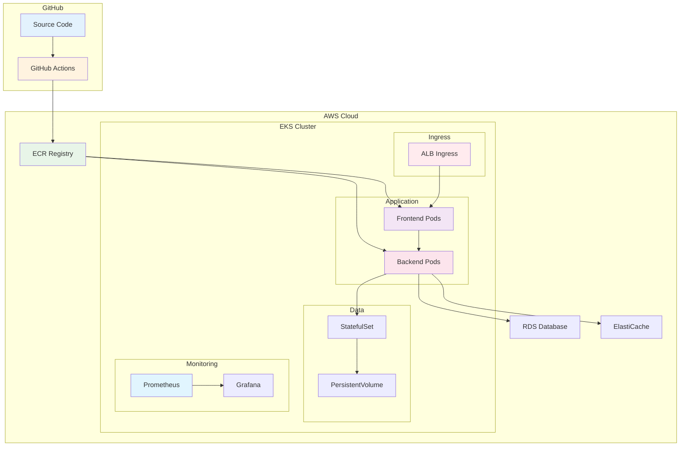

# November Week 4: EKS 실전 + CI/CD 자동화

<div align="center">

**☸️ Kubernetes on AWS** • **🚀 CI/CD** • **📊 모니터링** • **🎯 프로덕션 배포**

*EKS 완전 정복 + 자동화 파이프라인*

</div>

---

## 🎯 Week 4 목표

### 전체 학습 목표
- EKS 클러스터 구축 및 운영 완전 습득
- Kubernetes 워크로드 배포 및 관리
- Helm을 통한 패키지 관리
- GitHub Actions로 CI/CD 파이프라인 구축
- 프로덕션급 모니터링 및 로깅 시스템

### 주간 성과물
- Terraform으로 관리되는 EKS 클러스터
- Kubernetes 기반 마이크로서비스 배포
- Helm Chart 패키지
- GitHub Actions CI/CD 파이프라인
- Prometheus + Grafana 모니터링 시스템

---

## 📊 학습 구조

### 일일 시간표
```
09:00-09:40  Session 1: 핵심 주제 1 (40분)
09:40-10:20  Session 2: 핵심 주제 2 (40분)
10:20-11:00  Session 3: 핵심 주제 3 (40분)
11:00-12:00  Lab: 통합 실습 (60분)
```

### 학습 방식
- **EKS 중심**: Kubernetes on AWS 완전 정복
- **실전 배포**: 실제 애플리케이션 배포 경험
- **자동화**: CI/CD 파이프라인 구축

---

## 📅 주간 커리큘럼

### Day 1 (월): EKS 클러스터 구축
**시간**: 09:00-12:00

**이론**:
- Session 1: **EKS 아키텍처** (40분)
  - EKS Control Plane
  - Worker Node (Managed Node Group)
  - Fargate Profile
  - VPC 네트워킹 (CNI)

- Session 2: **Terraform으로 EKS 구축** (40분)
  - EKS Module 활용
  - Node Group 설정
  - IAM Role & Policy
  - kubectl 설정

- Session 3: **EKS 보안** (40분)
  - RBAC (Role-Based Access Control)
  - Pod Security Policy
  - Network Policy
  - Secrets 관리

**실습**:
- Lab 1: Terraform으로 EKS 클러스터 생성 (60분)
  - VPC + EKS Cluster
  - Managed Node Group
  - kubectl 연결
  - 기본 워크로드 배포

**학습 포인트**:
- EKS 아키텍처 이해
- Terraform으로 EKS 관리
- Kubernetes 보안 기초

---

### Day 2 (화): Kubernetes 워크로드 배포
**시간**: 09:00-12:00

**이론**:
- Session 1: **Deployment & Service** (40분)
  - Deployment 전략 (Rolling, Blue/Green)
  - Service 타입 (ClusterIP, NodePort, LoadBalancer)
  - Ingress Controller (ALB Ingress)
  - ConfigMap & Secret

- Session 2: **StatefulSet & PersistentVolume** (40분)
  - StatefulSet 개념
  - EBS CSI Driver
  - PersistentVolumeClaim
  - 데이터베이스 배포

- Session 3: **HPA & Cluster Autoscaler** (40분)
  - Horizontal Pod Autoscaler
  - Cluster Autoscaler
  - Metrics Server
  - 리소스 관리

**실습**:
- Lab 1: 마이크로서비스 배포 (60분)
  - Frontend + Backend + Database
  - ALB Ingress 설정
  - Auto Scaling 구성
  - 데이터 영속성

**학습 포인트**:
- Kubernetes 워크로드 관리
- 고가용성 배포
- 자동 확장

---

### Day 3 (수): Helm & 패키지 관리
**시간**: 09:00-12:00

**이론**:
- Session 1: **Helm 기초** (40분)
  - Helm이 필요한 이유
  - Chart 구조
  - Values 파일
  - Release 관리

- Session 2: **Helm Chart 작성** (40분)
  - Chart 템플릿
  - 조건문 & 반복문
  - 의존성 관리
  - Chart Repository

- Session 3: **실무 Helm 활용** (40분)
  - Prometheus Stack
  - Ingress Controller
  - Cert-Manager
  - 애플리케이션 Chart

**실습**:
- Lab 1: Helm으로 전체 스택 배포 (60분)
  - 커스텀 Chart 작성
  - Prometheus + Grafana 설치
  - 애플리케이션 배포
  - 업그레이드 & 롤백

**학습 포인트**:
- Helm 패키지 관리
- Chart 작성 및 배포
- 실무 도구 활용

---

### Day 4 (목): CI/CD 파이프라인
**시간**: 09:00-12:00

**이론**:
- Session 1: **GitHub Actions 기초** (40분)
  - Workflow 구조
  - Trigger (push, pull_request)
  - Jobs & Steps
  - Secrets 관리

- Session 2: **Docker 이미지 빌드 & 푸시** (40분)
  - Dockerfile 최적화
  - Multi-stage Build
  - ECR 푸시
  - 이미지 태깅 전략

- Session 3: **Kubernetes 배포 자동화** (40분)
  - kubectl apply
  - Helm upgrade
  - ArgoCD 소개
  - GitOps 개념

**실습**:
- Lab 1: GitHub Actions CI/CD 구축 (60분)
  - 코드 푸시 → 이미지 빌드 → ECR 푸시
  - EKS 배포 자동화
  - 롤링 업데이트
  - 배포 검증

**학습 포인트**:
- CI/CD 파이프라인 구축
- 자동화된 배포
- GitOps 개념

---

### Day 5 (금): 모니터링 & 운영
**시간**: 09:00-12:00

**이론**:
- Session 1: **Prometheus & Grafana** (40분)
  - Prometheus 아키텍처
  - 메트릭 수집
  - Grafana 대시보드
  - 알람 설정

- Session 2: **로깅 & 트레이싱** (40분)
  - CloudWatch Container Insights
  - Fluent Bit
  - 로그 중앙화
  - 분산 추적 (X-Ray)

- Session 3: **Week 1-4 전체 복습** (40분)
  - AWS 서비스 총정리
  - Terraform IaC 복습
  - EKS 운영 베스트 프랙티스
  - 기본 프로젝트 준비

**실습**:
- Lab 1: 프로덕션급 모니터링 시스템 (60분)
  - Prometheus + Grafana 설정
  - 커스텀 메트릭 수집
  - 알람 규칙 설정
  - 로그 분석

**학습 포인트**:
- 프로덕션 모니터링
- 로그 관리
- 전체 복습

---

## 🏗️ Week 4 최종 아키텍처



---

## 📊 Week 4 핵심 기술

### Kubernetes on AWS
1. **EKS** - Managed Kubernetes
2. **Managed Node Group** - Worker Node 관리
3. **ALB Ingress Controller** - 로드 밸런싱
4. **EBS CSI Driver** - 영속적 스토리지
5. **Cluster Autoscaler** - 자동 확장

### 패키지 관리
6. **Helm** - Kubernetes 패키지 관리
7. **Helm Chart** - 재사용 가능한 템플릿

### CI/CD
8. **GitHub Actions** - 자동화 파이프라인
9. **ECR** - 컨테이너 이미지 저장소
10. **GitOps** - 선언적 배포

### 모니터링
11. **Prometheus** - 메트릭 수집
12. **Grafana** - 시각화
13. **CloudWatch Container Insights** - AWS 통합 모니터링

---

## 💰 주간 예상 비용

### 일별 비용 (프리티어 활용)
| Day | 주요 리소스 | 예상 비용 |
|-----|------------|-----------|
| Day 1 | EKS Cluster + Node Group | $0.50 |
| Day 2 | EKS + 워크로드 | $0.60 |
| Day 3 | EKS + Helm Stack | $0.70 |
| Day 4 | EKS + CI/CD | $0.65 |
| Day 5 | EKS + 모니터링 | $0.75 |
| **합계** | | **$3.20** |

### 비용 구성
- **EKS Control Plane**: $0.10/hour (시간당)
- **Worker Node (t3.medium)**: $0.0416/hour × 2 = $0.0832/hour
- **ALB**: $0.0225/hour
- **EBS**: $0.10/GB-month

### 비용 절감 팁
- 실습 완료 후 즉시 클러스터 삭제
- 최소 Node 수 사용 (2개)
- Spot Instance 활용 (선택)
- 실습 시간 엄수 (60분)

---

## ✅ Week 4 완료 체크리스트

### EKS 클러스터
- [ ] Terraform으로 EKS 클러스터 생성
- [ ] Managed Node Group 구성
- [ ] kubectl 연결 및 기본 명령어
- [ ] RBAC 보안 설정

### Kubernetes 워크로드
- [ ] Deployment 배포 및 관리
- [ ] Service & Ingress 설정
- [ ] StatefulSet & PersistentVolume
- [ ] HPA & Cluster Autoscaler

### Helm 패키지 관리
- [ ] Helm Chart 작성
- [ ] Prometheus + Grafana 설치
- [ ] 애플리케이션 Chart 배포
- [ ] Release 관리 (upgrade, rollback)

### CI/CD 파이프라인
- [ ] GitHub Actions Workflow 작성
- [ ] Docker 이미지 빌드 & ECR 푸시
- [ ] EKS 자동 배포
- [ ] 배포 검증

### 모니터링 & 로깅
- [ ] Prometheus 메트릭 수집
- [ ] Grafana 대시보드 구성
- [ ] CloudWatch Logs 통합
- [ ] 알람 설정

---

## 🔗 기본 프로젝트 준비

### 기본 프로젝트 예고 (4주)
- **Week 1**: 프로젝트 기획 및 설계
- **Week 2**: 인프라 구축 (Terraform + EKS)
- **Week 3**: 애플리케이션 개발 및 배포
- **Week 4**: CI/CD + 모니터링 + 최종 발표

### 사전 준비사항
- November Week 1-4 전체 복습
- AWS 서비스 정리
- Terraform 코드 정리
- Kubernetes 개념 복습
- 팀 구성 및 역할 분담

---

## 📚 November 전체 학습 정리

### Week 1: AWS 기초
- VPC, EC2, RDS, S3, CloudFront
- Lambda, ElastiCache
- 기본 웹 아키텍처

### Week 2: AWS 실무 서비스
- SQS, SNS, API Gateway, Cognito
- ECR, ECS, Fargate
- Parameter Store, EventBridge
- Terraform 기초

### Week 3: Terraform 마스터
- 프로그래밍 기술 (for_each, count)
- Module & 환경 분리
- Remote State
- Kubernetes 기초

### Week 4: EKS 실전
- EKS 클러스터 구축
- Kubernetes 워크로드
- Helm 패키지 관리
- CI/CD 파이프라인
- 모니터링 & 로깅

---

<div align="center">

**☸️ EKS 완전 정복** • **🚀 CI/CD 자동화** • **📊 프로덕션 모니터링** • **🎯 실전 배포**

*Week 4: Kubernetes on AWS + 자동화 완성*

</div>
