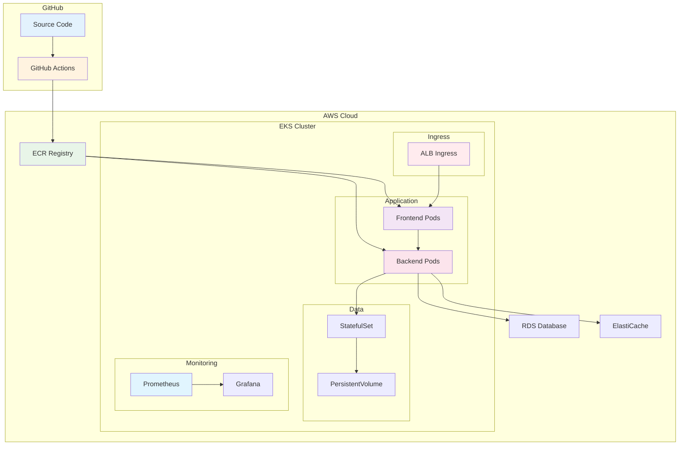

# November Week 4: EKS 실전 + CI/CD 자동화

<div align="center">

**☸️ Kubernetes on AWS** • **🚀 CI/CD** • **📊 모니터링** • **🎯 프로덕션 배포**

*EKS 완전 정복 + 자동화 파이프라인*

</div>

---

## 🎯 Week 4 목표

### 전체 학습 목표
- EKS 클러스터 구축 및 운영 완전 습득
- Kubernetes 워크로드 배포 및 관리
- Helm을 통한 패키지 관리
- GitHub Actions로 CI/CD 파이프라인 구축
- 프로덕션급 모니터링 및 로깅 시스템

### 주간 성과물
- Terraform으로 관리되는 EKS 클러스터
- Kubernetes 기반 마이크로서비스 배포
- Helm Chart 패키지
- GitHub Actions CI/CD 파이프라인
- Prometheus + Grafana 모니터링 시스템

---

## 📊 학습 구조

### 일일 시간표 (Day 1-4)
```
09:00-09:40  Session 1: 핵심 주제 1 (40분)
09:40-10:20  Session 2: 핵심 주제 2 (40분)
10:20-11:00  Session 3: 핵심 주제 3 (40분)
11:00-12:00  강사 Demo + Q&A (60분) ⭐
```

### Day 5 특별 구성
```
09:00-09:40  November 전체 복습 (40분)
09:40-10:20  기본 프로젝트 소개 (40분)
10:20-11:00  팀 구성 & 주제 선정 (40분)
11:00-12:00  Q&A & 준비 (60분)
```

### 학습 방식
- **이론 중심**: NW1 템플릿 기반 체계적 학습
- **강사 데모**: 완벽하게 검증된 환경에서 시연
- **비용 절감**: 강사 계정만 사용, 학생 부담 없음
- **이해 집중**: 실습 부담 없이 개념 이해에 집중

---

## 📅 주간 커리큘럼

### Day 1 (월): EKS 클러스터 구축
**시간**: 09:00-12:00

**이론**:
- Session 1: **EKS 아키텍처** (40분)
  - EKS Control Plane
  - Worker Node (Managed Node Group)
  - Fargate Profile
  - VPC 네트워킹 (CNI)

- Session 2: **Terraform으로 EKS 구축** (40분)
  - EKS Module 활용
  - Node Group 설정
  - IAM Role & Policy
  - kubectl 설정

- Session 3: **EKS 보안** (40분)
  - RBAC (Role-Based Access Control)
  - Pod Security Policy
  - Network Policy
  - Secrets 관리

**강사 Demo**:
- Demo: Terraform으로 EKS 클러스터 생성 (60분)
  - VPC + EKS Cluster 생성 시연
  - Managed Node Group 구성
  - kubectl 연결 및 기본 명령어
  - 간단한 워크로드 배포 데모
  - **검증**: 모든 리소스 정상 동작 확인
  - Q&A 및 트러블슈팅 공유

**학습 포인트**:
- EKS 아키텍처 이해
- Terraform으로 EKS 관리
- Kubernetes 보안 기초

---

### Day 2 (화): Kubernetes 워크로드 배포
**시간**: 09:00-12:00

**이론**:
- Session 1: **Deployment & Service** (40분)
  - Deployment 전략 (Rolling, Blue/Green)
  - Service 타입 (ClusterIP, NodePort, LoadBalancer)
  - Ingress Controller (ALB Ingress)
  - ConfigMap & Secret

- Session 2: **StatefulSet & PersistentVolume** (40분)
  - StatefulSet 개념
  - EBS CSI Driver
  - PersistentVolumeClaim
  - 데이터베이스 배포

- Session 3: **HPA & Cluster Autoscaler** (40분)
  - Horizontal Pod Autoscaler
  - Cluster Autoscaler
  - Metrics Server
  - 리소스 관리

**강사 Demo**:
- Demo: 마이크로서비스 배포 (60분)
  - Frontend + Backend + Database 배포 시연
  - ALB Ingress 설정 및 동작 확인
  - Auto Scaling 구성 및 테스트
  - 데이터 영속성 검증
  - **검증**: 전체 스택 정상 동작 확인
  - Q&A 및 베스트 프랙티스 공유

**학습 포인트**:
- Kubernetes 워크로드 관리
- 고가용성 배포
- 자동 확장

---

### Day 3 (수): Helm & 패키지 관리
**시간**: 09:00-12:00

**이론**:
- Session 1: **Helm 기초** (40분)
  - Helm이 필요한 이유
  - Chart 구조
  - Values 파일
  - Release 관리

- Session 2: **Helm Chart 작성** (40분)
  - Chart 템플릿
  - 조건문 & 반복문
  - 의존성 관리
  - Chart Repository

- Session 3: **실무 Helm 활용** (40분)
  - Prometheus Stack
  - Ingress Controller
  - Cert-Manager
  - 애플리케이션 Chart

**강사 Demo**:
- Demo: Helm으로 전체 스택 배포 (60분)
  - 커스텀 Chart 작성 시연
  - Prometheus + Grafana 설치
  - 애플리케이션 배포 및 설정
  - 업그레이드 & 롤백 데모
  - **검증**: Chart 정상 동작 및 Release 관리
  - Q&A 및 Chart 작성 팁 공유

**학습 포인트**:
- Helm 패키지 관리
- Chart 작성 및 배포
- 실무 도구 활용

---

### Day 4 (목): CI/CD 파이프라인
**시간**: 09:00-12:00

**이론**:
- Session 1: **GitHub Actions 기초** (40분)
  - Workflow 구조
  - Trigger (push, pull_request)
  - Jobs & Steps
  - Secrets 관리

- Session 2: **Docker 이미지 빌드 & 푸시** (40분)
  - Dockerfile 최적화
  - Multi-stage Build
  - ECR 푸시
  - 이미지 태깅 전략

- Session 3: **Kubernetes 배포 자동화** (40분)
  - kubectl apply
  - Helm upgrade
  - ArgoCD 소개
  - GitOps 개념

**강사 Demo**:
- Demo: GitHub Actions CI/CD 구축 (60분)
  - 코드 푸시 → 이미지 빌드 → ECR 푸시 전체 흐름
  - EKS 배포 자동화 시연
  - 롤링 업데이트 동작 확인
  - 배포 검증 및 롤백 데모
  - **검증**: 전체 파이프라인 정상 동작
  - Q&A 및 CI/CD 베스트 프랙티스

**학습 포인트**:
- CI/CD 파이프라인 구축
- 자동화된 배포
- GitOps 개념

---

### Day 5 (금): November 전체 복습 & 기본 프로젝트 준비
**시간**: 09:00-12:00

**Session 1: November 전체 복습** (40분)
- **Week 1-2 복습**:
  - AWS 핵심 서비스 (VPC, EC2, RDS, S3, Lambda)
  - 기본 웹 아키텍처 패턴
  - Terraform 기초 문법
  
- **Week 3 복습**:
  - Terraform 심화 (Module, Data Source)
  - Remote State & Backend
  - 환경 관리 전략
  
- **Week 4 복습**:
  - EKS 아키텍처
  - Kubernetes 워크로드
  - Helm & CI/CD

**Session 2: 기본 프로젝트 소개** (40분)
- **프로젝트 개요**:
  - 4주 일정 및 목표
  - 평가 기준
  - 산출물 요구사항
  
- **기술 스택**:
  - AWS 서비스 선택 가이드
  - Terraform IaC
  - Kubernetes/EKS (선택)
  - CI/CD 파이프라인
  
- **프로젝트 주제 예시**:
  - 웹 서비스 플랫폼
  - 마이크로서비스 아키텍처
  - 서버리스 애플리케이션
  - 데이터 파이프라인

**Session 3: 팀 구성 & 주제 선정** (40분)
- **팀 구성**:
  - 3-4명 팀 구성
  - 역할 분담 (인프라, 개발, DevOps)
  - 협업 도구 설정 (GitHub, Slack)
  
- **주제 선정**:
  - 팀별 아이디어 브레인스토밍
  - 기술 스택 결정
  - 아키텍처 초안 작성
  
- **계획 수립**:
  - 주간 마일스톤 설정
  - 작업 분배
  - 리스크 식별

**Q&A & 준비** (60분)
- **질문 시간**:
  - November 학습 내용 질문
  - 프로젝트 관련 질문
  - 기술 선택 상담
  
- **프로젝트 준비**:
  - GitHub Repository 생성
  - AWS 계정 확인
  - 개발 환경 설정
  - 다음 주 준비사항 확인

**학습 포인트**:
- November 전체 내용 체계적 정리
- 프로젝트 방향성 설정
- 팀 협업 체계 구축
- 기본 프로젝트 준비 완료

---

## 🏗️ Week 4 최종 아키텍처



---

## 📊 Week 4 핵심 기술

### Kubernetes on AWS
1. **EKS** - Managed Kubernetes
2. **Managed Node Group** - Worker Node 관리
3. **ALB Ingress Controller** - 로드 밸런싱
4. **EBS CSI Driver** - 영속적 스토리지
5. **Cluster Autoscaler** - 자동 확장

### 패키지 관리
6. **Helm** - Kubernetes 패키지 관리
7. **Helm Chart** - 재사용 가능한 템플릿

### CI/CD
8. **GitHub Actions** - 자동화 파이프라인
9. **ECR** - 컨테이너 이미지 저장소
10. **GitOps** - 선언적 배포

### 모니터링
11. **Prometheus** - 메트릭 수집
12. **Grafana** - 시각화
13. **CloudWatch Container Insights** - AWS 통합 모니터링

---

## 💰 주간 예상 비용

### 강사 Demo 방식 비용
| Day | 주요 리소스 | 비용 부담 |
|-----|------------|-----------|
| Day 1 | EKS Cluster + Node Group | 강사 계정 |
| Day 2 | EKS + 워크로드 | 강사 계정 |
| Day 3 | EKS + Helm Stack | 강사 계정 |
| Day 4 | EKS + CI/CD | 강사 계정 |
| Day 5 | 복습 (리소스 없음) | 비용 없음 |
| **학생 부담** | | **$0** ⭐ |

### 강사 계정 예상 비용
- **EKS Control Plane**: $0.10/hour × 4일 × 1시간 = $0.40
- **Worker Node (t3.medium)**: $0.0416/hour × 4일 × 1시간 = $0.17
- **ALB**: $0.0225/hour × 4일 × 1시간 = $0.09
- **EBS**: 최소 비용
- **합계**: 약 $0.70 (강사 부담)

### Demo 방식의 장점
- ✅ **학생 비용 부담 없음**: 강사 계정만 사용
- ✅ **완벽한 환경**: 사전 검증된 환경에서 시연
- ✅ **시간 효율**: 실습 오류 없이 빠른 진행
- ✅ **이해 집중**: 개념 이해에 집중 가능
- ✅ **질문 시간**: 충분한 Q&A 시간 확보

---

## ✅ Week 4 완료 체크리스트

### 이론 학습
- [ ] EKS 아키텍처 이해
- [ ] Terraform으로 EKS 관리 방법 학습
- [ ] Kubernetes 워크로드 개념 습득
- [ ] Helm 패키지 관리 이해
- [ ] CI/CD 파이프라인 구조 파악

### Demo 관찰 및 이해
- [ ] EKS 클러스터 생성 과정 이해
- [ ] Kubernetes 리소스 배포 흐름 파악
- [ ] Helm Chart 작성 및 배포 방법 학습
- [ ] GitHub Actions 워크플로우 이해
- [ ] 전체 아키텍처 통합 이해

### 기본 프로젝트 준비
- [ ] November 전체 내용 복습 완료
- [ ] 팀 구성 및 역할 분담
- [ ] 프로젝트 주제 선정
- [ ] 기술 스택 결정
- [ ] GitHub Repository 생성
- [ ] 주간 마일스톤 설정

---

## 🔗 기본 프로젝트 준비

### 기본 프로젝트 예고 (4주)
- **Week 1**: 프로젝트 기획 및 설계
- **Week 2**: 인프라 구축 (Terraform + EKS)
- **Week 3**: 애플리케이션 개발 및 배포
- **Week 4**: CI/CD + 모니터링 + 최종 발표

### 사전 준비사항
- November Week 1-4 전체 복습
- AWS 서비스 정리
- Terraform 코드 정리
- Kubernetes 개념 복습
- 팀 구성 및 역할 분담

---

## 📚 November 전체 학습 정리

### Week 1: AWS 기초
- VPC, EC2, RDS, S3, CloudFront
- Lambda, ElastiCache
- 기본 웹 아키텍처

### Week 2: AWS 실무 서비스
- SQS, SNS, API Gateway, Cognito
- ECR, ECS, Fargate
- Parameter Store, EventBridge
- Terraform 기초

### Week 3: Terraform 마스터
- 프로그래밍 기술 (for_each, count)
- Module & 환경 분리
- Remote State
- Kubernetes 기초

### Week 4: EKS 실전
- EKS 클러스터 구축
- Kubernetes 워크로드
- Helm 패키지 관리
- CI/CD 파이프라인
- 모니터링 & 로깅

---

<div align="center">

**☸️ EKS 완전 정복** • **🚀 CI/CD 자동화** • **📊 프로덕션 모니터링** • **🎯 실전 배포**

*Week 4: Kubernetes on AWS + 자동화 완성*

</div>
