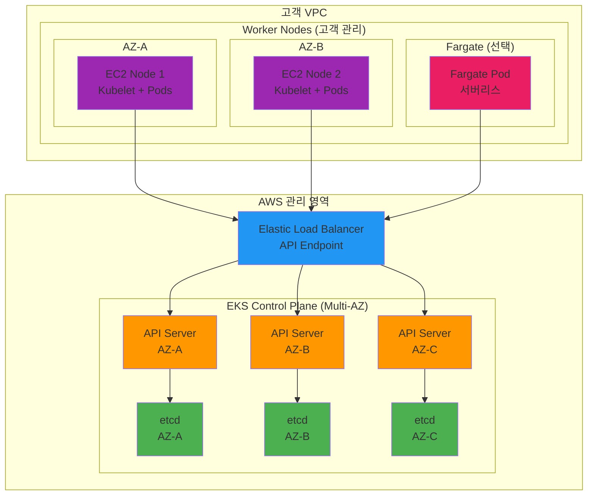

# November Week 4 Day 1 Session 1: EKS 아키텍처

<div align="center">

**☸️ Amazon EKS** • **🏗️ Control Plane** • **💻 Worker Nodes** • **🌐 VPC 네트워킹**

*AWS의 관리형 Kubernetes 서비스 완전 이해*

</div>

---

## 🕘 세션 정보
**시간**: 09:00-09:40 (40분)
**목표**: EKS 아키텍처 및 핵심 구성 요소 이해
**방식**: 이론 강의 + AWS 문서 참조

## 🎯 학습 목표
- EKS가 필요한 이유 이해
- Control Plane과 Worker Node 구조 파악
- EKS 네트워킹 (VPC CNI) 이해
- Managed Node Group vs Fargate 비교

---

## 📖 서비스 개요

### 1. 생성 배경 (Why?) - 5분

**문제 상황**:
- **Self-managed Kubernetes의 복잡성**: Control Plane 직접 관리 (etcd, API Server, Scheduler)
- **고가용성 구축 어려움**: Multi-AZ Control Plane 구성 복잡
- **운영 부담**: 업그레이드, 패치, 백업 수동 관리
- **AWS 통합 부족**: IAM, VPC, ELB 등 AWS 서비스 연동 복잡

**🏠 실생활 비유**:
- **Self-managed K8s**: 자동차를 직접 조립하고 정비 (엔진, 브레이크, 전기 시스템 모두 관리)
- **Amazon EKS**: 완성된 자동차 구매 + 정비소 서비스 (운전에만 집중)
  - AWS가 엔진(Control Plane) 관리
  - 사용자는 운전(애플리케이션 배포)에만 집중
  - 정기 점검(업그레이드)은 AWS가 자동 처리

**Amazon EKS 솔루션**:
- **관리형 Control Plane**: AWS가 고가용성 Control Plane 자동 관리
- **AWS 통합**: IAM, VPC, ELB, ECR 등 네이티브 통합
- **자동 업그레이드**: Kubernetes 버전 업그레이드 간소화
- **보안 강화**: AWS 보안 모범 사례 자동 적용

---

### 2. 핵심 원리 (How?) - 10분

**EKS 아키텍처**:



**작동 원리**:

**1. Control Plane (AWS 관리)**:
- **API Server**: 
  - 모든 Kubernetes API 요청 처리
  - Multi-AZ 고가용성 (최소 3개 AZ)
  - ELB를 통한 단일 엔드포인트 제공
  
- **etcd**:
  - 클러스터 상태 저장소
  - Multi-AZ 복제로 데이터 보호
  - 자동 백업 및 복구
  
- **Scheduler & Controller Manager**:
  - Pod 스케줄링
  - 원하는 상태 유지
  - AWS가 자동 관리

**2. Worker Nodes (고객 관리)**:

**Managed Node Group**:
```hcl
# Terraform 예시
resource "aws_eks_node_group" "main" {
  cluster_name    = aws_eks_cluster.main.name
  node_group_name = "main-node-group"
  node_role_arn   = aws_iam_role.node.arn
  subnet_ids      = aws_subnet.private[*].id
  
  scaling_config {
    desired_size = 2
    max_size     = 4
    min_size     = 1
  }
  
  instance_types = ["t3.medium"]
}
```

**Fargate Profile** (서버리스):
```hcl
resource "aws_eks_fargate_profile" "main" {
  cluster_name           = aws_eks_cluster.main.name
  fargate_profile_name   = "main-fargate"
  pod_execution_role_arn = aws_iam_role.fargate.arn
  subnet_ids             = aws_subnet.private[*].id
  
  selector {
    namespace = "fargate-namespace"
  }
}
```

**3. VPC CNI (Container Network Interface)**:
- **ENI 기반**: 각 Pod가 VPC IP 주소 할당
- **네이티브 통합**: Security Group, Network ACL 직접 적용
- **성능**: VPC 네이티브 성능 (오버레이 네트워크 없음)

```
Pod IP = VPC IP
- Pod: 10.0.1.50
- VPC CIDR: 10.0.0.0/16
- Security Group 직접 적용 가능
```

---

### 3. 주요 사용 사례 (When?) - 5분

**EKS가 적합한 경우**:

1. **프로덕션 Kubernetes**:
   - 고가용성 필수
   - 24/7 운영
   - 자동 업그레이드 필요

2. **AWS 네이티브 통합**:
   - IAM 인증/인가
   - VPC 네트워킹
   - ELB 로드밸런싱
   - ECR 이미지 저장소

3. **운영 부담 최소화**:
   - Control Plane 관리 불필요
   - 자동 패치 및 업그레이드
   - AWS 지원 활용

4. **하이브리드 워크로드**:
   - EC2 + Fargate 혼합
   - 온프레미스 연결 (EKS Hybrid Nodes)

**실제 사례**:
- **Snap (Snapchat)**: 수천 개의 마이크로서비스를 EKS로 운영
- **GoDaddy**: 멀티 리전 EKS 클러스터로 글로벌 서비스
- **Intuit**: 세금 신고 시즌 트래픽 급증 대응

**💼 실무 시나리오**:
```
상황: 스타트업 → 중견 기업 성장

Self-managed K8s:
- Control Plane 3대 관리
- etcd 백업 수동 관리
- 업그레이드 계획 및 실행
- 장애 시 직접 복구
- 전담 인력 필요

Amazon EKS:
- Control Plane AWS 관리
- 자동 백업 및 복구
- 클릭 한 번으로 업그레이드
- AWS 지원 활용
- 애플리케이션에 집중
```

---

### 4. 비슷한 서비스 비교 (Which?) - 5분

**Managed Kubernetes 서비스 비교**:

| 기준 | Amazon EKS | GKE (Google) | AKS (Azure) | Self-managed |
|------|------------|--------------|-------------|--------------|
| **Control Plane 비용** | $0.10/hour | 무료 | 무료 | EC2 비용 |
| **AWS 통합** | 완벽 | 제한적 | 제한적 | 수동 설정 |
| **관리 범위** | Control Plane | Control Plane | Control Plane | 전체 |
| **업그레이드** | 간단 | 자동 | 자동 | 수동 |
| **고가용성** | Multi-AZ 자동 | Multi-Zone | Multi-Zone | 수동 구성 |
| **학습 곡선** | 중간 | 낮음 | 낮음 | 높음 |

**언제 EKS를 선택하는가?**:
- ✅ AWS 중심 인프라
- ✅ IAM 기반 인증/인가
- ✅ VPC 네이티브 네트워킹
- ✅ AWS 지원 필요
- ✅ 프로덕션 워크로드

**언제 대안을 선택하는가?**:
- **GKE**: Google Cloud 사용, 무료 Control Plane
- **AKS**: Azure 사용, Microsoft 생태계
- **Self-managed**: 완전한 제어 필요, 비용 최소화

---

### 5. 장단점 분석 - 3분

**장점**:
- ✅ **관리 부담 최소화**: Control Plane AWS 관리
- ✅ **고가용성**: Multi-AZ 자동 구성
- ✅ **AWS 통합**: IAM, VPC, ELB 네이티브 연동
- ✅ **보안**: AWS 보안 모범 사례 자동 적용
- ✅ **자동 업그레이드**: Kubernetes 버전 관리 간소화
- ✅ **확장성**: 100,000 노드까지 지원

**단점/제약사항**:
- ⚠️ **Control Plane 비용**: $0.10/hour ($73/month)
- ⚠️ **AWS 종속**: AWS 외 환경에서 사용 불가
- ⚠️ **제한된 커스터마이징**: Control Plane 직접 접근 불가
- ⚠️ **VPC IP 소진**: CNI가 많은 IP 사용

**대안**:
- 소규모/테스트: Kind, Minikube (로컬)
- 비용 민감: Self-managed Kubernetes
- 멀티 클라우드: Rancher, OpenShift

---

### 6. 비용 구조 💰 - 3분

**EKS 비용 구성**:

**Control Plane**:
- **고정 비용**: $0.10/hour ($73/month)
- **클러스터당**: 각 클러스터마다 부과
- **리전별**: 리전마다 동일

**Worker Nodes**:
- **EC2 비용**: 인스턴스 타입에 따라
- **Fargate 비용**: vCPU + 메모리 사용량

**예상 비용 (ap-northeast-2)**:

| 항목 | 사양 | 시간당 | 월간 (730시간) |
|------|------|--------|----------------|
| **Control Plane** | - | $0.10 | $73 |
| **t3.medium (2개)** | 2 vCPU, 4GB | $0.0832 | $60.74 |
| **EBS (gp3, 100GB)** | - | - | $8 |
| **ALB** | - | $0.0225 | $16.43 |
| **데이터 전송 (50GB)** | - | - | $4.50 |
| **합계** | | | **$162.67** |

**Fargate 비용 예시**:
```
Pod: 0.25 vCPU, 0.5GB 메모리
- vCPU: $0.04048/hour × 0.25 = $0.01012
- 메모리: $0.004445/GB/hour × 0.5 = $0.002223
- 합계: $0.012343/hour ($9.01/month)
```

**비용 최적화 팁**:
1. **Spot Instances**: Worker Node를 Spot으로 (최대 90% 절감)
2. **Fargate Spot**: Fargate도 Spot 가능 (70% 절감)
3. **Cluster Autoscaler**: 필요할 때만 노드 추가
4. **Karpenter**: 더 효율적인 노드 프로비저닝
5. **리소스 제한**: Pod에 적절한 requests/limits 설정

---

### 7. 최신 업데이트 🆕 - 2분

**2024년 주요 변경사항**:
- **EKS Auto Mode** (2024년 11월): 노드 자동 관리
  - AWS가 Worker Node까지 관리
  - 비용 최적화 자동화
  - 운영 부담 최소화
  
- **EKS Pod Identity**: IAM 역할 간소화
  - IRSA 대체
  - 더 간단한 설정
  
- **IPv6 지원**: Dual-stack 네트워킹
- **Kubernetes 1.30**: 최신 버전 지원

**2025년 예정**:
- **EKS Hybrid Nodes**: 온프레미스 노드 확대
- **AI/ML 워크로드**: GPU 스케줄링 개선
- **비용 최적화**: 더 세밀한 비용 제어

**참조**: 
- [EKS What's New](https://aws.amazon.com/eks/whats-new/)
- [EKS Roadmap](https://github.com/aws/containers-roadmap/projects/1)

---

### 8. 잘 사용하는 방법 ✅ - 3분

**베스트 프랙티스**:

**1. VPC 설계**:
```hcl
# 충분한 IP 주소 확보
resource "aws_vpc" "eks" {
  cidr_block = "10.0.0.0/16"  # 65,536 IP
  
  enable_dns_hostnames = true
  enable_dns_support   = true
}

# Private Subnet에 Worker Node 배치
resource "aws_subnet" "private" {
  count             = 3
  vpc_id            = aws_vpc.eks.id
  cidr_block        = "10.0.${count.index + 1}.0/24"
  availability_zone = data.aws_availability_zones.available.names[count.index]
}
```

**2. IAM 최소 권한**:
```hcl
# Cluster Role
resource "aws_iam_role" "cluster" {
  name = "eks-cluster-role"
  
  assume_role_policy = jsonencode({
    Version = "2012-10-17"
    Statement = [{
      Action = "sts:AssumeRole"
      Effect = "Allow"
      Principal = {
        Service = "eks.amazonaws.com"
      }
    }]
  })
}

# 필수 정책만 연결
resource "aws_iam_role_policy_attachment" "cluster_policy" {
  policy_arn = "arn:aws:iam::aws:policy/AmazonEKSClusterPolicy"
  role       = aws_iam_role.cluster.name
}
```

**3. 로깅 활성화**:
```hcl
resource "aws_eks_cluster" "main" {
  # ...
  
  enabled_cluster_log_types = [
    "api",
    "audit",
    "authenticator",
    "controllerManager",
    "scheduler"
  ]
}
```

**4. 보안 그룹 최소화**:
```hcl
# Control Plane Security Group
resource "aws_security_group" "cluster" {
  name        = "eks-cluster-sg"
  vpc_id      = aws_vpc.eks.id
  
  egress {
    from_port   = 0
    to_port     = 0
    protocol    = "-1"
    cidr_blocks = ["0.0.0.0/0"]
  }
}
```

**5. 태그 전략**:
```hcl
resource "aws_eks_cluster" "main" {
  # ...
  
  tags = {
    Environment = "production"
    ManagedBy   = "Terraform"
    Team        = "DevOps"
    CostCenter  = "Engineering"
  }
}
```

**실무 팁**:
- **Cluster Autoscaler**: 자동 노드 확장
- **Metrics Server**: HPA 필수
- **AWS Load Balancer Controller**: ALB Ingress
- **EBS CSI Driver**: 영속적 스토리지

---

### 9. 잘못 사용하는 방법 ❌ - 3분

**흔한 실수**:

**1. Public Subnet에 Worker Node**:
```hcl
# ❌ 나쁜 예
resource "aws_eks_node_group" "bad" {
  subnet_ids = aws_subnet.public[*].id  # Public Subnet
  # 보안 위험, 직접 인터넷 노출
}

# ✅ 좋은 예
resource "aws_eks_node_group" "good" {
  subnet_ids = aws_subnet.private[*].id  # Private Subnet
  # NAT Gateway 통해 인터넷 접근
}
```

**2. 단일 AZ 배포**:
```hcl
# ❌ 나쁜 예
resource "aws_eks_cluster" "bad" {
  vpc_config {
    subnet_ids = [aws_subnet.private[0].id]  # 단일 AZ
    # AZ 장애 시 클러스터 중단
  }
}

# ✅ 좋은 예
resource "aws_eks_cluster" "good" {
  vpc_config {
    subnet_ids = aws_subnet.private[*].id  # Multi-AZ
    # 고가용성 확보
  }
}
```

**3. IP 주소 부족**:
```hcl
# ❌ 나쁜 예
resource "aws_vpc" "bad" {
  cidr_block = "10.0.0.0/24"  # 256 IP (너무 작음)
  # Pod 수 제한, 확장 불가
}

# ✅ 좋은 예
resource "aws_vpc" "good" {
  cidr_block = "10.0.0.0/16"  # 65,536 IP
  # 충분한 IP 주소 확보
}
```

**4. 로깅 비활성화**:
```hcl
# ❌ 나쁜 예
resource "aws_eks_cluster" "bad" {
  # enabled_cluster_log_types 없음
  # 문제 발생 시 디버깅 어려움
}

# ✅ 좋은 예
resource "aws_eks_cluster" "good" {
  enabled_cluster_log_types = ["api", "audit", "authenticator"]
  # CloudWatch Logs로 중앙 관리
}
```

**5. 과도한 권한**:
```hcl
# ❌ 나쁜 예
resource "aws_iam_role_policy" "bad" {
  policy = jsonencode({
    Statement = [{
      Effect   = "Allow"
      Action   = "*"  # 모든 권한
      Resource = "*"
    }]
  })
}

# ✅ 좋은 예
resource "aws_iam_role_policy_attachment" "good" {
  policy_arn = "arn:aws:iam::aws:policy/AmazonEKSClusterPolicy"
  # 필요한 권한만
}
```

**안티 패턴**:
- **Public API Endpoint**: 인터넷에 API 노출
- **Root 계정 사용**: IAM User/Role 사용 필수
- **버전 고정 없음**: Terraform Provider 버전 지정
- **백업 없음**: etcd 백업 전략 필요 (EKS는 자동)

---

### 10. 구성 요소 상세 - 3분

**EKS 클러스터 구성 요소**:

**1. Control Plane**:
- **API Server**:
  - 역할: 모든 Kubernetes API 요청 처리
  - 고가용성: Multi-AZ 배포 (최소 3개)
  - 엔드포인트: ELB를 통한 단일 엔드포인트
  
- **etcd**:
  - 역할: 클러스터 상태 저장
  - 복제: Multi-AZ 자동 복제
  - 백업: AWS 자동 백업
  
- **Scheduler**:
  - 역할: Pod를 Node에 배치
  - 고려사항: 리소스, Affinity, Taint/Toleration
  
- **Controller Manager**:
  - 역할: 원하는 상태 유지
  - 컨트롤러: Deployment, ReplicaSet, Service 등

**2. Worker Nodes**:

**Managed Node Group**:
```hcl
resource "aws_eks_node_group" "main" {
  cluster_name    = aws_eks_cluster.main.name
  node_group_name = "main"
  node_role_arn   = aws_iam_role.node.arn
  subnet_ids      = aws_subnet.private[*].id
  
  scaling_config {
    desired_size = 2
    max_size     = 4
    min_size     = 1
  }
  
  update_config {
    max_unavailable = 1
  }
  
  instance_types = ["t3.medium"]
  capacity_type  = "ON_DEMAND"  # or "SPOT"
  
  labels = {
    role = "general"
  }
  
  tags = {
    Name = "eks-node-group"
  }
}
```

**Fargate Profile**:
```hcl
resource "aws_eks_fargate_profile" "main" {
  cluster_name           = aws_eks_cluster.main.name
  fargate_profile_name   = "main"
  pod_execution_role_arn = aws_iam_role.fargate.arn
  subnet_ids             = aws_subnet.private[*].id
  
  selector {
    namespace = "fargate-namespace"
    labels = {
      fargate = "true"
    }
  }
}
```

**3. VPC CNI**:
- **ENI 기반**: 각 Node에 ENI 연결
- **IP 할당**: Pod마다 VPC IP 할당
- **보안**: Security Group 직접 적용
- **성능**: VPC 네이티브 성능

**4. Add-ons**:
- **CoreDNS**: 클러스터 DNS
- **kube-proxy**: 네트워크 프록시
- **VPC CNI**: 네트워킹
- **EBS CSI Driver**: 영속적 스토리지 (선택)

---

### 11. 공식 문서 링크 (필수 5개)

**⚠️ 학생들이 직접 확인해야 할 공식 문서**:
- 📘 [Amazon EKS란?](https://docs.aws.amazon.com/eks/latest/userguide/what-is-eks.html)
- 📗 [EKS 아키텍처](https://docs.aws.amazon.com/eks/latest/userguide/eks-architecture.html)
- 📙 [EKS API 레퍼런스](https://docs.aws.amazon.com/eks/latest/APIReference/Welcome.html)
- 📕 [EKS 요금](https://aws.amazon.com/eks/pricing/)
- 🆕 [EKS 최신 업데이트](https://aws.amazon.com/eks/whats-new/)

---

## 💭 함께 생각해보기

### 🤝 페어 토론 (5분)

**토론 주제**:
1. **EKS vs Self-managed Kubernetes**:
   - 우리 프로젝트에 EKS가 적합한가?
   - Control Plane 관리 부담 vs 비용 ($73/month)
   - 팀의 Kubernetes 운영 경험은?

2. **Worker Node 선택**:
   - Managed Node Group vs Fargate?
   - 언제 Fargate를 사용하는가?
   - 비용 vs 관리 편의성

3. **VPC 설계**:
   - CIDR 블록 크기는 얼마나?
   - Public vs Private Subnet 전략
   - Multi-AZ 구성 방법

---

## 🔑 핵심 키워드

- **Amazon EKS**: AWS의 관리형 Kubernetes 서비스
- **Control Plane**: AWS가 관리하는 Kubernetes 관리 영역
- **Worker Node**: 실제 워크로드가 실행되는 EC2 인스턴스
- **Managed Node Group**: AWS가 관리하는 Worker Node 그룹
- **Fargate**: 서버리스 컨테이너 실행 환경
- **VPC CNI**: VPC 네이티브 네트워킹 플러그인
- **Multi-AZ**: 고가용성을 위한 다중 가용 영역 배포

---

## 📝 세션 마무리

### ✅ 오늘 세션 성과
- [ ] EKS 아키텍처 이해 (Control Plane + Worker Node)
- [ ] Managed Node Group vs Fargate 차이 파악
- [ ] VPC CNI 네트워킹 개념 습득
- [ ] EKS 비용 구조 이해

### 🎯 다음 세션 준비
**Session 2: Terraform으로 EKS 구축**
- EKS Module 활용 방법
- IAM Role & Policy 설정
- kubectl 연결 및 기본 명령어

### 🔗 관련 자료
- [EKS Workshop](https://www.eksworkshop.com/)
- [EKS Best Practices Guide](https://aws.github.io/aws-eks-best-practices/)
- [Terraform EKS Module](https://registry.terraform.io/modules/terraform-aws-modules/eks/aws/latest)

---

<div align="center">

**☸️ EKS 아키텍처** • **🏗️ Control Plane** • **💻 Worker Nodes** • **🌐 VPC 네트워킹**

*다음 세션에서 Terraform으로 직접 구축!*

</div>
