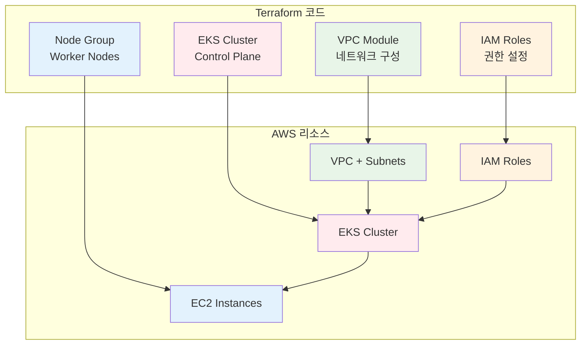

# November Week 4 Day 1 Session 2: Terraform으로 EKS 구축

<div align="center">

**🏗️ Terraform EKS Module** • **🔐 IAM Roles** • **⚙️ Node Group** • **🔧 kubectl 설정**

*Infrastructure as Code로 EKS 클러스터 자동화*

</div>

---

## 🕘 세션 정보
**시간**: 09:40-10:20 (40분)
**목표**: Terraform으로 EKS 클러스터 구축 방법 습득
**방식**: 이론 강의 + 코드 예시

## 🎯 학습 목표
- Terraform EKS Module 활용 방법 이해
- IAM Role 및 Policy 설정 방법 습득
- Node Group 구성 방법 파악
- kubectl 연결 및 기본 명령어 학습

---

## 📖 서비스 개요

### 1. 생성 배경 (Why?) - 5분

**문제 상황**:
- **수동 클러스터 생성의 복잡성**: AWS Console에서 클릭 수십 번
- **재현성 부족**: 동일한 환경 재생성 어려움
- **환경 관리 어려움**: dev, staging, prod 각각 수동 설정
- **변경 추적 불가**: 누가 언제 무엇을 변경했는지 모름

**🏠 실생활 비유**:
- **수동 생성**: 집을 지을 때 매번 구두로 지시 (오류 발생, 일관성 없음)
- **Terraform**: 건축 설계도 (blueprint)
  - 설계도대로 정확히 시공
  - 같은 설계도로 여러 집 건설
  - 변경 사항 설계도에 기록
  - Git으로 버전 관리

**Terraform IaC 솔루션**:
- **코드로 관리**: 모든 인프라를 코드로 정의
- **재현 가능**: 동일한 환경 언제든 재생성
- **버전 관리**: Git으로 변경 이력 추적
- **자동화**: CI/CD 파이프라인 통합

---

### 2. 핵심 원리 (How?) - 10분

**Terraform EKS 구축 흐름**:



**작동 원리**:

**1. VPC 구성**:
```hcl
module "vpc" {
  source  = "terraform-aws-modules/vpc/aws"
  version = "~> 5.0"
  
  name = "eks-vpc"
  cidr = "10.0.0.0/16"
  
  azs             = ["ap-northeast-2a", "ap-northeast-2b", "ap-northeast-2c"]
  private_subnets = ["10.0.1.0/24", "10.0.2.0/24", "10.0.3.0/24"]
  public_subnets  = ["10.0.101.0/24", "10.0.102.0/24", "10.0.103.0/24"]
  
  enable_nat_gateway = true
  single_nat_gateway = false  # Multi-AZ NAT
  
  # EKS 필수 태그
  public_subnet_tags = {
    "kubernetes.io/role/elb" = "1"
  }
  
  private_subnet_tags = {
    "kubernetes.io/role/internal-elb" = "1"
  }
  
  tags = {
    Environment = "production"
    ManagedBy   = "Terraform"
  }
}
```

**2. IAM Roles**:
```hcl
# Cluster Role
resource "aws_iam_role" "cluster" {
  name = "eks-cluster-role"
  
  assume_role_policy = jsonencode({
    Version = "2012-10-17"
    Statement = [{
      Action = "sts:AssumeRole"
      Effect = "Allow"
      Principal = {
        Service = "eks.amazonaws.com"
      }
    }]
  })
}

resource "aws_iam_role_policy_attachment" "cluster_policy" {
  policy_arn = "arn:aws:iam::aws:policy/AmazonEKSClusterPolicy"
  role       = aws_iam_role.cluster.name
}

# Node Role
resource "aws_iam_role" "node" {
  name = "eks-node-role"
  
  assume_role_policy = jsonencode({
    Version = "2012-10-17"
    Statement = [{
      Action = "sts:AssumeRole"
      Effect = "Allow"
      Principal = {
        Service = "ec2.amazonaws.com"
      }
    }]
  })
}

resource "aws_iam_role_policy_attachment" "node_policy" {
  for_each = toset([
    "arn:aws:iam::aws:policy/AmazonEKSWorkerNodePolicy",
    "arn:aws:iam::aws:policy/AmazonEKS_CNI_Policy",
    "arn:aws:iam::aws:policy/AmazonEC2ContainerRegistryReadOnly"
  ])
  
  policy_arn = each.value
  role       = aws_iam_role.node.name
}
```

**3. EKS Cluster**:
```hcl
module "eks" {
  source  = "terraform-aws-modules/eks/aws"
  version = "~> 20.0"
  
  cluster_name    = "my-eks-cluster"
  cluster_version = "1.30"
  
  vpc_id     = module.vpc.vpc_id
  subnet_ids = module.vpc.private_subnets
  
  # Cluster Endpoint 설정
  cluster_endpoint_public_access  = true
  cluster_endpoint_private_access = true
  
  # 로깅 활성화
  cluster_enabled_log_types = ["api", "audit", "authenticator"]
  
  # EKS Managed Node Group
  eks_managed_node_groups = {
    general = {
      desired_size = 2
      min_size     = 1
      max_size     = 4
      
      instance_types = ["t3.medium"]
      capacity_type  = "ON_DEMAND"
      
      labels = {
        role = "general"
      }
      
      tags = {
        Name = "eks-node-group-general"
      }
    }
  }
  
  tags = {
    Environment = "production"
    ManagedBy   = "Terraform"
  }
}
```

**4. kubectl 설정**:
```bash
# kubeconfig 생성
aws eks update-kubeconfig \
  --region ap-northeast-2 \
  --name my-eks-cluster

# 연결 확인
kubectl get nodes
kubectl get pods -A
```

---

### 3. 주요 사용 사례 (When?) - 5분

**Terraform EKS가 적합한 경우**:

1. **멀티 환경 관리**:
   - dev, staging, prod 동일 구성
   - 환경별 변수만 변경
   - 일관성 보장

2. **팀 협업**:
   - Git으로 코드 리뷰
   - 변경 이력 추적
   - 롤백 가능

3. **CI/CD 통합**:
   - GitHub Actions 자동 배포
   - Terraform Cloud 연동
   - GitOps 워크플로우

4. **대규모 인프라**:
   - 여러 클러스터 관리
   - 표준화된 구성
   - 재사용 가능한 모듈

**실제 사례**:
- **Gruntwork**: Terraform Module 라이브러리로 수백 개 클러스터 관리
- **HashiCorp**: 자사 제품을 Terraform으로 배포
- **Atlassian**: 멀티 리전 EKS 클러스터 자동화

**💼 실무 시나리오**:
```
상황: 새로운 환경 추가 필요

수동 방식:
1. AWS Console 로그인
2. VPC 생성 (30분)
3. EKS 클러스터 생성 (20분)
4. Node Group 생성 (15분)
5. kubectl 설정 (10분)
합계: 75분 + 오류 가능성

Terraform 방식:
1. tfvars 파일 복사
2. 환경 변수 수정
3. terraform apply
합계: 5분 + 자동 실행 15분
```

---

### 4. 비슷한 서비스 비교 (Which?) - 5분

**IaC 도구 비교**:

| 기준 | Terraform | CloudFormation | eksctl | Pulumi |
|------|-----------|----------------|--------|--------|
| **언어** | HCL | JSON/YAML | YAML | 프로그래밍 언어 |
| **멀티 클라우드** | ✅ | ❌ (AWS 전용) | ❌ (EKS 전용) | ✅ |
| **State 관리** | 수동 | AWS 관리 | 없음 | Pulumi Cloud |
| **EKS 지원** | Module | 완벽 | 전용 | 완벽 |
| **학습 곡선** | 중간 | 높음 | 낮음 | 높음 |
| **커뮤니티** | 매우 큰 | 큰 | 중간 | 작음 |

**언제 Terraform을 선택하는가?**:
- ✅ 멀티 클라우드 전략
- ✅ 표준화된 IaC 도구
- ✅ 재사용 가능한 모듈
- ✅ 풍부한 커뮤니티

**언제 대안을 선택하는가?**:
- **CloudFormation**: AWS 전용, AWS 지원 필요
- **eksctl**: 빠른 프로토타입, 간단한 클러스터
- **Pulumi**: 프로그래밍 언어 선호, 복잡한 로직

---

### 5. 장단점 분석 - 3분

**장점**:
- ✅ **재현 가능**: 동일한 환경 언제든 재생성
- ✅ **버전 관리**: Git으로 변경 이력 추적
- ✅ **모듈화**: 재사용 가능한 코드
- ✅ **멀티 클라우드**: AWS, GCP, Azure 모두 지원
- ✅ **커뮤니티**: 풍부한 모듈과 예제

**단점/제약사항**:
- ⚠️ **State 관리**: Remote State 설정 필요
- ⚠️ **학습 곡선**: HCL 문법 학습 필요
- ⚠️ **실행 시간**: 대규모 인프라는 시간 소요
- ⚠️ **에러 처리**: 실패 시 수동 복구 필요

**대안**:
- 간단한 클러스터: eksctl로 빠른 시작
- AWS 전용: CloudFormation 고려
- 프로그래밍 선호: Pulumi 검토

---

### 6. 비용 구조 💰 - 3분

**Terraform 자체 비용**:
- **오픈소스**: 무료
- **Terraform Cloud**:
  - Free: 5명까지 무료
  - Team: $20/user/month
  - Business: 커스텀 가격

**EKS 리소스 비용** (ap-northeast-2):
```
Terraform으로 생성하는 리소스:
- EKS Control Plane: $0.10/hour ($73/month)
- t3.medium × 2: $0.0832/hour ($60.74/month)
- NAT Gateway × 3: $0.045/hour × 3 ($98.55/month)
- EBS (gp3, 100GB): $8/month
---
합계: ~$240/month
```

**비용 최적화 팁**:
1. **Single NAT Gateway**: Multi-AZ 대신 단일 NAT (dev 환경)
```hcl
module "vpc" {
  # ...
  single_nat_gateway = true  # $98.55 → $32.85
}
```

2. **Spot Instances**: Worker Node를 Spot으로
```hcl
eks_managed_node_groups = {
  spot = {
    capacity_type = "SPOT"  # 최대 90% 절감
  }
}
```

3. **Cluster Autoscaler**: 필요할 때만 노드 추가
4. **리소스 태그**: 비용 추적 및 분석

---

### 7. 최신 업데이트 🆕 - 2분

**2024년 주요 변경사항**:
- **Terraform AWS Provider 5.x**: 
  - EKS Auto Mode 지원
  - Pod Identity 간소화
  - 성능 개선
  
- **EKS Module 20.x**:
  - Kubernetes 1.30 지원
  - 간소화된 설정
  - 더 나은 기본값

**2025년 예정**:
- **Terraform 2.0**: 주요 아키텍처 개선
- **EKS Hybrid Nodes**: Terraform 지원 확대
- **AI 기반 코드 생성**: Copilot 통합

**참조**: 
- [Terraform AWS Provider Changelog](https://github.com/hashicorp/terraform-provider-aws/blob/main/CHANGELOG.md)
- [EKS Module Releases](https://github.com/terraform-aws-modules/terraform-aws-eks/releases)

---

### 8. 잘 사용하는 방법 ✅ - 3분

**베스트 프랙티스**:

**1. 디렉토리 구조**:
```
terraform-eks/
├── main.tf           # 주요 리소스
├── variables.tf      # 입력 변수
├── outputs.tf        # 출력 값
├── versions.tf       # Provider 버전
├── terraform.tfvars  # 변수 값 (gitignore)
├── dev.tfvars       # 개발 환경
├── prod.tfvars      # 프로덕션 환경
└── modules/
    ├── vpc/
    └── eks/
```

**2. 변수 관리**:
```hcl
# variables.tf
variable "cluster_name" {
  description = "Name of the EKS cluster"
  type        = string
  
  validation {
    condition     = length(var.cluster_name) <= 40
    error_message = "Cluster name must be 40 characters or less"
  }
}

variable "cluster_version" {
  description = "Kubernetes version"
  type        = string
  default     = "1.30"
}

# dev.tfvars
cluster_name    = "dev-eks-cluster"
cluster_version = "1.30"
instance_types  = ["t3.medium"]
desired_size    = 2
```

**3. Remote State**:
```hcl
terraform {
  backend "s3" {
    bucket         = "my-terraform-state"
    key            = "eks/terraform.tfstate"
    region         = "ap-northeast-2"
    encrypt        = true
    dynamodb_table = "terraform-locks"
  }
}
```

**4. 출력 값**:
```hcl
# outputs.tf
output "cluster_endpoint" {
  description = "Endpoint for EKS control plane"
  value       = module.eks.cluster_endpoint
}

output "cluster_name" {
  description = "Kubernetes Cluster Name"
  value       = module.eks.cluster_name
}

output "configure_kubectl" {
  description = "Configure kubectl command"
  value       = "aws eks update-kubeconfig --region ap-northeast-2 --name ${module.eks.cluster_name}"
}
```

**5. 태그 전략**:
```hcl
locals {
  common_tags = {
    Environment = var.environment
    ManagedBy   = "Terraform"
    Project     = "EKS-Demo"
    CostCenter  = "Engineering"
  }
}

module "eks" {
  # ...
  tags = local.common_tags
}
```

---

### 9. 잘못 사용하는 방법 ❌ - 3분

**흔한 실수**:

**1. 하드코딩**:
```hcl
# ❌ 나쁜 예
module "eks" {
  cluster_name = "production-eks-cluster"  # 하드코딩
  vpc_id       = "vpc-12345678"
}

# ✅ 좋은 예
module "eks" {
  cluster_name = var.cluster_name
  vpc_id       = module.vpc.vpc_id
}
```

**2. 버전 고정 없음**:
```hcl
# ❌ 나쁜 예
module "eks" {
  source = "terraform-aws-modules/eks/aws"
  # 버전 지정 없음 → 예상치 못한 변경
}

# ✅ 좋은 예
module "eks" {
  source  = "terraform-aws-modules/eks/aws"
  version = "~> 20.0"  # 20.x 버전 사용
}
```

**3. 민감 정보 노출**:
```hcl
# ❌ 나쁜 예
variable "db_password" {
  default = "MyPassword123!"  # 코드에 직접 입력
}

# ✅ 좋은 예
variable "db_password" {
  description = "Database password"
  type        = string
  sensitive   = true
  # 값은 tfvars 파일이나 환경 변수로
}
```

**4. State 파일 Git 커밋**:
```bash
# ❌ 나쁜 예
git add terraform.tfstate  # State 파일 커밋 금지

# ✅ 좋은 예
# .gitignore
*.tfstate
*.tfstate.*
.terraform/
```

**5. 단일 파일에 모든 코드**:
```hcl
# ❌ 나쁜 예
# main.tf (2000줄)
resource "aws_vpc" "main" { ... }
resource "aws_subnet" "public" { ... }
# ... 수백 개의 리소스

# ✅ 좋은 예
# 모듈로 분리
module "vpc" { ... }
module "eks" { ... }
```

**안티 패턴**:
- **terraform apply -auto-approve**: 검증 없이 적용
- **수동 State 수정**: State 파일 직접 편집 금지
- **문서화 없음**: README, 주석 필수
- **테스트 없음**: terraform plan 필수

---

### 10. 구성 요소 상세 - 3분

**Terraform EKS 프로젝트 구조**:

**1. Provider 설정**:
```hcl
# versions.tf
terraform {
  required_version = ">= 1.5.0"
  
  required_providers {
    aws = {
      source  = "hashicorp/aws"
      version = "~> 5.0"
    }
    kubernetes = {
      source  = "hashicorp/kubernetes"
      version = "~> 2.23"
    }
  }
}

provider "aws" {
  region = var.region
  
  default_tags {
    tags = local.common_tags
  }
}

provider "kubernetes" {
  host                   = module.eks.cluster_endpoint
  cluster_ca_certificate = base64decode(module.eks.cluster_certificate_authority_data)
  
  exec {
    api_version = "client.authentication.k8s.io/v1beta1"
    command     = "aws"
    args = ["eks", "get-token", "--cluster-name", module.eks.cluster_name]
  }
}
```

**2. VPC Module**:
```hcl
module "vpc" {
  source  = "terraform-aws-modules/vpc/aws"
  version = "~> 5.0"
  
  name = "${var.cluster_name}-vpc"
  cidr = var.vpc_cidr
  
  azs             = data.aws_availability_zones.available.names
  private_subnets = [for k, v in data.aws_availability_zones.available.names : cidrsubnet(var.vpc_cidr, 8, k)]
  public_subnets  = [for k, v in data.aws_availability_zones.available.names : cidrsubnet(var.vpc_cidr, 8, k + 100)]
  
  enable_nat_gateway   = true
  single_nat_gateway   = var.environment == "dev" ? true : false
  enable_dns_hostnames = true
  enable_dns_support   = true
  
  public_subnet_tags = {
    "kubernetes.io/role/elb" = "1"
  }
  
  private_subnet_tags = {
    "kubernetes.io/role/internal-elb" = "1"
  }
}
```

**3. EKS Module**:
```hcl
module "eks" {
  source  = "terraform-aws-modules/eks/aws"
  version = "~> 20.0"
  
  cluster_name    = var.cluster_name
  cluster_version = var.cluster_version
  
  vpc_id                   = module.vpc.vpc_id
  subnet_ids               = module.vpc.private_subnets
  control_plane_subnet_ids = module.vpc.private_subnets
  
  cluster_endpoint_public_access  = true
  cluster_endpoint_private_access = true
  
  cluster_addons = {
    coredns = {
      most_recent = true
    }
    kube-proxy = {
      most_recent = true
    }
    vpc-cni = {
      most_recent = true
    }
  }
  
  eks_managed_node_groups = {
    general = {
      desired_size = var.desired_size
      min_size     = var.min_size
      max_size     = var.max_size
      
      instance_types = var.instance_types
      capacity_type  = var.capacity_type
      
      iam_role_additional_policies = {
        AmazonSSMManagedInstanceCore = "arn:aws:iam::aws:policy/AmazonSSMManagedInstanceCore"
      }
    }
  }
  
  enable_cluster_creator_admin_permissions = true
}
```

**4. kubectl 설정 자동화**:
```hcl
# outputs.tf
output "configure_kubectl" {
  description = "Configure kubectl: make sure you're logged in with the correct AWS profile and run the following command to update your kubeconfig"
  value       = "aws eks update-kubeconfig --region ${var.region} --name ${module.eks.cluster_name}"
}

# 로컬 실행 (선택)
resource "null_resource" "kubectl_config" {
  depends_on = [module.eks]
  
  provisioner "local-exec" {
    command = "aws eks update-kubeconfig --region ${var.region} --name ${module.eks.cluster_name}"
  }
}
```

---

### 11. 공식 문서 링크 (필수 5개)

**⚠️ 학생들이 직접 확인해야 할 공식 문서**:
- 📘 [Terraform AWS Provider](https://registry.terraform.io/providers/hashicorp/aws/latest/docs)
- 📗 [Terraform EKS Module](https://registry.terraform.io/modules/terraform-aws-modules/eks/aws/latest)
- 📙 [EKS Terraform 가이드](https://docs.aws.amazon.com/eks/latest/userguide/getting-started-terraform.html)
- 📕 [Terraform Best Practices](https://docs.aws.amazon.com/prescriptive-guidance/latest/terraform-aws-provider-best-practices/introduction.html)
- 🆕 [Terraform AWS Provider Changelog](https://github.com/hashicorp/terraform-provider-aws/blob/main/CHANGELOG.md)

---

## 💭 함께 생각해보기

### 🤝 페어 토론 (5분)

**토론 주제**:
1. **IaC 도구 선택**:
   - Terraform vs CloudFormation vs eksctl?
   - 우리 프로젝트에 가장 적합한 도구는?
   - 학습 비용 vs 장기 이점

2. **환경 관리 전략**:
   - dev, staging, prod 어떻게 분리?
   - tfvars vs Workspace vs 디렉토리 분리?
   - 공통 모듈 재사용 방법

3. **State 관리**:
   - Local vs Remote State?
   - S3 + DynamoDB 설정 방법
   - 팀 협업 시 주의사항

---

## 🔑 핵심 키워드

- **Terraform**: Infrastructure as Code 도구
- **EKS Module**: 재사용 가능한 EKS 구성
- **IAM Role**: EKS 클러스터 및 노드 권한
- **Node Group**: Worker Node 그룹 관리
- **Remote State**: S3 기반 State 저장
- **tfvars**: 환경별 변수 파일
- **kubectl**: Kubernetes 명령줄 도구

---

## 📝 세션 마무리

### ✅ 오늘 세션 성과
- [ ] Terraform EKS Module 활용 방법 이해
- [ ] IAM Role 및 Policy 설정 방법 습득
- [ ] Node Group 구성 방법 파악
- [ ] kubectl 연결 방법 학습

### 🎯 다음 세션 준비
**Session 3: EKS 보안**
- RBAC (Role-Based Access Control)
- Pod Security Policy
- Network Policy
- Secrets 관리

### 🔗 관련 자료
- [Terraform EKS Examples](https://github.com/terraform-aws-modules/terraform-aws-eks/tree/master/examples)
- [EKS Workshop - Terraform](https://www.eksworkshop.com/docs/introduction/setup/your-account/using-terraform/)
- [Gruntwork EKS Module](https://github.com/gruntwork-io/terraform-aws-eks)

---

<div align="center">

**🏗️ Terraform IaC** • **🔐 IAM 설정** • **⚙️ Node Group** • **🔧 kubectl 연결**

*다음 세션에서 EKS 보안 강화!*

</div>
