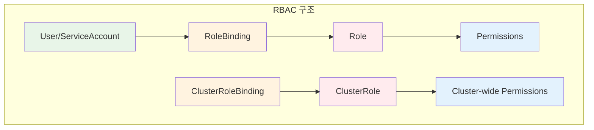
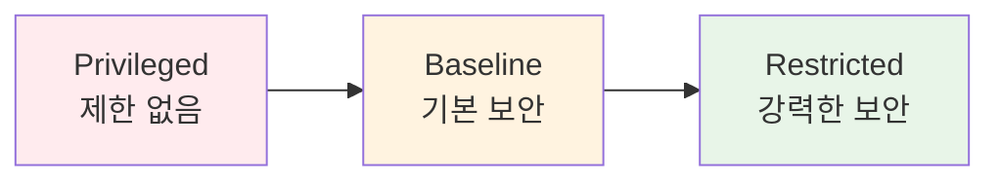
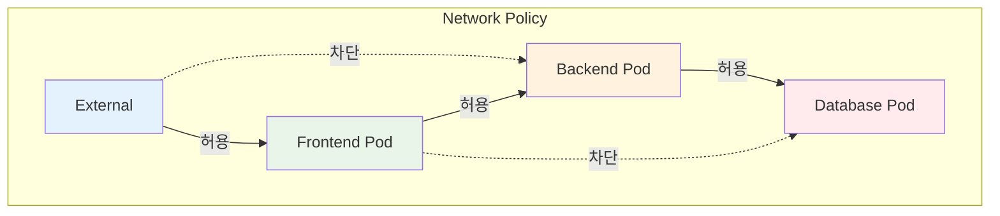

# November Week 4 Day 1 Session 3: EKS 보안

<div align="center">

**🔐 RBAC** • **🛡️ Pod Security** • **🌐 Network Policy** • **🔑 Secrets 관리**

*EKS 클러스터 보안 완전 정복*

</div>

---

## 🕘 세션 정보
**시간**: 10:20-11:10 (50분)
**목표**: EKS 보안 메커니즘 이해 및 적용 방법 습득
**방식**: 이론 강의 + 보안 베스트 프랙티스

## 🎯 학습 목표
- RBAC (Role-Based Access Control) 이해
- Pod Security Standards 적용 방법
- Network Policy로 트래픽 제어
- Secrets 안전한 관리 방법

---

## 📖 서비스 개요

### 1. 생성 배경 (Why?) - 5분

**문제 상황**:
- **무분별한 권한**: 모든 사용자가 클러스터 전체 접근 가능
- **Pod 보안 취약**: 권한 상승, 호스트 네트워크 접근 등 위험
- **네트워크 노출**: Pod 간 무제한 통신으로 공격 확산
- **민감 정보 노출**: 환경변수에 평문 비밀번호 저장

**🏠 실생활 비유**:
- **보안 없는 클러스터**: 아파트 모든 집 열쇠가 같음
  - 누구나 어디든 출입 가능
  - 이웃집 물건 가져갈 수 있음
  - 외부인도 자유롭게 출입
  
- **보안 적용된 클러스터**: 아파트 보안 시스템
  - **RBAC**: 각 집마다 다른 열쇠 (역할별 권한)
  - **Pod Security**: 집 내부 안전 규칙 (창문 잠금, 가스 차단)
  - **Network Policy**: 층별 출입 통제 (1층은 2층 못 감)
  - **Secrets**: 금고에 귀중품 보관 (암호화)

**EKS 보안 솔루션**:
- **RBAC**: 사용자/서비스별 세밀한 권한 제어
- **Pod Security Standards**: Pod 보안 정책 강제
- **Network Policy**: Pod 간 트래픽 제어
- **AWS Secrets Manager/KMS**: 민감 정보 암호화 저장

---

### 2. 핵심 원리 (How?) - 10분

#### 2.1 RBAC (Role-Based Access Control)

**작동 원리**:


**핵심 개념**:
- **Role**: 네임스페이스 내 권한 정의
- **ClusterRole**: 클러스터 전체 권한 정의
- **RoleBinding**: User/ServiceAccount와 Role 연결
- **ClusterRoleBinding**: User/ServiceAccount와 ClusterRole 연결

**예시**:
```yaml
# Role: 특정 네임스페이스에서 Pod 읽기 권한
apiVersion: rbac.authorization.k8s.io/v1
kind: Role
metadata:
  namespace: production
  name: pod-reader
rules:
- apiGroups: [""]
  resources: ["pods"]
  verbs: ["get", "list", "watch"]

---
# RoleBinding: developer 그룹에 pod-reader 역할 부여
apiVersion: rbac.authorization.k8s.io/v1
kind: RoleBinding
metadata:
  name: read-pods
  namespace: production
subjects:
- kind: Group
  name: developer
  apiGroup: rbac.authorization.k8s.io
roleRef:
  kind: Role
  name: pod-reader
  apiGroup: rbac.authorization.k8s.io
```

#### 2.2 Pod Security Standards

**3가지 보안 레벨**:


**레벨별 특징**:
1. **Privileged**: 제한 없음 (개발 환경)
2. **Baseline**: 알려진 권한 상승 방지 (일반 환경)
3. **Restricted**: 강력한 보안 (프로덕션)

**Restricted 정책 예시**:
```yaml
apiVersion: v1
kind: Pod
metadata:
  name: secure-pod
spec:
  securityContext:
    runAsNonRoot: true  # root 실행 금지
    runAsUser: 1000
    fsGroup: 2000
    seccompProfile:
      type: RuntimeDefault
  containers:
  - name: app
    image: nginx:alpine
    securityContext:
      allowPrivilegeEscalation: false  # 권한 상승 금지
      capabilities:
        drop:
        - ALL  # 모든 Linux capabilities 제거
      readOnlyRootFilesystem: true  # 읽기 전용 파일시스템
```

#### 2.3 Network Policy

**트래픽 제어 원리**:


**정책 예시**:
```yaml
# Backend Pod는 Frontend에서만 접근 허용
apiVersion: networking.k8s.io/v1
kind: NetworkPolicy
metadata:
  name: backend-policy
  namespace: production
spec:
  podSelector:
    matchLabels:
      app: backend
  policyTypes:
  - Ingress
  ingress:
  - from:
    - podSelector:
        matchLabels:
          app: frontend
    ports:
    - protocol: TCP
      port: 8080
```

#### 2.4 Secrets 관리

**보안 저장 방식**:


**AWS Secrets Manager 통합**:
```yaml
# External Secrets Operator 사용
apiVersion: external-secrets.io/v1beta1
kind: ExternalSecret
metadata:
  name: db-credentials
spec:
  refreshInterval: 1h
  secretStoreRef:
    name: aws-secrets-manager
    kind: SecretStore
  target:
    name: db-secret
  data:
  - secretKey: password
    remoteRef:
      key: prod/db/password
```

---

### 3. 주요 사용 사례 (When?) - 5분

**적합한 경우**:

**1. RBAC 사용 시나리오**:
- **멀티 테넌트 환경**: 팀별 네임스페이스 격리
- **개발/운영 분리**: 개발자는 읽기만, 운영팀은 쓰기 가능
- **CI/CD 파이프라인**: ServiceAccount로 자동 배포
- **감사 요구사항**: 누가 무엇을 했는지 추적

**2. Pod Security 사용 시나리오**:
- **프로덕션 환경**: Restricted 정책 강제
- **컴플라이언스**: PCI-DSS, HIPAA 준수
- **멀티 테넌트**: 테넌트 간 격리 보장
- **보안 감사**: 보안 정책 위반 탐지

**3. Network Policy 사용 시나리오**:
- **마이크로서비스**: 서비스 간 통신 제어
- **제로 트러스트**: 기본 거부, 명시적 허용
- **데이터베이스 보호**: 특정 Pod만 DB 접근
- **외부 트래픽 차단**: Ingress만 외부 접근 허용

**4. Secrets 관리 시나리오**:
- **데이터베이스 자격증명**: 비밀번호, 연결 문자열
- **API 키**: 외부 서비스 인증
- **TLS 인증서**: HTTPS 통신
- **SSH 키**: Git 저장소 접근

**실제 사례**:
- **Netflix**: RBAC로 수천 개 마이크로서비스 권한 관리
- **Spotify**: Network Policy로 서비스 메시 보안
- **Airbnb**: AWS Secrets Manager로 민감 정보 중앙 관리
- **Uber**: Pod Security로 컨테이너 런타임 보안 강화

---

### 4. 비슷한 서비스 비교 (Which?) - 5분

**AWS 내 대안 서비스**:

**1. IAM vs RBAC**:
- **IAM (AWS 레벨)**:
  - AWS 리소스 접근 제어 (EC2, S3, RDS)
  - EKS 클러스터 생성/삭제 권한
  - 언제 사용: AWS 인프라 관리
  
- **RBAC (Kubernetes 레벨)**:
  - Kubernetes 리소스 접근 제어 (Pod, Service)
  - 클러스터 내부 권한 관리
  - 언제 사용: 애플리케이션 배포 및 관리

**2. Security Group vs Network Policy**:
- **Security Group (AWS 레벨)**:
  - EC2 인스턴스 네트워크 제어
  - IP 기반 필터링
  - 언제 사용: 노드 간 통신 제어
  
- **Network Policy (Kubernetes 레벨)**:
  - Pod 간 네트워크 제어
  - 라벨 기반 필터링
  - 언제 사용: 마이크로서비스 간 통신 제어

**3. AWS Secrets Manager vs Kubernetes Secrets**:
- **AWS Secrets Manager**:
  - 중앙 집중식 관리
  - 자동 로테이션
  - 감사 로그
  - 언제 사용: 프로덕션 환경, 규정 준수
  
- **Kubernetes Secrets**:
  - 클러스터 내부 저장
  - 수동 관리
  - 간단한 사용
  - 언제 사용: 개발 환경, 간단한 설정

**선택 기준**:
| 기준 | RBAC | IAM | Network Policy | Security Group |
|------|------|-----|----------------|----------------|
| **범위** | K8s 리소스 | AWS 리소스 | Pod 간 | 노드 간 |
| **세밀도** | 매우 높음 | 높음 | 매우 높음 | 중간 |
| **복잡도** | 높음 | 중간 | 높음 | 낮음 |
| **적합 환경** | 멀티 테넌트 | 인프라 관리 | 마이크로서비스 | 기본 보안 |

---

### 5. 장단점 분석 - 3분

**장점**:
- ✅ **세밀한 권한 제어**: RBAC로 사용자/서비스별 정확한 권한 부여
- ✅ **강력한 격리**: Network Policy로 Pod 간 완전 격리
- ✅ **컴플라이언스**: Pod Security로 보안 정책 강제
- ✅ **중앙 관리**: AWS Secrets Manager로 민감 정보 통합 관리
- ✅ **감사 추적**: CloudTrail로 모든 접근 기록

**단점/제약사항**:
- ⚠️ **복잡한 설정**: RBAC 정책 설계 및 관리 복잡
- ⚠️ **학습 곡선**: Kubernetes 보안 개념 이해 필요
- ⚠️ **성능 오버헤드**: Network Policy 적용 시 약간의 성능 저하
- ⚠️ **디버깅 어려움**: 권한 문제 발생 시 원인 파악 어려움
- ⚠️ **비용**: AWS Secrets Manager 사용 시 추가 비용

**대안 방법**:
- **간단한 환경**: IAM만으로 기본 보안 (RBAC 생략)
- **개발 환경**: Privileged Pod Security (제한 완화)
- **비용 절감**: Kubernetes Secrets 사용 (Secrets Manager 대신)

---

### 6. 비용 구조 💰 - 5분

**무료 항목**:
- RBAC: $0 (Kubernetes 기본 기능)
- Pod Security Standards: $0 (Kubernetes 기본 기능)
- Network Policy: $0 (CNI 플러그인 기능)
- Kubernetes Secrets: $0 (etcd 저장)

**유료 항목**:
- **AWS Secrets Manager**:
  - Secret 저장: $0.40/secret/month
  - API 호출: $0.05/10,000 calls
  - 예시: 10개 secret, 100만 calls/month = $9.00/month

- **AWS KMS** (Secrets 암호화):
  - 키 저장: $1.00/key/month
  - API 호출: $0.03/10,000 requests
  - 예시: 1개 키, 100만 requests/month = $4.00/month

- **CloudTrail** (감사 로그):
  - 첫 번째 추적: 무료
  - 추가 추적: $2.00/100,000 events
  - S3 저장: $0.023/GB/month

**비용 최적화 팁**:
1. **Secrets Manager 최소화**: 정말 민감한 정보만 사용
2. **캐싱 활용**: External Secrets Operator로 API 호출 감소
3. **KMS 키 공유**: 여러 Secret에 동일 KMS 키 사용
4. **CloudTrail 필터링**: 필요한 이벤트만 로깅
5. **개발 환경**: Kubernetes Secrets 사용 (비용 절감)

**예상 비용 (프로덕션 환경)**:
| 항목 | 수량 | 단가 | 월 비용 |
|------|------|------|---------|
| Secrets Manager | 20 secrets | $0.40 | $8.00 |
| API 호출 | 200만 calls | $0.05/10K | $10.00 |
| KMS 키 | 2 keys | $1.00 | $2.00 |
| KMS 요청 | 200만 | $0.03/10K | $6.00 |
| CloudTrail | 100만 events | $2.00/100K | $20.00 |
| **합계** | | | **$46.00** |

**개발 환경 비용**: $0 (Kubernetes 기본 기능만 사용)

---

### 7. 최신 업데이트 🆕 - 2분

**2024년 주요 변경사항**:
- **Pod Security Admission**: PSP 대체 (Kubernetes 1.25+)
- **EKS Pod Identity**: IRSA 개선 (더 간단한 IAM 통합)
- **Secrets Store CSI Driver**: AWS Secrets Manager 네이티브 통합
- **Network Policy API v1**: 안정화 (이전 v1beta1)

**2025년 예정**:
- **Fine-grained RBAC**: 더 세밀한 권한 제어
- **Zero Trust Networking**: 기본 거부 정책 강화
- **Automated Secret Rotation**: 자동 비밀번호 로테이션

**Deprecated 기능**:
- **Pod Security Policy (PSP)**: Kubernetes 1.25에서 제거
  - 대안: Pod Security Standards 사용
- **IRSA (IAM Roles for Service Accounts)**: 여전히 사용 가능하지만 EKS Pod Identity 권장

**참조**: 
- [EKS Best Practices - Security](https://aws.github.io/aws-eks-best-practices/security/docs/)
- [Kubernetes Security](https://kubernetes.io/docs/concepts/security/)

---

### 8. 잘 사용하는 방법 ✅ - 3분

**베스트 프랙티스**:

**1. RBAC 설계**:
```yaml
# ✅ 최소 권한 원칙
apiVersion: rbac.authorization.k8s.io/v1
kind: Role
metadata:
  name: app-deployer
rules:
- apiGroups: ["apps"]
  resources: ["deployments"]
  verbs: ["get", "list", "create", "update"]  # delete 제외
- apiGroups: [""]
  resources: ["pods"]
  verbs: ["get", "list"]  # 읽기만 허용
```

**2. Pod Security**:
```yaml
# ✅ Restricted 정책 적용
apiVersion: v1
kind: Namespace
metadata:
  name: production
  labels:
    pod-security.kubernetes.io/enforce: restricted
    pod-security.kubernetes.io/audit: restricted
    pod-security.kubernetes.io/warn: restricted
```

**3. Network Policy**:
```yaml
# ✅ 기본 거부 + 명시적 허용
apiVersion: networking.k8s.io/v1
kind: NetworkPolicy
metadata:
  name: default-deny-all
spec:
  podSelector: {}
  policyTypes:
  - Ingress
  - Egress
```

**4. Secrets 관리**:
```yaml
# ✅ External Secrets Operator 사용
apiVersion: external-secrets.io/v1beta1
kind: SecretStore
metadata:
  name: aws-secrets-manager
spec:
  provider:
    aws:
      service: SecretsManager
      region: ap-northeast-2
      auth:
        jwt:
          serviceAccountRef:
            name: external-secrets
```

**실무 팁**:
- **네임스페이스 격리**: 팀/환경별 네임스페이스 분리
- **ServiceAccount 사용**: Pod에 명시적 ServiceAccount 할당
- **정기 감사**: RBAC 권한 정기 검토 및 정리
- **자동화**: Terraform으로 보안 정책 코드화
- **모니터링**: Falco로 보안 이벤트 실시간 탐지

**성능 최적화**:
- **Network Policy 최소화**: 필요한 정책만 적용
- **Secrets 캐싱**: External Secrets refreshInterval 조정
- **RBAC 단순화**: 복잡한 정책 대신 간단한 Role 조합

---

### 9. 잘못 사용하는 방법 ❌ - 3분

**흔한 실수**:

**1. 과도한 권한**:
```yaml
# ❌ cluster-admin 남발
apiVersion: rbac.authorization.k8s.io/v1
kind: ClusterRoleBinding
metadata:
  name: developer-admin
subjects:
- kind: Group
  name: developers
roleRef:
  kind: ClusterRole
  name: cluster-admin  # 너무 강력한 권한!
```

**올바른 방법**:
```yaml
# ✅ 필요한 권한만 부여
apiVersion: rbac.authorization.k8s.io/v1
kind: RoleBinding
metadata:
  name: developer-deployer
  namespace: development
subjects:
- kind: Group
  name: developers
roleRef:
  kind: Role
  name: app-deployer  # 제한된 권한
```

**2. 보안 정책 미적용**:
```yaml
# ❌ Privileged Pod 허용
apiVersion: v1
kind: Pod
metadata:
  name: unsafe-pod
spec:
  containers:
  - name: app
    image: nginx
    securityContext:
      privileged: true  # 위험!
      runAsUser: 0  # root 실행
```

**3. Network Policy 누락**:
```yaml
# ❌ 모든 Pod 간 통신 허용
# Network Policy 없음 = 기본 허용
```

**4. 평문 Secrets**:
```yaml
# ❌ 환경변수에 평문 저장
apiVersion: v1
kind: Pod
metadata:
  name: unsafe-pod
spec:
  containers:
  - name: app
    env:
    - name: DB_PASSWORD
      value: "mypassword123"  # 평문 노출!
```

**안티 패턴**:
- **기본 ServiceAccount 사용**: 모든 Pod가 동일한 권한
- **Network Policy 없음**: Pod 간 무제한 통신
- **Secret 버전 관리 없음**: Git에 Secret 커밋
- **감사 로그 미설정**: 보안 사고 추적 불가
- **정기 검토 없음**: 불필요한 권한 누적

**보안 취약점**:
- **RBAC 우회**: ServiceAccount 토큰 탈취
- **Pod Escape**: Privileged Pod로 호스트 접근
- **Network 스니핑**: Network Policy 없이 트래픽 도청
- **Secret 노출**: etcd 백업 파일 유출

---

### 10. 구성 요소 상세 - 5분

**주요 구성 요소**:

**1. RBAC 구성 요소**:

**Role/ClusterRole**:
- **역할**: 권한 집합 정의
- **종류**: 
  - Role: 네임스페이스 범위
  - ClusterRole: 클러스터 범위
- **설정 옵션**:
  - apiGroups: API 그룹 (core, apps, batch 등)
  - resources: 리소스 타입 (pods, services 등)
  - verbs: 동작 (get, list, create, update, delete)

**RoleBinding/ClusterRoleBinding**:
- **역할**: Subject와 Role 연결
- **Subject 타입**:
  - User: 사용자 계정
  - Group: 사용자 그룹
  - ServiceAccount: Pod 계정
- **의존성**: Role/ClusterRole 필요

**2. Pod Security Standards**:

**3가지 레벨**:
- **Privileged**: 제한 없음
  - 사용: 시스템 Pod (kube-proxy, CNI)
  - 위험: 호스트 접근 가능
  
- **Baseline**: 기본 보안
  - 사용: 일반 애플리케이션
  - 제한: 권한 상승 방지
  
- **Restricted**: 강력한 보안
  - 사용: 프로덕션 환경
  - 제한: root 실행 금지, 읽기 전용 파일시스템

**적용 모드**:
- **enforce**: 정책 위반 시 Pod 생성 거부
- **audit**: 정책 위반 기록 (허용)
- **warn**: 정책 위반 경고 (허용)

**3. Network Policy**:

**정책 타입**:
- **Ingress**: 들어오는 트래픽 제어
- **Egress**: 나가는 트래픽 제어

**선택자**:
- **podSelector**: Pod 라벨로 대상 선택
- **namespaceSelector**: 네임스페이스로 소스 선택
- **ipBlock**: IP 범위로 소스 선택

**포트 설정**:
- **protocol**: TCP, UDP, SCTP
- **port**: 포트 번호 또는 이름

**4. Secrets 관리**:

**Kubernetes Secrets**:
- **타입**:
  - Opaque: 일반 데이터
  - kubernetes.io/tls: TLS 인증서
  - kubernetes.io/dockerconfigjson: Docker 레지스트리 인증
- **저장**: etcd에 Base64 인코딩
- **암호화**: KMS로 etcd 암호화 (선택)

**AWS Secrets Manager**:
- **기능**:
  - 자동 로테이션
  - 버전 관리
  - 감사 로그
  - 세밀한 접근 제어
- **통합**: External Secrets Operator 또는 Secrets Store CSI Driver

**의존성**:
- **RBAC**: ServiceAccount 권한 필요
- **Network Policy**: Secrets Manager API 접근 허용
- **IAM**: EKS Pod Identity 또는 IRSA 설정

---

### 11. 공식 문서 링크 (필수 5개)

**⚠️ 학생들이 직접 확인해야 할 공식 문서**:
- 📘 [EKS Security Best Practices](https://aws.github.io/aws-eks-best-practices/security/docs/)
- 📗 [Kubernetes RBAC](https://kubernetes.io/docs/reference/access-authn-authz/rbac/)
- 📙 [Pod Security Standards](https://kubernetes.io/docs/concepts/security/pod-security-standards/)
- 📕 [Network Policies](https://kubernetes.io/docs/concepts/services-networking/network-policies/)
- 🆕 [AWS Secrets Manager](https://docs.aws.amazon.com/secretsmanager/latest/userguide/intro.html)

**추가 참고 자료**:
- [EKS Pod Identity](https://docs.aws.amazon.com/eks/latest/userguide/pod-identities.html)
- [External Secrets Operator](https://external-secrets.io/)
- [Secrets Store CSI Driver](https://secrets-store-csi-driver.sigs.k8s.io/)
- [Falco Security](https://falco.org/)

---

## 💭 함께 생각해보기

### 🤝 페어 토론 (5분)

**토론 주제**:
1. **RBAC 설계**: "우리 팀에 어떤 Role이 필요할까요?"
   - 개발자, 운영자, 보안팀 각각의 권한
   - 네임스페이스별 권한 분리 방안

2. **보안 vs 편의성**: "어느 정도까지 보안을 강화해야 할까요?"
   - 개발 환경: Privileged vs Baseline
   - 프로덕션: Baseline vs Restricted
   - 트레이드오프 고려

3. **Network Policy 전략**: "어떤 Pod 간 통신을 허용해야 할까요?"
   - Frontend → Backend → Database
   - 외부 API 호출 허용 범위
   - 모니터링 시스템 접근

**페어 활동 가이드**:
- 👥 **자유 페어링**: 보안 관심사가 비슷한 사람끼리
- 🔄 **역할 교대**: 5분씩 보안 정책 설계자/검토자 역할
- 📝 **핵심 정리**: 우리 팀에 필요한 보안 정책 정리

### 🎯 전체 공유 (3분)
- **보안 전략**: 각 팀의 보안 정책 공유
- **질문 수집**: 보안 설정 시 어려운 점
- **다음 연결**: Demo에서 실제 적용 확인

### 💡 이해도 체크 질문
- ✅ "RBAC의 4가지 구성 요소를 설명할 수 있나요?"
- ✅ "Pod Security Standards 3가지 레벨의 차이를 아나요?"
- ✅ "Network Policy로 어떻게 트래픽을 제어하나요?"
- ✅ "Secrets를 안전하게 관리하는 방법을 아나요?"

---

## 🔑 핵심 키워드

### 🔤 기본 용어
- **RBAC (Role-Based Access Control)**: 역할 기반 접근 제어
- **Pod Security Standards**: Pod 보안 정책 표준
- **Network Policy**: Pod 간 네트워크 트래픽 제어
- **Secrets**: 민감 정보 안전 저장

### 🔤 기술 용어
- **Role/ClusterRole**: 권한 집합 정의
- **RoleBinding/ClusterRoleBinding**: Subject와 Role 연결
- **ServiceAccount**: Pod 실행 계정
- **Privileged/Baseline/Restricted**: 보안 레벨
- **Ingress/Egress**: 들어오는/나가는 트래픽
- **AWS Secrets Manager**: AWS 관리형 비밀 저장소
- **KMS (Key Management Service)**: 암호화 키 관리

### 🔤 약어 및 줄임말
- **RBAC**: Role-Based Access Control
- **PSS**: Pod Security Standards
- **PSP**: Pod Security Policy (Deprecated)
- **IRSA**: IAM Roles for Service Accounts
- **KMS**: Key Management Service
- **CSI**: Container Storage Interface

---

## 📝 세션 마무리

### ✅ 오늘 세션 성과
- [ ] EKS 보안의 4가지 핵심 영역 이해
- [ ] RBAC로 세밀한 권한 제어 방법 습득
- [ ] Pod Security Standards 적용 방법 파악
- [ ] Network Policy로 트래픽 제어 이해
- [ ] Secrets 안전한 관리 방법 학습

### 🎯 다음 세션 준비
**강사 Demo (11:00-12:00)**:
- Terraform으로 EKS 클러스터 생성 시연
- RBAC 설정 및 테스트
- Pod Security Standards 적용
- Network Policy 구성
- AWS Secrets Manager 통합

**준비 사항**:
- 보안 정책 설계 아이디어 정리
- 질문 사항 메모
- Demo 중 확인하고 싶은 부분 체크

### 🔗 관련 자료
- [Session 1: EKS 아키텍처](./session_1.md)
- [Session 2: Terraform으로 EKS 구축](./session_2.md)

---

<div align="center">

**🔐 보안 우선** • **🛡️ 최소 권한** • **🌐 네트워크 격리** • **🔑 안전한 Secrets**

*EKS 보안으로 안전한 클러스터 운영*

</div>
