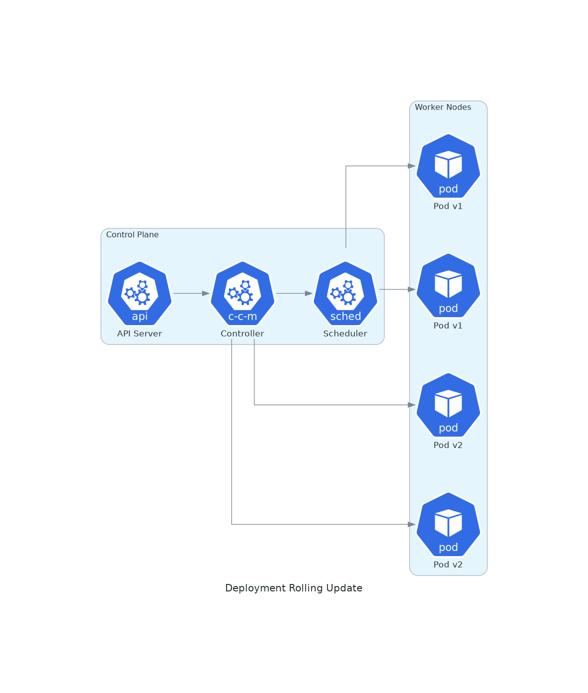
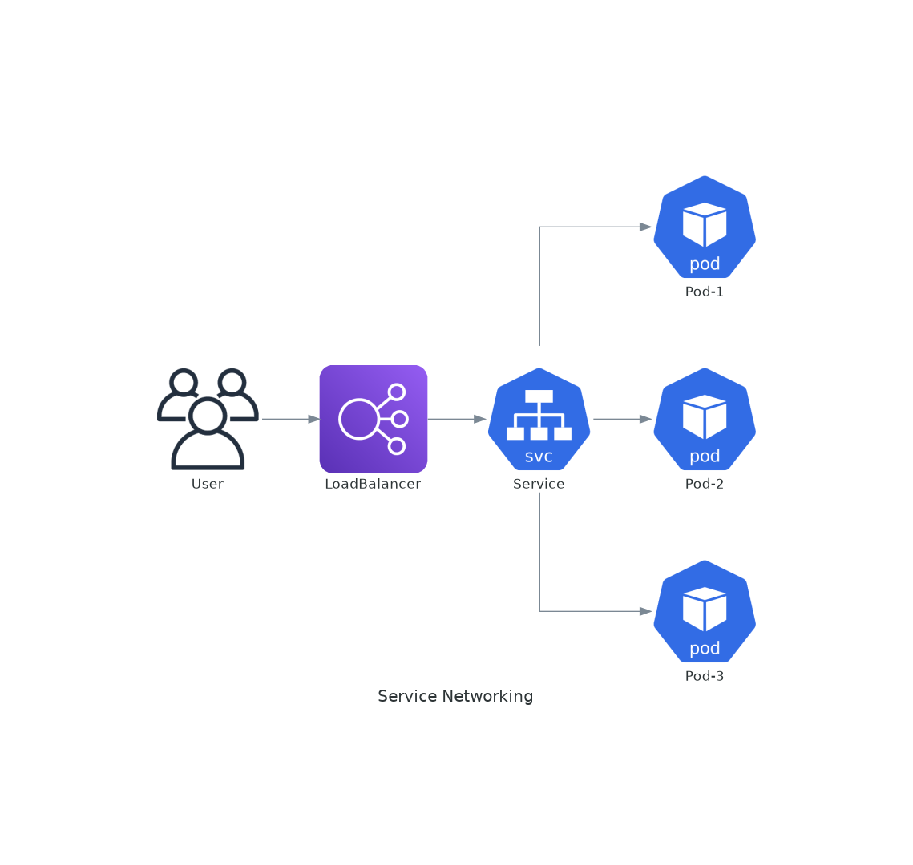

# November Week 4 Day 2 Session 1: Kubernetes Deployment & Service

<div align="center">

**🚀 Deployment** • **🌐 Service** • **📡 LoadBalancer** • **🔄 Rolling Update**

*Kubernetes 워크로드 배포 및 서비스 노출*

</div>

---

## 🕘 세션 정보
**시간**: 09:00-09:40 (40분)
**목표**: Kubernetes Deployment와 Service를 통한 애플리케이션 배포 및 노출 방법 이해
**방식**: 이론 강의 + 아키텍처 분석

## 🎯 학습 목표
- Deployment를 통한 애플리케이션 배포 전략 이해
- Service 타입별 특징 및 사용 시나리오 파악
- LoadBalancer와 Ingress를 통한 외부 노출 방법 습득
- ConfigMap과 Secret을 통한 설정 관리

---

## 📖 서비스 개요

### 1. 생성 배경 (Why?) - 5분

**문제 상황**:
- **수동 배포의 한계**: 컨테이너를 수동으로 배포하고 관리하는 것은 비효율적
- **무중단 배포 어려움**: 애플리케이션 업데이트 시 다운타임 발생
- **서비스 디스커버리 부재**: Pod IP가 동적으로 변경되어 통신 어려움
- **로드밸런싱 필요**: 여러 Pod 간 트래픽 분산 필요

**Kubernetes 솔루션**:
- **Deployment**: 선언적 방식으로 애플리케이션 배포 및 업데이트 자동화
- **Service**: 안정적인 네트워크 엔드포인트 제공 및 로드밸런싱
- **Rolling Update**: 무중단 배포 전략 기본 제공
- **Self-Healing**: Pod 장애 시 자동 복구

### 2. 핵심 원리 (How?) - 10분

**Deployment 작동 원리**:



*그림: Deployment Controller가 Rolling Update를 통해 Pod를 점진적으로 업데이트하는 과정*

**Service 네트워킹**:



*그림: Service가 LoadBalancer를 통해 외부 트래픽을 여러 Pod로 분산하는 구조*

**핵심 개념**:
- **ReplicaSet**: Deployment가 생성하는 하위 리소스로 Pod 복제본 관리
- **Selector**: Label을 통해 Pod와 Service 연결
- **Endpoints**: Service가 트래픽을 전달할 Pod IP 목록
- **kube-proxy**: 각 노드에서 Service 규칙을 iptables/IPVS로 구현

### 3. 주요 사용 사례 (When?) - 5분

**적합한 경우**:
- **Stateless 애플리케이션**: 웹 서버, API 서버, 마이크로서비스
- **무중단 배포 필요**: 프로덕션 환경의 지속적 서비스
- **Auto Scaling**: HPA와 연동하여 자동 확장
- **Multi-AZ 배포**: 고가용성이 필요한 서비스

**실제 사례**:
- **Netflix**: 수천 개의 마이크로서비스를 Deployment로 관리
- **Spotify**: Rolling Update로 하루 수백 번 배포
- **Airbnb**: LoadBalancer Service로 글로벌 트래픽 처리

### 4. 비슷한 서비스 비교 (Which?) - 5분

**Kubernetes 내 대안**:
- **StatefulSet** vs **Deployment**
  - 언제 StatefulSet 사용: 데이터베이스, 순서가 중요한 애플리케이션
  - 언제 Deployment 사용: Stateless 애플리케이션, 일반 웹 서비스

- **DaemonSet** vs **Deployment**
  - 언제 DaemonSet 사용: 모든 노드에 1개씩 실행 (로깅, 모니터링 에이전트)
  - 언제 Deployment 사용: 특정 개수의 복제본 필요

**Service 타입 비교**:
| 타입 | 용도 | 접근 범위 | AWS 통합 |
|------|------|-----------|----------|
| **ClusterIP** | 내부 통신 | 클러스터 내부만 | - |
| **NodePort** | 개발/테스트 | 노드 IP:Port | - |
| **LoadBalancer** | 프로덕션 외부 노출 | 인터넷 | AWS ELB/NLB |
| **ExternalName** | 외부 서비스 참조 | DNS CNAME | - |

### 5. 장단점 분석 - 3분

**Deployment 장점**:
- ✅ 선언적 배포로 관리 간편
- ✅ Rolling Update 기본 제공
- ✅ Rollback 간단 (이전 버전으로 즉시 복구)
- ✅ Self-Healing (Pod 장애 시 자동 재생성)

**Deployment 단점/제약사항**:
- ⚠️ Stateful 애플리케이션에는 부적합
- ⚠️ Pod 순서 보장 안 됨
- ⚠️ 영구 스토리지 관리 복잡

**Service 장점**:
- ✅ 안정적인 네트워크 엔드포인트
- ✅ 자동 로드밸런싱
- ✅ Service Discovery 기본 제공
- ✅ AWS LoadBalancer 자동 프로비저닝

**Service 단점/제약사항**:
- ⚠️ LoadBalancer 타입은 비용 발생 (AWS ELB)
- ⚠️ NodePort는 포트 범위 제한 (30000-32767)
- ⚠️ ClusterIP는 외부 접근 불가

### 6. 비용 구조 💰 - 5분

**Deployment 비용**:
- **Pod 실행 비용**: EC2 인스턴스 비용 (t3.medium: $0.0416/hour)
- **무료 항목**: Deployment 자체는 무료 (Kubernetes 리소스)

**Service 비용**:
- **ClusterIP/NodePort**: 무료
- **LoadBalancer**: AWS ELB/NLB 비용 발생
  - Network Load Balancer: $0.0225/hour + $0.006/LCU-hour
  - Application Load Balancer: $0.0225/hour + $0.008/LCU-hour

**프리티어 혜택**:
- EKS 클러스터: 프리티어 없음 ($0.10/hour)
- EC2: t3.micro 750시간/월 무료 (12개월)
- ELB: 750시간/월 무료 (12개월)

**비용 최적화 팁**:
1. **Ingress 사용**: 여러 Service를 하나의 ALB로 통합
2. **NodePort 활용**: 개발 환경에서는 LoadBalancer 대신 NodePort
3. **리소스 제한**: Pod에 적절한 CPU/메모리 제한 설정
4. **HPA 활용**: 트래픽에 따라 자동 확장/축소
5. **Spot Instance**: 비용 절감 (최대 90% 할인)

**예상 비용 (ap-northeast-2)**:
| 리소스 | 수량 | 시간당 | 월간 (730시간) |
|--------|------|--------|----------------|
| EKS Control Plane | 1 | $0.10 | $73 |
| t3.medium Worker | 2 | $0.0832 | $60.74 |
| Network Load Balancer | 1 | $0.0225 | $16.43 |
| **합계** | | **$0.2057** | **$150.17** |

### 7. 최신 업데이트 🆕 - 2분

**2024년 주요 변경사항**:
- **EKS Auto Mode**: 자동 노드 프로비저닝 및 스케일링
- **Pod Identity**: IAM 역할을 Pod에 직접 할당 (IRSA 개선)
- **IPv6 지원**: Dual-stack 클러스터 지원 강화
- **Karpenter 통합**: 더 빠른 노드 프로비저닝

**2025년 예정**:
- **eBPF 기반 네트워킹**: 성능 향상 및 보안 강화
- **Gateway API**: Ingress 대체 표준 API
- **Multi-tenancy 개선**: 더 강력한 격리 기능

**Deprecated 기능**:
- **Pod Security Policy**: 1.25에서 제거 (Pod Security Standards 사용)
- **Classic Load Balancer**: NLB/ALB 권장

**참조**: [EKS What's New](https://aws.amazon.com/eks/whats-new/) (2024.11 업데이트)

### 8. 잘 사용하는 방법 ✅ - 3분

**Deployment 베스트 프랙티스**:
1. **리소스 제한 설정**: requests와 limits 명시
   ```yaml
   resources:
     requests:
       cpu: 100m
       memory: 128Mi
     limits:
       cpu: 500m
       memory: 512Mi
   ```

2. **Readiness/Liveness Probe**: 헬스 체크 필수
   ```yaml
   livenessProbe:
     httpGet:
       path: /health
       port: 8080
     initialDelaySeconds: 30
   ```

3. **Rolling Update 전략**: 점진적 배포
   ```yaml
   strategy:
     type: RollingUpdate
     rollingUpdate:
       maxSurge: 1
       maxUnavailable: 0
   ```

**Service 베스트 프랙티스**:
1. **Annotation 활용**: AWS LoadBalancer 세부 설정
   ```yaml
   annotations:
     service.beta.kubernetes.io/aws-load-balancer-type: "nlb"
     service.beta.kubernetes.io/aws-load-balancer-scheme: "internet-facing"
   ```

2. **Session Affinity**: 필요시 클라이언트 고정
   ```yaml
   sessionAffinity: ClientIP
   ```

3. **Health Check 설정**: 적절한 임계값 설정

**실무 팁**:
- **Blue/Green 배포**: 두 개의 Deployment로 무중단 전환
- **Canary 배포**: 일부 트래픽만 새 버전으로 라우팅
- **ConfigMap 분리**: 환경별 설정 외부화

### 9. 잘못 사용하는 방법 ❌ - 3분

**흔한 실수**:
1. **리소스 제한 미설정**: OOM Killer로 Pod 종료
2. **Probe 누락**: 장애 Pod에 트래픽 전달
3. **Label Selector 불일치**: Service가 Pod를 찾지 못함
4. **Rolling Update 설정 오류**: 전체 Pod 동시 종료
5. **LoadBalancer 남용**: 비용 급증

**안티 패턴**:
- **모든 Service를 LoadBalancer로**: Ingress 사용 권장
- **Deployment로 Stateful 앱 실행**: StatefulSet 사용
- **너무 많은 복제본**: 리소스 낭비
- **Health Check 없음**: 장애 감지 불가

**보안 취약점**:
- **Root 권한 실행**: securityContext로 제한
- **Secret을 환경변수로**: Volume 마운트 권장
- **Public LoadBalancer 무분별 사용**: Internal LB 고려

### 10. 구성 요소 상세 - 5분

**Deployment 구성 요소**:

**1. Deployment Spec**:
- **replicas**: Pod 복제본 수
- **selector**: 관리할 Pod 선택 (matchLabels)
- **template**: Pod 템플릿 정의
- **strategy**: 업데이트 전략 (RollingUpdate, Recreate)

**2. Pod Template**:
- **metadata**: Label, Annotation
- **spec**: 컨테이너 정의, 볼륨, 보안 설정

**3. Container Spec**:
- **image**: 컨테이너 이미지
- **ports**: 노출 포트
- **env**: 환경변수
- **resources**: CPU/메모리 제한

**Service 구성 요소**:

**1. Service Spec**:
- **type**: ClusterIP, NodePort, LoadBalancer, ExternalName
- **selector**: 트래픽을 전달할 Pod 선택
- **ports**: 포트 매핑 (port, targetPort, nodePort)

**2. LoadBalancer 설정**:
- **Annotations**: AWS LoadBalancer 세부 설정
- **externalTrafficPolicy**: Local/Cluster (소스 IP 보존)
- **healthCheckNodePort**: 헬스 체크 포트

**설정 옵션**:
- **sessionAffinity**: ClientIP (세션 고정)
- **loadBalancerSourceRanges**: 접근 IP 제한
- **externalIPs**: 특정 IP 할당

**의존성**:
- **ReplicaSet**: Deployment가 자동 생성
- **Endpoints**: Service가 자동 생성 (Pod IP 목록)
- **AWS Load Balancer Controller**: LoadBalancer 타입 사용 시 필요

### 11. 공식 문서 링크 (필수 5개)

**⚠️ 학생들이 직접 확인해야 할 공식 문서**:
- 📘 [Kubernetes Deployments](https://kubernetes.io/docs/concepts/workloads/controllers/deployment/)
- 📗 [Kubernetes Services](https://kubernetes.io/docs/concepts/services-networking/service/)
- 📙 [EKS Load Balancing](https://docs.aws.amazon.com/eks/latest/best-practices/load-balancing.html)
- 📕 [AWS Load Balancer Controller](https://kubernetes-sigs.github.io/aws-load-balancer-controller/)
- 🆕 [EKS What's New](https://aws.amazon.com/eks/whats-new/)

---

## 💭 함께 생각해보기

### 🤝 페어 토론 (5분)
1. **Rolling Update vs Blue/Green**: 어떤 상황에서 어떤 전략이 적합할까요?
2. **LoadBalancer vs Ingress**: 비용과 기능 측면에서 어떤 선택이 나을까요?
3. **실무 경험**: 배포 중 겪었던 문제와 해결 방법을 공유해주세요.

### 🎯 전체 공유
- 각 팀의 인사이트 공유
- 실무 적용 시 고려사항 토론

### 💡 이해도 체크 질문
- ✅ "Deployment와 ReplicaSet의 차이를 설명할 수 있나요?"
- ✅ "Service의 4가지 타입과 각각의 사용 시나리오를 말할 수 있나요?"
- ✅ "Rolling Update 시 maxSurge와 maxUnavailable의 역할을 이해하셨나요?"

---

## 🔑 핵심 키워드

- **Deployment**: Kubernetes의 선언적 배포 리소스
- **ReplicaSet**: Pod 복제본 관리
- **Rolling Update**: 무중단 점진적 업데이트
- **Service**: 안정적인 네트워크 엔드포인트
- **ClusterIP**: 클러스터 내부 통신용 Service
- **LoadBalancer**: 외부 노출용 Service (AWS ELB/NLB)
- **Selector**: Label 기반 Pod 선택
- **Probe**: Liveness/Readiness 헬스 체크
- **ConfigMap**: 설정 데이터 외부화
- **Secret**: 민감 정보 관리

---

## 📝 세션 마무리

### ✅ 오늘 세션 성과
- [ ] Deployment를 통한 애플리케이션 배포 방법 이해
- [ ] Service 타입별 특징 및 사용 시나리오 파악
- [ ] Rolling Update 전략 및 무중단 배포 개념 습득
- [ ] AWS LoadBalancer 통합 방법 이해

### 🎯 다음 세션 준비
- **Session 2**: StatefulSet & PersistentVolume
  - Stateful 애플리케이션 배포
  - EBS CSI Driver를 통한 영구 스토리지
  - 데이터베이스 배포 전략

---

<div align="center">

**🚀 Deployment** • **🌐 Service** • **📡 LoadBalancer** • **🔄 Rolling Update**

*Kubernetes 워크로드 배포의 핵심*

</div>
