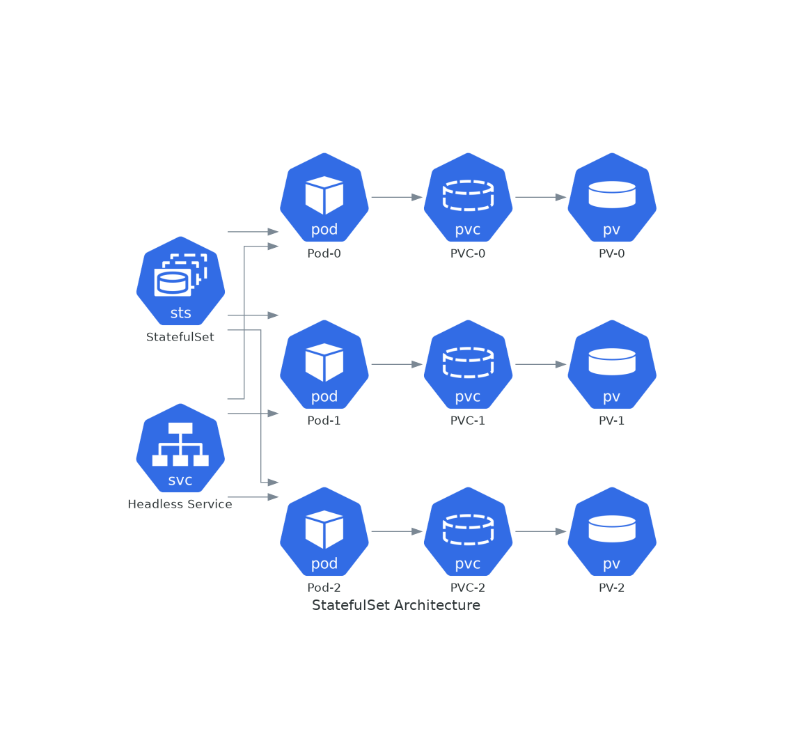
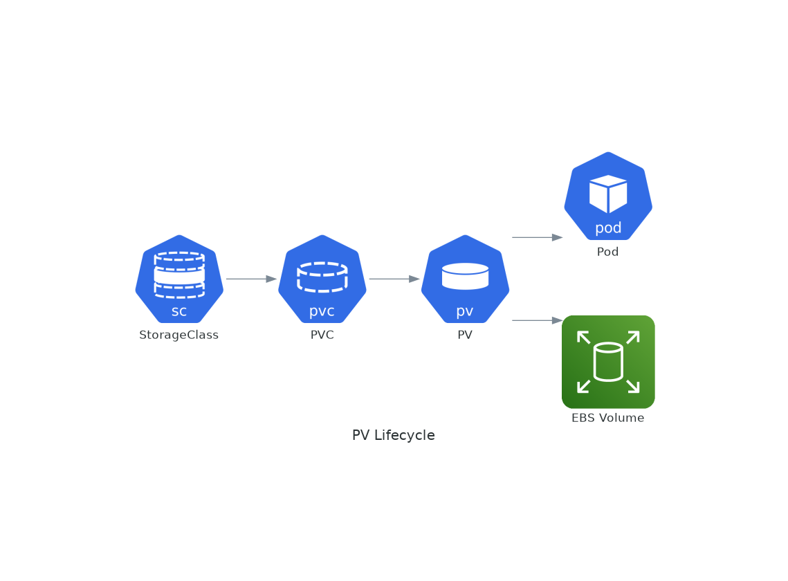

# November Week 4 Day 2 Session 2: StatefulSet & PersistentVolume

<div align="center">

**💾 StatefulSet** • **📦 PersistentVolume** • **🔌 EBS CSI Driver** • **🗄️ Database**

*Stateful 애플리케이션과 영구 스토리지 관리*

</div>

---

## 🕘 세션 정보
**시간**: 09:40-10:20 (40분)
**목표**: StatefulSet을 통한 Stateful 애플리케이션 배포 및 PersistentVolume을 통한 데이터 영속성 관리
**방식**: 이론 강의 + 아키텍처 분석

## 🎯 학습 목표
- StatefulSet의 특징 및 Deployment와의 차이점 이해
- PersistentVolume과 PersistentVolumeClaim 개념 파악
- EBS CSI Driver를 통한 AWS EBS 볼륨 연동
- 데이터베이스 등 Stateful 애플리케이션 배포 전략 습득

---

## 📖 서비스 개요

### 1. 생성 배경 (Why?) - 5분

**문제 상황**:
- **Deployment의 한계**: Pod가 재생성되면 데이터 손실
- **순서 보장 필요**: 데이터베이스 클러스터는 특정 순서로 시작 필요
- **안정적인 네트워크 ID**: Pod 이름과 DNS가 변경되면 클러스터 구성 깨짐
- **영구 스토리지 필요**: 컨테이너 재시작 후에도 데이터 유지

**Kubernetes 솔루션**:
- **StatefulSet**: 순서와 고유성을 보장하는 워크로드 컨트롤러
- **PersistentVolume**: 클러스터 수준의 영구 스토리지 리소스
- **PersistentVolumeClaim**: Pod가 스토리지를 요청하는 방법
- **EBS CSI Driver**: AWS EBS 볼륨을 Kubernetes에서 사용

### 2. 핵심 원리 (How?) - 10분

**StatefulSet 작동 원리**:



*그림: StatefulSet이 순서를 보장하며 각 Pod에 고유한 PVC를 연결하는 구조*

**PersistentVolume 라이프사이클**:



*그림: StorageClass를 통한 동적 프로비저닝으로 PVC 요청 시 자동으로 EBS 볼륨이 생성되는 과정*

**핵심 개념**:
- **Ordinal Index**: Pod 이름에 순서 번호 (pod-0, pod-1, pod-2)
- **Stable Network Identity**: Pod 재생성 시에도 동일한 DNS 이름 유지
- **Ordered Deployment**: Pod가 순서대로 생성 (0 → 1 → 2)
- **Ordered Termination**: Pod가 역순으로 종료 (2 → 1 → 0)
- **Dynamic Provisioning**: PVC 생성 시 자동으로 PV 프로비저닝

### 3. 주요 사용 사례 (When?) - 5분

**적합한 경우**:
- **데이터베이스**: MySQL, PostgreSQL, MongoDB 클러스터
- **분산 시스템**: Kafka, Zookeeper, Elasticsearch
- **캐시 클러스터**: Redis Cluster, Memcached
- **순서가 중요한 앱**: 리더 선출이 필요한 애플리케이션

**실제 사례**:
- **Salesforce**: Kubernetes에서 대규모 데이터베이스 운영
- **Circle**: 블록체인 노드를 StatefulSet으로 관리
- **Spotify**: Cassandra 클러스터를 StatefulSet으로 배포

### 4. 비슷한 서비스 비교 (Which?) - 5분

**Kubernetes 내 대안**:
- **Deployment** vs **StatefulSet**
  - 언제 Deployment 사용: Stateless 앱, 순서 무관, 데이터 영속성 불필요
  - 언제 StatefulSet 사용: Stateful 앱, 순서 중요, 데이터 영속성 필수

- **Local Volume** vs **EBS Volume**
  - 언제 Local Volume 사용: 최고 성능 필요, 데이터 손실 허용
  - 언제 EBS Volume 사용: 데이터 영속성 필수, 백업 필요

**스토리지 타입 비교**:
| 타입 | 성능 | 영속성 | 비용 | 사용 사례 |
|------|------|--------|------|-----------|
| **emptyDir** | 높음 | 없음 | 무료 | 임시 데이터 |
| **hostPath** | 높음 | 노드 수준 | 무료 | 로그, 캐시 |
| **EBS (gp3)** | 중간 | 높음 | $0.08/GB/월 | 데이터베이스 |
| **EFS** | 낮음 | 높음 | $0.30/GB/월 | 공유 파일 |

### 5. 장단점 분석 - 3분

**StatefulSet 장점**:
- ✅ 안정적인 Pod 이름 및 DNS
- ✅ 순서 보장 (생성/종료)
- ✅ 영구 스토리지 자동 연결
- ✅ 데이터베이스 클러스터 구성 용이

**StatefulSet 단점/제약사항**:
- ⚠️ 배포/업데이트 속도 느림 (순차 처리)
- ⚠️ 스토리지 비용 발생
- ⚠️ 복잡한 설정 (Headless Service 필요)
- ⚠️ 스케일 다운 시 PVC 자동 삭제 안 됨

**PersistentVolume 장점**:
- ✅ 데이터 영속성 보장
- ✅ 동적 프로비저닝 (StorageClass)
- ✅ 백업 및 스냅샷 지원
- ✅ 다양한 스토리지 백엔드 지원

**PersistentVolume 단점/제약사항**:
- ⚠️ EBS는 단일 AZ에만 연결 가능
- ⚠️ 스토리지 비용 발생
- ⚠️ 성능 제한 (IOPS, 처리량)
- ⚠️ 볼륨 크기 변경 제한적

### 6. 비용 구조 💰 - 5분

**EBS 볼륨 비용 (ap-northeast-2)**:
- **gp3 (범용 SSD)**: $0.088/GB/월
  - 기본 성능: 3,000 IOPS, 125 MB/s
  - 추가 IOPS: $0.0055/IOPS/월
  - 추가 처리량: $0.044/MB/s/월

- **io2 (프로비저닝 IOPS)**: $0.138/GB/월 + $0.072/IOPS/월
  - 고성능 데이터베이스용

- **st1 (처리량 최적화)**: $0.05/GB/월
  - 빅데이터, 로그 처리용

**프리티어 혜택**:
- EBS: 30GB gp2/gp3 무료 (12개월)
- 스냅샷: 1GB 무료 (12개월)

**비용 최적화 팁**:
1. **gp3 사용**: gp2보다 20% 저렴하고 성능 좋음
2. **볼륨 크기 최적화**: 필요한 만큼만 할당
3. **스냅샷 관리**: 오래된 스냅샷 정기 삭제
4. **Lifecycle Policy**: 자동 스냅샷 관리
5. **EFS 대신 EBS**: 단일 Pod 사용 시 EBS가 저렴

**예상 비용 (데이터베이스 3개 복제본)**:
| 리소스 | 수량 | 크기 | 월간 비용 |
|--------|------|------|-----------|
| EBS gp3 | 3 | 100GB | $26.40 |
| 스냅샷 (일일) | 7 | 100GB | $3.50 |
| **합계** | | | **$29.90** |

### 7. 최신 업데이트 🆕 - 2분

**2024년 주요 변경사항**:
- **EBS CSI Driver v1.30**: 성능 개선 및 버그 수정
- **Volume Snapshot**: GA (안정화)
- **Volume Expansion**: 온라인 확장 지원
- **EBS Multi-Attach**: io2 볼륨 다중 연결 지원

**2025년 예정**:
- **CSI Ephemeral Volumes**: 임시 볼륨 개선
- **Volume Health Monitoring**: 자동 헬스 체크
- **Faster Provisioning**: 볼륨 생성 속도 향상

**Deprecated 기능**:
- **In-tree Volume Plugins**: CSI Driver로 마이그레이션 필요
- **PodSecurityPolicy**: Pod Security Standards 사용

**참조**: [EBS CSI Driver Releases](https://github.com/kubernetes-sigs/aws-ebs-csi-driver/releases) (2024.11 업데이트)

### 8. 잘 사용하는 방법 ✅ - 3분

**StatefulSet 베스트 프랙티스**:
1. **Headless Service 사용**: DNS 기반 서비스 디스커버리
   ```yaml
   apiVersion: v1
   kind: Service
   metadata:
     name: mysql
   spec:
     clusterIP: None  # Headless
     selector:
       app: mysql
   ```

2. **PodManagementPolicy**: 병렬 시작 가능
   ```yaml
   podManagementPolicy: Parallel  # 순서 무관 시
   ```

3. **UpdateStrategy**: 점진적 업데이트
   ```yaml
   updateStrategy:
     type: RollingUpdate
     rollingUpdate:
       partition: 0
   ```

**PersistentVolume 베스트 프랙티스**:
1. **StorageClass 정의**: 동적 프로비저닝
   ```yaml
   apiVersion: storage.k8s.io/v1
   kind: StorageClass
   metadata:
     name: ebs-gp3
   provisioner: ebs.csi.aws.com
   parameters:
     type: gp3
     iops: "3000"
     throughput: "125"
   volumeBindingMode: WaitForFirstConsumer
   ```

2. **Reclaim Policy**: 데이터 보호
   ```yaml
   reclaimPolicy: Retain  # 삭제 방지
   ```

3. **Volume Expansion**: 크기 확장 허용
   ```yaml
   allowVolumeExpansion: true
   ```

**실무 팁**:
- **Init Container**: 데이터 초기화 및 마이그레이션
- **Backup Strategy**: 정기 스냅샷 자동화
- **Monitoring**: 볼륨 사용률 모니터링

### 9. 잘못 사용하는 방법 ❌ - 3분

**흔한 실수**:
1. **Headless Service 누락**: DNS 해결 실패
2. **PVC 삭제 정책 미설정**: 스토리지 비용 누적
3. **볼륨 크기 과다 할당**: 불필요한 비용 발생
4. **백업 없음**: 데이터 손실 위험
5. **AZ 고려 안 함**: Pod와 EBS가 다른 AZ에 위치

**안티 패턴**:
- **StatefulSet으로 Stateless 앱 실행**: Deployment 사용
- **모든 데이터를 PV에 저장**: 임시 데이터는 emptyDir
- **Reclaim Policy Delete**: 실수로 데이터 삭제 위험
- **단일 복제본**: 고가용성 부족

**보안 취약점**:
- **암호화 미설정**: 데이터 유출 위험
- **백업 미암호화**: 스냅샷 보안 취약
- **접근 제어 부족**: RBAC 설정 필수

### 10. 구성 요소 상세 - 5분

**StatefulSet 구성 요소**:

**1. StatefulSet Spec**:
- **serviceName**: Headless Service 이름 (필수)
- **replicas**: Pod 복제본 수
- **selector**: Pod 선택자
- **template**: Pod 템플릿
- **volumeClaimTemplates**: PVC 템플릿 (자동 생성)

**2. Pod Management**:
- **podManagementPolicy**: OrderedReady (기본), Parallel
- **updateStrategy**: RollingUpdate, OnDelete
- **partition**: 업데이트 파티션 (일부만 업데이트)

**PersistentVolume 구성 요소**:

**1. StorageClass**:
- **provisioner**: ebs.csi.aws.com (EBS CSI Driver)
- **parameters**: 볼륨 타입, IOPS, 처리량
- **volumeBindingMode**: Immediate, WaitForFirstConsumer
- **reclaimPolicy**: Retain, Delete

**2. PersistentVolumeClaim**:
- **accessModes**: ReadWriteOnce, ReadOnlyMany, ReadWriteMany
- **resources**: 요청 스토리지 크기
- **storageClassName**: 사용할 StorageClass

**3. Volume Mount**:
- **mountPath**: 컨테이너 내 마운트 경로
- **subPath**: 볼륨 내 하위 경로

**의존성**:
- **EBS CSI Driver**: EBS 볼륨 프로비저닝 및 연결
- **Headless Service**: StatefulSet Pod DNS 제공
- **IAM Role**: EBS 볼륨 생성 권한 필요

### 11. 공식 문서 링크 (필수 5개)

**⚠️ 학생들이 직접 확인해야 할 공식 문서**:
- 📘 [Kubernetes StatefulSets](https://kubernetes.io/docs/concepts/workloads/controllers/statefulset/)
- 📗 [Kubernetes Persistent Volumes](https://kubernetes.io/docs/concepts/storage/persistent-volumes/)
- 📙 [EBS CSI Driver](https://github.com/kubernetes-sigs/aws-ebs-csi-driver)
- 📕 [EKS Storage Best Practices](https://docs.aws.amazon.com/eks/latest/best-practices/cost-opt-storage.html)
- 🆕 [EBS Pricing](https://aws.amazon.com/ebs/pricing/)

---

## 💭 함께 생각해보기

### 🤝 페어 토론 (5분)
1. **StatefulSet vs Deployment**: 데이터베이스를 Deployment로 실행하면 어떤 문제가 발생할까요?
2. **EBS vs EFS**: 어떤 상황에서 어떤 스토리지를 선택해야 할까요?
3. **백업 전략**: 프로덕션 데이터베이스의 백업 주기는 어떻게 설정해야 할까요?

### 🎯 전체 공유
- 각 팀의 스토리지 전략 공유
- 실무에서의 데이터 관리 경험

### 💡 이해도 체크 질문
- ✅ "StatefulSet의 Pod 이름이 pod-0, pod-1, pod-2인 이유를 설명할 수 있나요?"
- ✅ "PersistentVolume과 PersistentVolumeClaim의 차이를 이해하셨나요?"
- ✅ "EBS 볼륨이 단일 AZ에만 연결 가능한 이유와 해결 방법을 아시나요?"

---

## 🔑 핵심 키워드

- **StatefulSet**: 순서와 고유성을 보장하는 워크로드 컨트롤러
- **Ordinal Index**: Pod 이름의 순서 번호
- **Headless Service**: ClusterIP가 None인 Service (DNS 제공)
- **PersistentVolume (PV)**: 클러스터 수준의 스토리지 리소스
- **PersistentVolumeClaim (PVC)**: Pod의 스토리지 요청
- **StorageClass**: 동적 프로비저닝을 위한 스토리지 클래스
- **EBS CSI Driver**: AWS EBS를 Kubernetes에서 사용하기 위한 드라이버
- **Dynamic Provisioning**: PVC 생성 시 자동 PV 생성
- **Reclaim Policy**: PVC 삭제 시 PV 처리 방법
- **Volume Binding Mode**: 볼륨 바인딩 시점 제어

---

## 📝 세션 마무리

### ✅ 오늘 세션 성과
- [ ] StatefulSet의 특징 및 사용 시나리오 이해
- [ ] PersistentVolume과 PersistentVolumeClaim 개념 파악
- [ ] EBS CSI Driver를 통한 AWS EBS 연동 방법 습득
- [ ] 데이터베이스 배포 전략 및 백업 방법 이해

### 🎯 다음 세션 준비
- **Session 3**: HPA & Cluster Autoscaler
  - Horizontal Pod Autoscaler로 Pod 자동 확장
  - Cluster Autoscaler로 노드 자동 확장
  - Metrics Server 및 리소스 관리

---

<div align="center">

**💾 StatefulSet** • **📦 PersistentVolume** • **🔌 EBS CSI Driver** • **🗄️ Database**

*Stateful 애플리케이션의 완벽한 관리*

</div>
