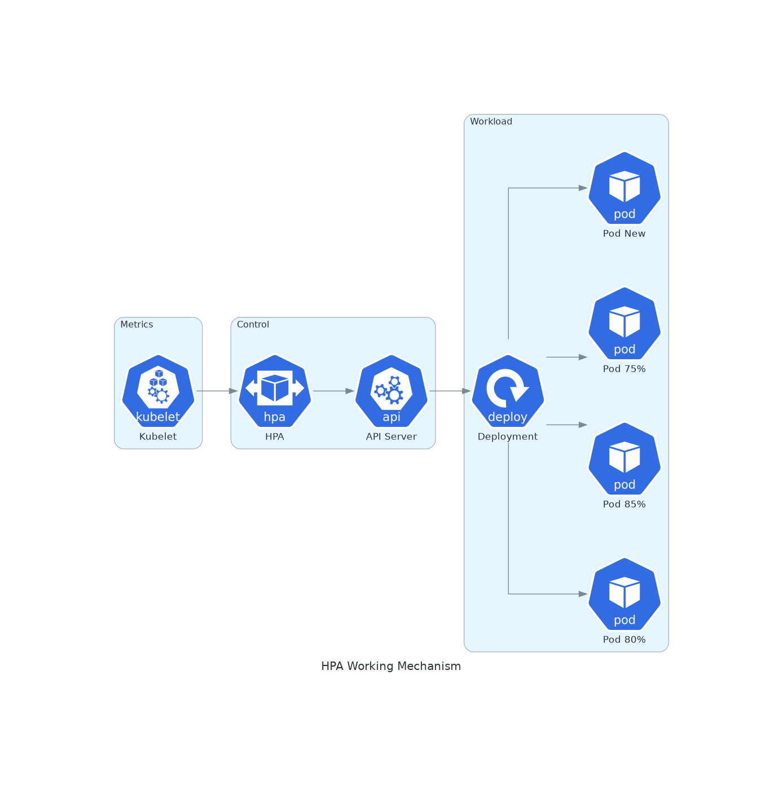
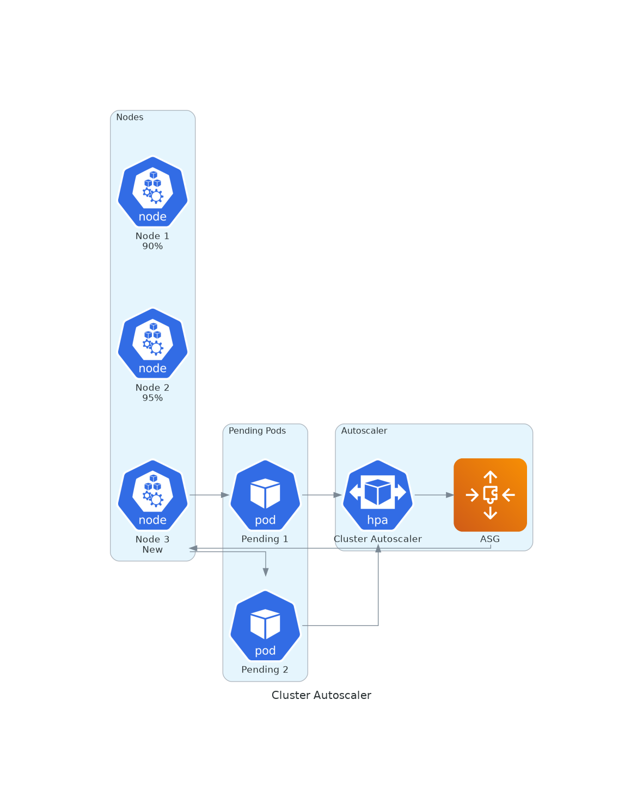

# November Week 4 Day 2 Session 3: HPA & Cluster Autoscaler

<div align="center">

**📈 HPA** • **🔄 Cluster Autoscaler** • **📊 Metrics Server** • **⚡ Auto Scaling**

*Kubernetes 자동 확장으로 탄력적 인프라 구축*

</div>

---

## 🕘 세션 정보
**시간**: 10:20-11:00 (40분)
**목표**: Horizontal Pod Autoscaler와 Cluster Autoscaler를 통한 자동 확장 메커니즘 이해
**방식**: 이론 강의 + 아키텍처 분석

## 🎯 학습 목표
- Horizontal Pod Autoscaler (HPA)의 작동 원리 및 설정 방법 이해
- Cluster Autoscaler의 노드 확장 메커니즘 파악
- Metrics Server를 통한 리소스 메트릭 수집 이해
- 리소스 요청/제한 설정 및 최적화 전략 습득

---

## 📖 서비스 개요

### 1. 생성 배경 (Why?) - 5분

**문제 상황**:
- **고정 리소스의 한계**: 트래픽 변동에 대응 불가
- **수동 스케일링 부담**: 24/7 모니터링 및 수동 조정 필요
- **리소스 낭비**: 피크 타임 기준으로 과다 프로비저닝
- **비용 증가**: 사용하지 않는 리소스에 대한 비용 발생

**Kubernetes 솔루션**:
- **HPA (Horizontal Pod Autoscaler)**: CPU/메모리 기반 Pod 자동 확장
- **Cluster Autoscaler**: 노드 부족 시 자동으로 노드 추가
- **Metrics Server**: 실시간 리소스 메트릭 수집
- **VPA (Vertical Pod Autoscaler)**: Pod 리소스 요청 자동 조정

### 2. 핵심 원리 (How?) - 10분

**HPA 작동 원리**:



*그림: Metrics Server가 수집한 CPU 사용률을 기반으로 HPA가 Deployment의 Pod 수를 자동 조정*

**Cluster Autoscaler 작동 원리**:



*그림: Pending 상태의 Pod가 발생하면 Cluster Autoscaler가 AWS Auto Scaling Group을 통해 새 노드를 자동 추가*

**핵심 개념**:
- **Target Utilization**: HPA가 유지하려는 목표 사용률 (예: CPU 50%)
- **Scale Up/Down**: Pod 수 증가/감소
- **Cooldown Period**: 스케일링 후 대기 시간 (기본: 3분 scale-up, 5분 scale-down)
- **Node Provisioning**: Cluster Autoscaler가 새 노드 추가
- **Node Termination**: 사용률 낮은 노드 자동 제거

### 3. 주요 사용 사례 (When?) - 5분

**적합한 경우**:
- **트래픽 변동이 큰 서비스**: 전자상거래, 뉴스 사이트
- **시간대별 패턴**: 업무 시간 vs 야간 시간
- **이벤트 기반 부하**: 프로모션, 마케팅 캠페인
- **비용 최적화**: 사용하지 않는 리소스 자동 축소

**실제 사례**:
- **Airbnb**: HPA로 검색 서비스 자동 확장
- **Spotify**: Cluster Autoscaler로 비용 30% 절감
- **Zalando**: 트래픽 급증 시 자동 대응

### 4. 비슷한 서비스 비교 (Which?) - 5분

**Kubernetes 내 대안**:
- **HPA** vs **VPA**
  - 언제 HPA 사용: Pod 수 증가로 처리량 향상 (Stateless 앱)
  - 언제 VPA 사용: Pod 리소스 크기 조정 (Stateful 앱, 단일 Pod)

- **Cluster Autoscaler** vs **Karpenter**
  - 언제 Cluster Autoscaler 사용: 기존 ASG 활용, 안정적 운영
  - 언제 Karpenter 사용: 빠른 프로비저닝, 다양한 인스턴스 타입

**Auto Scaling 비교**:
| 도구 | 대상 | 속도 | 복잡도 | 비용 |
|------|------|------|--------|------|
| **HPA** | Pod | 빠름 (초) | 낮음 | 무료 |
| **VPA** | Pod 리소스 | 중간 (분) | 중간 | 무료 |
| **Cluster Autoscaler** | Node | 느림 (분) | 중간 | EC2 비용 |
| **Karpenter** | Node | 빠름 (초) | 높음 | EC2 비용 |

### 5. 장단점 분석 - 3분

**HPA 장점**:
- ✅ 자동 Pod 확장/축소
- ✅ CPU/메모리 외 커스텀 메트릭 지원
- ✅ 빠른 반응 속도 (초 단위)
- ✅ 무료 (Kubernetes 기본 기능)

**HPA 단점/제약사항**:
- ⚠️ 노드 리소스 부족 시 효과 없음
- ⚠️ Stateful 애플리케이션에는 부적합
- ⚠️ 메트릭 수집 지연 (15-30초)
- ⚠️ 너무 빈번한 스케일링 가능

**Cluster Autoscaler 장점**:
- ✅ 노드 부족 시 자동 추가
- ✅ 사용률 낮은 노드 자동 제거
- ✅ AWS ASG와 완벽 통합
- ✅ 비용 최적화

**Cluster Autoscaler 단점/제약사항**:
- ⚠️ 노드 추가 시간 소요 (2-5분)
- ⚠️ 노드 제거 시 Pod 재배치 필요
- ⚠️ ASG 설정 필요
- ⚠️ 복잡한 설정 (여러 ASG 관리)

### 6. 비용 구조 💰 - 5분

**HPA 비용**:
- **HPA 자체**: 무료 (Kubernetes 기본 기능)
- **Metrics Server**: 무료 (메모리 사용: ~50MB)
- **추가 Pod 비용**: EC2 인스턴스 비용만 발생

**Cluster Autoscaler 비용**:
- **Cluster Autoscaler**: 무료 (Pod로 실행)
- **추가 노드 비용**: EC2 인스턴스 비용
  - t3.medium: $0.0416/hour
  - t3.large: $0.0832/hour

**프리티어 혜택**:
- EC2: t3.micro 750시간/월 무료 (12개월)
- CloudWatch: 10개 메트릭 무료

**비용 최적화 팁**:
1. **적절한 Target Utilization**: 너무 낮으면 리소스 낭비
2. **Scale Down 정책**: 사용률 낮은 노드 빠르게 제거
3. **Spot Instance**: 최대 90% 비용 절감
4. **Mixed Instance Policy**: On-Demand + Spot 혼합
5. **Scheduled Scaling**: 예측 가능한 패턴은 스케줄링

**예상 비용 시나리오**:
| 시나리오 | 최소 노드 | 최대 노드 | 평균 노드 | 월간 비용 |
|----------|-----------|-----------|-----------|-----------|
| **고정** | 4 | 4 | 4 | $121.34 |
| **Auto Scaling** | 2 | 8 | 3 | $91.01 |
| **절감액** | | | | **$30.33 (25%)** |

### 7. 최신 업데이트 🆕 - 2분

**2024년 주요 변경사항**:
- **HPA v2**: 더 많은 메트릭 타입 지원
- **Behavior 설정**: 세밀한 스케일링 제어
- **Container Metrics**: 컨테이너별 메트릭 지원
- **Karpenter 통합**: EKS Auto Mode에서 기본 제공

**2025년 예정**:
- **Predictive Scaling**: ML 기반 예측 스케일링
- **Multi-Metric HPA**: 여러 메트릭 동시 고려
- **Faster Scale Down**: 더 빠른 축소 속도

**Deprecated 기능**:
- **HPA v1**: v2로 마이그레이션 권장
- **autoscaling/v2beta2**: v2 사용

**참조**: [Kubernetes HPA](https://kubernetes.io/docs/tasks/run-application/horizontal-pod-autoscale/) (2024.11 업데이트)

### 8. 잘 사용하는 방법 ✅ - 3분

**HPA 베스트 프랙티스**:
1. **리소스 요청 필수 설정**: HPA는 requests 기준으로 동작
   ```yaml
   resources:
     requests:
       cpu: 100m
       memory: 128Mi
     limits:
       cpu: 500m
       memory: 512Mi
   ```

2. **적절한 Target Utilization**: 50-70% 권장
   ```yaml
   apiVersion: autoscaling/v2
   kind: HorizontalPodAutoscaler
   metadata:
     name: myapp-hpa
   spec:
     scaleTargetRef:
       apiVersion: apps/v1
       kind: Deployment
       name: myapp
     minReplicas: 2
     maxReplicas: 10
     metrics:
     - type: Resource
       resource:
         name: cpu
         target:
           type: Utilization
           averageUtilization: 50
   ```

3. **Behavior 설정**: 급격한 변동 방지
   ```yaml
   behavior:
     scaleDown:
       stabilizationWindowSeconds: 300
       policies:
       - type: Percent
         value: 50
         periodSeconds: 60
   ```

**Cluster Autoscaler 베스트 프랙티스**:
1. **ASG 태그 설정**: Cluster Autoscaler 인식
   ```
   k8s.io/cluster-autoscaler/<cluster-name>: owned
   k8s.io/cluster-autoscaler/enabled: true
   ```

2. **PodDisruptionBudget**: 안전한 노드 제거
   ```yaml
   apiVersion: policy/v1
   kind: PodDisruptionBudget
   metadata:
     name: myapp-pdb
   spec:
     minAvailable: 1
     selector:
       matchLabels:
         app: myapp
   ```

3. **Node Affinity**: 특정 노드 그룹 선호
   ```yaml
   affinity:
     nodeAffinity:
       preferredDuringSchedulingIgnoredDuringExecution:
       - weight: 1
         preference:
           matchExpressions:
           - key: node.kubernetes.io/instance-type
             operator: In
             values:
             - t3.medium
   ```

**실무 팁**:
- **Metrics 모니터링**: Prometheus + Grafana로 HPA 동작 추적
- **Load Testing**: 스케일링 동작 사전 테스트
- **Cost Tracking**: 스케일링으로 인한 비용 변화 모니터링

### 9. 잘못 사용하는 방법 ❌ - 3분

**흔한 실수**:
1. **리소스 요청 미설정**: HPA 동작 불가
2. **너무 낮은 minReplicas**: 트래픽 급증 시 대응 불가
3. **너무 높은 maxReplicas**: 비용 폭증 위험
4. **Metrics Server 미설치**: HPA 메트릭 수집 불가
5. **Cluster Autoscaler 권한 부족**: 노드 추가 실패

**안티 패턴**:
- **HPA + VPA 동시 사용**: CPU/메모리 기준 충돌
- **너무 짧은 Cooldown**: 불필요한 스케일링 반복
- **Stateful 앱에 HPA 적용**: 데이터 일관성 문제
- **노드 제거 시 PDB 미설정**: 서비스 중단

**보안 취약점**:
- **과도한 IAM 권한**: Cluster Autoscaler에 최소 권한만
- **메트릭 노출**: Metrics Server 접근 제어
- **리소스 제한 없음**: 무한 확장 방지

### 10. 구성 요소 상세 - 5분

**HPA 구성 요소**:

**1. HPA Spec**:
- **scaleTargetRef**: 확장 대상 (Deployment, ReplicaSet)
- **minReplicas**: 최소 Pod 수
- **maxReplicas**: 최대 Pod 수
- **metrics**: 메트릭 정의 (CPU, 메모리, 커스텀)

**2. Metrics 타입**:
- **Resource**: CPU, 메모리 (기본)
- **Pods**: Pod별 커스텀 메트릭
- **Object**: Kubernetes 객체 메트릭
- **External**: 외부 메트릭 (Prometheus, Datadog)

**3. Behavior**:
- **scaleUp**: 확장 정책
- **scaleDown**: 축소 정책
- **stabilizationWindowSeconds**: 안정화 시간

**Cluster Autoscaler 구성 요소**:

**1. Deployment**:
- **Image**: Cluster Autoscaler 이미지
- **Args**: 클러스터 이름, ASG 설정
- **ServiceAccount**: IAM 권한

**2. IAM Policy**:
- **AutoScaling**: DescribeAutoScalingGroups, SetDesiredCapacity
- **EC2**: DescribeInstances, DescribeLaunchTemplateVersions

**3. ASG 설정**:
- **Min Size**: 최소 노드 수
- **Max Size**: 최대 노드 수
- **Desired Capacity**: 현재 노드 수

**의존성**:
- **Metrics Server**: HPA 메트릭 수집 필수
- **AWS Auto Scaling Group**: Cluster Autoscaler 노드 관리
- **IAM Role**: Cluster Autoscaler 권한 필요

### 11. 공식 문서 링크 (필수 5개)

**⚠️ 학생들이 직접 확인해야 할 공식 문서**:
- 📘 [Kubernetes HPA](https://kubernetes.io/docs/tasks/run-application/horizontal-pod-autoscale/)
- 📗 [Cluster Autoscaler](https://github.com/kubernetes/autoscaler/tree/master/cluster-autoscaler)
- 📙 [EKS Autoscaling Best Practices](https://docs.aws.amazon.com/eks/latest/best-practices/cost-opt-compute.html)
- 📕 [Metrics Server](https://github.com/kubernetes-sigs/metrics-server)
- 🆕 [Karpenter](https://karpenter.sh/)

---

## 💭 함께 생각해보기

### 🤝 페어 토론 (5분)
1. **HPA Target Utilization**: 50%와 80% 중 어떤 것이 더 적합할까요?
2. **Cluster Autoscaler vs Karpenter**: 어떤 상황에서 어떤 도구를 선택해야 할까요?
3. **비용 최적화**: Auto Scaling으로 얼마나 비용을 절감할 수 있을까요?

### 🎯 전체 공유
- 각 팀의 스케일링 전략 공유
- 실무에서의 Auto Scaling 경험

### 💡 이해도 체크 질문
- ✅ "HPA가 CPU 사용률을 어떻게 측정하고 Pod를 확장하는지 설명할 수 있나요?"
- ✅ "Cluster Autoscaler가 노드를 추가하는 조건과 제거하는 조건을 아시나요?"
- ✅ "리소스 요청(requests)과 제한(limits)의 차이와 HPA와의 관계를 이해하셨나요?"

---

## 🔑 핵심 키워드

- **HPA (Horizontal Pod Autoscaler)**: Pod 수 자동 확장
- **Cluster Autoscaler**: 노드 수 자동 확장
- **Metrics Server**: 리소스 메트릭 수집
- **Target Utilization**: 목표 리소스 사용률
- **Scale Up/Down**: 확장/축소
- **Cooldown Period**: 스케일링 후 대기 시간
- **Resource Requests**: Pod가 요청하는 최소 리소스
- **Resource Limits**: Pod가 사용할 수 있는 최대 리소스
- **PodDisruptionBudget**: 안전한 Pod 제거 정책
- **Auto Scaling Group**: AWS EC2 인스턴스 그룹

---

## 📝 세션 마무리

### ✅ 오늘 세션 성과
- [ ] HPA의 작동 원리 및 설정 방법 이해
- [ ] Cluster Autoscaler의 노드 확장 메커니즘 파악
- [ ] Metrics Server를 통한 메트릭 수집 이해
- [ ] 리소스 요청/제한 설정 및 최적화 전략 습득

### 🎯 다음 단계
- **강사 Demo**: 마이크로서비스 배포 (11:00-12:00)
  - Frontend + Backend + Database 전체 스택 배포
  - ALB Ingress 설정 및 동작 확인
  - HPA 및 Cluster Autoscaler 실제 동작 시연
  - 부하 테스트 및 Auto Scaling 검증

---

<div align="center">

**📈 HPA** • **🔄 Cluster Autoscaler** • **📊 Metrics Server** • **⚡ Auto Scaling**

*탄력적이고 비용 효율적인 Kubernetes 인프라*

</div>
