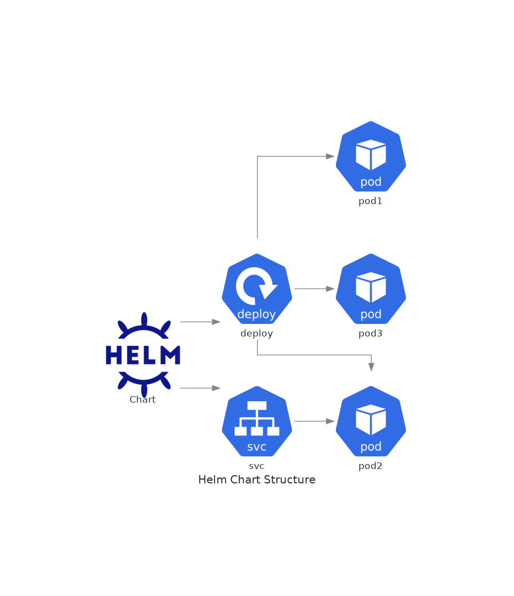

# November Week 4 Day 3 Session 1: Helm 기초

<div align="center">

**📦 패키지 관리** • **🎯 Release 관리** • **🔄 버전 제어**

*Kubernetes 애플리케이션 패키지 관리자*

</div>

---

## 🕘 세션 정보
**시간**: 09:00-09:40 (40분)
**목표**: Helm의 필요성과 기본 개념 이해
**방식**: 이론 강의 + 실제 사례 분석

## 🎯 학습 목표
- Helm이 필요한 이유와 해결하는 문제 이해
- Helm Chart 구조와 구성 요소 파악
- Values 파일을 통한 설정 관리 방법 습득
- Release 관리 및 버전 제어 개념 이해

---

## 📖 Helm 개요

### 1. 생성 배경 (Why?) - 5분

**문제 상황**:
- **복잡한 YAML 관리**: Kubernetes 애플리케이션은 수십 개의 YAML 파일 필요
  ```
  deployment.yaml
  service.yaml
  ingress.yaml
  configmap.yaml
  secret.yaml
  hpa.yaml
  pvc.yaml
  ...
  ```
- **환경별 설정 관리**: Dev, Staging, Prod 환경마다 다른 설정 필요
  - 이미지 태그, 리소스 제한, 도메인, 레플리카 수 등
  - 각 환경마다 별도 YAML 파일 유지 → 관리 부담
- **버전 관리 어려움**: 애플리케이션 업그레이드/롤백 시 모든 리소스 추적 필요
- **재사용성 부족**: 비슷한 애플리케이션을 배포할 때마다 YAML 복사/수정

**Helm 솔루션**:
- **템플릿 기반 관리**: 하나의 템플릿으로 여러 환경 관리
- **Values 파일**: 환경별 설정을 별도 파일로 분리
- **Release 관리**: 배포 이력 추적 및 롤백 지원
- **Chart Repository**: 재사용 가능한 패키지 공유

### 2. 핵심 원리 (How?) - 10분

**Helm 작동 원리**:



**Helm 3 아키텍처**:
```
Helm CLI (클라이언트)
    ↓
Kubernetes API Server
    ↓
Kubernetes Cluster
    ↓
Release (배포된 Chart 인스턴스)
```

**Chart 구조**:
```
mychart/
├── Chart.yaml          # Chart 메타데이터
├── values.yaml         # 기본 설정 값
├── charts/             # 의존성 Chart
├── templates/          # Kubernetes 리소스 템플릿
│   ├── deployment.yaml
│   ├── service.yaml
│   ├── ingress.yaml
│   ├── _helpers.tpl    # 템플릿 헬퍼 함수
│   └── NOTES.txt       # 설치 후 안내 메시지
└── .helmignore         # 패키징 시 제외할 파일
```

**템플릿 엔진**:
```yaml
# templates/deployment.yaml
apiVersion: apps/v1
kind: Deployment
metadata:
  name: {{ .Release.Name }}-{{ .Chart.Name }}
spec:
  replicas: {{ .Values.replicaCount }}
  template:
    spec:
      containers:
      - name: {{ .Chart.Name }}
        image: {{ .Values.image.repository }}:{{ .Values.image.tag }}
        resources:
          limits:
            cpu: {{ .Values.resources.limits.cpu }}
            memory: {{ .Values.resources.limits.memory }}
```

**Values 파일**:
```yaml
# values.yaml (기본값)
replicaCount: 2
image:
  repository: nginx
  tag: "1.21"
resources:
  limits:
    cpu: 200m
    memory: 256Mi

# values-prod.yaml (프로덕션 환경)
replicaCount: 5
image:
  tag: "1.21.6"
resources:
  limits:
    cpu: 500m
    memory: 512Mi
```

**Release 관리**:
```bash
# 설치
helm install myapp ./mychart -f values-prod.yaml

# 업그레이드
helm upgrade myapp ./mychart -f values-prod.yaml

# 롤백
helm rollback myapp 1

# 이력 확인
helm history myapp
```

### 3. 주요 사용 사례 (When?) - 5분

**적합한 경우**:
- **마이크로서비스 배포**: 여러 서비스를 일관되게 관리
- **멀티 환경 운영**: Dev/Staging/Prod 환경별 설정 관리
- **복잡한 애플리케이션**: 10개 이상의 Kubernetes 리소스 포함
- **팀 협업**: 표준화된 배포 방식 필요
- **CI/CD 통합**: 자동화된 배포 파이프라인

**실제 사례**:
- **Prometheus Stack**: 모니터링 시스템 전체를 하나의 Chart로 배포
  ```bash
  helm install prometheus prometheus-community/kube-prometheus-stack
  ```
- **Ingress Controller**: NGINX Ingress Controller 설치
  ```bash
  helm install ingress-nginx ingress-nginx/ingress-nginx
  ```
- **데이터베이스**: PostgreSQL, MySQL 등 Stateful 애플리케이션
  ```bash
  helm install my-postgres bitnami/postgresql
  ```

### 4. 비슷한 도구 비교 (Which?) - 5분

**Kubernetes 배포 도구 비교**:

| 기준 | Helm | Kustomize | kubectl |
|------|------|-----------|---------|
| **템플릿 방식** | Go Template | Overlay | 없음 |
| **패키지 관리** | ✅ Chart Repository | ❌ | ❌ |
| **버전 관리** | ✅ Release History | ❌ | ❌ |
| **롤백 기능** | ✅ 자동 | ❌ 수동 | ❌ 수동 |
| **학습 곡선** | 중간 | 낮음 | 낮음 |
| **재사용성** | ✅ 높음 | 중간 | 낮음 |
| **커뮤니티** | ✅ 매우 활발 | 활발 | 기본 |

**언제 Helm을 사용하는가**:
- 복잡한 애플리케이션 (10+ 리소스)
- 여러 환경 관리 필요
- 버전 관리 및 롤백 필요
- 커뮤니티 Chart 활용

**언제 Kustomize를 사용하는가**:
- 간단한 애플리케이션
- YAML 원본 유지 선호
- kubectl 네이티브 통합 선호

**언제 kubectl을 사용하는가**:
- 매우 간단한 배포
- 학습 목적
- 빠른 테스트

### 5. 장단점 분석 - 3분

**장점**:
- ✅ **패키지 관리**: Chart Repository로 재사용 가능
- ✅ **버전 제어**: Release 이력 추적 및 롤백
- ✅ **템플릿 엔진**: 환경별 설정 쉽게 관리
- ✅ **커뮤니티**: 수천 개의 공개 Chart 사용 가능
- ✅ **CI/CD 통합**: 자동화 파이프라인 구축 용이

**단점/제약사항**:
- ⚠️ **학습 곡선**: Go Template 문법 학습 필요
- ⚠️ **디버깅 어려움**: 템플릿 렌더링 결과 확인 필요
- ⚠️ **복잡성**: 간단한 배포에는 과도할 수 있음
- ⚠️ **Helm 2 → 3 마이그레이션**: 기존 Helm 2 사용자는 마이그레이션 필요

**대안**:
- 간단한 앱: kubectl 직접 사용
- 템플릿 싫음: Kustomize 사용
- GitOps: ArgoCD + Helm 조합

### 6. 비용 구조 💰 - 5분

**Helm 자체 비용**:
- **무료**: Helm은 오픈소스 도구 (Apache 2.0 라이선스)
- **Chart Repository**: 
  - Public: 무료 (Artifact Hub, GitHub Pages)
  - Private: ChartMuseum (자체 호스팅) 또는 Harbor

**관련 비용**:
- **Kubernetes 클러스터**: EKS, GKE, AKS 비용
- **스토리지**: Chart 저장소 (S3, GCS 등)
- **CI/CD**: GitHub Actions, GitLab CI 등

**비용 최적화 팁**:
1. **Public Chart 활용**: 커뮤니티 Chart 최대한 활용
2. **Chart Repository**: GitHub Pages 무료 호스팅
3. **로컬 개발**: Minikube/Kind로 로컬 테스트
4. **캐싱**: Chart 다운로드 캐싱으로 네트워크 비용 절감

**예상 비용 (EKS 기준)**:
| 항목 | 비용 | 비고 |
|------|------|------|
| Helm CLI | $0 | 무료 |
| Chart Repository (GitHub Pages) | $0 | 무료 |
| EKS Cluster | $0.10/hour | 클러스터 비용 |
| Worker Nodes | $0.0416/hour | t3.medium 기준 |

### 7. 최신 업데이트 🆕 - 2분

**Helm 3 주요 변경사항** (2019년 출시):
- **Tiller 제거**: 클라이언트만으로 동작 (보안 강화)
- **3-Way Merge**: 업그레이드 시 더 안전한 병합
- **Release Namespace**: Release가 네임스페이스에 저장
- **Library Charts**: 재사용 가능한 Chart 라이브러리

**2024년 업데이트**:
- **Helm 3.14**: OCI Registry 지원 강화
- **성능 개선**: 대규모 Chart 처리 속도 향상
- **보안 강화**: Chart 서명 및 검증 개선

**2025년 예정**:
- **Helm 4.0**: 더 나은 의존성 관리
- **AI 통합**: Chart 자동 생성 도구

**참조**: [Helm 공식 문서](https://helm.sh/docs/)

### 8. 잘 사용하는 방법 ✅ - 3분

**베스트 프랙티스**:
1. **Values 파일 분리**: 환경별 values 파일 관리
   ```bash
   helm install myapp ./chart -f values-prod.yaml
   ```

2. **버전 관리**: Chart.yaml에 명확한 버전 명시
   ```yaml
   apiVersion: v2
   name: myapp
   version: 1.2.3
   appVersion: "2.0.1"
   ```

3. **템플릿 검증**: 배포 전 렌더링 결과 확인
   ```bash
   helm template myapp ./chart -f values-prod.yaml
   ```

4. **Dry Run**: 실제 배포 전 시뮬레이션
   ```bash
   helm install myapp ./chart --dry-run --debug
   ```

5. **Release 이름 규칙**: 환경-앱이름 형식
   ```bash
   helm install prod-myapp ./chart
   ```

**실무 팁**:
- **_helpers.tpl 활용**: 공통 템플릿 함수 정의
- **NOTES.txt 작성**: 설치 후 안내 메시지 제공
- **의존성 관리**: Chart.yaml에 의존성 명시
- **Chart 테스트**: `helm test` 명령어로 검증

**성능 최적화**:
- **Chart 캐싱**: `helm repo update` 주기적 실행
- **병렬 설치**: 독립적인 Chart는 병렬 설치
- **리소스 제한**: values.yaml에 적절한 리소스 설정

### 9. 잘못 사용하는 방법 ❌ - 3분

**흔한 실수**:
1. **하드코딩**: 템플릿에 값 직접 입력
   ```yaml
   # ❌ 나쁜 예
   replicas: 3
   
   # ✅ 좋은 예
   replicas: {{ .Values.replicaCount }}
   ```

2. **Values 파일 미사용**: 모든 설정을 명령줄로 전달
   ```bash
   # ❌ 나쁜 예
   helm install myapp ./chart --set image.tag=v1.0 --set replicas=3 ...
   
   # ✅ 좋은 예
   helm install myapp ./chart -f values-prod.yaml
   ```

3. **Release 이름 중복**: 같은 네임스페이스에 같은 이름
   ```bash
   # ❌ 오류 발생
   helm install myapp ./chart -n default
   helm install myapp ./chart -n default  # 실패!
   ```

4. **버전 관리 무시**: Chart 버전 업데이트 안 함
   ```yaml
   # ❌ 항상 0.1.0
   version: 0.1.0
   ```

5. **테스트 생략**: 프로덕션에 바로 배포
   ```bash
   # ❌ 위험
   helm install prod-app ./chart -f values-prod.yaml
   
   # ✅ 안전
   helm install prod-app ./chart -f values-prod.yaml --dry-run
   helm install prod-app ./chart -f values-prod.yaml
   ```

**안티 패턴**:
- **거대한 Chart**: 모든 것을 하나의 Chart에 포함
- **복잡한 템플릿**: 과도한 조건문과 반복문
- **문서화 부족**: README.md와 NOTES.txt 미작성
- **의존성 무시**: 필요한 Chart를 수동 설치

**보안 취약점**:
- **Secret 노출**: values.yaml에 비밀번호 하드코딩
- **권한 과다**: 불필요한 RBAC 권한 부여
- **검증 생략**: Chart 서명 확인 안 함

### 10. 구성 요소 상세 - 5분

**주요 구성 요소**:

**1. Chart.yaml (메타데이터)**:
```yaml
apiVersion: v2              # Chart API 버전
name: myapp                 # Chart 이름
version: 1.0.0              # Chart 버전
appVersion: "2.0"           # 애플리케이션 버전
description: My Application
type: application           # application 또는 library
keywords:
  - web
  - api
maintainers:
  - name: DevOps Team
    email: devops@example.com
dependencies:               # 의존 Chart
  - name: postgresql
    version: 12.x.x
    repository: https://charts.bitnami.com/bitnami
```

**2. values.yaml (설정 값)**:
```yaml
# 기본 설정
replicaCount: 2

image:
  repository: myapp
  pullPolicy: IfNotPresent
  tag: "latest"

service:
  type: ClusterIP
  port: 80

ingress:
  enabled: false
  className: nginx
  hosts:
    - host: myapp.example.com
      paths:
        - path: /
          pathType: Prefix

resources:
  limits:
    cpu: 200m
    memory: 256Mi
  requests:
    cpu: 100m
    memory: 128Mi

autoscaling:
  enabled: false
  minReplicas: 2
  maxReplicas: 10
  targetCPUUtilizationPercentage: 80
```

**3. templates/ (리소스 템플릿)**:
```yaml
# templates/deployment.yaml
apiVersion: apps/v1
kind: Deployment
metadata:
  name: {{ include "myapp.fullname" . }}
  labels:
    {{- include "myapp.labels" . | nindent 4 }}
spec:
  {{- if not .Values.autoscaling.enabled }}
  replicas: {{ .Values.replicaCount }}
  {{- end }}
  selector:
    matchLabels:
      {{- include "myapp.selectorLabels" . | nindent 6 }}
  template:
    metadata:
      labels:
        {{- include "myapp.selectorLabels" . | nindent 8 }}
    spec:
      containers:
      - name: {{ .Chart.Name }}
        image: "{{ .Values.image.repository }}:{{ .Values.image.tag | default .Chart.AppVersion }}"
        ports:
        - name: http
          containerPort: 80
        resources:
          {{- toYaml .Values.resources | nindent 12 }}
```

**4. _helpers.tpl (헬퍼 함수)**:
```yaml
{{/*
Expand the name of the chart.
*/}}
{{- define "myapp.name" -}}
{{- default .Chart.Name .Values.nameOverride | trunc 63 | trimSuffix "-" }}
{{- end }}

{{/*
Create a default fully qualified app name.
*/}}
{{- define "myapp.fullname" -}}
{{- if .Values.fullnameOverride }}
{{- .Values.fullnameOverride | trunc 63 | trimSuffix "-" }}
{{- else }}
{{- $name := default .Chart.Name .Values.nameOverride }}
{{- printf "%s-%s" .Release.Name $name | trunc 63 | trimSuffix "-" }}
{{- end }}
{{- end }}

{{/*
Common labels
*/}}
{{- define "myapp.labels" -}}
helm.sh/chart: {{ include "myapp.chart" . }}
{{ include "myapp.selectorLabels" . }}
{{- if .Chart.AppVersion }}
app.kubernetes.io/version: {{ .Chart.AppVersion | quote }}
{{- end }}
app.kubernetes.io/managed-by: {{ .Release.Service }}
{{- end }}
```

**5. NOTES.txt (설치 안내)**:
```
Thank you for installing {{ .Chart.Name }}.

Your release is named {{ .Release.Name }}.

To learn more about the release, try:

  $ helm status {{ .Release.Name }}
  $ helm get all {{ .Release.Name }}

{{- if .Values.ingress.enabled }}
Application URL:
  http{{ if .Values.ingress.tls }}s{{ end }}://{{ .Values.ingress.hosts[0].host }}
{{- else }}
Get the application URL by running:
  export POD_NAME=$(kubectl get pods --namespace {{ .Release.Namespace }} -l "app.kubernetes.io/name={{ include "myapp.name" . }}" -o jsonpath="{.items[0].metadata.name}")
  kubectl --namespace {{ .Release.Namespace }} port-forward $POD_NAME 8080:80
  echo "Visit http://127.0.0.1:8080"
{{- end }}
```

### 11. 공식 문서 링크 (필수 5개)

**⚠️ 학생들이 직접 확인해야 할 공식 문서**:
- 📘 [Helm이란?](https://helm.sh/docs/intro/using_helm/)
- 📗 [Helm 사용자 가이드](https://helm.sh/docs/)
- 📙 [Chart 개발 가이드](https://helm.sh/docs/chart_template_guide/)
- 📕 [Chart 베스트 프랙티스](https://helm.sh/docs/chart_best_practices/)
- 🆕 [Helm 릴리스 노트](https://github.com/helm/helm/releases)

---

## 💭 함께 생각해보기

### 🤝 토론 주제
1. **Helm vs kubectl**: 어떤 상황에서 Helm을 사용하고, 어떤 상황에서 kubectl을 사용하는 것이 좋을까요?
2. **Chart 재사용**: 팀 내에서 Chart를 어떻게 공유하고 재사용할 수 있을까요?
3. **버전 관리**: Chart 버전과 애플리케이션 버전을 어떻게 관리하는 것이 좋을까요?

### 💡 이해도 체크 질문
- ✅ "Helm이 해결하는 주요 문제 3가지를 설명할 수 있나요?"
- ✅ "Chart의 주요 구성 요소를 나열할 수 있나요?"
- ✅ "Values 파일을 사용하는 이유를 설명할 수 있나요?"
- ✅ "Release 관리가 왜 중요한지 설명할 수 있나요?"

---

## 🔑 핵심 키워드

- **Helm**: Kubernetes 패키지 관리자
- **Chart**: Kubernetes 리소스 패키지
- **Release**: 배포된 Chart 인스턴스
- **Values**: Chart 설정 값
- **Template**: Go Template 기반 리소스 정의
- **Repository**: Chart 저장소
- **Rollback**: 이전 버전으로 복구

---

## 📝 세션 마무리

### ✅ 오늘 세션 성과
- [ ] Helm의 필요성과 해결하는 문제 이해
- [ ] Chart 구조와 구성 요소 파악
- [ ] Values 파일을 통한 설정 관리 이해
- [ ] Release 관리 개념 습득

### 🎯 다음 세션 준비
**Session 2: Helm Chart 작성**
- Chart 템플릿 작성 방법
- 조건문과 반복문 활용
- 의존성 관리
- Chart Repository 구축

---

<div align="center">

**📦 패키지 관리** • **🎯 Release 관리** • **🔄 버전 제어**

*Helm으로 Kubernetes 애플리케이션을 효율적으로 관리하세요*

</div>
