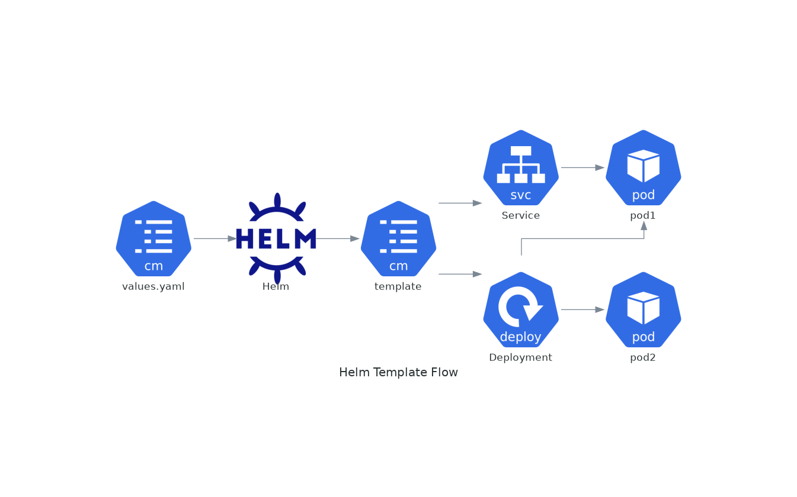
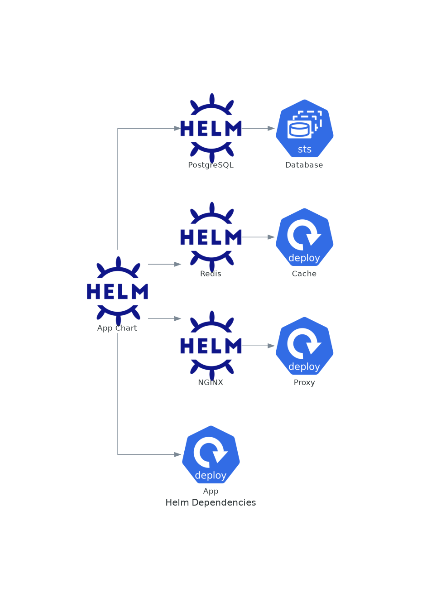

# November Week 4 Day 3 Session 2: Helm Chart 작성

<div align="center">

**📝 템플릿 작성** • **🔄 조건문/반복문** • **📦 의존성 관리**

*실무에서 사용하는 Helm Chart 개발*

</div>

---

## 🕘 세션 정보
**시간**: 09:40-10:20 (40분)
**목표**: Helm Chart 템플릿 작성 및 고급 기능 활용
**방식**: 이론 강의 + 실제 Chart 분석

## 🎯 학습 목표
- Go Template 문법을 활용한 Chart 템플릿 작성
- 조건문과 반복문을 사용한 동적 리소스 생성
- Chart 의존성 관리 및 서브 Chart 활용
- Chart Repository 구축 및 배포

---

## 📖 Helm Chart 작성 개요

### 1. 생성 배경 (Why?) - 5분

**문제 상황**:
- **정적 YAML의 한계**: 환경마다 다른 설정을 위해 파일 복사 필요
- **반복 코드**: 비슷한 리소스를 여러 번 작성
- **조건부 배포**: 특정 환경에서만 리소스 생성 필요
- **의존성 관리**: 애플리케이션이 필요로 하는 다른 서비스 관리

**Chart 템플릿 솔루션**:
- **동적 생성**: 조건과 반복문으로 유연한 리소스 생성
- **재사용성**: 헬퍼 함수로 공통 로직 추출
- **의존성 자동화**: Chart.yaml에 의존성 선언
- **타입 안전성**: 템플릿 검증으로 오류 사전 방지

### 2. 핵심 원리 (How?) - 10분

**템플릿 렌더링 흐름**:



**Go Template 기본 문법**:

```yaml
# 1. 변수 참조
{{ .Values.replicaCount }}
{{ .Chart.Name }}
{{ .Release.Name }}

# 2. 파이프라인
{{ .Values.image.tag | default "latest" }}
{{ .Values.name | upper | quote }}

# 3. 조건문
{{- if .Values.ingress.enabled }}
apiVersion: networking.k8s.io/v1
kind: Ingress
# ...
{{- end }}

# 4. 반복문
{{- range .Values.environments }}
- name: {{ . }}
{{- end }}

# 5. 변수 선언
{{- $fullName := include "myapp.fullname" . -}}
name: {{ $fullName }}

# 6. 함수 호출
{{ include "myapp.labels" . | nindent 4 }}
{{ toYaml .Values.resources | nindent 12 }}
```

**조건문 활용 예시**:

```yaml
# templates/ingress.yaml
{{- if .Values.ingress.enabled -}}
apiVersion: networking.k8s.io/v1
kind: Ingress
metadata:
  name: {{ include "myapp.fullname" . }}
  {{- if .Values.ingress.annotations }}
  annotations:
    {{- toYaml .Values.ingress.annotations | nindent 4 }}
  {{- end }}
spec:
  {{- if .Values.ingress.tls }}
  tls:
    {{- range .Values.ingress.tls }}
    - hosts:
        {{- range .hosts }}
        - {{ . | quote }}
        {{- end }}
      secretName: {{ .secretName }}
    {{- end }}
  {{- end }}
  rules:
    {{- range .Values.ingress.hosts }}
    - host: {{ .host | quote }}
      http:
        paths:
          {{- range .paths }}
          - path: {{ .path }}
            pathType: {{ .pathType }}
            backend:
              service:
                name: {{ include "myapp.fullname" $ }}
                port:
                  number: {{ $.Values.service.port }}
          {{- end }}
    {{- end }}
{{- end }}
```

**반복문 활용 예시**:

```yaml
# values.yaml
extraEnvVars:
  - name: DATABASE_HOST
    value: postgres.example.com
  - name: REDIS_HOST
    value: redis.example.com
  - name: LOG_LEVEL
    value: info

# templates/deployment.yaml
env:
{{- range .Values.extraEnvVars }}
- name: {{ .name }}
  value: {{ .value | quote }}
{{- end }}
```

**헬퍼 함수 (_helpers.tpl)**:

```yaml
{{/*
Create chart name and version as used by the chart label.
*/}}
{{- define "myapp.chart" -}}
{{- printf "%s-%s" .Chart.Name .Chart.Version | replace "+" "_" | trunc 63 | trimSuffix "-" }}
{{- end }}

{{/*
Selector labels
*/}}
{{- define "myapp.selectorLabels" -}}
app.kubernetes.io/name: {{ include "myapp.name" . }}
app.kubernetes.io/instance: {{ .Release.Name }}
{{- end }}

{{/*
Create the name of the service account to use
*/}}
{{- define "myapp.serviceAccountName" -}}
{{- if .Values.serviceAccount.create }}
{{- default (include "myapp.fullname" .) .Values.serviceAccount.name }}
{{- else }}
{{- default "default" .Values.serviceAccount.name }}
{{- end }}
{{- end }}
```

### 3. 주요 사용 사례 (When?) - 5분

**적합한 경우**:
- **멀티 환경 배포**: Dev/Staging/Prod 환경별 다른 설정
- **선택적 리소스**: Ingress, HPA 등 조건부 생성
- **반복 리소스**: 여러 개의 비슷한 리소스 생성
- **복잡한 애플리케이션**: 10개 이상의 Kubernetes 리소스
- **의존성 있는 앱**: Database, Cache 등 다른 서비스 필요

**실제 사례**:
- **WordPress Chart**: MySQL 의존성 포함
  ```yaml
  dependencies:
    - name: mysql
      version: 9.x.x
      repository: https://charts.bitnami.com/bitnami
      condition: mysql.enabled
  ```

- **Microservices**: 여러 서비스를 하나의 Chart로
  ```yaml
  services:
    - name: frontend
      replicas: 3
    - name: backend
      replicas: 5
    - name: worker
      replicas: 2
  ```

### 4. 비슷한 도구 비교 (Which?) - 5분

**템플릿 도구 비교**:

| 기준 | Helm | Kustomize | Jsonnet |
|------|------|-----------|---------|
| **문법** | Go Template | YAML Overlay | Jsonnet |
| **학습 곡선** | 중간 | 낮음 | 높음 |
| **조건문** | ✅ | ❌ | ✅ |
| **반복문** | ✅ | ❌ | ✅ |
| **의존성** | ✅ | ❌ | ❌ |
| **커뮤니티** | 매우 활발 | 활발 | 보통 |

**언제 Helm Template을 사용하는가**:
- 복잡한 조건 로직 필요
- 의존성 관리 필요
- 커뮤니티 Chart 활용

**언제 Kustomize를 사용하는가**:
- 간단한 오버레이만 필요
- YAML 원본 유지 선호
- kubectl 네이티브 통합

### 5. 장단점 분석 - 3분

**장점**:
- ✅ **강력한 템플릿**: 조건문, 반복문, 함수 지원
- ✅ **재사용성**: 헬퍼 함수로 공통 로직 추출
- ✅ **의존성 관리**: Chart.yaml에 선언적 관리
- ✅ **검증**: `helm lint`, `helm template`로 사전 검증
- ✅ **문서화**: NOTES.txt로 사용자 안내

**단점/제약사항**:
- ⚠️ **복잡성**: Go Template 문법 학습 필요
- ⚠️ **디버깅**: 템플릿 오류 찾기 어려움
- ⚠️ **가독성**: 복잡한 템플릿은 읽기 어려움
- ⚠️ **성능**: 대규모 Chart는 렌더링 시간 소요

### 6. 비용 구조 💰 - 5분

**Chart 개발 비용**:
- **개발 시간**: 초기 Chart 작성 (2-5일)
- **유지보수**: 월 1-2일 (업데이트 및 버그 수정)
- **학습 비용**: Go Template 학습 (1-2주)

**Chart Repository 비용**:
- **GitHub Pages**: 무료
- **ChartMuseum (자체 호스팅)**: 서버 비용 ($5-20/월)
- **Harbor**: 서버 비용 ($20-50/월)
- **Artifact Hub**: 무료 (Public Chart)

**비용 최적화 팁**:
1. **Public Chart 활용**: 커뮤니티 Chart 커스터마이징
2. **GitHub Pages**: 무료 Chart Repository
3. **템플릿 재사용**: 헬퍼 함수로 중복 제거
4. **자동화**: CI/CD로 Chart 테스트 자동화

### 7. 최신 업데이트 🆕 - 2분

**Helm 3.x 템플릿 기능**:
- **Lookup 함수**: 클러스터 리소스 조회
  ```yaml
  {{- $secret := lookup "v1" "Secret" .Release.Namespace "mysecret" }}
  ```
- **mustToJson/mustToPrettyJson**: JSON 변환
- **sha256sum**: 체크섬 생성 (ConfigMap 업데이트 트리거)

**2024년 개선사항**:
- **템플릿 성능**: 대규모 Chart 렌더링 속도 향상
- **오류 메시지**: 더 명확한 템플릿 오류 표시
- **함수 추가**: 새로운 템플릿 함수 지원

### 8. 잘 사용하는 방법 ✅ - 3분

**베스트 프랙티스**:

1. **헬퍼 함수 활용**:
   ```yaml
   {{- define "myapp.labels" -}}
   app: {{ include "myapp.name" . }}
   release: {{ .Release.Name }}
   {{- end }}
   ```

2. **조건문 간결화**:
   ```yaml
   {{- if and .Values.ingress.enabled .Values.ingress.tls }}
   # TLS 설정
   {{- end }}
   ```

3. **기본값 제공**:
   ```yaml
   image: {{ .Values.image.repository }}:{{ .Values.image.tag | default .Chart.AppVersion }}
   ```

4. **들여쓰기 함수**:
   ```yaml
   labels:
     {{- include "myapp.labels" . | nindent 4 }}
   ```

5. **템플릿 검증**:
   ```bash
   helm lint ./mychart
   helm template mychart ./mychart --debug
   ```

### 9. 잘못 사용하는 방법 ❌ - 3분

**흔한 실수**:

1. **과도한 복잡성**:
   ```yaml
   # ❌ 너무 복잡
   {{- if and (eq .Values.env "prod") (or .Values.ha.enabled (gt .Values.replicas 3)) }}
   ```

2. **하드코딩**:
   ```yaml
   # ❌ 나쁜 예
   replicas: 3
   
   # ✅ 좋은 예
   replicas: {{ .Values.replicaCount }}
   ```

3. **들여쓰기 오류**:
   ```yaml
   # ❌ 잘못된 들여쓰기
   labels:
   {{ include "myapp.labels" . }}
   
   # ✅ 올바른 들여쓰기
   labels:
     {{- include "myapp.labels" . | nindent 4 }}
   ```

4. **공백 처리 무시**:
   ```yaml
   # ❌ 불필요한 공백
   {{ if .Values.enabled }}
   
   # ✅ 공백 제거
   {{- if .Values.enabled }}
   ```

### 10. 구성 요소 상세 - 5분

**Chart 의존성 관리**:



**Chart.yaml 의존성 선언**:
```yaml
dependencies:
  - name: postgresql
    version: "12.x.x"
    repository: https://charts.bitnami.com/bitnami
    condition: postgresql.enabled
    tags:
      - database
  
  - name: redis
    version: "17.x.x"
    repository: https://charts.bitnami.com/bitnami
    condition: redis.enabled
    tags:
      - cache
  
  - name: nginx
    version: "13.x.x"
    repository: https://charts.bitnami.com/bitnami
    condition: nginx.enabled
    alias: ingress-controller
```

**의존성 설치**:
```bash
# 의존성 다운로드
helm dependency update ./mychart

# 의존성 확인
helm dependency list ./mychart

# 특정 의존성 비활성화
helm install myapp ./mychart --set postgresql.enabled=false
```

**서브 Chart Values**:
```yaml
# values.yaml
postgresql:
  enabled: true
  auth:
    username: myapp
    password: secret
    database: myappdb
  primary:
    persistence:
      size: 10Gi

redis:
  enabled: true
  auth:
    enabled: false
  master:
    persistence:
      size: 5Gi
```

### 11. 공식 문서 링크 (필수 5개)

**⚠️ 학생들이 직접 확인해야 할 공식 문서**:
- 📘 [Chart 템플릿 가이드](https://helm.sh/docs/chart_template_guide/)
- 📗 [템플릿 함수 목록](https://helm.sh/docs/chart_template_guide/function_list/)
- 📙 [Chart 의존성](https://helm.sh/docs/helm/helm_dependency/)
- 📕 [Chart 베스트 프랙티스](https://helm.sh/docs/chart_best_practices/)
- 🆕 [Helm 템플릿 디버깅](https://helm.sh/docs/chart_template_guide/debugging/)

---

## 💭 함께 생각해보기

### 🤝 토론 주제
1. **템플릿 복잡도**: 어느 정도까지 템플릿을 복잡하게 만드는 것이 적절할까요?
2. **의존성 관리**: Chart 의존성을 어떻게 버전 관리하는 것이 좋을까요?
3. **헬퍼 함수**: 어떤 로직을 헬퍼 함수로 추출해야 할까요?

### 💡 이해도 체크 질문
- ✅ "Go Template의 기본 문법을 설명할 수 있나요?"
- ✅ "조건문과 반복문을 언제 사용하는지 설명할 수 있나요?"
- ✅ "Chart 의존성을 어떻게 관리하는지 설명할 수 있나요?"

---

## 🔑 핵심 키워드

- **Go Template**: Helm 템플릿 엔진
- **조건문**: if/else로 선택적 리소스 생성
- **반복문**: range로 반복 리소스 생성
- **헬퍼 함수**: _helpers.tpl에 정의된 재사용 함수
- **의존성**: Chart.yaml에 선언된 서브 Chart
- **nindent**: 들여쓰기 함수
- **lookup**: 클러스터 리소스 조회

---

## 📝 세션 마무리

### ✅ 오늘 세션 성과
- [ ] Go Template 문법 이해
- [ ] 조건문과 반복문 활용법 습득
- [ ] Chart 의존성 관리 방법 파악
- [ ] 템플릿 디버깅 방법 이해

### 🎯 다음 세션 준비
**Session 3: 실무 Helm 활용**
- Prometheus Stack 배포
- Ingress Controller 설치
- Cert-Manager 활용
- 애플리케이션 Chart 작성

---

<div align="center">

**📝 템플릿 작성** • **🔄 조건문/반복문** • **📦 의존성 관리**

*강력한 템플릿으로 유연한 Kubernetes 배포를 구현하세요*

</div>
