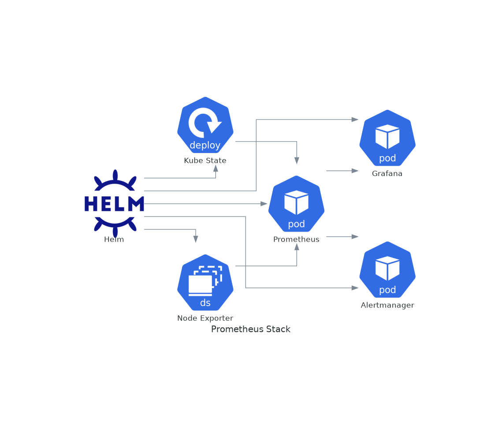

# November Week 4 Day 3 Session 3: 실무 Helm 활용

<div align="center">

**📊 Prometheus** • **🔒 Cert-Manager** • **🌐 Ingress** • **🚀 실전 배포**

*프로덕션 환경에서 Helm 활용하기*

</div>

---

## 🕘 세션 정보
**시간**: 10:20-11:00 (40분)
**목표**: 실무에서 자주 사용하는 Helm Chart 활용법 습득
**방식**: 이론 강의 + 실제 Chart 분석

## 🎯 학습 목표
- Prometheus Stack을 Helm으로 배포하는 방법 이해
- Ingress Controller 설치 및 설정 방법 습득
- Cert-Manager를 통한 SSL 인증서 자동화 이해
- 실무 애플리케이션 Chart 작성 패턴 파악

---

## 📖 실무 Helm 활용 개요

### 1. 생성 배경 (Why?) - 5분

**문제 상황**:
- **복잡한 모니터링 스택**: Prometheus, Grafana, Alertmanager 등 여러 컴포넌트
- **SSL 인증서 관리**: Let's Encrypt 인증서 수동 갱신의 번거로움
- **Ingress 설정**: 여러 서비스의 라우팅 규칙 관리
- **표준화 부족**: 팀마다 다른 배포 방식

**Helm Chart 솔루션**:
- **올인원 패키지**: 관련 컴포넌트를 하나의 Chart로 관리
- **자동화**: 인증서 발급 및 갱신 자동화
- **베스트 프랙티스**: 커뮤니티 검증된 설정
- **일관성**: 표준화된 배포 방식

### 2. 핵심 원리 (How?) - 10분

**Prometheus Stack 아키텍처**:



**1. Prometheus Stack 배포**:

```bash
# Helm Repository 추가
helm repo add prometheus-community https://prometheus-community.github.io/helm-charts
helm repo update

# Chart 설치
helm install prometheus prometheus-community/kube-prometheus-stack \
  --namespace monitoring \
  --create-namespace \
  --set prometheus.prometheusSpec.retention=30d \
  --set grafana.adminPassword=admin123
```

**Values 커스터마이징**:
```yaml
# values-prometheus.yaml
prometheus:
  prometheusSpec:
    retention: 30d
    storageSpec:
      volumeClaimTemplate:
        spec:
          accessModes: ["ReadWriteOnce"]
          resources:
            requests:
              storage: 50Gi

grafana:
  adminPassword: "secure-password"
  ingress:
    enabled: true
    hosts:
      - grafana.example.com
  persistence:
    enabled: true
    size: 10Gi

alertmanager:
  alertmanagerSpec:
    storage:
      volumeClaimTemplate:
        spec:
          accessModes: ["ReadWriteOnce"]
          resources:
            requests:
              storage: 10Gi
```

**2. Ingress Controller 배포**:

```bash
# NGINX Ingress Controller
helm repo add ingress-nginx https://kubernetes.github.io/ingress-nginx
helm repo update

helm install ingress-nginx ingress-nginx/ingress-nginx \
  --namespace ingress-nginx \
  --create-namespace \
  --set controller.service.type=LoadBalancer \
  --set controller.metrics.enabled=true
```

**Ingress 리소스 생성**:
```yaml
# values-ingress.yaml
controller:
  service:
    type: LoadBalancer
    annotations:
      service.beta.kubernetes.io/aws-load-balancer-type: nlb
  
  metrics:
    enabled: true
    serviceMonitor:
      enabled: true
  
  resources:
    requests:
      cpu: 100m
      memory: 128Mi
    limits:
      cpu: 500m
      memory: 512Mi
```

**3. Cert-Manager 배포**:

```bash
# Cert-Manager 설치
helm repo add jetstack https://charts.jetstack.io
helm repo update

helm install cert-manager jetstack/cert-manager \
  --namespace cert-manager \
  --create-namespace \
  --set installCRDs=true
```

**Let's Encrypt Issuer**:
```yaml
# letsencrypt-issuer.yaml
apiVersion: cert-manager.io/v1
kind: ClusterIssuer
metadata:
  name: letsencrypt-prod
spec:
  acme:
    server: https://acme-v02.api.letsencrypt.org/directory
    email: admin@example.com
    privateKeySecretRef:
      name: letsencrypt-prod
    solvers:
    - http01:
        ingress:
          class: nginx
```

**SSL 인증서 자동 발급**:
```yaml
# ingress-with-tls.yaml
apiVersion: networking.k8s.io/v1
kind: Ingress
metadata:
  name: myapp
  annotations:
    cert-manager.io/cluster-issuer: letsencrypt-prod
spec:
  ingressClassName: nginx
  tls:
  - hosts:
    - myapp.example.com
    secretName: myapp-tls
  rules:
  - host: myapp.example.com
    http:
      paths:
      - path: /
        pathType: Prefix
        backend:
          service:
            name: myapp
            port:
              number: 80
```

**4. 애플리케이션 Chart 작성**:

```yaml
# Chart.yaml
apiVersion: v2
name: myapp
version: 1.0.0
appVersion: "2.0.0"
dependencies:
  - name: postgresql
    version: "12.x.x"
    repository: https://charts.bitnami.com/bitnami
    condition: postgresql.enabled
  - name: redis
    version: "17.x.x"
    repository: https://charts.bitnami.com/bitnami
    condition: redis.enabled
```

```yaml
# values.yaml
replicaCount: 3

image:
  repository: myapp
  tag: "2.0.0"

service:
  type: ClusterIP
  port: 80

ingress:
  enabled: true
  className: nginx
  annotations:
    cert-manager.io/cluster-issuer: letsencrypt-prod
  hosts:
    - host: myapp.example.com
      paths:
        - path: /
          pathType: Prefix
  tls:
    - secretName: myapp-tls
      hosts:
        - myapp.example.com

postgresql:
  enabled: true
  auth:
    database: myapp
    username: myapp

redis:
  enabled: true
  architecture: standalone
```

### 3. 주요 사용 사례 (When?) - 5분

**적합한 경우**:
- **모니터링 구축**: Prometheus + Grafana 스택
- **SSL 자동화**: Let's Encrypt 인증서 관리
- **마이크로서비스**: 여러 서비스의 통합 배포
- **프로덕션 환경**: 고가용성 및 보안 요구사항
- **팀 협업**: 표준화된 배포 프로세스

**실제 사례**:
- **Spotify**: Helm으로 수천 개의 마이크로서비스 관리
- **Airbnb**: Kubernetes 클러스터 표준화
- **Reddit**: 모니터링 스택 자동 배포
- **Shopify**: 멀티 테넌트 환경 관리

### 4. 비슷한 도구 비교 (Which?) - 5분

**배포 도구 비교**:

| 기준 | Helm | Operator | ArgoCD |
|------|------|----------|--------|
| **패키지 관리** | ✅ | ❌ | ✅ |
| **자동 복구** | ❌ | ✅ | ✅ |
| **GitOps** | ❌ | ❌ | ✅ |
| **학습 곡선** | 중간 | 높음 | 중간 |
| **커뮤니티** | 매우 활발 | 활발 | 활발 |

**조합 사용**:
- **Helm + ArgoCD**: GitOps 기반 자동 배포
- **Helm + Operator**: 복잡한 애플리케이션 관리
- **Helm + Flux**: 또 다른 GitOps 도구

### 5. 장단점 분석 - 3분

**장점**:
- ✅ **커뮤니티 Chart**: 검증된 설정 즉시 사용
- ✅ **빠른 구축**: 복잡한 스택을 몇 분 만에 배포
- ✅ **표준화**: 팀 전체가 동일한 방식 사용
- ✅ **업그레이드**: 새 버전으로 쉽게 업그레이드
- ✅ **롤백**: 문제 발생 시 즉시 이전 버전으로

**단점/제약사항**:
- ⚠️ **커스터마이징**: 복잡한 요구사항은 Chart 수정 필요
- ⚠️ **버전 호환성**: Chart 버전과 Kubernetes 버전 호환성 확인
- ⚠️ **의존성 충돌**: 여러 Chart 간 리소스 충돌 가능
- ⚠️ **학습 필요**: 각 Chart의 Values 구조 이해 필요

### 6. 비용 구조 💰 - 5분

**Prometheus Stack 비용**:
- **Chart**: 무료 (오픈소스)
- **스토리지**: EBS 볼륨 비용
  - Prometheus: 50GB ($5/월)
  - Grafana: 10GB ($1/월)
  - Alertmanager: 10GB ($1/월)
- **컴퓨팅**: Pod 실행 비용 (Worker Node)

**Ingress Controller 비용**:
- **Chart**: 무료
- **LoadBalancer**: AWS NLB ($16/월 + 데이터 전송)
- **컴퓨팅**: Controller Pod 비용

**Cert-Manager 비용**:
- **Chart**: 무료
- **Let's Encrypt**: 무료
- **컴퓨팅**: 최소 (CPU/메모리 사용량 낮음)

**총 예상 비용 (월간)**:
| 항목 | 비용 |
|------|------|
| Prometheus Stack 스토리지 | $7 |
| Ingress NLB | $16 |
| Worker Nodes (t3.medium x2) | $60 |
| **합계** | **$83/월** |

### 7. 최신 업데이트 🆕 - 2분

**Prometheus Operator 2024**:
- **성능 개선**: 대규모 클러스터 지원 강화
- **새로운 메트릭**: Kubernetes 1.28+ 메트릭
- **Grafana 10**: 새로운 대시보드 기능

**Cert-Manager v1.14** (2024):
- **ACME 개선**: 더 빠른 인증서 발급
- **DNS01 지원**: 와일드카드 인증서 개선
- **보안 강화**: 더 안전한 키 관리

**Ingress NGINX 2024**:
- **HTTP/3 지원**: QUIC 프로토콜
- **성능 향상**: 더 빠른 라우팅
- **보안 패치**: 최신 보안 업데이트

### 8. 잘 사용하는 방법 ✅ - 3분

**베스트 프랙티스**:

1. **Values 파일 관리**:
   ```bash
   # 환경별 Values 파일
   values-dev.yaml
   values-staging.yaml
   values-prod.yaml
   ```

2. **네임스페이스 분리**:
   ```bash
   # 인프라 컴포넌트
   helm install prometheus ... -n monitoring
   helm install ingress-nginx ... -n ingress-nginx
   helm install cert-manager ... -n cert-manager
   
   # 애플리케이션
   helm install myapp ... -n production
   ```

3. **버전 고정**:
   ```bash
   # Chart 버전 명시
   helm install prometheus prometheus-community/kube-prometheus-stack \
     --version 55.0.0
   ```

4. **모니터링 설정**:
   ```yaml
   # ServiceMonitor 활성화
   metrics:
     enabled: true
     serviceMonitor:
       enabled: true
   ```

5. **백업 전략**:
   ```bash
   # Values 백업
   helm get values prometheus -n monitoring > prometheus-values-backup.yaml
   ```

### 9. 잘못 사용하는 방법 ❌ - 3분

**흔한 실수**:

1. **기본 설정 사용**:
   ```bash
   # ❌ 프로덕션에서 기본 설정
   helm install prometheus prometheus-community/kube-prometheus-stack
   
   # ✅ 커스터마이징된 설정
   helm install prometheus prometheus-community/kube-prometheus-stack \
     -f values-prod.yaml
   ```

2. **리소스 제한 미설정**:
   ```yaml
   # ❌ 리소스 제한 없음
   resources: {}
   
   # ✅ 적절한 리소스 설정
   resources:
     requests:
       cpu: 100m
       memory: 128Mi
     limits:
       cpu: 500m
       memory: 512Mi
   ```

3. **스토리지 미설정**:
   ```yaml
   # ❌ 임시 스토리지
   persistence:
     enabled: false
   
   # ✅ 영구 스토리지
   persistence:
     enabled: true
     size: 50Gi
   ```

4. **보안 설정 무시**:
   ```yaml
   # ❌ 기본 비밀번호
   adminPassword: admin
   
   # ✅ 강력한 비밀번호
   adminPassword: "$(openssl rand -base64 32)"
   ```

### 10. 구성 요소 상세 - 5분

**Prometheus Stack 구성**:

```yaml
# values-prometheus-stack.yaml
prometheus:
  prometheusSpec:
    # 데이터 보존 기간
    retention: 30d
    
    # 스토리지 설정
    storageSpec:
      volumeClaimTemplate:
        spec:
          accessModes: ["ReadWriteOnce"]
          resources:
            requests:
              storage: 50Gi
    
    # 리소스 제한
    resources:
      requests:
        cpu: 500m
        memory: 2Gi
      limits:
        cpu: 2000m
        memory: 4Gi
    
    # ServiceMonitor 선택자
    serviceMonitorSelector: {}
    podMonitorSelector: {}

grafana:
  # 관리자 비밀번호
  adminPassword: "secure-password"
  
  # Ingress 설정
  ingress:
    enabled: true
    ingressClassName: nginx
    hosts:
      - grafana.example.com
    tls:
      - secretName: grafana-tls
        hosts:
          - grafana.example.com
  
  # 영구 스토리지
  persistence:
    enabled: true
    size: 10Gi
  
  # 대시보드 자동 로드
  dashboardProviders:
    dashboardproviders.yaml:
      apiVersion: 1
      providers:
      - name: 'default'
        folder: ''
        type: file
        options:
          path: /var/lib/grafana/dashboards/default

alertmanager:
  alertmanagerSpec:
    storage:
      volumeClaimTemplate:
        spec:
          accessModes: ["ReadWriteOnce"]
          resources:
            requests:
              storage: 10Gi
```

**Ingress Controller 고급 설정**:

```yaml
# values-ingress-nginx.yaml
controller:
  # 레플리카 수
  replicaCount: 2
  
  # LoadBalancer 설정
  service:
    type: LoadBalancer
    annotations:
      service.beta.kubernetes.io/aws-load-balancer-type: nlb
      service.beta.kubernetes.io/aws-load-balancer-cross-zone-load-balancing-enabled: "true"
  
  # 메트릭 활성화
  metrics:
    enabled: true
    serviceMonitor:
      enabled: true
  
  # 리소스 설정
  resources:
    requests:
      cpu: 100m
      memory: 128Mi
    limits:
      cpu: 500m
      memory: 512Mi
  
  # ConfigMap 설정
  config:
    use-forwarded-headers: "true"
    compute-full-forwarded-for: "true"
    use-proxy-protocol: "false"
```

### 11. 공식 문서 링크 (필수 5개)

**⚠️ 학생들이 직접 확인해야 할 공식 문서**:
- 📘 [Prometheus Operator](https://github.com/prometheus-operator/kube-prometheus)
- 📗 [Ingress NGINX](https://kubernetes.github.io/ingress-nginx/)
- 📙 [Cert-Manager](https://cert-manager.io/docs/)
- 📕 [Helm Hub](https://artifacthub.io/)
- 🆕 [Helm Chart 베스트 프랙티스](https://helm.sh/docs/chart_best_practices/)

---

## 💭 함께 생각해보기

### 🤝 토론 주제
1. **모니터링 전략**: Prometheus Stack을 어떻게 커스터마이징해야 할까요?
2. **SSL 관리**: Let's Encrypt 외에 다른 인증서 관리 방법은?
3. **Chart 선택**: 커뮤니티 Chart vs 자체 Chart, 언제 어떤 것을 사용해야 할까요?

### 💡 이해도 체크 질문
- ✅ "Prometheus Stack의 주요 컴포넌트를 설명할 수 있나요?"
- ✅ "Cert-Manager가 인증서를 자동으로 발급하는 과정을 설명할 수 있나요?"
- ✅ "Ingress Controller의 역할을 설명할 수 있나요?"

---

## 🔑 핵심 키워드

- **Prometheus Stack**: 모니터링 통합 솔루션
- **Grafana**: 메트릭 시각화 도구
- **Cert-Manager**: SSL 인증서 자동화
- **Ingress Controller**: HTTP 라우팅
- **ServiceMonitor**: Prometheus 메트릭 수집 설정
- **ClusterIssuer**: 인증서 발급자
- **Let's Encrypt**: 무료 SSL 인증서

---

## 📝 세션 마무리

### ✅ 오늘 세션 성과
- [ ] Prometheus Stack 배포 방법 이해
- [ ] Ingress Controller 설정 방법 습득
- [ ] Cert-Manager 활용법 파악
- [ ] 실무 Chart 작성 패턴 이해

### 🎯 다음 단계
**강사 Demo (11:00-12:00)**
- Helm으로 전체 스택 배포 시연
- Prometheus + Grafana 설치
- 애플리케이션 배포 및 모니터링
- 업그레이드 & 롤백 데모

---

<div align="center">

**📊 Prometheus** • **🔒 Cert-Manager** • **🌐 Ingress** • **🚀 실전 배포**

*실무에서 검증된 Helm Chart로 프로덕션 환경을 구축하세요*

</div>
