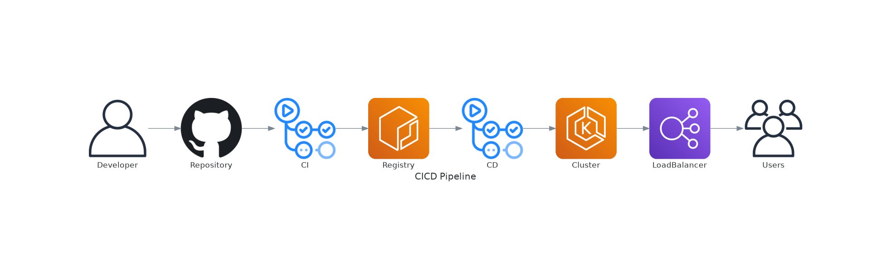
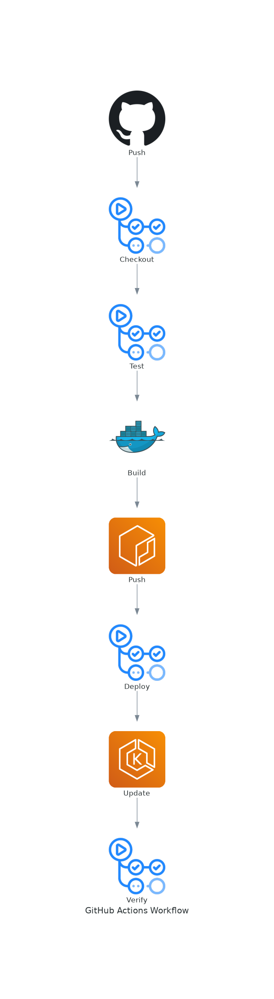

# November Week 4 Day 4 Session 1: CI/CD 기초

<div align="center">

**🔄 지속적 통합** • **🚀 지속적 배포** • **⚡ 자동화**

*소프트웨어 개발 프로세스 자동화의 핵심*

</div>

---

## 🕘 세션 정보
**시간**: 09:00-09:40 (40분)
**목표**: CI/CD 개념과 필요성 완전 이해
**방식**: 이론 강의 + 실제 사례 분석

## 🎯 학습 목표
- CI/CD가 필요한 이유와 해결하는 문제 이해
- CI/CD 파이프라인 구성 요소 파악
- GitHub Actions 개요 및 장점 이해
- 워크플로우 기본 구조 습득

---

## 📖 CI/CD 개요

### 1. 생성 배경 (Why?) - 5분

**문제 상황**:
- **수동 배포의 고통**: 개발자가 직접 서버 접속, 코드 복사, 재시작
  ```
  개발자 → SSH 접속 → git pull → 빌드 → 테스트 → 재시작
  ↓
  실수 발생 (잘못된 브랜치, 빌드 실패, 설정 누락)
  ↓
  장애 발생 → 긴급 롤백 → 야근
  ```

- **느린 피드백**: 코드 변경 후 배포까지 수 시간~수 일 소요
  - 개발자가 다른 작업 중일 때 문제 발견
  - 원인 파악 어려움 (어떤 변경이 문제인지?)

- **환경 불일치**: 개발/스테이징/프로덕션 환경 차이
  - "내 컴퓨터에서는 잘 되는데요?" 문제
  - 환경별 설정 관리 복잡

- **협업 어려움**: 여러 개발자의 코드 통합 시 충돌
  - 통합 지옥 (Integration Hell)
  - 배포 전날 밤샘 작업

**CI/CD 솔루션**:
- **자동화**: 코드 푸시 → 빌드 → 테스트 → 배포 자동 실행
- **빠른 피드백**: 몇 분 내 문제 발견 및 알림
- **일관성**: 모든 환경에서 동일한 프로세스
- **안전성**: 자동 테스트 및 검증

### 2. 핵심 원리 (How?) - 10분

**CI/CD 파이프라인 전체 흐름**:



*그림: 개발자 코드 푸시부터 최종 사용자까지의 완전 자동화 파이프라인*

**단계별 설명**:
1. **Developer**: 코드 작성 및 Git Push
2. **GitHub Repository**: 코드 저장 및 버전 관리
3. **CI Workflow**: 자동 빌드 및 테스트
4. **ECR Registry**: Docker 이미지 저장
5. **CD Workflow**: 자동 배포 트리거
6. **EKS Cluster**: Kubernetes 클러스터 업데이트
7. **Load Balancer**: 트래픽 분산
8. **End Users**: 최종 사용자 접근

**CI (Continuous Integration) - 지속적 통합**:
```
개발자 코드 푸시
    ↓
자동 빌드 (컴파일, 패키징)
    ↓
자동 테스트 (단위, 통합, E2E)
    ↓
코드 품질 검사 (린트, 정적 분석)
    ↓
성공 → 다음 단계
실패 → 개발자 알림
```

**CD (Continuous Deployment) - 지속적 배포**:
```
CI 성공
    ↓
Docker 이미지 빌드
    ↓
이미지 레지스트리 푸시
    ↓
스테이징 환경 배포
    ↓
자동 검증 (Health Check, Smoke Test)
    ↓
프로덕션 배포 (자동 또는 승인 후)
    ↓
모니터링 & 알림
```

**GitHub Actions 워크플로우 실행 흐름**:



*그림: GitHub Actions의 단계별 실행 과정 - Push 이벤트부터 배포 검증까지*

**각 단계 설명**:
1. **Push**: 코드 변경 및 GitHub 푸시
2. **Checkout**: 코드 체크아웃
3. **Test**: 자동 테스트 실행
4. **Build**: Docker 이미지 빌드
5. **Push**: ECR에 이미지 푸시
6. **Deploy**: 배포 워크플로우 트리거
7. **Update**: EKS 클러스터 업데이트
8. **Verify**: 배포 검증 및 Health Check

### 3. 주요 사용 사례 (When?) - 5분

**적합한 경우**:

**1. 마이크로서비스 아키텍처**:
- 여러 서비스의 독립적 배포
- 서비스별 파이프라인 구성
- 빠른 반복 개발

**2. 애자일/스크럼 개발**:
- 스프린트마다 배포
- 빠른 피드백 루프
- 지속적 개선

**3. 클라우드 네이티브 애플리케이션**:
- 컨테이너 기반 배포
- Kubernetes 자동 배포
- 무중단 배포

**실제 사례**:

**Netflix**:
- 하루 수천 번 배포
- Spinnaker (자체 CD 도구)
- Canary 배포로 위험 최소화

**Amazon**:
- 11.6초마다 배포 (2011년 기준)
- 완전 자동화된 파이프라인
- 마이크로서비스 독립 배포

**Spotify**:
- Squad 단위 독립 배포
- Feature Flag로 점진적 출시
- 자동 롤백 시스템

### 4. 비슷한 서비스 비교 (Which?) - 5분

**CI/CD 플랫폼 비교**:

| 기준 | GitHub Actions | Jenkins | GitLab CI | CircleCI |
|------|----------------|---------|-----------|----------|
| **호스팅** | GitHub 통합 | 자체 호스팅 | GitLab 통합 | 클라우드 |
| **설정** | YAML 파일 | UI + 스크립트 | YAML 파일 | YAML 파일 |
| **비용** | 무료 (제한) | 무료 (서버 비용) | 무료 (제한) | 무료 (제한) |
| **러닝 커브** | 낮음 | 높음 | 중간 | 낮음 |
| **확장성** | Marketplace | 플러그인 | 내장 기능 | Orbs |
| **적합한 경우** | GitHub 사용 | 복잡한 요구사항 | GitLab 사용 | 간단한 파이프라인 |

**GitHub Actions 선택 이유**:
- ✅ GitHub와 완벽한 통합
- ✅ 설정 간단 (YAML 파일 하나)
- ✅ Marketplace의 풍부한 Actions
- ✅ 무료 티어 (Public: 무제한, Private: 2000분/월)
- ✅ 별도 서버 관리 불필요

### 5. 장단점 분석 - 3분

**CI/CD 장점**:
- ✅ **빠른 배포**: 코드 푸시 후 몇 분 내 배포
- ✅ **높은 품질**: 자동 테스트로 버그 조기 발견
- ✅ **안정성**: 일관된 배포 프로세스
- ✅ **생산성**: 개발자가 코드 작성에 집중
- ✅ **추적성**: 모든 배포 이력 기록

**CI/CD 단점/제약사항**:
- ⚠️ **초기 설정 비용**: 파이프라인 구축 시간 필요
- ⚠️ **테스트 의존성**: 좋은 테스트 코드 필수
- ⚠️ **복잡성**: 대규모 프로젝트는 파이프라인 복잡
- ⚠️ **비용**: 빌드 시간에 따른 비용 발생 (Private)

**대안**:
- 소규모 프로젝트: 수동 배포도 가능
- 레거시 시스템: 점진적 자동화 도입

### 6. GitHub Actions 구성 요소 - 7분

**워크플로우 파일 구조**:

```yaml
# .github/workflows/ci.yml
name: CI Pipeline                    # 워크플로우 이름

on:                                  # 트리거 이벤트
  push:
    branches: [ main ]
  pull_request:
    branches: [ main ]

jobs:                                # 작업 정의
  build:                             # Job 이름
    runs-on: ubuntu-latest           # 실행 환경
    
    steps:                           # 단계별 작업
      - name: Checkout code          # Step 이름
        uses: actions/checkout@v3    # 재사용 Action
      
      - name: Setup Node.js
        uses: actions/setup-node@v3
        with:
          node-version: '18'
      
      - name: Install dependencies
        run: npm ci                  # 직접 명령 실행
      
      - name: Run tests
        run: npm test
      
      - name: Build
        run: npm run build
```

**핵심 개념**:

**1. Workflow (워크플로우)**:
- 자동화 프로세스 전체 정의
- `.github/workflows/` 디렉토리에 YAML 파일
- 여러 Job으로 구성

**2. Event (이벤트)**:
- 워크플로우를 트리거하는 조건
- `push`, `pull_request`, `schedule`, `workflow_dispatch` 등

**3. Job (작업)**:
- 독립적으로 실행되는 작업 단위
- 병렬 또는 순차 실행 가능
- 각 Job은 별도 Runner에서 실행

**4. Step (단계)**:
- Job 내부의 개별 명령
- Action 사용 또는 직접 명령 실행
- 순차적으로 실행

**5. Runner (실행 환경)**:
- 워크플로우를 실행하는 서버
- GitHub 호스팅 또는 Self-hosted
- Ubuntu, Windows, macOS 지원

**6. Action (액션)**:
- 재사용 가능한 작업 단위
- Marketplace에서 공유
- 직접 작성 가능

### 7. 실습 연계 - 5분

**오늘 구축할 파이프라인**:


**Session 2에서 배울 내용**:
- GitHub Actions 워크플로우 작성
- Docker 이미지 빌드 자동화
- Secrets 관리

**Session 3에서 배울 내용**:
- Kubernetes 배포 자동화
- Helm을 활용한 배포
- 배포 검증 및 롤백

---

## 💭 함께 생각해보기

### 🤝 페어 토론 (5분)

**토론 주제**:
1. **수동 배포 경험**: 수동으로 배포해본 경험이 있나요? 어떤 어려움이 있었나요?
2. **자동화 필요성**: 어떤 작업을 자동화하면 가장 효과적일까요?
3. **실무 적용**: 현재 프로젝트에 CI/CD를 도입한다면 어떤 순서로 진행할까요?

### 🎯 전체 공유 (3분)
- 페어 토론 결과 공유
- CI/CD 도입 시 고려사항
- 다음 세션 연결

### 💡 이해도 체크 질문 (2분)
- ✅ "CI와 CD의 차이를 설명할 수 있나요?"
- ✅ "GitHub Actions의 주요 구성 요소는 무엇인가요?"
- ✅ "왜 CI/CD가 필요한가요?"

---

## 🔑 핵심 키워드

- **CI (Continuous Integration)**: 코드 통합 자동화
- **CD (Continuous Deployment)**: 배포 자동화
- **Pipeline**: 빌드 → 테스트 → 배포 자동화 흐름
- **GitHub Actions**: GitHub 통합 CI/CD 플랫폼
- **Workflow**: 자동화 프로세스 정의
- **Job**: 독립적으로 실행되는 작업 단위
- **Step**: Job 내부의 개별 명령
- **Runner**: 워크플로우 실행 환경
- **Action**: 재사용 가능한 작업 단위

---

## 📝 세션 마무리

### ✅ 오늘 세션 성과
- [ ] CI/CD 필요성 이해
- [ ] GitHub Actions 구조 파악
- [ ] 워크플로우 기본 개념 습득
- [ ] 실습 준비 완료

### 🎯 다음 세션 준비
**Session 2: GitHub Actions**
- 워크플로우 문법 상세
- Docker 이미지 빌드 자동화
- Secrets 관리
- Marketplace Actions 활용

---

<div align="center">

**🔄 자동화의 시작** • **⚡ 빠른 피드백** • **🚀 안전한 배포**

*CI/CD로 개발 생산성을 극대화하세요*

</div>
