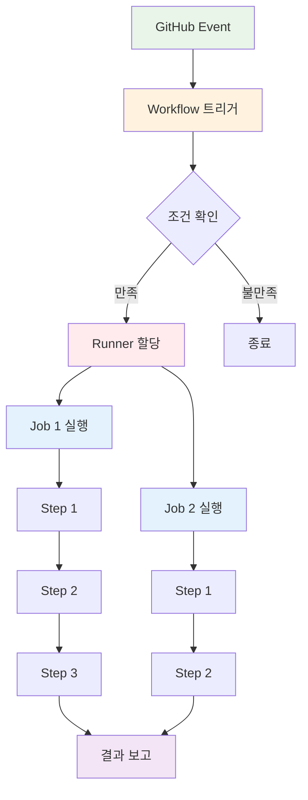

# November Week 4 Day 4 Session 2: GitHub Actions

<div align="center">

**📝 워크플로우 작성** • **🔐 Secrets 관리** • **🔄 재사용 Actions**

*GitHub Actions로 CI 파이프라인 구축하기*

</div>

---

## 🕘 세션 정보
**시간**: 09:40-10:20 (40분)
**목표**: GitHub Actions 워크플로우 작성 능력 습득
**방식**: 이론 강의 + 실제 워크플로우 분석

## 🎯 학습 목표
- GitHub Actions 워크플로우 문법 완전 이해
- Job과 Step 작성 방법 습득
- Secrets 및 환경 변수 관리 방법 파악
- Marketplace Actions 활용 능력 향상

---

## 📖 GitHub Actions 워크플로우

### 1. 생성 배경 (Why?) - 5분

**문제 상황**:
- **복잡한 CI 도구**: Jenkins, Travis CI 등 설정 복잡
- **별도 서버 관리**: CI 서버 유지보수 부담
- **GitHub 통합 부족**: 별도 인증 및 연동 필요
- **비용**: 유료 CI 서비스 비용 부담

**GitHub Actions 솔루션**:
- **간단한 설정**: YAML 파일 하나로 완성
- **서버리스**: GitHub가 Runner 제공
- **완벽한 통합**: GitHub 이벤트 직접 활용
- **무료 티어**: Public 저장소 무제한

### 2. 핵심 원리 (How?) - 10분

**워크플로우 실행 흐름**:



**워크플로우 문법 상세**:

```yaml
# .github/workflows/ci.yml

# 1. 워크플로우 메타데이터
name: CI Pipeline
run-name: ${{ github.actor }} triggered CI

# 2. 트리거 이벤트
on:
  # Push 이벤트
  push:
    branches:
      - main
      - develop
    paths:
      - 'src/**'
      - 'package.json'
    tags:
      - 'v*'
  
  # Pull Request 이벤트
  pull_request:
    branches:
      - main
    types:
      - opened
      - synchronize
  
  # 스케줄 (Cron)
  schedule:
    - cron: '0 0 * * *'  # 매일 자정
  
  # 수동 트리거
  workflow_dispatch:
    inputs:
      environment:
        description: 'Deployment environment'
        required: true
        default: 'staging'

# 3. 환경 변수
env:
  NODE_VERSION: '18'
  DOCKER_REGISTRY: 'ghcr.io'

# 4. Job 정의
jobs:
  # Job 1: 빌드 및 테스트
  build:
    name: Build and Test
    runs-on: ubuntu-latest
    
    # Job 레벨 환경 변수
    env:
      CI: true
    
    # 실행 조건
    if: github.event_name == 'push'
    
    # 타임아웃 (기본: 360분)
    timeout-minutes: 30
    
    # 전략 (매트릭스 빌드)
    strategy:
      matrix:
        node-version: [16, 18, 20]
        os: [ubuntu-latest, windows-latest]
      fail-fast: false
    
    steps:
      # Step 1: 코드 체크아웃
      - name: Checkout code
        uses: actions/checkout@v3
        with:
          fetch-depth: 0
      
      # Step 2: Node.js 설정
      - name: Setup Node.js ${{ matrix.node-version }}
        uses: actions/setup-node@v3
        with:
          node-version: ${{ matrix.node-version }}
          cache: 'npm'
      
      # Step 3: 의존성 설치
      - name: Install dependencies
        run: npm ci
      
      # Step 4: 린트
      - name: Run linter
        run: npm run lint
      
      # Step 5: 테스트
      - name: Run tests
        run: npm test
        env:
          NODE_ENV: test
      
      # Step 6: 빌드
      - name: Build
        run: npm run build
      
      # Step 7: 아티팩트 업로드
      - name: Upload build artifacts
        uses: actions/upload-artifact@v3
        with:
          name: build-${{ matrix.node-version }}
          path: dist/
          retention-days: 7
  
  # Job 2: Docker 이미지 빌드
  docker:
    name: Build Docker Image
    runs-on: ubuntu-latest
    needs: build  # build Job 완료 후 실행
    
    steps:
      - uses: actions/checkout@v3
      
      # 아티팩트 다운로드
      - name: Download build artifacts
        uses: actions/download-artifact@v3
        with:
          name: build-18
          path: dist/
      
      # Docker Buildx 설정
      - name: Set up Docker Buildx
        uses: docker/setup-buildx-action@v2
      
      # Docker Hub 로그인
      - name: Login to Docker Hub
        uses: docker/login-action@v2
        with:
          username: ${{ secrets.DOCKER_USERNAME }}
          password: ${{ secrets.DOCKER_PASSWORD }}
      
      # 이미지 빌드 및 푸시
      - name: Build and push
        uses: docker/build-push-action@v4
        with:
          context: .
          push: true
          tags: |
            myapp:latest
            myapp:${{ github.sha }}
          cache-from: type=gha
          cache-to: type=gha,mode=max
```

**주요 문법 요소**:

**1. 이벤트 트리거**:
```yaml
on:
  push:                    # 코드 푸시
  pull_request:            # PR 생성/업데이트
  schedule:                # 정기 실행
  workflow_dispatch:       # 수동 실행
  workflow_run:            # 다른 워크플로우 완료 후
  release:                 # 릴리스 생성
  issues:                  # 이슈 이벤트
```

**2. Job 의존성**:
```yaml
jobs:
  job1:
    runs-on: ubuntu-latest
    steps: [...]
  
  job2:
    needs: job1           # job1 완료 후 실행
    runs-on: ubuntu-latest
    steps: [...]
  
  job3:
    needs: [job1, job2]   # job1, job2 모두 완료 후
    runs-on: ubuntu-latest
    steps: [...]
```

**3. 조건부 실행**:
```yaml
steps:
  - name: Deploy to production
    if: github.ref == 'refs/heads/main'
    run: ./deploy.sh
  
  - name: Deploy to staging
    if: github.ref == 'refs/heads/develop'
    run: ./deploy-staging.sh
```

### 3. Secrets 관리 - 10분

**Secrets 설정 방법**:

**1. Repository Secrets**:
```
GitHub Repository → Settings → Secrets and variables → Actions
→ New repository secret

예시:
- AWS_ACCESS_KEY_ID
- AWS_SECRET_ACCESS_KEY
- DOCKER_PASSWORD
- KUBE_CONFIG
```

**2. 워크플로우에서 사용**:
```yaml
steps:
  - name: Configure AWS credentials
    uses: aws-actions/configure-aws-credentials@v2
    with:
      aws-access-key-id: ${{ secrets.AWS_ACCESS_KEY_ID }}
      aws-secret-access-key: ${{ secrets.AWS_SECRET_ACCESS_KEY }}
      aws-region: ap-northeast-2
  
  - name: Login to Docker Hub
    run: |
      echo ${{ secrets.DOCKER_PASSWORD }} | docker login -u ${{ secrets.DOCKER_USERNAME }} --password-stdin
```

**3. Environment Secrets**:
```yaml
jobs:
  deploy:
    runs-on: ubuntu-latest
    environment: production  # production 환경 Secrets 사용
    steps:
      - name: Deploy
        run: ./deploy.sh
        env:
          API_KEY: ${{ secrets.PROD_API_KEY }}
```

**보안 베스트 프랙티스**:
- ✅ Secrets는 절대 로그에 출력되지 않음 (자동 마스킹)
- ✅ Pull Request에서는 Secrets 접근 제한
- ✅ 환경별 Secrets 분리 (dev, staging, prod)
- ✅ 최소 권한 원칙 (필요한 권한만 부여)

### 4. Marketplace Actions 활용 - 10분

**인기 Actions**:

**1. 코드 체크아웃**:
```yaml
- uses: actions/checkout@v3
  with:
    fetch-depth: 0        # 전체 히스토리
    submodules: true      # 서브모듈 포함
```

**2. 언어/런타임 설정**:
```yaml
# Node.js
- uses: actions/setup-node@v3
  with:
    node-version: '18'
    cache: 'npm'

# Python
- uses: actions/setup-python@v4
  with:
    python-version: '3.11'
    cache: 'pip'

# Java
- uses: actions/setup-java@v3
  with:
    distribution: 'temurin'
    java-version: '17'
```

**3. Docker 관련**:
```yaml
# Docker Buildx
- uses: docker/setup-buildx-action@v2

# Docker 로그인
- uses: docker/login-action@v2
  with:
    registry: ghcr.io
    username: ${{ github.actor }}
    password: ${{ secrets.GITHUB_TOKEN }}

# 이미지 빌드 및 푸시
- uses: docker/build-push-action@v4
  with:
    context: .
    push: true
    tags: myapp:latest
```

**4. AWS 관련**:
```yaml
# AWS 자격 증명 설정
- uses: aws-actions/configure-aws-credentials@v2
  with:
    aws-access-key-id: ${{ secrets.AWS_ACCESS_KEY_ID }}
    aws-secret-access-key: ${{ secrets.AWS_SECRET_ACCESS_KEY }}
    aws-region: ap-northeast-2

# ECR 로그인
- uses: aws-actions/amazon-ecr-login@v1
```

**5. 아티팩트 관리**:
```yaml
# 업로드
- uses: actions/upload-artifact@v3
  with:
    name: my-artifact
    path: dist/

# 다운로드
- uses: actions/download-artifact@v3
  with:
    name: my-artifact
    path: dist/
```

**6. 캐싱**:
```yaml
- uses: actions/cache@v3
  with:
    path: ~/.npm
    key: ${{ runner.os }}-node-${{ hashFiles('**/package-lock.json') }}
    restore-keys: |
      ${{ runner.os }}-node-
```

### 5. 실습 예제 - 5분

**완전한 CI 워크플로우**:

```yaml
name: Complete CI Pipeline

on:
  push:
    branches: [ main, develop ]
  pull_request:
    branches: [ main ]

env:
  NODE_VERSION: '18'
  REGISTRY: ghcr.io
  IMAGE_NAME: ${{ github.repository }}

jobs:
  # 1. 코드 품질 검사
  lint:
    runs-on: ubuntu-latest
    steps:
      - uses: actions/checkout@v3
      - uses: actions/setup-node@v3
        with:
          node-version: ${{ env.NODE_VERSION }}
          cache: 'npm'
      - run: npm ci
      - run: npm run lint
  
  # 2. 테스트
  test:
    runs-on: ubuntu-latest
    needs: lint
    steps:
      - uses: actions/checkout@v3
      - uses: actions/setup-node@v3
        with:
          node-version: ${{ env.NODE_VERSION }}
          cache: 'npm'
      - run: npm ci
      - run: npm test
      - name: Upload coverage
        uses: codecov/codecov-action@v3
  
  # 3. 빌드
  build:
    runs-on: ubuntu-latest
    needs: test
    steps:
      - uses: actions/checkout@v3
      - uses: actions/setup-node@v3
        with:
          node-version: ${{ env.NODE_VERSION }}
          cache: 'npm'
      - run: npm ci
      - run: npm run build
      - uses: actions/upload-artifact@v3
        with:
          name: build
          path: dist/
  
  # 4. Docker 이미지
  docker:
    runs-on: ubuntu-latest
    needs: build
    if: github.event_name == 'push'
    steps:
      - uses: actions/checkout@v3
      - uses: actions/download-artifact@v3
        with:
          name: build
          path: dist/
      
      - uses: docker/setup-buildx-action@v2
      - uses: docker/login-action@v2
        with:
          registry: ${{ env.REGISTRY }}
          username: ${{ github.actor }}
          password: ${{ secrets.GITHUB_TOKEN }}
      
      - uses: docker/build-push-action@v4
        with:
          context: .
          push: true
          tags: |
            ${{ env.REGISTRY }}/${{ env.IMAGE_NAME }}:latest
            ${{ env.REGISTRY }}/${{ env.IMAGE_NAME }}:${{ github.sha }}
```

---

## 💭 함께 생각해보기

### 🤝 페어 토론 (3분)
1. **워크플로우 설계**: 어떤 순서로 Job을 구성하는 것이 효율적일까요?
2. **Secrets 관리**: 민감한 정보를 안전하게 관리하는 방법은?
3. **캐싱 전략**: 어떤 데이터를 캐싱하면 빌드 시간을 줄일 수 있을까요?

### 🎯 전체 공유 (2분)
- 효율적인 워크플로우 구조
- 보안 베스트 프랙티스

---

## 🔑 핵심 키워드

- **Workflow**: 자동화 프로세스 정의 (YAML)
- **Job**: 독립적 작업 단위
- **Step**: Job 내부 개별 명령
- **Runner**: 실행 환경 (ubuntu-latest, windows-latest)
- **Action**: 재사용 가능한 작업 (Marketplace)
- **Secrets**: 민감 정보 안전 저장
- **Artifact**: Job 간 파일 공유
- **Cache**: 빌드 속도 향상

---

## 📝 세션 마무리

### ✅ 오늘 세션 성과
- [ ] 워크플로우 문법 이해
- [ ] Secrets 관리 방법 습득
- [ ] Marketplace Actions 활용
- [ ] 실전 예제 분석

### 🎯 다음 세션 준비
**Session 3: 자동 배포 파이프라인**
- Docker 이미지 빌드 자동화
- ECR 푸시 및 태깅
- Kubernetes 자동 배포
- 배포 검증

---

<div align="center">

**📝 간단한 설정** • **🔐 안전한 관리** • **🔄 강력한 재사용**

*GitHub Actions로 효율적인 CI 파이프라인을 구축하세요*

</div>
