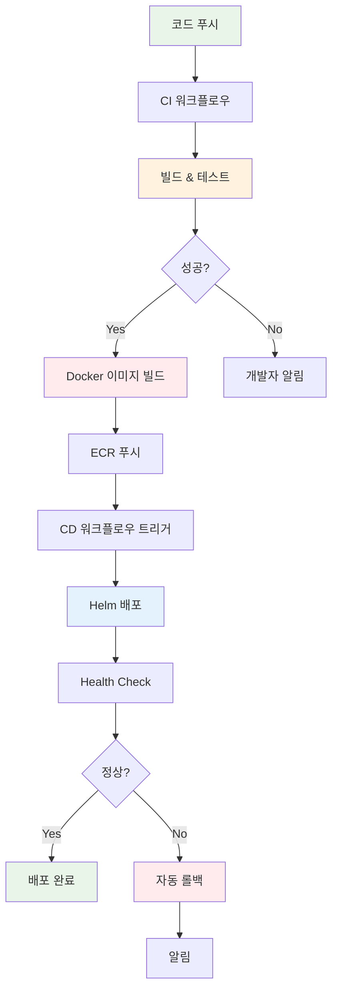

# November Week 4 Day 4 Session 3: 자동 배포 파이프라인

<div align="center">

**🐳 Docker 자동화** • **📦 ECR 푸시** • **🚀 Kubernetes 배포**

*완전 자동화된 CD 파이프라인 구축*

</div>

---

## 🕘 세션 정보
**시간**: 10:20-11:00 (40분)
**목표**: 자동 배포 파이프라인 구축 능력 습득
**방식**: 이론 강의 + 실제 파이프라인 분석

## 🎯 학습 목표
- Docker 이미지 빌드 자동화 방법 이해
- ECR 푸시 및 이미지 태깅 전략 습득
- Helm을 활용한 Kubernetes 자동 배포 구현
- 배포 검증 및 롤백 전략 파악

---

## 📖 자동 배포 파이프라인

### 1. 생성 배경 (Why?) - 5분

**문제 상황**:
- **수동 Docker 빌드**: 개발자가 직접 이미지 빌드 및 푸시
  ```bash
  docker build -t myapp:v1.0.0 .
  docker tag myapp:v1.0.0 123456.dkr.ecr.ap-northeast-2.amazonaws.com/myapp:v1.0.0
  docker push 123456.dkr.ecr.ap-northeast-2.amazonaws.com/myapp:v1.0.0
  ```
  - 실수 가능성 (잘못된 태그, 이미지 누락)
  - 시간 소요 (빌드 + 푸시 대기)

- **수동 Kubernetes 배포**: kubectl 또는 Helm 명령 직접 실행
  ```bash
  helm upgrade myapp ./chart \
    --set image.tag=v1.0.0 \
    --namespace production
  ```
  - 환경별 설정 관리 복잡
  - 배포 이력 추적 어려움

- **일관성 부족**: 개발자마다 다른 배포 방식
- **롤백 어려움**: 문제 발생 시 빠른 복구 어려움

**자동 배포 솔루션**:
- **자동 빌드**: 코드 푸시 시 자동으로 이미지 빌드
- **자동 푸시**: ECR에 자동 푸시 및 태깅
- **자동 배포**: Kubernetes에 자동 배포
- **자동 검증**: Health Check 및 Smoke Test

### 2. 핵심 원리 (How?) - 10분

**전체 CD 파이프라인 흐름**:



**Docker 이미지 빌드 워크플로우**:

```yaml
# .github/workflows/build.yml
name: Build and Push Docker Image

on:
  push:
    branches: [ main ]
    paths:
      - 'src/**'
      - 'Dockerfile'
      - 'package.json'

env:
  AWS_REGION: ap-northeast-2
  ECR_REPOSITORY: myapp

jobs:
  build:
    runs-on: ubuntu-latest
    
    steps:
      # 1. 코드 체크아웃
      - name: Checkout code
        uses: actions/checkout@v3
      
      # 2. AWS 자격 증명 설정
      - name: Configure AWS credentials
        uses: aws-actions/configure-aws-credentials@v2
        with:
          aws-access-key-id: ${{ secrets.AWS_ACCESS_KEY_ID }}
          aws-secret-access-key: ${{ secrets.AWS_SECRET_ACCESS_KEY }}
          aws-region: ${{ env.AWS_REGION }}
      
      # 3. ECR 로그인
      - name: Login to Amazon ECR
        id: login-ecr
        uses: aws-actions/amazon-ecr-login@v1
      
      # 4. Docker 메타데이터 추출
      - name: Extract metadata
        id: meta
        uses: docker/metadata-action@v4
        with:
          images: ${{ steps.login-ecr.outputs.registry }}/${{ env.ECR_REPOSITORY }}
          tags: |
            type=ref,event=branch
            type=sha,prefix={{branch}}-
            type=semver,pattern={{version}}
      
      # 5. Docker Buildx 설정
      - name: Set up Docker Buildx
        uses: docker/setup-buildx-action@v2
      
      # 6. 이미지 빌드 및 푸시
      - name: Build and push Docker image
        uses: docker/build-push-action@v4
        with:
          context: .
          push: true
          tags: ${{ steps.meta.outputs.tags }}
          labels: ${{ steps.meta.outputs.labels }}
          cache-from: type=gha
          cache-to: type=gha,mode=max
      
      # 7. 이미지 정보 출력
      - name: Image digest
        run: echo ${{ steps.meta.outputs.tags }}
```

**이미지 태깅 전략**:

```yaml
# 1. Git SHA 기반 (추천)
tags: |
  ${{ env.ECR_REGISTRY }}/${{ env.ECR_REPOSITORY }}:${{ github.sha }}
  ${{ env.ECR_REGISTRY }}/${{ env.ECR_REPOSITORY }}:latest

# 2. 브랜치 기반
tags: |
  ${{ env.ECR_REGISTRY }}/${{ env.ECR_REPOSITORY }}:main-${{ github.sha }}
  ${{ env.ECR_REGISTRY }}/${{ env.ECR_REPOSITORY }}:main-latest

# 3. 시맨틱 버전
tags: |
  ${{ env.ECR_REGISTRY }}/${{ env.ECR_REPOSITORY }}:v1.2.3
  ${{ env.ECR_REGISTRY }}/${{ env.ECR_REPOSITORY }}:v1.2
  ${{ env.ECR_REGISTRY }}/${{ env.ECR_REPOSITORY }}:v1
  ${{ env.ECR_REGISTRY }}/${{ env.ECR_REPOSITORY }}:latest
```

**Kubernetes 배포 워크플로우**:

```yaml
# .github/workflows/deploy.yml
name: Deploy to Kubernetes

on:
  workflow_run:
    workflows: ["Build and Push Docker Image"]
    types: [completed]
    branches: [main]

env:
  AWS_REGION: ap-northeast-2
  CLUSTER_NAME: my-eks-cluster
  NAMESPACE: production

jobs:
  deploy:
    runs-on: ubuntu-latest
    if: ${{ github.event.workflow_run.conclusion == 'success' }}
    
    steps:
      # 1. 코드 체크아웃
      - name: Checkout code
        uses: actions/checkout@v3
      
      # 2. AWS 자격 증명 설정
      - name: Configure AWS credentials
        uses: aws-actions/configure-aws-credentials@v2
        with:
          aws-access-key-id: ${{ secrets.AWS_ACCESS_KEY_ID }}
          aws-secret-access-key: ${{ secrets.AWS_SECRET_ACCESS_KEY }}
          aws-region: ${{ env.AWS_REGION }}
      
      # 3. kubectl 설정
      - name: Update kubeconfig
        run: |
          aws eks update-kubeconfig \
            --region ${{ env.AWS_REGION }} \
            --name ${{ env.CLUSTER_NAME }}
      
      # 4. Helm 설치
      - name: Install Helm
        uses: azure/setup-helm@v3
        with:
          version: '3.12.0'
      
      # 5. ECR 로그인 (이미지 정보 확인용)
      - name: Login to Amazon ECR
        id: login-ecr
        uses: aws-actions/amazon-ecr-login@v1
      
      # 6. Helm 배포
      - name: Deploy with Helm
        run: |
          helm upgrade --install myapp ./helm/myapp \
            --namespace ${{ env.NAMESPACE }} \
            --create-namespace \
            --set image.repository=${{ steps.login-ecr.outputs.registry }}/myapp \
            --set image.tag=${{ github.sha }} \
            --wait \
            --timeout 5m
      
      # 7. 배포 검증
      - name: Verify deployment
        run: |
          kubectl rollout status deployment/myapp -n ${{ env.NAMESPACE }}
          kubectl get pods -n ${{ env.NAMESPACE }}
      
      # 8. Health Check
      - name: Health check
        run: |
          kubectl wait --for=condition=ready pod \
            -l app=myapp \
            -n ${{ env.NAMESPACE }} \
            --timeout=300s
      
      # 9. Smoke Test
      - name: Smoke test
        run: |
          SERVICE_IP=$(kubectl get svc myapp -n ${{ env.NAMESPACE }} -o jsonpath='{.status.loadBalancer.ingress[0].hostname}')
          curl -f http://$SERVICE_IP/health || exit 1
```

### 3. 배포 전략 - 10분

**1. Rolling Update (기본)**:
```yaml
# Deployment에서 자동 지원
spec:
  replicas: 3
  strategy:
    type: RollingUpdate
    rollingUpdate:
      maxSurge: 1        # 최대 1개 추가 Pod
      maxUnavailable: 0  # 항상 3개 유지
```

**2. Blue-Green 배포**:
```yaml
# 워크플로우에서 구현
- name: Blue-Green Deploy
  run: |
    # Green 환경 배포
    helm upgrade myapp-green ./helm/myapp \
      --set image.tag=${{ github.sha }} \
      --namespace production-green
    
    # 검증
    ./scripts/verify-green.sh
    
    # 트래픽 전환
    kubectl patch service myapp \
      -n production \
      -p '{"spec":{"selector":{"version":"green"}}}'
    
    # Blue 환경 정리
    helm uninstall myapp-blue -n production-blue
```

**3. Canary 배포**:
```yaml
# Helm values로 구현
- name: Canary Deploy
  run: |
    # Canary 10% 배포
    helm upgrade myapp-canary ./helm/myapp \
      --set image.tag=${{ github.sha }} \
      --set replicaCount=1 \
      --set canary.enabled=true \
      --set canary.weight=10
    
    # 모니터링 (5분)
    sleep 300
    
    # 메트릭 확인
    if ./scripts/check-metrics.sh; then
      # 100% 배포
      helm upgrade myapp ./helm/myapp \
        --set image.tag=${{ github.sha }}
    else
      # 롤백
      helm rollback myapp
    fi
```

### 4. 롤백 전략 - 10분

**자동 롤백 구현**:

```yaml
# .github/workflows/deploy.yml
jobs:
  deploy:
    steps:
      # ... 배포 단계 ...
      
      # Health Check 실패 시 롤백
      - name: Health check with rollback
        id: health-check
        run: |
          if ! ./scripts/health-check.sh; then
            echo "Health check failed, rolling back..."
            helm rollback myapp -n production
            exit 1
          fi
      
      # Slack 알림
      - name: Notify on failure
        if: failure()
        uses: slackapi/slack-github-action@v1
        with:
          payload: |
            {
              "text": "Deployment failed and rolled back",
              "blocks": [
                {
                  "type": "section",
                  "text": {
                    "type": "mrkdwn",
                    "text": "*Deployment Failed*\nCommit: ${{ github.sha }}\nAuthor: ${{ github.actor }}"
                  }
                }
              ]
            }
        env:
          SLACK_WEBHOOK_URL: ${{ secrets.SLACK_WEBHOOK }}
```

**수동 롤백 워크플로우**:

```yaml
# .github/workflows/rollback.yml
name: Manual Rollback

on:
  workflow_dispatch:
    inputs:
      revision:
        description: 'Helm revision to rollback to'
        required: true
        type: number

jobs:
  rollback:
    runs-on: ubuntu-latest
    steps:
      - name: Configure kubectl
        run: |
          aws eks update-kubeconfig \
            --region ap-northeast-2 \
            --name my-eks-cluster
      
      - name: Rollback
        run: |
          helm rollback myapp ${{ inputs.revision }} \
            -n production \
            --wait
      
      - name: Verify
        run: |
          kubectl rollout status deployment/myapp -n production
```

### 5. 모니터링 및 알림 - 5분

**배포 상태 모니터링**:

```yaml
- name: Monitor deployment
  run: |
    # Deployment 상태
    kubectl get deployment myapp -n production -o json | \
      jq '.status'
    
    # Pod 상태
    kubectl get pods -n production -l app=myapp
    
    # 이벤트 확인
    kubectl get events -n production \
      --field-selector involvedObject.name=myapp
```

**알림 통합**:

```yaml
# Slack 알림
- name: Notify Slack
  uses: slackapi/slack-github-action@v1
  with:
    payload: |
      {
        "text": "Deployment successful",
        "blocks": [
          {
            "type": "section",
            "text": {
              "type": "mrkdwn",
              "text": "*Deployment Successful* :rocket:\nImage: myapp:${{ github.sha }}\nEnvironment: production"
            }
          }
        ]
      }
  env:
    SLACK_WEBHOOK_URL: ${{ secrets.SLACK_WEBHOOK }}

# Email 알림
- name: Send email
  uses: dawidd6/action-send-mail@v3
  with:
    server_address: smtp.gmail.com
    server_port: 465
    username: ${{ secrets.EMAIL_USERNAME }}
    password: ${{ secrets.EMAIL_PASSWORD }}
    subject: Deployment to production
    body: |
      Deployment completed successfully
      Commit: ${{ github.sha }}
      Author: ${{ github.actor }}
    to: team@example.com
```

---

## 💭 함께 생각해보기

### 🤝 페어 토론 (3분)
1. **배포 전략**: Rolling Update vs Blue-Green vs Canary, 어떤 상황에 적합할까요?
2. **롤백 시나리오**: 어떤 경우에 자동 롤백이 필요할까요?
3. **모니터링**: 배포 후 어떤 메트릭을 확인해야 할까요?

### 🎯 전체 공유 (2분)
- 안전한 배포 전략
- 효과적인 모니터링 방법

---

## 🔑 핵심 키워드

- **CD (Continuous Deployment)**: 배포 자동화
- **Docker Build**: 이미지 빌드 자동화
- **ECR**: AWS 컨테이너 레지스트리
- **Image Tagging**: 버전 관리 전략
- **Helm Upgrade**: 자동 배포
- **Rolling Update**: 무중단 배포
- **Blue-Green**: 환경 전환 배포
- **Canary**: 점진적 배포
- **Rollback**: 이전 버전 복구
- **Health Check**: 배포 검증

---

## 📝 세션 마무리

### ✅ 오늘 세션 성과
- [ ] Docker 빌드 자동화 이해
- [ ] ECR 푸시 및 태깅 전략 습득
- [ ] Kubernetes 자동 배포 구현
- [ ] 롤백 전략 파악

### 🎯 강사 Demo 준비
**Demo: 완전 자동화 CI/CD 파이프라인**
- GitHub Repository 준비
- Docker 이미지 빌드 파이프라인
- Kubernetes 배포 파이프라인
- 전체 파이프라인 테스트

---

<div align="center">

**🐳 자동 빌드** • **📦 자동 푸시** • **🚀 자동 배포**

*완전 자동화로 안전하고 빠른 배포를 실현하세요*

</div>
