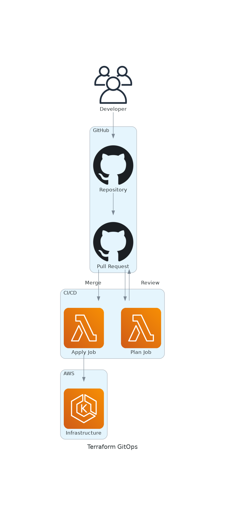
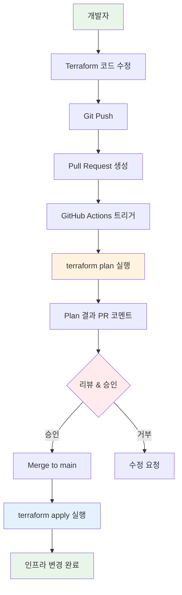

# November Week 4 Day 4 Session 4: Terraform GitOps

<div align="center">

**🏗️ Infrastructure as Code** • **🔄 GitOps** • **🤖 자동화**

*Terraform으로 인프라도 GitOps로 관리하기*

</div>

---

## 🕘 세션 정보
**시간**: 11:00-11:40 (40분)
**목표**: Terraform GitOps 개념과 구현 방법 이해
**방식**: 이론 강의 + 실제 워크플로우 분석

## 🎯 학습 목표
- Terraform GitOps의 필요성과 장점 이해
- Terraform Cloud/Atlantis 비교
- GitHub Actions + Terraform 통합 방법 습득
- 인프라 변경 관리 및 승인 프로세스 파악

---

## 📖 Terraform GitOps 개요

### 1. 생성 배경 (Why?) - 5분

**문제 상황**:
- **수동 Terraform 실행**: 개발자가 로컬에서 직접 실행
  ```bash
  terraform plan
  terraform apply
  ```
  - 누가, 언제, 무엇을 변경했는지 추적 어려움
  - 로컬 환경 차이로 인한 문제
  - State 파일 충돌 위험

- **승인 프로세스 부재**: 인프라 변경에 대한 리뷰 없음
  - 실수로 프로덕션 리소스 삭제
  - 비용 폭탄 (대용량 인스턴스 생성)
  - 보안 취약점 (잘못된 Security Group)

- **일관성 부족**: 환경마다 다른 방식으로 관리
  - Dev는 수동, Prod는 자동?
  - 누구는 Terraform, 누구는 Console?

**Terraform GitOps 솔루션**:
- **Git 기반 관리**: 모든 인프라 변경을 Git으로 추적
- **자동 Plan**: PR 생성 시 자동으로 terraform plan 실행
- **리뷰 프로세스**: 인프라 변경도 코드 리뷰처럼
- **자동 Apply**: 승인 후 자동으로 terraform apply

### 2. 핵심 원리 (How?) - 10분

**Terraform GitOps 워크플로우**:



*그림: Terraform GitOps 전체 워크플로우 - PR 기반 인프라 변경 관리*



**GitHub Actions + Terraform 통합**:

```yaml
# .github/workflows/terraform.yml
name: Terraform GitOps

on:
  pull_request:
    paths:
      - 'terraform/**'
  push:
    branches:
      - main
    paths:
      - 'terraform/**'

env:
  TF_VERSION: 1.6.0
  AWS_REGION: ap-northeast-2

jobs:
  terraform-plan:
    name: Terraform Plan
    runs-on: ubuntu-latest
    if: github.event_name == 'pull_request'
    
    steps:
      # 1. 코드 체크아웃
      - name: Checkout
        uses: actions/checkout@v3
      
      # 2. Terraform 설치
      - name: Setup Terraform
        uses: hashicorp/setup-terraform@v2
        with:
          terraform_version: ${{ env.TF_VERSION }}
      
      # 3. AWS 자격 증명
      - name: Configure AWS credentials
        uses: aws-actions/configure-aws-credentials@v2
        with:
          aws-access-key-id: ${{ secrets.AWS_ACCESS_KEY_ID }}
          aws-secret-access-key: ${{ secrets.AWS_SECRET_ACCESS_KEY }}
          aws-region: ${{ env.AWS_REGION }}
      
      # 4. Terraform Init
      - name: Terraform Init
        working-directory: ./terraform
        run: terraform init
      
      # 5. Terraform Format Check
      - name: Terraform Format
        working-directory: ./terraform
        run: terraform fmt -check
        continue-on-error: true
      
      # 6. Terraform Validate
      - name: Terraform Validate
        working-directory: ./terraform
        run: terraform validate
      
      # 7. Terraform Plan
      - name: Terraform Plan
        id: plan
        working-directory: ./terraform
        run: |
          terraform plan -no-color -out=tfplan
          terraform show -no-color tfplan > plan.txt
      
      # 8. Plan 결과를 PR에 코멘트
      - name: Comment Plan
        uses: actions/github-script@v6
        with:
          github-token: ${{ secrets.GITHUB_TOKEN }}
          script: |
            const fs = require('fs');
            const plan = fs.readFileSync('./terraform/plan.txt', 'utf8');
            const output = `#### Terraform Plan 📝
            
            <details><summary>Show Plan</summary>
            
            \`\`\`terraform
            ${plan}
            \`\`\`
            
            </details>
            
            *Pushed by: @${{ github.actor }}, Action: \`${{ github.event_name }}\`*`;
            
            github.rest.issues.createComment({
              issue_number: context.issue.number,
              owner: context.repo.owner,
              repo: context.repo.repo,
              body: output
            });
  
  terraform-apply:
    name: Terraform Apply
    runs-on: ubuntu-latest
    if: github.ref == 'refs/heads/main' && github.event_name == 'push'
    
    steps:
      # 1-4: Plan과 동일
      - name: Checkout
        uses: actions/checkout@v3
      
      - name: Setup Terraform
        uses: hashicorp/setup-terraform@v2
        with:
          terraform_version: ${{ env.TF_VERSION }}
      
      - name: Configure AWS credentials
        uses: aws-actions/configure-aws-credentials@v2
        with:
          aws-access-key-id: ${{ secrets.AWS_ACCESS_KEY_ID }}
          aws-secret-access-key: ${{ secrets.AWS_SECRET_ACCESS_KEY }}
          aws-region: ${{ env.AWS_REGION }}
      
      - name: Terraform Init
        working-directory: ./terraform
        run: terraform init
      
      # 5. Terraform Apply
      - name: Terraform Apply
        working-directory: ./terraform
        run: terraform apply -auto-approve
      
      # 6. Slack 알림
      - name: Notify Slack
        if: always()
        uses: slackapi/slack-github-action@v1
        with:
          payload: |
            {
              "text": "Terraform Apply ${{ job.status }}",
              "blocks": [
                {
                  "type": "section",
                  "text": {
                    "type": "mrkdwn",
                    "text": "*Terraform Apply ${{ job.status }}*\nCommit: ${{ github.sha }}\nAuthor: ${{ github.actor }}"
                  }
                }
              ]
            }
        env:
          SLACK_WEBHOOK_URL: ${{ secrets.SLACK_WEBHOOK }}
```

### 3. Terraform Cloud vs Atlantis vs GitHub Actions - 10분

**비교표**:

| 항목 | Terraform Cloud | Atlantis | GitHub Actions |
|------|-----------------|----------|----------------|
| **호스팅** | SaaS (HashiCorp) | Self-hosted | GitHub 통합 |
| **비용** | 무료 (5명) / 유료 | 무료 (오픈소스) | 무료 (2000분/월) |
| **설정 복잡도** | 낮음 | 중간 | 낮음 |
| **State 관리** | 자동 | 수동 설정 | 수동 설정 |
| **PR 통합** | 자동 | 자동 | 수동 구현 |
| **승인 프로세스** | 내장 | 내장 | 수동 구현 |
| **커스터마이징** | 제한적 | 높음 | 매우 높음 |
| **학습 곡선** | 낮음 | 중간 | 낮음 |

**Terraform Cloud 예시**:

```hcl
# terraform/main.tf
terraform {
  cloud {
    organization = "my-org"
    
    workspaces {
      name = "production"
    }
  }
  
  required_providers {
    aws = {
      source  = "hashicorp/aws"
      version = "~> 5.0"
    }
  }
}

# VCS 연동 설정 (UI에서)
# 1. GitHub 연결
# 2. Repository 선택
# 3. Working Directory: terraform/
# 4. Auto Apply: false (수동 승인)
```

**Atlantis 예시**:

```yaml
# atlantis.yaml
version: 3
projects:
  - name: production
    dir: terraform/production
    workspace: default
    terraform_version: v1.6.0
    autoplan:
      when_modified: ["*.tf", "*.tfvars"]
      enabled: true
    apply_requirements: ["approved", "mergeable"]
    workflow: default

workflows:
  default:
    plan:
      steps:
        - init
        - plan
    apply:
      steps:
        - apply
```

### 4. 실무 베스트 프랙티스 - 10분

**1. State 파일 관리**:

```hcl
# backend.tf
terraform {
  backend "s3" {
    bucket         = "my-terraform-state"
    key            = "production/terraform.tfstate"
    region         = "ap-northeast-2"
    encrypt        = true
    dynamodb_table = "terraform-lock"
  }
}
```

**2. 환경별 분리**:

```
terraform/
├── modules/           # 재사용 가능한 모듈
│   ├── vpc/
│   ├── eks/
│   └── rds/
├── environments/      # 환경별 설정
│   ├── dev/
│   │   ├── main.tf
│   │   └── terraform.tfvars
│   ├── staging/
│   │   ├── main.tf
│   │   └── terraform.tfvars
│   └── production/
│       ├── main.tf
│       └── terraform.tfvars
└── .github/
    └── workflows/
        ├── terraform-dev.yml
        ├── terraform-staging.yml
        └── terraform-prod.yml
```

**3. 승인 프로세스**:

```yaml
# .github/workflows/terraform-prod.yml
jobs:
  terraform-apply:
    environment:
      name: production
      url: https://console.aws.amazon.com
    # GitHub Environment Protection Rules:
    # - Required reviewers: 2명
    # - Wait timer: 5분
    # - Deployment branches: main only
```

**4. 비용 추정**:

```yaml
# Infracost 통합
- name: Run Infracost
  uses: infracost/actions/setup@v2
  with:
    api-key: ${{ secrets.INFRACOST_API_KEY }}

- name: Generate cost estimate
  run: |
    infracost breakdown --path=./terraform \
      --format=json \
      --out-file=/tmp/infracost.json

- name: Post cost comment
  run: |
    infracost comment github --path=/tmp/infracost.json \
      --repo=$GITHUB_REPOSITORY \
      --pull-request=${{ github.event.pull_request.number }}
```

### 5. 보안 및 컴플라이언스 - 5분

**1. Terraform 코드 스캔**:

```yaml
# tfsec 통합
- name: Run tfsec
  uses: aquasecurity/tfsec-action@v1.0.0
  with:
    working_directory: ./terraform
    soft_fail: false

# Checkov 통합
- name: Run Checkov
  uses: bridgecrewio/checkov-action@master
  with:
    directory: ./terraform
    framework: terraform
```

**2. Secrets 관리**:

```hcl
# AWS Secrets Manager 사용
data "aws_secretsmanager_secret_version" "db_password" {
  secret_id = "production/db/password"
}

resource "aws_db_instance" "main" {
  password = data.aws_secretsmanager_secret_version.db_password.secret_string
  # ...
}
```

**3. Drift Detection**:

```yaml
# 정기적으로 실제 인프라와 Terraform 상태 비교
name: Drift Detection

on:
  schedule:
    - cron: '0 9 * * *'  # 매일 오전 9시

jobs:
  detect-drift:
    runs-on: ubuntu-latest
    steps:
      - name: Terraform Plan
        run: terraform plan -detailed-exitcode
        # Exit code 2 = drift detected
      
      - name: Notify if drift
        if: failure()
        # Slack 알림
```

---

## 💭 함께 생각해보기

### 🤝 페어 토론 (3분)
1. **GitOps 도입**: Terraform도 GitOps로 관리해야 할까요?
2. **도구 선택**: Terraform Cloud vs Atlantis vs GitHub Actions, 어떤 것이 적합할까요?
3. **승인 프로세스**: 인프라 변경에 몇 명의 승인이 필요할까요?

### 🎯 전체 공유 (2분)
- 안전한 인프라 변경 관리
- 효과적인 리뷰 프로세스

---

## 🔑 핵심 키워드

- **Terraform GitOps**: 인프라를 Git으로 관리
- **terraform plan**: 변경 사항 미리 확인
- **terraform apply**: 실제 인프라 변경
- **State 관리**: S3 + DynamoDB Lock
- **PR 기반 워크플로우**: 리뷰 후 적용
- **Terraform Cloud**: HashiCorp SaaS
- **Atlantis**: 오픈소스 Terraform GitOps
- **Drift Detection**: 실제 vs 코드 차이 감지
- **Cost Estimation**: 비용 미리 계산
- **Security Scanning**: 보안 취약점 검사

---

## 📝 세션 마무리

### ✅ 오늘 세션 성과
- [ ] Terraform GitOps 필요성 이해
- [ ] GitHub Actions 통합 방법 습득
- [ ] 도구 비교 및 선택 기준 파악
- [ ] 실무 베스트 프랙티스 학습

### 🎯 다음 단계
**Demo: 완전 자동화 CI/CD + Terraform GitOps**
- Kubernetes 배포 자동화
- Terraform 인프라 자동화
- 전체 파이프라인 통합

---

<div align="center">

**🏗️ Infrastructure as Code** • **🔄 GitOps** • **🤖 완전 자동화**

*인프라도 코드처럼 리뷰하고 배포하세요*

</div>
