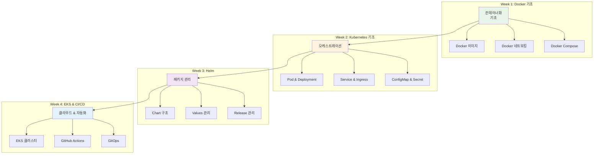
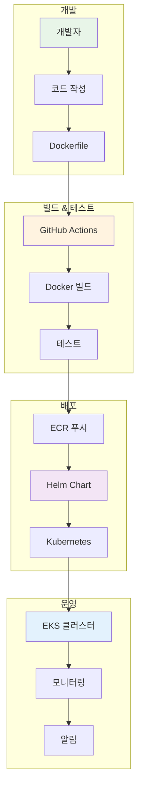

# November Week 4 Day 5 Session 1: November 전체 복습

<div align="center">

**📚 4주 총정리** • **🔗 개념 연결** • **🎯 핵심 정리**

*November 학습 내용 종합 복습 및 통합*

</div>

---

## 🕘 세션 정보
**시간**: 09:00-09:40 (40분)
**목표**: November 4주 학습 내용 통합 정리
**방식**: 복습 강의 + 질의응답

## 🎯 학습 목표
- November 4주 학습 내용 전체 복습
- 주차별 핵심 개념 정리
- 기술 간 연결고리 파악
- 실무 적용 방안 이해

---

## 📖 November 4주 학습 여정

### 전체 학습 맵



---

## 📚 Week 1: Docker 기초 (5분)

### 핵심 개념
**컨테이너화 (Containerization)**:
- 애플리케이션을 독립적인 환경에 패키징
- "내 컴퓨터에서는 잘 되는데요?" 문제 해결
- 가볍고 빠른 배포

**주요 학습 내용**:
1. **Docker 이미지**
   - Dockerfile 작성
   - 레이어 구조
   - 이미지 최적화

2. **Docker 네트워킹**
   - Bridge, Host, None
   - 컨테이너 간 통신
   - 포트 매핑

3. **Docker Compose**
   - 멀티 컨테이너 관리
   - YAML 설정
   - 서비스 오케스트레이션

**실무 적용**:
- 개발 환경 통일
- 마이크로서비스 로컬 테스트
- CI/CD 빌드 환경

---

## 📚 Week 2: Kubernetes 기초 (10분)

### 핵심 개념
**오케스트레이션 (Orchestration)**:
- 여러 컨테이너를 자동으로 관리
- 자동 복구 (Self-Healing)
- 자동 확장 (Auto Scaling)

**주요 학습 내용**:
1. **워크로드 관리**
   - Pod: 최소 배포 단위
   - Deployment: 선언적 업데이트
   - ReplicaSet: 복제본 관리
   - StatefulSet: 상태 유지 앱

2. **네트워킹**
   - Service: 안정적인 엔드포인트
   - Ingress: 외부 접근 관리
   - DNS: 서비스 디스커버리

3. **설정 관리**
   - ConfigMap: 설정 분리
   - Secret: 민감 정보 관리
   - Volume: 데이터 영속성

**Docker → Kubernetes 진화**:
```
Docker Compose (단일 호스트)
    ↓
Kubernetes (멀티 호스트)
    ↓
자동 복구 + 자동 확장 + 로드밸런싱
```

**실무 적용**:
- 프로덕션 환경 배포
- 고가용성 아키텍처
- 무중단 배포

---

## 📚 Week 3: Helm (10분)

### 핵심 개념
**패키지 관리 (Package Management)**:
- Kubernetes 리소스를 패키지로 관리
- 템플릿 기반 설정 관리
- 버전 관리 및 롤백

**주요 학습 내용**:
1. **Chart 구조**
   - templates/: Kubernetes 리소스 템플릿
   - values.yaml: 설정 값
   - Chart.yaml: 메타데이터

2. **Values 관리**
   - 환경별 설정 분리
   - 템플릿 함수 활용
   - 조건부 렌더링

3. **Release 관리**
   - helm install/upgrade
   - 버전 히스토리
   - 롤백 전략

**Kubernetes → Helm 진화**:
```
Kubernetes YAML (수십 개 파일)
    ↓
Helm Chart (하나의 패키지)
    ↓
환경별 설정 + 버전 관리 + 재사용
```

**실무 적용**:
- 환경별 배포 (dev, staging, prod)
- 애플리케이션 버전 관리
- 표준화된 배포 프로세스

---

## 📚 Week 4: EKS & CI/CD (10분)

### 핵심 개념
**클라우드 & 자동화**:
- AWS 관리형 Kubernetes (EKS)
- GitHub Actions로 CI/CD 자동화
- GitOps로 인프라 관리

**주요 학습 내용**:
1. **EKS 클러스터**
   - Control Plane (AWS 관리)
   - Worker Node (Managed Node Group)
   - VPC 네트워킹 (CNI)

2. **GitHub Actions**
   - 워크플로우 작성
   - Docker 이미지 빌드
   - Kubernetes 배포 자동화

3. **GitOps**
   - ArgoCD: Kubernetes GitOps
   - Terraform: Infrastructure GitOps
   - Git을 Single Source of Truth로

**Helm → EKS + CI/CD 진화**:
```
Helm (수동 배포)
    ↓
GitHub Actions (자동 배포)
    ↓
GitOps (선언적 배포)
    ↓
완전 자동화 + 감사 추적
```

**실무 적용**:
- 프로덕션 Kubernetes 운영
- 완전 자동화 배포 파이프라인
- 인프라 코드 관리

---

## 🔗 기술 간 연결고리 (5분)

### 전체 통합 아키텍처



### 실전 시나리오

**시나리오: 새로운 기능 배포**
```
1. 개발자가 코드 작성 (Week 1: Docker)
   └─ Dockerfile로 컨테이너화

2. Git Push (Week 4: GitHub Actions)
   └─ 자동 빌드 & 테스트

3. Docker 이미지 생성 (Week 1: Docker)
   └─ ECR에 푸시

4. Helm Chart 업데이트 (Week 3: Helm)
   └─ 이미지 태그 변경

5. Kubernetes 배포 (Week 2: Kubernetes)
   └─ Rolling Update

6. EKS에서 실행 (Week 4: EKS)
   └─ 프로덕션 서비스
```

---

## 💡 실무 적용 가이드

### 기본 프로젝트에서 활용

**1. 개발 단계**:
- Docker Compose로 로컬 개발 환경
- 각 서비스를 컨테이너로 분리

**2. 테스트 단계**:
- GitHub Actions로 자동 테스트
- Docker 이미지 빌드 자동화

**3. 배포 단계**:
- Helm Chart로 Kubernetes 배포
- 환경별 설정 관리

**4. 운영 단계**:
- Kubernetes로 서비스 운영
- 모니터링 및 로깅

### 추천 기술 스택

**최소 구성** (필수):
- Docker + Docker Compose
- Kubernetes (Minikube/Kind)
- GitHub Actions

**권장 구성** (추가):
- Helm
- Prometheus + Grafana
- ArgoCD

**고급 구성** (선택):
- EKS
- Terraform
- Service Mesh (Istio)

---

## 🎯 핵심 정리

### November 4주 핵심 키워드

**Week 1**: 컨테이너화, Docker, 이미지, 네트워킹
**Week 2**: 오케스트레이션, Kubernetes, Pod, Service
**Week 3**: 패키지 관리, Helm, Chart, Release
**Week 4**: 클라우드, EKS, CI/CD, GitOps

### 기술 선택 가이드

| 상황 | 추천 기술 |
|------|----------|
| 로컬 개발 | Docker Compose |
| 소규모 배포 | Kubernetes (Minikube) |
| 프로덕션 | EKS + Helm |
| 자동화 | GitHub Actions |
| 모니터링 | Prometheus + Grafana |

---

## 💭 함께 생각해보기

### 🤝 전체 토론 (5분)
1. **가장 인상 깊었던 주차**: 어떤 주차가 가장 유익했나요?
2. **어려웠던 개념**: 아직 이해가 어려운 부분은?
3. **프로젝트 적용**: 기본 프로젝트에 어떻게 활용할까요?

---

## 🔑 핵심 키워드

- **컨테이너화**: Docker
- **오케스트레이션**: Kubernetes
- **패키지 관리**: Helm
- **클라우드**: EKS
- **자동화**: CI/CD, GitOps
- **모니터링**: Prometheus, Grafana

---

## 📝 세션 마무리

### ✅ 복습 완료
- [ ] Week 1: Docker 기초 이해
- [ ] Week 2: Kubernetes 기초 이해
- [ ] Week 3: Helm 이해
- [ ] Week 4: EKS & CI/CD 이해
- [ ] 기술 간 연결고리 파악

### 🎯 다음 세션
**Session 2: 기본 프로젝트 소개**
- 프로젝트 목표 및 범위
- 기술 스택 선정
- 요구사항 및 평가 기준

---

<div align="center">

**📚 4주 복습 완료** • **🔗 개념 통합** • **🎯 프로젝트 준비**

*November 학습을 바탕으로 실전 프로젝트를 시작할 준비가 되었습니다*

</div>
