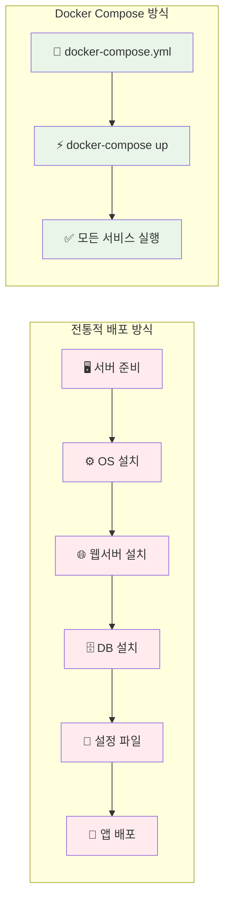
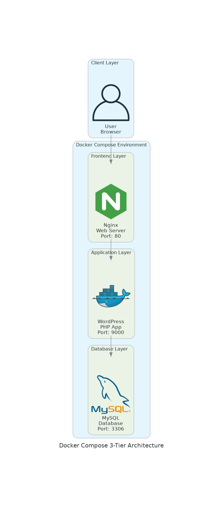
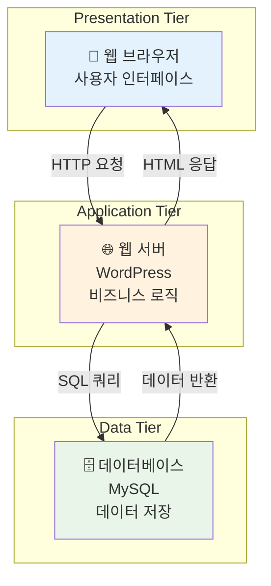
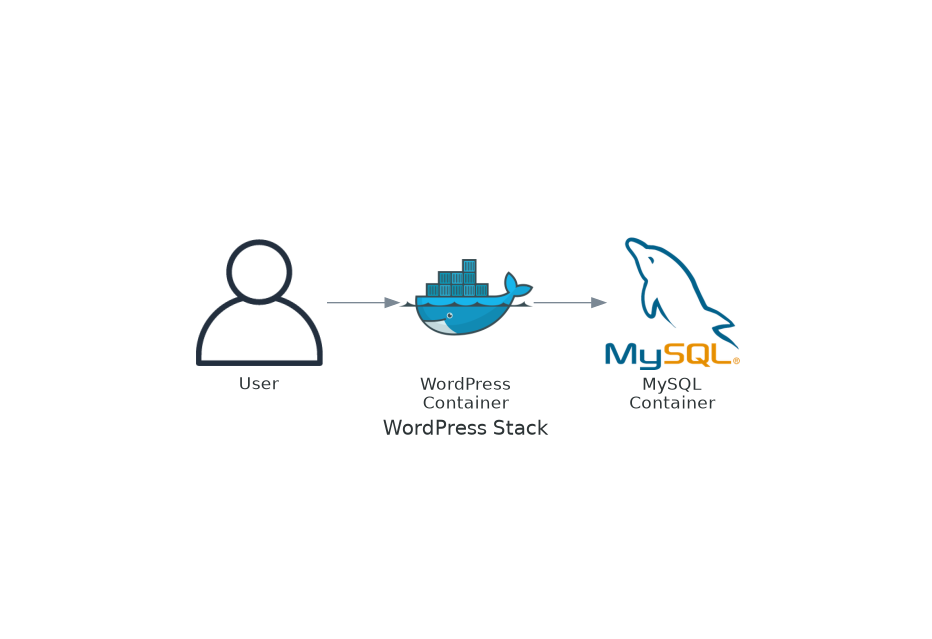
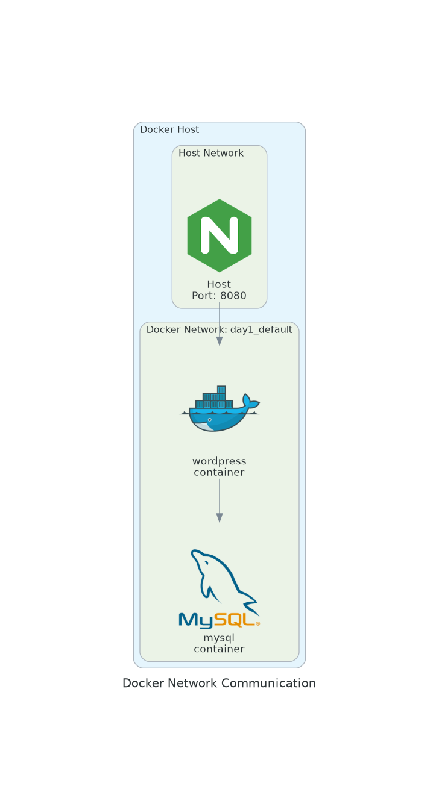
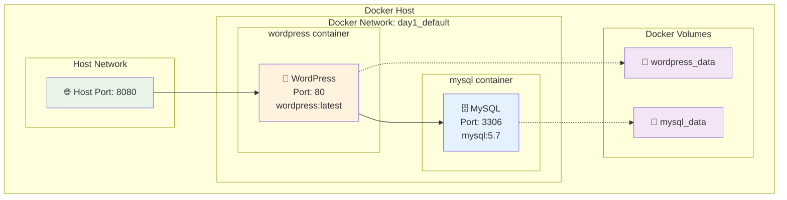
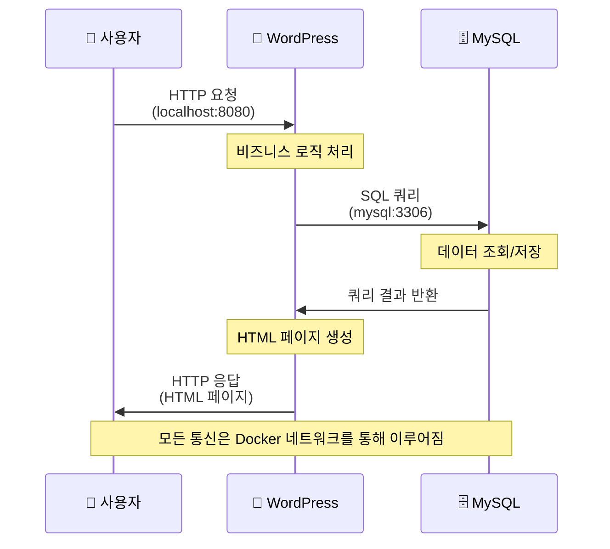

# 11월 보강 Week 1 Day 1: Docker Compose로 간단한 서비스 구축

<div align="center">

**🐳 Docker Compose 복습** • **🏗️ 3-Tier 아키텍처** • **🚀 실제 서비스 배포**

*MVP를 빠르게 만들어보며 Docker Compose의 강점 체험*

</div>

---

## 🕘 오늘의 일정
```
09:00-09:50  이론: Docker Compose와 3-Tier 아키텍처 (50분)
09:50-10:00  휴식 (10분)
10:00-10:50  실습: WordPress + MySQL 배포 (50분)
10:50-11:00  Q&A 및 정리 (10분)
```

---

## 🎯 오늘의 목표

### 📚 학습 목표
- **초급자**: Docker Compose로 멀티 컨테이너 앱 실행
- **중급자**: 3-Tier 아키텍처 이해 및 구성
- **고급자**: 서비스 간 의존성 및 네트워킹 최적화

### 🛠️ 실습 목표
- WordPress + MySQL을 Docker Compose로 배포
- 로컬에서 실제 블로그 서비스 실행
- 컨테이너 간 통신 및 데이터 영속성 확인

---

## 📖 이론 (09:00-09:50)

### 🤔 왜 Docker Compose인가? (5분)

**현실 문제 상황**:
```
개발자: "로컬에서 빠르게 프로토타입을 만들고 싶어요"
PM: "MVP를 빨리 보여줄 수 있나요?"
팀: "개발 환경을 쉽게 공유하고 싶어요"
```

**Docker Compose의 해결책**:
- ✅ **빠른 프로토타이핑**: 몇 줄의 YAML로 전체 스택 실행
- ✅ **환경 일관성**: 모든 팀원이 동일한 환경
- ✅ **간단한 관리**: 한 번의 명령으로 시작/종료

**배포 방식 비교**:


### 🏗️ 3-Tier 아키텍처 이해 (15분)

#### 전통적인 웹 애플리케이션 구조

**실제 서비스 아이콘을 사용한 아키텍처**:


**Mermaid 다이어그램 (GitHub 렌더링용)**:


#### 각 계층의 역할

**1. Presentation Tier (프레젠테이션 계층)**:
- **역할**: 사용자 인터페이스
- **기술**: HTML, CSS, JavaScript
- **예시**: 웹 브라우저, 모바일 앱

**2. Application Tier (애플리케이션 계층)**:
- **역할**: 비즈니스 로직 처리
- **기술**: PHP, Node.js, Python, Java
- **예시**: WordPress, Django, Express

**3. Data Tier (데이터 계층)**:
- **역할**: 데이터 저장 및 관리
- **기술**: MySQL, PostgreSQL, MongoDB
- **예시**: 사용자 정보, 게시글, 댓글

#### 왜 계층을 나누는가?

**장점**:
- 🔧 **유지보수 용이**: 각 계층을 독립적으로 수정
- 📈 **확장성**: 필요한 계층만 확장 가능
- 🔒 **보안**: 데이터베이스를 외부에서 직접 접근 불가
- 👥 **팀 협업**: 프론트엔드/백엔드 팀 분리 작업

**실생활 비유**:
```
레스토랑 = 3-Tier 아키텍처

홀 (Presentation)  → 고객이 메뉴를 보고 주문
주방 (Application) → 요리사가 음식 조리
창고 (Data)        → 식재료 보관
```

### 🐳 Docker Compose 핵심 개념 (15분)

**WordPress 스택 구조**:


#### docker-compose.yml 구조
```yaml
version: '3.8'

services:
  # 서비스 1: 웹 서버
  web:
    image: wordpress:latest
    ports:
      - "8080:80"
    environment:
      WORDPRESS_DB_HOST: db
      WORDPRESS_DB_USER: wordpress
      WORDPRESS_DB_PASSWORD: password
    depends_on:
      - db
    volumes:
      - wordpress_data:/var/www/html

  # 서비스 2: 데이터베이스
  db:
    image: mysql:5.7
    environment:
      MYSQL_DATABASE: wordpress
      MYSQL_USER: wordpress
      MYSQL_PASSWORD: password
      MYSQL_ROOT_PASSWORD: rootpassword
    volumes:
      - db_data:/var/lib/mysql

volumes:
  wordpress_data:
  db_data:
```

#### 주요 구성 요소 설명

**Docker Compose 네트워크 구조**:

**실제 네트워크 통신 구조**:


**상세 네트워크 다이어그램**:


**1. services (서비스)**:
```yaml
services:
  web:      # 서비스 이름 (컨테이너 간 통신에 사용)
    image:  # 사용할 Docker 이미지
    ports:  # 포트 매핑 (호스트:컨테이너)
```

**2. environment (환경 변수)**:
```yaml
environment:
  WORDPRESS_DB_HOST: db  # 'db'는 서비스 이름 (자동 DNS)
  WORDPRESS_DB_USER: wordpress
```
- Docker Compose는 **자동 DNS** 제공
- 서비스 이름으로 다른 컨테이너 접근 가능

**서비스 간 통신 흐름**:


**3. depends_on (의존성)**:
```yaml
depends_on:
  - db  # db 서비스가 먼저 시작되어야 함
```
- 시작 순서 제어
- ⚠️ 주의: 서비스가 "준비"되었는지는 보장 안 함

**4. volumes (볼륨)**:
```yaml
volumes:
  - wordpress_data:/var/www/html  # Named Volume
  - ./config:/etc/config           # Bind Mount
```
- **Named Volume**: Docker가 관리하는 영속적 스토리지
- **Bind Mount**: 호스트 디렉토리 직접 마운트

#### Docker Compose 명령어

**기본 명령어**:
```bash
# 서비스 시작 (백그라운드)
docker-compose up -d

# 서비스 중지
docker-compose down

# 로그 확인
docker-compose logs -f

# 실행 중인 컨테이너 확인
docker-compose ps

# 특정 서비스 재시작
docker-compose restart web
```

**고급 명령어**:
```bash
# 볼륨까지 삭제
docker-compose down -v

# 특정 서비스만 시작
docker-compose up -d web

# 스케일링 (같은 서비스 여러 개)
docker-compose up -d --scale web=3
```

### 📊 실제 사용 사례 (10분)

#### 사례 1: 개발 환경 공유
```
문제: 신입 개발자가 개발 환경 세팅에 하루 소요
해결: docker-compose up 한 번으로 전체 환경 구성
결과: 5분 만에 개발 시작 가능
```

#### 사례 2: 빠른 프로토타입
```
문제: 고객에게 빠르게 데모를 보여줘야 함
해결: Docker Compose로 로컬에서 즉시 실행
결과: 회의 중 바로 시연 가능
```

#### 사례 3: 마이크로서비스 로컬 테스트
```
문제: 여러 서비스를 동시에 실행하고 테스트
해결: docker-compose.yml에 모든 서비스 정의
결과: 한 번에 전체 시스템 테스트
```

### 💭 함께 생각해보기 (5분)

**질문 1**: "Docker Compose는 언제 사용하면 좋을까요?"
- 개발 환경
- 로컬 테스트
- 간단한 프로덕션 (소규모)

**질문 2**: "Docker Compose의 한계는 무엇일까요?"
- 단일 호스트만 지원
- 자동 복구 기능 없음
- 로드밸런싱 제한적
- ⚠️ 이번 주에 직접 경험하게 됩니다!

---

## 🛠️ 실습 (10:00-10:50)

### 🎯 실습 목표
WordPress 블로그 플랫폼을 Docker Compose로 배포하고 실제로 사용해보기

### 📋 사전 준비
```bash
# Docker 및 Docker Compose 설치 확인
docker --version
docker-compose --version

# 실습 디렉토리 생성
mkdir -p ~/november-reinforcement/week1/day1
cd ~/november-reinforcement/week1/day1
```

### Step 1: docker-compose.yml 작성 (10분)

**파일 생성**:
```bash
cat > docker-compose.yml <<'EOF'
version: '3.8'

services:
  wordpress:
    image: wordpress:latest
    container_name: wordpress-app
    ports:
      - "8080:80"
    environment:
      WORDPRESS_DB_HOST: mysql
      WORDPRESS_DB_USER: wordpress
      WORDPRESS_DB_PASSWORD: wordpress123
      WORDPRESS_DB_NAME: wordpress
    volumes:
      - wordpress_data:/var/www/html
    depends_on:
      - mysql
    restart: unless-stopped

  mysql:
    image: mysql:5.7
    container_name: wordpress-db
    environment:
      MYSQL_DATABASE: wordpress
      MYSQL_USER: wordpress
      MYSQL_PASSWORD: wordpress123
      MYSQL_ROOT_PASSWORD: rootpassword123
    volumes:
      - mysql_data:/var/lib/mysql
    restart: unless-stopped

volumes:
  wordpress_data:
  mysql_data:
EOF
```

**코드 설명**:
- `restart: unless-stopped`: 컨테이너 종료 시 자동 재시작
- `container_name`: 컨테이너에 명시적 이름 부여
- `volumes`: 데이터 영속성 보장 (컨테이너 삭제해도 데이터 유지)

### Step 2: 서비스 시작 (5분)

```bash
# 백그라운드로 서비스 시작
docker-compose up -d

# 예상 출력:
# Creating network "day1_default" with the default driver
# Creating volume "day1_mysql_data" with default driver
# Creating volume "day1_wordpress_data" with default driver
# Creating wordpress-db ... done
# Creating wordpress-app ... done
```

**확인**:
```bash
# 실행 중인 컨테이너 확인
docker-compose ps

# 예상 출력:
#     Name                   Command               State          Ports
# -------------------------------------------------------------------------------
# wordpress-app   docker-entrypoint.sh apach ...   Up      0.0.0.0:8080->80/tcp
# wordpress-db    docker-entrypoint.sh mysqld      Up      3306/tcp, 33060/tcp
```

### Step 3: WordPress 초기 설정 (15분)

**1. 웹 브라우저 접속**:
```
http://localhost:8080
```

**2. 언어 선택**:
- 한국어 선택 → 계속

**3. 사이트 정보 입력**:
```
사이트 제목: My Blog
사용자명: admin
비밀번호: (강력한 비밀번호 생성)
이메일: your-email@example.com
```

**4. WordPress 설치** 버튼 클릭

**5. 로그인 후 대시보드 확인**

### Step 4: 블로그 글 작성 및 확인 (10분)

**1. 새 글 작성**:
```
글 → 새로 추가
제목: "Docker Compose로 만든 첫 블로그"
내용: "오늘 Docker Compose를 배웠습니다..."
```

**2. 게시 및 확인**:
- 게시 버튼 클릭
- 블로그 방문하여 글 확인

**3. 데이터 영속성 테스트**:
```bash
# 컨테이너 중지
docker-compose down

# 다시 시작
docker-compose up -d

# 브라우저에서 http://localhost:8080 접속
# → 작성한 글이 그대로 남아있음 (볼륨 덕분!)
```

### Step 5: 로그 및 상태 확인 (5분)

**로그 확인**:
```bash
# 전체 로그
docker-compose logs

# WordPress 로그만
docker-compose logs wordpress

# 실시간 로그 (Ctrl+C로 종료)
docker-compose logs -f
```

**리소스 사용량 확인**:
```bash
# 컨테이너 리소스 사용량
docker stats wordpress-app wordpress-db
```

### Step 6: 정리 (5분)

**서비스 중지 (데이터 유지)**:
```bash
docker-compose down
```

**완전 삭제 (볼륨까지)**:
```bash
# ⚠️ 주의: 모든 데이터 삭제됨
docker-compose down -v
```

---

## ✅ 실습 체크리스트

### 기본 체크리스트
- [ ] docker-compose.yml 작성 완료
- [ ] 서비스 정상 시작 (docker-compose up -d)
- [ ] WordPress 초기 설정 완료
- [ ] 블로그 글 작성 및 확인
- [ ] 컨테이너 재시작 후 데이터 유지 확인

### 심화 체크리스트 (선택)
- [ ] 환경 변수 변경하여 재배포
- [ ] 다른 포트로 변경 (8080 → 9090)
- [ ] MySQL 데이터 직접 확인
- [ ] 네트워크 구조 이해

---

## 🔍 트러블슈팅

### 문제 1: 포트 충돌
**증상**:
```
Error: Bind for 0.0.0.0:8080 failed: port is already allocated
```

**해결**:
```yaml
# docker-compose.yml에서 포트 변경
ports:
  - "9090:80"  # 8080 → 9090
```

### 문제 2: MySQL 연결 실패
**증상**:
```
Error establishing a database connection
```

**원인**: MySQL이 완전히 시작되기 전에 WordPress가 연결 시도

**해결**:
```bash
# 잠시 기다린 후 재시작
docker-compose restart wordpress
```

### 문제 3: 볼륨 권한 문제
**증상**:
```
Permission denied
```

**해결**:
```bash
# 볼륨 삭제 후 재생성
docker-compose down -v
docker-compose up -d
```

---

## 💡 Q&A 및 정리 (10:50-11:00)

### 오늘 배운 핵심 내용

**1. Docker Compose의 강점**:
- ✅ 빠른 프로토타이핑
- ✅ 환경 일관성
- ✅ 간단한 멀티 컨테이너 관리

**2. 3-Tier 아키텍처**:
- Presentation (브라우저)
- Application (WordPress)
- Data (MySQL)

**3. 실무 활용**:
- 개발 환경 공유
- 로컬 테스트
- 빠른 데모

### 🤔 생각해볼 질문

**Q1**: "만약 트래픽이 급증하면 어떻게 대응할까요?"
- 현재: 수동으로 컨테이너 추가? (포트 충돌 문제)
- 내일: 이 문제를 직접 경험해봅니다!

**Q2**: "컨테이너가 갑자기 죽으면?"
- 현재: 수동으로 재시작
- 이번 주: 자동 복구가 필요한 이유 체험

**Q3**: "여러 서버에 배포하려면?"
- 현재: Docker Compose는 단일 호스트만 지원
- 다음 주: Kubernetes가 해결!

---

## 🎯 다음 시간 예고

### Day 2: 확장성 문제 체험
**주제**: "트래픽 증가 시 어떻게 대응?"

**예고**:
- Docker Compose scale 명령어 시도
- 포트 충돌 문제 발생
- 로드밸런싱 부재 경험
- **Pain Point 1 발견**: "확장이 어렵다!"

### 사전 준비
- [ ] 오늘 만든 WordPress 환경 유지
- [ ] `docker-compose scale` 명령어 미리 읽어보기
- [ ] 로드밸런싱 개념 간단히 검색

---

## 📚 추가 학습 자료

### 공식 문서
- [Docker Compose 공식 문서](https://docs.docker.com/compose/)
- [WordPress Docker 이미지](https://hub.docker.com/_/wordpress)
- [MySQL Docker 이미지](https://hub.docker.com/_/mysql)

### 추천 읽을거리
- [3-Tier 아키텍처 패턴](https://en.wikipedia.org/wiki/Multitier_architecture)
- [Docker Compose 베스트 프랙티스](https://docs.docker.com/compose/production/)

---

## 💭 오늘의 회고

### 개인 회고 (5분)
1. **가장 인상 깊었던 점**:
2. **어려웠던 부분**:
3. **실무에 적용할 아이디어**:

### 주말 과제 (선택)
- 다른 서비스 조합 시도 (예: Node.js + MongoDB)
- docker-compose.yml 커스터마이징
- 팀 프로젝트에 Docker Compose 적용 검토

---

<div align="center">

**🐳 Docker Compose 마스터** • **🏗️ 3-Tier 이해** • **🚀 빠른 배포**

*내일은 확장성 문제를 직접 경험합니다!*

</div>
