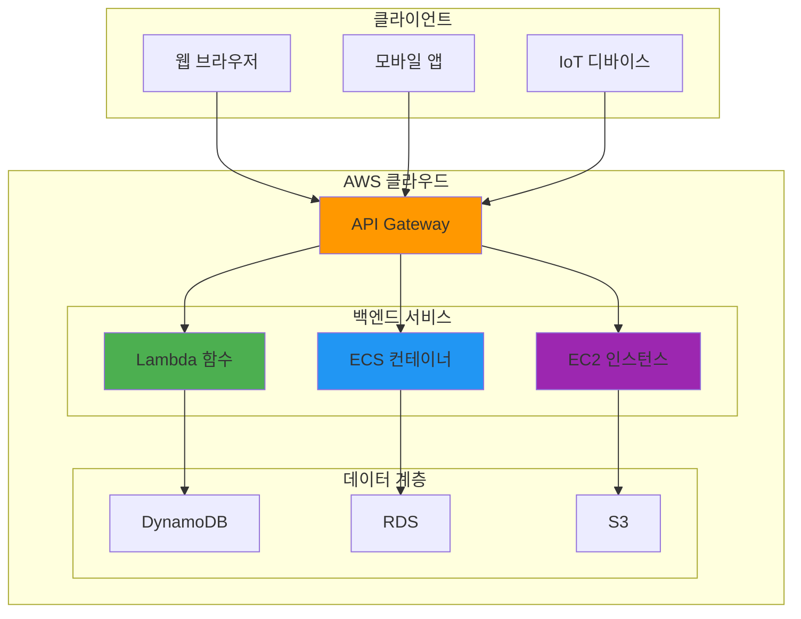
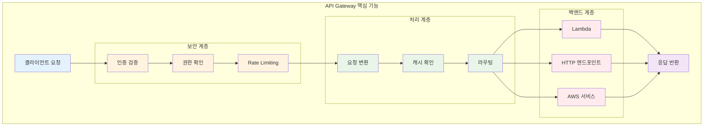
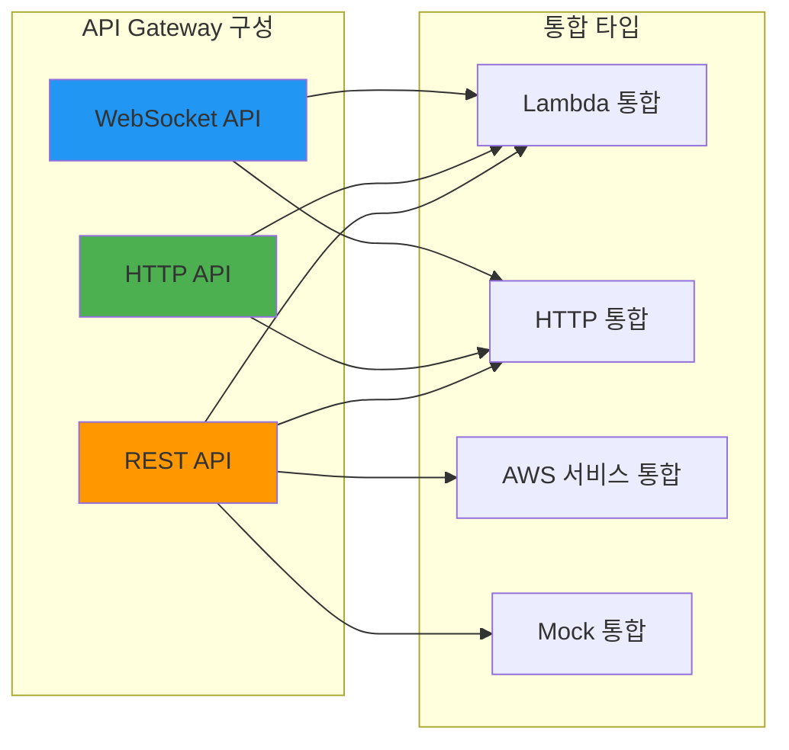
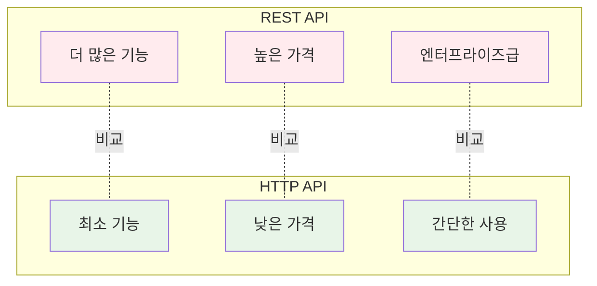
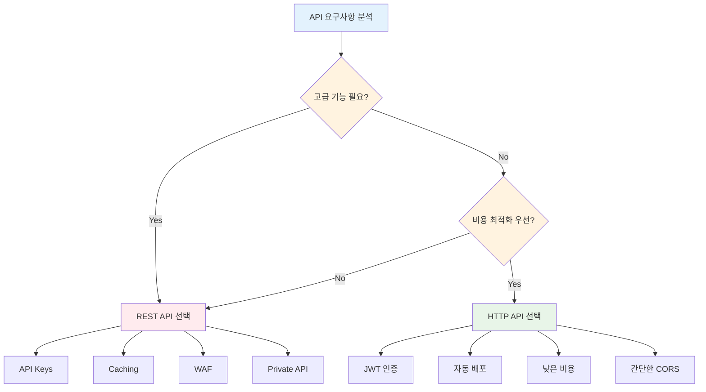
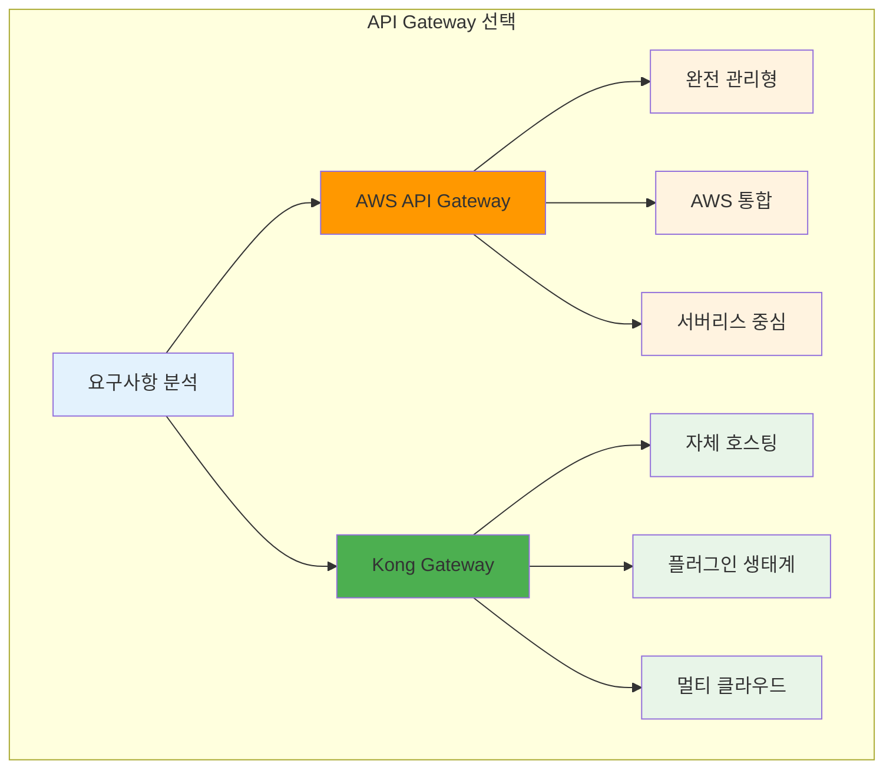

# November Week 2 Day 2 Session 1: Amazon API Gateway

<div align="center">

**🚪 API 관리** • **🔐 인증/인가** • **⚡ 서버리스 통합** • **💰 비용 최적화**

*RESTful API를 위한 완전 관리형 서비스*

</div>

---

## 🕘 세션 정보
**시간**: 09:00-09:50 (50분)
**목표**: API Gateway의 핵심 개념과 실무 활용 방법 이해
**방식**: 이론 강의 + 실습 예제

## 🎯 세션 목표
### 📚 학습 목표
- **이해 목표**: API Gateway의 역할과 필요성 이해
- **적용 목표**: REST API vs HTTP API 선택 기준 파악
- **협업 목표**: 실무 아키텍처 패턴 토론

---

## 🤔 왜 필요한가? (5분)

### 현실 문제 상황

**💼 실무 시나리오**: "마이크로서비스 아키텍처에서 API 관리의 어려움"
```
문제 1: 각 서비스마다 다른 인증 방식
- 서비스 A: API Key
- 서비스 B: JWT Token
- 서비스 C: OAuth 2.0
→ 클라이언트가 각각 다르게 처리해야 함

문제 2: 트래픽 급증 시 대응
- 특정 서비스에 요청 폭주
- 다른 서비스까지 영향
→ 전체 시스템 장애 위험

문제 3: API 버전 관리
- 기존 클라이언트 호환성 유지
- 새로운 기능 추가
→ 복잡한 배포 프로세스
```

**🏠 일상 비유**: "아파트 관리사무소"
```
API Gateway = 아파트 관리사무소

1. 출입 통제 (인증/인가)
   - 방문자 확인
   - 출입증 발급
   - 권한 검증

2. 안내 서비스 (라우팅)
   - 각 동/호수 안내
   - 택배 전달
   - 민원 접수

3. 보안 관리 (보호)
   - CCTV 모니터링
   - 이상 행동 감지
   - 출입 기록 관리
```

**☁️ AWS 아키텍처**: API Gateway의 위치


**📊 시장 동향**: API 관리 시장 성장
- 2024년 API 관리 시장: $50억 규모
- 연평균 성장률: 25%
- 주요 트렌드: 서버리스, 마이크로서비스, API-First 개발

---

## 📖 핵심 개념 (35분)

### 🔍 개념 1: API Gateway란? (12분)

> **정의**: 애플리케이션의 "정문(front door)" 역할을 하는 완전 관리형 API 관리 서비스

**상세 설명**:
- **핵심 원리**: 모든 API 요청의 단일 진입점
- **주요 특징**:
  1. 트래픽 관리 (Throttling, Rate Limiting)
  2. 인증/인가 (IAM, Cognito, Lambda Authorizer)
  3. 모니터링 (CloudWatch, X-Ray)
  4. 캐싱 (응답 캐시)
  5. API 버전 관리 (Stage)

**시각적 이해**:


**☁️ AWS 구현 예시**:


**🔧 AWS 서비스 매핑**:
- **API Gateway**: 모든 API 요청의 진입점
- **Lambda**: 서버리스 백엔드 로직
- **CloudWatch**: 로그 및 메트릭 모니터링
- **X-Ray**: 분산 추적 및 성능 분석
- **WAF**: 웹 애플리케이션 방화벽 통합

---

### 🔍 개념 2: REST API vs HTTP API (12분)

> **정의**: API Gateway가 제공하는 두 가지 RESTful API 타입

**단계별 이해**:

**1단계: 기본 차이점**


**2단계: 기능 비교표**
| 기능 | REST API | HTTP API | 선택 기준 |
|------|----------|----------|-----------|
| **가격** | $4.25/백만 요청 | $1.29/백만 요청 | HTTP API 70% 저렴 |
| **API Keys** | ✅ 지원 | ❌ 미지원 | API 키 필요 시 REST |
| **Usage Plans** | ✅ 지원 | ❌ 미지원 | 클라이언트별 제한 필요 시 REST |
| **Request Validation** | ✅ 지원 | ❌ 미지원 | 요청 검증 필요 시 REST |
| **Caching** | ✅ 지원 | ❌ 미지원 | 캐싱 필요 시 REST |
| **Private Endpoints** | ✅ 지원 | ❌ 미지원 | VPC 내부 API 필요 시 REST |
| **WAF 통합** | ✅ 지원 | ❌ 미지원 | 고급 보안 필요 시 REST |
| **JWT Authorizer** | ❌ 미지원 | ✅ 지원 | JWT 인증 시 HTTP |
| **자동 배포** | ❌ 수동 | ✅ 자동 | 빠른 배포 필요 시 HTTP |
| **CORS** | 수동 설정 | 자동 설정 | 간단한 CORS 필요 시HTTP |

**3단계: 실무 선택 기준**


**실무 연결**:
- **사용 사례 1**: 간단한 서버리스 API → HTTP API
- **사용 사례 2**: 엔터프라이즈 API 관리 → REST API
- **사용 사례 3**: 마이크로서비스 게이트웨이 → 상황에 따라 선택

**장단점**:
- **REST API 장점**: 풍부한 기능, 엔터프라이즈급 보안
- **REST API 단점**: 높은 비용, 복잡한 설정
- **HTTP API 장점**: 저렴한 비용, 간단한 설정, 빠른 배포
- **HTTP API 단점**: 제한된 기능, 고급 보안 기능 부족

**대안 기술**: Kong, Nginx, Traefik (다음 비교에서 설명)

---

### 🔍 개념 3: API Gateway vs Kong (11분)

> **정의**: AWS 관리형 서비스 vs 오픈소스 API Gateway 비교

**개념 간 관계**:


**종합 비교표**:
| 구분 | AWS API Gateway | Kong Gateway | 선택 기준 |
|------|-----------------|--------------|-----------|
| **배포 모델** | 완전 관리형 (Serverless) | 자체 호스팅 (ECS/EKS) | 운영 부담 vs 제어권 |
| **비용** | 사용량 기반 ($1.29-$4.25/백만) | 인프라 비용 (EC2/ECS) | 트래픽 패턴에 따라 |
| **확장성** | 자동 확장 (무제한) | 수동 확장 (설정 필요) | 트래픽 예측 가능성 |
| **AWS 통합** | 네이티브 (Lambda, Cognito 등) | 수동 통합 필요 | AWS 서비스 의존도 |
| **플러그인** | 제한적 (Lambda Authorizer) | 풍부한 플러그인 생태계 | 커스터마이징 필요성 |
| **멀티 클라우드** | AWS 전용 | 멀티 클라우드 지원 | 클라우드 전략 |
| **학습 곡선** | 낮음 (AWS 콘솔) | 중간 (설정 파일) | 팀 역량 |
| **모니터링** | CloudWatch 통합 | Prometheus/Grafana | 모니터링 스택 |
| **백엔드 타입** | Lambda 최적화 | 모든 백엔드 지원 | 백엔드 아키텍처 |

**실무 선택 시나리오**:

**시나리오 1: AWS API Gateway 선택**
```
상황:
- 서버리스 아키텍처 (Lambda 중심)
- AWS 서비스 중심 (Cognito, DynamoDB)
- 운영 팀 최소화
- 트래픽 예측 어려움

결과:
✅ 완전 관리형으로 운영 부담 없음
✅ Lambda와 네이티브 통합
✅ 자동 확장으로 트래픽 대응
❌ 비용이 높을 수 있음 (고트래픽 시)
```

**시나리오 2: Kong Gateway 선택**
```
상황:
- 컨테이너 기반 (ECS/EKS)
- 멀티 클라우드 전략
- 복잡한 플러그인 필요
- 안정적인 트래픽 패턴

결과:
✅ 완전한 제어권
✅ 풍부한 플러그인
✅ 멀티 클라우드 지원
❌ 운영 부담 증가
❌ 확장 설정 필요
```

**🔑 핵심 키워드 정리**:
- **API Gateway**: AWS 완전 관리형 API 관리 서비스
- **REST API**: 풍부한 기능, 높은 가격
- **HTTP API**: 최소 기능, 낮은 가격 (70% 저렴)
- **Lambda Integration**: 서버리스 백엔드 통합
- **Kong**: 오픈소스 API Gateway, 자체 호스팅
- **Throttling**: 요청 속도 제한
- **Stage**: API 버전 관리 (dev, staging, prod)
- **Authorizer**: 인증/인가 메커니즘

---

## 💭 함께 생각해보기 (10분)

### 🤝 페어 토론 (5분)

**토론 주제**:
1. **API 선택**: "여러분의 프로젝트에 REST API와 HTTP API 중 어떤 것이 적합할까요?"
   - 필요한 기능 목록 작성
   - 예상 트래픽 및 비용 계산
   - 선택 이유 정리

2. **Gateway 비교**: "API Gateway vs Kong, 어떤 상황에서 어떤 것을 선택하시겠어요?"
   - 팀 역량 고려
   - 운영 부담 vs 제어권
   - 비용 vs 기능

3. **실무 적용**: "현재 프로젝트에 API Gateway를 어떻게 적용할 수 있을까요?"
   - 기존 아키텍처 분석
   - 마이그레이션 계획
   - 예상 효과

**페어 활동 가이드**:
- 👥 **자유 페어링**: 관심사가 비슷한 사람끼리
- 🔄 **역할 교대**: 5분씩 설명자/질문자 역할 바꾸기
- 📝 **핵심 정리**: 대화 내용 중 중요한 점 메모하기

### 🎯 전체 공유 (5분)

**인사이트 공유**:
- 각 페어의 선택 기준과 이유
- 실무 적용 시 고려사항
- 예상되는 문제점과 해결 방안

**질문 수집**:
- 아직 이해가 어려운 부분
- 추가로 알고 싶은 내용
- 실습에서 확인하고 싶은 것

**다음 연결**:
- Session 2: Cognito와 API Gateway 통합
- 인증/인가 흐름 이해
- JWT 토큰 처리 방법

### 💡 이해도 체크 질문

**기본 이해도**:
- ✅ "API Gateway의 주요 역할 3가지를 설명할 수 있나요?"
- ✅ "REST API와 HTTP API의 가장 큰 차이점은 무엇인가요?"
- ✅ "어떤 상황에서 Kong 대신 API Gateway를 선택하시겠어요?"

**실무 적용**:
- ✅ "Lambda와 API Gateway를 어떻게 통합하나요?"
- ✅ "API Gateway에서 인증은 어떻게 처리하나요?"
- ✅ "트래픽 급증 시 API Gateway는 어떻게 대응하나요?"

---

## 📝 세션 마무리

### ✅ 오늘 세션 성과
- [ ] API Gateway의 역할과 필요성 이해
- [ ] REST API vs HTTP API 선택 기준 파악
- [ ] Kong과의 비교를 통한 선택 기준 이해
- [ ] Lambda 통합 패턴 이해

### 🎯 다음 세션 준비
**Session 2: Amazon Cognito**
- User Pool vs Identity Pool
- JWT 토큰 구조
- API Gateway와 Cognito 통합
- 사용자 데이터 저장 전략

**사전 학습 키워드**:
- JWT (JSON Web Token)
- OAuth 2.0
- OpenID Connect (OIDC)
- Identity Provider (IdP)

---

## 🔗 공식 문서 (필수)

**⚠️ 학생들이 직접 확인해야 할 공식 문서**:
- 📘 [API Gateway란 무엇인가?](https://docs.aws.amazon.com/apigateway/latest/developerguide/welcome.html)
- 📗 [REST API vs HTTP API 비교](https://docs.aws.amazon.com/apigateway/latest/developerguide/http-api-vs-rest.html)
- 📙 [API Gateway 개발자 가이드](https://docs.aws.amazon.com/apigateway/latest/developerguide/)
- 📕 [API Gateway 요금](https://aws.amazon.com/api-gateway/pricing/)
- 🆕 [API Gateway 최신 업데이트](https://aws.amazon.com/api-gateway/whats-new/)

---

<div align="center">

**🚪 API 관리** • **🔐 보안** • **⚡ 서버리스** • **💰 비용 효율**

*다음 세션에서는 Cognito를 통한 인증/인가를 학습합니다*

</div>
