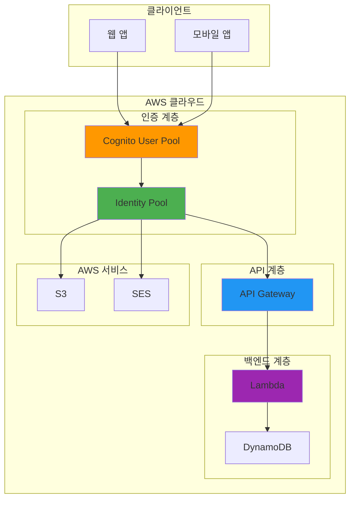
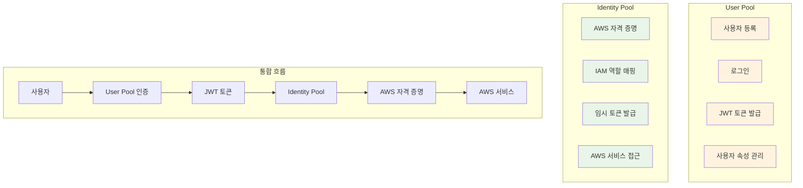
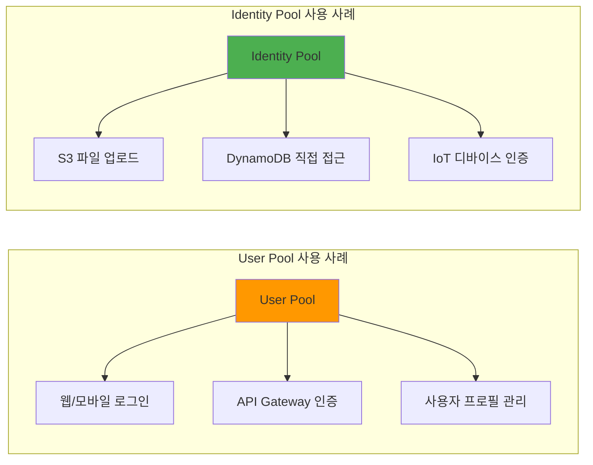
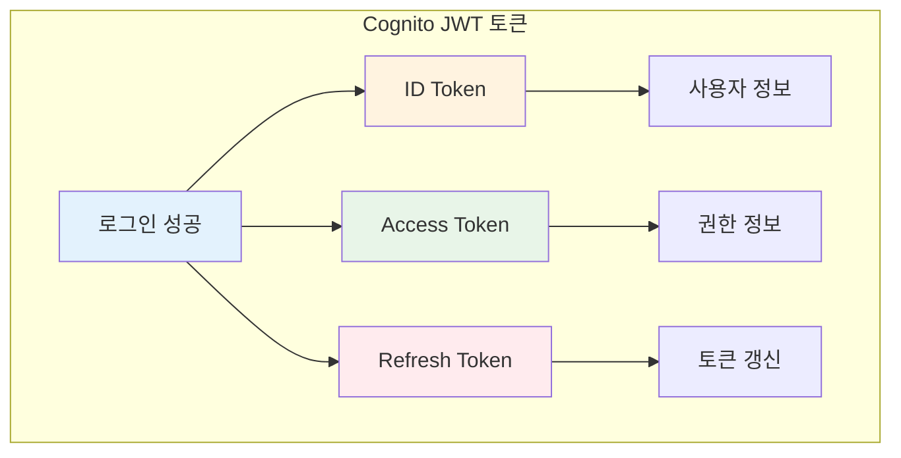
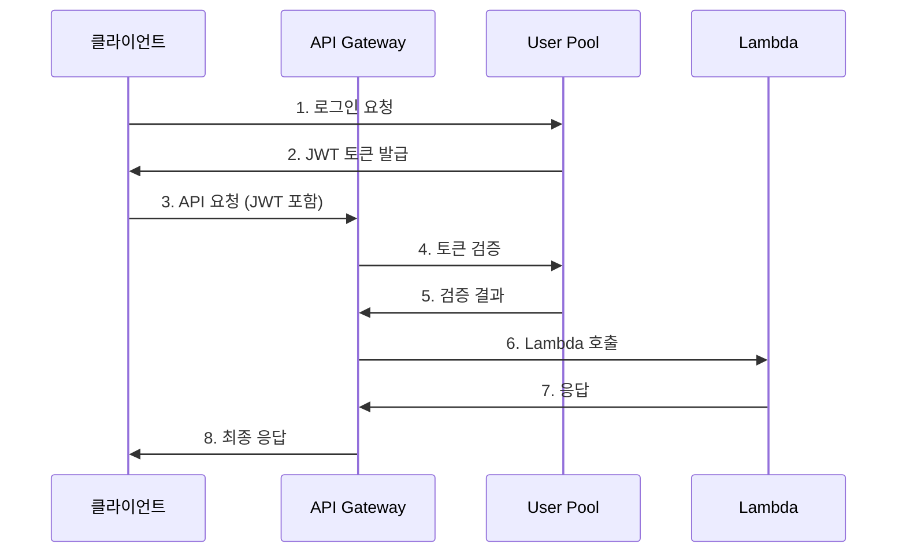
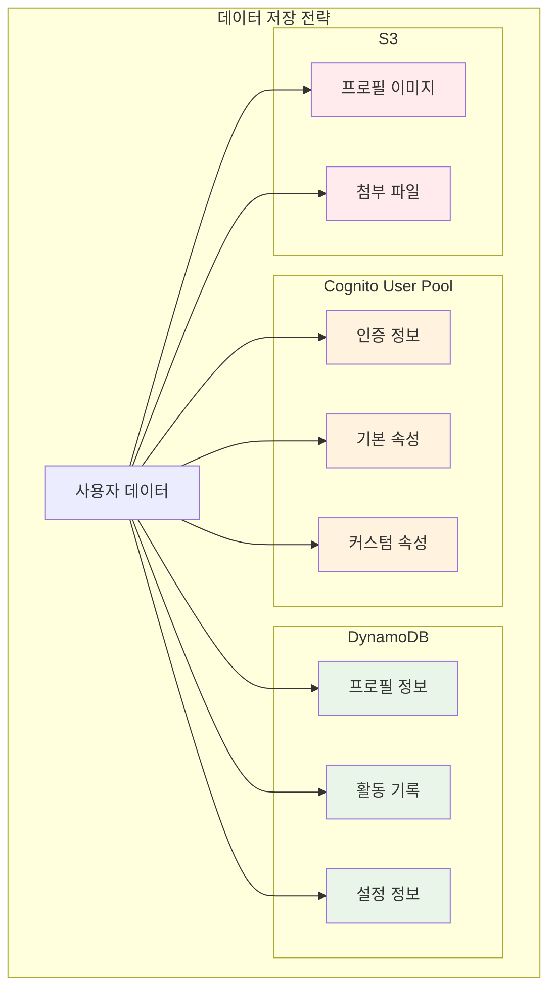

# November Week 2 Day 2 Session 2: Amazon Cognito

<div align="center">

**🔐 사용자 인증** • **🎫 JWT 토큰** • **👤 사용자 관리** • **🔑 권한 제어**

*완전 관리형 사용자 인증 및 권한 부여 서비스*

</div>

---

## 🕘 세션 정보
**시간**: 10:00-10:50 (50분)
**목표**: Cognito의 핵심 개념과 API Gateway 통합 이해
**방식**: 이론 강의 + 실습 예제

## 🎯 세션 목표
### 📚 학습 목표
- **이해 목표**: User Pool과 Identity Pool의 차이 이해
- **적용 목표**: JWT 토큰 구조와 검증 방법 파악
- **협업 목표**: 인증 흐름 설계 토론

---

## 🤔 왜 필요한가? (5분)

### 현실 문제 상황

**💼 실무 시나리오**: "사용자 인증 시스템 구축의 어려움"
```
문제 1: 직접 구현 시 보안 취약점
- 비밀번호 해싱 알고리즘 선택
- Salt 관리
- 세션 관리
- CSRF 방어
→ 보안 전문가 없이는 위험

문제 2: 소셜 로그인 통합
- Google, Facebook, Apple 각각 다른 OAuth 구현
- 토큰 갱신 로직
- 사용자 정보 동기화
→ 개발 및 유지보수 부담

문제 3: 확장성 문제
- 사용자 증가 시 DB 부하
- 세션 스토어 관리
- 분산 환경에서 세션 공유
→ 인프라 복잡도 증가
```

**🏠 일상 비유**: "호텔 키 카드 시스템"
```
Cognito = 호텔 키 카드 시스템

1. 체크인 (회원가입/로그인)
   - 신분증 확인
   - 키 카드 발급
   - 객실 번호 등록

2. 출입 (인증)
   - 키 카드 인식
   - 권한 확인
   - 출입 허용/거부

3. 서비스 이용 (권한 부여)
   - 수영장 이용 (일반 권한)
   - 라운지 이용 (프리미엄 권한)
   - 컨시어지 서비스 (VIP 권한)
```

**☁️ AWS 아키텍처**: Cognito의 위치


**📊 시장 동향**: 인증 서비스 시장
- 2024년 IAM 시장: $200억 규모
- 연평균 성장률: 15%
- 주요 트렌드: Passwordless, Biometric, Zero Trust

---

## 📖 핵심 개념 (35분)

### 🔍 개념 1: User Pool vs Identity Pool (12분)

> **정의**: Cognito의 두 가지 핵심 컴포넌트

**상세 설명**:

**User Pool (사용자 풀)**:
- **역할**: 사용자 디렉토리 및 인증 서비스
- **기능**:
  1. 회원가입/로그인
  2. 비밀번호 관리
  3. MFA (Multi-Factor Authentication)
  4. 소셜 로그인 (Google, Facebook, Apple)
  5. SAML/OIDC 통합

**Identity Pool (자격 증명 풀)**:
- **역할**: AWS 서비스 접근 권한 부여
- **기능**:
  1. 임시 AWS 자격 증명 발급
  2. IAM 역할 매핑
  3. 게스트 접근 지원
  4. 여러 인증 소스 통합

**시각적 이해**:


**☁️ AWS 구현 예시**:


**🔧 AWS 서비스 매핑**:
- **User Pool**: 애플리케이션 사용자 인증
- **Identity Pool**: AWS 리소스 접근 권한
- **API Gateway**: User Pool JWT 검증
- **Lambda**: 사용자 정보 처리
- **DynamoDB**: 사용자 프로필 저장

---

### 🔍 개념 2: JWT 토큰 구조 (12분)

> **정의**: Cognito가 발급하는 JSON Web Token의 구조와 역할

**단계별 이해**:

**1단계: JWT 토큰 종류**


**2단계: 각 토큰의 역할**

**ID Token (사용자 정보)**:
```json
{
  "sub": "user-uuid",
  "email": "user@example.com",
  "email_verified": true,
  "name": "홍길동",
  "cognito:username": "user123",
  "iss": "https://cognito-idp.ap-northeast-2.amazonaws.com/...",
  "aud": "app-client-id",
  "exp": 1234567890,
  "iat": 1234567890
}
```

**Access Token (권한 정보)**:
```json
{
  "sub": "user-uuid",
  "cognito:groups": ["admin", "users"],
  "scope": "openid profile email",
  "iss": "https://cognito-idp.ap-northeast-2.amazonaws.com/...",
  "client_id": "app-client-id",
  "exp": 1234567890,
  "iat": 1234567890
}
```

**Refresh Token (토큰 갱신)**:
- 긴 유효 기간 (기본 30일)
- 새로운 ID/Access Token 발급용
- 보안상 안전하게 저장 필요

**3단계: 토큰 검증 흐름**


**실무 연결**:
- **ID Token**: 사용자 프로필 표시
- **Access Token**: API 권한 확인
- **Refresh Token**: 자동 로그인 유지

**장단점**:
- **장점**: 서버 세션 불필요, 확장성 우수, 표준 기반
- **단점**: 토큰 크기 큰 편, 즉시 무효화 어려움

---

### 🔍 개념 3: 사용자 데이터 저장 전략 (11분)

> **정의**: Cognito와 DynamoDB를 활용한 사용자 데이터 관리

**개념 간 관계**:


**종합 비교표**:
| 데이터 유형 | Cognito | DynamoDB | S3 | 선택 기준 |
|------------|---------|----------|-----|-----------|
| **이메일** | ✅ 저장 | ❌ 불필요 | ❌ 불필요 | 인증용 |
| **비밀번호** | ✅ 해시 저장 | ❌ 절대 금지 | ❌ 절대 금지 | 보안 |
| **이름** | ✅ 기본 속성 | ✅ 복제 가능 | ❌ 불필요 | 빠른 조회 |
| **전화번호** | ✅ MFA용 | ✅ 복제 가능 | ❌ 불필요 | 인증 + 프로필 |
| **프로필 이미지** | ❌ 제한 | ✅ URL 저장 | ✅ 파일 저장 | 대용량 |
| **활동 기록** | ❌ 제한 | ✅ 저장 | ❌ 불필요 | 쿼리 필요 |
| **설정 정보** | ⚠️ 제한적 | ✅ 저장 | ❌ 불필요 | 유연성 |
| **소셜 연동** | ✅ 자동 | ✅ 추가 정보 | ❌ 불필요 | 통합 |

**실무 데이터 모델**:

**Cognito User Pool 속성**:
```json
{
  "sub": "user-uuid",
  "email": "user@example.com",
  "email_verified": true,
  "phone_number": "+821012345678",
  "phone_number_verified": false,
  "name": "홍길동",
  "custom:role": "premium",
  "custom:company": "ABC Corp"
}
```

**DynamoDB Users 테이블**:
```json
{
  "userId": "user-uuid",  // Cognito sub
  "email": "user@example.com",
  "profileImage": "https://s3.../profile.jpg",
  "bio": "안녕하세요...",
  "createdAt": "2024-01-01T00:00:00Z",
  "lastLoginAt": "2024-01-15T10:30:00Z",
  "settings": {
    "theme": "dark",
    "language": "ko",
    "notifications": true
  },
  "stats": {
    "postsCount": 42,
    "followersCount": 150,
    "followingCount": 200
  }
}
```

**Lambda 통합 코드 예시**:
```python
import boto3
import json

cognito = boto3.client('cognito-idp')
dynamodb = boto3.resource('dynamodb')
users_table = dynamodb.Table('Users')

def lambda_handler(event, context):
    # API Gateway에서 전달된 사용자 정보
    claims = event['requestContext']['authorizer']['claims']
    user_id = claims['sub']
    email = claims['email']
    
    # DynamoDB에서 사용자 프로필 조회
    response = users_table.get_item(Key={'userId': user_id})
    
    if 'Item' not in response:
        # 첫 로그인 시 프로필 생성
        users_table.put_item(Item={
            'userId': user_id,
            'email': email,
            'createdAt': datetime.now().isoformat(),
            'settings': {
                'theme': 'light',
                'language': 'ko'
            }
        })
    
    return {
        'statusCode': 200,
        'body': json.dumps(response.get('Item', {}))
    }
```

**🔑 핵심 키워드 정리**:
- **User Pool**: 사용자 디렉토리 및 인증
- **Identity Pool**: AWS 서비스 접근 권한
- **JWT**: JSON Web Token (ID, Access, Refresh)
- **ID Token**: 사용자 정보 포함
- **Access Token**: 권한 정보 포함
- **Refresh Token**: 토큰 갱신용
- **MAU**: Monthly Active Users (과금 기준)
- **MFA**: Multi-Factor Authentication
- **OIDC**: OpenID Connect
- **SAML**: Security Assertion Markup Language

---

## 💭 함께 생각해보기 (10분)

### 🤝 페어 토론 (5분)

**토론 주제**:
1. **데이터 저장**: "사용자 정보를 Cognito와 DynamoDB에 어떻게 나눠 저장하시겠어요?"
   - 인증 정보 vs 프로필 정보
   - 성능 vs 유연성
   - 비용 vs 기능

2. **토큰 관리**: "JWT 토큰을 클라이언트에서 어떻게 안전하게 저장하고 관리하시겠어요?"
   - LocalStorage vs SessionStorage vs Cookie
   - XSS 방어
   - CSRF 방어

3. **인증 흐름**: "API Gateway와 Cognito를 어떻게 통합하시겠어요?"
   - JWT Authorizer vs Lambda Authorizer
   - 토큰 검증 위치
   - 에러 처리

**페어 활동 가이드**:
- 👥 **자유 페어링**: 관심사가 비슷한 사람끼리
- 🔄 **역할 교대**: 5분씩 설명자/질문자 역할 바꾸기
- 📝 **핵심 정리**: 대화 내용 중 중요한 점 메모하기

### 🎯 전체 공유 (5분)

**인사이트 공유**:
- 각 페어의 데이터 저장 전략
- 토큰 관리 베스트 프랙티스
- 인증 흐름 설계 아이디어

**질문 수집**:
- 아직 이해가 어려운 부분
- 추가로 알고 싶은 내용
- 실습에서 확인하고 싶은 것

**다음 연결**:
- Lab 1: API Gateway + Cognito 통합 실습
- JWT 토큰 검증 구현
- 사용자 프로필 관리

### 💡 이해도 체크 질문

**기본 이해도**:
- ✅ "User Pool과 Identity Pool의 차이를 설명할 수 있나요?"
- ✅ "JWT 토큰 3가지 종류와 각각의 역할을 아시나요?"
- ✅ "사용자 데이터를 어디에 저장해야 하는지 판단할 수 있나요?"

**실무 적용**:
- ✅ "API Gateway에서 Cognito JWT를 어떻게 검증하나요?"
- ✅ "토큰 만료 시 어떻게 처리해야 하나요?"
- ✅ "소셜 로그인을 어떻게 통합하나요?"

---

## 📝 세션 마무리

### ✅ 오늘 세션 성과
- [ ] User Pool과 Identity Pool의 차이 이해
- [ ] JWT 토큰 구조와 역할 파악
- [ ] 사용자 데이터 저장 전략 수립
- [ ] API Gateway 통합 방법 이해

### 🎯 다음 Lab 준비
**Lab 1: API Gateway + Cognito 통합**
- User Pool 생성
- API Gateway JWT Authorizer 설정
- Lambda에서 사용자 정보 추출
- DynamoDB 프로필 관리

**사전 준비 사항**:
- AWS 계정 준비
- Postman 또는 curl 설치
- JWT 디코더 도구 (jwt.io)

---

## 🔗 공식 문서 (필수)

**⚠️ 학생들이 직접 확인해야 할 공식 문서**:
- 📘 [Cognito란 무엇인가?](https://docs.aws.amazon.com/cognito/latest/developerguide/what-is-amazon-cognito.html)
- 📗 [User Pool 사용자 가이드](https://docs.aws.amazon.com/cognito/latest/developerguide/cognito-user-identity-pools.html)
- 📙 [Identity Pool 가이드](https://docs.aws.amazon.com/cognito/latest/developerguide/cognito-identity.html)
- 📕 [Cognito 요금](https://aws.amazon.com/cognito/pricing/)
- 🆕 [Cognito 최신 업데이트](https://aws.amazon.com/cognito/whats-new/)

---

<div align="center">

**🔐 인증** • **🎫 JWT** • **👤 사용자 관리** • **🔑 권한 제어**

*다음 Lab에서는 API Gateway와 Cognito를 실제로 통합합니다*

</div>
