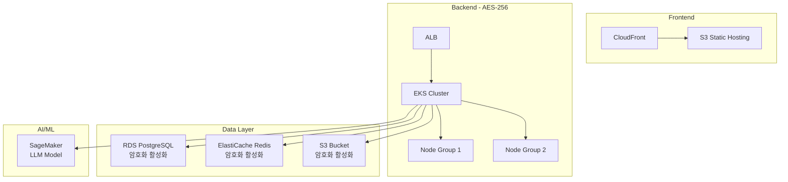
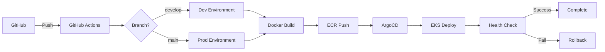
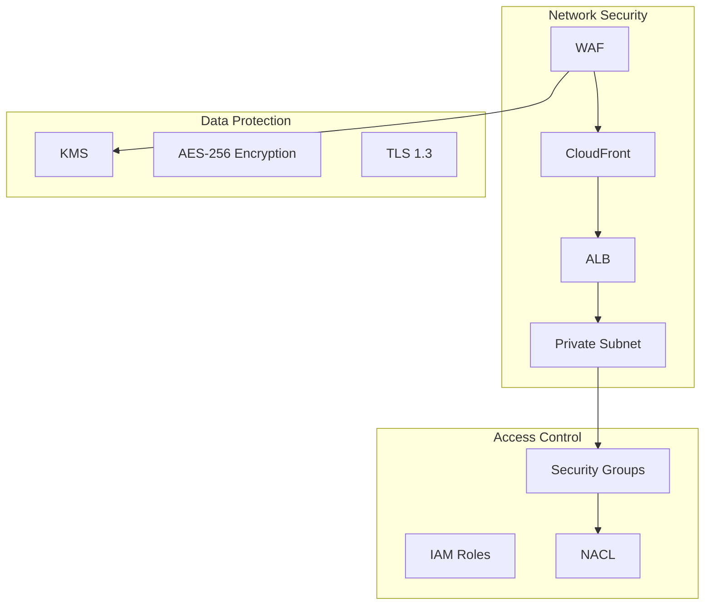
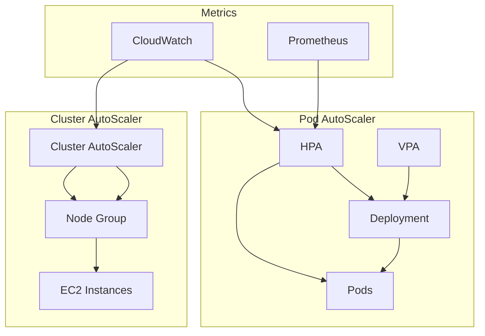
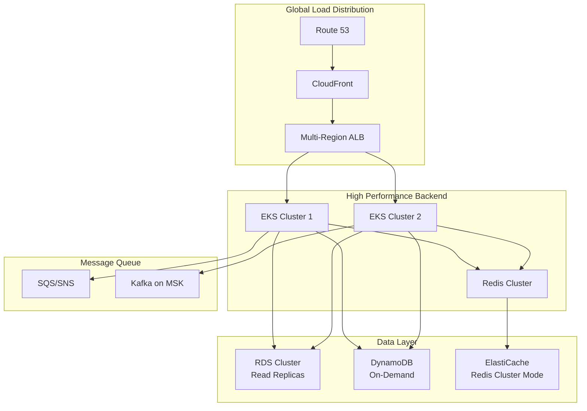
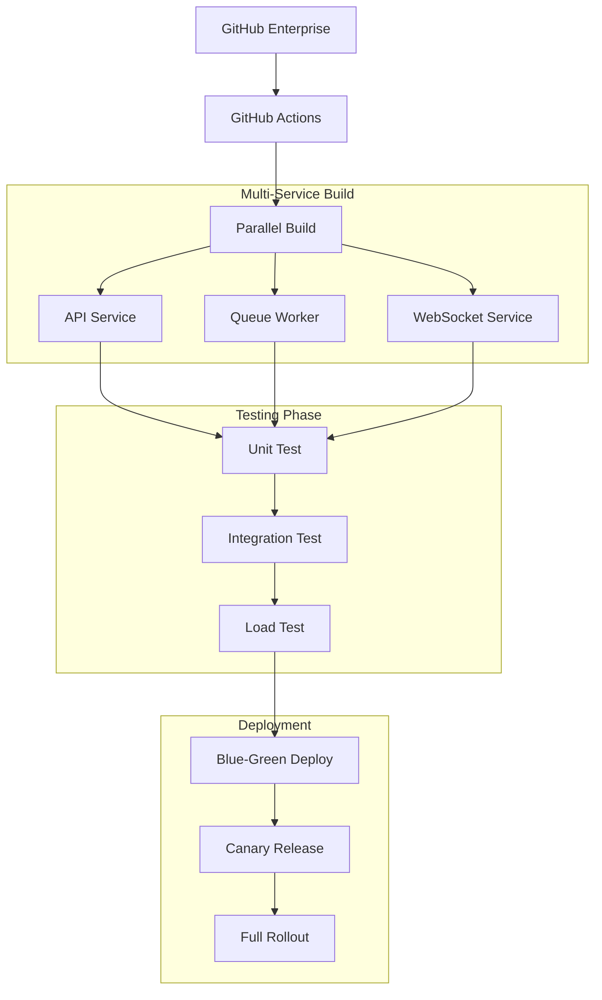
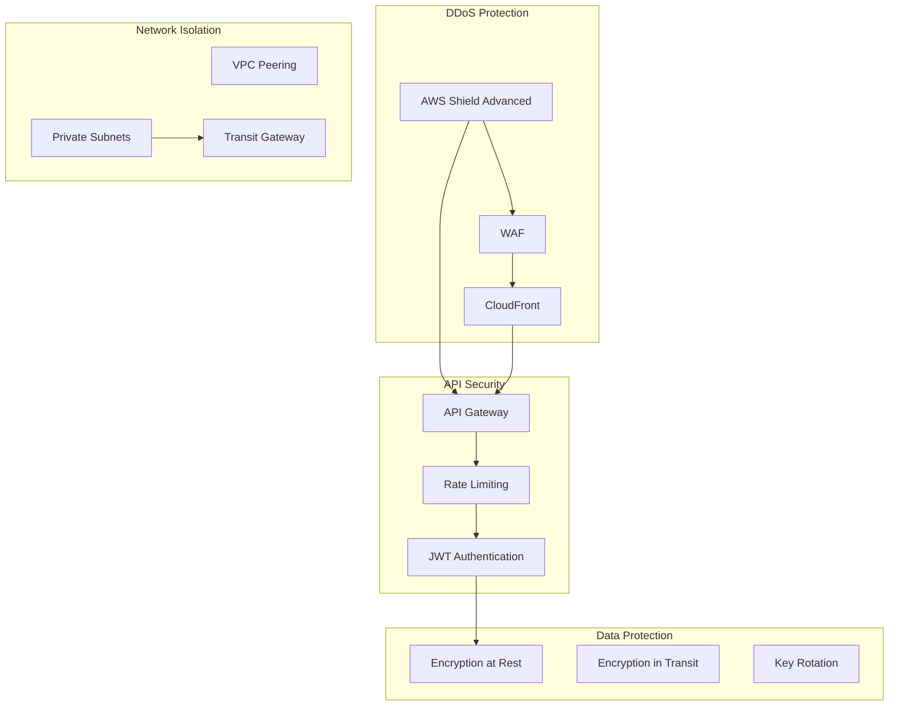
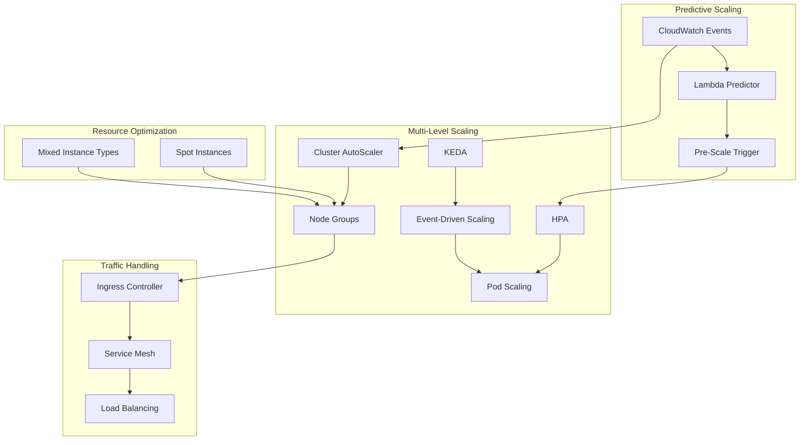

# Cloud Engineering 프로젝트 가이드라인

## 📋 목차
1. [PROJECT 1: Mind-Log - 초개인화 AI 멘탈케어 & 시각화 플랫폼](#project-1-mind-log)
2. [PROJECT 2: Traffic-Master - AI 기반 대규모 티켓팅 플랫폼](#project-2-traffic-master)

---

## PROJECT 1: Mind-Log
🎯 프로젝트 오버뷰
Mind-Log는 마음의 감정(AI 공감), 치기능 보관데이터 압축화를 핵심가치로 하는 초개인화 AI 멘탈케어 플랫폼입니다. 이 프로젝트는 사용자의 정신건강 데이터를 안전하게 보호하면서도 효과적인 AI 기반 상담 서비스를 제공하는 것을 목표로 합니다.

핵심 기술 스택은 LLM 기반 상담 에이전트, AES-256 컴플라이언트 암호화, 심시간 데이터 복제(CDC), 멀티모달 검증 시스템을 포함합니다. 특히 사용자의 민감한 정신건강 데이터를 다루는 만큼 보안과 개인정보보호에 특별한 주의를 기울여야 하며, 실시간으로 수집되는 생체데이터와 감정 데이터를 압축하여 보관하고 AI 지원 경험을 제공하는 B2C 서비스로 설계됩니다.

### 1. 인프라 구축

#### 1.1 아키텍처 개요

#### 1.2 주요 컴포넌트
- **Frontend**: CloudFront + S3 Static Website Hosting
- **Backend**: EKS 기반 Kubernetes 클러스터 운영
- **Database**: RDS PostgreSQL Multi-AZ 구성으로 고가용성 확보
- **Cache**: ElastiCache Redis로 응답성능 최적화
- **AI/ML**: SageMaker를 통한 LLM 모델 서빙
- **Storage**: S3에 AES-256 암호화로 민감한 데이터 저장

### 2. CI/CD 파이프라인

#### 2.1 파이프라인 구조

#### 2.2 파이프라인 전략
- **Source Control**: GitHub 기반 브랜치 전략 (GitFlow)
- **Build**: Docker 컨테이너화로 환경 일관성 보장
- **Registry**: ECR을 통한 안전한 이미지 저장
- **Deployment**: ArgoCD로 GitOps 방식 배포 자동화
- **Monitoring**: 배포 후 헬스체크 및 자동 롤백 기능

### 3. Cloud 보안

#### 3.1 보안 아키텍처

#### 3.2 보안 요구사항
- **네트워크 보안**: WAF, Security Group, NACL을 통한 다계층 방어
- **데이터 암호화**: AES-256으로 저장 데이터 암호화 및 TLS 1.3 통신 암호화
- **접근 제어**: IAM 역할 기반 최소 권한 원칙 적용
- **모니터링**: CloudTrail, GuardDuty를 통한 실시간 위협 탐지
- **개인정보 보호**: GDPR 준수를 위한 데이터 분류 및 보존 정책

### 4. 인프라 오토스케일링 (Kubernetes 기반)

#### 4.1 스케일링 아키텍처

#### 4.2 스케일링 전략
- **Cluster AutoScaler**: 노드 부족 시 자동으로 EC2 인스턴스 추가/제거
- **HPA (Horizontal Pod AutoScaler)**: CPU/메모리 사용률 기반 Pod 수평 확장
- **VPA (Vertical Pod AutoScaler)**: 리소스 요청량 자동 조정
- **메트릭 기반 스케일링**: CloudWatch와 Prometheus 메트릭 활용
- **예측적 스케일링**: 시간대별 사용 패턴을 학습한 사전 스케일링

---

## PROJECT 2: Traffic-Master
🎯 프로젝트 오버뷰
Traffic-Master는 폭발적인 AI 메타모델과 막역한 AI 발명의 대규모 트래픽 전쟁을 다루는 혁신적인 티켓팅 플랫폼입니다. 이 시스템은 동시에 15,000석의 규모 트래픽을 기술적으로 제어하고 매크로를 능동적으로 차단하는 것을 핵심 목표로 합니다.

주요 기술 키워드는 Extreme Concurrency(동시성 제어), In-memory 컴퓨팅, Canvas/WebGL 차차 렌더링, 성능성 보안 위조(VQA), KEDA 기반 에죽적 오토스케일링 등을 포함합니다. 이 프로젝트는 대용량 트래픽 상황에서도 안정적인 서비스 제공과 공정한 티켓 분배를 보장하면서, 실시간으로 발생하는 수만 건의 동시 요청을 효율적으로 처리할 수 있는 확장 가능한 아키텍처를 구현합니다.

### 1. 인프라 구축

#### 1.1 아키텍처 개요

#### 1.2 대용량 트래픽 대응 컴포넌트
- **Global CDN**: CloudFront로 전세계 엣지 로케이션 활용
- **Multi-Region**: 지역별 트래픽 분산으로 레이턴시 최소화
- **Database**: RDS 클러스터 + Read Replica로 읽기 성능 확장
- **In-Memory Cache**: Redis 클러스터 모드로 초고속 데이터 접근
- **Message Queue**: SQS/SNS 및 Kafka로 비동기 처리
- **Real-time Processing**: Canvas/WebGL 최적화 렌더링

### 2. CI/CD 파이프라인

#### 2.1 대규모 서비스 파이프라인

#### 2.2 대규모 배포 전략
- **Microservices**: 서비스별 독립적인 빌드 및 배포
- **병렬 처리**: 멀티 서비스 동시 빌드로 시간 단축
- **테스트 자동화**: Unit, Integration, Load Test 순차 진행
- **Blue-Green 배포**: 무중단 배포로 서비스 안정성 확보
- **Canary Release**: 점진적 트래픽 전환으로 리스크 최소화

### 3. Cloud 보안

#### 3.1 대규모 트래픽 보안 아키텍처

#### 3.2 보안 강화 전략
- **DDoS 방어**: AWS Shield Advanced로 대규모 공격 차단
- **API 보안**: Rate Limiting과 JWT 기반 인증으로 무단 접근 방지
- **네트워크 분리**: VPC Peering과 Private Subnet으로 내부 통신 보호
- **데이터 보호**: 전송 중/저장 중 암호화 및 정기적 키 로테이션
- **실시간 모니터링**: 15,000석 동시 접근 상황 실시간 위협 탐지

### 4. 인프라 오토스케일링 (Kubernetes 기반)

#### 4.1 극한 스케일링 아키텍처

#### 4.2 극한 스케일링 전략
- **예측적 스케일링**: 티켓팅 오픈 시간 기준 사전 리소스 확보
- **다중 스케일링**: Cluster, Pod, Event-driven 스케일링 조합
- **비용 최적화**: Spot Instance와 Mixed Instance Type 활용
- **이벤트 기반**: KEDA를 통한 큐 길이 기반 워커 확장
- **실시간 모니터링**: 15,000명 동시 접속 대응 실시간 메트릭 수집

#### 4.3 성능 목표
- **동시 사용자**: 15,000명 동시 접속 처리
- **응답 시간**: 평균 200ms 이하 유지
- **가용성**: 99.9% SLA 보장
- **확장성**: 트래픽 급증 시 3분 내 자동 확장
- **비용 효율성**: 유휴 시간 자동 스케일 다운으로 비용 최적화