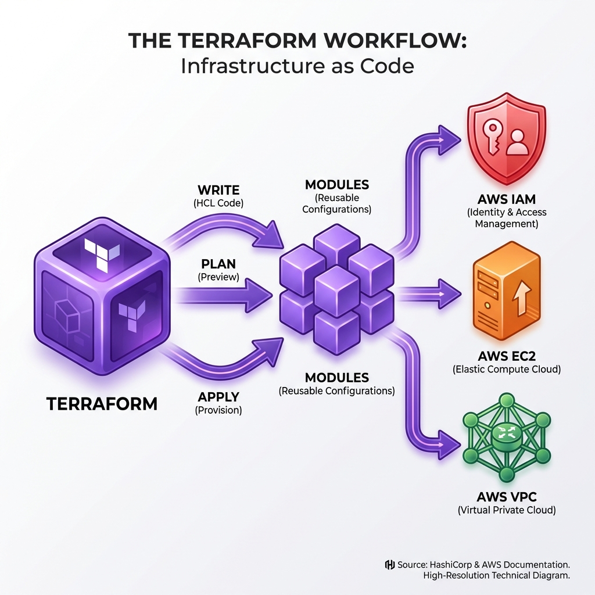

# 0단계: Terraform 소개 및 팀별 협업 전략

[다음 단계 >](./01_setup.md)

> **Terraform 공식 문서**: [Terraform 소개](https://developer.hashicorp.com/terraform/intro) | [HCL 언어 문법](https://developer.hashicorp.com/terraform/language) | [Terraform 핵심 워크플로우](https://developer.hashicorp.com/terraform/intro/core-workflow)

---

## 1. Terraform이란?
Terraform은 HashiCorp가 개발한 오픈 소스 **IaC(Infrastructure as Code)** 도구입니다. 단순히 서버를 켜는 스크립트가 아니라, 클라우드 리소스의 **최종 상태(State)**를 코드로 정의하고 관리하는 도구입니다.

### 핵심 철학: 선언적(Declarative) vs 명령형(Imperative)

인프라를 코드로 관리하는 방식은 크게 두 가지로 나뉩니다.

#### 명령형 (Imperative) — "**이 순서대로** 실행해라"
Shell 스크립트나 AWS CLI처럼, **어떤 순서로 무엇을 해야 하는지** 단계별로 지시합니다.

```bash
# 명령형 예시: AWS CLI로 인프라 팀 그룹 만들기
aws iam create-group --group-name infra-team
aws iam attach-group-policy \
  --group-name infra-team \
  --policy-arn arn:aws:iam::aws:policy/AdministratorAccess
aws iam create-user --user-name infra-member-01
aws iam add-user-to-group --user-name infra-member-01 --group-name infra-team
```

**문제점**: 이 스크립트를 두 번 실행하면? `create-group`에서 *"이미 존재합니다"* 에러가 발생합니다.
매번 "이미 있는지 확인 → 없으면 생성, 있으면 건너뛰기" 같은 분기 로직을 직접 작성해야 합니다.

#### 선언적 (Declarative) — "**최종 상태는** 이래야 한다"
Terraform(HCL)은 **원하는 결과**만 기술합니다. "어떻게" 만들지는 Terraform이 알아서 판단합니다.

```hcl
# 선언적 예시: Terraform HCL로 동일한 인프라 정의
resource "aws_iam_group" "infra_team" {
  name = "infra-team"
}

resource "aws_iam_group_policy_attachment" "infra_admin" {
  group      = aws_iam_group.infra_team.name
  policy_arn = "arn:aws:iam::aws:policy/AdministratorAccess"
}
```

이 코드를 **몇 번이든** `terraform apply`해도 결과는 동일합니다. 이를 **멱등성(Idempotency)**이라 합니다.
- 그룹이 없으면 → **생성**
- 그룹이 이미 있고 코드와 동일하면 → **아무것도 안 함**
- 그룹이 있지만 설정이 다르면 → **수정**
- 코드에서 삭제하면 → **실제로도 삭제**

#### 비교 요약

| 항목 | 명령형 (Imperative) | 선언적 (Declarative) |
| :--- | :--- | :--- |
| **대표 도구** | AWS CLI, Shell Script, Ansible Ad-hoc | Terraform, CloudFormation, Kubernetes YAML |
| **코드 내용** | "이 순서대로 실행해라" | "최종 상태는 이래야 한다" |
| **중복 실행** | 에러 발생 가능 (분기 로직 필요) | 안전 (멱등성 보장) |
| **현재 상태 추적** | 없음 (매번 직접 확인) | State 파일로 자동 추적 |
| **변경 미리보기** | 불가능 | `terraform plan`으로 확인 |
| **롤백** | 되돌리는 스크립트를 별도 작성 | 이전 코드로 `apply` |

> **Terraform은 선언적 도구입니다.** "EC2를 생성해라"가 아니라, "**t3.micro 타입의 EC2가 하나 있어야 한다**"고 선언합니다. Terraform은 현재 상태와 코드를 비교하여, 없으면 생성하고, 다르면 수정하고, 필요 없으면 삭제합니다.

### 주요 장점 (Pros)
-   **멀티 클라우드 지원**: AWS뿐만 아니라 Azure, GCP, Kubernetes, GitHub 등 수많은 서비스 제공자(Provider)를 동일한 문법(HCL)으로 관리할 수 있습니다.
-   **상태 관리 (State Management)**: `tfstate`라는 파일을 통해 현재 인프라가 어떤 상태인지 정확히 추적합니다. 이는 실시간으로 전체 클라우드를 스캔하는 것보다 훨씬 빠르고 효율적입니다.
-   **불변 인프라 (Immutable Infrastructure)**: 문제가 발생한 서버를 고쳐 쓰기보다, 문제없는 새로운 서버로 교체하는 패턴을 쉽게 구현할 수 있습니다.

### 주요 단점 (Cons)
-   **State 파일 관리의 복잡성**: 이 파일이 날아가거나 깨지면, 실제 인프라와 연결 고리가 끊깁니다. 협업 시에는 동시 수정을 막기 위한 Lock 설정이 필수적입니다.
-   **초기 진입 장벽**: HCL이라는 새로운 언어를 배워야 하며, 클라우드 자체에 대한 이해도도 높아야 합니다.
-   **롤백의 어려움**: `git revert`처럼 코드를 되돌리고 배포하면 되지만, 데이터베이스 같은 리소스가 삭제되었다면 복구가 매우 까다롭습니다.

---

## 2. Terraform vs 웹 콘솔: 동시 제어 시 발생하는 문제 (Drift)

Terraform 관리자가 가장 경계해야 할 것은 **"코드 밖의 변경(Drift)"**입니다. 수강생들이 흔히 겪는 "Terraform으로 만들고 웹 콘솔에서 수정하면 어떻게 되나요?"에 대한 실제 시나리오들입니다.

### Case 1: 사라진 긴급 패치 (The Vanishing Hotfix)
> **상황**: 새벽 2시에 웹 서버 보안 그룹에 급하게 특정 IP를 허용해야 했습니다. 담당자는 Terraform 코드를 수정하고 배포 승인을 받기 귀찮아서, **AWS 웹 콘솔에서 직접 보안 그룹 규칙을 추가**했습니다.
>
> **결과**: 다음 날 아침, 다른 팀원이 정기 배포를 위해 `terraform apply`를 실행했습니다. Terraform은 *"어? 코드에는 이 IP 허용 규칙이 없는데? 내가 정의한 상태와 다르네?"*라고 판단하고, **밤새 추가한 보안 규칙을 삭제해버립니다.** 서비스는 다시 장애가 발생합니다.
>
> **교훈**: **Terraform은 '코드에 없는 것'은 '잘못된 것'으로 간주합니다.** 긴급하더라도 반드시 코드를 수정하여 배포하거나, 사후에 코드를 빠르게 동기화해야 합니다.

### Case 2: 배포 차단 (The Blocked Deployment)
> **상황**: Terraform으로 관리하던 IAM 역할을 누군가 **웹 콘솔에서 실수로 삭제**했습니다.
>
> **결과**: Terraform 코드를 수정하려고 `terraform plan`을 돌리자 에러가 발생합니다. Terraform State 파일에는 "이 역할이 존재한다(ID: xxx)"라고 기록되어 있는데, 실제 AWS API를 찔러보니 "그런 리소스 없습니다(404 Not Found)"라고 응답하기 때문입니다. Terraform은 이 상황을 해소하기 위해 `terraform refresh` 등으로 상태를 다시 맞추는 과정을 거쳐야 하며, 그동안 배포 파이프라인은 멈추게 됩니다.

### Case 3: 좀비 리소스 (The Zombie Resource)
> **상황**: 개발자가 테스트를 위해 EC2 인스턴스를 하나 만들고 싶어서 Terraform 코드에 추가했습니다. 테스트가 끝나고 **웹 콘솔에서 종료(Terminate)**시켰습니다. 하지만 **Terraform 코드에서는 지우지 않았습니다.**
>
> **결과**: 며칠 뒤 정기 배포 때, Terraform은 *"어? 코드에는 EC2가 있어야 하는데 실제로는 없네?"*라며 **EC2를 다시 살려냅니다.** 개발자는 분명 지웠다고 생각했지만, 유령처럼 되살아나 비용을 계속 발생시킵니다.

---

## 3. 팀별 협업 전략 (Collaboration Strategy)

이러한 문제를 방지하기 위해 각 팀은 명확한 R&R(역할과 책임)을 가져야 합니다.

### 인프라 팀 (Infrastructure Team) - "Provider & Controller"
-   **핵심 역할**: 클라우드 인프라의 '단일 진실 공급원(Single Source of Truth)'인 Terraform 코드를 관리합니다.
-   **책임**:
    -   **모듈화**: 타 팀이 복잡한 네트워킹을 몰라도 "웹 서버 모듈"만 선언하면 되도록 모듈을 제공합니다.
    -   **State 관리**: S3와 DynamoDB를 연동하여 State 파일의 저장과 잠금(Locking)을 중앙에서 통제합니다.
    -   **Drift 감지**: 주기적으로 `terraform plan`을 실행(Cronjob 등)하여 누군가 콘솔에서 몰래 바꾼 설정이 있는지 감시합니다.

### 보안 팀 (Security Team) - "Auditor & Guardrail"
-   **핵심 역할**: 코드가 배포되기 전에 보안 위협을 차단합니다.
-   **책임**:
    -   **코드 스캔**: CI/CD 파이프라인에서 `tfsec`이나 `checkov` 같은 도구로 보안 취약점(예: 0.0.0.0/0 개방)을 자동 검사합니다.
    -   **권한 통제**: 인프라 팀 외에는 AWS 콘솔에서 '쓰기(Write/Delete)' 권한을 갖지 못하도록 IAM 정책을 강제합니다.

### 애플리케이션 팀 (Frontend / Backend) - "Consumer"
-   **핵심 역할**: 인프라를 '소비'하여 비즈니스 로직을 배포합니다.
-   **책임**:
    -   **요청 프로세스**: 리소스가 더 필요하면 콘솔 버튼을 누르는 대신, Terraform 코드(PR)를 수정하여 인프라 팀에 요청합니다.
    -   **환경 분리**: 테스트(Dev) 환경에서는 비교적 자유롭게 실험하되, 운영(Prod) 환경은 철저히 Terraform을 통해서만 접근합니다.

---

## 4. Terraform 배포 흐름도

Terraform 코드가 모듈화되어 실제 AWS 리소스로 변환되는 과정입니다.


*(그림: Terraform -> Modules -> AWS Resources (IAM, EC2, VPC) 배포 흐름도)*

### 권한 가드레일 (Permission Guardrails)
협업 시 사고를 방지하기 위한 최소한의 안전장치입니다.
1.  **SCP (Service Control Policy)**: AWS Organizations 수준에서 "절대로 하면 안 되는 행동"(예: CloudTrail 끄기, 특정 리전 사용)을 원천 차단.
2.  **Permission Boundary**: IAM User 생성 시, 그 User가 가질 수 있는 최대 권한의 상한선을 설정.
3.  **Sentinel / OPA**: Terraform 코드 단계에서 정책 검사 (예: "EC2 인스턴스 타입은 t3.micro만 가능").

---

[다음 단계 >](./01_setup.md)
