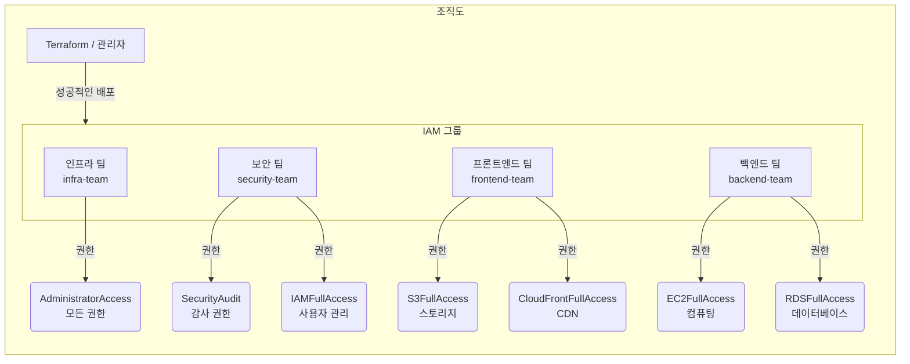
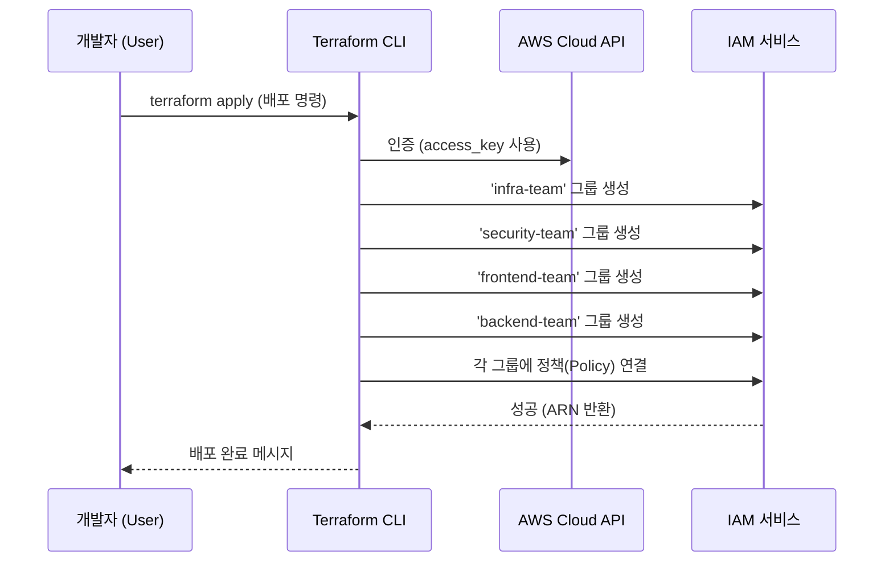

# 2단계: IAM 팀 구조 설계 및 권한 분리

[< 이전 단계](./01_setup.md) | [다음 단계 >](./03_infra_team.md)

---

## 1. 조직 그룹 개요
가상의 기업 환경을 시뮬레이션하기 위해 4개의 팀으로 나누어 권한을 관리합니다.

| 팀 명 | 그룹 이름 (Group Name) | 주요 업무 | AWS 관리형 정책 (Managed Policy) |
| :--- | :--- | :--- | :--- |
| **인프라 팀** | `infra-team` | 모든 AWS 리소스 총괄 관리 | `AdministratorAccess` |
| **보안 팀** | `security-team` | 계정 감사 및 사용자 관리 | `SecurityAudit`, `IAMFullAccess` |
| **프론트엔드** | `frontend-team` | 웹 정적 자원 및 CDN 관리 | `AmazonS3FullAccess`, `CloudFrontFullAccess` |
| **백엔드** | `backend-team` | 서버 및 데이터베이스 관리 | `AmazonEC2FullAccess`, `AmazonRDSFullAccess` |

## 2. 인포그래픽: 구조 시각화

### 조직도 계층 구조 (Organizational Hierarchy)
각 팀이 어떤 권한을 가지는지 시각화합니다.

### 배포(Deployment) 흐름도
Terraform이 AWS API를 호출하여 이 구조를 만드는 과정입니다.

---

## 공식 문서 (참고 자료)
- [AWS IAM 그룹이란?](https://docs.aws.amazon.com/ko_kr/IAM/latest/UserGuide/id_groups.html)
- [AWS 관리형 정책과 인라인 정책](https://docs.aws.amazon.com/ko_kr/IAM/latest/UserGuide/access_policies_managed-vs-inline.html)

---

[< 이전 단계](./01_setup.md) | [다음 단계 >](./03_infra_team.md)
