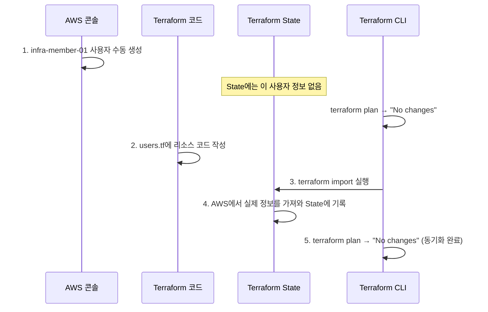

# 7단계: AWS 콘솔에서 수동 추가 및 Terraform Import

[< 이전 단계](./06_backend_team.md) | [다음 단계 >](./08_drift.md)

> **Terraform 공식 문서**: [terraform import](https://developer.hashicorp.com/terraform/cli/commands/import) | [aws_iam_user](https://registry.terraform.io/providers/hashicorp/aws/latest/docs/resources/iam_user) | [aws_iam_user_group_membership](https://registry.terraform.io/providers/hashicorp/aws/latest/docs/resources/iam_user_group_membership)

---

## 1. 개요

지금까지는 Terraform 코드로 리소스를 생성했습니다.
하지만 실무에서는 **이미 AWS 콘솔에서 수동으로 만든 리소스**를 Terraform 관리 하에 편입시켜야 하는 상황이 자주 발생합니다.

이번 단계에서는:
1. AWS 콘솔에서 IAM 사용자를 **수동으로** 생성하고 `infra-team` 그룹에 추가합니다.
2. `terraform import` 명령으로 해당 리소스를 Terraform State에 등록합니다.

---

## 2. AWS 콘솔에서 사용자 수동 생성

### 2-1. IAM 사용자 생성
1. AWS 콘솔 로그인 > **IAM** 서비스 접속.
2. **사용자(Users)** > **사용자 생성** 클릭.
3. **사용자 이름**: `infra-member-01`
4. **AWS Management Console에 대한 사용자 액세스 권한 제공** 체크 (선택사항).
5. **다음** 클릭.

### 2-2. 그룹에 사용자 추가
1. **권한 설정** 단계에서 **그룹에 사용자 추가** 선택.
2. `infra-team` 그룹을 체크.
3. **다음** > **사용자 생성** 클릭.

### 2-3. Terraform이 이 변경을 아는지 확인
```bash
terraform plan
```

**결과**: `No changes. Your infrastructure matches the configuration.`

Terraform은 **아무 변경사항도 감지하지 못합니다.**
코드에 정의되지 않은 리소스는 Terraform의 관리 대상이 아니기 때문입니다.

> **핵심**: Terraform은 코드에 정의되지 않은 리소스는 **인식하지 못합니다.** AWS 콘솔에서 100개의 사용자를 추가하더라도 `terraform plan`은 `No changes`를 출력합니다.

---

## 3. Terraform Import 실행

콘솔에서 만든 `infra-member-01` 사용자를 Terraform 관리 하에 편입시킵니다.

### 3-1. Terraform 코드 먼저 작성
Import는 **코드 없이 실행할 수 없습니다.** 반드시 코드를 먼저 작성해야 합니다.

**파일 경로**: `d:/special_lecture/terraform/modules/iam/users.tf` (새로 생성)

```hcl
# 인프라 팀 사용자
resource "aws_iam_user" "infra_member_01" {
  name = "infra-member-01"
}

# 사용자를 인프라 팀 그룹에 소속
resource "aws_iam_user_group_membership" "infra_member_01" {
  user   = aws_iam_user.infra_member_01.name
  groups = [aws_iam_group.infra_team.name]
}
```

### 3-2. Import 실행
AWS에 이미 존재하는 리소스를 Terraform State에 등록합니다.

```bash
# 1. 사용자 리소스 import
terraform import module.iam.aws_iam_user.infra_member_01 infra-member-01
```
*결과: `Import successful!`*

```bash
# 2. 그룹 멤버십 import
terraform import module.iam.aws_iam_user_group_membership.infra_member_01 infra-member-01
```
*결과: `Import successful!`*

### 3-3. Import 결과 확인
```bash
terraform plan
```

**정상 결과**: `No changes. Your infrastructure matches the configuration.`

이제 Terraform이 이 사용자를 "내가 관리하는 리소스"로 인식합니다.

---

## 4. Import 과정 정리



> **Import 핵심 정리**:
> 1. 코드를 **먼저** 작성한다 (import는 빈 코드에 실행 불가).
> 2. `terraform import <Terraform 리소스 주소> <AWS 리소스 식별자>`로 State에 등록한다.
> 3. `terraform plan`으로 코드와 실제 상태가 일치하는지 검증한다.

---

[< 이전 단계](./06_backend_team.md) | [다음 단계 >](./08_drift.md)
