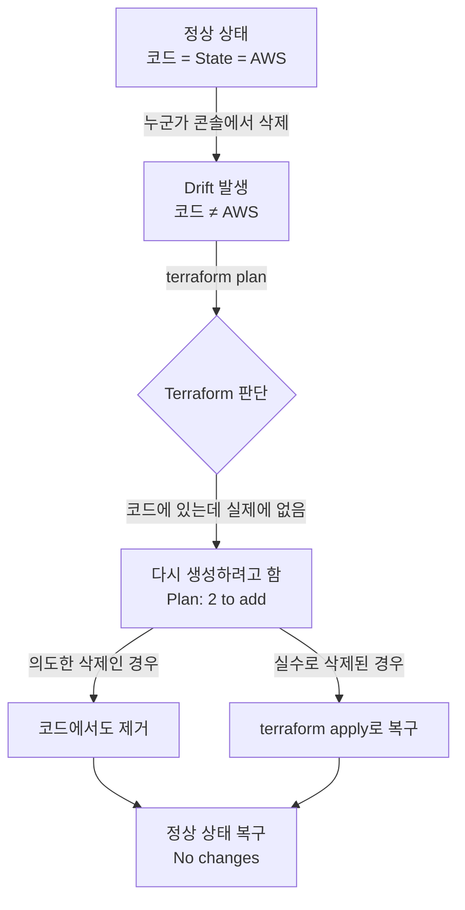

# 8단계: 웹 콘솔 삭제와 Drift 감지 실습

[< 이전 단계](./07_import.md) | [완료 및 요약 >](./walkthrough.md)

> **Terraform 공식 문서**: [terraform plan](https://developer.hashicorp.com/terraform/cli/commands/plan) | [terraform refresh](https://developer.hashicorp.com/terraform/cli/commands/refresh) | [State 관리](https://developer.hashicorp.com/terraform/language/state)

---

## 1. 개요

0단계에서 이론으로 배운 **Drift(코드 밖의 변경)**를 직접 재현합니다.

- **Drift란?**: Terraform 코드와 실제 AWS 리소스 상태가 일치하지 않는 상황.
- **발생 원인**: 누군가 웹 콘솔에서 리소스를 수동으로 변경하거나 삭제한 경우.

이번 단계에서는 7단계에서 Import한 `infra-member-01` 사용자를 **웹 콘솔에서 삭제**하고, Terraform이 이를 어떻게 감지하는지 확인합니다.

---

## 2. AWS 콘솔에서 사용자 삭제

### 2-1. 삭제 실행
1. AWS 콘솔 > **IAM** > **사용자(Users)**.
2. `infra-member-01` 선택 > **삭제** 클릭.
3. 확인 메시지에 사용자 이름을 입력하고 삭제를 완료합니다.

### 2-2. 현재 상황
| 위치 | `infra-member-01` 상태 |
| :--- | :--- |
| **AWS 실제 환경** | 삭제됨 (존재하지 않음) |
| **Terraform 코드** (`users.tf`) | 존재함 (코드에 정의되어 있음) |
| **Terraform State** (`tfstate`) | 존재함 (ID가 기록되어 있음) |

코드와 State에는 "있어야 한다"고 적혀 있지만, 실제로는 없습니다. 이것이 **Drift**입니다.

---

## 3. Terraform Plan으로 Drift 감지

```bash
terraform plan
```

### 예상 출력
```
module.iam.aws_iam_user.infra_member_01: Refreshing state...
module.iam.aws_iam_user_group_membership.infra_member_01: Refreshing state...

Terraform will perform the following actions:

  # module.iam.aws_iam_user.infra_member_01 will be created
  + resource "aws_iam_user" "infra_member_01" {
      + name = "infra-member-01"
      ...
    }

  # module.iam.aws_iam_user_group_membership.infra_member_01 will be created
  + resource "aws_iam_user_group_membership" "infra_member_01" {
      + user   = "infra-member-01"
      + groups = ["infra-team"]
    }

Plan: 2 to add, 0 to change, 0 to destroy.
```

Terraform은 *"코드에는 사용자가 있어야 하는데, 실제로는 없다"*고 판단하여 **다시 생성하려고 합니다.**
이것이 바로 0단계에서 배운 **Case 3: 좀비 리소스**와 동일한 상황입니다.

> **주의**: 여기서 `terraform apply`를 실행하면, 삭제한 사용자가 다시 살아납니다.
> 의도한 삭제였다면 **코드도 함께 정리**해야 합니다.

---

## 4. Drift 해소: 코드 정리

의도적으로 삭제한 것이므로, Terraform 코드에서도 해당 리소스를 제거합니다.

### 4-1. `modules/iam/users.tf` 파일 삭제
**Windows (PowerShell)**:
```powershell
Remove-Item modules\iam\users.tf
```

**Linux / Mac (Bash)**:
```bash
rm modules/iam/users.tf
```

### 4-2. Plan 재확인
```bash
terraform plan
```

**결과**: `No changes. Your infrastructure matches the configuration.`

코드와 실제 상태가 다시 일치합니다.

---

## 5. Drift 시나리오 정리



| Drift 상황 | Terraform 동작 | 올바른 대응 |
| :--- | :--- | :--- |
| 콘솔에서 리소스 **삭제** | 코드에 있으므로 **다시 생성** 시도 | 의도한 삭제면 코드 제거, 실수면 `apply`로 복구 |
| 콘솔에서 리소스 **수정** | 코드와 다른 부분을 **원래대로 덮어쓰기** | 변경을 유지하려면 코드 수정, 아니면 `apply`로 원복 |
| 콘솔에서 리소스 **추가** | 코드에 없으므로 **인식 못함** | `import`로 편입하거나, 콘솔에서 삭제 |

---

## 이번 실습에서 배운 것

1. **웹 콘솔에서 만든 리소스**는 `terraform import`로 코드에 편입해야 안전합니다.
2. **웹 콘솔에서 삭제한 리소스**가 코드에 남아있으면, Terraform은 **다시 생성**합니다.
3. **코드와 실제 인프라는 항상 동기화**되어야 합니다. 한쪽만 변경하면 Drift가 발생합니다.
4. Drift를 예방하려면: **모든 변경은 반드시 Terraform 코드를 통해서만** 수행합니다.

---

## 수고하셨습니다!

Terraform의 핵심 개념인 **Import**와 **Drift**를 직접 체험했습니다.
이 경험은 실무에서 "누군가 콘솔에서 뭔가 바꿨는데 배포가 안 돼요"라는 상황을 해결하는 데 큰 도움이 됩니다.

이전에 생성한 모든 리소스는 `terraform destroy`로 깔끔하게 삭제할 수 있습니다.

---

[< 이전 단계](./07_import.md) | [완료 및 요약 >](./walkthrough.md)
