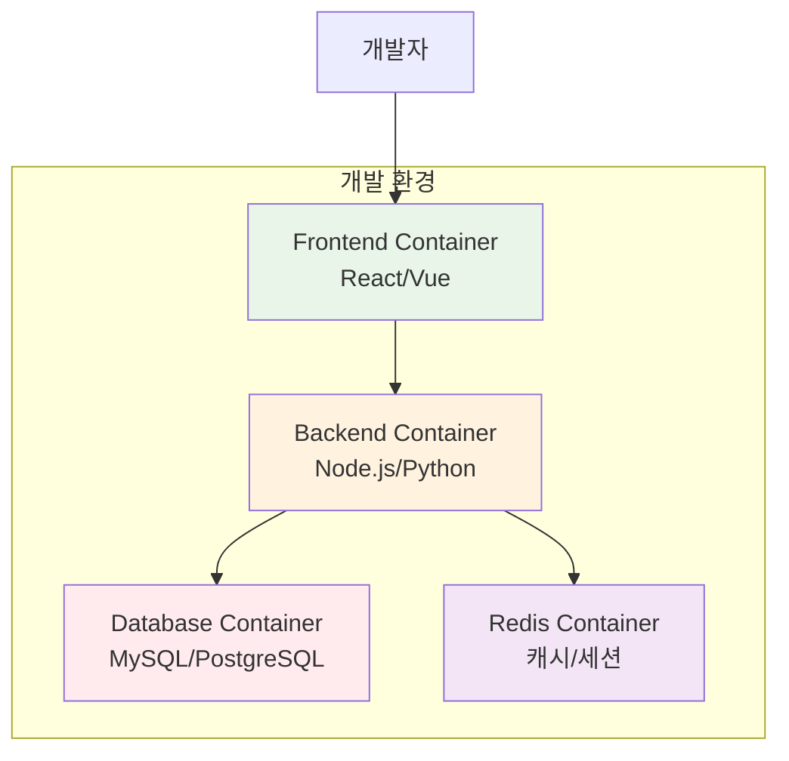

# Week 1: DevOps 문화와 Docker 기초

<div align="center">

**🎓 DevOps 철학 & 컨테이너 기술 입문** • **문화와 기술의 만남**

*전통적 개발 방식에서 현대적 DevOps 문화로, 그리고 컨테이너 기술의 첫걸음*


</div>

---

## 🎯 주간 학습 목표

### 📚 전체 공통 목표
> **DevOps 문화의 본질을 이해하고, 컨테이너 기술의 기초를 완전히 습득한다**

### 🎪 협업 중심 학습
- **모든 학생 함께**: 다양한 배경과 경험을 바탕으로 DevOps 문화 이해
- **자연스러운 역할 분담**: 각자의 강점을 살린 학습과 협업
- **상호 학습**: 서로 가르치고 배우며 함께 성장
- **실무 연계**: 현장에서 바로 적용할 수 있는 지식과 경험

---

## 📅 일일 학습 계획 (4일 구성)

### [Day 1: 오리엔테이션 & DevOps 개념 소개](./day1/README.md)
**🎯 목표**: 과정 이해 + 라포 형성 + DevOps 기본 개념 학습

#### 🕘 특별 구성 (첫날)
- **오리엔테이션**: 2시간 (과정소개 + 아이스브레이킹)
- **이론 강의**: 2시간 (DevOps 기초 개념)
- **기본 실습**: 2시간 (환경 설정 + 간단한 실습)
- **개별 상담**: 2시간 (1:1 라포 형성)

#### 🎯 핵심 내용
- DevOps 정의와 문화적 의미
- 전통적 개발 vs DevOps 비교
- 2025년 DevOps 트렌드 소개
- 개발 환경 설정 및 Git 기초

---

### [Day 2: 컨테이너 기술 & Docker 아키텍처](./day2/README.md)
**🎯 목표**: 가상화 vs 컨테이너 이해 + Docker 전체 구조 학습

#### 📚 이론 강의 (2.5시간)
- **Session 1**: 가상화 기술의 진화 (VM → Container)
- **Session 2**: Docker 아키텍처와 구성 요소
- **Session 3**: Docker Engine과 런타임 구조

#### 🛠️ 실습 챌린지 (3시간)
- **Phase 1**: Docker 설치 및 첫 컨테이너 실행
- **Phase 2**: 컨테이너 생명주기 실습
- **Phase 3**: Docker 기본 명령어 마스터

---

### [Day 3: Docker 이미지 & 네트워킹 & 스토리지](./day3/README.md)
**🎯 목표**: 이미지 구조 + 네트워킹 + 데이터 관리 통합 학습

#### 📚 이론 강의 (2.5시간)
- **Session 1**: Docker 이미지 구조와 레이어 시스템
- **Session 2**: Dockerfile 작성법과 베스트 프랙티스
- **Session 3**: Docker 네트워킹과 볼륨 관리

#### 🛠️ 실습 챌린지 (3시간)
- **Phase 1**: 커스텀 이미지 빌드 및 최적화
- **Phase 2**: 컨테이너 네트워킹 구성
- **Phase 3**: 데이터 영속성 구현

---

### [Day 4: Docker Compose & 멀티 컨테이너](./day4/README.md)
**🎯 목표**: Docker Compose 활용 + 실무 프로젝트 완성

#### 📚 이론 강의 (2.5시간)
- **Session 1**: Docker Compose 개념과 YAML 작성
- **Session 2**: 멀티 컨테이너 아키텍처 설계
- **Session 3**: 환경별 설정 관리 (dev/staging/prod)

#### 🛠️ 실습 챌린지 (3시간)
- **Phase 1**: 웹앱 + DB 멀티 컨테이너 구성
- **Phase 2**: 환경별 설정 분리
- **Phase 3**: Week 1 통합 프로젝트 완성

---

## 🛠️ 주간 통합 프로젝트

### 🎯 프로젝트 목표
**"컨테이너 기반 웹 애플리케이션 구축"**
- 실제 웹 애플리케이션의 컨테이너화
- 데이터베이스와 연동
- 개발/운영 환경 분리

### 👥 팀 구성 및 역할 (자연스러운 분담)
- **Frontend 팀**: React/Vue.js 애플리케이션 컨테이너화
- **Backend 팀**: Node.js/Python API 서버 구축
- **Database 팀**: PostgreSQL/Redis 컨테이너 구성
- **DevOps 팀**: Docker Compose 통합 및 모니터링

### 📋 프로젝트 요구사항
1. **웹 애플리케이션**: 간단한 CRUD 기능 (Day 4에서 완성)
2. **데이터베이스**: 컨테이너로 구성된 PostgreSQL + Redis
3. **환경 분리**: 개발/스테이징/프로덕션 환경 (Day 4)
4. **자동화**: Docker Compose로 원클릭 배포 (Day 4)
5. **모니터링**: 기본 로그 수집 및 메트릭 (Day 4)

### 🏗️ 아키텍처 예시


---

## 📊 주간 평가 기준

### ✅ 이해도 평가
- **DevOps 문화**: DevOps 철학과 문화적 변화 이해도
- **컨테이너 기술**: Docker 기본 개념과 활용 능력
- **실무 적용**: 실제 프로젝트에서의 적용 역량

### 🎯 성공 지표
- **전체 이해도**: 모든 학생 기본 개념 85% 이상 이해
- **협업 만족도**: 팀 프로젝트 만족도 4.5/5 이상
- **실습 완성률**: 개별 실습 완성률 90% 이상
- **개인 성장**: 각자의 강점 발견 및 역량 향상 체감

### 📋 평가 체크리스트
- [ ] DevOps 문화와 전통적 개발 방식의 차이점 설명 가능
- [ ] 가상화 기술의 진화 과정과 컨테이너의 장점 이해
- [ ] Docker 아키텍처와 기본 명령어로 컨테이너 관리 가능
- [ ] Dockerfile 작성하여 커스텀 이미지 빌드 및 최적화 가능
- [ ] Docker 네트워킹과 볼륨을 활용한 데이터 관리 가능
- [ ] Docker Compose로 멀티 컨테이너 애플리케이션 구성 가능
- [ ] 팀 프로젝트에서 자신의 역할 성공적으로 수행

---

## 🤝 협업 학습 하이라이트

### 🌟 다양성의 힘
- **세대 간 경험 공유**: 46세부터 24세까지의 다양한 인생 경험
- **전공 융합**: CS 전공자와 비전공자의 창의적 관점 결합
- **경력 상호 보완**: 신입부터 경력자까지의 지식과 경험 교환

### 🔄 자연스러운 멘토링
- **기술 멘토링**: 경험 많은 학생의 자발적 기술 지원
- **문화 멘토링**: 다양한 업계 경험을 통한 DevOps 문화 이해
- **학습 멘토링**: 서로 다른 학습 스타일의 상호 보완

### 🎯 개인 성장 포인트
- **자신감 향상**: 작은 성공 경험의 누적
- **협업 능력**: 실제 팀 프로젝트를 통한 협업 스킬 개발
- **기술 역량**: 개인의 관심사와 강점에 맞는 기술 습득

---

## 🔗 다음 주 연결

### 🚀 Week 2 준비사항
- Docker 기본 명령어 완전 숙달
- 컨테이너 네트워킹 개념 정리
- Docker Compose 활용법 복습
- 컨테이너 오케스트레이션 개념 예습

### 📚 추천 학습 자료
- [Docker 공식 문서](https://docs.docker.com/)
- [Docker 튜토리얼](https://www.docker.com/101-tutorial)
- [DevOps 문화 가이드](https://aws.amazon.com/devops/what-is-devops/)

### 🎯 심화 학습 주제 (개인별 관심사에 따라)
- **DevOps 문화**: 조직 변화 관리, 협업 도구
- **컨테이너 보안**: 이미지 스캔, 런타임 보안
- **성능 최적화**: 이미지 크기 최적화, 리소스 관리

---

## 📝 주간 회고

### 🤔 회고 질문
1. **Day 1**: DevOps 문화가 기존 개발 방식과 어떻게 다른지 체감했나요?
2. **Day 2**: 가상화에서 컨테이너로의 진화가 왜 필요한지 이해했나요?
3. **Day 3**: Dockerfile 작성과 이미지 최적화에서 가장 어려웠던 부분은?
4. **Day 4**: Docker Compose로 멀티 컨테이너 애플리케이션을 구축하며 느난 점은?
5. **전체**: 각자의 강점이 어떻게 팀에 기여했나요?

### 📈 개선 포인트
- **Day 1-2**: Docker 설치와 기본 명령어 사용 시 자주 발생한 실수
- **Day 3**: Dockerfile 작성과 이미진 빌드 시 문법 오류
- **Day 4**: Docker Compose YAML 파일 작성 시 들여쓰기와 문법 주의
- **전체**: 개념 이해와 실습 적용 간의 격차
- **협업**: 팀 협업에서 소통의 어려움과 개인별 학습 속도 차이 조정

### 🎉 성취 사항
- **Day 1**: DevOps 문화에 대한 깊은 이해 획득 및 라포 형성
- **Day 2**: 가상화에서 컨테이너로의 패러다임 전환 완전 이해
- **Day 3**: Docker 이미지 빌드와 네트워킹/스토리지 실무 능력 개발
- **Day 4**: Docker Compose로 실무 수준의 멀티 컨테이너 애플리케이션 구축
- **전체**: 다양한 배경의 동료들과 성공적인 협업 및 각자의 강점 발견

---

## 🔧 트러블슈팅 가이드

### 자주 발생하는 문제들
1. **Docker 설치 문제**: Windows/Mac 환경별 설치 이슈
2. **포트 충돌**: 컨테이너 포트 바인딩 문제
3. **이미지 빌드 실패**: Dockerfile 문법 오류
4. **네트워크 연결 문제**: 컨테이너 간 통신 이슈

### 해결 방법
```bash
# Docker 상태 확인
docker version
docker info

# 컨테이너 로그 확인
docker logs <container-name>

# 네트워크 확인
docker network ls
docker network inspect <network-name>

# 이미지 정리
docker system prune
```

---

<div align="center">

**🎓 DevOps 문화 이해** • **🐳 Docker 기초 완성** • **🤝 협업 경험 축적**

*Week 1을 통해 DevOps 여정의 첫걸음을 성공적으로 시작했습니다*

**다음 주**: [Week 2 - 컨테이너 오케스트레이션 기초](../week_02/README.md)

</div>