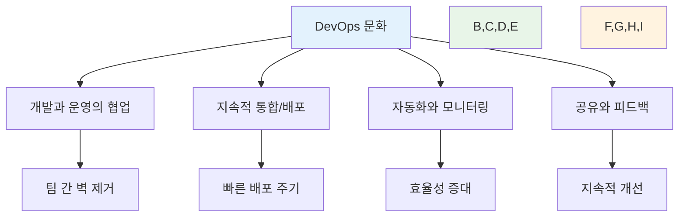

# Week 1 Day 1: 오리엔테이션 & DevOps 개념 소개

<div align="center">

**🎓 KT Cloud TECH UP 2025 시작** • **DevOps 여정의 첫걸음**

*라포 형성부터 첫 협업까지, 7개월 여정의 성공적인 출발*


</div>

---

## 🕘 일일 스케줄

### 📊 시간 배분 (첫날 특별 구성)
```
🎯 오리엔테이션: 1시간 (12.5%)
📚 이론 강의: 2시간 (25%) - DevOps 기초부터 트렌드까지
🛠️ 실습: 2시간 (25%) - 환경 설정 + GitHub 협업
👥 개별 상담: 1시간 (12.5%) - 맞춤형 지원 + 직무별 Q&A
🤝 협업 활동: 2시간 (25%) - 팀 빌딩 + 페어 프로그래밍
```

### 🗓️ 세션별 상세 일정
| 시간 | 세션 | 주제 | 목표 |
|------|------|------|------|
| **09:00-09:50** | [Session 1](./session_1.md) | 오리엔테이션 & 과정 소개 | 라포 형성 + 과정 이해 |
| **09:50-10:00** | ☕ 휴식 | 10분 휴식 | |
| **10:00-10:50** | [Session 2](./session_2.md) | DevOps 기본 개념 | DevOps 문화 이해 |
| **10:50-11:00** | ☕ 휴식 | 10분 휴식 | |
| **11:00-11:50** | [Session 3](./session_3.md) | DevOps 트렌드와 미래 | 최신 동향 파악 |
| **11:50-13:00** | 🍽️ 점심 | 점심시간 (70분) | |
| **13:00-13:50** | [Session 4](./session_4.md) | 개발 환경 설정 실습 | 도구 설치 + 기초 실습 |
| **13:50-14:00** | ☕ 휴식 | 10분 휴식 | |
| **14:00-14:50** | [Session 5](./session_5.md) | GitHub 협업 실습 | 협업 체험 + 결과 공유 |
| **14:50-15:00** | ☕ 휴식 | 10분 휴식 | |
| **15:00-16:00** | [Session 6](./session_6.md) | 개별 상담 & 직무별 Q&A | 맞춤 지원 + 진로 가이드 |

---

## 🎯 일일 학습 목표

### 📚 전체 목표
> **DevOps 문화를 이해하고, 협업 도구를 활용한 첫 팀 프로젝트 경험을 통해 7개월 여정의 기반을 다진다**

### 🎪 세션별 핵심 목표

#### Session 1: 오리엔테이션 & 과정 소개
- **이해**: KT Cloud TECH UP 2025 전체 구조와 목표
- **적용**: 개인 학습 목표 설정과 로드맵 수립
- **협업**: 12명 동료들과의 첫 만남과 친목 도모

#### Session 2: DevOps 기본 개념
- **이해**: DevOps 정의, CALMS 가치, 전통적 방식과의 차이점
- **적용**: 실무 시나리오에서 DevOps 문화의 필요성 인식
- **협업**: 페어 토론을 통한 개념 정리와 경험 공유

#### Session 3: DevOps 트렌드와 미래
- **이해**: 2025년 DevOps 트렌드와 도구 생태계
- **적용**: 미래 DevOps 전문가로서의 비전과 목표 설정
- **협업**: 관심 분야 공유와 학습 방향 논의

#### Session 4: 개발 환경 설정 실습
- **이해**: Git, VS Code, Docker의 역할과 중요성
- **적용**: 필수 도구 설치와 기본 사용법 습득
- **협업**: 페어 프로그래밍을 통한 상호 지원과 문제 해결

#### Session 5: GitHub 협업 실습
- **이해**: GitHub 기반 협업 워크플로우와 Pull Request
- **적용**: 실제 팀 프로젝트와 유사한 협업 경험
- **협업**: 코드 리뷰와 팀 단위 작업 체험

#### Session 6: 개별 상담 & 직무별 Q&A
- **이해**: 개인별 학습 현황과 목표 명확화
- **적용**: 7개월 과정에서의 개인별 학습 전략 수립
- **협업**: 동료들과의 협업 방향과 역할 설정

---

## 📖 핵심 학습 내용

### 🔍 DevOps 문화와 철학


### 🚀 2025년 DevOps 트렌드
- **Platform Engineering**: 개발자 경험 향상을 위한 내부 플랫폼
- **FinOps**: 클라우드 비용 최적화와 재무 운영
- **AI/MLOps**: 인공지능 모델 운영 자동화
- **Green DevOps**: 지속가능한 소프트웨어 개발

### 🛠️ 필수 도구 스택
- **Git**: 분산 버전 관리 시스템
- **VS Code**: 통합 개발 환경
- **Docker**: 컨테이너 플랫폼
- **GitHub**: 협업 및 코드 호스팅 플랫폼

---

## 🤝 협업 학습 하이라이트

### 🌟 다양성의 힘
**12명의 특별한 구성**:
- **연령대**: 1978년생(46세) ~ 2001년생(24세)
- **학력**: 고졸 2명, 대졸 9명, 재학생 1명
- **전공**: CS 전공 6명, 비전공 6명
- **경력**: 신입부터 경력자까지

### 🔄 자연스러운 협업
- **아이스브레이킹**: 3가지 키워드 자기소개로 친목 도모
- **페어 프로그래밍**: 도구 설치와 Git 실습에서 상호 지원
- **팀 프로젝트**: GitHub 협업으로 실제 개발 워크플로우 체험
- **개별 상담**: 각자의 학습 스타일과 목표에 맞는 맞춤 지원

### 🎯 협업 성과
- **라포 형성**: 편안하고 개방적인 학습 분위기 조성
- **상호 학습**: 서로 가르치고 배우는 문화 시작
- **문제 해결**: 어려운 부분을 함께 해결하는 경험
- **팀워크**: 실제 프로젝트와 유사한 협업 경험

---

## 📊 학습 성과 평가

### ✅ 이해도 체크리스트
- [ ] **DevOps 정의**: DevOps를 한 문장으로 설명할 수 있다
- [ ] **문화 이해**: 기술보다 문화가 중요함을 이해한다
- [ ] **트렌드 파악**: 2025년 주요 DevOps 트렌드를 안다
- [ ] **도구 활용**: Git, Docker 기본 명령어를 사용할 수 있다
- [ ] **협업 경험**: GitHub Pull Request 워크플로우를 이해한다

### 🎯 협업 성과 지표
- **참여도**: 모든 학생이 적극적으로 참여 ✅
- **상호작용**: 페어 활동과 팀 프로젝트 활발한 진행 ✅
- **문제해결**: 어려운 부분을 서로 도우며 해결 ✅
- **만족도**: 첫날 학습과 협업에 대한 높은 만족도 ✅

### 📈 개인 성장 포인트
- **자신감**: 새로운 도구와 개념 학습에 대한 자신감 향상
- **협업 능력**: 다양한 배경의 동료들과 협업하는 능력 개발
- **학습 동기**: DevOps 전문가로 성장하고자 하는 명확한 동기 형성
- **네트워킹**: 함께 성장할 동료들과의 관계 형성

---

## 🔑 핵심 키워드 정리

### DevOps 기본 개념
- **DevOps**: Development + Operations, 개발과 운영의 협업 문화
- **CALMS**: Culture, Automation, Lean, Measurement, Sharing
- **CI/CD**: Continuous Integration/Continuous Deployment
- **Infrastructure as Code**: 인프라를 코드로 관리하는 방식

### 협업 도구
- **Git**: 분산 버전 관리 시스템
- **GitHub**: Git 기반 협업 플랫폼
- **Pull Request**: 코드 변경사항 검토 및 병합 요청
- **Code Review**: 동료 간 코드 검토 과정

### 2025 트렌드
- **Platform Engineering**: 개발자 경험 향상 플랫폼
- **FinOps**: 클라우드 재무 운영
- **MLOps**: 머신러닝 운영 자동화
- **Green DevOps**: 지속가능한 개발

---

## 🔗 다음 단계 연결

### 🚀 Day 2 준비사항
- **주제**: 컨테이너 기술 이론 (가상화 vs 컨테이너)
- **준비사항**: 
  - Docker 정상 작동 확인
  - 가상머신 사용 경험 떠올려보기
- **연결고리**: DevOps 문화 → 컨테이너 기술로 자연스러운 확장

### 📚 추천 복습 자료
- [DevOps 문화 가이드](https://aws.amazon.com/devops/what-is-devops/)
- [Git 기초 튜토리얼](https://git-scm.com/docs/gittutorial)
- [GitHub 협업 가이드](https://docs.github.com/en/pull-requests/collaborating-with-pull-requests)

### 🎯 주간 목표와의 연결
- **Week 1 목표**: DevOps 문화와 Docker 기초 완성
- **Day 1 성과**: DevOps 문화 이해 완료 ✅
- **Day 2-5 계획**: 컨테이너 기술 심화 학습

---

## 📝 일일 회고

### 🤔 회고 질문
1. **학습 측면**: "DevOps 개념 중 가장 인상 깊었던 부분은?"
2. **협업 측면**: "동료들과의 첫 협업에서 배운 점은?"
3. **도구 측면**: "실습에서 가장 어려웠던 부분과 해결 방법은?"
4. **미래 측면**: "7개월 후 어떤 DevOps 전문가가 되고 싶나요?"

### 📈 개선 포인트
- **시간 관리**: 실습 시간 배분 최적화
- **난이도 조절**: 개인별 수준 차이 고려한 추가 지원
- **협업 효율**: 페어/팀 구성 방식 개선
- **피드백**: 실시간 이해도 체크 방법 보완

### 🎉 성취 사항
- **완벽한 출발**: 모든 학생이 첫날 과정 완주
- **협업 문화**: 자연스러운 상호 지원과 학습 분위기 조성
- **기술 기반**: DevOps 필수 도구 환경 구축 완료
- **팀워크**: 실제 개발팀과 유사한 협업 경험 완료

---

<div align="center">

**🎉 Week 1 Day 1 성공적 완주! 🎉**

*DevOps 문화 이해부터 첫 협업까지, 완벽한 시작*

**세션 목록**: [Session 1](./session_1.md) | [Session 2](./session_2.md) | [Session 3](./session_3.md) | [Session 4](./session_4.md) | [Session 5](./session_5.md) | [Session 6](./session_6.md)

**다음**: [Day 2 - 컨테이너 기술 & Docker 아키텍처](../day2/README.md)

</div>